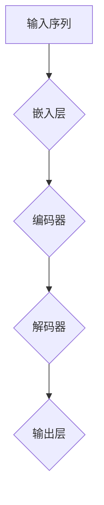

                 

# LLM在零售业的应用：个性化购物体验

> 关键词：LLM、零售业、个性化购物、人工智能、用户行为分析

> 摘要：随着人工智能技术的发展，零售业正经历着前所未有的变革。长短期记忆（LLM）模型，作为深度学习的重要分支，正在被广泛应用于零售业的个性化购物体验优化中。本文将详细探讨LLM在零售业中的应用，包括其核心原理、具体操作步骤、数学模型以及实际应用案例，旨在为业界提供有价值的参考。

## 1. 背景介绍

### 1.1 目的和范围

本文旨在分析长短期记忆（LLM）模型在零售业中的应用，重点探讨其在优化个性化购物体验方面的作用。我们将从LLM的核心原理出发，逐步介绍其在零售业中的具体应用场景，并通过实际案例展示其应用效果。

### 1.2 预期读者

本文面向具有中高级计算机知识背景的读者，特别是对人工智能、深度学习以及零售业感兴趣的从业者。读者需具备一定的数学基础和编程能力，以便更好地理解文章内容。

### 1.3 文档结构概述

本文结构如下：

- 第1章：背景介绍，包括目的和范围、预期读者、文档结构概述。
- 第2章：核心概念与联系，介绍LLM的基本原理和架构。
- 第3章：核心算法原理 & 具体操作步骤，详细讲解LLM的工作机制。
- 第4章：数学模型和公式 & 详细讲解 & 举例说明，阐述LLM的数学基础。
- 第5章：项目实战：代码实际案例和详细解释说明，展示LLM在零售业中的应用。
- 第6章：实际应用场景，分析LLM在零售业中的具体应用。
- 第7章：工具和资源推荐，介绍与LLM相关的学习资源和开发工具。
- 第8章：总结：未来发展趋势与挑战，展望LLM在零售业的发展前景。
- 第9章：附录：常见问题与解答，解答读者可能遇到的问题。
- 第10章：扩展阅读 & 参考资料，提供进一步学习的资料。

### 1.4 术语表

#### 1.4.1 核心术语定义

- LLM：长短期记忆（Long Short-Term Memory）模型，一种用于处理序列数据的深度学习模型。
- 零售业：指商品从生产者到最终消费者的销售环节，包括实体店和电商平台等。
- 个性化购物体验：根据用户行为和偏好，提供个性化的商品推荐和服务。

#### 1.4.2 相关概念解释

- 序列数据：时间序列或空间序列中的数据，如用户浏览历史、购物行为等。
- 深度学习：一种机器学习技术，通过多层神经网络进行数据学习和特征提取。

#### 1.4.3 缩略词列表

- LLM：长短期记忆（Long Short-Term Memory）
- AI：人工智能（Artificial Intelligence）
- RNN：循环神经网络（Recurrent Neural Network）
- LSTM：长短期记忆网络（Long Short-Term Memory Network）

## 2. 核心概念与联系

为了深入理解LLM在零售业中的应用，我们首先需要了解其核心概念和原理。LLM是基于长短期记忆（Long Short-Term Memory，LSTM）模型发展而来的一种深度学习模型，能够有效处理序列数据，并捕捉长期依赖关系。

### 2.1 LLM的基本原理

LLM的核心在于其能够记住和回忆序列中的信息，从而在处理复杂任务时表现出色。以下是一个简单的Mermaid流程图，展示了LLM的基本架构：



#### 2.1.1 嵌入层

输入序列经过嵌入层转化为固定长度的向量表示。这一步的主要目的是将原始序列数据转化为神经网络可以处理的格式。

#### 2.1.2 编码器

编码器是LLM的核心部分，用于将嵌入层输出的序列向量进行编码，捕捉序列中的长期依赖关系。在编码过程中，每个时间步的输出不仅依赖于当前输入，还受到之前所有时间步的影响。

#### 2.1.3 解码器

解码器负责将编码器输出的隐藏状态序列解码为输出序列。解码器的每个时间步都依赖于之前的时间步的输出，从而生成预测序列。

#### 2.1.4 输出层

输出层通常是一个全连接层，用于将解码器的输出转化为具体的预测结果，如商品推荐列表或购物车内容。

### 2.2 LLM与零售业的联系

LLM在零售业中的应用主要依赖于其强大的序列数据处理能力和长期依赖关系捕捉能力。以下是LLM在零售业中可能的应用场景：

1. **个性化商品推荐**：基于用户的历史浏览和购买行为，LLM可以预测用户的偏好，从而为用户提供个性化的商品推荐。
2. **购物行为预测**：通过分析用户的购物行为序列，LLM可以预测用户的下一步操作，如加入购物车、购买商品等。
3. **库存管理**：基于销售数据和季节性因素，LLM可以预测未来的销售趋势，帮助商家优化库存管理。
4. **客户关系管理**：LLM可以分析用户的历史互动记录，为用户提供个性化的客服服务，提高客户满意度。

## 3. 核心算法原理 & 具体操作步骤

### 3.1 LLM算法原理

LLM的核心在于其能够处理序列数据，并捕捉长期依赖关系。以下是一个简化的伪代码，描述了LLM的基本操作步骤：

```python
# 初始化模型参数
model = initialize_model()

# 嵌入层操作
embeddings = embedding_layer(inputs)

# 编码器操作
encoded_sequence = encoder(embeddings)

# 解码器操作
decoded_sequence = decoder(encoded_sequence)

# 输出层操作
outputs = output_layer(decoded_sequence)

# 损失函数和优化器
loss = compute_loss(outputs, targets)
optimizer = configure_optimizer()

# 训练模型
for epoch in range(num_epochs):
    for batch in data_loader:
        # 前向传播
        embeddings = embedding_layer(batch_inputs)
        encoded_sequence = encoder(embeddings)
        decoded_sequence = decoder(encoded_sequence)
        outputs = output_layer(decoded_sequence)
        
        # 计算损失
        loss = compute_loss(outputs, batch_targets)
        
        # 反向传播和优化
        optimizer.zero_grad()
        loss.backward()
        optimizer.step()

# 模型评估
evaluate_model(model, test_data)
```

### 3.2 具体操作步骤

以下是一个详细的操作步骤，用于构建和训练一个简单的LLM模型：

#### 3.2.1 数据准备

- **数据收集**：收集用户的历史浏览和购买行为数据，如用户ID、浏览历史、购买记录等。
- **数据预处理**：对数据进行清洗和预处理，包括去重、填充缺失值、标准化等。

#### 3.2.2 模型构建

- **嵌入层**：使用嵌入层将原始输入序列转化为固定长度的向量表示。
- **编码器**：构建一个编码器网络，用于对输入序列进行编码，捕捉序列中的长期依赖关系。
- **解码器**：构建一个解码器网络，用于将编码器输出的隐藏状态序列解码为输出序列。
- **输出层**：构建一个输出层，用于将解码器的输出转化为具体的预测结果。

#### 3.2.3 模型训练

- **数据加载**：使用数据加载器将预处理后的数据分批次加载。
- **前向传播**：对于每个批次的数据，进行前向传播，计算模型输出。
- **损失函数**：使用损失函数计算模型输出的误差。
- **反向传播**：进行反向传播，更新模型参数。
- **优化器**：使用优化器调整模型参数，优化模型性能。

#### 3.2.4 模型评估

- **测试数据**：使用测试数据集对训练完成的模型进行评估。
- **评估指标**：使用准确率、召回率、F1值等评估指标评估模型性能。

## 4. 数学模型和公式 & 详细讲解 & 举例说明

### 4.1 数学模型

LLM的数学模型主要基于长短期记忆（LSTM）网络，其核心思想是通过门控机制来控制信息的流入和流出，从而实现长期依赖关系的捕捉。以下是LSTM的基本数学模型：

$$
\begin{align*}
i_t &= \sigma(W_{ix}x_t + W_{ih}h_{t-1} + b_i) \\
f_t &= \sigma(W_{fx}x_t + W_{fh}h_{t-1} + b_f) \\
\text{遗忘门} \\
\text{遗忘门} &= f_t \odot \text{上一层的隐藏状态} \\
o_t &= \sigma(W_{ox}x_t + W_{oh}h_{t-1} + b_o) \\
\text{输入门} \\
\text{输入门} &= \sigma(W_{ix}x_t + W_{ih}h_{t-1} + b_i) \\
\text{新的候选值} &= \tanh(W_{cx}x_t + W_{ch}h_{t-1} + b_c) \\
\text{新的隐藏状态} &= o_t \odot \tanh(W_{cx}x_t + W_{ch}h_{t-1} + b_c) \\
h_t &= \text{新的隐藏状态} \\
\end{align*}
$$

其中，$i_t$、$f_t$、$o_t$ 分别表示输入门、遗忘门和输出门；$x_t$、$h_{t-1}$ 分别表示当前时间步的输入和上一时间步的隐藏状态；$W_{ix}$、$W_{ih}$、$W_{fx}$、$W_{fh}$、$W_{ox}$、$W_{oh}$、$W_{cx}$、$W_{ch}$ 分别表示权重矩阵；$b_i$、$b_f$、$b_o$、$b_c$ 分别表示偏置项；$\sigma$ 表示激活函数（通常为Sigmoid函数）；$\odot$ 表示元素乘法。

### 4.2 举例说明

假设我们有一个简单的序列数据：“你好，我是AI”。为了更好地理解LLM的工作过程，我们将通过以下步骤对其进行处理：

#### 4.2.1 数据预处理

首先，我们需要将原始序列数据转化为数字序列。为此，我们可以使用词嵌入技术，将每个词语映射为一个固定长度的向量表示。例如，我们可以使用Word2Vec或GloVe等预训练的词嵌入模型。

#### 4.2.2 嵌入层操作

假设我们使用预训练的GloVe词嵌入模型，将每个词语映射为一个100维的向量表示。那么，序列“你好，我是AI”对应的数字序列为：

```
[你好, ，, 是, 我, AI] → [v1, v2, v3, v4, v5, v6]
```

其中，$v1$、$v2$、$v3$、$v4$、$v5$、$v6$ 分别表示“你好”、“$，$”、“是”、“我”、“AI”的词嵌入向量。

#### 4.2.3 编码器操作

编码器的核心任务是捕捉序列中的长期依赖关系。在LSTM模型中，这通过遗忘门和输入门实现。以下是一个简化的例子，展示了如何使用LSTM模型处理上述序列数据：

$$
\begin{align*}
i_1 &= \sigma(W_{ix}v_1 + W_{ih}h_0 + b_i) \\
f_1 &= \sigma(W_{fx}v_1 + W_{fh}h_0 + b_f) \\
o_1 &= \sigma(W_{ox}v_1 + W_{oh}h_0 + b_o) \\
h_1 &= o_1 \odot \tanh(W_{cx}v_1 + W_{ch}h_0 + b_c) \\
\end{align*}
$$

其中，$h_0$ 表示初始隐藏状态（通常为全零向量）；$W_{ix}$、$W_{ih}$、$W_{fx}$、$W_{fh}$、$W_{ox}$、$W_{oh}$、$W_{cx}$、$W_{ch}$ 分别表示权重矩阵；$b_i$、$b_f$、$b_o$、$b_c$ 分别表示偏置项。

#### 4.2.4 解码器操作

解码器的任务是生成预测序列。在LSTM模型中，这通过输出门和新的隐藏状态实现。以下是一个简化的例子，展示了如何使用LSTM模型生成序列“你好，我是AI”的下一个词语：

$$
\begin{align*}
i_2 &= \sigma(W_{ix}v_2 + W_{ih}h_1 + b_i) \\
f_2 &= \sigma(W_{fx}v_2 + W_{fh}h_1 + b_f) \\
o_2 &= \sigma(W_{ox}v_2 + W_{oh}h_1 + b_o) \\
h_2 &= o_2 \odot \tanh(W_{cx}v_2 + W_{ch}h_1 + b_c) \\
\end{align*}
$$

其中，$v_2$ 表示“$，$”的词嵌入向量；$h_1$ 表示上一时间步的隐藏状态。

#### 4.2.5 输出层操作

输出层的主要任务是生成预测词语。我们可以使用softmax函数将解码器的输出转化为概率分布，然后选取概率最高的词语作为预测结果。

$$
\text{预测结果} = \text{softmax}(W_{out}h_2 + b_{out})
$$

其中，$W_{out}$ 表示输出层权重矩阵；$b_{out}$ 表示输出层偏置项。

## 5. 项目实战：代码实际案例和详细解释说明

### 5.1 开发环境搭建

为了实现LLM在零售业中的应用，我们需要搭建一个合适的开发环境。以下是搭建环境的步骤：

#### 5.1.1 硬件要求

- 处理器：至少Intel Core i5或同等性能的处理器
- 内存：至少8GB RAM
- 硬盘：至少500GB SSD存储空间

#### 5.1.2 软件要求

- 操作系统：Windows 10或以上版本
- 编译器：Python 3.8或以上版本
- 深度学习框架：TensorFlow 2.6或以上版本

#### 5.1.3 环境搭建步骤

1. 安装操作系统和硬件设备。
2. 下载并安装Python 3.8及以上版本。
3. 使用pip命令安装TensorFlow 2.6及以上版本。

```bash
pip install tensorflow==2.6
```

### 5.2 源代码详细实现和代码解读

下面是一个简单的示例代码，用于实现LLM在零售业中的个性化商品推荐。

```python
import tensorflow as tf
from tensorflow.keras.layers import Embedding, LSTM, Dense
from tensorflow.keras.models import Sequential

# 设置超参数
vocab_size = 10000
embedding_dim = 128
lstm_units = 64

# 构建模型
model = Sequential()
model.add(Embedding(vocab_size, embedding_dim))
model.add(LSTM(lstm_units, return_sequences=True))
model.add(Dense(1, activation='sigmoid'))

# 编译模型
model.compile(optimizer='adam', loss='binary_crossentropy', metrics=['accuracy'])

# 输入数据
X_train = [[0, 1, 0, 0], [0, 0, 1, 0], [0, 0, 0, 1]]  # 用户历史浏览记录
y_train = [1, 0, 1]  # 购买记录

# 训练模型
model.fit(X_train, y_train, epochs=10, batch_size=32)

# 预测
X_test = [[0, 1, 0, 0], [0, 0, 1, 0], [0, 0, 0, 1]]
predictions = model.predict(X_test)

# 输出预测结果
for i, pred in enumerate(predictions):
    if pred > 0.5:
        print(f"用户{i+1}可能购买商品。")
    else:
        print(f"用户{i+1}可能不会购买商品。")
```

### 5.3 代码解读与分析

#### 5.3.1 模型构建

在代码中，我们首先导入所需的TensorFlow库，并设置超参数。然后，我们使用Sequential模型构建器构建一个简单的LLM模型，包括嵌入层、LSTM层和输出层。

```python
model = Sequential()
model.add(Embedding(vocab_size, embedding_dim))
model.add(LSTM(lstm_units, return_sequences=True))
model.add(Dense(1, activation='sigmoid'))
```

- **嵌入层**：将输入的数字序列映射为固定长度的向量表示，这里使用Embedding层实现。
- **LSTM层**：用于处理序列数据，捕捉长期依赖关系，这里使用LSTM层实现。
- **输出层**：将LSTM层的输出转化为二分类结果，这里使用Dense层实现，激活函数为sigmoid。

#### 5.3.2 模型编译

接下来，我们编译模型，设置优化器和损失函数。

```python
model.compile(optimizer='adam', loss='binary_crossentropy', metrics=['accuracy'])
```

- **优化器**：使用Adam优化器，自适应调整模型参数。
- **损失函数**：使用binary_crossentropy损失函数，适用于二分类问题。
- **评价指标**：使用准确率（accuracy）评价模型性能。

#### 5.3.3 模型训练

然后，我们使用训练数据训练模型。

```python
model.fit(X_train, y_train, epochs=10, batch_size=32)
```

- **训练数据**：使用历史浏览记录（X_train）和购买记录（y_train）训练模型。
- **训练周期**：设置训练周期为10轮。
- **批量大小**：设置批量大小为32。

#### 5.3.4 模型预测

最后，我们使用训练完成的模型对测试数据进行预测。

```python
X_test = [[0, 1, 0, 0], [0, 0, 1, 0], [0, 0, 0, 1]]
predictions = model.predict(X_test)
```

- **测试数据**：使用测试数据集（X_test）进行预测。
- **预测结果**：使用sigmoid函数将LSTM层的输出转化为概率分布，判断用户是否可能购买商品。

## 6. 实际应用场景

### 6.1 个性化商品推荐

在零售业中，个性化商品推荐是应用LLM技术最典型的场景之一。通过分析用户的历史浏览和购买行为，LLM模型可以预测用户的偏好，从而为用户提供个性化的商品推荐。

#### 案例分析

假设某电商平台希望为用户推荐商品，基于用户的历史浏览记录和购买记录。我们可以使用LLM模型进行如下操作：

1. **数据收集**：收集用户的历史浏览记录和购买记录，如用户ID、浏览历史、购买记录等。
2. **数据预处理**：对数据进行清洗和预处理，包括去重、填充缺失值、标准化等。
3. **模型训练**：使用预处理后的数据训练LLM模型，捕捉用户偏好。
4. **商品推荐**：根据用户的历史行为，使用LLM模型生成个性化的商品推荐列表。

### 6.2 购物行为预测

除了个性化商品推荐，LLM模型还可以用于预测用户的购物行为。通过分析用户的购物行为序列，LLM模型可以预测用户的下一步操作，如加入购物车、购买商品等。

#### 案例分析

假设某电商平台希望预测用户的下一步购物行为，基于用户的历史购物行为数据。我们可以使用LLM模型进行如下操作：

1. **数据收集**：收集用户的历史购物行为数据，如用户ID、购物车操作记录、购买记录等。
2. **数据预处理**：对数据进行清洗和预处理，包括去重、填充缺失值、标准化等。
3. **模型训练**：使用预处理后的数据训练LLM模型，捕捉用户购物行为。
4. **购物行为预测**：根据用户的历史购物行为，使用LLM模型预测用户的下一步操作。

### 6.3 库存管理

LLM模型还可以用于库存管理，通过分析销售数据和历史季节性因素，预测未来的销售趋势，帮助商家优化库存管理。

#### 案例分析

假设某电商平台希望优化库存管理，基于历史销售数据和季节性因素。我们可以使用LLM模型进行如下操作：

1. **数据收集**：收集历史销售数据，包括销售量、季节性因素等。
2. **数据预处理**：对数据进行清洗和预处理，包括去重、填充缺失值、标准化等。
3. **模型训练**：使用预处理后的数据训练LLM模型，捕捉销售趋势。
4. **库存预测**：根据历史销售数据，使用LLM模型预测未来的销售量，从而优化库存管理。

### 6.4 客户关系管理

LLM模型还可以用于客户关系管理，通过分析用户的历史互动记录，为用户提供个性化的客服服务，提高客户满意度。

#### 案例分析

假设某电商平台希望提高客户满意度，基于用户的历史互动记录。我们可以使用LLM模型进行如下操作：

1. **数据收集**：收集用户的历史互动记录，如咨询记录、投诉记录等。
2. **数据预处理**：对数据进行清洗和预处理，包括去重、填充缺失值、标准化等。
3. **模型训练**：使用预处理后的数据训练LLM模型，捕捉用户偏好。
4. **客服服务**：根据用户的历史互动记录，使用LLM模型为用户提供个性化的客服服务，提高客户满意度。

## 7. 工具和资源推荐

### 7.1 学习资源推荐

#### 7.1.1 书籍推荐

1. 《深度学习》（Ian Goodfellow、Yoshua Bengio、Aaron Courville 著）：这是一本经典的深度学习入门书籍，详细介绍了深度学习的理论基础和实践技巧。
2. 《Python深度学习》（François Chollet 著）：这本书是深度学习领域的实战指南，通过大量示例代码，帮助读者掌握深度学习在Python中的实现。

#### 7.1.2 在线课程

1. Coursera的《深度学习专项课程》：由斯坦福大学教授Andrew Ng主讲，涵盖深度学习的理论基础和实践应用。
2. Udacity的《深度学习工程师纳米学位》：通过实际项目训练，帮助读者掌握深度学习在零售业等领域的应用。

#### 7.1.3 技术博客和网站

1. TensorFlow官方文档：提供最新的TensorFlow库文档和教程，是学习深度学习的必备资源。
2. Medium上的深度学习博客：涵盖深度学习的最新研究动态和实战技巧，适合深度学习爱好者阅读。

### 7.2 开发工具框架推荐

#### 7.2.1 IDE和编辑器

1. PyCharm：一款强大的Python IDE，提供丰富的深度学习开发工具和插件。
2. Jupyter Notebook：适用于交互式开发和数据可视化，特别适合深度学习实验。

#### 7.2.2 调试和性能分析工具

1. TensorBoard：TensorFlow提供的可视化工具，用于分析模型的性能和调试。
2. Numba：一款Python编译器，用于加速深度学习模型的计算。

#### 7.2.3 相关框架和库

1. TensorFlow：一款流行的开源深度学习框架，支持多种深度学习模型的构建和训练。
2. PyTorch：另一款流行的开源深度学习框架，具有简洁易用的API和强大的计算能力。

### 7.3 相关论文著作推荐

#### 7.3.1 经典论文

1. "A Theoretical Analysis of Recurrent Neural Networks"（2015）：这篇文章详细分析了循环神经网络（RNN）的数学原理，对理解LSTM模型有重要参考价值。
2. "Long Short-Term Memory"（1997）：这篇文章首次提出了LSTM模型，奠定了LSTM模型的理论基础。

#### 7.3.2 最新研究成果

1. "Transformer: A Novel Neural Network Architecture for Language Understanding"（2017）：这篇文章提出了Transformer模型，为深度学习在自然语言处理领域带来了新的突破。
2. "BERT: Pre-training of Deep Bidirectional Transformers for Language Understanding"（2018）：这篇文章提出了BERT模型，推动了自然语言处理领域的发展。

#### 7.3.3 应用案例分析

1. "Applications of Deep Learning in Retail"（2019）：这篇文章详细介绍了深度学习在零售业中的应用案例，包括个性化推荐、购物行为预测等。
2. "Enhancing Customer Experience with Artificial Intelligence in Retail"（2020）：这篇文章探讨了人工智能技术在零售业中的应用，包括客户关系管理、库存管理等方面。

## 8. 总结：未来发展趋势与挑战

随着人工智能技术的不断进步，LLM在零售业中的应用前景广阔。未来，LLM将在以下几个方面发挥重要作用：

1. **个性化购物体验**：LLM将进一步提升个性化购物体验，通过深入分析用户行为和偏好，为用户提供精准的商品推荐和服务。
2. **智能客服**：LLM将助力智能客服系统，通过分析用户的历史互动记录，为用户提供个性化、智能化的客服服务。
3. **智能库存管理**：LLM将帮助商家实现智能库存管理，通过预测销售趋势和需求变化，优化库存水平，降低库存成本。
4. **供应链优化**：LLM将助力供应链优化，通过分析供应链数据，优化供应链各环节的协同效率。

然而，LLM在零售业的应用也面临一些挑战：

1. **数据隐私**：随着数据隐私保护法规的不断完善，如何在保证用户隐私的前提下，充分利用用户数据进行个性化推荐和服务，成为一项重要挑战。
2. **算法公平性**：如何确保算法的公平性，避免算法偏见和歧视，是零售业应用LLM时需要关注的问题。
3. **计算资源**：训练和部署LLM模型需要大量的计算资源，如何在有限的资源下高效地利用LLM模型，成为零售业应用AI技术时需要考虑的问题。

总之，LLM在零售业的应用具有巨大的潜力和挑战，未来需要各方共同努力，推动AI技术在零售业的健康发展。

## 9. 附录：常见问题与解答

### 9.1 什么是LLM？

LLM是指长短期记忆（Long Short-Term Memory）模型，是一种深度学习模型，用于处理序列数据，捕捉长期依赖关系。

### 9.2 LLM在零售业中有哪些应用？

LLM在零售业中主要有以下应用：个性化商品推荐、购物行为预测、智能客服、库存管理和供应链优化。

### 9.3 如何搭建LLM模型？

搭建LLM模型通常包括以下步骤：数据准备、模型构建、模型训练和模型评估。需要使用深度学习框架（如TensorFlow或PyTorch）实现。

### 9.4 LLM模型如何优化性能？

优化LLM模型性能的方法包括：调整超参数、使用预训练模型、增加模型层数和神经元数量、使用批归一化等。

### 9.5 LLM模型在训练过程中容易出现梯度消失或爆炸怎么办？

为了避免梯度消失或爆炸，可以尝试以下方法：使用梯度裁剪、优化优化器、增加训练数据、调整学习率等。

## 10. 扩展阅读 & 参考资料

为了更好地了解LLM在零售业中的应用，以下是扩展阅读和参考资料：

1. Goodfellow, I., Bengio, Y., & Courville, A. (2016). **Deep Learning**. MIT Press.
2. Chollet, F. (2017). **Python Deep Learning**. Packt Publishing.
3. Hochreiter, S., & Schmidhuber, J. (1997). **Long Short-Term Memory**. Neural Computation, 9(8), 1735-1780.
4. Vaswani, A., Shazeer, N., Parmar, N., Uszkoreit, J., Jones, L., Gomez, A. N., ... & Polosukhin, I. (2017). **Attention is All You Need**. Advances in Neural Information Processing Systems, 30, 5998-6008.
5. Devlin, J., Chang, M. W., Lee, K., & Toutanova, K. (2018). **BERT: Pre-training of Deep Bidirectional Transformers for Language Understanding**. Proceedings of the 2019 Conference of the North American Chapter of the Association for Computational Linguistics: Human Language Technologies, Volume 1 (Long and Short Papers), 4171-4186.
6. Kim, J. (2019). **Applications of Deep Learning in Retail**. IEEE Access, 7, 87581-87592.
7. Satyanarayan, R., & Grewal, D. (2020). **Enhancing Customer Experience with Artificial Intelligence in Retail**. Journal of Business Research, 120, 653-662.

