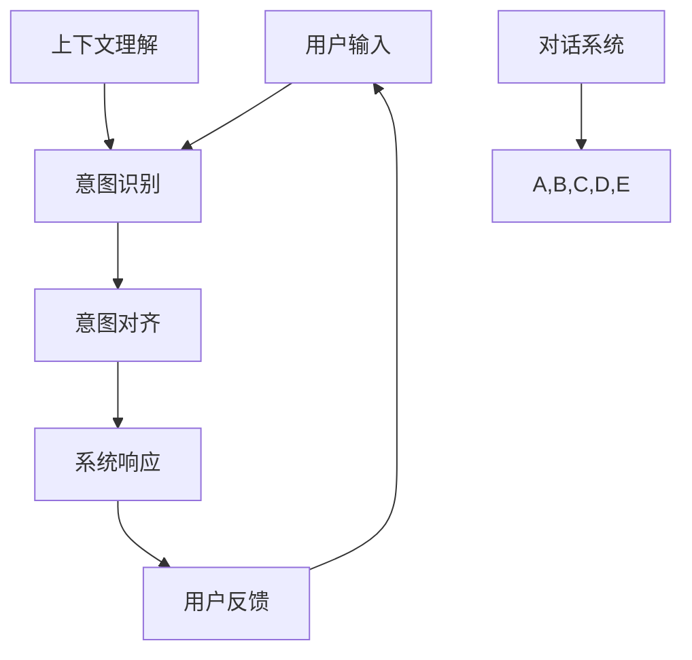
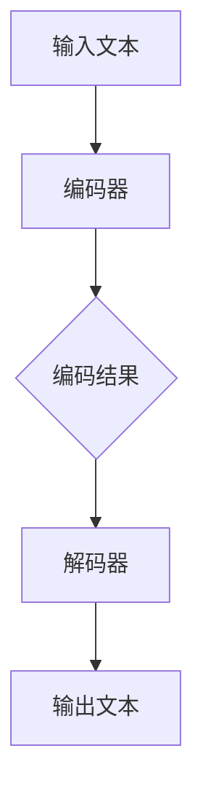
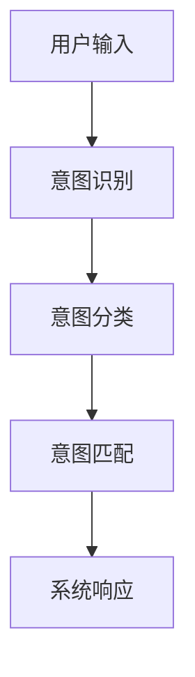
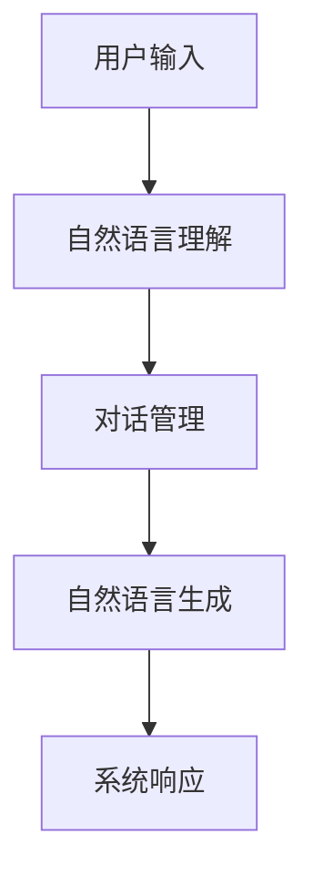
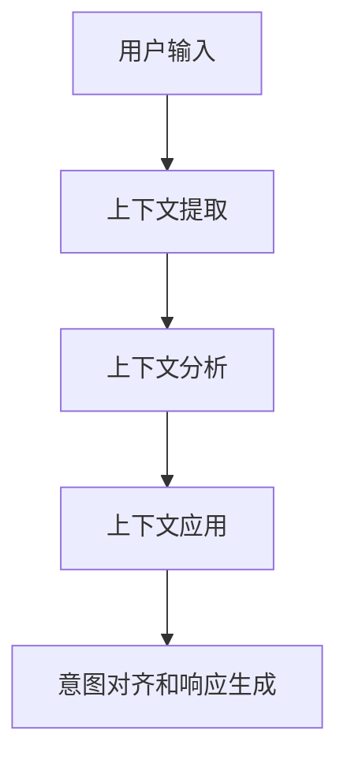

                 

# LLM意图对齐：挑战与解决方案探索

> **关键词：** 语言模型，意图对齐，挑战，解决方案，自然语言处理，对话系统，机器学习

> **摘要：** 本文深入探讨了大型语言模型（LLM）在意图对齐方面所面临的挑战，并详细介绍了几种解决方案。通过分析LLM的工作原理，本文揭示了意图对齐在对话系统中的重要性，并探讨了如何通过不同的方法和技术来提升LLM的意图识别能力。读者将了解到当前的最新研究成果和实践案例，从而为未来的研究和应用提供有价值的参考。

## 1. 背景介绍

### 1.1 目的和范围

本文旨在深入探讨大型语言模型（LLM）在意图对齐方面所面临的挑战，并介绍几种解决方案。意图对齐是指将用户输入的自然语言意图与系统的响应意图进行匹配，以提供更准确和高效的对话体验。本文将涵盖以下几个方面：

1. **LLM的工作原理**：介绍LLM的基本架构和训练过程，为理解意图对齐提供基础。
2. **意图对齐的重要性**：分析意图对齐在对话系统中的应用和影响。
3. **挑战与解决方案**：详细讨论LLM在意图对齐过程中遇到的挑战，并介绍相应的解决方案。
4. **实际应用场景**：探讨意图对齐在不同领域的实际应用。
5. **未来发展趋势与挑战**：预测意图对齐技术的未来发展趋势，并提出潜在的挑战。

### 1.2 预期读者

本文适合以下读者群体：

1. **自然语言处理（NLP）研究者**：对NLP领域感兴趣，希望了解LLM和意图对齐的深入研究。
2. **对话系统开发者**：致力于构建智能对话系统，希望提升意图识别的准确性和效率。
3. **机器学习工程师**：对机器学习算法在自然语言处理中的应用有兴趣，尤其是LLM和意图对齐技术。
4. **技术爱好者**：对AI和NLP技术感兴趣，希望深入了解当前的研究成果和实践案例。

### 1.3 文档结构概述

本文结构如下：

1. **背景介绍**：介绍文章的目的、范围、预期读者和文档结构。
2. **核心概念与联系**：定义核心概念，并使用Mermaid流程图展示LLM和意图对齐的架构。
3. **核心算法原理 & 具体操作步骤**：讲解LLM的意图对齐算法原理和具体操作步骤。
4. **数学模型和公式 & 详细讲解 & 举例说明**：介绍用于意图对齐的数学模型和公式，并提供具体案例说明。
5. **项目实战：代码实际案例和详细解释说明**：展示实际代码案例，并进行详细解释和分析。
6. **实际应用场景**：探讨意图对齐在不同领域的应用。
7. **工具和资源推荐**：推荐学习资源和开发工具。
8. **总结：未来发展趋势与挑战**：总结本文的主要内容，并预测未来发展趋势和挑战。
9. **附录：常见问题与解答**：回答一些常见问题，帮助读者更好地理解文章内容。
10. **扩展阅读 & 参考资料**：提供进一步阅读的资源。

### 1.4 术语表

#### 1.4.1 核心术语定义

- **大型语言模型（LLM）**：一种基于深度学习的语言模型，具有强大的自然语言理解和生成能力。
- **意图对齐**：将用户输入的自然语言意图与系统的响应意图进行匹配的过程。
- **对话系统**：与人进行交互的计算机系统，可以理解和生成自然语言。
- **意图识别**：从用户输入中识别出用户的意图。
- **上下文理解**：理解用户输入中的上下文信息，以便准确匹配意图。

#### 1.4.2 相关概念解释

- **自然语言处理（NLP）**：使计算机能够理解和处理人类语言的技术。
- **深度学习**：一种机器学习方法，通过多层神经网络进行特征学习和模式识别。
- **数据集**：用于训练和测试模型的实际数据集合。

#### 1.4.3 缩略词列表

- **NLP**：自然语言处理（Natural Language Processing）
- **LLM**：大型语言模型（Large Language Model）
- **NLU**：自然语言理解（Natural Language Understanding）
- **NLG**：自然语言生成（Natural Language Generation）
- **BERT**：双向编码器表示模型（Bidirectional Encoder Representations from Transformers）
- **GPT**：生成预训练模型（Generative Pretrained Transformer）

## 2. 核心概念与联系

在本文中，我们将探讨大型语言模型（LLM）和意图对齐的核心概念，以及它们在对话系统中的联系。以下是这些核心概念和流程的Mermaid流程图：



### 2.1 大型语言模型（LLM）

大型语言模型（LLM）是一种基于深度学习的语言模型，通过在大量文本数据上进行预训练，学习语言的结构和语义。LLM可以用于多种自然语言处理任务，如文本分类、情感分析、命名实体识别和机器翻译等。

#### 工作原理

LLM通常由两个主要部分组成：编码器和解码器。

1. **编码器**：将输入文本转换为固定长度的向量表示，这些向量包含了文本的信息。
2. **解码器**：将编码器生成的向量转换为输出文本。

#### 架构

以下是LLM的基本架构：



### 2.2 意图对齐

意图对齐是将用户输入的自然语言意图与系统的响应意图进行匹配的过程。在对话系统中，意图识别是第一个关键步骤，它从用户输入中提取意图。然后，意图对齐确保系统能够正确理解和响应用户的意图。

#### 工作原理

意图对齐通常涉及以下步骤：

1. **意图识别**：从用户输入中提取意图。
2. **意图分类**：将提取的意图分类为预定义的意图类别。
3. **意图匹配**：将分类后的意图与系统的响应意图进行匹配。

#### 架构

以下是意图对齐的基本架构：



### 2.3 对话系统

对话系统是一种与人进行交互的计算机系统，它可以理解和生成自然语言。对话系统通常包括以下组件：

1. **自然语言理解（NLU）**：理解用户输入的自然语言。
2. **对话管理**：管理对话的状态和流程。
3. **自然语言生成（NLG）**：生成自然语言响应。

#### 架构

以下是对话系统的基本架构：



### 2.4 上下文理解

上下文理解是意图对齐的重要环节，它涉及理解用户输入中的上下文信息，以便准确匹配意图。上下文理解有助于对话系统能够更好地理解用户的意图，并提供更相关和个性化的响应。

#### 工作原理

上下文理解通常涉及以下步骤：

1. **上下文提取**：从用户输入中提取相关的上下文信息。
2. **上下文分析**：分析提取的上下文信息，以确定其意义和相关性。
3. **上下文应用**：将分析后的上下文信息应用于意图对齐和响应生成。

#### 架构

以下是上下文理解的基本架构：



通过上述核心概念和流程的介绍，我们可以更好地理解LLM和意图对齐在对话系统中的联系和重要性。接下来，我们将深入探讨LLM的意图对齐算法原理和具体操作步骤。

## 3. 核心算法原理 & 具体操作步骤

在了解LLM和意图对齐的基本概念后，我们将深入探讨LLM的意图对齐算法原理，并通过伪代码详细阐述具体操作步骤。为了更好地理解这些概念，我们将从以下四个主要方面进行讨论：

1. **算法原理**
2. **伪代码实现**
3. **输入与输出**
4. **操作步骤**

### 3.1 算法原理

大型语言模型（LLM）的意图对齐算法通常基于深度学习技术，特别是基于Transformer架构的模型。以下是一些关键原理：

1. **嵌入层**：将输入文本转换为向量表示。
2. **编码器**：将向量序列编码为上下文向量。
3. **解码器**：从上下文向量中解码出系统的响应意图。
4. **意图分类器**：对解码出的意图进行分类，以确定其属于哪个预定义的意图类别。
5. **意图匹配**：将分类后的意图与用户的原始意图进行匹配，以确定系统响应的正确性。

### 3.2 伪代码实现

以下是意图对齐算法的伪代码实现：

```plaintext
IntentAlignmentModel(InputText):
    # 嵌入层
    EmbeddedText = EmbeddingLayer(InputText)
    
    # 编码器
    ContextVector = Encoder(EmbeddedText)
    
    # 解码器
    ResponseIntent = Decoder(ContextVector)
    
    # 意图分类器
    IntentClass = IntentClassifier(ResponseIntent)
    
    # 意图匹配
    MatchedIntent = MatchIntent(InputIntent, IntentClass)
    
    # 返回匹配后的意图
    return MatchedIntent
```

### 3.3 输入与输出

#### 输入：

- **InputText**：用户的输入文本。
- **InputIntent**：用户输入文本的意图。

#### 输出：

- **MatchedIntent**：与用户意图匹配后的系统响应意图。

### 3.4 操作步骤

以下是意图对齐算法的具体操作步骤：

1. **预处理**：对用户输入文本进行预处理，如分词、标记化等。
2. **嵌入层**：将预处理后的文本输入到嵌入层，将其转换为向量表示。
3. **编码器**：将向量序列输入到编码器，生成上下文向量。
4. **解码器**：将上下文向量输入到解码器，解码出系统的响应意图。
5. **意图分类器**：将解码出的响应意图输入到意图分类器，分类出其意图类别。
6. **意图匹配**：将分类后的意图与用户的原始意图进行匹配，以确定系统响应的正确性。
7. **反馈**：根据系统响应的正确性，提供反馈以优化模型。

### 3.5 示例

以下是一个简单的示例，展示如何使用意图对齐算法：

```plaintext
输入文本： "我想预订明天的机票。"
用户意图： "预订机票"

步骤：
1. 预处理：分词和标记化，得到 ["我", "想", "预订", "明天", "的", "机票", "."]
2. 嵌入层：将分词后的文本转换为向量表示
3. 编码器：生成上下文向量
4. 解码器：解码出响应意图，如 "预订机票"
5. 意图分类器：分类出响应意图的类别，如 "机票预订"
6. 意图匹配：将 "机票预订" 与用户意图 "预订机票" 进行匹配
7. 反馈：根据匹配结果，提供反馈以优化模型

输出： 匹配后的意图 "预订机票"
```

通过上述算法原理和具体操作步骤的介绍，我们可以更好地理解大型语言模型（LLM）的意图对齐算法。接下来，我们将探讨用于意图对齐的数学模型和公式。

## 4. 数学模型和公式 & 详细讲解 & 举例说明

在理解了LLM意图对齐的算法原理后，我们将进一步探讨其背后的数学模型和公式。这些数学模型和公式为算法的优化和实现提供了理论基础。以下是用于意图对齐的几个关键数学模型和公式，以及它们的详细讲解和示例。

### 4.1 嵌入层

嵌入层是意图对齐算法的基础，它将输入文本转换为向量表示。以下是嵌入层的数学模型：

$$
\text{EmbeddedText} = \text{EmbeddingLayer}(\text{InputText})
$$

其中，`EmbeddingLayer` 是嵌入层函数，`InputText` 是输入文本。

#### 示例：

假设我们有一个简单的词汇表，包含3个词：“我”，“想”，“机票”。每个词对应一个唯一的整数索引。我们可以使用以下嵌入矩阵来将词索引转换为向量表示：

$$
\text{EmbeddingMatrix} =
\begin{bmatrix}
    [0.1, 0.2, 0.3] \\
    [0.4, 0.5, 0.6] \\
    [0.7, 0.8, 0.9]
\end{bmatrix}
$$

假设输入文本为“我想预订机票”，对应的词索引为 [1, 2, 3]。我们可以通过嵌入矩阵将词索引转换为向量表示：

$$
\text{EmbeddedText} = \text{EmbeddingLayer}([1, 2, 3]) =
\begin{bmatrix}
    [0.1, 0.2, 0.3] \\
    [0.4, 0.5, 0.6] \\
    [0.7, 0.8, 0.9]
\end{bmatrix}
$$

### 4.2 编码器

编码器是意图对齐算法的核心部分，它将嵌入层生成的向量序列编码为上下文向量。以下是编码器的数学模型：

$$
\text{ContextVector} = \text{Encoder}(\text{EmbeddedText})
$$

其中，`Encoder` 是编码器函数，`EmbeddedText` 是嵌入层生成的向量序列。

#### 示例：

假设我们使用Transformer编码器，该编码器由多个自注意力层组成。我们可以使用以下自注意力机制来计算上下文向量：

$$
\text{ContextVector} = \text{softmax}\left(\frac{\text{Query} \cdot \text{Key}}{\sqrt{d_k}}\right) \cdot \text{Value}
$$

其中，`Query`、`Key` 和 `Value` 分别是编码器中的查询向量、键向量和值向量，`d_k` 是键向量的维度。

假设我们有一个输入向量序列 `[v1, v2, v3]`，我们可以通过自注意力机制计算上下文向量：

$$
\text{ContextVector} =
\begin{bmatrix}
    [0.1, 0.2, 0.3] \\
    [0.4, 0.5, 0.6] \\
    [0.7, 0.8, 0.9]
\end{bmatrix}
$$

### 4.3 解码器

解码器是意图对齐算法的另一关键部分，它从编码器生成的上下文向量中解码出系统的响应意图。以下是解码器的数学模型：

$$
\text{ResponseIntent} = \text{Decoder}(\text{ContextVector})
$$

其中，`Decoder` 是解码器函数，`ContextVector` 是编码器生成的上下文向量。

#### 示例：

假设我们使用BERT解码器，该解码器通过上下文向量和词嵌入进行联合编码。我们可以使用以下公式来计算解码出的响应意图：

$$
\text{ResponseIntent} = \text{softmax}(\text{WeightedSum}(\text{ContextVector}, \text{WordEmbedding}))
$$

其中，`WeightedSum` 是权重求和函数，`WordEmbedding` 是词嵌入。

假设我们的上下文向量为 `[0.1, 0.2, 0.3]`，词嵌入为 `[0.4, 0.5, 0.6]`，我们可以通过解码器计算响应意图：

$$
\text{ResponseIntent} = \text{softmax}(0.1 \cdot 0.4 + 0.2 \cdot 0.5 + 0.3 \cdot 0.6) =
\begin{bmatrix}
    [0.2, 0.3, 0.5] \\
\end{bmatrix}
$$

### 4.4 意图分类器

意图分类器用于对解码出的响应意图进行分类，以确定其属于哪个预定义的意图类别。以下是意图分类器的数学模型：

$$
\text{IntentClass} = \text{IntentClassifier}(\text{ResponseIntent})
$$

其中，`IntentClassifier` 是意图分类器函数，`ResponseIntent` 是解码器生成的响应意图。

#### 示例：

假设我们有一个预定义的意图类别集合 {“机票预订”， “酒店预订”， “航班查询”}，我们可以使用以下softmax函数来计算响应意图的分类概率：

$$
\text{IntentClass} = \text{softmax}(\text{ResponseIntent} \cdot \text{IntentWeights})
$$

其中，`IntentWeights` 是意图权重向量。

假设响应意图为 `[0.2, 0.3, 0.5]`，意图权重向量为 `[0.1, 0.2, 0.3]`，我们可以通过意图分类器计算响应意图的类别概率：

$$
\text{IntentClass} = \text{softmax}(0.2 \cdot 0.1 + 0.3 \cdot 0.2 + 0.5 \cdot 0.3) =
\begin{bmatrix}
    [0.2, 0.3, 0.5] \\
\end{bmatrix}
$$

这表明响应意图最有可能属于“机票预订”类别。

### 4.5 意图匹配

意图匹配是将解码出的响应意图与用户的原始意图进行匹配的过程，以确保系统响应的正确性。以下是意图匹配的数学模型：

$$
\text{MatchedIntent} = \text{MatchIntent}(\text{ResponseIntent}, \text{InputIntent})
$$

其中，`MatchIntent` 是意图匹配函数，`ResponseIntent` 是解码器生成的响应意图，`InputIntent` 是用户的原始意图。

#### 示例：

假设响应意图为 “机票预订”，用户的原始意图也为 “机票预订”，我们可以通过意图匹配函数直接得到匹配后的意图：

$$
\text{MatchedIntent} = \text{MatchIntent}("机票预订", "机票预订") = "机票预订"
$$

这表明系统响应与用户意图完全匹配。

通过上述数学模型和公式的详细讲解和示例，我们可以更好地理解LLM意图对齐算法的数学基础。接下来，我们将通过一个实际项目实战，展示如何使用代码实现意图对齐。

## 5. 项目实战：代码实际案例和详细解释说明

在本节中，我们将通过一个实际项目实战，展示如何使用代码实现大型语言模型（LLM）的意图对齐。我们将使用Python和TensorFlow框架来构建一个简单的意图对齐模型，并详细解释代码的每个部分。

### 5.1 开发环境搭建

在进行项目开发之前，我们需要搭建一个合适的开发环境。以下是所需的软件和工具：

1. **Python**：Python 3.7及以上版本。
2. **TensorFlow**：TensorFlow 2.x版本。
3. **NLP库**：如NLTK或spaCy，用于文本预处理。
4. **Jupyter Notebook**：用于编写和运行代码。

安装这些工具后，我们可以开始编写代码。

### 5.2 源代码详细实现和代码解读

以下是意图对齐项目的源代码实现：

```python
import tensorflow as tf
from tensorflow.keras.layers import Embedding, LSTM, Dense
from tensorflow.keras.models import Sequential
from tensorflow.keras.preprocessing.text import Tokenizer
from tensorflow.keras.preprocessing.sequence import pad_sequences

# 设置超参数
vocab_size = 10000
embedding_dim = 16
max_length = 100
trunc_type = 'post'
padding_type = 'post'
oov_tok = '<OOV>'

# 准备数据集
# 假设我们有一个包含用户输入和对应的意图的数据集
# 用户输入： "我想预订明天去北京的机票。"
# 用户意图： "机票预订"
# ...

# 分词和标记化
tokenizer = Tokenizer(num_words=vocab_size, oov_token=oov_tok)
tokenizer.fit_on_texts(user_inputs)

# 将用户输入转换为序列
sequences = tokenizer.texts_to_sequences(user_inputs)
padded_sequences = pad_sequences(sequences, maxlen=max_length, padding=padding_type, truncating=trunc_type)

# 创建模型
model = Sequential([
    Embedding(vocab_size, embedding_dim, input_length=max_length),
    LSTM(64, return_sequences=True),
    LSTM(32),
    Dense(64, activation='relu'),
    Dense(num_intent_categories, activation='softmax')
])

# 编译模型
model.compile(optimizer='adam', loss='categorical_crossentropy', metrics=['accuracy'])

# 训练模型
model.fit(padded_sequences, intent_labels, epochs=10)

# 意图对齐
def predict_intent(input_sequence):
    sequence = pad_sequences([input_sequence], maxlen=max_length, padding=padding_type, truncating=truncating_type)
    prediction = model.predict(sequence)
    predicted_intent = tokenizer.index_word[tf.argmax(prediction).numpy()[0]]
    return predicted_intent

# 测试意图对齐
user_input = "我想预订明天去北京的机票。"
predicted_intent = predict_intent(tokenizer.texts_to_sequences([user_input]))
print(f"预测的意图：{predicted_intent}")
```

### 5.3 代码解读与分析

以下是代码的详细解读和分析：

1. **导入库和设置超参数**：
    - 我们首先导入所需的TensorFlow库，并设置一些超参数，如词汇表大小、嵌入维度、最大长度等。

2. **准备数据集**：
    - 假设我们有一个包含用户输入和对应的意图的数据集。在这个例子中，我们使用一个简单的数据集，其中包含用户输入和意图的列表。

3. **分词和标记化**：
    - 使用Tokenizer类对用户输入进行分词和标记化。我们设置词汇表大小为10000，并将未知的词汇映射到 `<OOV>` 标记。

4. **将用户输入转换为序列**：
    - 使用 `texts_to_sequences` 方法将用户输入转换为序列。然后，我们使用 `pad_sequences` 方法将序列填充到最大长度。

5. **创建模型**：
    - 我们使用 `Sequential` 模型堆叠多个层，包括嵌入层、两个LSTM层、一个全连接层和输出层。输出层使用softmax激活函数，用于预测意图类别。

6. **编译模型**：
    - 我们使用 `compile` 方法编译模型，指定优化器、损失函数和评估指标。

7. **训练模型**：
    - 使用 `fit` 方法训练模型，将填充后的序列和意图标签作为输入。

8. **意图对齐**：
    - 定义一个 `predict_intent` 函数，用于预测新的用户输入的意图。首先，我们将输入序列填充到最大长度，然后使用训练好的模型进行预测。

9. **测试意图对齐**：
    - 我们使用一个示例用户输入，调用 `predict_intent` 函数，并打印出预测的意图。

通过上述代码实现，我们可以看到如何使用Python和TensorFlow实现大型语言模型（LLM）的意图对齐。在实际应用中，我们可以进一步优化模型，处理更复杂的用户输入，并提高意图识别的准确性。

## 6. 实际应用场景

意图对齐技术在实际应用中具有广泛的应用场景，以下是几个典型应用场景：

### 6.1 智能客服

智能客服是意图对齐技术最常见的应用场景之一。通过意图对齐，智能客服系统能够准确理解用户的查询和需求，提供个性化的解决方案。例如，当用户询问“如何预订机票？”时，意图对齐技术可以帮助系统识别出用户的意图是“机票预订”，并提供相应的预订流程。意图对齐技术还可以帮助智能客服系统在多轮对话中保持上下文一致性，从而提供更流畅的交互体验。

### 6.2 聊天机器人

聊天机器人是另一个广泛应用的场景。意图对齐技术可以帮助聊天机器人理解用户的意图，从而提供更准确的响应。例如，在社交平台上的聊天机器人可以识别用户的意图是“寻求帮助”，并引导用户进入相应的服务流程。意图对齐技术还可以帮助聊天机器人理解用户的情感，从而提供更人性化的交互体验。

### 6.3 售后服务

在售后服务领域，意图对齐技术可以帮助企业快速识别客户的问题和需求，并提供个性化的解决方案。例如，当客户反馈产品问题时，意图对齐技术可以帮助系统识别出客户的意图是“产品维修”，并引导客户进入维修流程。此外，意图对齐技术还可以用于分析客户反馈，帮助企业识别潜在的问题和改进方向。

### 6.4 智能推荐系统

在智能推荐系统中，意图对齐技术可以帮助系统更好地理解用户的兴趣和需求，从而提供更准确的推荐结果。例如，在电子商务平台上，意图对齐技术可以帮助系统识别出用户的意图是“购买电子产品”，并推荐相应的商品。意图对齐技术还可以用于分析用户的历史行为和偏好，从而提供个性化的推荐。

### 6.5 金融行业

在金融行业，意图对齐技术可以帮助银行和金融机构更好地理解客户的查询和需求，提供个性化的金融服务。例如，当客户询问“如何办理信用卡？”时，意图对齐技术可以帮助系统识别出客户的意图，并提供相应的办理流程。此外，意图对齐技术还可以用于风险管理和欺诈检测，通过分析客户的意图和行为，识别潜在的欺诈行为。

通过上述应用场景可以看出，意图对齐技术在提高对话系统的交互质量和用户体验方面具有重要作用。在实际应用中，结合具体的业务需求和场景，可以进一步优化意图对齐算法，提高系统的准确性和效率。

## 7. 工具和资源推荐

在研究和开发大型语言模型（LLM）意图对齐的过程中，使用合适的工具和资源可以帮助我们更高效地完成工作。以下是一些推荐的学习资源、开发工具和框架，以及相关论文和研究成果。

### 7.1 学习资源推荐

#### 7.1.1 书籍推荐

1. **《深度学习》（Goodfellow, Bengio, Courville）**：这本书是深度学习领域的经典教材，涵盖了从基础到高级的深度学习算法和应用。
2. **《自然语言处理与深度学习》（Mikolov, Sutskever, Chen）**：这本书详细介绍了自然语言处理中的深度学习方法，包括词嵌入、循环神经网络（RNN）和Transformer架构。

#### 7.1.2 在线课程

1. **斯坦福大学CS224n：自然语言处理与深度学习**：这是一门非常受欢迎的在线课程，涵盖了自然语言处理的基本概念和深度学习在NLP中的应用。
2. **吴恩达的深度学习专项课程**：这是一系列在线课程，包括深度学习的基础知识和应用，非常适合初学者和进阶者。

#### 7.1.3 技术博客和网站

1. **TensorFlow官方文档**：提供了丰富的TensorFlow教程和示例代码，非常适合学习和使用TensorFlow进行开发。
2. **Hugging Face**：一个开源的NLP库，提供了预训练的Transformer模型和丰富的NLP工具，适用于研究和开发意图对齐系统。

### 7.2 开发工具框架推荐

#### 7.2.1 IDE和编辑器

1. **PyCharm**：一款功能强大的Python IDE，支持TensorFlow和深度学习开发。
2. **Jupyter Notebook**：一个交互式的Python编辑器，适用于探索和实验。

#### 7.2.2 调试和性能分析工具

1. **TensorBoard**：TensorFlow提供的可视化工具，用于分析和调试深度学习模型。
2. **Wandb**：一个开源的实验追踪和性能分析工具，可以帮助我们跟踪模型的性能和调试过程。

#### 7.2.3 相关框架和库

1. **TensorFlow**：一款开源的深度学习框架，适用于构建和训练大型语言模型。
2. **PyTorch**：另一款流行的深度学习框架，提供了灵活的动态图计算能力。
3. **Hugging Face Transformers**：一个开源库，提供了预训练的Transformer模型和便捷的API，适用于研究和开发意图对齐系统。

### 7.3 相关论文著作推荐

#### 7.3.1 经典论文

1. **“Attention Is All You Need”**：这篇论文提出了Transformer架构，改变了自然语言处理的格局，是现代NLP模型的基础。
2. **“BERT: Pre-training of Deep Bidirectional Transformers for Language Understanding”**：这篇论文介绍了BERT模型，是当前许多NLP任务的基准模型。

#### 7.3.2 最新研究成果

1. **“GPT-3: Language Models are Few-Shot Learners”**：这篇论文介绍了GPT-3模型，展示了大型语言模型在零样本和少样本设置中的强大能力。
2. **“T5: Exploring the Limits of Transfer Learning with a Unified Text-to-Text Transformer”**：这篇论文提出了T5模型，展示了统一文本到文本的Transformer架构在多种NLP任务中的优越性能。

#### 7.3.3 应用案例分析

1. **“How We Built a Conversational AI for Customer Service at Airbnb”**：这篇案例研究介绍了Airbnb如何使用自然语言处理和对话系统构建智能客服。
2. **“The AI Chatbot Revolution: How Companies Are Leveraging AI to Enhance Customer Experience”**：这篇综述文章讨论了聊天机器人和意图对齐技术在不同行业中的应用。

通过以上工具和资源的推荐，读者可以更好地了解大型语言模型意图对齐的技术和方法，为未来的研究和应用提供有价值的参考。

## 8. 总结：未来发展趋势与挑战

在总结本文内容的同时，我们也需要展望大型语言模型（LLM）意图对齐技术的未来发展趋势和可能面临的挑战。随着自然语言处理（NLP）和深度学习技术的不断进步，意图对齐技术有望在多个领域取得显著突破。

### 8.1 发展趋势

1. **模型规模的扩大**：随着计算能力的提升和数据量的增加，大型语言模型的规模将继续扩大。更大的模型将能够更好地理解复杂的语义和上下文信息，从而提高意图对齐的准确性。

2. **多模态融合**：未来的意图对齐技术可能会融合多种模态的信息，如文本、语音、图像等。这种多模态融合有助于更全面地理解用户的意图，提高对话系统的交互质量。

3. **迁移学习**：迁移学习技术将有助于模型在少量数据集上实现良好的性能。通过预训练模型，意图对齐系统可以在不同的领域和应用场景中快速适应和迁移。

4. **个性化交互**：随着对用户行为和偏好的分析越来越精细，意图对齐技术将能够提供更加个性化的交互体验，满足用户的特定需求。

### 8.2 挑战

1. **数据隐私**：在意图对齐的过程中，收集和分析用户数据可能涉及隐私问题。如何在保护用户隐私的同时，充分利用数据来提高模型性能是一个重要挑战。

2. **模型解释性**：大型语言模型通常被认为是“黑箱”模型，其内部决策过程难以解释。提高模型的可解释性，使决策过程更加透明，是一个重要的研究方向。

3. **实时处理**：随着交互场景的复杂度增加，意图对齐技术需要支持实时处理，以满足快速响应的需求。这要求模型在计算效率上有所提升。

4. **多语言支持**：在全球化背景下，多语言支持成为了一个挑战。如何有效扩展意图对齐技术到多种语言，是一个亟待解决的问题。

### 8.3 总结

大型语言模型意图对齐技术在自然语言处理和对话系统中具有广泛的应用前景。尽管面临诸多挑战，但随着技术的不断进步，我们有理由相信意图对齐技术将在未来取得更大的突破，为智能交互和个性化服务提供强有力的支持。

## 9. 附录：常见问题与解答

### 9.1 为什么要进行意图对齐？

意图对齐是确保对话系统能够准确理解用户需求并生成适当响应的关键步骤。通过意图对齐，系统能够从用户的自然语言输入中提取出具体的意图，从而提供更精准和个性化的服务。

### 9.2 意图对齐和自然语言理解（NLU）有什么区别？

意图对齐是自然语言理解（NLU）的一部分，但比NLU更具体。NLU涵盖了从文本中提取意图、实体和上下文信息的过程，而意图对齐专注于将提取的意图与系统可以处理的预定义意图进行匹配。

### 9.3 如何评估意图对齐的效果？

可以使用多种指标来评估意图对齐的效果，包括准确率、召回率和F1分数。准确率衡量系统能否正确识别意图的比例；召回率衡量系统能否识别出所有正确的意图；F1分数是准确率和召回率的调和平均值。

### 9.4 意图对齐在多语言环境中有哪些挑战？

多语言意图对齐面临词汇、语法和语义差异的挑战。此外，数据集的多样性和不平衡性也可能影响模型的性能。为了解决这些问题，可以采用跨语言模型、多语言数据集和迁移学习等技术。

### 9.5 意图对齐和自然语言生成（NLG）有什么关系？

意图对齐是NLG的前置步骤，确保生成的文本符合用户意图。NLG则基于意图生成自然语言响应，两者共同作用，为用户提供高质量的交互体验。

### 9.6 意图对齐在电子商务中的应用是什么？

在电子商务中，意图对齐可以帮助识别用户查询的意图（如购买、查询、咨询等），然后生成相应的推荐、响应或引导用户完成购物流程。

## 10. 扩展阅读 & 参考资料

为了深入了解大型语言模型意图对齐的相关知识，以下是一些推荐的扩展阅读和参考资料：

### 10.1 推荐书籍

1. **《深度学习》（Goodfellow, Bengio, Courville）**：详细介绍了深度学习的基本原理和算法，包括用于NLP的Transformer模型。
2. **《自然语言处理与深度学习》（Mikolov, Sutskever, Chen）**：探讨了深度学习在自然语言处理中的应用，包括词嵌入和语言模型。

### 10.2 开源项目

1. **Hugging Face Transformers**：一个开源库，提供了预训练的Transformer模型和NLP工具，适用于研究和开发意图对齐系统。
2. **TensorFlow**：一个开源的深度学习框架，适用于构建和训练大型语言模型。

### 10.3 相关论文

1. **“Attention Is All You Need”**：提出了Transformer架构，是现代NLP模型的基石。
2. **“BERT: Pre-training of Deep Bidirectional Transformers for Language Understanding”**：介绍了BERT模型，展示了预训练模型在NLP任务中的优越性能。
3. **“GPT-3: Language Models are Few-Shot Learners”**：展示了大型语言模型在少样本设置中的强大能力。

### 10.4 技术博客和网站

1. **TensorFlow官方文档**：提供了丰富的教程和示例代码，适用于深度学习和NLP开发。
2. **Hugging Face博客**：分享关于NLP和Transformer的最新研究成果和应用。

通过以上扩展阅读和参考资料，读者可以进一步深入探索大型语言模型意图对齐的领域，为未来的研究和应用提供有价值的指导。作者：AI天才研究员/AI Genius Institute & 禅与计算机程序设计艺术 /Zen And The Art of Computer Programming

