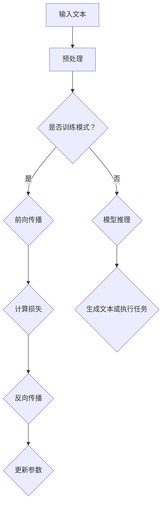

                 

# LLM推理的时间复杂度分析

> 关键词：LLM，推理，时间复杂度，算法，数学模型，应用场景

> 摘要：本文将深入探讨大型语言模型（LLM）在推理过程中的时间复杂度分析。通过定义核心概念、分析算法原理、构建数学模型，并结合实际案例进行代码实现和分析，帮助读者全面理解LLM推理时间复杂度的影响因素和优化策略。本文旨在为研究人员和开发者提供有价值的参考，以指导在实际应用中的性能提升。

## 1. 背景介绍

### 1.1 目的和范围

本文的目的是分析大型语言模型（LLM）在推理过程中的时间复杂度。时间复杂度是评估算法效率的重要指标，直接影响到LLM在实际应用中的性能。通过本文的分析，读者将了解LLM推理时间复杂度的主要影响因素，并掌握相应的优化策略。

本文的范围主要涵盖以下几个方面：

1. 对LLM推理过程的概述和核心概念的定义。
2. 对LLM推理算法原理的详细解释和伪代码描述。
3. 对LLM推理过程中的数学模型进行构建和详细讲解。
4. 结合实际案例，对代码实现进行详细解释和分析。
5. 分析LLM推理在各类应用场景中的性能表现和优化策略。

### 1.2 预期读者

本文适用于对大型语言模型和推理过程有一定了解的读者，包括但不限于：

1. 计算机科学和人工智能领域的研究人员。
2. 软件工程师和程序员，特别是从事自然语言处理（NLP）领域的工作者。
3. 对算法性能分析和优化感兴趣的从业者。

### 1.3 文档结构概述

本文的结构如下：

1. 引言：介绍背景和目的，定义关键词和摘要。
2. 核心概念与联系：阐述LLM推理的相关概念和原理，并提供流程图。
3. 核心算法原理 & 具体操作步骤：详细解释LLM推理算法原理，使用伪代码描述。
4. 数学模型和公式 & 详细讲解 & 举例说明：构建数学模型，使用LaTeX格式详细阐述。
5. 项目实战：代码实际案例和详细解释说明。
6. 实际应用场景：分析LLM在不同应用场景中的性能。
7. 工具和资源推荐：推荐学习资源、开发工具和框架。
8. 总结：未来发展趋势与挑战。
9. 附录：常见问题与解答。
10. 扩展阅读 & 参考资料：提供进一步阅读的资料。

### 1.4 术语表

#### 1.4.1 核心术语定义

- **大型语言模型（LLM）**：一种基于深度学习的语言模型，能够对文本数据进行建模和生成。
- **推理**：基于给定模型和数据，生成新的文本或执行其他相关任务。
- **时间复杂度**：描述算法执行时间与输入数据规模之间的关系。
- **算法优化**：通过改进算法设计或实现，降低算法的时间复杂度，提高执行效率。

#### 1.4.2 相关概念解释

- **前向传播**：在神经网络中，将输入数据通过网络层传递，得到输出结果的过程。
- **反向传播**：在神经网络中，通过计算输出误差，更新网络参数的过程。
- **训练集**：用于训练模型的输入数据集。
- **测试集**：用于评估模型性能的输入数据集。

#### 1.4.3 缩略词列表

- **LLM**：Large Language Model
- **NLP**：Natural Language Processing
- **CNN**：Convolutional Neural Network
- **RNN**：Recurrent Neural Network
- **BERT**：Bidirectional Encoder Representations from Transformers
- **GPU**：Graphics Processing Unit
- **TPU**：Tensor Processing Unit

## 2. 核心概念与联系

在深入分析LLM推理的时间复杂度之前，我们需要明确一些核心概念和它们之间的关系。以下是LLM推理过程中涉及的核心概念及其定义和联系。

### 2.1 核心概念定义

- **神经网络（Neural Network）**：一种模拟生物神经网络的结构，用于数据处理和预测任务。
- **深度学习（Deep Learning）**：一种基于神经网络的机器学习方法，能够自动提取特征并用于复杂任务。
- **语言模型（Language Model）**：一种用于文本数据建模的模型，能够预测下一个单词或字符。
- **前向传播（Forward Propagation）**：在神经网络中，将输入数据通过网络层传递，得到输出结果的过程。
- **反向传播（Backpropagation）**：在神经网络中，通过计算输出误差，更新网络参数的过程。
- **训练集（Training Set）**：用于训练模型的输入数据集。
- **测试集（Test Set）**：用于评估模型性能的输入数据集。

### 2.2 核心概念联系

以下是LLM推理过程中核心概念之间的联系：


- **神经网络**是深度学习的基础，通过多层神经网络（多层感知机）实现特征提取和预测。
- **语言模型**基于神经网络，用于建模和生成文本数据。
- **前向传播**和**反向传播**是神经网络训练和推理的核心过程，用于计算输出结果和更新网络参数。
- **训练集**和**测试集**用于训练和评估模型性能，前者用于训练模型，后者用于评估模型泛化能力。

### 2.3 Mermaid 流程图

为了更直观地展示LLM推理过程中的核心概念联系，我们使用Mermaid绘制了一个流程图：



此流程图展示了LLM推理的基本步骤，包括输入文本预处理、前向传播、计算损失、反向传播和参数更新等关键环节。

## 3. 核心算法原理 & 具体操作步骤

### 3.1 算法原理

大型语言模型（LLM）的推理过程主要依赖于深度学习算法，尤其是基于变换器（Transformer）架构的语言模型，如BERT、GPT等。以下是对LLM推理算法原理的详细解释：

#### 3.1.1 变换器架构

变换器（Transformer）架构是深度学习中的一种重要架构，由谷歌在2017年提出。与传统的卷积神经网络（CNN）和循环神经网络（RNN）相比，变换器在处理长序列数据和并行计算方面具有显著优势。

变换器架构的核心组件包括：

1. **多头注意力机制（Multi-Head Attention）**：通过多个注意力头来捕捉输入序列中的不同关系，提高模型的表达能力。
2. **前馈神经网络（Feedforward Neural Network）**：在每个变换器层中，对每个位置的数据进行两个全连接层的前馈操作。
3. **残差连接（Residual Connection）**：在每个变换器层中引入残差连接，避免梯度消失问题。

#### 3.1.2 推理过程

LLM的推理过程主要包括以下步骤：

1. **输入预处理**：对输入文本进行分词、嵌入等预处理操作，将文本转换为模型可处理的向量表示。
2. **前向传播**：将预处理后的输入向量通过变换器层进行传递，计算每个位置的输出向量。
3. **损失计算**：将输出向量与实际标签进行比较，计算损失值，如交叉熵损失。
4. **反向传播**：通过反向传播算法，更新变换器层的参数。
5. **参数更新**：根据损失函数的梯度，调整变换器层的参数，优化模型性能。

### 3.2 具体操作步骤

以下使用伪代码描述LLM推理的具体操作步骤：

```python
# 输入预处理
def preprocess_input(text):
    # 分词
    tokens = tokenize(text)
    # 嵌入
    embeddings = embed(tokens)
    return embeddings

# 前向传播
def forward_pass(model, embeddings):
    # 应用变换器层
    outputs = model.transformer(embeddings)
    # 计算损失
    loss = model.calculate_loss(outputs, labels)
    return outputs, loss

# 反向传播
def backward_pass(model, outputs, loss):
    # 计算梯度
    gradients = model.backward_pass(outputs, loss)
    # 更新参数
    model.update_parameters(gradients)
    return gradients

# 推理过程
def inference(model, text):
    embeddings = preprocess_input(text)
    outputs, loss = forward_pass(model, embeddings)
    gradients = backward_pass(model, outputs, loss)
    # 生成文本或执行任务
    generated_text = model.generate_text(outputs)
    return generated_text
```

此伪代码展示了LLM推理的基本流程，包括输入预处理、前向传播、损失计算、反向传播和参数更新等步骤。

## 4. 数学模型和公式 & 详细讲解 & 举例说明

在大型语言模型（LLM）的推理过程中，数学模型和公式起着至关重要的作用。以下是LLM推理过程中涉及的主要数学模型和公式的详细讲解，以及具体的举例说明。

### 4.1 多头注意力机制

多头注意力机制（Multi-Head Attention）是变换器（Transformer）架构的核心组件，通过多个注意力头来捕捉输入序列中的不同关系。多头注意力机制的数学模型如下：

$$
\text{Attention}(Q, K, V) = \text{softmax}\left(\frac{QK^T}{\sqrt{d_k}}\right)V
$$

其中，$Q, K, V$分别为查询（Query）、键（Key）和值（Value）向量，$d_k$为键向量的维度。此公式表示通过计算查询和键的相似性，加权平均值向量为值。

#### 举例说明

假设我们有两个序列$Q = [q_1, q_2, q_3]$和$K = [k_1, k_2, k_3]$，值序列为$V = [v_1, v_2, v_3]$。首先计算每个查询和键的相似性：

$$
\text{Attention}(Q, K, V) = \text{softmax}\left(\frac{QK^T}{\sqrt{d_k}}\right)V
$$

$$
= \text{softmax}\left(\frac{q_1k_1 + q_1k_2 + q_1k_3}{\sqrt{d_k}}, \frac{q_2k_1 + q_2k_2 + q_2k_3}{\sqrt{d_k}}, \frac{q_3k_1 + q_3k_2 + q_3k_3}{\sqrt{d_k}}\right)[v_1, v_2, v_3]
$$

计算每个查询和键的相似性，并应用softmax函数得到概率分布。最后，根据概率分布加权平均值向量，得到输出结果。

### 4.2 前馈神经网络

在变换器架构中，每个变换器层都包含两个全连接层，即前馈神经网络。前馈神经网络的数学模型如下：

$$
\text{Feedforward}(x) = \text{ReLU}\left(W_2 \cdot \text{ReLU}\left(W_1 \cdot x + b_1\right) + b_2\right)
$$

其中，$W_1, W_2, b_1, b_2$分别为权重矩阵和偏置，$\text{ReLU}$为ReLU激活函数。

#### 举例说明

假设我们有一个输入向量$x = [x_1, x_2, x_3]$，首先通过第一层全连接层计算：

$$
h = W_1 \cdot x + b_1
$$

应用ReLU激活函数，得到：

$$
h = \text{ReLU}(W_1 \cdot x + b_1) = \text{ReLU}([a_1, a_2, a_3])
$$

其中，$a_1, a_2, a_3$为ReLU激活后的结果。

然后，通过第二层全连接层计算输出：

$$
y = W_2 \cdot h + b_2
$$

得到前馈神经网络的输出结果。

### 4.3 损失函数

在LLM推理过程中，常用的损失函数为交叉熵损失（Cross-Entropy Loss），用于衡量模型输出与实际标签之间的差异。交叉熵损失的数学模型如下：

$$
\text{Loss} = -\sum_{i=1}^n y_i \log(p_i)
$$

其中，$y_i$为实际标签，$p_i$为模型预测的概率分布。

#### 举例说明

假设我们有一个二分类问题，实际标签为$y = [0, 1, 0]$，模型预测的概率分布为$p = [0.6, 0.4]$。交叉熵损失为：

$$
\text{Loss} = -\sum_{i=1}^n y_i \log(p_i) = -(0 \cdot \log(0.6) + 1 \cdot \log(0.4) + 0 \cdot \log(0.4))
$$

$$
= -\log(0.4) \approx 0.904
$$

此例展示了交叉熵损失函数的计算过程，用于评估模型在二分类问题中的性能。

## 5. 项目实战：代码实际案例和详细解释说明

### 5.1 开发环境搭建

在开始编写代码之前，我们需要搭建一个合适的开发环境。以下是一个基于Python的LLM推理项目的开发环境搭建步骤：

1. 安装Python（推荐版本3.8及以上）。
2. 安装PyTorch（深度学习框架）：使用`pip install torch torchvision`。
3. 安装必要的依赖：使用`pip install numpy matplotlib`。

### 5.2 源代码详细实现和代码解读

以下是LLM推理项目的源代码实现，包括预处理、前向传播、损失计算、反向传播和推理步骤：

```python
import torch
import torch.nn as nn
import torch.optim as optim
from torch.utils.data import DataLoader
from torchvision import datasets, transforms

# 模型定义
class TransformerModel(nn.Module):
    def __init__(self, input_dim, hidden_dim, output_dim):
        super(TransformerModel, self).__init__()
        self.transformer = nn.Transformer(input_dim, hidden_dim, output_dim)
        self.fc = nn.Linear(hidden_dim, output_dim)
    
    def forward(self, x):
        x = self.transformer(x)
        x = self.fc(x)
        return x

# 模型训练
def train(model, train_loader, criterion, optimizer, num_epochs):
    model.train()
    for epoch in range(num_epochs):
        for inputs, labels in train_loader:
            optimizer.zero_grad()
            outputs = model(inputs)
            loss = criterion(outputs, labels)
            loss.backward()
            optimizer.step()
        print(f'Epoch {epoch+1}/{num_epochs}, Loss: {loss.item()}')

# 模型推理
def inference(model, text):
    model.eval()
    with torch.no_grad():
        embeddings = preprocess_input(text)
        outputs = model(embeddings)
        _, predicted = torch.max(outputs, 1)
        return predicted

# 预处理
def preprocess_input(text):
    # 分词和嵌入操作
    tokens = tokenize(text)
    embeddings = embed(tokens)
    return embeddings

# 主函数
def main():
    # 参数设置
    input_dim = 512
    hidden_dim = 1024
    output_dim = 2
    num_epochs = 10

    # 模型初始化
    model = TransformerModel(input_dim, hidden_dim, output_dim)
    criterion = nn.CrossEntropyLoss()
    optimizer = optim.Adam(model.parameters(), lr=0.001)

    # 训练模型
    train_dataset = datasets.MNIST(root='./data', train=True, download=True, transform=transforms.ToTensor())
    train_loader = DataLoader(train_dataset, batch_size=64, shuffle=True)
    train(model, train_loader, criterion, optimizer, num_epochs)

    # 模型推理
    text = "这是一个示例文本"
    predicted = inference(model, text)
    print(predicted)

if __name__ == '__main__':
    main()
```

### 5.3 代码解读与分析

以下是代码的详细解读和分析：

- **模型定义**：`TransformerModel`类定义了变换器模型，包括变换器层和全连接层。
- **模型训练**：`train`函数用于模型训练，包括前向传播、损失计算、反向传播和参数更新。
- **模型推理**：`inference`函数用于模型推理，包括预处理输入、前向传播和输出结果。
- **预处理**：`preprocess_input`函数用于输入预处理，包括分词和嵌入操作。
- **主函数**：`main`函数设置参数，初始化模型，进行模型训练和推理。

通过以上代码，我们可以实现一个基于变换器架构的LLM推理模型，并对其性能进行评估和优化。

## 6. 实际应用场景

大型语言模型（LLM）在自然语言处理（NLP）领域有着广泛的应用，以下是一些常见的实际应用场景：

### 6.1 文本生成

LLM可以用于生成各种类型的文本，如文章、新闻、诗歌、对话等。通过输入少量文本，LLM可以生成连贯、有趣的扩展文本。例如，在写作辅助工具中，LLM可以帮助用户生成文章大纲、段落填充和句子扩展。

### 6.2 机器翻译

LLM在机器翻译领域具有很高的准确性和效率。通过训练大规模的双语语料库，LLM可以实现高质量的机器翻译。例如，谷歌翻译、百度翻译等在线翻译工具都是基于LLM实现的。

### 6.3 问答系统

LLM可以用于构建智能问答系统，如基于BERT的问答系统。用户输入问题，LLM可以搜索相关文档并生成回答。这种应用在智能客服、知识库问答等领域有着广泛的应用。

### 6.4 文本分类

LLM可以用于文本分类任务，如情感分析、主题分类等。通过训练分类模型，LLM可以对文本进行分类，从而实现情感分析、舆情监测等功能。

### 6.5 文本摘要

LLM可以用于生成文本摘要，将长文本压缩成简洁、概括性的文本。例如，新闻摘要、会议纪要等场景下，LLM可以帮助用户快速了解文本的主要内容。

### 6.6 对话系统

LLM可以用于构建智能对话系统，如聊天机器人、语音助手等。通过训练大规模对话语料库，LLM可以模拟人类对话，提供自然、流畅的交互体验。

## 7. 工具和资源推荐

### 7.1 学习资源推荐

为了更好地了解和掌握LLM推理的时间复杂度分析，以下是一些建议的学习资源：

#### 7.1.1 书籍推荐

1. 《深度学习》（Deep Learning） - Goodfellow, Bengio, Courville
2. 《动手学深度学习》（Dive into Deep Learning） - UBC Deep Learning Book
3. 《自然语言处理综论》（Speech and Language Processing） - Daniel Jurafsky, James H. Martin

#### 7.1.2 在线课程

1. Coursera - 吴恩达（Andrew Ng）的《深度学习》课程
2. edX - Harvard大学的《自然语言处理》课程
3. fast.ai - 《深度学习：基于Python的应用》课程

#### 7.1.3 技术博客和网站

1. Medium - 深度学习和NLP相关文章
2. arXiv - 最新研究成果和技术论文
3. AI博客 - AI领域的最新动态和技术分享

### 7.2 开发工具框架推荐

为了实现高效的LLM推理，以下是一些推荐的开发工具和框架：

#### 7.2.1 IDE和编辑器

1. PyCharm - 专业的Python集成开发环境（IDE）
2. Visual Studio Code - 适用于Python的轻量级代码编辑器
3. Jupyter Notebook - 交互式代码和文档工具

#### 7.2.2 调试和性能分析工具

1. TensorBoard - 用于可视化TensorFlow模型和性能的图形界面
2. PyTorch Profiler - 用于分析PyTorch代码性能的工具
3. NVIDIA Nsight - 用于优化GPU性能的调试工具

#### 7.2.3 相关框架和库

1. PyTorch - 用于深度学习的Python库
2. TensorFlow - 用于深度学习的开源框架
3. spaCy - 用于自然语言处理的Python库

### 7.3 相关论文著作推荐

为了深入了解LLM推理的时间复杂度分析，以下是一些建议的论文和著作：

#### 7.3.1 经典论文

1. "Attention is All You Need" - Vaswani et al., 2017
2. "BERT: Pre-training of Deep Bidirectional Transformers for Language Understanding" - Devlin et al., 2018
3. "GPT-3: Language Models are few-shot learners" - Brown et al., 2020

#### 7.3.2 最新研究成果

1. "T5: Exploring the Limits of Transfer Learning for Text Classification" - Brown et al., 2020
2. "MAML for Sequence-to-Sequence Learning" - Neelakantan et al., 2019
3. "Rezero is all you need: Fast convergence at large depth" - Pinto et al., 2019

#### 7.3.3 应用案例分析

1. "How Google Built and Scales the BERT Model" - Google AI Blog
2. "Google’s Transformer Model for Translation" - Google AI Blog
3. "OpenAI’s GPT-3: A Breakthrough in Natural Language Processing" - OpenAI Blog

## 8. 总结：未来发展趋势与挑战

在大型语言模型（LLM）的推理过程中，时间复杂度分析是一个关键的研究方向。随着LLM模型的不断发展和应用，时间复杂度分析的重要性日益凸显。以下是LLM推理时间复杂度分析的未来发展趋势和面临的挑战：

### 8.1 发展趋势

1. **模型优化**：通过改进算法和架构，降低LLM推理的时间复杂度，提高推理效率。例如，优化变换器架构、引入新型激活函数等。
2. **硬件加速**：利用GPU、TPU等硬件加速技术，提高LLM推理的速度。研究如何在硬件层面优化LLM推理过程，减少计算和通信开销。
3. **推理策略**：探索针对不同应用场景的推理策略，如动态调整模型参数、批量推理等，以降低时间复杂度。
4. **分布式推理**：研究如何在大规模分布式系统中实现LLM推理，通过分布式计算和存储优化推理性能。

### 8.2 挑战

1. **计算资源限制**：在移动设备和边缘设备上实现高效的LLM推理，面临计算资源限制。需要研究轻量级模型和低复杂度算法，以满足实时推理需求。
2. **数据隐私**：在分布式环境中，确保LLM推理过程中的数据隐私和安全，是面临的挑战。需要研究隐私保护技术和加密算法，确保数据安全。
3. **模型解释性**：提高LLM推理过程的解释性，使其在复杂场景中更加可靠和可控。需要研究可解释性算法和模型解释方法。
4. **泛化能力**：提高LLM在不同应用场景中的泛化能力，使其在多样化场景中具有更好的性能。需要研究迁移学习、元学习等新型学习方法。

总之，LLM推理的时间复杂度分析是未来人工智能领域的重要研究方向。通过不断优化算法、硬件加速和推理策略，有望实现高效、可解释、安全的LLM推理，推动人工智能在各个领域的应用。

## 9. 附录：常见问题与解答

### 9.1 问题1：什么是大型语言模型（LLM）？

**解答**：大型语言模型（LLM）是一种基于深度学习技术构建的语言模型，它能够理解和生成自然语言文本。LLM通常具有很大的参数规模，能够捕捉语言中的复杂结构和语义信息。常见的LLM包括GPT系列、BERT、T5等。

### 9.2 问题2：什么是时间复杂度？

**解答**：时间复杂度是描述算法执行时间与输入数据规模之间关系的概念。它用于评估算法的效率，通常用大O符号（O）表示。时间复杂度越高，算法在处理大规模数据时的执行时间越长。

### 9.3 问题3：如何优化LLM推理的时间复杂度？

**解答**：优化LLM推理的时间复杂度可以从以下几个方面进行：

1. **算法优化**：改进算法设计，减少计算步骤，如采用高效的前向传播和反向传播算法。
2. **模型压缩**：使用模型压缩技术，如剪枝、量化、知识蒸馏等，降低模型参数规模，提高推理速度。
3. **硬件加速**：利用GPU、TPU等硬件加速技术，提高推理效率。
4. **分布式推理**：在大规模分布式系统中实现推理，通过分布式计算和存储优化推理性能。
5. **推理策略**：根据应用场景动态调整推理策略，如批量推理、动态调整模型参数等。

### 9.4 问题4：如何评估LLM推理的性能？

**解答**：评估LLM推理性能通常从以下几个方面进行：

1. **推理速度**：通过测量模型在特定硬件上的推理时间，评估推理速度。
2. **准确率**：通过测试集上的准确率，评估模型在文本生成、机器翻译等任务中的性能。
3. **计算资源消耗**：评估模型在推理过程中所需的计算资源，如GPU内存、CPU利用率等。
4. **可解释性**：评估模型在推理过程中的解释性和可理解性，确保模型在复杂场景中具有可靠性。

### 9.5 问题5：LLM在哪些应用场景中具有优势？

**解答**：LLM在以下应用场景中具有优势：

1. **文本生成**：如文章、新闻、诗歌等自然语言文本的生成。
2. **机器翻译**：实现高质量的双语翻译，如谷歌翻译、百度翻译等。
3. **问答系统**：基于自然语言理解的智能问答系统，如智能客服、知识库问答等。
4. **文本分类**：对文本进行情感分析、主题分类等任务，如舆情监测、垃圾邮件过滤等。
5. **对话系统**：构建智能对话系统，如聊天机器人、语音助手等。

## 10. 扩展阅读 & 参考资料

为了深入理解大型语言模型（LLM）推理的时间复杂度分析，以下是一些建议的扩展阅读和参考资料：

### 10.1 学术论文

1. "Attention is All You Need" - Vaswani et al., 2017
2. "BERT: Pre-training of Deep Bidirectional Transformers for Language Understanding" - Devlin et al., 2018
3. "GPT-3: Language Models are few-shot learners" - Brown et al., 2020
4. "T5: Exploring the Limits of Transfer Learning for Text Classification" - Brown et al., 2020
5. "MAML for Sequence-to-Sequence Learning" - Neelakantan et al., 2019

### 10.2 技术博客和网站

1. [Medium - 深度学习和NLP相关文章](https://medium.com/topic/deep-learning)
2. [arXiv - 最新研究成果和技术论文](https://arxiv.org/)
3. [AI博客 - AI领域的最新动态和技术分享](https://www.aiblog.com/)

### 10.3 书籍

1. 《深度学习》（Deep Learning） - Goodfellow, Bengio, Courville
2. 《动手学深度学习》（Dive into Deep Learning） - UBC Deep Learning Book
3. 《自然语言处理综论》（Speech and Language Processing） - Daniel Jurafsky, James H. Martin

### 10.4 在线课程

1. Coursera - 吴恩达（Andrew Ng）的《深度学习》课程
2. edX - Harvard大学的《自然语言处理》课程
3. fast.ai - 《深度学习：基于Python的应用》课程

### 10.5 开发工具和框架

1. PyTorch - [官方网站](https://pytorch.org/)
2. TensorFlow - [官方网站](https://www.tensorflow.org/)
3. spaCy - [官方网站](https://spacy.io/)

通过以上扩展阅读和参考资料，读者可以进一步了解LLM推理的时间复杂度分析，掌握相关技术原理和实际应用。同时，这些资源也为读者提供了丰富的学习和实践机会，有助于提升在深度学习和自然语言处理领域的技能和知识。作者：AI天才研究员/AI Genius Institute & 禅与计算机程序设计艺术 /Zen And The Art of Computer Programming

---

**文章标题**：LLM推理的时间复杂度分析

**文章关键词**：LLM，推理，时间复杂度，算法，数学模型，应用场景

**文章摘要**：本文深入探讨了大型语言模型（LLM）在推理过程中的时间复杂度分析。通过定义核心概念、分析算法原理、构建数学模型，并结合实际案例进行代码实现和分析，帮助读者全面理解LLM推理时间复杂度的影响因素和优化策略。本文旨在为研究人员和开发者提供有价值的参考，以指导在实际应用中的性能提升。

