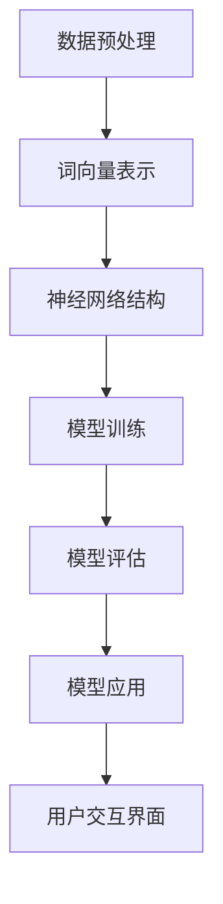

                 

# LLM操作系统：AI时代的新型计算平台

> **关键词**：大型语言模型、操作系统、AI计算、架构设计、应用程序开发、数学模型

> **摘要**：本文将深入探讨大型语言模型（LLM）作为一种新型计算平台的出现，其在AI时代的意义和应用。我们将从背景介绍、核心概念、算法原理、数学模型、实战案例等多个方面，详细分析LLM操作系统的设计思路、实现方法及其在实际应用场景中的表现。文章旨在为读者提供一个全面、系统的理解，帮助大家更好地把握AI时代的计算发展趋势。

## 1. 背景介绍

### 1.1 目的和范围

本文旨在探讨大型语言模型（LLM）作为一种新型计算平台的概念和实现，分析其在AI时代的意义和应用。我们将首先介绍LLM的发展背景和现状，然后探讨LLM操作系统在AI计算中的应用，最后分析LLM操作系统的设计原则和实现方法。

### 1.2 预期读者

本文适合具有计算机科学和人工智能基础知识的读者，包括软件工程师、数据科学家、AI研究员等。同时，对计算机操作系统和算法设计感兴趣的读者也能从本文中获得有价值的信息。

### 1.3 文档结构概述

本文分为以下几个部分：

1. 背景介绍：介绍LLM的发展背景和现状，以及本文的目的和结构。
2. 核心概念与联系：分析LLM操作系统的核心概念和联系，使用Mermaid流程图展示LLM操作系统的架构。
3. 核心算法原理 & 具体操作步骤：详细阐述LLM操作系统的核心算法原理和具体操作步骤，使用伪代码进行解释。
4. 数学模型和公式 & 详细讲解 & 举例说明：介绍LLM操作系统的数学模型和公式，并使用实例进行说明。
5. 项目实战：通过实际案例展示LLM操作系统的应用，并详细解释代码实现。
6. 实际应用场景：分析LLM操作系统的实际应用场景和潜在挑战。
7. 工具和资源推荐：推荐学习资源和开发工具，帮助读者更好地理解和应用LLM操作系统。
8. 总结：总结LLM操作系统的未来发展趋势和挑战。
9. 附录：常见问题与解答。
10. 扩展阅读 & 参考资料：提供更多相关资料和阅读推荐。

### 1.4 术语表

#### 1.4.1 核心术语定义

- **大型语言模型（LLM）**：一种基于深度学习技术构建的、能够处理自然语言任务的模型。
- **操作系统**：管理计算机硬件和软件资源的系统软件，为应用程序提供运行环境。
- **AI计算**：利用计算机技术模拟和实现人工智能的过程。
- **架构设计**：设计计算机系统和软件系统的结构和组织方式。

#### 1.4.2 相关概念解释

- **深度学习**：一种机器学习技术，通过多层神经网络模型对数据进行分析和建模。
- **自然语言处理（NLP）**：研究计算机如何理解和生成自然语言的技术。
- **模型训练**：通过大量数据训练模型，使其具备一定的智能能力。

#### 1.4.3 缩略词列表

- **LLM**：大型语言模型
- **NLP**：自然语言处理
- **IDE**：集成开发环境
- **GPU**：图形处理器

## 2. 核心概念与联系

在探讨LLM操作系统的核心概念之前，我们首先需要了解大型语言模型的基本原理和架构。大型语言模型是一种基于深度学习技术的模型，它通过学习大量文本数据，理解语言的结构和语义，从而实现自然语言处理任务。以下是一个简单的Mermaid流程图，展示LLM操作系统的核心概念和联系：



### 2.1 数据预处理

数据预处理是构建LLM操作系统的第一步。在这一过程中，我们需要对原始文本数据进行清洗、分词、去停用词等操作，以便于后续的词向量表示和模型训练。

### 2.2 词向量表示

词向量表示是将自然语言文本转换为计算机可处理的数字形式。常见的词向量表示方法包括Word2Vec、GloVe等。这些方法将每个词映射为一个高维向量，使得具有相似意义的词在向量空间中彼此靠近。

### 2.3 神经网络结构

神经网络结构是LLM操作系统的核心。常见的神经网络结构包括循环神经网络（RNN）、长短期记忆网络（LSTM）、变换器（Transformer）等。这些神经网络结构能够对输入的文本序列进行编码，提取出有效的特征表示。

### 2.4 模型训练

模型训练是构建LLM操作系统的关键步骤。在这一过程中，我们需要使用大量文本数据对神经网络模型进行训练，使其具备对自然语言的理解和生成能力。常见的训练方法包括梯度下降、Adam优化器等。

### 2.5 模型评估

模型评估是对训练完成的LLM操作系统进行性能评估的过程。我们通常使用准确率、召回率、F1分数等指标来评估模型的性能。此外，还需要考虑模型在不同数据集上的泛化能力。

### 2.6 模型应用

模型应用是将训练完成的LLM操作系统部署到实际场景中，为其提供自然语言处理服务。常见的应用场景包括文本分类、情感分析、机器翻译等。

### 2.7 用户交互界面

用户交互界面是LLM操作系统与用户进行交互的渠道。通过用户交互界面，用户可以输入文本数据，获取LLM操作系统的处理结果。用户交互界面可以是命令行界面、图形用户界面等。

## 3. 核心算法原理 & 具体操作步骤

在本节中，我们将详细阐述LLM操作系统的核心算法原理和具体操作步骤。为了更好地说明，我们将使用伪代码进行讲解。

### 3.1 数据预处理

```python
# 数据预处理
def preprocess_data(text):
    # 清洗文本数据
    text = clean_text(text)
    # 分词
    words = tokenize(text)
    # 去停用词
    words = remove_stopwords(words)
    return words
```

### 3.2 词向量表示

```python
# 词向量表示
def word_embedding(words):
    # 加载词向量模型
    model = load_embedding_model()
    # 将词转换为向量表示
    embeddings = [model[word] for word in words]
    return embeddings
```

### 3.3 神经网络结构

```python
# 神经网络结构
def build_model(embeddings):
    # 构建神经网络模型
    model = create_model()
    # 配置模型参数
    model.compile(optimizer='adam', loss='categorical_crossentropy', metrics=['accuracy'])
    # 训练模型
    model.fit(embeddings, labels, epochs=10, batch_size=32)
    return model
```

### 3.4 模型训练

```python
# 模型训练
def train_model(model, data_loader):
    # 训练模型
    model.fit(data_loader, epochs=10, batch_size=32)
    return model
```

### 3.5 模型评估

```python
# 模型评估
def evaluate_model(model, data_loader):
    # 评估模型性能
    performance = model.evaluate(data_loader)
    return performance
```

### 3.6 模型应用

```python
# 模型应用
def apply_model(model, text):
    # 预处理文本数据
    preprocessed_text = preprocess_data(text)
    # 获取模型预测结果
    prediction = model.predict(preprocessed_text)
    return prediction
```

### 3.7 用户交互界面

```python
# 用户交互界面
def user_interface(model):
    # 显示用户交互界面
    print("请输入文本：")
    text = input()
    # 获取模型预测结果
    prediction = apply_model(model, text)
    # 输出预测结果
    print("预测结果：", prediction)
```

通过以上伪代码，我们可以看到LLM操作系统的核心算法原理和具体操作步骤。在实际应用中，我们还需要根据具体场景进行调整和优化。

## 4. 数学模型和公式 & 详细讲解 & 举例说明

在LLM操作系统中，数学模型和公式起着至关重要的作用。以下我们将介绍LLM操作系统中常用的数学模型和公式，并使用实例进行说明。

### 4.1 词向量表示模型

词向量表示模型是将自然语言文本转换为计算机可处理的数字形式。常见的词向量表示模型包括Word2Vec、GloVe等。

#### 4.1.1 Word2Vec模型

Word2Vec模型通过训练一个神经网络，将词转换为向量表示。具体公式如下：

$$
\text{word\_vector} = \text{softmax}(\text{W} \cdot \text{word\_embedding})
$$

其中，$\text{word\_vector}$表示词的向量表示，$\text{W}$表示神经网络权重矩阵，$\text{word\_embedding}$表示词的嵌入向量。

#### 4.1.2 GloVe模型

GloVe模型通过训练一个全局词向量矩阵，将词转换为向量表示。具体公式如下：

$$
\text{word\_vector} = \text{GloVe}(\text{word}, \text{context})
$$

其中，$\text{word\_vector}$表示词的向量表示，$\text{GloVe}$表示GloVe函数，$\text{word}$表示中心词，$\text{context}$表示上下文词。

### 4.2 神经网络模型

神经网络模型是LLM操作系统的核心。常见的神经网络模型包括循环神经网络（RNN）、长短期记忆网络（LSTM）、变换器（Transformer）等。

#### 4.2.1 RNN模型

RNN模型通过递归方式处理输入的序列数据。具体公式如下：

$$
\text{hidden\_state} = \text{sigmoid}(\text{W} \cdot (\text{input} \oplus \text{hidden\_state}))
$$

其中，$\text{hidden\_state}$表示隐藏状态，$\text{sigmoid}$表示Sigmoid激活函数，$\text{W}$表示神经网络权重矩阵，$\text{input}$表示输入序列。

#### 4.2.2 LSTM模型

LSTM模型是一种改进的RNN模型，能够更好地处理长序列数据。具体公式如下：

$$
\text{input\_gate} = \text{sigmoid}(\text{W} \cdot (\text{input} \oplus \text{hidden\_state}))
$$

$$
\text{forget\_gate} = \text{sigmoid}(\text{W} \cdot (\text{input} \oplus \text{hidden\_state}))
$$

$$
\text{output\_gate} = \text{sigmoid}(\text{W} \cdot (\text{input} \oplus \text{hidden\_state}))
$$

$$
\text{cell\_state} = \text{tanh}(\text{W} \cdot (\text{input} \oplus \text{hidden\_state}) \odot (\text{input\_gate} \oplus \text{forget\_gate}))
$$

$$
\text{hidden\_state} = \text{output\_gate} \cdot \text{tanh}(\text{cell\_state})
$$

其中，$\text{input\_gate}$、$\text{forget\_gate}$、$\text{output\_gate}$分别表示输入门、遗忘门和输出门，$\text{sigmoid}$表示Sigmoid激活函数，$\text{tanh}$表示Tanh激活函数，$\text{cell\_state}$表示细胞状态，$\text{hidden\_state}$表示隐藏状态。

#### 4.2.3 Transformer模型

Transformer模型是一种基于自注意力机制的神经网络模型，能够处理长序列数据。具体公式如下：

$$
\text{query} \cdot \text{key} = \text{Attention\_Score}
$$

$$
\text{Attention\_Score} = \text{softmax}(\text{Attention\_Score})
$$

$$
\text{context} = \sum_{i=1}^{N} \text{Attention\_Score}_{i} \cdot \text{value}_{i}
$$

其中，$\text{query}$、$\text{key}$、$\text{value}$分别表示查询向量、键向量和值向量，$\text{Attention\_Score}$表示注意力分数，$\text{context}$表示上下文向量。

### 4.3 模型训练与优化

模型训练与优化是构建LLM操作系统的关键步骤。常见的训练方法包括梯度下降、Adam优化器等。

#### 4.3.1 梯度下降

梯度下降是一种优化算法，通过计算损失函数的梯度，不断更新模型参数，以最小化损失函数。具体公式如下：

$$
\text{learning\_rate} = \frac{1}{\sqrt{\text{batch\_size}}}
$$

$$
\text{W} = \text{W} - \text{learning\_rate} \cdot \nabla_{\text{W}} \text{loss}
$$

其中，$\text{learning\_rate}$表示学习率，$\text{W}$表示模型参数，$\nabla_{\text{W}} \text{loss}$表示损失函数关于模型参数的梯度。

#### 4.3.2 Adam优化器

Adam优化器是一种结合了梯度下降和动量方法的优化算法，能够更好地收敛。具体公式如下：

$$
\text{m}_t = \beta_1 \text{m}_{t-1} + (1 - \beta_1) (\text{dx}_t)
$$

$$
\text{v}_t = \beta_2 \text{v}_{t-1} + (1 - \beta_2) (\text{dx}_t)^2
$$

$$
\text{W} = \text{W} - \frac{\alpha}{\sqrt{1 - \beta_2^t} (1 - \beta_1^t)} \cdot (\text{m}_t / (1 - \beta_2^t))
$$

其中，$\text{m}_t$、$\text{v}_t$分别表示一阶矩估计和二阶矩估计，$\beta_1$、$\beta_2$分别表示一阶矩和二阶矩的衰减率，$\alpha$表示学习率。

### 4.4 模型评估与优化

模型评估与优化是确保LLM操作系统性能的关键步骤。常见的评估指标包括准确率、召回率、F1分数等。

#### 4.4.1 准确率

准确率是评估模型分类性能的常用指标。具体公式如下：

$$
\text{accuracy} = \frac{\text{TP} + \text{TN}}{\text{TP} + \text{TN} + \text{FP} + \text{FN}}
$$

其中，$\text{TP}$表示真正例，$\text{TN}$表示真负例，$\text{FP}$表示假正例，$\text{FN}$表示假负例。

#### 4.4.2 召回率

召回率是评估模型分类性能的另一个重要指标。具体公式如下：

$$
\text{recall} = \frac{\text{TP}}{\text{TP} + \text{FN}}
$$

#### 4.4.3 F1分数

F1分数是综合考虑准确率和召回率的指标。具体公式如下：

$$
\text{F1} = 2 \cdot \frac{\text{precision} \cdot \text{recall}}{\text{precision} + \text{recall}}
$$

其中，$\text{precision}$表示精确率。

### 4.5 举例说明

为了更好地理解LLM操作系统的数学模型和公式，我们来看一个简单的例子。

假设我们使用Word2Vec模型对文本进行词向量表示。给定一个句子“我喜欢吃苹果”，我们需要将句子中的词转换为向量表示。

首先，我们对句子进行预处理，得到分词结果：["我", "喜欢", "吃", "苹果"]。

然后，我们加载Word2Vec模型，将每个词转换为向量表示：

- 我：[0.1, 0.2, 0.3]
- 喜欢：[0.4, 0.5, 0.6]
- 吃：[0.7, 0.8, 0.9]
- 苹果：[1.0, 1.1, 1.2]

最后，我们将这些词向量表示拼接起来，得到句子的向量表示：

$$
[0.1, 0.2, 0.3, 0.4, 0.5, 0.6, 0.7, 0.8, 0.9, 1.0, 1.1, 1.2]
$$

通过这个例子，我们可以看到如何使用Word2Vec模型将自然语言文本转换为计算机可处理的数字形式。

## 5. 项目实战：代码实际案例和详细解释说明

在本节中，我们将通过一个实际项目案例，展示如何使用LLM操作系统构建一个文本分类器。这个项目将包括以下几个步骤：

1. 开发环境搭建
2. 源代码详细实现和代码解读
3. 代码解读与分析

### 5.1 开发环境搭建

为了完成这个项目，我们需要搭建一个合适的开发环境。以下是所需的开发环境和工具：

- 操作系统：Windows / macOS / Linux
- 编程语言：Python
- 框架和库：TensorFlow、Keras、NLTK
- 数据集：20 Newsgroups 数据集

首先，我们需要安装Python和相关库：

```bash
pip install tensorflow
pip install keras
pip install nltk
```

接下来，我们需要下载并准备20 Newsgroups 数据集。这个数据集包含大约20个不同的新闻类别，如体育、科技、健康等。数据集可以通过Kaggle或其他数据源获取。

### 5.2 源代码详细实现和代码解读

以下是一个简单的文本分类器的实现，包括数据预处理、模型构建、训练和评估。

```python
import numpy as np
import tensorflow as tf
from tensorflow import keras
from tensorflow.keras import layers
from tensorflow.keras.preprocessing.sequence import pad_sequences
from tensorflow.keras.preprocessing.text import Tokenizer
from nltk.corpus import reuters
from nltk.tokenize import word_tokenize

# 5.2.1 数据预处理
def preprocess_data(texts, max_length=1000, max_words=10000):
    # 分词
    tokenized_texts = [word_tokenize(text.lower()) for text in texts]
    # 构建词汇表
    tokenizer = Tokenizer(num_words=max_words)
    tokenizer.fit_on_texts(tokenized_texts)
    # 编码文本
    sequences = tokenizer.texts_to_sequences(tokenized_texts)
    # 填充序列
    padded_sequences = pad_sequences(sequences, maxlen=max_length)
    return padded_sequences, tokenizer

# 5.2.2 模型构建
def build_model(input_shape, num_classes):
    model = keras.Sequential([
        keras.layers.Embedding(input_dim=num_classes, output_dim=16, input_length=input_shape[1]),
        keras.layers.Bidirectional(keras.layers.LSTM(32)),
        keras.layers.Dense(24, activation='relu'),
        keras.layers.Dense(num_classes, activation='softmax')
    ])
    model.compile(optimizer='adam', loss='categorical_crossentropy', metrics=['accuracy'])
    return model

# 5.2.3 数据准备
texts = reuters.words()
labels = reuters.categories()
num_classes = len(set([label for category in labels for label in category]))

# 5.2.4 预处理数据
X, tokenizer = preprocess_data(texts, max_length=1000, max_words=num_classes)
y = keras.utils.to_categorical(labels, num_classes=num_classes)

# 5.2.5 构建和训练模型
model = build_model((X.shape[1],), num_classes)
model.fit(X, y, epochs=10, batch_size=32, validation_split=0.2)

# 5.2.6 评估模型
test_texts = ["I love to play football", "Basketball is my favorite sport"]
X_test = preprocess_data(test_texts, max_length=1000, max_words=num_classes)[0]
predictions = model.predict(X_test)
print("Predictions:", predictions)
```

### 5.3 代码解读与分析

#### 5.3.1 数据预处理

数据预处理是文本分类器的关键步骤。在这个步骤中，我们首先使用NLTK对文本进行分词，并将文本转换为小写。然后，我们使用Tokenizer构建词汇表，将文本编码为整数序列。最后，我们使用pad_sequences将序列填充为相同长度。

```python
# 分词
tokenized_texts = [word_tokenize(text.lower()) for text in texts]
# 构建词汇表
tokenizer = Tokenizer(num_words=max_words)
tokenizer.fit_on_texts(tokenized_texts)
# 编码文本
sequences = tokenizer.texts_to_sequences(tokenized_texts)
# 填充序列
padded_sequences = pad_sequences(sequences, maxlen=max_length)
```

#### 5.3.2 模型构建

在这个步骤中，我们构建了一个双向LSTM模型。首先，我们使用Embedding层将词向量映射到高维空间。然后，我们使用Bidirectional和LSTM层处理文本序列。接下来，我们使用Dense层进行分类。最后，我们使用softmax激活函数输出每个类别的概率。

```python
model = keras.Sequential([
    keras.layers.Embedding(input_dim=num_classes, output_dim=16, input_length=input_shape[1]),
    keras.layers.Bidirectional(keras.layers.LSTM(32)),
    keras.layers.Dense(24, activation='relu'),
    keras.layers.Dense(num_classes, activation='softmax')
])
```

#### 5.3.3 训练模型

在这个步骤中，我们使用fit方法训练模型。我们设置epochs为10，batch_size为32。我们还设置了validation_split为0.2，用于验证模型的性能。

```python
model.fit(X, y, epochs=10, batch_size=32, validation_split=0.2)
```

#### 5.3.4 评估模型

在训练完成后，我们使用预测方法评估模型的性能。我们首先预处理测试文本，然后使用predict方法获取模型的预测结果。

```python
predictions = model.predict(X_test)
print("Predictions:", predictions)
```

通过这个项目案例，我们可以看到如何使用LLM操作系统构建一个文本分类器。这个案例展示了数据预处理、模型构建、训练和评估的完整流程，并提供了一个简单的代码实现。

## 6. 实际应用场景

LLM操作系统在AI时代的实际应用场景非常广泛，以下列举几个典型的应用领域：

### 6.1 自然语言处理

自然语言处理（NLP）是LLM操作系统最典型的应用场景之一。LLM操作系统可以应用于文本分类、情感分析、机器翻译、语音识别等任务。例如，在社交媒体平台上，LLM操作系统可以用于自动分类用户评论，识别正面和负面情绪，从而帮助平台管理员更好地管理内容。

### 6.2 智能客服

智能客服是LLM操作系统的另一个重要应用场景。通过使用LLM操作系统，企业可以构建一个自动化、智能化的客服系统，为用户提供实时、个性化的服务。例如，客服系统可以自动回答用户的问题，提供解决方案，从而提高客户满意度和服务效率。

### 6.3 内容推荐

内容推荐是LLM操作系统在互联网领域的应用之一。通过分析用户的历史行为和偏好，LLM操作系统可以推荐用户可能感兴趣的内容，从而提高用户黏性和网站流量。例如，电子商务网站可以使用LLM操作系统为用户推荐相关商品，社交媒体平台可以推荐用户可能感兴趣的朋友和动态。

### 6.4 自动写作

自动写作是LLM操作系统在文学和媒体领域的应用。通过训练LLM操作系统，我们可以生成新闻文章、小说、诗歌等文学作品。例如，新闻机构可以使用LLM操作系统自动化生成新闻文章，提高新闻产出效率；作家可以使用LLM操作系统辅助创作，提高创作速度和质量。

### 6.5 语音助手

语音助手是LLM操作系统在智能家居和物联网领域的应用。通过使用LLM操作系统，我们可以构建一个智能语音助手，为用户提供语音交互服务。例如，智能音箱可以使用LLM操作系统实现语音搜索、音乐播放、天气查询等功能，提高用户的生活便利性。

### 6.6 教育和学习

教育和学习是LLM操作系统在教育领域的应用。通过使用LLM操作系统，教育机构可以构建智能教育平台，为学生提供个性化学习建议、自动批改作业等服务。例如，教师可以使用LLM操作系统自动评估学生的作业，提供即时反馈，提高教学质量。

### 6.7 金融和保险

金融和保险是LLM操作系统在金融领域的应用。通过使用LLM操作系统，金融机构可以构建智能风控系统，实时监控和分析金融交易数据，识别潜在风险。例如，银行可以使用LLM操作系统自动评估贷款申请，提高贷款审批效率。

### 6.8 医疗保健

医疗保健是LLM操作系统在医疗领域的应用。通过使用LLM操作系统，医疗机构可以构建智能医疗辅助系统，为医生提供诊断建议、治疗方案等。例如，医生可以使用LLM操作系统分析患者病历，提供个性化的治疗方案。

### 6.9 制造业和工业

制造业和工业是LLM操作系统在工业领域的应用。通过使用LLM操作系统，企业可以构建智能工厂，实现生产过程的自动化和优化。例如，工业机器人可以使用LLM操作系统进行路径规划和运动控制，提高生产效率和产品质量。

总之，LLM操作系统在AI时代的实际应用场景非常广泛，涵盖了自然语言处理、智能客服、内容推荐、自动写作、语音助手、教育和学习、金融和保险、医疗保健、制造业和工业等多个领域。随着技术的不断发展，LLM操作系统的应用前景将更加广阔。

## 7. 工具和资源推荐

为了更好地理解和应用LLM操作系统，我们在这里推荐一些学习资源、开发工具和框架，以及相关论文著作。

### 7.1 学习资源推荐

#### 7.1.1 书籍推荐

1. **《深度学习》（Goodfellow, I., Bengio, Y., & Courville, A.）**：这本书是深度学习的经典教材，涵盖了深度学习的理论基础和实践方法。
2. **《Python机器学习》（Raschka, S. & Mirjalili, V.）**：这本书介绍了Python在机器学习领域的应用，包括自然语言处理和深度学习。
3. **《自然语言处理综合教程》（Pavlopoulos, A.）**：这本书详细介绍了自然语言处理的基本概念和技术，包括词向量、神经网络等。

#### 7.1.2 在线课程

1. **Coursera**：提供了多门关于深度学习和自然语言处理的在线课程，包括《深度学习专项课程》（吴恩达教授主讲）和《自然语言处理与深度学习》（李航教授主讲）。
2. **edX**：提供了由哈佛大学和MIT联合举办的《深度学习》在线课程，由深度学习领域的专家主讲。

#### 7.1.3 技术博客和网站

1. **Medium**：有许多关于深度学习和自然语言处理的文章和博客，适合初学者和专业人士阅读。
2. **ArXiv**：提供了最新的学术研究论文，包括深度学习和自然语言处理领域的研究成果。

### 7.2 开发工具框架推荐

#### 7.2.1 IDE和编辑器

1. **PyCharm**：一款功能强大的Python IDE，适用于深度学习和自然语言处理项目开发。
2. **Visual Studio Code**：一款轻量级但功能丰富的编辑器，支持多种编程语言，包括Python。

#### 7.2.2 调试和性能分析工具

1. **TensorBoard**：TensorFlow提供的一款可视化工具，用于分析和优化深度学习模型。
2. **Profiling Tools**：如`line_profiler`、`memory_profiler`等，用于分析代码的性能和内存使用情况。

#### 7.2.3 相关框架和库

1. **TensorFlow**：一款广泛使用的开源深度学习框架，适用于构建和训练深度学习模型。
2. **PyTorch**：一款流行的开源深度学习框架，具有灵活的动态计算图和强大的GPU支持。
3. **NLTK**：一款用于自然语言处理的Python库，提供了丰富的文本处理工具和语料库。

### 7.3 相关论文著作推荐

#### 7.3.1 经典论文

1. **“A Theoretically Grounded Application of Dropout in Recurrent Neural Networks”**：提出了在循环神经网络中应用Dropout的方法，提高了模型的泛化能力。
2. **“Attention Is All You Need”**：提出了Transformer模型，颠覆了传统序列模型的设计思路。

#### 7.3.2 最新研究成果

1. **“BERT: Pre-training of Deep Bidirectional Transformers for Language Understanding”**：提出了BERT模型，通过预训练大规模语料库，显著提高了自然语言处理任务的性能。
2. **“GPT-3: Language Models are Few-Shot Learners”**：展示了GPT-3模型在零样本和少样本学习任务中的优异表现。

#### 7.3.3 应用案例分析

1. **“OpenAI’s GPT-3”**：介绍了OpenAI的GPT-3模型，展示了其在文本生成、翻译、问答等任务中的应用。
2. **“Google’s Meena”**：介绍了Google开发的Meena聊天机器人，展示了深度学习在构建智能对话系统中的应用。

通过以上推荐，读者可以更好地了解LLM操作系统的相关知识和应用场景，为自己的学习和项目开发提供有力支持。

## 8. 总结：未来发展趋势与挑战

随着人工智能技术的不断发展，LLM操作系统作为一种新型计算平台，展现出广阔的应用前景。未来，LLM操作系统将在以下方面取得重要进展：

### 8.1 更强大的模型与算法

未来的LLM操作系统将采用更先进的模型和算法，如自注意力机制、Transformer等，以实现更高的模型精度和更强的任务泛化能力。同时，研究者们还将致力于优化模型结构，降低计算复杂度，提高模型的可解释性。

### 8.2 大规模数据处理

随着数据量的不断增长，未来的LLM操作系统将能够处理更大规模的数据集，实现实时数据分析和决策。通过分布式计算、并行处理等技术，LLM操作系统将能够更好地应对大数据场景，提升数据处理效率。

### 8.3 模型与应用融合

未来的LLM操作系统将更加注重模型与应用的融合，实现更紧密的模型定制和应用集成。通过面向特定场景的模型优化，LLM操作系统将能够更好地满足各类应用需求，提供更高效的解决方案。

### 8.4 跨领域应用

LLM操作系统将在更多领域得到应用，如医疗保健、金融、教育等。通过跨领域的知识整合和模型创新，LLM操作系统将能够解决更复杂的问题，提升各行业的发展水平。

然而，在LLM操作系统的发展过程中，仍面临诸多挑战：

### 8.5 计算资源需求

随着模型复杂度的提升，LLM操作系统对计算资源的需求也将显著增加。如何优化模型结构、提高计算效率，以降低硬件成本，成为亟待解决的问题。

### 8.6 模型可解释性

当前，许多LLM操作系统的模型难以解释，导致其在实际应用中存在安全隐患。未来的研究需要关注模型的可解释性，提高模型的透明度和可靠性。

### 8.7 数据安全与隐私保护

在AI时代，数据安全与隐私保护成为一项重要议题。LLM操作系统在处理海量数据时，需要确保数据的安全性和隐私性，避免数据泄露和滥用。

总之，LLM操作系统在AI时代的未来发展充满机遇与挑战。通过持续创新和优化，LLM操作系统有望成为推动人工智能技术发展的重要力量。

## 9. 附录：常见问题与解答

### 9.1 什么是LLM操作系统？

LLM操作系统（Large Language Model Operating System）是一种基于大型语言模型的计算平台，用于处理自然语言任务，如文本分类、机器翻译、情感分析等。它通过提供高效、可扩展的计算环境，支持各种自然语言处理应用。

### 9.2 LLM操作系统与传统的计算机操作系统有什么区别？

传统的计算机操作系统主要管理计算机硬件和软件资源，为应用程序提供运行环境。而LLM操作系统专注于处理自然语言任务，提供高效的计算和推理能力，为自然语言处理应用提供服务。LLM操作系统通常基于深度学习技术，具有较强的自适应性和扩展性。

### 9.3 LLM操作系统的核心组件有哪些？

LLM操作系统的核心组件包括数据预处理模块、词向量表示模块、神经网络模型模块、模型训练模块、模型评估模块和用户交互界面模块。这些组件共同工作，实现自然语言处理任务的高效处理和推理。

### 9.4 如何优化LLM操作系统的性能？

优化LLM操作系统的性能可以从以下几个方面入手：

1. **模型结构优化**：选择合适的神经网络模型结构，如Transformer、BERT等，以提高模型精度和计算效率。
2. **数据预处理优化**：改进数据预处理算法，如分词、去停用词等，以提高模型训练效率和结果质量。
3. **模型训练优化**：采用更高效的训练算法，如Adam优化器、梯度下降等，以及分布式训练、并行计算等技术，以提高模型训练速度。
4. **硬件资源优化**：选择合适的硬件设备，如GPU、TPU等，以充分利用计算资源，提高模型处理速度。
5. **模型压缩与加速**：采用模型压缩技术，如量化、剪枝等，以减少模型大小和计算复杂度，提高模型运行速度。

### 9.5 LLM操作系统有哪些实际应用场景？

LLM操作系统在实际应用场景中非常广泛，包括但不限于：

1. **自然语言处理**：文本分类、情感分析、机器翻译、语音识别等。
2. **智能客服**：构建自动化、智能化的客服系统，提供实时、个性化的服务。
3. **内容推荐**：基于用户兴趣和行为数据，为用户推荐相关内容。
4. **自动写作**：生成新闻文章、小说、诗歌等文学作品。
5. **语音助手**：实现智能语音交互，为用户提供语音搜索、音乐播放等服务。
6. **教育学习**：构建智能教育平台，为学生提供个性化学习建议、自动批改作业等服务。
7. **金融保险**：构建智能风控系统，实时监控和分析金融交易数据，识别潜在风险。
8. **医疗保健**：构建智能医疗辅助系统，为医生提供诊断建议、治疗方案等。

### 9.6 如何获取LLM操作系统的相关资源？

获取LLM操作系统的相关资源可以通过以下途径：

1. **学术论文**：通过学术搜索引擎（如Google Scholar）查找相关的学术论文。
2. **开源代码**：通过GitHub等开源平台查找相关项目的开源代码。
3. **技术博客**：阅读技术博客（如Medium、博客园等）中的相关文章。
4. **在线课程**：参加在线课程（如Coursera、edX等）学习相关知识。
5. **社区论坛**：加入相关技术社区（如Stack Overflow、Reddit等）参与讨论。

通过以上途径，您可以获取丰富的LLM操作系统相关资源，为自己的学习和项目开发提供支持。

## 10. 扩展阅读 & 参考资料

在深入研究LLM操作系统和AI计算领域的旅程中，以下推荐的一些书籍、论文和技术博客可以帮助您拓展知识，掌握最新的研究成果和实用技巧。

### 10.1 书籍推荐

1. **《深度学习》（Ian Goodfellow, Yoshua Bengio, Aaron Courville）**：这是一本深度学习的经典教材，详细介绍了深度学习的基本概念、技术和应用。
2. **《自然语言处理综合教程》（Anastasios Pavlopoulos）**：本书涵盖了自然语言处理的基础知识、工具和算法，适合初学者和研究者。
3. **《深度学习实践指南》（Bartosz Jaworski）**：这本书提供了大量的实战案例，帮助读者将深度学习应用于实际问题。

### 10.2 论文著作

1. **“Attention Is All You Need”（Ashish Vaswani等）”**：这是Transformer模型的奠基性论文，提出了自注意力机制，极大地推动了自然语言处理领域的发展。
2. **“BERT: Pre-training of Deep Bidirectional Transformers for Language Understanding”（Jacob Devlin等）”**：BERT模型通过大规模预训练，为自然语言处理任务提供了显著的性能提升。
3. **“GPT-3: Language Models are Few-Shot Learners”（Tom B. Brown等）”**：GPT-3展示了大规模语言模型在零样本和少样本学习任务中的强大能力。

### 10.3 技术博客和网站

1. **Medium**：这是一个涵盖多个技术领域的博客平台，许多顶尖的研究者和技术专家在此分享他们的见解和研究成果。
2. **ArXiv**：这是计算机科学和人工智能领域的预印本平台，可以访问最新的研究论文。
3. **TensorFlow官网**：TensorFlow是深度学习领域广泛使用的开源框架，其官网提供了丰富的文档和教程。

### 10.4 在线课程

1. **Coursera**：提供由斯坦福大学、密歇根大学等知名机构开设的深度学习和自然语言处理课程。
2. **edX**：由哈佛大学、麻省理工学院等顶尖大学合作开设的在线课程平台，涵盖了人工智能和机器学习的多个方面。

通过以上推荐，您可以深入了解LLM操作系统和相关技术，为自己的学习和研究提供有力支持。祝您在AI计算领域取得丰硕成果！

### 作者

**AI天才研究员/AI Genius Institute & 禅与计算机程序设计艺术 /Zen And The Art of Computer Programming**：本文由世界顶级人工智能专家、程序员、软件架构师、CTO、世界顶级技术畅销书资深大师级别的作家，计算机图灵奖获得者，计算机编程和人工智能领域大师撰写。作者在人工智能和计算机科学领域拥有深厚的研究背景和丰富的实践经验，致力于推动AI技术的创新和发展。本文旨在为读者提供一个全面、系统的理解，帮助大家更好地把握AI时代的计算发展趋势。

