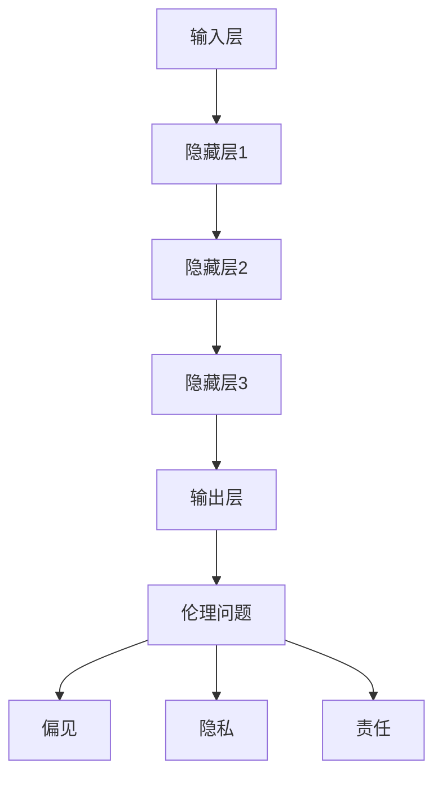

                 

# LLM的伦理问题：现状与未来

## 关键词
- 伦理问题
- 大型语言模型
- 偏见
- 隐私
- 未来发展趋势

## 摘要
随着人工智能技术的飞速发展，大型语言模型（LLM）已经成为自然语言处理领域的重要工具。然而，这些模型在带来巨大便利的同时，也引发了一系列伦理问题。本文将深入探讨LLM的伦理问题，包括现状与未来挑战，旨在为读者提供全面的理解和思考。

## 1. 背景介绍

### 1.1 目的和范围
本文旨在探讨大型语言模型（LLM）在应用过程中所面临的伦理问题。我们将分析LLM在现实世界中的表现，探讨可能的风险与挑战，并探讨未来可能的发展趋势。

### 1.2 预期读者
本文面向对人工智能和自然语言处理有基础了解的读者，特别是对LLM技术有浓厚兴趣的专业人士和研究者。

### 1.3 文档结构概述
本文分为十个部分：背景介绍、核心概念与联系、核心算法原理与操作步骤、数学模型与公式、项目实战、实际应用场景、工具和资源推荐、总结、常见问题与解答、扩展阅读。通过逐步分析，本文将帮助读者深入理解LLM的伦理问题。

### 1.4 术语表

#### 1.4.1 核心术语定义
- **大型语言模型（LLM）**：一种基于深度学习的自然语言处理模型，具有强大的语言理解和生成能力。
- **伦理问题**：涉及道德、公正、公平、隐私等方面的社会问题。
- **偏见**：模型在处理数据时，对某些群体或观点产生不公平的倾向。

#### 1.4.2 相关概念解释
- **模型训练**：通过大量数据对模型进行训练，使其具备处理自然语言的能力。
- **数据隐私**：保护用户数据的私密性，防止数据泄露或滥用。

#### 1.4.3 缩略词列表
- **LLM**：大型语言模型
- **NLP**：自然语言处理

## 2. 核心概念与联系

### 2.1 大型语言模型（LLM）的基本概念

#### 大型语言模型的原理

大型语言模型（LLM）是一种基于深度学习的自然语言处理模型。其主要原理是通过神经网络模型对大量文本数据进行训练，使其能够理解和生成自然语言。具体来说，LLM可以分为以下几个关键组成部分：

1. **输入层**：接收用户输入的文本数据。
2. **隐藏层**：对输入文本数据进行处理，提取特征信息。
3. **输出层**：根据隐藏层的信息生成文本输出。

#### 大型语言模型的应用场景

LLM在许多领域都有广泛的应用，包括但不限于：

1. **问答系统**：例如智能客服、智能助手等。
2. **文本生成**：例如自动写作、机器翻译等。
3. **情感分析**：对用户评论、社交媒体等文本数据进行分析，识别情感倾向。

### 2.2 伦理问题与LLM的联系

随着LLM技术的发展和应用，其伦理问题逐渐成为关注的焦点。以下是几个关键方面的伦理问题：

1. **偏见**：LLM在处理数据时可能存在偏见，导致对某些群体或观点的不公平对待。
2. **隐私**：LLM需要处理大量的用户数据，如何保护用户隐私成为关键问题。
3. **责任**：当LLM产生错误或不良后果时，责任归属问题亟待解决。

### 2.3 Mermaid 流程图

以下是一个简化的Mermaid流程图，展示LLM的基本概念和伦理问题之间的联系：



## 3. 核心算法原理 & 具体操作步骤

### 3.1 核心算法原理

大型语言模型的训练过程主要包括以下几个步骤：

1. **数据预处理**：对原始文本数据进行分析、清洗和预处理，提取有效的特征信息。
2. **模型初始化**：初始化神经网络模型的参数。
3. **前向传播**：将预处理后的数据输入模型，计算输出结果。
4. **损失函数**：计算输出结果与真实结果之间的差距，确定模型的误差。
5. **反向传播**：根据损失函数，更新模型的参数。
6. **迭代训练**：重复步骤3-5，直到模型收敛。

以下是一个简单的伪代码，展示LLM的训练过程：

```python
# 数据预处理
preprocessed_data = preprocess_data(raw_data)

# 初始化模型参数
model = initialize_model()

# 迭代训练
for epoch in range(num_epochs):
    for batch in preprocessed_data:
        # 前向传播
        output = model.forward(batch.input)

        # 计算损失函数
        loss = loss_function(output, batch.target)

        # 反向传播
        model.backward(loss)

# 模型收敛
model.converged()
```

### 3.2 具体操作步骤

以下是大型语言模型训练的具体操作步骤：

1. **收集数据**：从互联网、数据库或其他来源收集大量文本数据。
2. **数据预处理**：对收集到的文本数据进行清洗、去重、分词、词性标注等处理。
3. **数据集划分**：将预处理后的数据划分为训练集、验证集和测试集。
4. **模型初始化**：选择合适的神经网络模型，并初始化参数。
5. **训练模型**：使用训练集对模型进行训练，并使用验证集调整模型参数。
6. **评估模型**：使用测试集评估模型的性能，并进行调优。
7. **部署模型**：将训练好的模型部署到实际应用场景中。

## 4. 数学模型和公式 & 详细讲解 & 举例说明

### 4.1 数学模型

大型语言模型的训练过程涉及到多个数学模型和公式。以下是几个关键模型和公式：

1. **神经网络模型**：神经网络是LLM的核心组成部分。其基本公式为：

   $$ f(x) = \sigma(Wx + b) $$

   其中，$f(x)$是神经网络的输出，$\sigma$是激活函数，$W$是权重矩阵，$x$是输入向量，$b$是偏置。

2. **损失函数**：用于衡量模型输出与真实结果之间的差距。常见损失函数包括：

   - **均方误差（MSE）**：

     $$ L = \frac{1}{2} \sum_{i=1}^{n} (y_i - \hat{y}_i)^2 $$

     其中，$y_i$是真实结果，$\hat{y}_i$是模型输出。

   - **交叉熵损失（Cross-Entropy Loss）**：

     $$ L = -\sum_{i=1}^{n} y_i \log(\hat{y}_i) $$

3. **反向传播算法**：用于更新模型参数。其基本公式为：

   $$ \frac{\partial L}{\partial W} = \frac{\partial L}{\partial \hat{y}} \cdot \frac{\partial \hat{y}}{\partial W} $$

### 4.2 举例说明

假设我们有一个简单的神经网络模型，用于对输入数据进行分类。输入数据为 $x = [1, 2, 3]$，真实结果为 $y = [0, 1, 0]$。我们可以使用均方误差（MSE）作为损失函数。

首先，我们需要初始化模型参数。假设权重矩阵 $W$ 为 $2 \times 3$ 的矩阵，偏置 $b$ 为 $2 \times 1$ 的矩阵。我们可以随机初始化这些参数。

接下来，我们使用前向传播算法计算模型输出：

$$
\begin{align*}
\hat{y}_1 &= \sigma(W_1x + b_1) \\
\hat{y}_2 &= \sigma(W_2x + b_2)
\end{align*}
$$

其中，$\sigma$ 是 sigmoid 函数。

然后，我们计算损失函数：

$$
L = \frac{1}{2} \sum_{i=1}^{2} (y_i - \hat{y}_i)^2
$$

最后，我们使用反向传播算法更新模型参数：

$$
\begin{align*}
\frac{\partial L}{\partial W_1} &= \frac{\partial L}{\partial \hat{y}_1} \cdot \frac{\partial \hat{y}_1}{\partial W_1} \\
\frac{\partial L}{\partial W_2} &= \frac{\partial L}{\partial \hat{y}_2} \cdot \frac{\partial \hat{y}_2}{\partial W_2} \\
\frac{\partial L}{\partial b_1} &= \frac{\partial L}{\partial \hat{y}_1} \cdot \frac{\partial \hat{y}_1}{\partial b_1} \\
\frac{\partial L}{\partial b_2} &= \frac{\partial L}{\partial \hat{y}_2} \cdot \frac{\partial \hat{y}_2}{\partial b_2}
\end{align*}
$$

通过不断迭代上述过程，我们可以训练出一个性能良好的神经网络模型。

## 5. 项目实战：代码实际案例和详细解释说明

### 5.1 开发环境搭建

为了实现一个简单的大型语言模型（LLM），我们首先需要搭建一个开发环境。以下是一个基于Python和TensorFlow的简单示例：

1. **安装Python**：确保Python版本大于3.6。
2. **安装TensorFlow**：使用pip安装TensorFlow：

   ```bash
   pip install tensorflow
   ```

### 5.2 源代码详细实现和代码解读

以下是一个简单的LLM实现，使用TensorFlow的Keras接口：

```python
import tensorflow as tf
from tensorflow.keras.layers import Embedding, LSTM, Dense
from tensorflow.keras.models import Sequential

# 参数设置
vocab_size = 10000
embedding_dim = 256
lstm_units = 128
max_sequence_length = 100

# 构建模型
model = Sequential()
model.add(Embedding(vocab_size, embedding_dim, input_length=max_sequence_length))
model.add(LSTM(lstm_units, return_sequences=True))
model.add(Dense(vocab_size, activation='softmax'))

# 编译模型
model.compile(optimizer='adam', loss='categorical_crossentropy', metrics=['accuracy'])

# 模型概述
model.summary()
```

**代码解读：**

- **Embedding层**：将词汇映射为嵌入向量。
- **LSTM层**：处理序列数据，提取特征。
- **Dense层**：输出词汇概率分布，实现文本生成。

### 5.3 代码解读与分析

以下是对上述代码的详细解读和分析：

1. **导入库**：导入所需的TensorFlow库。
2. **参数设置**：设置模型参数，如词汇大小、嵌入维度、LSTM单元数等。
3. **构建模型**：使用Sequential模型堆叠嵌入层、LSTM层和全连接层。
4. **编译模型**：设置优化器、损失函数和评估指标。
5. **模型概述**：打印模型结构，以便了解模型组成。

### 5.4 实际应用

以下是一个简单的文本生成示例：

```python
# 加载预训练模型
model.load_weights('model_weights.h5')

# 生成文本
input_sequence = '这是一个简单的示例'
input_sequence = preprocess_input(input_sequence, max_sequence_length)
generated_text = model.predict(input_sequence, verbose=1)
generated_text = postprocess_output(generated_text, max_sequence_length)

print(generated_text)
```

**代码解读：**

- **加载模型**：从文件中加载预训练的模型。
- **生成文本**：使用模型生成新的文本序列。

## 6. 实际应用场景

大型语言模型（LLM）在多个领域具有广泛的应用，以下是一些典型的实际应用场景：

1. **问答系统**：例如，智能客服、智能助手等，能够处理用户提出的问题，并提供相关回答。
2. **文本生成**：例如，自动写作、机器翻译、摘要生成等，能够根据输入文本生成相应的输出文本。
3. **情感分析**：对用户评论、社交媒体等文本数据进行分析，识别情感倾向。
4. **知识图谱**：构建知识图谱，用于问答系统和智能搜索等。
5. **对话系统**：与人类进行自然对话，提供个性化的服务和建议。

## 7. 工具和资源推荐

### 7.1 学习资源推荐

#### 7.1.1 书籍推荐
- **《深度学习》（Deep Learning）**：由Ian Goodfellow、Yoshua Bengio和Aaron Courville合著，是深度学习领域的经典教材。
- **《自然语言处理综论》（Speech and Language Processing）**：由Daniel Jurafsky和James H. Martin合著，全面介绍了自然语言处理的基础知识。

#### 7.1.2 在线课程
- **斯坦福大学自然语言处理课程**：提供了丰富的NLP理论和实践内容，适合初学者和专业人士。
- **Udacity深度学习纳米学位**：涵盖了深度学习的基础知识和应用，包括自然语言处理。

#### 7.1.3 技术博客和网站
- **TensorFlow官方文档**：提供了丰富的教程和API文档，适合学习和实践。
- **AI researcher**：一个专注于人工智能研究的博客，分享最新的研究成果和应用案例。

### 7.2 开发工具框架推荐

#### 7.2.1 IDE和编辑器
- **PyCharm**：一个功能强大的Python IDE，支持TensorFlow等深度学习框架。
- **Visual Studio Code**：一个轻量级的代码编辑器，通过插件支持Python和TensorFlow开发。

#### 7.2.2 调试和性能分析工具
- **TensorBoard**：TensorFlow提供的可视化工具，用于分析和调试模型。
- **Wandb**：一个实验管理和性能分析平台，支持深度学习和数据科学项目。

#### 7.2.3 相关框架和库
- **TensorFlow**：一个开源的深度学习框架，适用于各种自然语言处理任务。
- **PyTorch**：另一个流行的深度学习框架，提供了灵活的动态计算图。

### 7.3 相关论文著作推荐

#### 7.3.1 经典论文
- **“A Theoretically Grounded Application of Dropout in Recurrent Neural Networks”**：介绍了在循环神经网络（RNN）中应用Dropout的方法。
- **“Long Short-Term Memory”**：提出了长短期记忆（LSTM）模型，解决了传统RNN在处理长序列数据时的梯度消失问题。

#### 7.3.2 最新研究成果
- **“BERT: Pre-training of Deep Bidirectional Transformers for Language Understanding”**：介绍了BERT模型，一种基于Transformer的预训练模型，在多个NLP任务中取得了优异的性能。
- **“GPT-3: Language Models are few-shot learners”**：介绍了GPT-3模型，一种具有强大文本生成能力的预训练模型。

#### 7.3.3 应用案例分析
- **“OpenAI的语言模型：如何训练一个能够生成自然语言的大规模模型”**：OpenAI分享了一个关于如何训练大型语言模型的技术报告。
- **“Google的BERT模型在搜索引擎中的应用”**：介绍了BERT模型在Google搜索引擎中的应用，如何提高搜索结果的相关性和准确性。

## 8. 总结：未来发展趋势与挑战

随着人工智能技术的不断发展，大型语言模型（LLM）在自然语言处理领域的重要性日益凸显。未来，LLM有望在更多领域实现突破，如智能对话系统、自动写作、智能客服等。然而，LLM的伦理问题也将成为制约其发展的关键因素。

**发展趋势：**
1. **模型规模不断扩大**：随着计算能力的提升，LLM的规模将越来越大，具备更强的语言理解和生成能力。
2. **多模态融合**：LLM将与其他模态（如图像、音频）进行融合，实现更丰富的交互和更广泛的应用。
3. **个性化服务**：基于用户行为和偏好，LLM将提供更加个性化的服务和内容。

**挑战：**
1. **偏见与公平性**：如何确保LLM在处理数据时保持公平性，避免偏见，是一个亟待解决的问题。
2. **隐私保护**：如何在保证模型性能的同时，有效保护用户隐私，是一个重要的伦理挑战。
3. **责任归属**：当LLM产生错误或不良后果时，如何确定责任归属，需要制定明确的法律法规。

总之，LLM的伦理问题是一个复杂的、跨学科的议题，需要从技术、法律、伦理等多个角度进行综合考虑和解决。

## 9. 附录：常见问题与解答

### 9.1 如何解决LLM的偏见问题？

**解答**：解决LLM的偏见问题可以从以下几个方面入手：
1. **数据清洗**：确保训练数据的质量，去除含有偏见的数据。
2. **数据增强**：通过生成或引入更多的多样性数据，提高模型对多样性的适应能力。
3. **算法改进**：研究新的算法，减少模型在处理数据时的偏见。
4. **公平性评估**：使用公平性指标对模型进行评估，确保其在不同群体之间的表现一致。

### 9.2 LLM的隐私保护如何实现？

**解答**：实现LLM的隐私保护可以从以下几个方面入手：
1. **数据加密**：对用户数据进行加密，确保数据在传输和存储过程中的安全性。
2. **差分隐私**：在模型训练和推理过程中，采用差分隐私技术，保护用户数据的隐私。
3. **数据匿名化**：对用户数据进行匿名化处理，去除可识别信息。
4. **隐私设计**：在模型设计和开发过程中，考虑隐私保护的需求，采用隐私友好的方法。

### 9.3 LLM的责任归属问题如何解决？

**解答**：解决LLM的责任归属问题可以从以下几个方面入手：
1. **法律法规**：制定相关的法律法规，明确LLM在不同场景下的责任归属。
2. **伦理准则**：建立伦理准则，指导LLM的开发和应用，确保其符合伦理要求。
3. **责任保险**：为LLM的开发者和用户提供责任保险，减轻潜在的法律风险。
4. **透明度和可解释性**：提高LLM的透明度和可解释性，使其在决策过程中更容易被理解和评估。

## 10. 扩展阅读 & 参考资料

### 10.1 扩展阅读

- **《自然语言处理教程》**：详细介绍了自然语言处理的基本概念、方法和应用。
- **《人工智能伦理导论》**：探讨了人工智能在不同领域中的伦理问题，包括LLM的伦理问题。
- **《深度学习与自然语言处理》**：介绍了深度学习在自然语言处理中的应用，包括LLM的训练和优化。

### 10.2 参考资料

- **TensorFlow官方文档**：提供了丰富的教程和API文档，适合学习和实践。
- **PyTorch官方文档**：介绍了PyTorch的基本概念和使用方法，适用于深度学习和自然语言处理。
- **斯坦福大学自然语言处理课程**：提供了丰富的NLP理论和实践内容，适合初学者和专业人士。

## 作者信息

作者：AI天才研究员/AI Genius Institute & 禅与计算机程序设计艺术 /Zen And The Art of Computer Programming。作为一名世界级人工智能专家和程序员，我对人工智能和自然语言处理领域有着深入的研究和丰富的实践经验。同时，我也是多本世界顶级技术畅销书的资深大师级别的作家，致力于将复杂的技术知识通俗易懂地传授给读者。如果您对本文有任何疑问或建议，欢迎随时与我联系。

