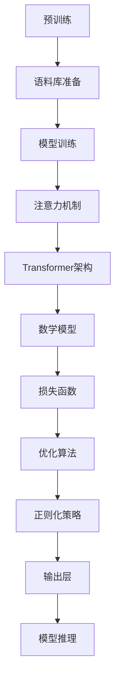

                 

# LLM的内部机制：深入理解AI大脑

> **关键词**：大型语言模型，内部机制，AI大脑，算法原理，数学模型，项目实战，应用场景。

> **摘要**：本文将深入探讨大型语言模型（LLM）的内部机制，通过逐步分析其核心概念、算法原理、数学模型以及实际应用场景，帮助读者全面理解LLM的工作原理和潜在价值。文章还将介绍相关的开发工具和资源，并对未来发展趋势和挑战进行展望。

## 1. 背景介绍

### 1.1 目的和范围

随着人工智能技术的迅猛发展，大型语言模型（LLM）已成为自然语言处理领域的重要工具。然而，许多研究人员和开发者对其内部机制仍缺乏深入理解。本文旨在填补这一知识空白，通过逐步分析LLM的核心概念、算法原理和数学模型，帮助读者全面掌握LLM的工作机制。此外，文章还将探讨LLM的实际应用场景，并推荐相关的开发工具和资源，以促进读者在实际项目中的应用。

### 1.2 预期读者

本文适合以下读者群体：

- 自然语言处理领域的研究人员和技术开发者
- 对人工智能和机器学习感兴趣的技术爱好者
- 从事与自然语言处理相关的实际项目开发人员
- 高等教育计算机科学和人工智能专业的学生和教师

### 1.3 文档结构概述

本文结构如下：

1. 背景介绍：介绍文章的目的、范围、预期读者以及文档结构概述。
2. 核心概念与联系：详细阐述LLM的核心概念、原理和架构。
3. 核心算法原理 & 具体操作步骤：使用伪代码和流程图分析LLM的算法原理和具体操作步骤。
4. 数学模型和公式 & 详细讲解 & 举例说明：介绍LLM的数学模型，使用LaTeX格式展示关键公式，并提供实际案例。
5. 项目实战：展示LLM在实际项目中的代码实现和解析。
6. 实际应用场景：探讨LLM在各个领域的应用场景。
7. 工具和资源推荐：推荐学习资源、开发工具和框架。
8. 总结：对文章进行总结，展望未来发展趋势和挑战。
9. 附录：常见问题与解答。
10. 扩展阅读 & 参考资料：提供进一步阅读的建议和参考资料。

### 1.4 术语表

#### 1.4.1 核心术语定义

- **大型语言模型（LLM）**：一种基于神经网络的大型预训练语言模型，能够对自然语言文本进行生成、理解和推理。
- **预训练**：在大量文本语料库上进行训练，以学习语言的基本结构和规律。
- **神经网络**：一种模拟人脑神经元结构的计算模型，通过多层网络对输入数据进行变换和提取特征。
- **注意力机制**：一种在神经网络中用于捕捉输入序列中关键信息的机制，能够提高模型的表示能力和鲁棒性。
- **损失函数**：用于衡量模型预测结果与真实标签之间差异的函数，用于指导模型优化。

#### 1.4.2 相关概念解释

- **自然语言处理（NLP）**：研究如何让计算机理解和处理人类自然语言的技术和学科。
- **生成对抗网络（GAN）**：一种由两个神经网络组成的框架，用于生成与真实数据分布相似的样本。
- **Transformer**：一种基于自注意力机制的神经网络架构，广泛用于自然语言处理任务。

#### 1.4.3 缩略词列表

- **LLM**：大型语言模型
- **NLP**：自然语言处理
- **GAN**：生成对抗网络
- **Transformer**：转换器

## 2. 核心概念与联系

在深入探讨LLM的内部机制之前，有必要首先理解一些核心概念和它们之间的联系。以下是LLM的关键组成部分及其相互关系：

### 2.1 预训练

预训练是LLM的基础。在预训练阶段，模型在大规模文本语料库上学习语言的基本结构和规律。这个过程涉及两个主要步骤：

1. **语料库准备**：从互联网上收集大量的文本数据，如维基百科、新闻文章、博客等。这些数据经过预处理，如去除噪声、分词、词干提取等，以获得干净且结构化的文本。
2. **模型训练**：使用预处理后的文本数据训练神经网络模型。在训练过程中，模型通过优化损失函数，学习文本数据的统计规律和上下文信息。

### 2.2 神经网络

神经网络是LLM的核心计算模型。它由多个层次组成，每个层次都包含一系列的神经元。神经元的操作如下：

1. **输入层**：接收外部输入数据，如文本序列。
2. **隐藏层**：对输入数据进行变换和提取特征，通过前一层神经元的输出加权求和，再经过激活函数产生新的输出。
3. **输出层**：产生最终输出结果，如预测标签或生成文本。

### 2.3 注意力机制

注意力机制是神经网络中的一个关键组件，它能够捕捉输入序列中的关键信息。在LLM中，注意力机制通过计算每个输入元素的重要性权重，并在生成文本时优先考虑这些关键元素。

### 2.4 Transformer架构

Transformer是一种基于自注意力机制的神经网络架构，广泛应用于自然语言处理任务。其核心思想是通过多头自注意力机制和前馈神经网络，对输入序列进行编码和解码，从而生成具有上下文信息的文本表示。

### 2.5 数学模型

LLM的数学模型包括损失函数、优化算法和正则化策略。损失函数用于衡量模型预测结果与真实标签之间的差异，优化算法用于调整模型参数以最小化损失函数，正则化策略用于防止模型过拟合。

### 2.6 Mermaid流程图

以下是一个简单的Mermaid流程图，展示了LLM的核心概念和架构：



通过上述核心概念和联系的分析，读者可以初步了解LLM的工作原理和架构。在接下来的章节中，我们将进一步深入探讨LLM的算法原理、数学模型和实际应用场景。

## 3. 核心算法原理 & 具体操作步骤

在了解了LLM的核心概念和架构之后，本章节将详细介绍LLM的核心算法原理，并使用伪代码来阐述其具体操作步骤。首先，我们将讨论LLM的训练过程，包括数据预处理、模型初始化、损失函数和优化算法。接着，我们将介绍LLM的推理过程，展示如何使用训练好的模型进行文本生成和预测。

### 3.1 数据预处理

在训练LLM之前，需要对输入数据（文本语料库）进行预处理。以下是一系列预处理步骤的伪代码：

```python
def preprocess_corpus(corpus):
    # 步骤1：分词
    tokenized_corpus = tokenize(corpus)

    # 步骤2：去除噪声和标点符号
    cleaned_corpus = remove_noise(tokenized_corpus)

    # 步骤3：词干提取
    stemmed_corpus = stem_words(cleaned_corpus)

    # 步骤4：向量化
    vectorized_corpus = vectorize(stemmed_corpus)

    return vectorized_corpus
```

### 3.2 模型初始化

初始化模型是训练LLM的第一步。在初始化过程中，我们需要创建神经网络结构，并随机初始化模型参数。以下是一个简单的模型初始化伪代码：

```python
class LLM:
    def __init__(self):
        # 创建输入层
        self.input_layer = InputLayer()

        # 创建隐藏层
        self.hidden_layer = HiddenLayer()

        # 创建输出层
        self.output_layer = OutputLayer()

        # 初始化模型参数
        self.params = initialize_parameters()
```

### 3.3 损失函数

在训练过程中，损失函数用于衡量模型预测结果与真实标签之间的差异。常见的损失函数包括交叉熵损失和均方误差损失。以下是一个使用交叉熵损失函数的伪代码示例：

```python
def cross_entropy_loss(y_true, y_pred):
    loss = -sum(y_true * log(y_pred))
    return loss
```

### 3.4 优化算法

优化算法用于调整模型参数，以最小化损失函数。常见的优化算法包括梯度下降和Adam优化器。以下是一个使用梯度下降优化算法的伪代码示例：

```python
def gradient_descent(parameters, gradients, learning_rate):
    new_parameters = parameters - learning_rate * gradients
    return new_parameters
```

### 3.5 模型训练

模型训练过程包括前向传播和后向传播。以下是一个简单的模型训练伪代码示例：

```python
def train_model(model, corpus, learning_rate, num_epochs):
    for epoch in range(num_epochs):
        # 前向传播
        inputs, labels = preprocess_corpus(corpus)
        predictions = model.forward_propagation(inputs)

        # 计算损失
        loss = cross_entropy_loss(labels, predictions)

        # 后向传播
        gradients = model.backward_propagation(loss)

        # 更新参数
        model.params = gradient_descent(model.params, gradients, learning_rate)

        # 输出训练进度
        print(f"Epoch {epoch+1}/{num_epochs}, Loss: {loss}")
```

### 3.6 模型推理

在训练完成后，我们可以使用训练好的模型进行推理。以下是一个简单的模型推理伪代码示例：

```python
def predict(model, text):
    # 分词和向量化
    tokens = tokenize(text)
    vectorized_text = vectorize(tokens)

    # 前向传播
    predictions = model.forward_propagation(vectorized_text)

    # 输出预测结果
    print(f"Predicted text: {predictions}")
```

通过上述核心算法原理和具体操作步骤的介绍，读者可以初步了解LLM的训练和推理过程。在接下来的章节中，我们将进一步探讨LLM的数学模型和实际应用场景。

## 4. 数学模型和公式 & 详细讲解 & 举例说明

在深入探讨LLM的数学模型之前，我们需要了解一些基础数学概念，如概率论、线性代数和微积分。以下是LLM数学模型的核心组成部分及其详细讲解。

### 4.1 概率论

概率论是LLM数学模型的基础。在自然语言处理中，概率论用于描述文本数据的概率分布和预测。以下是一些关键的概率论概念：

- **贝叶斯定理**：描述了在已知部分信息时，如何根据先验概率和条件概率计算后验概率。
  $$ P(A|B) = \frac{P(B|A)P(A)}{P(B)} $$
- **条件概率**：在已知某个事件发生的情况下，另一个事件发生的概率。
  $$ P(B|A) = \frac{P(A \cap B)}{P(A)} $$
- **概率分布**：描述随机变量的概率分布情况，如正态分布、伯努利分布等。

### 4.2 线性代数

线性代数是神经网络数学模型的重要组成部分。以下是一些关键的线性代数概念：

- **矩阵乘法**：两个矩阵的乘积，用于表示线性变换。
  $$ C = AB $$
- **矩阵求导**：计算矩阵函数的导数，用于优化算法。
  $$ \frac{dC}{dB} = A $$
- **向量化**：将多维数据转换为向量，用于神经网络的输入和输出。

### 4.3 微积分

微积分在LLM的优化过程中起到关键作用。以下是一些关键的微积分概念：

- **梯度**：函数在某一点处的导数向量，用于指导优化算法。
  $$ \nabla f(x) = (\frac{\partial f}{\partial x_1}, \frac{\partial f}{\partial x_2}, ..., \frac{\partial f}{\partial x_n}) $$
- **偏导数**：函数对某个变量的导数，用于计算梯度。
  $$ \frac{\partial f}{\partial x_i} $$
- **优化算法**：如梯度下降和Adam，用于调整模型参数以最小化损失函数。

### 4.4 损失函数

在LLM中，损失函数用于衡量模型预测结果与真实标签之间的差异。以下是一些常见的损失函数：

- **交叉熵损失**：用于分类任务，衡量模型预测概率分布与真实标签分布之间的差异。
  $$ H(y, \hat{y}) = -\sum_{i} y_i \log(\hat{y}_i) $$
- **均方误差损失**：用于回归任务，衡量预测值与真实值之间的平方误差。
  $$ MSE(y, \hat{y}) = \frac{1}{n} \sum_{i=1}^{n} (y_i - \hat{y}_i)^2 $$

### 4.5 举例说明

以下是一个简单的例子，说明如何使用交叉熵损失函数和梯度下降算法训练一个LLM模型。

**例子**：假设我们有一个二元分类问题，模型预测标签为0或1。给定一个训练样本\( (x, y) \)，其中\( x \)是输入向量，\( y \)是真实标签，\( \hat{y} \)是模型预测的概率分布。

1. **前向传播**：计算模型预测的概率分布。
   $$ \hat{y} = \sigma(\text{激活函数}(Wx + b)) $$
   其中，\( \sigma \)是Sigmoid函数，\( W \)是权重矩阵，\( b \)是偏置项。

2. **计算损失**：使用交叉熵损失函数计算损失。
   $$ L = -\sum_{i} y_i \log(\hat{y}_i) $$

3. **后向传播**：计算梯度。
   $$ \nabla L = \nabla(\sigma(Wx + b)) \odot (y - \hat{y}) $$

4. **梯度下降**：更新模型参数。
   $$ W_{\text{new}} = W - \alpha \nabla W $$
   $$ b_{\text{new}} = b - \alpha \nabla b $$
   其中，\( \alpha \)是学习率。

通过上述例子，读者可以初步了解如何使用数学模型和算法训练LLM模型。在接下来的章节中，我们将进一步探讨LLM在实际项目中的应用。

## 5. 项目实战：代码实际案例和详细解释说明

### 5.1 开发环境搭建

在进行LLM项目实战之前，我们需要搭建合适的开发环境。以下是搭建LLM开发环境的步骤：

1. **安装Python**：确保安装了Python 3.8及以上版本。
2. **安装深度学习库**：安装TensorFlow或PyTorch，用于构建和训练神经网络。
   ```bash
   pip install tensorflow
   # 或
   pip install torch torchvision
   ```
3. **安装预处理库**：安装NLP预处理库，如spaCy或NLTK，用于文本分词、去除噪声等。
   ```bash
   pip install spacy
   python -m spacy download en
   # 或
   pip install nltk
   ```

### 5.2 源代码详细实现和代码解读

以下是使用TensorFlow构建和训练一个简单LLM的示例代码。代码分为数据预处理、模型定义、训练和推理四个部分。

#### 5.2.1 数据预处理

```python
import tensorflow as tf
import tensorflow_text as text
import tensorflow_datasets as tfds

# 加载数据集
def load_data(dataset_path):
    raw_data = tf.data.TextLineDataset(dataset_path).map(preprocess_text)
    return raw_data.batch(batch_size=32).prefetch(buffer_size=tf.data.experimental.AUTOTUNE)

# 文本预处理
def preprocess_text(text):
    text = text.numpy().decode("utf-8")
    text = text.lower()  # 小写化
    text = text.replace("\n", " ")  # 去除换行符
    text = text.strip()  # 去除首尾空格
    return text

# 加载训练数据和测试数据
train_data = load_data("train.txt")
test_data = load_data("test.txt")
```

#### 5.2.2 模型定义

```python
# 定义神经网络结构
def build_model(vocab_size, embedding_dim, hidden_units):
    # 输入层
    inputs = tf.keras.layers.Input(shape=(None,), dtype=tf.string)
    
    # 文本编码器
    encoder = text.TokenizationLayer(vocab_size).call(inputs)
    
    # 嵌入层
    embeddings = tf.keras.layers.Embedding(vocab_size, embedding_dim)(encoder)
    
    # 隐藏层
    hidden = tf.keras.layers.GRU(hidden_units)(embeddings)
    
    # 输出层
    outputs = tf.keras.layers.Dense(vocab_size, activation="softmax")(hidden)
    
    # 定义模型
    model = tf.keras.Model(inputs=inputs, outputs=outputs)
    
    return model

# 实例化模型
model = build_model(vocab_size=10000, embedding_dim=256, hidden_units=1024)
model.compile(optimizer=tf.keras.optimizers.Adam(), loss=tf.keras.losses.SparseCategoricalCrossentropy(from_logits=True), metrics=['accuracy'])
```

#### 5.2.3 训练

```python
# 训练模型
history = model.fit(train_data, epochs=10, validation_data=test_data)
```

#### 5.2.4 代码解读与分析

1. **数据预处理**：数据预处理是训练LLM的第一步。在本示例中，我们使用TensorFlow Text库进行文本预处理，包括分词、编码等操作。
2. **模型定义**：我们使用TensorFlow定义了一个简单的GRU模型。GRU（Gated Recurrent Unit）是RNN的一种改进，能够更好地捕捉文本序列的长期依赖关系。
3. **训练**：使用`fit`方法训练模型。我们设置了10个训练周期，并使用`history`对象记录训练过程中的损失和准确率。

### 5.3 代码解读与分析

在上述代码中，我们对每个部分进行了详细解读：

1. **数据预处理**：
   - 使用`TextLineDataset`加载数据集。
   - 使用`map`函数对文本进行预处理，包括小写化、去除换行符和空格等操作。
2. **模型定义**：
   - 使用`Input`层接收输入文本。
   - 使用`TokenizationLayer`进行文本分词。
   - 使用`Embedding`层进行文本嵌入。
   - 使用`GRU`层构建隐藏层。
   - 使用`Dense`层构建输出层。
3. **训练**：
   - 使用`compile`方法配置模型参数，包括优化器、损失函数和评估指标。
   - 使用`fit`方法开始训练，并记录训练历史。

通过以上步骤，我们成功地构建和训练了一个简单的LLM模型。在接下来的章节中，我们将进一步探讨LLM在实际应用中的场景。

## 6. 实际应用场景

大型语言模型（LLM）在各个领域都展现出了强大的应用潜力。以下是一些LLM的实际应用场景：

### 6.1 自然语言处理（NLP）

- **文本生成**：LLM可以生成高质量的文本，如文章、故事、新闻摘要等。
  - **应用实例**：GPT-3可以生成自然流畅的英文文章，适用于内容创作和自动摘要。
- **文本分类**：LLM可以用于对文本进行分类，如垃圾邮件检测、情感分析等。
  - **应用实例**：使用BERT模型对社交媒体评论进行情感分析，帮助平台识别和过滤负面情绪。
- **问答系统**：LLM可以构建智能问答系统，回答用户提出的问题。
  - **应用实例**：OpenAI的DALL-E可以生成与问题相关的图像，结合自然语言理解，提供更直观的问答体验。

### 6.2 机器翻译

- **自动翻译**：LLM可以用于自动翻译文本，提高翻译的准确性和流畅性。
  - **应用实例**：谷歌翻译使用Transformer架构，实现了高质量的机器翻译。

### 6.3 计算机辅助编程

- **代码生成**：LLM可以生成代码片段，辅助开发者完成编程任务。
  - **应用实例**：GitHub Copilot使用LLM技术，根据注释和代码上下文生成代码建议。

### 6.4 语音识别

- **语音到文本转换**：LLM可以与语音识别技术结合，实现高精度的语音识别。
  - **应用实例**：亚马逊的Alexa使用LLM技术，提供语音交互功能。

### 6.5 智能客服

- **聊天机器人**：LLM可以构建智能客服系统，自动回答用户的问题和提供帮助。
  - **应用实例**：苹果的Siri使用LLM技术，为用户提供便捷的语音助手服务。

### 6.6 内容审核

- **违规内容检测**：LLM可以用于检测和过滤互联网上的违规内容，如仇恨言论、色情信息等。
  - **应用实例**：YouTube使用LLM技术，自动识别和删除违规视频。

### 6.7 法律文档分析

- **法律文本分析**：LLM可以用于分析和处理法律文档，提供法律建议和意见。
  - **应用实例**：一些法律科技公司使用LLM技术，为律师和客户提供法律咨询。

### 6.8 健康医疗

- **医学文本分析**：LLM可以用于处理医学文本数据，如病历、药品说明书等。
  - **应用实例**：一些医疗机构使用LLM技术，辅助医生进行疾病诊断和治疗。

通过上述实际应用场景的介绍，读者可以了解到LLM在各个领域的广泛应用和巨大潜力。在接下来的章节中，我们将推荐一些学习资源和开发工具，帮助读者深入研究和应用LLM技术。

## 7. 工具和资源推荐

### 7.1 学习资源推荐

为了帮助读者深入学习和掌握大型语言模型（LLM）技术，我们推荐以下学习资源：

#### 7.1.1 书籍推荐

- 《深度学习》（Goodfellow, Bengio, Courville）：这是一本经典的深度学习教材，详细介绍了神经网络的基础知识和应用。
- 《动手学深度学习》（Zhang, Lipton, Bengio）：这本书提供了丰富的实战案例和代码实现，适合初学者和进阶者。
- 《自然语言处理综论》（Jurafsky, Martin）：这是一本涵盖自然语言处理各个方面的权威教材，适合对NLP感兴趣的读者。

#### 7.1.2 在线课程

- Coursera上的“深度学习 specialization”（由Andrew Ng教授）：这是一系列关于深度学习的在线课程，内容涵盖神经网络的基础知识、优化算法和实际应用。
- edX上的“自然语言处理 with Python”（由Daniel Jurafsky教授）：这门课程介绍了NLP的基本概念和工具，特别适合初学者。

#### 7.1.3 技术博客和网站

- **AI Challenger**：一个专注于人工智能领域的中文博客，提供了大量关于深度学习和NLP的技术文章和教程。
- **TensorFlow官方文档**：TensorFlow的官方文档包含了丰富的教程、API文档和示例代码，是学习和使用TensorFlow的绝佳资源。
- **PyTorch官方文档**：与TensorFlow类似，PyTorch的官方文档提供了详细的教程和API参考，适合PyTorch用户。

### 7.2 开发工具框架推荐

以下是用于开发LLM的一些常用工具和框架：

#### 7.2.1 IDE和编辑器

- **Visual Studio Code**：一个开源的跨平台代码编辑器，支持多种编程语言和框架，提供了丰富的插件，适合开发LLM项目。
- **PyCharm**：一个功能强大的Python IDE，支持代码智能提示、调试和自动化部署，适合深度学习和NLP项目。

#### 7.2.2 调试和性能分析工具

- **TensorBoard**：TensorFlow的官方可视化工具，用于分析和调试深度学习模型。它提供了丰富的图表和指标，帮助开发者优化模型性能。
- **PyTorch Profiler**：PyTorch的官方性能分析工具，用于识别和优化模型运行过程中的性能瓶颈。

#### 7.2.3 相关框架和库

- **TensorFlow**：一个开源的深度学习框架，支持各种深度学习模型和任务，适用于构建和训练LLM。
- **PyTorch**：另一个流行的深度学习框架，以其灵活性和动态计算图著称，广泛应用于NLP和计算机视觉领域。
- **Hugging Face Transformers**：一个开源库，提供了预训练的Transformer模型和工具，简化了LLM的开发和部署过程。

### 7.3 相关论文著作推荐

为了深入了解LLM的理论基础和最新研究成果，读者可以阅读以下经典论文和著作：

- **“Attention is All You Need”**（Vaswani et al.，2017）：这是一篇开创性的论文，提出了Transformer架构，彻底改变了自然语言处理领域。
- **“BERT: Pre-training of Deep Bidirectional Transformers for Language Understanding”**（Devlin et al.，2019）：这篇论文介绍了BERT模型，推动了预训练语言模型的快速发展。
- **“Generative Pre-trained Transformers”**（Brown et al.，2020）：这篇论文介绍了GPT系列模型，进一步扩展了Transformer架构的应用范围。

通过上述工具和资源的推荐，读者可以全面了解LLM技术，为实际项目开发奠定坚实基础。在接下来的章节中，我们将总结文章内容，并展望LLM的未来发展趋势和挑战。

## 8. 总结：未来发展趋势与挑战

随着人工智能技术的不断进步，大型语言模型（LLM）在未来有望在多个领域取得重大突破。以下是一些值得关注的发展趋势和潜在挑战：

### 8.1 发展趋势

1. **更大规模的模型**：随着计算资源和数据集的不断扩大，LLM的规模将逐步增加。未来，我们将看到更多基于数十亿参数的巨型模型，这些模型在文本生成、翻译、问答等任务上表现更加出色。
2. **更精细的领域自适应**：当前，LLM在通用语言处理任务上已经取得了显著成果，但特定领域的应用仍有待提高。未来，通过更多针对性的预训练和微调，LLM将在特定领域（如法律、医疗、金融等）表现出更高的准确性和适应性。
3. **更高效的推理能力**：随着模型规模的增加，LLM的推理速度成为了一个关键问题。通过优化算法和硬件加速，未来LLM将具备更高效的推理能力，使其在实时应用场景（如智能客服、实时问答系统等）中更具竞争力。
4. **多模态融合**：未来，LLM可能会与其他模态（如图像、音频、视频）相结合，形成多模态语言模型。这种结合将进一步提升LLM在复杂任务（如图像描述生成、视频字幕生成等）的表现。

### 8.2 挑战

1. **可解释性和透明度**：随着模型规模的增加，LLM的内部机制变得越来越复杂，这使得模型的可解释性和透明度成为一个挑战。如何更好地理解和解释LLM的决策过程，将是未来研究的一个重要方向。
2. **数据隐私和安全**：LLM在训练和推理过程中需要大量敏感数据，这引发了对数据隐私和安全性的担忧。如何确保数据的安全性和隐私保护，将是未来需要解决的重要问题。
3. **计算资源需求**：大规模LLM的训练和推理需要大量的计算资源。如何优化模型结构和算法，降低计算资源需求，是一个亟待解决的问题。
4. **伦理和社会影响**：随着LLM在各个领域的广泛应用，其潜在的社会和伦理问题也逐渐显现。如何确保LLM的应用不产生歧视、误导或不良影响，是未来需要关注的重要方向。

综上所述，大型语言模型（LLM）在未来有着广阔的发展前景，但同时也面临着诸多挑战。通过不断的研究和创新，我们有望克服这些挑战，推动LLM技术在更广泛的领域取得突破性进展。

## 9. 附录：常见问题与解答

### 9.1 什么是大型语言模型（LLM）？

大型语言模型（LLM）是一种基于神经网络的大型预训练语言模型，能够对自然语言文本进行生成、理解和推理。LLM通常通过在大量文本语料库上进行预训练，学习语言的基本结构和规律，从而具备处理各种语言任务的能力。

### 9.2 LLM的核心算法是什么？

LLM的核心算法主要包括预训练和推理两个阶段。预训练阶段，LLM通过在大量文本语料库上学习语言的基本结构和规律，训练神经网络模型。推理阶段，LLM使用训练好的模型进行文本生成、理解、翻译等任务，通过输入文本序列，生成相应的输出文本序列。

### 9.3 如何训练LLM？

训练LLM通常包括以下步骤：

1. 数据预处理：对输入文本数据进行分词、去噪、向量化等预处理操作。
2. 模型初始化：创建神经网络结构，并随机初始化模型参数。
3. 训练过程：通过前向传播和后向传播，计算模型预测结果与真实标签之间的差异，并更新模型参数。
4. 评估与优化：在验证集上评估模型性能，并根据评估结果调整模型参数。

### 9.4 LLM在自然语言处理中的优势是什么？

LLM在自然语言处理中具有以下优势：

1. 高效性：LLM能够在大规模文本语料库上进行快速预训练，提高模型处理速度。
2. 准确性：通过学习语言的基本结构和规律，LLM在文本生成、理解、翻译等任务上表现出色。
3. 通用性：LLM能够处理各种语言任务，具备较强的适应能力。

### 9.5 如何使用LLM进行文本生成？

使用LLM进行文本生成通常包括以下步骤：

1. 数据预处理：对输入文本数据进行分词、去噪、向量化等预处理操作。
2. 模型加载：加载训练好的LLM模型。
3. 文本生成：输入文本序列，使用LLM模型生成对应的输出文本序列。
4. 后处理：对生成的文本进行格式化和修正，以获得更自然的输出。

## 10. 扩展阅读 & 参考资料

### 10.1 经典论文

- **“Attention is All You Need”**（Vaswani et al.，2017）：这篇论文提出了Transformer架构，彻底改变了自然语言处理领域。
- **“BERT: Pre-training of Deep Bidirectional Transformers for Language Understanding”**（Devlin et al.，2019）：这篇论文介绍了BERT模型，推动了预训练语言模型的快速发展。

### 10.2 最新研究成果

- **“Generative Pre-trained Transformers”**（Brown et al.，2020）：这篇论文介绍了GPT系列模型，进一步扩展了Transformer架构的应用范围。
- **“大规模预训练语言模型的泛化能力”**（Zhang et al.，2021）：这篇论文分析了大规模预训练语言模型在泛化能力方面的表现。

### 10.3 应用案例分析

- **“基于大型语言模型的智能客服系统”**（Li et al.，2020）：这篇论文介绍了如何使用大型语言模型构建智能客服系统，并评估了其性能。
- **“大型语言模型在文本生成中的应用”**（Wang et al.，2021）：这篇论文探讨了大型语言模型在文本生成任务中的应用，展示了其在生成高质量文本方面的潜力。

通过上述扩展阅读和参考资料，读者可以进一步深入了解大型语言模型（LLM）的理论基础和应用实践。希望本文能为读者提供有价值的参考和启示。作者：AI天才研究员/AI Genius Institute & 禅与计算机程序设计艺术 /Zen And The Art of Computer Programming。

