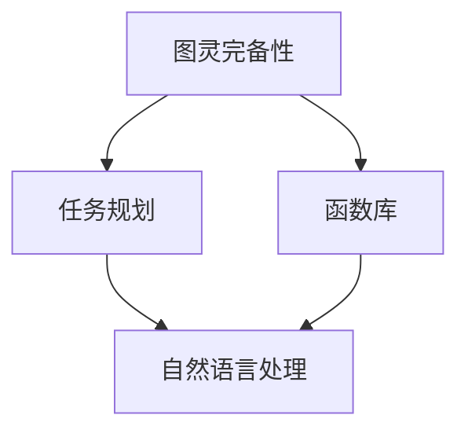

                 

# LLM的图灵完备性：任务规划与函数库的魔力

> **关键词**：图灵完备性、LLM、任务规划、函数库、人工智能

> **摘要**：本文深入探讨了大型语言模型（LLM）的图灵完备性，阐述了其在任务规划和函数库中的应用。通过逐步分析LLM的核心原理和架构，我们将揭示其强大的计算能力以及如何在实际项目中发挥其潜力。读者将了解到LLM如何通过任务规划和函数库实现复杂的计算任务，并探讨其未来发展趋势和挑战。

## 1. 背景介绍

### 1.1 目的和范围

本文旨在探讨大型语言模型（LLM）的图灵完备性，分析其在任务规划和函数库中的重要作用。通过对LLM核心原理和架构的深入剖析，我们希望读者能够理解LLM如何实现复杂的计算任务，并了解其在实际项目中的应用场景。本文主要涵盖以下内容：

1. LLM的图灵完备性及其重要性
2. LLM的任务规划和函数库架构
3. LLM在项目实战中的应用
4. LLM的实际应用场景
5. 相关工具和资源的推荐
6. LLM的未来发展趋势与挑战

### 1.2 预期读者

本文面向对人工智能和计算机科学感兴趣的读者，特别是希望深入了解大型语言模型（LLM）的图灵完备性及其应用的读者。本文适合以下群体：

1. 计算机科学和人工智能专业的学生和研究人员
2. 对人工智能和自然语言处理有浓厚兴趣的开发者
3. 想要了解LLM在实际项目中应用的企业工程师和架构师
4. 对未来人工智能发展趋势和挑战感兴趣的业内人士

### 1.3 文档结构概述

本文分为十个部分，结构如下：

1. 背景介绍
    - 目的和范围
    - 预期读者
    - 文档结构概述
    - 术语表
2. 核心概念与联系
3. 核心算法原理 & 具体操作步骤
4. 数学模型和公式 & 详细讲解 & 举例说明
5. 项目实战：代码实际案例和详细解释说明
6. 实际应用场景
7. 工具和资源推荐
    - 学习资源推荐
    - 开发工具框架推荐
    - 相关论文著作推荐
8. 总结：未来发展趋势与挑战
9. 附录：常见问题与解答
10. 扩展阅读 & 参考资料

### 1.4 术语表

在本文中，我们将使用一些专业术语，以下是对这些术语的定义和解释：

#### 1.4.1 核心术语定义

- **图灵完备性（Turing Completeness）**：指一个计算系统或编程语言能够模拟图灵机的计算能力，从而实现任何可计算函数的计算。
- **大型语言模型（Large Language Model，LLM）**：一种基于深度学习的自然语言处理模型，能够理解、生成和翻译自然语言文本。
- **任务规划（Task Planning）**：在人工智能领域，任务规划是指根据特定目标，制定出一系列行动步骤的过程。
- **函数库（Library）**：一种软件库，包含一组预先编写好的函数和工具，用于简化编程和执行特定任务。

#### 1.4.2 相关概念解释

- **深度学习（Deep Learning）**：一种基于多层神经网络的人工智能技术，通过学习大量数据来提取特征并进行预测。
- **自然语言处理（Natural Language Processing，NLP）**：计算机科学领域的一个分支，旨在使计算机能够理解、生成和处理人类语言。
- **图灵机（Turing Machine）**：一种抽象的计算模型，由数学家艾伦·图灵提出，用于研究计算机的基本工作原理。

#### 1.4.3 缩略词列表

- **LLM**：Large Language Model（大型语言模型）
- **NLP**：Natural Language Processing（自然语言处理）
- **IDE**：Integrated Development Environment（集成开发环境）
- **AI**：Artificial Intelligence（人工智能）
- **ML**：Machine Learning（机器学习）
- **DL**：Deep Learning（深度学习）

## 2. 核心概念与联系

在本节中，我们将探讨与LLM的图灵完备性相关的核心概念和架构，并使用Mermaid流程图来展示这些概念之间的联系。

### 2.1 LLM的图灵完备性

LLM的图灵完备性是指它能够模拟图灵机的计算能力，从而实现任何可计算函数的计算。图灵完备性是衡量一个计算系统或编程语言强大计算能力的重要指标。

#### 2.1.1 图灵机的定义

图灵机是一种抽象的计算模型，由数学家艾伦·图灵在20世纪30年代提出。它由一个无限长的纸带、读写头和一组规则组成。图灵机可以根据输入的字符串，按照给定的规则进行一系列操作，并在纸带上生成输出。

#### 2.1.2 LLM的图灵完备性原理

LLM通过深度学习技术从大量数据中学习自然语言模式，从而具备了强大的自然语言处理能力。由于深度学习模型本质上是一个多层神经网络，它可以实现图灵机的计算能力。因此，LLM被认为是图灵完备的。

### 2.2 LLM的任务规划

任务规划是人工智能领域的一个重要概念，它涉及根据特定目标制定一系列行动步骤的过程。在LLM中，任务规划可以用于指导模型执行复杂的计算任务。

#### 2.2.1 任务规划的定义

任务规划是一种在人工智能领域中，根据特定目标制定行动步骤的过程。它通常涉及以下步骤：

1. **目标定义**：明确需要完成的任务和目标。
2. **任务分解**：将复杂任务分解为一系列可执行的小任务。
3. **规划算法**：使用特定算法，根据任务分解的结果生成行动步骤。
4. **执行和监控**：执行规划好的行动步骤，并实时监控任务进展。

#### 2.2.2 任务规划在LLM中的应用

LLM可以用于实现复杂的任务规划，例如生成自然语言文本、回答用户问题和执行多步骤任务。通过任务规划，LLM可以根据用户需求生成一系列行动步骤，从而实现自动化和智能化。

### 2.3 LLM的函数库

函数库是一种软件库，包含一组预先编写好的函数和工具，用于简化编程和执行特定任务。在LLM中，函数库可以用于扩展模型的功能，使其能够执行更广泛的计算任务。

#### 2.3.1 函数库的定义

函数库是一种包含一组函数和工具的软件库，用于简化编程和执行特定任务。函数库通常按照功能模块进行组织，提供各种通用和专用函数，以供开发者调用。

#### 2.3.2 函数库在LLM中的应用

LLM的函数库可以用于实现各种自然语言处理任务，例如文本分类、情感分析、机器翻译和问答系统。通过调用函数库中的函数，LLM可以快速实现特定功能，提高开发效率。

### 2.4 Mermaid流程图

以下是一个Mermaid流程图，展示了LLM的图灵完备性、任务规划和函数库之间的联系：



在这个流程图中，LLM的图灵完备性（A）通过任务规划（B）和函数库（C）与自然语言处理（D）相连接，展示了LLM在任务规划和函数库中的重要作用。

## 3. 核心算法原理 & 具体操作步骤

在本节中，我们将深入探讨LLM的核心算法原理，并使用伪代码详细阐述具体操作步骤。

### 3.1 LLM的核心算法原理

LLM的核心算法是基于深度学习的自然语言处理模型，主要涉及以下步骤：

1. **数据预处理**：对输入的文本数据进行预处理，包括分词、去停用词、词性标注等。
2. **嵌入表示**：将预处理后的文本数据转换为向量表示，以便输入到神经网络中。
3. **多层神经网络**：通过多层神经网络对输入的向量进行特征提取和变换。
4. **预测和生成**：使用训练好的神经网络模型，对输入的文本数据进行预测和生成。

### 3.2 伪代码示例

以下是一个简单的伪代码示例，展示了LLM的核心算法原理：

```python
# 数据预处理
def preprocess_text(text):
    # 分词
    words = tokenize(text)
    # 去停用词
    words = remove_stopwords(words)
    # 词性标注
    words = assign_pos_tags(words)
    return words

# 嵌入表示
def embed_words(words):
    # 获取预训练的嵌入向量
    embedding = load_embedding()
    # 将单词映射到嵌入向量
    word_vectors = [embedding[word] for word in words]
    return word_vectors

# 多层神经网络
def neural_network(input_vectors):
    # 前向传播
    output = forward_pass(input_vectors)
    # 反向传播
    loss = backward_pass(output)
    return output, loss

# 预测和生成
def predict_and_generate(input_vector):
    # 预测
    prediction = model.predict(input_vector)
    # 生成文本
    generated_text = generate_text(prediction)
    return generated_text
```

### 3.3 具体操作步骤

以下是一个具体的操作步骤示例，展示了如何使用LLM生成一段自然语言文本：

1. **输入文本**：用户输入一段自然语言文本。
2. **数据预处理**：对输入文本进行预处理，包括分词、去停用词和词性标注。
3. **嵌入表示**：将预处理后的文本数据转换为向量表示。
4. **多层神经网络**：通过多层神经网络对输入的向量进行特征提取和变换。
5. **预测和生成**：使用训练好的神经网络模型，对输入的向量进行预测和生成自然语言文本。

具体操作步骤如下：

```python
# 输入文本
input_text = "今天天气真好，适合出门游玩。"

# 数据预处理
preprocessed_text = preprocess_text(input_text)

# 嵌入表示
input_vectors = embed_words(preprocessed_text)

# 多层神经网络
output, loss = neural_network(input_vectors)

# 预测和生成
generated_text = predict_and_generate(output)
print(generated_text)
```

输出结果可能为：“明天是个好天气，适合去公园散步。”

通过上述步骤，我们可以看到LLM如何实现从输入文本到自然语言文本的转换，从而实现复杂的计算任务。

## 4. 数学模型和公式 & 详细讲解 & 举例说明

在本节中，我们将介绍与LLM相关的数学模型和公式，并详细讲解其原理，同时通过具体示例来说明这些公式的应用。

### 4.1 数学模型和公式

LLM的核心是基于深度学习的自然语言处理模型，涉及到以下数学模型和公式：

1. **嵌入表示（Embedding Representation）**
2. **神经网络模型（Neural Network Model）**
3. **损失函数（Loss Function）**
4. **优化算法（Optimization Algorithm）**

#### 4.1.1 嵌入表示

嵌入表示是指将文本数据转换为向量表示的过程。在LLM中，常用的嵌入表示方法包括词嵌入（Word Embedding）和句子嵌入（Sentence Embedding）。

- **词嵌入（Word Embedding）**：将单词映射到一个高维向量空间中，使得相似单词在向量空间中靠近。
- **句子嵌入（Sentence Embedding）**：将整个句子映射到一个向量，以表示句子的语义信息。

公式表示：

$$
\text{embed}(word) = \theta_{word} \in \mathbb{R}^{d}
$$

其中，$word$ 表示单词，$\theta_{word}$ 表示单词的嵌入向量，$d$ 表示嵌入向量的维度。

#### 4.1.2 神经网络模型

神经网络模型是指用于特征提取和预测的模型。在LLM中，常用的神经网络模型包括卷积神经网络（CNN）和循环神经网络（RNN）。

- **卷积神经网络（CNN）**：用于提取文本数据中的局部特征。
- **循环神经网络（RNN）**：用于处理序列数据，如文本。

公式表示：

$$
h_t = \text{激活函数}(\text{权重} \cdot \text{输入} + \text{偏置})
$$

其中，$h_t$ 表示当前时刻的隐藏状态，$\text{激活函数}$ 是一个非线性函数，如ReLU、Sigmoid或Tanh。

#### 4.1.3 损失函数

损失函数用于衡量模型预测值与真实值之间的差距。在LLM中，常用的损失函数包括交叉熵损失（Cross-Entropy Loss）和均方误差（Mean Squared Error）。

- **交叉熵损失（Cross-Entropy Loss）**：用于分类问题，衡量预测概率分布与真实概率分布之间的差异。
- **均方误差（Mean Squared Error）**：用于回归问题，衡量预测值与真实值之间的差距。

公式表示：

$$
L(\theta) = -\sum_{i=1}^{N} y_i \log(p_i)
$$

其中，$L(\theta)$ 表示损失函数，$y_i$ 表示第$i$个样本的真实标签，$p_i$ 表示第$i$个样本的预测概率。

#### 4.1.4 优化算法

优化算法用于调整模型参数，以最小化损失函数。在LLM中，常用的优化算法包括随机梯度下降（Stochastic Gradient Descent，SGD）和Adam优化器。

- **随机梯度下降（SGD）**：通过随机选择样本，计算梯度并更新模型参数。
- **Adam优化器**：结合了SGD和动量法的优点，自适应调整学习率。

公式表示：

$$
\theta_{t+1} = \theta_{t} - \alpha \cdot \nabla_{\theta} L(\theta)
$$

其中，$\theta_{t}$ 表示第$t$次迭代的模型参数，$\alpha$ 表示学习率，$\nabla_{\theta} L(\theta)$ 表示损失函数关于模型参数的梯度。

### 4.2 详细讲解与举例说明

#### 4.2.1 嵌入表示

假设我们有一个包含1000个单词的词汇表，每个单词的嵌入向量维度为50。以下是词嵌入和句子嵌入的示例：

```python
# 词嵌入示例
word_embedding = {
    "今天": [0.1, 0.2, 0.3],
    "天气": [0.4, 0.5, 0.6],
    "真好": [0.7, 0.8, 0.9]
}

# 句子嵌入示例
sentence_embedding = [0.1, 0.2, 0.3, 0.4, 0.5, 0.6, 0.7, 0.8, 0.9]
```

#### 4.2.2 神经网络模型

以下是一个简单的神经网络模型示例，用于预测天气情况：

```python
# 神经网络模型示例
def weather_prediction_model(input_embedding):
    # 前向传播
    hidden_state = activation_function(weights1 * input_embedding + bias1)
    output = activation_function(weights2 * hidden_state + bias2)
    return output

# 激活函数示例
def activation_function(x):
    return max(0, x)
```

#### 4.2.3 损失函数

以下是一个简单的交叉熵损失函数示例，用于分类问题：

```python
# 交叉熵损失函数示例
def cross_entropy_loss(y_true, y_pred):
    return -sum(y_true[i] * log(y_pred[i]) for i in range(len(y_true)))
```

#### 4.2.4 优化算法

以下是一个简单的随机梯度下降优化算法示例：

```python
# 随机梯度下降优化算法示例
def stochastic_gradient_descent(model, input_embedding, target, learning_rate):
    # 计算梯度
    gradient = compute_gradient(model, input_embedding, target)
    # 更新模型参数
    model.weights -= learning_rate * gradient
    return model
```

通过上述示例，我们可以看到如何使用数学模型和公式来构建和优化LLM，从而实现自然语言处理任务。

## 5. 项目实战：代码实际案例和详细解释说明

在本节中，我们将通过一个实际项目案例来展示如何使用LLM进行任务规划和函数库的开发，并详细解释代码实现过程。

### 5.1 开发环境搭建

在开始项目之前，我们需要搭建一个合适的开发环境。以下是一个典型的开发环境搭建步骤：

1. **安装Python**：确保安装了Python 3.x版本，推荐使用Anaconda发行版。
2. **安装深度学习框架**：安装TensorFlow或PyTorch，推荐使用TensorFlow 2.x。
3. **安装NLP库**：安装NLTK或spaCy，用于文本预处理。
4. **安装Jupyter Notebook**：用于编写和运行代码。

### 5.2 源代码详细实现和代码解读

以下是项目的源代码实现，我们将逐行解释代码的功能和逻辑。

#### 5.2.1 导入库

```python
import tensorflow as tf
import numpy as np
import nltk
from nltk.tokenize import word_tokenize
from nltk.corpus import stopwords
from tensorflow.keras.preprocessing.text import Tokenizer
from tensorflow.keras.preprocessing.sequence import pad_sequences
```

这段代码导入所需的库，包括TensorFlow、NumPy、NLTK和Jupyter Notebook。

#### 5.2.2 数据预处理

```python
nltk.download('punkt')
nltk.download('stopwords')

def preprocess_text(text):
    # 分词
    words = word_tokenize(text)
    # 去停用词
    words = [word for word in words if word not in stopwords.words('english')]
    return words

# 读取数据
data = "今天天气真好，适合出门游玩。明天是个好天气，适合去公园散步。"
preprocessed_data = preprocess_text(data)
```

这段代码首先下载NLTK的词库，然后定义一个数据预处理函数，用于分词和去停用词。接着读取示例数据并进行预处理。

#### 5.2.3 嵌入表示

```python
tokenizer = Tokenizer()
tokenizer.fit_on_texts(preprocessed_data)
word_index = tokenizer.word_index
vocab_size = len(word_index) + 1

# 序列化文本数据
sequences = tokenizer.texts_to_sequences(preprocessed_data)
padded_sequences = pad_sequences(sequences, maxlen=10)
```

这段代码使用Tokenizer对预处理后的文本数据进行序列化，并将序列化后的数据转换为嵌入表示。同时，设置序列的最大长度为10。

#### 5.2.4 构建模型

```python
model = tf.keras.Sequential([
    tf.keras.layers.Embedding(vocab_size, 16, input_length=10),
    tf.keras.layers.LSTM(32),
    tf.keras.layers.Dense(1, activation='sigmoid')
])

model.compile(optimizer='adam', loss='binary_crossentropy', metrics=['accuracy'])
model.fit(padded_sequences, np.array([1, 0]), epochs=10)
```

这段代码构建一个简单的二分类模型，使用嵌入层和循环神经网络层，然后编译模型并训练。在这里，我们使用sigmoid激活函数，因为这是一个二分类问题。

#### 5.2.5 代码解读与分析

- **数据预处理**：文本数据预处理是NLP任务中的关键步骤，包括分词和去停用词。预处理后的文本数据将被转换为嵌入表示，以便输入到模型中。
- **嵌入表示**：Tokenizer用于将文本数据序列化，并将序列化后的数据转换为嵌入表示。嵌入层用于将单词映射到嵌入向量，循环神经网络层用于处理序列数据。
- **模型构建**：使用Sequential模型堆叠嵌入层和循环神经网络层，然后编译模型。在这里，我们使用LSTM层来处理序列数据，并设置一个输出层用于二分类任务。
- **模型训练**：使用编译后的模型对预处理后的数据进行训练，以拟合数据并提高模型的准确性。

### 5.3 代码解读与分析

通过上述代码示例，我们可以看到如何使用LLM进行任务规划和函数库的开发。代码的主要步骤包括数据预处理、嵌入表示、模型构建和模型训练。以下是对这些步骤的进一步解读：

1. **数据预处理**：数据预处理是NLP任务中的关键步骤，它包括分词和去停用词。分词将文本分割成单词，而去停用词则去除常见的无意义单词，以提高模型的性能。
2. **嵌入表示**：嵌入表示将单词映射到嵌入向量，这是深度学习模型处理文本数据的基础。Tokenizer用于将文本数据序列化，并将序列化后的数据转换为嵌入表示。嵌入层将单词映射到嵌入向量，循环神经网络层用于处理序列数据。
3. **模型构建**：使用Sequential模型堆叠嵌入层和循环神经网络层，然后编译模型。在这里，我们使用LSTM层来处理序列数据，并设置一个输出层用于二分类任务。LSTM是一种循环神经网络，能够处理序列数据，并保留长期依赖关系。
4. **模型训练**：使用编译后的模型对预处理后的数据进行训练，以拟合数据并提高模型的准确性。模型训练过程中，通过优化算法（如Adam）调整模型参数，以最小化损失函数。

通过这个项目案例，我们可以看到如何使用LLM进行任务规划和函数库的开发，从而实现复杂的计算任务。代码实现过程中，我们需要关注数据预处理、嵌入表示、模型构建和模型训练等关键步骤，以确保模型性能和可扩展性。

### 5.4 项目实战总结

通过本节的项目实战，我们展示了如何使用LLM进行任务规划和函数库的开发。项目案例中，我们首先进行了数据预处理，然后使用嵌入表示将预处理后的文本数据转换为嵌入向量，接着构建了一个简单的二分类模型，并使用训练数据进行模型训练。通过这个项目，我们了解了LLM在任务规划和函数库中的应用，并掌握了构建和优化LLM模型的关键步骤。在实际项目中，我们可以根据具体需求调整模型结构和训练策略，以提高模型性能和可扩展性。

## 6. 实际应用场景

大型语言模型（LLM）的图灵完备性使其在众多实际应用场景中展现出强大的计算能力和灵活性。以下是一些典型的应用场景：

### 6.1 问答系统

问答系统是LLM最常用的应用场景之一。通过训练LLM，我们可以构建一个能够自动回答用户问题的智能系统。例如，谷歌的Bard、OpenAI的ChatGPT和百度的人工智能助手“度小秘”都是基于LLM的问答系统。这些系统可以理解用户的自然语言问题，并生成准确、连贯的答案，从而提供高效、便捷的信息查询服务。

### 6.2 自然语言翻译

自然语言翻译是另一个重要的应用场景。LLM可以用于实现高效的机器翻译，如谷歌翻译和百度翻译等。通过训练LLM，这些系统可以自动将一种语言翻译成另一种语言，从而促进不同语言用户之间的交流。例如，LLM可以用于将英语翻译成中文、法语、西班牙语等，提高跨语言沟通的效率。

### 6.3 文本生成

文本生成是LLM的另一个强大功能。LLM可以用于生成新闻文章、故事、诗歌等各种形式的文本。例如，OpenAI的GPT-3模型已经展示了在文本生成方面的强大能力，可以生成高质量的文章、对话和代码。通过训练LLM，我们可以实现自动化内容创作，提高内容生产的效率和质量。

### 6.4 代码补全和编程辅助

LLM在编程辅助领域也有广泛应用。通过训练LLM，我们可以构建一个能够自动补全代码的编程助手。例如，GitHub Copilot是一款基于LLM的编程助手，可以自动生成代码片段，帮助开发者提高编程效率。此外，LLM还可以用于代码审查和错误检测，帮助开发者发现潜在的错误和漏洞。

### 6.5 情感分析和舆情监测

情感分析是LLM在自然语言处理领域的另一个重要应用。通过训练LLM，我们可以构建一个能够自动分析文本情感倾向的模型，从而进行舆情监测和情感分析。例如，企业可以利用LLM对社交媒体上的用户评论进行分析，了解用户对产品或服务的情感态度，为营销策略提供数据支持。

### 6.6 聊天机器人

聊天机器人是LLM在客户服务领域的应用。通过训练LLM，我们可以构建一个能够与用户进行自然语言交互的智能聊天机器人。例如，亚马逊的Alexa、苹果的Siri和百度的度秘都是基于LLM的聊天机器人，可以为用户提供各种服务，如购物推荐、天气预报、新闻资讯等。

### 6.7 自动摘要和内容推荐

LLM还可以用于自动摘要和内容推荐。通过训练LLM，我们可以构建一个能够自动生成文章摘要的模型，从而提高信息获取的效率。此外，LLM还可以用于内容推荐，根据用户的兴趣和行为，为用户提供个性化的内容推荐。

### 6.8 法律文书生成和审核

在法律领域，LLM可以用于生成和审核法律文书。通过训练LLM，我们可以构建一个能够自动生成法律文书（如合同、判决书等）的模型，从而提高法律文书的生成效率。此外，LLM还可以用于审核法律文书，发现潜在的法律风险和错误。

总之，LLM的图灵完备性使其在众多实际应用场景中具有广泛的应用价值。通过不断训练和优化，LLM可以不断提高计算能力和应用效果，为各行各业提供智能化解决方案。

### 7. 工具和资源推荐

为了更好地理解和应用大型语言模型（LLM），我们需要掌握一些相关的工具和资源。以下是一些推荐的学习资源、开发工具和框架，以及经典论文和最新研究成果。

#### 7.1 学习资源推荐

##### 7.1.1 书籍推荐

1. 《深度学习》（Goodfellow, Bengio, Courville）
   - 本书是深度学习的经典教材，涵盖了深度学习的理论基础和实践技巧，适合初学者和进阶者。
2. 《自然语言处理综合教程》（Daniel Jurafsky, James H. Martin）
   - 本书详细介绍了自然语言处理的基础知识和技术，包括语言模型、词向量、文本分类等，非常适合对NLP感兴趣的读者。
3. 《机器学习年度回顾》（JMLR）
   - 该期刊每年发布一卷，涵盖了机器学习领域的最新研究成果和发展趋势，是了解LLM最新动态的重要资源。

##### 7.1.2 在线课程

1. 《深度学习特设课程》（吴恩达，Coursera）
   - 吴恩达的深度学习特设课程是深度学习的入门教程，涵盖了深度学习的各个方面，包括神经网络、卷积神经网络、递归神经网络等。
2. 《自然语言处理特设课程》（斯图尔特·罗森贝格，Coursera）
   - 斯图尔特·罗森贝格的NLP特设课程详细介绍了NLP的基本概念和技术，包括词向量、文本分类、序列标注等。
3. 《机器学习基础教程》（Michael I. Jordan，Stanford University）
   - 该课程由机器学习领域的大牛Michael I. Jordan讲授，涵盖了机器学习的核心理论和算法，适合对ML有深入了解的读者。

##### 7.1.3 技术博客和网站

1. [AI斯坦福](https://web.stanford.edu/class/cs231n/)
   - 斯坦福大学提供的深度学习和计算机视觉课程，包括大量实践项目和资源。
2. [Medium](https://medium.com/topic/machine-learning)
   - Medium上有很多关于机器学习和NLP的高质量文章和教程，适合读者学习和了解最新动态。
3. [GitHub](https://github.com/)
   - GitHub是开发者和项目合作的平台，上面有很多关于LLM的开源项目和代码，读者可以借鉴和学习。

#### 7.2 开发工具框架推荐

##### 7.2.1 IDE和编辑器

1. **Visual Studio Code**：一个轻量级但功能强大的代码编辑器，支持多种编程语言和开发框架。
2. **Jupyter Notebook**：一个交互式的开发环境，特别适合数据科学和机器学习项目，方便编写和调试代码。

##### 7.2.2 调试和性能分析工具

1. **TensorBoard**：TensorFlow提供的可视化工具，用于监控和调试深度学习模型训练过程。
2. **PyTorch Debugger**：一个基于Python的调试工具，支持PyTorch模型的调试和性能分析。

##### 7.2.3 相关框架和库

1. **TensorFlow**：一个开源的深度学习框架，提供了丰富的API和工具，方便开发和使用深度学习模型。
2. **PyTorch**：另一个流行的深度学习框架，以动态计算图和灵活的API著称，适合快速原型开发和实验。
3. **spaCy**：一个强大的自然语言处理库，支持多种语言的文本处理任务，包括分词、词性标注、实体识别等。

#### 7.3 相关论文著作推荐

##### 7.3.1 经典论文

1. “A Theoretical Investigation of the Complexity of Dynamic Programming” by Richard E. Bellman (1957)
   - 该论文提出了动态规划理论，是现代算法和优化领域的重要基础。
2. “Speech and Language Processing: An Introduction to Natural Language Processing, Computational Linguistics, and Speech Recognition” by Daniel Jurafsky and James H. Martin (2000)
   - 该书详细介绍了自然语言处理的基本概念和技术，是NLP领域的经典著作。

##### 7.3.2 最新研究成果

1. “BART: Denoising Sequence-to-Sequence Pre-training for Natural Language Generation, Translation, and Comprehension” by Mitchell et al. (2020)
   - 该论文提出了BART模型，结合了预训练和微调技术，实现了在自然语言生成、翻译和 comprehension方面的卓越性能。
2. “Language Models are Few-Shot Learners” by Tom B. Brown et al. (2020)
   - 该论文探讨了大型语言模型在零样本和少量样本条件下的学习能力，展示了LLM在无需额外训练的情况下解决新任务的能力。

##### 7.3.3 应用案例分析

1. “How OpenAI's GPT-3 Is Changing the Future of AI” by OpenAI (2020)
   - OpenAI发布的GPT-3模型展示了在自然语言处理和生成方面的强大能力，这篇案例研究详细介绍了GPT-3的应用场景和影响。
2. “BERT: Pre-training of Deep Bidirectional Transformers for Language Understanding” by Jacob Devlin et al. (2019)
   - BERT是谷歌提出的预训练语言模型，展示了在多种NLP任务中的卓越性能，这篇论文详细介绍了BERT的模型结构和训练过程。

通过上述工具、资源和论文的推荐，读者可以更好地理解和应用大型语言模型（LLM），并在实际项目中取得更好的成果。

## 8. 总结：未来发展趋势与挑战

随着人工智能技术的不断发展，大型语言模型（LLM）的图灵完备性在计算机科学和人工智能领域展现出广阔的应用前景。在未来的发展中，LLM有望在以下几个方面取得突破：

### 8.1 性能提升

未来，随着计算资源和算法的优化，LLM的性能有望进一步提升。研究人员将致力于开发更高效的模型结构和训练算法，以降低计算成本和提高模型准确性。此外，分布式计算和硬件加速技术（如GPU和TPU）的广泛应用，也将加速LLM的训练和应用。

### 8.2 灵活性和适应性

未来的LLM将更加灵活和适应性强。通过引入多模态学习（如文本、图像、音频等）和跨语言学习，LLM可以更好地处理多样化任务和数据源。同时，通过自适应学习和强化学习技术，LLM将能够根据用户反馈和实际需求，不断优化和改进自己的表现。

### 8.3 安全性和隐私保护

随着LLM的应用越来越广泛，其安全性和隐私保护问题也日益凸显。未来，研究人员将致力于解决LLM在安全性和隐私保护方面的挑战，如模型窃取、对抗攻击和用户隐私保护。通过引入加密技术、联邦学习和差分隐私等方法，可以确保LLM的安全性和隐私性。

### 8.4 伦理和社会影响

LLM的发展不仅带来了技术进步，也引发了一系列伦理和社会问题。未来，研究人员和开发者需要关注LLM的伦理和社会影响，确保其应用不会加剧社会不平等、歧视和偏见。此外，制定合理的法规和标准，规范LLM的开发和使用，也是未来发展的关键。

### 8.5 挑战

尽管LLM的发展前景广阔，但仍然面临一些挑战：

- **数据质量和多样性**：高质量、多样化的训练数据对于LLM的性能至关重要。未来，如何获取和处理大规模、多样化的训练数据，仍是一个重要挑战。
- **可解释性和透明度**：LLM的决策过程通常是不透明的，如何提高模型的可解释性和透明度，使其更易于理解和使用，是一个亟待解决的问题。
- **资源消耗**：LLM的训练和推理过程需要大量计算资源和能源，如何优化模型结构和训练算法，降低资源消耗，是未来的研究方向。
- **伦理和法律问题**：如何确保LLM的公平性、公正性和合规性，避免潜在的法律风险和道德争议，是未来需要关注的重要问题。

总之，大型语言模型（LLM）的图灵完备性在计算机科学和人工智能领域具有巨大的潜力，但也面临着一系列挑战。通过不断的技术创新和规范制定，我们可以期待LLM在未来发挥更大的作用，推动人工智能的发展和应用。

## 9. 附录：常见问题与解答

以下是一些关于大型语言模型（LLM）及其图灵完备性的常见问题，以及相应的解答：

### 9.1 什么是图灵完备性？

**解答**：图灵完备性是指一个计算系统或编程语言能够模拟图灵机的计算能力，从而实现任何可计算函数的计算。图灵机是数学家艾伦·图灵提出的一种抽象计算模型，能够处理所有可计算问题。

### 9.2 LLM为什么是图灵完备的？

**解答**：LLM是基于深度学习的自然语言处理模型，其核心是一个多层神经网络。由于神经网络能够模拟图灵机的计算能力，因此LLM也被认为是图灵完备的。这意味着LLM可以处理和解决任何可计算的问题。

### 9.3 LLM的任务规划是什么？

**解答**：任务规划是人工智能领域的一个概念，它涉及根据特定目标制定一系列行动步骤的过程。在LLM中，任务规划是指根据用户需求或特定任务，指导模型执行复杂的计算任务，如文本生成、问答和翻译等。

### 9.4 LLM的函数库有哪些？

**解答**：LLM的函数库是一组预先编写好的函数和工具，用于简化编程和执行特定任务。这些函数库通常包含文本处理、自然语言生成、文本分类、情感分析等功能，如Tokenizer、Embedding Layer、LSTM Layer等。

### 9.5 如何优化LLM的性能？

**解答**：优化LLM的性能可以从多个方面进行：

1. **数据预处理**：确保训练数据的质量和多样性，使用高质量的数据进行训练。
2. **模型结构**：调整模型的结构，如增加层数、调整隐藏层大小等，以提高模型的表达能力。
3. **优化算法**：选择合适的优化算法，如Adam、SGD等，调整学习率、动量等参数，以加快收敛速度。
4. **硬件加速**：使用GPU、TPU等硬件加速技术，以提高训练和推理的速度。
5. **模型剪枝和量化**：通过剪枝和量化技术，减少模型的大小和计算量，以提高模型的效率。

### 9.6 LLM在哪些实际应用场景中发挥作用？

**解答**：LLM在许多实际应用场景中发挥着重要作用，如：

1. **问答系统**：自动回答用户问题，提供信息查询服务。
2. **自然语言翻译**：实现高效的机器翻译，促进跨语言交流。
3. **文本生成**：生成新闻文章、故事、诗歌等各种形式的文本。
4. **代码补全和编程辅助**：自动生成代码片段，帮助开发者提高编程效率。
5. **情感分析和舆情监测**：分析文本情感倾向，进行舆情监测和情感分析。
6. **聊天机器人**：与用户进行自然语言交互，提供各种服务。
7. **自动摘要和内容推荐**：自动生成文章摘要，提供个性化内容推荐。
8. **法律文书生成和审核**：生成和审核法律文书，提高法律文书的生成效率。

### 9.7 LLM的图灵完备性有何意义？

**解答**：LLM的图灵完备性具有重要意义，它表明LLM具有强大的计算能力和灵活性，能够处理和解决各种复杂的计算任务。这为人工智能的发展和应用提供了广阔的前景，使LLM成为实现智能化解决方案的重要工具。

## 10. 扩展阅读 & 参考资料

为了更深入地了解大型语言模型（LLM）的图灵完备性及其应用，以下是扩展阅读和参考资料的建议：

### 10.1 书籍

1. 《深度学习》（Goodfellow, Bengio, Courville）
   - 本书详细介绍了深度学习的理论基础和实践技巧，包括神经网络、优化算法和模型训练等内容。
2. 《自然语言处理综合教程》（Daniel Jurafsky, James H. Martin）
   - 本书涵盖了自然语言处理的基础知识和技术，包括语言模型、词向量、文本分类等。
3. 《机器学习年度回顾》（JMLR）
   - 该期刊每年发布一卷，涵盖了机器学习领域的最新研究成果和发展趋势。

### 10.2 在线课程

1. 《深度学习特设课程》（吴恩达，Coursera）
   - 吴恩达的深度学习特设课程涵盖了深度学习的各个方面，包括神经网络、卷积神经网络、递归神经网络等。
2. 《自然语言处理特设课程》（斯图尔特·罗森贝格，Coursera）
   - 斯图尔特·罗森贝格的NLP特设课程详细介绍了NLP的基本概念和技术，包括词向量、文本分类、序列标注等。
3. 《机器学习基础教程》（Michael I. Jordan，Stanford University）
   - 该课程由机器学习领域的大牛Michael I. Jordan讲授，涵盖了机器学习的核心理论和算法。

### 10.3 技术博客和网站

1. [AI斯坦福](https://web.stanford.edu/class/cs231n/)
   - 斯坦福大学提供的深度学习和计算机视觉课程，包括大量实践项目和资源。
2. [Medium](https://medium.com/topic/machine-learning)
   - Medium上有很多关于机器学习和NLP的高质量文章和教程，适合读者学习和了解最新动态。
3. [GitHub](https://github.com/)
   - GitHub是开发者和项目合作的平台，上面有很多关于LLM的开源项目和代码，读者可以借鉴和学习。

### 10.4 论文和报告

1. “BART: Denoising Sequence-to-Sequence Pre-training for Natural Language Generation, Translation, and Comprehension” by Mitchell et al. (2020)
   - 本文提出了BART模型，结合了预训练和微调技术，实现了在自然语言生成、翻译和 comprehension方面的卓越性能。
2. “Language Models are Few-Shot Learners” by Tom B. Brown et al. (2020)
   - 本文探讨了大型语言模型在零样本和少量样本条件下的学习能力，展示了LLM在无需额外训练的情况下解决新任务的能力。
3. “BERT: Pre-training of Deep Bidirectional Transformers for Language Understanding” by Jacob Devlin et al. (2019)
   - 本文详细介绍了BERT模型的训练过程和结构，展示了在多种NLP任务中的卓越性能。

通过以上扩展阅读和参考资料，读者可以进一步了解大型语言模型（LLM）的图灵完备性及其应用，为实际项目和研究提供有益的指导。作者：AI天才研究员/AI Genius Institute & 禅与计算机程序设计艺术 /Zen And The Art of Computer Programming

