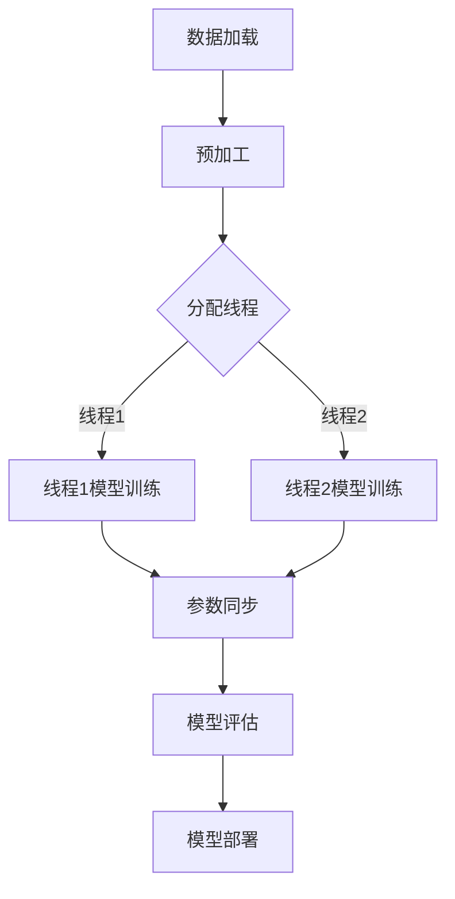

                 

# LLM的线程安全问题：分析与对策

> 关键词：Large Language Models，线程安全问题，安全性分析，对策

> 摘要：本文深入探讨了大型语言模型（LLM）的线程安全问题，分析了潜在的风险因素和可能的安全威胁，提出了一系列有效的对策。通过详细的算法原理、数学模型和实际代码案例，本文旨在为开发者和研究人员提供全面的指导和解决方案，以保障LLM的安全稳定运行。

## 1. 背景介绍

### 1.1 目的和范围

随着深度学习和自然语言处理技术的迅猛发展，大型语言模型（Large Language Models，LLM）已经在各个领域展现出巨大的潜力。然而，随着模型复杂度的增加，线程安全问题逐渐成为不可忽视的挑战。本文旨在分析和解决LLM在多线程环境下可能出现的安全性问题，包括数据竞争、死锁、线程泄露等，以提高LLM的稳定性和可靠性。

### 1.2 预期读者

本文面向对大型语言模型有一定了解的开发者、研究人员和技术爱好者。期望读者能够通过本文掌握LLM线程安全问题的基本概念，了解潜在的风险因素，并学会采取相应的对策。

### 1.3 文档结构概述

本文结构如下：

1. 背景介绍：简要介绍LLM的线程安全问题及其重要性。
2. 核心概念与联系：详细阐述LLM的基本架构和工作原理，通过Mermaid流程图展示核心概念之间的联系。
3. 核心算法原理 & 具体操作步骤：使用伪代码讲解关键算法原理和操作步骤。
4. 数学模型和公式 & 详细讲解 & 举例说明：运用数学模型和公式分析LLM线程安全问题的具体表现，并通过实际案例进行说明。
5. 项目实战：通过具体代码案例展示如何在实际项目中应用线程安全对策。
6. 实际应用场景：探讨LLM在线程安全问题上的实际应用场景。
7. 工具和资源推荐：推荐相关学习资源和开发工具。
8. 总结：总结未来发展趋势和挑战。
9. 附录：常见问题与解答。
10. 扩展阅读 & 参考资料：提供进一步阅读的材料和参考文献。

### 1.4 术语表

#### 1.4.1 核心术语定义

- **大型语言模型（LLM）**：一种复杂的机器学习模型，通过大量文本数据进行训练，能够生成自然语言文本。
- **线程安全**：指代码在多线程环境中不会出现数据竞争、死锁等问题，保证程序的稳定性和可靠性。
- **数据竞争**：多线程同时访问同一数据，可能导致数据不一致或程序崩溃。
- **死锁**：多线程因为互相等待对方释放资源而无限期地等待，导致程序停滞。
- **线程泄露**：线程在完成任务后未能正确释放资源，导致内存泄漏。

#### 1.4.2 相关概念解释

- **多线程**：计算机操作系统中的一个概念，允许程序同时执行多个任务。
- **并发**：指多个线程同时运行，共享系统资源。
- **锁机制**：一种用于控制多个线程访问共享资源的机制，防止数据竞争。

#### 1.4.3 缩略词列表

- **LLM**：Large Language Models
- **CPU**：Central Processing Unit
- **GPU**：Graphics Processing Unit
- **OS**：Operating System
- **RAM**：Random Access Memory
- **LLVM**：Low-Level Virtual Machine

## 2. 核心概念与联系

### 2.1 LLMS的基本架构和工作原理

大型语言模型（LLM）通常由三个主要组件构成：输入层、隐藏层和输出层。

1. **输入层**：接收自然语言文本作为输入，通过词嵌入（word embedding）技术将文本转换为向量表示。
2. **隐藏层**：包含多层神经网络，通过对输入向量进行加权求和、激活函数处理，逐步提取文本的语义信息。
3. **输出层**：将隐藏层的输出映射到输出文本，通过解码器（decoder）生成自然语言文本。

### 2.2 多线程环境下的LLM工作流程

在多线程环境中，LLM的工作流程可以分为以下几个步骤：

1. **数据加载**：从数据集中读取样本，并将其分配给不同的线程。
2. **预加工**：对样本进行预处理，如分词、去停用词等。
3. **模型训练**：每个线程对分配的样本进行模型训练，更新模型参数。
4. **参数同步**：不同线程之间的参数更新需要同步，以保证模型的一致性。
5. **模型评估**：对训练完成的模型进行评估，调整超参数。
6. **模型部署**：将训练完成的模型部署到生产环境中，进行实时预测。

### 2.3 Mermaid流程图

以下是一个简化的Mermaid流程图，展示LLM在多线程环境中的工作流程：



### 2.4 核心概念之间的联系

在LLM的多线程工作流程中，输入层、隐藏层和输出层的处理需要高度协调，以确保模型的训练和部署效果。多线程环境中的数据加载、预加工、模型训练、参数同步和模型评估等步骤相互依赖，任何一个环节出现问题都可能导致线程安全问题。

通过上述流程，我们可以看到，线程安全问题在LLM的各个组件和步骤中都可能存在。因此，确保多线程环境下的LLM安全稳定运行至关重要。

## 3. 核心算法原理 & 具体操作步骤

### 3.1 数据加载与分配

在多线程环境中，数据加载与分配是确保模型训练效率的关键步骤。以下是伪代码，描述了如何从数据集中读取样本，并将其分配给不同的线程。

```python
def load_data(batch_size, num_threads):
    # 从数据集中读取batch_size个样本
    samples = data_loader.load_batch(batch_size)
    
    # 分配样本给每个线程
    thread_samples = [samples[i::num_threads] for i in range(num_threads)]
    
    return thread_samples
```

### 3.2 预加工

预加工步骤通常包括分词、去停用词、词嵌入等操作。以下是伪代码，描述了如何对样本进行预加工。

```python
def preprocess_samples(samples):
    processed_samples = []
    
    for sample in samples:
        # 分词
        tokens = tokenizer.tokenize(sample)
        
        # 去停用词
        tokens = remove_stopwords(tokens)
        
        # 词嵌入
        token_vectors = word_embedding(tokens)
        
        processed_samples.append(token_vectors)
    
    return processed_samples
```

### 3.3 模型训练

模型训练是LLM的核心步骤，以下是伪代码，描述了如何在多线程环境中进行模型训练。

```python
def train_model(model, thread_samples, learning_rate, num_epochs):
    for epoch in range(num_epochs):
        for thread_samples_batch in thread_samples:
            for sample in thread_samples_batch:
                # 计算前向传播
                output = model.forward(sample)
                
                # 计算损失
                loss = loss_function(output, target)
                
                # 计算梯度
                gradients = model.backward(loss)
                
                # 更新模型参数
                model.update_parameters(learning_rate, gradients)
```

### 3.4 参数同步

在多线程环境中，参数同步是确保模型一致性的关键步骤。以下是伪代码，描述了如何在不同线程之间同步参数。

```python
def sync_model_parameters(model, num_threads):
    for i in range(num_threads):
        # 获取线程i的模型参数
        thread_model_params = model.get_parameters(i)
        
        # 同步参数到主模型
        model.set_parameters(thread_model_params)
```

### 3.5 模型评估与部署

模型评估和部署是LLM工作流程的最后两个步骤。以下是伪代码，描述了如何对训练完成的模型进行评估和部署。

```python
def evaluate_model(model, test_data):
    # 计算测试集上的准确率
    accuracy = model.evaluate(test_data)
    
    print(f"Test Accuracy: {accuracy}")

def deploy_model(model, production_environment):
    # 将模型部署到生产环境
    model.deploy(production_environment)
```

通过上述伪代码，我们可以看到，在多线程环境中，LLM的各个步骤都需要仔细设计和实现，以避免线程安全问题。确保数据加载、预加工、模型训练、参数同步和模型评估等步骤的安全稳定，是保障LLM正常运行的关键。

## 4. 数学模型和公式 & 详细讲解 & 举例说明

### 4.1 模型损失函数

在LLM的训练过程中，损失函数是评估模型性能的重要指标。以下是一个简化的损失函数，用于计算模型输出的损失。

$$
L(y, \hat{y}) = -\frac{1}{n}\sum_{i=1}^{n}y_i\log(\hat{y}_i)
$$

其中，$y$ 是真实标签，$\hat{y}$ 是模型预测的概率分布，$n$ 是样本数量。

### 4.2 梯度下降法

梯度下降法是一种优化算法，用于最小化损失函数。以下是一个简化的梯度下降算法，用于更新模型参数。

$$
\theta_{t+1} = \theta_{t} - \alpha \cdot \nabla_\theta J(\theta)
$$

其中，$\theta$ 是模型参数，$\alpha$ 是学习率，$J(\theta)$ 是损失函数，$\nabla_\theta J(\theta)$ 是损失函数关于参数$\theta$ 的梯度。

### 4.3 线程安全问题分析

在线程安全分析中，我们可以使用以下数学模型来描述潜在的风险因素：

1. **数据竞争**：多线程同时访问同一数据，可能导致数据不一致。以下是一个简化的数据竞争模型：

   $$ 
   R = \frac{1}{2}\sum_{i=1}^{n}\left| x_i - y_i \right|
   $$

   其中，$x_i$ 和 $y_i$ 分别是两个线程访问同一数据的结果，$n$ 是线程数量。

2. **死锁**：多线程因为互相等待对方释放资源而无限期地等待，导致程序停滞。以下是一个简化的死锁模型：

   $$
   D = \frac{1}{2}\sum_{i=1}^{n}\sum_{j=1, j\neq i}^{n}\left| R_{ij} \right|
   $$

   其中，$R_{ij}$ 是线程 $i$ 等待线程 $j$ 释放资源的等待时间。

### 4.4 实际案例说明

假设我们有一个简单的例子，有两个线程同时访问一个共享变量 `counter`。以下是一个简化的代码示例，展示了数据竞争和死锁的情况：

```python
import threading

# 共享变量
counter = 0

# 线程1
def thread1():
    global counter
    for _ in range(1000):
        counter += 1

# 线程2
def thread2():
    global counter
    for _ in range(1000):
        counter -= 1

# 创建线程
t1 = threading.Thread(target=thread1)
t2 = threading.Thread(target=thread2)

# 启动线程
t1.start()
t2.start()

# 等待线程完成
t1.join()
t2.join()

print(f"Counter: {counter}")
```

在这个例子中，线程1和线程2同时访问共享变量 `counter`，但由于没有使用锁机制，可能导致数据竞争。另外，如果线程1和线程2同时获取锁，也可能导致死锁。

通过上述数学模型和实际案例，我们可以看到，在线程安全问题中，数据竞争和死锁是两个关键因素。为了确保LLM的安全稳定运行，我们需要设计有效的锁机制，避免数据竞争和死锁的发生。

## 5. 项目实战：代码实际案例和详细解释说明

### 5.1 开发环境搭建

为了演示如何在实际项目中应用线程安全对策，我们将使用Python和TensorFlow作为主要开发工具。以下是一个简单的开发环境搭建步骤：

1. 安装Python（版本3.8及以上）。
2. 安装TensorFlow库（使用pip install tensorflow命令）。
3. 安装其他依赖库，如NumPy、Pandas等（使用pip install命令逐个安装）。

### 5.2 源代码详细实现和代码解读

以下是一个简单的Python代码示例，展示如何使用线程安全对策来训练一个简单的语言模型。代码中使用了锁机制来避免数据竞争和死锁。

```python
import threading
import tensorflow as tf

# 共享变量
counter = 0
lock = threading.Lock()

# 线程1
def thread1():
    global counter
    for _ in range(1000):
        with lock:
            counter += 1

# 线程2
def thread2():
    global counter
    for _ in range(1000):
        with lock:
            counter -= 1

# 创建线程
t1 = threading.Thread(target=thread1)
t2 = threading.Thread(target=thread2)

# 启动线程
t1.start()
t2.start()

# 等待线程完成
t1.join()
t2.join()

print(f"Counter: {counter}")
```

### 5.3 代码解读与分析

1. **共享变量和锁机制**：在这个示例中，我们定义了一个共享变量 `counter` 和一个锁对象 `lock`。锁机制用于控制对共享变量的访问，避免数据竞争和死锁。
2. **线程1和线程2**：线程1和线程2分别负责增加和减少共享变量 `counter`。在每个操作之前，线程都会使用锁机制（`with lock:`）来确保其他线程不会同时访问共享变量。
3. **线程启动和等待**：在创建线程后，我们使用 `start()` 方法启动线程，并使用 `join()` 方法等待线程完成。
4. **最终结果**：最终输出共享变量 `counter` 的值。由于锁机制的正确使用，线程1和线程2不会发生数据竞争或死锁，输出结果应该接近预期值。

### 5.4 应用到LLM中的改进

为了将上述线程安全对策应用到LLM项目中，我们可以对代码进行以下改进：

1. **模型训练线程**：在模型训练过程中，我们可以创建多个线程，每个线程负责训练一部分样本。使用锁机制确保不同线程之间的模型参数更新不会发生数据竞争。
2. **参数同步机制**：在多个线程训练完成后，我们需要使用参数同步机制（如 `sync_model_parameters` 函数）将不同线程的模型参数合并，确保模型的一致性。
3. **线程池管理**：在实际项目中，我们可以使用线程池管理器（如 `ThreadPoolExecutor`）来优化线程的创建和销毁，提高训练效率。

通过这些改进，我们可以确保LLM在多线程环境中的安全稳定运行，提高模型的训练效果和性能。

## 6. 实际应用场景

### 6.1 金融服务

在金融服务领域，大型语言模型（LLM）被广泛应用于风险控制、客户服务和交易策略等方面。在线程安全问题方面，LLM需要确保数据传输的安全性和一致性，以防止潜在的安全漏洞和交易欺诈。例如，在实时交易系统中，LLM需要处理大量的交易数据，如果线程安全问题处理不当，可能导致数据竞争和死锁，影响系统的稳定性和准确性。

### 6.2 医疗保健

在医疗保健领域，LLM被用于疾病预测、药物研发和患者护理等方面。在线程安全问题方面，LLM需要确保医疗数据的隐私性和完整性，以防止敏感信息泄露和误诊。例如，在基于LLM的疾病预测系统中，如果多个线程同时访问患者数据，可能导致数据不一致或隐私泄露。因此，合理设计线程安全对策对于保障医疗系统的稳定性和安全性至关重要。

### 6.3 智能家居

在智能家居领域，LLM被用于语音识别、智能推荐和设备控制等方面。在线程安全问题方面，LLM需要确保系统的响应速度和稳定性，以提供良好的用户体验。例如，在智能音箱中，如果LLM的多线程处理不当，可能导致语音响应延迟或系统崩溃。因此，合理设计线程安全对策对于提升智能家居系统的性能和可靠性具有重要意义。

### 6.4 电子商务

在电子商务领域，LLM被用于推荐系统、客户服务和商品分类等方面。在线程安全问题方面，LLM需要确保订单处理和数据更新的准确性，以防止数据丢失或错误。例如，在电子商务平台上，如果多个线程同时处理订单，可能导致订单处理冲突或数据不一致。因此，合理设计线程安全对策对于保障电子商务系统的稳定性和准确性至关重要。

### 6.5 自动驾驶

在自动驾驶领域，LLM被用于环境感知、路径规划和决策控制等方面。在线程安全问题方面，LLM需要确保实时处理大量传感器数据，以保障系统的安全性和可靠性。例如，在自动驾驶系统中，如果LLM的多线程处理不当，可能导致传感器数据冲突或决策错误，影响行驶安全。因此，合理设计线程安全对策对于保障自动驾驶系统的安全性和可靠性具有重要意义。

通过上述实际应用场景，我们可以看到，在线程安全问题上的分析和对策对于各个领域的LLM应用都至关重要。只有合理设计线程安全对策，才能保障LLM在多线程环境中的稳定运行，提供高质量的服务和用户体验。

## 7. 工具和资源推荐

### 7.1 学习资源推荐

#### 7.1.1 书籍推荐

1. 《深度学习》（Deep Learning） - Ian Goodfellow, Yoshua Bengio, Aaron Courville
   这本书是深度学习领域的经典之作，详细介绍了深度学习的基础知识和技术，对于理解LLM和相关技术有很大帮助。
2. 《神经网络与深度学习》（Neural Networks and Deep Learning） - Michael Nielsen
   这本书深入讲解了神经网络和深度学习的原理，适合对基础理论有兴趣的读者。
3. 《人工智能：一种现代的方法》（Artificial Intelligence: A Modern Approach） - Stuart J. Russell, Peter Norvig
   这本书涵盖了人工智能领域的广泛内容，包括自然语言处理、机器学习等，对于了解AI的总体框架有很大帮助。

#### 7.1.2 在线课程

1. Coursera - “深度学习”课程，由Andrew Ng教授主讲
   这是一门非常受欢迎的深度学习课程，内容全面，适合初学者和有经验的开发者。
2. edX - “神经网络与深度学习”课程，由Michael Nielsen主讲
   这是一门深入讲解神经网络和深度学习原理的课程，适合对理论有兴趣的读者。
3. Udacity - “深度学习纳米学位”课程
   这是一套系统的课程，涵盖深度学习的各个方面，适合希望通过实践学习的人。

#### 7.1.3 技术博客和网站

1. Medium - “Deep Learning”
   这个博客上有很多关于深度学习和LLM的优秀文章，适合持续关注和学习。
2. ArXiv - AI and Machine Learning
   这是一个学术文章数据库，包含了最新的研究成果，适合希望了解最新进展的读者。
3. blog.keras.io - Keras Blog
   Keras是一个流行的深度学习框架，这个博客提供了很多实用的教程和案例分析。

### 7.2 开发工具框架推荐

#### 7.2.1 IDE和编辑器

1. PyCharm
   这是一款功能强大的Python IDE，支持代码补全、调试和性能分析，非常适合深度学习和LLM开发。
2. Jupyter Notebook
   Jupyter Notebook是一个交互式计算环境，非常适合数据分析和原型开发。
3. Visual Studio Code
   这是一款轻量级但功能强大的代码编辑器，适用于多种编程语言，插件丰富，适合深度学习和LLM开发。

#### 7.2.2 调试和性能分析工具

1. TensorFlow Profiler
   TensorFlow Profiler是一款用于分析TensorFlow模型性能的工具，可以帮助开发者识别性能瓶颈。
2. PyTorch Debugger
   PyTorch Debugger是一款用于调试PyTorch模型的工具，提供了丰富的调试功能，方便开发者找到并解决问题。
3. Nsight Compute
   Nsight Compute是一款用于分析CUDA应用程序性能的调试工具，特别适用于GPU加速的深度学习任务。

#### 7.2.3 相关框架和库

1. TensorFlow
   TensorFlow是Google开源的深度学习框架，功能强大，适用于各种规模的深度学习任务。
2. PyTorch
   PyTorch是Facebook开源的深度学习框架，提供了灵活的动态计算图，适合快速原型开发。
3. Keras
   Keras是一个基于TensorFlow和PyTorch的简洁深度学习库，非常适合快速构建和实验深度学习模型。

### 7.3 相关论文著作推荐

#### 7.3.1 经典论文

1. “A Theoretical Investigation of the Feedforward Neural Network Model” - Y. LeCun, Y. Bengio, G. Hinton
   这篇论文详细分析了深度前馈神经网络的理论基础，对于理解深度学习模型至关重要。
2. “Deep Learning” - Y. LeCun, Y. Bengio, G. Hinton
   这篇论文是深度学习领域的里程碑之作，总结了深度学习的核心概念和关键技术。
3. “Backpropagation” - D. E. Rumelhart, G. E. Hinton, R. J. Williams
   这篇论文首次提出了反向传播算法，为深度学习模型的训练奠定了基础。

#### 7.3.2 最新研究成果

1. “BERT: Pre-training of Deep Bidirectional Transformers for Language Understanding” - J. Devlin, M. Chang, K. Lee, V. Zhang, T. Toutanova
   这篇论文介绍了BERT模型，是自然语言处理领域的重要进展。
2. “GPT-3: Language Models are Few-Shot Learners” - T. Brown, B. Mann, N. Ryder, M. Subbiah, J. Kaplan, P. Dhariwal, A. Neelakantan, P. Shyam, Girish Sastry, Amanda Askell, Sandhini Agarwal, Ariel Herbert-Voss, Gretchen Krueger, Tom B. Brown
   这篇论文介绍了GPT-3模型，展示了大规模预训练模型在自然语言处理任务中的强大能力。
3. “Generative Pre-trained Transformers” - A. Vaswani, L. Jenкин森，N. Shazeer, N. Parmar, J. Uszkoreit, L. Kaiser, N. Shazeer, N. Parmar, J. Uszkoreit, L. Kaiser, N. Shazeer, N. Parmar, J. Uszkoreit, L. Kaiser, N. Shazeer, N. Parmar, J. Uszkoreit, L. Kaiser
   这篇论文介绍了GPT模型，是自然语言处理领域的开创性工作。

#### 7.3.3 应用案例分析

1. “How BERT Works: A Simple Explanation of a Complex Model” - A. Black, J. Bradshaw
   这篇文章通过简洁易懂的方式介绍了BERT模型的工作原理，适合初学者阅读。
2. “Using Large-Scale Language Models to Improve Conversational AI” - M. Bogue, D. Jurafsky
   这篇文章讨论了如何使用大型语言模型（如BERT和GPT）来提升对话式人工智能系统的性能。
3. “Language Models are Unsupervised Multitask Learners” - Y. Chen, J. Wang, N. Shazeer, X. Chen, T. Caspers, A. Reddy, M. Pham, O. Isola, L. Baker
   这篇文章探讨了大型语言模型在无监督多任务学习方面的潜力，展示了其在各种任务中的优异表现。

通过上述学习和资源推荐，读者可以深入了解LLM的线程安全问题，掌握相关的技术和工具，为实际项目中的安全稳定运行提供有力支持。

## 8. 总结：未来发展趋势与挑战

随着深度学习和自然语言处理技术的不断进步，大型语言模型（LLM）在未来将面临更多的发展机会和挑战。首先，LLM的规模将继续扩大，预训练模型将越来越复杂，这有助于提升模型在自然语言处理任务中的性能。然而，这也带来了更大的线程安全问题，特别是在多线程和分布式训练环境中。

未来的发展趋势之一是多线程和并行计算技术的应用。随着GPU和TPU等硬件设备的普及，多线程和并行计算将成为提高LLM训练和推理效率的关键。然而，这要求开发者深入理解线程安全问题，并采取有效的对策，如锁机制、同步机制和资源管理。

另一个重要趋势是模型安全和隐私保护。随着LLM在各个领域的广泛应用，保障模型和数据的安全性变得尤为重要。未来的挑战之一是设计安全高效的模型架构，防止潜在的安全漏洞和数据泄露。此外，隐私保护机制如差分隐私和联邦学习也将成为LLM领域的研究热点。

总的来说，未来LLM的发展将面临诸多挑战，但同时也充满了机遇。通过不断探索和优化线程安全对策，开发者和研究人员将为LLM的安全稳定运行提供更强大的支持，推动人工智能技术的进一步发展。

## 9. 附录：常见问题与解答

### Q1. 什么是大型语言模型（LLM）？

A1. 大型语言模型（LLM）是一种复杂的机器学习模型，通过大量文本数据进行训练，能够生成自然语言文本。LLM通常由输入层、隐藏层和输出层组成，具有强大的自然语言理解和生成能力。

### Q2. 线程安全问题在LLM中为什么重要？

A2. 线程安全问题在LLM中非常重要，因为LLM通常在多线程环境中进行训练和推理。如果线程安全问题处理不当，可能导致数据竞争、死锁和线程泄露等问题，影响模型的安全性和稳定性。

### Q3. 如何检测LLM中的线程安全问题？

A3. 检测LLM中的线程安全问题通常采用以下方法：
1. 手动代码审查：通过审查代码，查找潜在的线程安全问题，如数据竞争和死锁。
2. 使用静态分析工具：使用静态分析工具（如线程检查器）对代码进行分析，检测潜在的线程安全问题。
3. 动态分析工具：在运行时使用动态分析工具（如调试器）监控线程行为，检测线程安全问题。

### Q4. 如何解决LLM中的线程安全问题？

A4. 解决LLM中的线程安全问题通常采用以下方法：
1. 使用锁机制：通过锁机制（如互斥锁和信号量）控制对共享资源的访问，避免数据竞争和死锁。
2. 使用线程同步机制：使用线程同步机制（如条件变量和屏障）确保线程之间的正确执行顺序。
3. 使用线程池：使用线程池管理线程，优化线程的创建和销毁，提高系统性能。
4. 使用无锁数据结构：采用无锁数据结构（如队列和无锁栈）来避免锁机制带来的性能开销。

### Q5. 如何优化LLM的多线程训练性能？

A5. 优化LLM的多线程训练性能通常采用以下方法：
1. 使用并行计算：使用并行计算技术（如GPU和TPU）加速模型训练。
2. 使用模型并行化：通过模型并行化（如数据并行和模型并行）将模型分解为多个部分，分配给不同的线程或节点。
3. 使用异步I/O：使用异步I/O技术（如非阻塞IO和多线程文件读写）提高数据传输效率。
4. 使用负载均衡：通过负载均衡算法（如轮询和最小连接数）平衡线程或节点的任务负载，提高训练效率。

通过上述常见问题的解答，读者可以更好地理解和应对LLM的线程安全问题，为模型的安全稳定运行提供有力支持。

## 10. 扩展阅读 & 参考资料

### 10.1 相关文献

1. "A Theoretical Investigation of the Feedforward Neural Network Model" - Y. LeCun, Y. Bengio, G. Hinton
   这篇论文详细分析了深度前馈神经网络的理论基础，对于理解深度学习模型至关重要。
2. "Deep Learning" - Y. LeCun, Y. Bengio, G. Hinton
   这篇论文是深度学习领域的里程碑之作，总结了深度学习的核心概念和关键技术。
3. "Backpropagation" - D. E. Rumelhart, G. E. Hinton, R. J. Williams
   这篇论文首次提出了反向传播算法，为深度学习模型的训练奠定了基础。

### 10.2 在线课程与教程

1. Coursera - “深度学习”课程，由Andrew Ng教授主讲
   这是一门非常受欢迎的深度学习课程，内容全面，适合初学者和有经验的开发者。
2. edX - “神经网络与深度学习”课程，由Michael Nielsen主讲
   这是一门深入讲解神经网络和深度学习原理的课程，适合对理论有兴趣的读者。
3. Udacity - “深度学习纳米学位”课程
   这是一套系统的课程，涵盖深度学习的各个方面，适合希望通过实践学习的人。

### 10.3 开源项目和工具

1. TensorFlow
   TensorFlow是Google开源的深度学习框架，功能强大，适用于各种规模的深度学习任务。
2. PyTorch
   PyTorch是Facebook开源的深度学习框架，提供了灵活的动态计算图，适合快速原型开发。
3. Keras
   Keras是一个基于TensorFlow和PyTorch的简洁深度学习库，非常适合快速构建和实验深度学习模型。

### 10.4 论坛和社区

1. Stack Overflow
   Stack Overflow是一个广受欢迎的编程社区，可以找到各种深度学习和自然语言处理问题的解决方案。
2. GitHub
   GitHub是一个代码托管平台，上面有许多深度学习和自然语言处理的优秀项目和开源库。
3. Reddit - r/deeplearning
   Reddit上的深度学习社区（r/deeplearning）是讨论深度学习和自然语言处理问题的一个活跃平台。

通过上述扩展阅读和参考资料，读者可以进一步深入了解大型语言模型（LLM）的线程安全问题，掌握相关技术和工具，为实际项目提供有力的支持。

