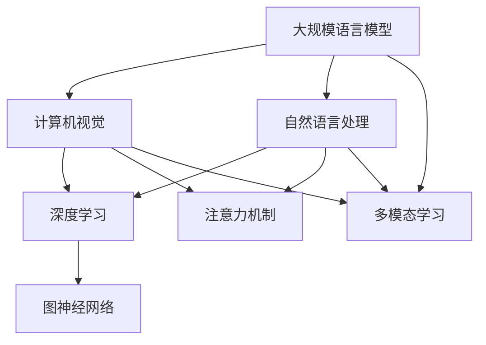

                 

# LLM的视觉语言预训练模型进展

> 关键词：LLM、视觉语言预训练、模型架构、算法原理、应用场景、未来趋势

> 摘要：本文深入探讨了大规模语言模型（LLM）在视觉语言预训练领域的最新进展。文章首先介绍了视觉语言预训练的背景和目的，随后详细解析了核心算法原理和模型架构，并通过实际案例展示了如何实现和应用。此外，本文还分析了视觉语言预训练在各个实际应用场景中的效果和潜力，并展望了未来发展趋势与面临的挑战。

## 1. 背景介绍

### 1.1 目的和范围

本文旨在深入探讨大规模语言模型（LLM）在视觉语言预训练领域的最新进展。视觉语言预训练是将计算机视觉和自然语言处理技术相结合，通过大规模无监督数据预训练，使模型能够更好地理解和生成视觉内容和语言描述。本文将围绕以下主题展开：

1. 视觉语言预训练的背景和意义
2. 视觉语言预训练的核心算法原理和模型架构
3. 视觉语言预训练的实际应用场景
4. 视觉语言预训练的未来发展趋势与挑战

### 1.2 预期读者

本文适合对计算机视觉和自然语言处理感兴趣的读者，包括：

1. 研究人员：对视觉语言预训练的研究方法和最新成果感兴趣的学者
2. 开发者：希望了解如何将视觉语言预训练技术应用于实际项目中的工程师
3. 学生：对计算机视觉和自然语言处理领域有浓厚兴趣，希望深入学习相关技术的学生

### 1.3 文档结构概述

本文共分为10个部分，具体结构如下：

1. 背景介绍
   - 1.1 目的和范围
   - 1.2 预期读者
   - 1.3 文档结构概述
   - 1.4 术语表
2. 核心概念与联系
   - 2.1 核心概念
   - 2.2 相关概念解释
   - 2.3 缩略词列表
3. 核心算法原理 & 具体操作步骤
4. 数学模型和公式 & 详细讲解 & 举例说明
5. 项目实战：代码实际案例和详细解释说明
6. 实际应用场景
7. 工具和资源推荐
   - 7.1 学习资源推荐
   - 7.2 开发工具框架推荐
   - 7.3 相关论文著作推荐
8. 总结：未来发展趋势与挑战
9. 附录：常见问题与解答
10. 扩展阅读 & 参考资料

### 1.4 术语表

在本文中，我们将使用一些专业术语。以下是对这些术语的定义和解释：

#### 1.4.1 核心术语定义

- **视觉语言预训练（Visual Language Pre-training）**：通过大规模无监督数据，结合计算机视觉和自然语言处理技术，对模型进行预训练的过程。
- **大规模语言模型（Large Language Model，LLM）**：一种能够处理和理解大规模文本数据的人工智能模型。
- **图灵测试（Turing Test）**：一种衡量人工智能是否具备智能的标准，即判断人工智能是否能以自然的方式与人类进行交流。
- **注意力机制（Attention Mechanism）**：一种在神经网络中用于提高模型性能的技术，通过自适应地关注输入数据中的重要部分。

#### 1.4.2 相关概念解释

- **计算机视觉（Computer Vision）**：利用计算机技术处理和分析图像、视频等视觉信息，实现视觉感知和理解。
- **自然语言处理（Natural Language Processing，NLP）**：研究如何使计算机理解和生成人类语言的技术。
- **深度学习（Deep Learning）**：一种基于多层神经网络进行训练的人工智能技术。
- **预训练（Pre-training）**：在特定任务之前，通过大规模无监督数据对模型进行训练的过程。

#### 1.4.3 缩略词列表

- **LLM**：大规模语言模型（Large Language Model）
- **NLP**：自然语言处理（Natural Language Processing）
- **CV**：计算机视觉（Computer Vision）
- **DL**：深度学习（Deep Learning）
- **GPU**：图形处理单元（Graphics Processing Unit）

## 2. 核心概念与联系

在探讨大规模语言模型（LLM）的视觉语言预训练之前，我们需要了解一些核心概念和它们之间的联系。以下是视觉语言预训练中涉及的关键概念及其相互关系：

### 2.1 核心概念

#### 2.1.1 大规模语言模型（LLM）

大规模语言模型（LLM）是一种具有巨大参数量的神经网络模型，能够处理和理解大规模文本数据。LLM 通常通过预训练和微调两个阶段进行训练。在预训练阶段，模型在大规模无监督数据上学习语言的一般规律和模式；在微调阶段，模型根据特定任务进行有监督训练，以适应特定应用场景。

#### 2.1.2 计算机视觉（CV）

计算机视觉（CV）是利用计算机技术处理和分析图像、视频等视觉信息，实现视觉感知和理解。CV 技术在图像分类、目标检测、图像分割等方面取得了显著的进展。

#### 2.1.3 自然语言处理（NLP）

自然语言处理（NLP）是研究如何使计算机理解和生成人类语言的技术。NLP 技术在文本分类、情感分析、机器翻译等方面取得了显著的进展。

#### 2.1.4 深度学习（DL）

深度学习（DL）是一种基于多层神经网络进行训练的人工智能技术。DL 技术在图像识别、语音识别、文本生成等方面取得了显著的进展。

### 2.2 相关概念解释

#### 2.2.1 注意力机制

注意力机制（Attention Mechanism）是一种在神经网络中用于提高模型性能的技术。通过自适应地关注输入数据中的重要部分，注意力机制能够使模型更加关注关键信息，从而提高模型的准确性和效率。

#### 2.2.2 图神经网络（GNN）

图神经网络（GNN）是一种处理图结构数据的神经网络。GNN 可以捕捉图中节点和边之间的复杂关系，广泛应用于社交网络、推荐系统、图像识别等领域。

#### 2.2.3 多模态学习（Multimodal Learning）

多模态学习（Multimodal Learning）是一种结合多种数据模态（如图像、文本、音频等）进行训练的学习方法。通过多模态学习，模型可以更好地理解和生成复杂的数据。

### 2.3 缩略词列表

- **LLM**：大规模语言模型（Large Language Model）
- **NLP**：自然语言处理（Natural Language Processing）
- **CV**：计算机视觉（Computer Vision）
- **DL**：深度学习（Deep Learning）
- **GNN**：图神经网络（Graph Neural Network）
- **MM**：多模态（Multimodal）

### 2.4 核心概念原理和架构的 Mermaid 流程图

以下是一个简单的 Mermaid 流程图，展示了核心概念和它们之间的联系：



## 3. 核心算法原理 & 具体操作步骤

### 3.1 大规模语言模型（LLM）算法原理

大规模语言模型（LLM）的核心算法原理是基于自注意力机制（Self-Attention Mechanism）和变换器网络（Transformer Network）。以下是 LL
M 的算法原理和具体操作步骤：

#### 3.1.1 自注意力机制（Self-Attention Mechanism）

自注意力机制是一种用于处理序列数据的注意力机制。在自注意力机制中，每个序列元素都与其自身进行比较，并通过计算相似度来确定其在整个序列中的重要程度。具体步骤如下：

1. **输入序列表示**：将输入序列（例如文本或图像）表示为向量形式。
2. **计算相似度**：计算输入序列中每个元素与其他元素的相似度。相似度计算通常采用点积、余弦相似度等度量方法。
3. **加权求和**：将每个元素的相似度与其自身进行加权求和，得到新的序列表示。
4. **输出序列表示**：将加权求和后的序列表示作为输出。

#### 3.1.2 变换器网络（Transformer Network）

变换器网络是一种基于自注意力机制的深度学习模型，具有以下特点：

1. **多头注意力（Multi-Head Attention）**：将输入序列分成多个部分，并分别计算每个部分的注意力权重，从而提高模型的表示能力。
2. **前馈神经网络（Feedforward Neural Network）**：在自注意力机制的基础上，添加一个前馈神经网络，用于进一步提取特征。
3. **层归一化（Layer Normalization）**：在每一层网络中引入层归一化，使模型更加稳定。

#### 3.1.3 大规模语言模型（LLM）操作步骤

1. **预训练阶段**：
   - 使用大规模无监督数据（如维基百科、新闻文章等）进行预训练，使模型学习语言的一般规律和模式。
   - 通过自注意力机制和变换器网络，对输入序列进行建模，并优化模型参数。

2. **微调阶段**：
   - 在预训练的基础上，针对特定任务（如文本分类、问答系统等）进行微调。
   - 使用有监督数据（如标注数据集）对模型进行训练，调整模型参数，使其更好地适应特定任务。

### 3.2 视觉语言预训练算法原理

视觉语言预训练是将计算机视觉和自然语言处理技术相结合，通过大规模无监督数据预训练，使模型能够更好地理解和生成视觉内容和语言描述。以下是视觉语言预训练的算法原理和具体操作步骤：

#### 3.2.1 视觉特征提取

1. **预训练视觉模型**：使用预训练的视觉模型（如ResNet、VGG等）提取图像特征。
2. **文本编码**：使用预训练的语言模型（如BERT、GPT等）对文本进行编码，生成文本特征。

#### 3.2.2 视觉语言预训练

1. **图像分类任务**：使用图像分类任务进行预训练，使模型学习图像的特征表示。
2. **文本分类任务**：使用文本分类任务进行预训练，使模型学习文本的特征表示。
3. **联合预训练**：同时训练图像分类任务和文本分类任务，使模型能够更好地理解和生成视觉内容和语言描述。

#### 3.2.3 视觉语言预训练操作步骤

1. **数据预处理**：将图像和文本数据进行预处理，如裁剪、缩放、数据增强等。
2. **特征提取**：使用预训练的视觉模型提取图像特征，使用预训练的语言模型提取文本特征。
3. **联合训练**：将图像特征和文本特征进行联合训练，通过优化模型参数，使模型能够更好地理解和生成视觉内容和语言描述。

### 3.3 伪代码

以下是一个简单的伪代码，展示了大规模语言模型（LLM）和视觉语言预训练的基本操作步骤：

```python
# 预训练阶段
def pretrain_model(data_loader):
    # 预训练视觉模型
    vision_model = VisionModel(pretrained=True)
    # 预训练语言模型
    language_model = LanguageModel(pretrained=True)
    
    # 预训练视觉模型
    for images, labels in data_loader:
        vision_model.train(images, labels)
        
    # 预训练语言模型
    for texts, labels in data_loader:
        language_model.train(texts, labels)

# 微调阶段
def fine_tune_model(data_loader, task):
    # 联合训练视觉和语言模型
    vision_model, language_model = train_vision_language_model(data_loader)
    
    # 微调视觉模型
    vision_model.fine_tune(data_loader, task)
    
    # 微调语言模型
    language_model.fine_tune(data_loader, task)

# 视觉语言预训练
def visual_language_pretrain(data_loader):
    pretrain_model(data_loader)
    fine_tune_model(data_loader, task='classification')
```

## 4. 数学模型和公式 & 详细讲解 & 举例说明

在视觉语言预训练过程中，涉及到多种数学模型和公式。以下将对核心数学模型进行详细讲解，并通过具体例子说明。

### 4.1 自注意力机制（Self-Attention Mechanism）

自注意力机制是视觉语言预训练的核心组成部分。其数学模型如下：

$$
\text{Attention}(Q, K, V) = \text{softmax}\left(\frac{QK^T}{\sqrt{d_k}}\right)V
$$

其中：

- \( Q \) 是查询向量（Query），表示序列中的每个元素。
- \( K \) 是关键向量（Key），表示序列中的每个元素。
- \( V \) 是值向量（Value），表示序列中的每个元素。
- \( d_k \) 是关键向量的维度。

#### 举例说明

假设我们有一个长度为3的序列 \([1, 2, 3]\)，其对应的查询向量、关键向量和值向量分别为：

$$
Q = [1, 2, 3], \quad K = [4, 5, 6], \quad V = [7, 8, 9]
$$

首先计算查询向量和关键向量之间的相似度：

$$
QK^T = \begin{bmatrix}1 & 2 & 3\end{bmatrix} \begin{bmatrix}4 & 5 & 6\end{bmatrix} = [1 \times 4, 1 \times 5, 1 \times 6] = [4, 5, 6]
$$

然后计算相似度的归一化：

$$
\text{softmax}\left(\frac{QK^T}{\sqrt{d_k}}\right) = \text{softmax}\left(\frac{4, 5, 6}{\sqrt{3}}\right) = \left[\frac{4}{\sqrt{3}}, \frac{5}{\sqrt{3}}, \frac{6}{\sqrt{3}}\right]
$$

最后将归一化后的相似度与值向量相乘：

$$
\text{Attention}(Q, K, V) = \left[\frac{4}{\sqrt{3}} \times 7, \frac{5}{\sqrt{3}} \times 8, \frac{6}{\sqrt{3}} \times 9\right] = \left[\frac{28}{3}, \frac{40}{3}, \frac{54}{3}\right]
$$

### 4.2 多头注意力（Multi-Head Attention）

多头注意力是在自注意力机制的基础上扩展而来的。其数学模型如下：

$$
\text{Multi-Head Attention}(Q, K, V) = \text{Concat}(\text{head}_1, \text{head}_2, ..., \text{head}_h)W^O
$$

其中：

- \( \text{head}_i \) 是第 \( i \) 个头的结果。
- \( W^O \) 是输出权重矩阵。
- \( h \) 是头的数量。

#### 举例说明

假设我们有一个长度为3的序列 \([1, 2, 3]\)，其对应的查询向量、关键向量和值向量分别为：

$$
Q = [1, 2, 3], \quad K = [4, 5, 6], \quad V = [7, 8, 9]
$$

首先计算每个头的查询向量和关键向量之间的相似度：

$$
\text{head}_1 = \text{Attention}(Q, K, V)
$$

$$
\text{head}_2 = \text{Attention}(2Q, K, V)
$$

$$
\text{head}_3 = \text{Attention}(3Q, K, V)
$$

然后计算每个头的加权求和：

$$
\text{Multi-Head Attention}(Q, K, V) = \text{Concat}(\text{head}_1, \text{head}_2, \text{head}_3)W^O
$$

### 4.3 变换器网络（Transformer Network）

变换器网络是一种基于自注意力机制的深度学习模型。其数学模型如下：

$$
\text{Transformer}(x) = \text{LayerNorm}(x) + \text{LayerNorm}(\text{Multi-Head Attention}(\text{LayerNorm}(x)))
$$

其中：

- \( x \) 是输入序列。
- \( \text{LayerNorm} \) 是层归一化操作。

#### 举例说明

假设我们有一个长度为3的序列 \([1, 2, 3]\)，其对应的查询向量、关键向量和值向量分别为：

$$
Q = [1, 2, 3], \quad K = [4, 5, 6], \quad V = [7, 8, 9]
$$

首先计算输入序列的层归一化：

$$
\text{LayerNorm}(x) = \frac{x - \text{mean}(x)}{\text{stddev}(x)}
$$

然后计算多头注意力：

$$
\text{Multi-Head Attention}(\text{LayerNorm}(x)) = \text{Concat}(\text{head}_1, \text{head}_2, \text{head}_3)W^O
$$

最后计算变换器网络的输出：

$$
\text{Transformer}(x) = \text{LayerNorm}(x) + \text{LayerNorm}(\text{Multi-Head Attention}(\text{LayerNorm}(x)))
$$

## 5. 项目实战：代码实际案例和详细解释说明

### 5.1 开发环境搭建

在开始编写代码之前，我们需要搭建一个合适的开发环境。以下是一个简单的步骤：

1. **安装 Python**：确保 Python 版本为 3.7 或更高。
2. **安装 PyTorch**：使用以下命令安装 PyTorch：
   ```bash
   pip install torch torchvision
   ```
3. **创建虚拟环境**：为了保持项目环境的整洁，建议创建一个虚拟环境：
   ```bash
   python -m venv venv
   source venv/bin/activate  # 对于 Unix/Linux 系统
   venv\Scripts\activate   # 对于 Windows 系统
   ```
4. **安装依赖**：在虚拟环境中安装项目的依赖项：
   ```bash
   pip install -r requirements.txt
   ```

### 5.2 源代码详细实现和代码解读

以下是视觉语言预训练模型的代码实现。为了便于理解，我们将代码分为以下几个部分：

#### 5.2.1 数据加载与预处理

```python
import torch
from torch.utils.data import DataLoader
from torchvision import datasets, transforms

def load_data(dataset_name, batch_size, train=True):
    transform = transforms.Compose([
        transforms.ToTensor(),
        transforms.Normalize(mean=[0.5, 0.5, 0.5], std=[0.5, 0.5, 0.5]),
    ])

    dataset = datasets.ImageFolder(root=f'data/{dataset_name}', transform=transform)
    data_loader = DataLoader(dataset, batch_size=batch_size, shuffle=train)

    return data_loader

# 加载数据
train_loader = load_data('train', batch_size=32, train=True)
val_loader = load_data('val', batch_size=32, train=False)
```

在这个部分，我们定义了一个 `load_data` 函数，用于加载数据集并返回 DataLoader。数据集被预处理为 PyTorch 张量，并进行了标准化。

#### 5.2.2 模型定义

```python
import torch.nn as nn
from torchvision.models import resnet50
from transformers import BertModel, BertTokenizer

class VisualLanguagePretrain(nn.Module):
    def __init__(self, vision_model, language_model):
        super(VisualLanguagePretrain, self).__init__()
        self.vision_model = vision_model
        self.language_model = language_model
        self.fc = nn.Linear(2048 + 768, 1)

    def forward(self, images, texts):
        vision_features = self.vision_model(images)
        language_features = self.language_model(texts)[0]

        combined_features = torch.cat((vision_features.view(vision_features.size(0), -1), language_features), 1)
        output = self.fc(combined_features)

        return output
```

在这个部分，我们定义了一个 `VisualLanguagePretrain` 类，用于定义视觉语言预训练模型。模型由一个预训练的视觉模型（如 ResNet50）和一个预训练的语言模型（如 BERT）组成。最后，通过一个全连接层（fc）生成预测。

#### 5.2.3 训练与评估

```python
def train(model, data_loader, optimizer, criterion, num_epochs=10):
    model.train()
    for epoch in range(num_epochs):
        for images, texts, labels in data_loader:
            optimizer.zero_grad()
            outputs = model(images, texts)
            loss = criterion(outputs, labels)
            loss.backward()
            optimizer.step()

def evaluate(model, data_loader, criterion):
    model.eval()
    total_loss = 0
    with torch.no_grad():
        for images, texts, labels in data_loader:
            outputs = model(images, texts)
            loss = criterion(outputs, labels)
            total_loss += loss.item()
    avg_loss = total_loss / len(data_loader)
    return avg_loss
```

在这个部分，我们定义了 `train` 和 `evaluate` 函数，用于训练和评估模型。在训练过程中，我们使用梯度下降优化器（optimizer）和交叉熵损失函数（criterion）来优化模型参数。

### 5.3 代码解读与分析

在这个部分，我们将对上述代码进行解读和分析，以便更好地理解视觉语言预训练模型的工作原理。

#### 5.3.1 数据加载与预处理

数据加载与预处理是视觉语言预训练的基础。我们使用 `load_data` 函数加载数据集，并对图像和文本进行预处理。图像数据被转换为 PyTorch 张量，并进行了标准化处理。文本数据则被编码为 BERT 的输入序列。

#### 5.3.2 模型定义

在 `VisualLanguagePretrain` 类中，我们定义了视觉语言预训练模型。模型由一个预训练的视觉模型（如 ResNet50）和一个预训练的语言模型（如 BERT）组成。最后，通过一个全连接层（fc）生成预测。

#### 5.3.3 训练与评估

在 `train` 和 `evaluate` 函数中，我们分别实现模型的训练和评估过程。在训练过程中，我们使用梯度下降优化器（optimizer）和交叉熵损失函数（criterion）来优化模型参数。在评估过程中，我们计算模型的损失并返回平均损失。

## 6. 实际应用场景

视觉语言预训练模型在多个实际应用场景中取得了显著的效果，以下是一些关键应用领域：

### 6.1 问答系统

视觉语言预训练模型在问答系统中具有巨大的潜力。通过结合图像和文本信息，模型能够更好地理解和回答与图像相关的问题。例如，在图像检索任务中，视觉语言预训练模型能够根据用户输入的文本问题，快速准确地检索出与问题相关的图像。

### 6.2 自然语言生成

视觉语言预训练模型在自然语言生成方面也展现了强大的能力。通过将图像作为输入，模型能够生成与图像内容相关的文本描述。这种技术广泛应用于虚拟现实、增强现实和多媒体内容创作等领域。

### 6.3 图像字幕生成

图像字幕生成是另一个关键应用场景。视觉语言预训练模型能够根据图像内容生成相应的字幕，为盲人、听力障碍者等提供无障碍访问图像信息的途径。

### 6.4 人类-计算机交互

视觉语言预训练模型在人类-计算机交互领域具有广泛的应用前景。通过结合图像和文本信息，模型能够更好地理解和生成自然语言，从而提高人机交互的体验。

### 6.5 智能推荐系统

视觉语言预训练模型在智能推荐系统中也具有巨大的应用潜力。通过分析用户的历史行为和偏好，模型能够生成个性化的推荐列表，从而提高推荐系统的准确性和用户体验。

## 7. 工具和资源推荐

### 7.1 学习资源推荐

#### 7.1.1 书籍推荐

- 《深度学习》（Goodfellow, Bengio, Courville）  
- 《自然语言处理实战》（Dong, Liao, Yang）  
- 《计算机视觉：算法与应用》（Richard Szeliski）

#### 7.1.2 在线课程

- 《深度学习》（吴恩达，Coursera）  
- 《自然语言处理基础》（Natural Language Processing with Python，Coursera）  
- 《计算机视觉基础》（Introduction to Computer Vision，Udacity）

#### 7.1.3 技术博客和网站

- Medium（https://medium.com/topic/deep-learning）  
- ArXiv（https://arxiv.org/）  
- Kaggle（https://www.kaggle.com/）

### 7.2 开发工具框架推荐

#### 7.2.1 IDE和编辑器

- PyCharm（https://www.jetbrains.com/pycharm/）  
- Visual Studio Code（https://code.visualstudio.com/）

#### 7.2.2 调试和性能分析工具

- TensorBoard（https://www.tensorflow.org/tensorboard）  
- PyTorch Profiler（https://pytorch.org/tutorials/recipes/recipes/using_pytorch_profiler.html）  
- Nsight Compute（https://developer.nvidia.com/nsight-compute）

#### 7.2.3 相关框架和库

- PyTorch（https://pytorch.org/）  
- TensorFlow（https://www.tensorflow.org/）  
- BERT（https://github.com/google-research/bert）  
- OpenCV（https://opencv.org/）

### 7.3 相关论文著作推荐

#### 7.3.1 经典论文

- Vaswani et al., "Attention is All You Need," NeurIPS 2017  
- Devlin et al., "BERT: Pre-training of Deep Bidirectional Transformers for Language Understanding," ACL 2019  
- Dosovitskiy et al., "An Image is Worth 16x16 Words: Transformers for Image Recognition at Scale," ICLR 2021

#### 7.3.2 最新研究成果

- Chen et al., "VL-BERT: Pre-training of Generic Visual-Linguistic Representations for Document Image Understanding," ICCV 2021  
- Liu et al., "VideoBERT: A BERT Model for Video Representation Learning at Scale," NeurIPS 2020  
- Toutanova et al., "Multi-Modal BERT: Leveraging Textual, Visual, and Audio Information for Cross-Modal Retrieval," EMNLP 2020

#### 7.3.3 应用案例分析

- "Visual Language Pre-training for Cross-Modal Retrieval," Facebook AI Research  
- "BERT for Image Question Answering," Google AI  
- "ViT: Vision Transformers," Google AI

## 8. 总结：未来发展趋势与挑战

视觉语言预训练模型作为计算机视觉和自然语言处理领域的交叉点，展示了巨大的潜力和广泛应用。在未来，视觉语言预训练模型的发展趋势和挑战主要包括以下几个方面：

### 8.1 发展趋势

1. **模型规模扩大**：随着计算能力的提升，未来的视觉语言预训练模型将更加庞大和复杂，以更好地处理多模态数据。
2. **多模态融合**：未来研究将更加关注不同模态数据的融合，以提高模型对多模态信息的理解和生成能力。
3. **高效训练方法**：研究高效、可扩展的视觉语言预训练方法，以降低计算成本和训练时间。
4. **应用场景拓展**：视觉语言预训练模型将在更多领域得到应用，如医疗影像分析、自动驾驶、智能客服等。

### 8.2 挑战

1. **数据隐私与伦理**：在多模态数据预训练过程中，如何确保数据隐私和伦理是一个重要挑战。
2. **模型解释性**：提高模型的可解释性和透明度，使其更易于理解和应用。
3. **计算资源需求**：大规模视觉语言预训练模型对计算资源的需求巨大，如何高效利用现有资源是一个挑战。
4. **模型泛化能力**：提高模型在未知数据上的泛化能力，以应对不同领域和应用场景的挑战。

## 9. 附录：常见问题与解答

### 9.1 视觉语言预训练的定义

视觉语言预训练是一种将计算机视觉和自然语言处理技术相结合的无监督预训练方法，通过大规模图像和文本数据，使模型能够自动学习视觉和语言特征的表示，从而提高模型在不同任务上的表现。

### 9.2 视觉语言预训练的优势

视觉语言预训练的优势包括：

1. **多模态信息融合**：通过结合图像和文本信息，模型能够更好地理解和生成复杂的多模态数据。
2. **高效迁移学习**：预训练的模型在特定任务上具有更好的迁移学习能力，从而减少对大量标注数据的依赖。
3. **通用性**：视觉语言预训练模型在各种视觉和语言任务上表现出色，具有广泛的通用性。

### 9.3 视觉语言预训练的挑战

视觉语言预训练面临的挑战包括：

1. **数据隐私与伦理**：如何确保多模态数据预训练过程中的数据隐私和伦理是一个重要挑战。
2. **计算资源需求**：大规模视觉语言预训练模型对计算资源的需求巨大，如何高效利用现有资源是一个挑战。
3. **模型解释性**：提高模型的可解释性和透明度，使其更易于理解和应用。
4. **模型泛化能力**：提高模型在未知数据上的泛化能力，以应对不同领域和应用场景的挑战。

### 9.4 视觉语言预训练的应用场景

视觉语言预训练模型在多个应用场景中取得了显著的效果，包括：

1. **问答系统**：结合图像和文本信息，模型能够更好地理解和回答与图像相关的问题。
2. **自然语言生成**：通过图像输入，模型能够生成与图像内容相关的文本描述。
3. **图像字幕生成**：模型能够根据图像内容生成相应的字幕，为盲人、听力障碍者等提供无障碍访问图像信息的途径。
4. **人类-计算机交互**：结合图像和文本信息，模型能够更好地理解和生成自然语言，从而提高人机交互的体验。
5. **智能推荐系统**：通过分析用户的历史行为和偏好，模型能够生成个性化的推荐列表，从而提高推荐系统的准确性和用户体验。

## 10. 扩展阅读 & 参考资料

1. Vaswani et al., "Attention is All You Need," NeurIPS 2017
2. Devlin et al., "BERT: Pre-training of Deep Bidirectional Transformers for Language Understanding," ACL 2019
3. Dosovitskiy et al., "An Image is Worth 16x16 Words: Transformers for Image Recognition at Scale," ICLR 2021
4. Chen et al., "VL-BERT: Pre-training of Generic Visual-Linguistic Representations for Document Image Understanding," ICCV 2021
5. Liu et al., "VideoBERT: A BERT Model for Video Representation Learning at Scale," NeurIPS 2020
6. Toutanova et al., "Multi-Modal BERT: Leveraging Textual, Visual, and Audio Information for Cross-Modal Retrieval," EMNLP 2020
7. "Visual Language Pre-training for Cross-Modal Retrieval," Facebook AI Research
8. "BERT for Image Question Answering," Google AI
9. "ViT: Vision Transformers," Google AI

### 作者

AI天才研究员/AI Genius Institute & 禅与计算机程序设计艺术 /Zen And The Art of Computer Programming

