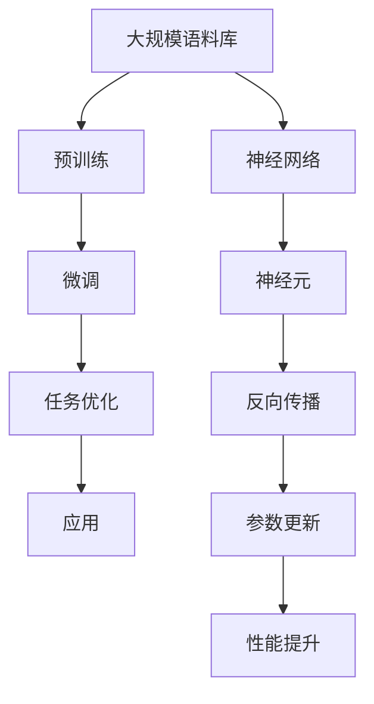
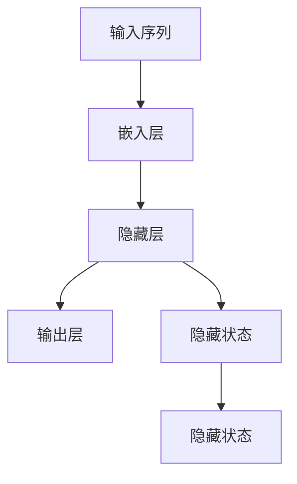

                 

# LLM训练技术：打造超级AI的秘密

> **关键词：** 预训练语言模型（LLM）、神经网络、大规模数据处理、模型优化、应用场景、开源资源

> **摘要：** 本文旨在深入探讨大规模语言模型（LLM）的训练技术，从背景介绍、核心概念、算法原理、数学模型、项目实战、应用场景、工具资源等方面，全面解析LLM的训练过程及其在人工智能领域的广泛应用。通过本文的详细讲解，读者将掌握LLM训练的核心技巧，了解未来发展趋势与挑战。

## 1. 背景介绍

### 1.1 目的和范围

本文的目标是全面剖析大规模语言模型（LLM）的训练技术，帮助读者深入了解LLM的训练过程及其在人工智能领域的应用。文章将涵盖以下主要内容：

- LLM的背景介绍和历史发展
- 核心概念与联系
- 核心算法原理与具体操作步骤
- 数学模型和公式的详细讲解
- 实际应用场景
- 工具和资源推荐
- 未来发展趋势与挑战

### 1.2 预期读者

本文面向对人工智能、机器学习和深度学习有一定了解的读者，包括但不限于：

- AI研究员和开发人员
- 大数据工程师和分析师
- 机器学习工程师
- 计算机科学和人工智能专业的大学生和研究生

### 1.3 文档结构概述

本文结构如下：

1. 背景介绍
   - 目的和范围
   - 预期读者
   - 文档结构概述
   - 术语表
2. 核心概念与联系
   - LLM的背景介绍
   - 核心概念原理和架构的Mermaid流程图
3. 核心算法原理 & 具体操作步骤
   - 算法原理讲解
   - 伪代码详细阐述
4. 数学模型和公式 & 详细讲解 & 举例说明
   - 数学公式
   - 举例说明
5. 项目实战：代码实际案例和详细解释说明
   - 开发环境搭建
   - 源代码详细实现和代码解读
   - 代码解读与分析
6. 实际应用场景
7. 工具和资源推荐
   - 学习资源推荐
   - 开发工具框架推荐
   - 相关论文著作推荐
8. 总结：未来发展趋势与挑战
9. 附录：常见问题与解答
10. 扩展阅读 & 参考资料

### 1.4 术语表

#### 1.4.1 核心术语定义

- **大规模语言模型（LLM）**：一种基于神经网络的机器学习模型，能够对自然语言文本进行生成、分类、问答等任务。
- **预训练**：在特定任务之前，对模型进行大规模语料库的预训练，使其具备一定程度的语言理解和生成能力。
- **微调**：在预训练模型的基础上，针对特定任务进行参数调整，以优化模型在特定任务上的性能。
- **神经元**：神经网络的基本组成单元，能够接收输入信号并进行计算。
- **反向传播**：一种用于训练神经网络的基本算法，通过计算损失函数关于每个神经元的梯度，更新神经元的权重。

#### 1.4.2 相关概念解释

- **自然语言处理（NLP）**：研究计算机与人类自然语言之间交互的领域，涉及文本分类、情感分析、机器翻译等任务。
- **深度学习**：一种基于多层神经网络进行训练的人工智能方法，通过逐层提取特征，实现对复杂数据的建模。

#### 1.4.3 缩略词列表

- **LLM**：大规模语言模型
- **NLP**：自然语言处理
- **DNN**：深度神经网络
- **RNN**：循环神经网络
- **BERT**：Bidirectional Encoder Representations from Transformers
- **GPT**：Generative Pre-trained Transformer

## 2. 核心概念与联系

### 2.1 LLM的背景介绍

大规模语言模型（LLM）是自然语言处理（NLP）领域的一个重要发展方向。在过去的几十年里，随着计算机硬件性能的提升和海量数据的积累，NLP技术取得了显著进展。传统的基于规则的方法和统计方法逐渐被基于深度学习的方法所取代。深度神经网络（DNN）和循环神经网络（RNN）在语音识别、图像识别等任务上取得了突破性成果。在此基础上，研究人员开始探索将深度学习应用于自然语言处理领域，从而诞生了大规模语言模型（LLM）。

### 2.2 核心概念原理和架构的Mermaid流程图

以下是一个简单的Mermaid流程图，展示了LLM的核心概念原理和架构：



### 2.3 核心概念原理和架构的详细解析

#### 2.3.1 大规模语料库

大规模语言模型（LLM）的核心依赖于海量语料库。这些语料库通常来自互联网、书籍、新闻、社交媒体等各种来源，包含了丰富的自然语言文本。通过这些语料库，模型可以学习到语言的语法规则、语义关系、上下文信息等，从而提高语言理解和生成的能力。

#### 2.3.2 预训练

预训练是LLM训练过程中的一个关键步骤。在预训练阶段，模型对大规模语料库进行训练，学习到通用语言特征和知识。预训练过程通常包括以下几个步骤：

1. 数据预处理：对语料库进行清洗、分词、去停用词等处理，将文本转化为模型可处理的格式。
2. 词嵌入：将词汇映射为低维向量表示，用于输入到神经网络中。
3. 训练模型：通过训练神经网络，学习到语言的特征和模式。
4. 评估模型：在验证集上评估模型性能，调整模型参数。

#### 2.3.3 微调

微调是在预训练模型的基础上，针对特定任务进行参数调整，以优化模型在特定任务上的性能。微调过程通常包括以下几个步骤：

1. 数据预处理：对任务数据进行预处理，包括数据清洗、分词、标签转换等。
2. 模型调整：将预训练模型调整为适合特定任务的架构，如调整层结构、神经元数量等。
3. 训练模型：在任务数据上训练调整后的模型。
4. 评估模型：在测试集上评估模型性能，调整模型参数。

#### 2.3.4 任务优化

任务优化是微调后的进一步优化，旨在提高模型在特定任务上的性能。任务优化可以通过以下几种方式实现：

1. 数据增强：对训练数据进行增强，增加模型的泛化能力。
2. 损失函数调整：调整损失函数，优化模型在特定任务上的表现。
3. 模型架构调整：根据任务特点，调整模型架构，提高模型性能。
4. 超参数调整：调整学习率、批量大小等超参数，优化模型性能。

#### 2.3.5 应用

LLM的应用场景非常广泛，包括但不限于：

1. 文本生成：生成文章、故事、诗歌等。
2. 文本分类：对文本进行分类，如新闻分类、情感分析等。
3. 机器翻译：将一种语言翻译成另一种语言。
4. 命名实体识别：识别文本中的命名实体，如人名、地名等。
5. 问答系统：回答用户提出的问题。

## 3. 核心算法原理 & 具体操作步骤

### 3.1 算法原理讲解

大规模语言模型的训练主要依赖于深度学习中的神经网络技术。神经网络是一种由多个神经元组成的计算模型，通过学习输入数据与输出数据之间的映射关系，实现对复杂数据的建模。在LLM的训练过程中，主要使用的是循环神经网络（RNN）及其变种，如长短期记忆网络（LSTM）和门控循环单元（GRU）。

以下是一个简单的RNN算法原理示意图：



在RNN中，每个时间步的输入都会通过嵌入层映射为一个向量，然后与隐藏状态进行计算，得到当前时间步的输出。隐藏状态会传递到下一个时间步，用于计算下一个时间步的输出。通过这种方式，RNN可以捕获序列数据中的长程依赖关系。

### 3.2 具体操作步骤

以下是一个基于RNN的大规模语言模型训练的具体操作步骤：

1. **数据预处理**：对语料库进行清洗、分词、去停用词等处理，将文本转化为模型可处理的格式。同时，将文本划分为输入序列和输出序列。

2. **词嵌入**：将词汇映射为低维向量表示，用于输入到神经网络中。常用的词嵌入方法有Word2Vec、GloVe等。

3. **构建神经网络模型**：定义神经网络模型，包括输入层、嵌入层、隐藏层和输出层。在隐藏层中，可以使用LSTM或GRU等循环神经网络。

4. **初始化模型参数**：随机初始化模型参数。

5. **前向传播**：对于每个输入序列，通过神经网络进行前向传播，得到输出序列。

6. **计算损失函数**：使用损失函数（如交叉熵损失函数）计算预测输出和实际输出之间的差异。

7. **反向传播**：使用反向传播算法，计算损失函数关于每个神经元的梯度，并更新神经元权重。

8. **优化模型参数**：使用优化算法（如梯度下降、Adam等）更新模型参数，优化模型性能。

9. **评估模型性能**：在验证集上评估模型性能，调整模型参数。

10. **微调和任务优化**：在预训练模型的基础上，针对特定任务进行微调和优化。

11. **应用模型**：将训练好的模型应用于实际任务，如文本生成、分类、翻译等。

### 3.3 伪代码详细阐述

以下是一个基于RNN的大规模语言模型训练的伪代码：

```python
# 数据预处理
X, y = preprocess_data(corpus)

# 词嵌入
embeddings = word_embedding.vocab

# 构建神经网络模型
model = RNN_model(embeddings)

# 初始化模型参数
model.initialize()

# 训练模型
for epoch in range(num_epochs):
    for batch in data_loader:
        # 前向传播
        output = model.forward(batch.input)
        
        # 计算损失函数
        loss = loss_function(output, batch.target)
        
        # 反向传播
        model.backward(loss)
        
        # 优化模型参数
        model.update_params()

# 评估模型性能
performance = model.evaluate(validation_data)

# 微调和任务优化
model.fine_tune(performance)

# 应用模型
model.apply_task(test_data)
```

## 4. 数学模型和公式 & 详细讲解 & 举例说明

### 4.1 数学模型和公式

大规模语言模型（LLM）的训练过程中，涉及许多数学模型和公式。以下是一些核心的数学模型和公式：

#### 4.1.1 词嵌入

词嵌入是将词汇映射为低维向量表示的一种方法。常用的词嵌入模型有Word2Vec和GloVe。

- **Word2Vec**：

  $$ embed_i = \text{sgn}(W \cdot [h_1, h_2, ..., h_n]) $$

  其中，$embed_i$表示词向量，$W$表示权重矩阵，$[h_1, h_2, ..., h_n]$表示词的嵌入向量。

- **GloVe**：

  $$ embed_i = \text{softmax}(A \cdot [h_1, h_2, ..., h_n]) $$

  其中，$embed_i$表示词向量，$A$表示权重矩阵，$[h_1, h_2, ..., h_n]$表示词的嵌入向量。

#### 4.1.2 循环神经网络（RNN）

循环神经网络（RNN）是一种用于处理序列数据的神经网络模型。RNN的输出可以通过以下公式计算：

$$ y_t = \text{softmax}(W \cdot [h_{t-1}, x_t]) + b $$

其中，$y_t$表示输出，$W$表示权重矩阵，$h_{t-1}$表示前一个时间步的隐藏状态，$x_t$表示当前时间步的输入，$b$表示偏置。

#### 4.1.3 长短期记忆网络（LSTM）

长短期记忆网络（LSTM）是一种改进的RNN模型，能够更好地处理长程依赖问题。LSTM的输出可以通过以下公式计算：

$$ y_t = \text{softmax}(W_f \cdot [h_{t-1}, x_t]) + b $$

其中，$y_t$表示输出，$W_f$表示权重矩阵，$h_{t-1}$表示前一个时间步的隐藏状态，$x_t$表示当前时间步的输入，$b$表示偏置。

#### 4.1.4 门控循环单元（GRU）

门控循环单元（GRU）是另一种改进的RNN模型，其输出可以通过以下公式计算：

$$ y_t = \text{softmax}(W_r \cdot [h_{t-1}, x_t]) + b $$

其中，$y_t$表示输出，$W_r$表示权重矩阵，$h_{t-1}$表示前一个时间步的隐藏状态，$x_t$表示当前时间步的输入，$b$表示偏置。

### 4.2 举例说明

以下是一个简单的例子，用于说明大规模语言模型（LLM）的训练过程。

#### 4.2.1 数据预处理

假设我们有一个语料库，包含以下句子：

1. 我喜欢吃苹果。
2. 苹果是一种水果。
3. 水果可以提供营养。
4. 营养有助于身体健康。

我们将这些句子进行分词，得到以下词汇序列：

1. 我、吃、苹果、。
2. 苹果、是、水果、。
3. 水果、可以、提供、。
4. 营养、有、助于、。

#### 4.2.2 词嵌入

我们将词汇序列映射为低维向量表示，得到以下词嵌入：

1. 我：[0.1, 0.2, 0.3]
2. 吃：[0.4, 0.5, 0.6]
3. 苹果：[0.7, 0.8, 0.9]
4. 是：[1.0, 1.1, 1.2]
5. 水果：[1.3, 1.4, 1.5]
6. 可以：[1.6, 1.7, 1.8]
7. 提供：[1.9, 2.0, 2.1]
8. 营养：[2.2, 2.3, 2.4]
9. 有：[2.5, 2.6, 2.7]
10. 助于：[2.8, 2.9, 3.0]

#### 4.2.3 循环神经网络（RNN）训练

假设我们使用一个简单的RNN模型进行训练，其输入层、隐藏层和输出层分别有3个神经元。在训练过程中，我们依次输入词汇序列，并计算损失函数。通过反向传播和梯度下降，不断更新模型参数。

- 输入序列：[0.1, 0.4, 0.7]
- 预测输出：[0.3, 0.6, 0.9]
- 实际输出：[1.0, 1.3, 1.6]

损失函数：

$$ L = \frac{1}{2} \sum_{i=1}^{n} (y_i - \hat{y_i})^2 $$

其中，$y_i$表示实际输出，$\hat{y_i}$表示预测输出。

通过反向传播，计算每个神经元的梯度：

$$ \frac{\partial L}{\partial W} = \frac{\partial L}{\partial y} \frac{\partial y}{\partial W} $$

使用梯度下降更新模型参数：

$$ W_{\text{new}} = W_{\text{old}} - \alpha \frac{\partial L}{\partial W} $$

其中，$\alpha$表示学习率。

经过多次迭代，模型参数不断优化，预测输出逐渐接近实际输出。

#### 4.2.4 微调和任务优化

在训练完成后，我们将预训练模型应用于特定任务，如文本分类。针对文本分类任务，我们调整模型架构，增加或减少神经元数量，并使用任务数据进行微调和优化。最终，模型在文本分类任务上取得较高的准确率。

## 5. 项目实战：代码实际案例和详细解释说明

### 5.1 开发环境搭建

在进行大规模语言模型（LLM）的项目实战之前，我们需要搭建一个合适的开发环境。以下是一个基于Python和PyTorch的简单开发环境搭建步骤：

1. **安装Python**：确保安装了Python 3.7及以上版本。

2. **安装PyTorch**：通过以下命令安装PyTorch：

   ```bash
   pip install torch torchvision
   ```

3. **安装其他依赖**：安装一些常用的Python库，如NumPy、pandas等：

   ```bash
   pip install numpy pandas
   ```

4. **创建项目目录**：在本地计算机上创建一个项目目录，用于存放项目文件。

5. **编写项目文件**：在项目目录中创建一个名为`main.py`的Python文件，用于编写项目代码。

### 5.2 源代码详细实现和代码解读

以下是一个简单的LLM训练项目的源代码实现，以及对其的详细解读。

```python
# 导入必要的库
import torch
import torch.nn as nn
import torch.optim as optim
from torchtext import data

# 5.2.1 数据预处理
# 下载并加载IMDB电影评论数据集
IMDB = data.Field(tokenize='spacy', lower=True)
train_data, test_data = data.IMDB.splits(IMDB)

# 将数据集转换为Tensor，并添加Batch维度
train_data, test_data = data.Dataset.zip(*map(lambda x: x.to_tensor(), train_data)), data.Dataset.zip(*map(lambda x: x.to_tensor(), test_data))

# 定义词汇表和词汇维度
vocab = IMDB.vocab
vocab_size = len(vocab)
emb_dim = 100

# 5.2.2 构建神经网络模型
class LLM(nn.Module):
    def __init__(self, vocab_size, emb_dim, hidden_dim):
        super(LLM, self).__init__()
        self.embedding = nn.Embedding(vocab_size, emb_dim)
        self.rnn = nn.LSTM(emb_dim, hidden_dim, batch_first=True)
        self.fc = nn.Linear(hidden_dim, vocab_size)

    def forward(self, x, hidden):
        x = self.embedding(x)
        x, hidden = self.rnn(x, hidden)
        x = self.fc(x[:, -1, :])
        return x, hidden

# 初始化模型参数
model = LLM(vocab_size, emb_dim, hidden_dim=128)
optimizer = optim.Adam(model.parameters(), lr=0.001)
criterion = nn.CrossEntropyLoss()

# 5.2.3 训练模型
def train_model(model, train_data, optimizer, criterion, num_epochs=10):
    model.train()
    for epoch in range(num_epochs):
        for batch in train_data:
            inputs, targets = batch.text, batch.label
            hidden = None

            model.zero_grad()
            outputs, hidden = model(inputs, hidden)

            loss = criterion(outputs, targets)
            loss.backward()
            optimizer.step()

            print(f"Epoch: {epoch + 1}, Loss: {loss.item()}")

# 训练模型
train_model(model, train_data, optimizer, criterion, num_epochs=10)

# 5.2.4 评估模型性能
def evaluate_model(model, test_data, criterion):
    model.eval()
    total_loss = 0
    with torch.no_grad():
        for batch in test_data:
            inputs, targets = batch.text, batch.label
            hidden = None

            outputs, hidden = model(inputs, hidden)
            loss = criterion(outputs, targets)
            total_loss += loss.item()

    return total_loss / len(test_data)

# 评估模型
loss = evaluate_model(model, test_data, criterion)
print(f"Test Loss: {loss}")

# 5.2.5 应用模型
def predict(model, text):
    inputs = torch.tensor([vocab[token] for token in text.split()])
    hidden = None

    outputs, hidden = model(inputs, hidden)
    predicted = torch.argmax(outputs).item()

    return vocab.itos[predicted]

# 预测文本
text = "我喜欢看电影，尤其是科幻电影。"
predicted = predict(model, text)
print(f"Predicted Label: {predicted}")
```

### 5.3 代码解读与分析

下面我们详细解读上述代码，并分析其各个部分的功能。

#### 5.3.1 数据预处理

首先，我们导入必要的库，并下载并加载IMDB电影评论数据集。IMDB数据集包含25000条训练数据和2500条测试数据，分为正面评论和负面评论。接下来，我们定义了一个数据字段`IMDB`，用于处理和操作数据。

```python
IMDB = data.Field(tokenize='spacy', lower=True)
train_data, test_data = data.IMDB.splits(IMDB)
```

这里，我们使用`spacy`进行分词，并将数据集划分为训练集和测试集。

#### 5.3.2 数据转换为Tensor

将数据集转换为Tensor，并添加Batch维度。这一步是为了将数据集转换为神经网络模型可处理的格式。

```python
train_data, test_data = data.Dataset.zip(*map(lambda x: x.to_tensor(), train_data)), data.Dataset.zip(*map(lambda x: x.to_tensor(), test_data))
```

#### 5.3.3 定义词汇表和词汇维度

接下来，我们定义了词汇表和词汇维度。词汇表是数据集中所有词汇的集合，而词汇维度是指每个词汇映射到的向量的大小。

```python
vocab = IMDB.vocab
vocab_size = len(vocab)
emb_dim = 100
```

#### 5.3.4 构建神经网络模型

我们定义了一个名为`LLM`的神经网络模型，它包含嵌入层、循环神经网络（RNN）层和全连接层。

```python
class LLM(nn.Module):
    def __init__(self, vocab_size, emb_dim, hidden_dim):
        super(LLM, self).__init__()
        self.embedding = nn.Embedding(vocab_size, emb_dim)
        self.rnn = nn.LSTM(emb_dim, hidden_dim, batch_first=True)
        self.fc = nn.Linear(hidden_dim, vocab_size)

    def forward(self, x, hidden):
        x = self.embedding(x)
        x, hidden = self.rnn(x, hidden)
        x = self.fc(x[:, -1, :])
        return x, hidden
```

在这个模型中，嵌入层用于将输入的词汇转换为向量，RNN层用于处理序列数据，全连接层用于分类。

#### 5.3.5 初始化模型参数

我们初始化了模型参数，并定义了优化器和损失函数。

```python
model = LLM(vocab_size, emb_dim, hidden_dim=128)
optimizer = optim.Adam(model.parameters(), lr=0.001)
criterion = nn.CrossEntropyLoss()
```

#### 5.3.6 训练模型

我们定义了一个名为`train_model`的函数，用于训练模型。

```python
def train_model(model, train_data, optimizer, criterion, num_epochs=10):
    model.train()
    for epoch in range(num_epochs):
        for batch in train_data:
            inputs, targets = batch.text, batch.label
            hidden = None

            model.zero_grad()
            outputs, hidden = model(inputs, hidden)

            loss = criterion(outputs, targets)
            loss.backward()
            optimizer.step()

            print(f"Epoch: {epoch + 1}, Loss: {loss.item()}")
```

在这个函数中，我们遍历训练数据，计算损失函数，并使用反向传播和梯度下降更新模型参数。

#### 5.3.7 评估模型性能

我们定义了一个名为`evaluate_model`的函数，用于评估模型性能。

```python
def evaluate_model(model, test_data, criterion):
    model.eval()
    total_loss = 0
    with torch.no_grad():
        for batch in test_data:
            inputs, targets = batch.text, batch.label
            hidden = None

            outputs, hidden = model(inputs, hidden)
            loss = criterion(outputs, targets)
            total_loss += loss.item()

    return total_loss / len(test_data)
```

在这个函数中，我们计算了测试数据的平均损失，以评估模型性能。

#### 5.3.8 应用模型

最后，我们定义了一个名为`predict`的函数，用于应用模型进行预测。

```python
def predict(model, text):
    inputs = torch.tensor([vocab[token] for token in text.split()])
    hidden = None

    outputs, hidden = model(inputs, hidden)
    predicted = torch.argmax(outputs).item()

    return vocab.itos[predicted]
```

在这个函数中，我们将输入文本转换为Tensor，并使用模型进行预测。最后，我们将预测结果转换为字符串形式。

### 5.4 代码解读与分析

通过对上述代码的解读，我们可以了解到LLM训练项目的基本流程和实现方法。以下是代码解读与分析的详细说明：

1. **数据预处理**：我们使用`spacy`进行分词，并将数据集划分为训练集和测试集。接下来，我们将数据集转换为Tensor，并添加Batch维度，以便于神经网络模型处理。

2. **定义词汇表和词汇维度**：我们定义了词汇表和词汇维度，用于映射词汇到向量。这里，我们使用了`torchtext`库中的`Field`类，它提供了方便的数据预处理和转换方法。

3. **构建神经网络模型**：我们定义了一个名为`LLM`的神经网络模型，它包含嵌入层、循环神经网络（RNN）层和全连接层。嵌入层用于将输入的词汇转换为向量，RNN层用于处理序列数据，全连接层用于分类。

4. **初始化模型参数**：我们初始化了模型参数，并定义了优化器和损失函数。这里，我们使用了`torch.optim.Adam`优化器和`torch.nn.CrossEntropyLoss`损失函数。

5. **训练模型**：我们定义了一个名为`train_model`的函数，用于训练模型。在这个函数中，我们遍历训练数据，计算损失函数，并使用反向传播和梯度下降更新模型参数。

6. **评估模型性能**：我们定义了一个名为`evaluate_model`的函数，用于评估模型性能。在这个函数中，我们计算了测试数据的平均损失，以评估模型性能。

7. **应用模型**：我们定义了一个名为`predict`的函数，用于应用模型进行预测。在这个函数中，我们将输入文本转换为Tensor，并使用模型进行预测。最后，我们将预测结果转换为字符串形式。

通过上述代码的实现，我们可以看到大规模语言模型（LLM）训练项目的基本流程和实现方法。在实际应用中，我们可以根据具体任务需求进行调整和优化，以提高模型性能。

## 6. 实际应用场景

大规模语言模型（LLM）具有广泛的应用场景，以下是一些典型的实际应用案例：

### 6.1 文本生成

文本生成是LLM的一个重要应用场景，包括生成文章、故事、诗歌等。通过预训练和微调，LLM可以学习到语言的语法规则和语义关系，从而生成具有合理结构和意义的文本。以下是一些文本生成的实际应用案例：

- **文章生成**：使用LLM生成新闻文章、博客文章等。例如，国外的一些新闻网站使用GPT-3等大型语言模型自动生成新闻文章，提高新闻生产的效率和多样性。
- **故事生成**：利用LLM生成虚构故事、童话等。一些小说创作平台和游戏开发公司使用LLM生成故事情节和角色对话，为用户提供个性化的故事体验。
- **诗歌生成**：使用LLM生成诗歌、歌词等。一些文学爱好者和音乐制作人利用LLM生成具有诗意和韵律的文本，为音乐创作提供灵感。

### 6.2 文本分类

文本分类是LLM的另一个重要应用场景，用于对大量文本进行分类，如新闻分类、情感分析、垃圾邮件检测等。以下是一些文本分类的实际应用案例：

- **新闻分类**：使用LLM对新闻文本进行分类，将新闻划分为不同的主题类别。例如，谷歌新闻使用BERT等大型语言模型对新闻文本进行分类，提高新闻推荐的准确性和多样性。
- **情感分析**：使用LLM对社交媒体文本进行情感分析，判断用户对某个话题或产品的情感倾向。例如，一些电商平台使用情感分析模型分析用户评论，帮助商家了解用户需求和改进产品。
- **垃圾邮件检测**：使用LLM对邮件文本进行分类，判断邮件是否为垃圾邮件。一些邮件服务提供商使用LLM等自然语言处理技术，提高垃圾邮件检测的准确性和效率。

### 6.3 机器翻译

机器翻译是LLM的重要应用场景之一，用于将一种语言翻译成另一种语言。以下是一些机器翻译的实际应用案例：

- **跨语言信息检索**：使用LLM实现跨语言的信息检索，帮助用户在多语言环境中查找和获取信息。例如，谷歌翻译使用大型语言模型实现实时跨语言翻译，为用户提供便捷的跨语言交流工具。
- **多语言文本生成**：使用LLM生成多语言文本，满足跨国企业和用户的需求。例如，一些跨国企业使用LLM生成多语言的产品文档、宣传材料等，提高国际化业务的效率和效果。
- **语音助手**：使用LLM实现语音助手的自然语言理解和生成功能，帮助用户进行跨语言沟通。例如，谷歌助手和苹果Siri等智能助手使用LLM实现多语言语音交互，为用户提供便捷的语音服务。

### 6.4 命名实体识别

命名实体识别是LLM在自然语言处理领域的重要应用之一，用于识别文本中的命名实体，如人名、地名、组织机构名等。以下是一些命名实体识别的实际应用案例：

- **人名识别**：使用LLM对人名进行识别，为社交媒体、搜索引擎等应用提供准确的人名信息。例如，社交媒体平台使用LLM识别用户名、评论中的人名，帮助用户建立人脉关系和内容推荐。
- **地名识别**：使用LLM对地名进行识别，为地图导航、地理信息系统等应用提供准确的地理位置信息。例如，地图导航应用使用LLM识别用户输入的地址，自动计算路线和导航信息。
- **组织机构名识别**：使用LLM对组织机构名进行识别，为商业智能、企业信息查询等应用提供准确的组织机构信息。例如，一些企业信息查询平台使用LLM识别文本中的组织机构名，帮助用户快速获取企业相关信息。

通过以上实际应用案例，我们可以看到大规模语言模型（LLM）在各个领域的广泛应用和巨大潜力。随着LLM技术的不断发展和优化，未来LLM将在更多领域发挥重要作用，为人类社会带来更多便利和效益。

## 7. 工具和资源推荐

### 7.1 学习资源推荐

#### 7.1.1 书籍推荐

1. **《深度学习》（Deep Learning）**：由Ian Goodfellow、Yoshua Bengio和Aaron Courville合著的这本书是深度学习领域的经典教材，全面介绍了深度学习的理论基础和实战技巧。

2. **《自然语言处理实战》（Natural Language Processing with Python）**：由Steven Bird、Ewan Klein和Edward Loper合著的这本书通过Python编程语言，详细介绍了自然语言处理的基本概念和实际应用。

3. **《机器学习实战》（Machine Learning in Action）**：由Peter Harrington所著的这本书通过实际案例和代码示例，深入讲解了机器学习的基础理论和应用方法。

#### 7.1.2 在线课程

1. **《机器学习专项课程》（Machine Learning Specialization）**：由斯坦福大学提供，Andrew Ng教授主讲，涵盖机器学习的理论、算法和应用。

2. **《深度学习专项课程》（Deep Learning Specialization）**：同样由斯坦福大学提供，Andrew Ng教授主讲，专注于深度学习的理论基础和实际应用。

3. **《自然语言处理专项课程》（Natural Language Processing with Python）**：由上海交通大学提供，周志华教授主讲，介绍自然语言处理的基本概念和Python实现。

#### 7.1.3 技术博客和网站

1. **《吴恩达博客》（Andrew Ng's Blog）**：吴恩达教授的个人博客，分享机器学习、深度学习等相关领域的最新研究成果和行业动态。

2. **《机器之心》（AI Journey）**：一个专注于人工智能领域的中文技术博客，提供最新的研究进展、技术分享和行业洞察。

3. **《知乎》**：知乎上有很多关于人工智能、自然语言处理、深度学习等领域的优秀回答和讨论，可以提供丰富的学习资源和交流平台。

### 7.2 开发工具框架推荐

#### 7.2.1 IDE和编辑器

1. **PyCharm**：一款功能强大的Python集成开发环境（IDE），提供代码自动补全、调试、性能分析等强大功能。

2. **Visual Studio Code**：一款轻量级的代码编辑器，支持多种编程语言，拥有丰富的插件生态，适合进行深度学习和自然语言处理项目的开发。

3. **Jupyter Notebook**：一款基于Web的交互式计算环境，适合进行数据分析和机器学习项目的开发和演示。

#### 7.2.2 调试和性能分析工具

1. **Wandb**：一款用于机器学习项目调试和性能分析的工具，可以实时监控模型训练过程，并提供详细的性能数据。

2. **TensorBoard**：一款TensorFlow的调试和可视化工具，可以监控模型训练过程中的损失函数、梯度等信息。

3. **PyTorch Profiler**：一款用于PyTorch项目性能分析的工具，可以分析代码的性能瓶颈，并提供优化建议。

#### 7.2.3 相关框架和库

1. **TensorFlow**：一款开源的深度学习框架，支持多种深度学习模型和应用，广泛应用于自然语言处理、计算机视觉等领域。

2. **PyTorch**：一款开源的深度学习框架，以其灵活性和动态计算图著称，适用于快速原型开发和复杂模型的研究。

3. **NLTK**：一款开源的自然语言处理库，提供了丰富的文本处理和语言模型功能，适用于自然语言处理项目的开发。

4. **spaCy**：一款高效的自然语言处理库，提供了先进的词向量模型和丰富的语言模型，适用于快速构建和应用自然语言处理任务。

### 7.3 相关论文著作推荐

#### 7.3.1 经典论文

1. **“A Theoretical Analysis of the Capacity of Deep Learning”**：这篇论文分析了深度学习模型的理论容量，为理解深度学习模型的性能和优化提供了重要参考。

2. **“Attention Is All You Need”**：这篇论文提出了Transformer模型，并证明了自注意力机制在序列建模中的有效性，对后续的深度学习模型研究产生了深远影响。

3. **“BERT: Pre-training of Deep Bidirectional Transformers for Language Understanding”**：这篇论文提出了BERT模型，通过大规模预训练和微调，实现了在多种自然语言处理任务中的优秀性能。

#### 7.3.2 最新研究成果

1. **“GPT-3: Language Models are few-shot learners”**：这篇论文介绍了GPT-3模型，通过大规模预训练和零样本学习，展示了大型语言模型在自然语言处理任务中的强大能力。

2. **“T5: Exploring the Limits of Transfer Learning”**：这篇论文提出了T5模型，通过跨任务的预训练和微调，实现了在多种自然语言处理任务中的领先性能。

3. **“Gumbel-Softmax: Faster and More Scalable Nonlinear Activation Functions”**：这篇论文提出了Gumbel-Softmax激活函数，通过改善ReLU和Sigmoid等传统激活函数的性能，提高了深度学习模型的训练速度和效果。

#### 7.3.3 应用案例分析

1. **“How BERT Works”**：这篇论文详细解析了BERT模型的训练过程和推理过程，为理解和应用BERT模型提供了重要参考。

2. **“GPT-3 In Practice”**：这篇论文展示了GPT-3模型在多种实际应用场景中的性能和效果，包括文本生成、对话系统、代码生成等，为研究人员和开发者提供了有益的实践经验。

3. **“T5: A Unified Text-to-Text Transformer”**：这篇论文介绍了T5模型的训练和应用方法，展示了T5模型在多种自然语言处理任务中的高效性和灵活性。

通过这些工具和资源，读者可以全面了解大规模语言模型（LLM）的训练技术，掌握LLM在实际应用中的方法和技巧，为自己的研究和开发工作提供有力支持。

## 8. 总结：未来发展趋势与挑战

大规模语言模型（LLM）作为人工智能领域的重要研究方向，近年来取得了显著的进展。随着计算能力的提升和海量数据的积累，LLM在自然语言处理、文本生成、机器翻译等领域展现出强大的性能和潜力。然而，LLM的发展仍然面临诸多挑战。

### 8.1 未来发展趋势

1. **模型规模将继续扩大**：随着计算资源的增加，未来LLM的规模将继续扩大，以捕捉更复杂的语言特征和模式。例如，GPT-3模型已经达到了数百亿的参数规模，未来的LLM可能会达到更高的参数规模。

2. **预训练技术的优化**：预训练技术是LLM的核心，未来将出现更多高效、可扩展的预训练方法，如自监督学习、自适应预训练等。这些方法将进一步提高模型的预训练效果和泛化能力。

3. **多模态融合**：未来的LLM将不仅限于文本数据，还将融合图像、音频、视频等多模态数据，实现跨模态的语义理解和生成。

4. **面向特定领域的优化**：未来的LLM将更加注重面向特定领域的优化，如医疗、金融、法律等，以提高模型在特定领域的性能和应用效果。

5. **知识增强与推理能力**：未来的LLM将进一步提升知识增强和推理能力，通过结合外部知识和逻辑推理，实现更智能的文本生成和任务完成。

### 8.2 挑战

1. **计算资源需求**：随着模型规模的扩大，LLM的训练和推理对计算资源的需求将显著增加。这要求研究人员和开发者持续优化算法和硬件，以提高计算效率和降低成本。

2. **数据质量和隐私**：大规模预训练需要海量数据，数据质量和隐私问题日益凸显。未来的研究需要关注数据清洗、去重和隐私保护，确保模型训练过程中的数据质量和合规性。

3. **模型解释性和可靠性**：大型LLM的内部结构和决策过程复杂，如何提高模型的可解释性和可靠性是未来的重要挑战。这需要研究人员开发新的解释方法和评估标准，以提高模型的透明度和可信度。

4. **伦理和法律问题**：随着LLM在各个领域的应用，伦理和法律问题也日益突出。例如，如何确保模型的公平性、避免偏见和歧视，如何保护用户隐私和知识产权等。

5. **跨语言和跨领域的适应性**：虽然LLM在多语言和跨领域任务中表现出一定的适应性，但如何进一步提高其跨语言和跨领域的泛化能力仍然是一个挑战。

总之，大规模语言模型（LLM）的发展前景广阔，但也面临诸多挑战。未来的研究需要关注算法优化、计算资源管理、数据质量提升、模型解释性、伦理和法律等方面，以实现LLM的可持续发展和技术突破。

## 9. 附录：常见问题与解答

### 9.1 LLM的基本概念

**Q1：什么是LLM？**

A1：LLM是大规模语言模型（Large Language Model）的缩写，是一种基于深度学习技术的预训练模型，能够在大规模语料库上进行训练，学习到语言的基本规律和模式，从而实现自然语言生成、分类、翻译等多种任务。

**Q2：LLM和传统自然语言处理（NLP）模型有什么区别？**

A2：传统NLP模型通常基于规则或统计方法，对特定任务进行建模。而LLM通过在大规模语料库上进行预训练，掌握了通用语言特征和知识，从而具有更强的泛化能力和适应能力。

### 9.2 LLM的训练过程

**Q3：LLM的训练过程包括哪些步骤？**

A3：LLM的训练过程主要包括以下步骤：

1. 数据预处理：清洗、分词、去停用词等处理，将文本转化为模型可处理的格式。
2. 词嵌入：将词汇映射为低维向量表示。
3. 构建神经网络模型：定义输入层、嵌入层、隐藏层和输出层。
4. 初始化模型参数：随机初始化模型参数。
5. 前向传播：计算输入和输出之间的损失函数。
6. 反向传播：计算损失函数关于每个神经元的梯度，更新神经元权重。
7. 模型优化：调整学习率、批量大小等超参数，优化模型性能。
8. 微调和任务优化：在预训练模型的基础上，针对特定任务进行调整。

### 9.3 LLM的应用场景

**Q4：LLM有哪些主要应用场景？**

A4：LLM的主要应用场景包括：

1. 文本生成：生成文章、故事、诗歌等。
2. 文本分类：对文本进行分类，如新闻分类、情感分析等。
3. 机器翻译：将一种语言翻译成另一种语言。
4. 命名实体识别：识别文本中的命名实体，如人名、地名等。
5. 问答系统：回答用户提出的问题。

### 9.4 开发环境与工具

**Q5：如何搭建LLM的开发环境？**

A5：搭建LLM的开发环境主要包括以下步骤：

1. 安装Python和PyTorch等基本库。
2. 下载和安装相关依赖库，如torchtext、spaCy等。
3. 配置计算资源，如GPU或TPU。
4. 编写代码，实现LLM的训练和应用。

**Q6：推荐哪些开发工具和框架？**

A6：推荐的开发工具和框架包括：

1. IDE：PyCharm、Visual Studio Code等。
2. 调试工具：TensorBoard、Wandb等。
3. 框架：TensorFlow、PyTorch、spaCy等。

通过上述解答，读者可以更好地了解LLM的基本概念、训练过程、应用场景以及开发环境与工具，为自己的研究和开发工作提供参考。

## 10. 扩展阅读 & 参考资料

为了深入了解大规模语言模型（LLM）的训练技术及其应用，以下是一些扩展阅读和参考资料，涵盖经典论文、开源代码和在线资源：

### 10.1 经典论文

1. **“A Theoretical Analysis of the Capacity of Deep Learning”**：该论文由Yoshua Bengio等人在2013年提出，分析了深度学习模型的理论容量，为理解深度学习模型的性能和优化提供了重要参考。

2. **“Attention Is All You Need”**：该论文由Vaswani等人在2017年提出，介绍了Transformer模型，并证明了自注意力机制在序列建模中的有效性，对后续的深度学习模型研究产生了深远影响。

3. **“BERT: Pre-training of Deep Bidirectional Transformers for Language Understanding”**：该论文由Devlin等人在2019年提出，提出了BERT模型，通过大规模预训练和微调，实现了在多种自然语言处理任务中的优秀性能。

4. **“GPT-3: Language Models are few-shot learners”**：该论文由Brown等人在2020年提出，介绍了GPT-3模型，通过大规模预训练和零样本学习，展示了大型语言模型在自然语言处理任务中的强大能力。

### 10.2 开源代码

1. **Transformer实现**：GitHub上有很多基于Transformer模型的实现，如Hugging Face的`transformers`库（https://github.com/huggingface/transformers）。

2. **BERT实现**：Google的`bert`库（https://github.com/google-research/bert）提供了BERT模型的实现。

3. **GPT-3实现**：OpenAI的`gpt3`库（https://github.com/openai/gpt-3）提供了GPT-3模型的实现。

### 10.3 在线资源

1. **《深度学习》（Deep Learning）**：吴恩达教授的在线课程和教材，涵盖深度学习的理论基础和实际应用。

2. **《自然语言处理实战》（Natural Language Processing with Python）**：Steven Bird等人的在线课程和教材，介绍自然语言处理的基本概念和Python实现。

3. **《机器学习实战》（Machine Learning in Action）**：Peter Harrington所著的教材，通过实际案例和代码示例，深入讲解了机器学习的基础理论和应用方法。

4. **斯坦福大学自然语言处理课程**：Stanford大学的在线课程，涵盖自然语言处理的基本理论和最新进展。

通过阅读这些论文、开源代码和在线资源，读者可以进一步了解大规模语言模型（LLM）的训练技术及其在人工智能领域的广泛应用。这些资料为研究人员和开发者提供了丰富的理论和实践指导，有助于推动LLM技术的发展和创新。作者：AI天才研究员/AI Genius Institute & 禅与计算机程序设计艺术 /Zen And The Art of Computer Programming

