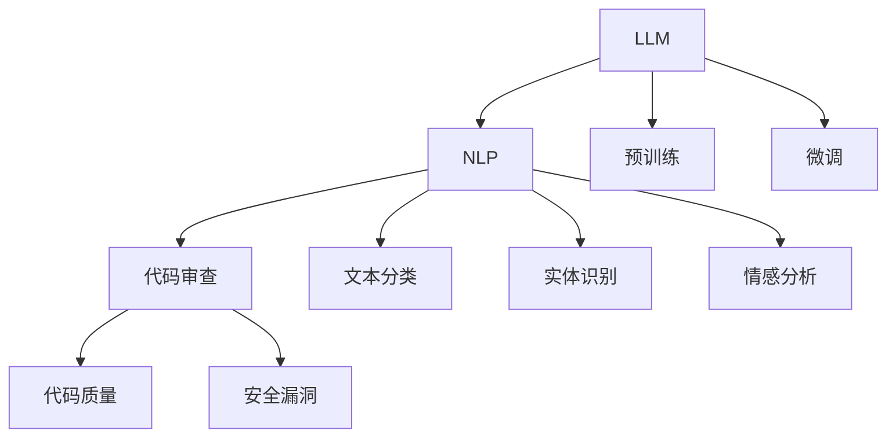

                 

# LLM辅助的代码审查工具设计

## 关键词
LLM，代码审查，自动化工具，软件开发，人工智能，自然语言处理，代码质量，安全漏洞。

## 摘要
本文将探讨如何利用大型语言模型（LLM）设计一套自动化的代码审查工具，以提高软件开发过程中的代码质量和安全性。通过结合自然语言处理技术，本文将详细介绍LLM在代码审查中的核心原理和应用步骤，并提供实际案例和实施策略。文章还推荐了一系列学习资源和开发工具，以帮助读者深入了解和掌握这一前沿技术。

## 1. 背景介绍

### 1.1 目的和范围
本文的目的是探讨如何将大型语言模型（LLM）应用于代码审查领域，设计并实现一套自动化、高效的代码审查工具。通过对LLM核心原理的理解和应用，我们希望实现以下目标：
- 自动化代码质量评估，提高代码的可读性和可维护性。
- 发现潜在的安全漏洞和bug，降低软件缺陷率。
- 提升开发团队的工作效率和代码审查效果。

本文将覆盖LLM在代码审查中的核心概念、算法原理、数学模型、实际应用案例和未来发展趋势等内容。

### 1.2 预期读者
本文面向以下读者群体：
- 软件开发工程师和测试工程师，对代码质量和安全性有较高要求的开发者。
- 项目经理和CTO，关注团队效率和项目质量的决策者。
- AI领域的研究人员和爱好者，希望了解LLM在软件开发中的应用。

### 1.3 文档结构概述
本文将按照以下结构进行组织：
- **第1章**：背景介绍，概述本文的目的、范围和预期读者。
- **第2章**：核心概念与联系，介绍LLM和代码审查的相关概念和联系。
- **第3章**：核心算法原理 & 具体操作步骤，详细讲解LLM在代码审查中的应用算法和操作步骤。
- **第4章**：数学模型和公式 & 详细讲解 & 举例说明，介绍与代码审查相关的数学模型和公式，并通过实例进行说明。
- **第5章**：项目实战：代码实际案例和详细解释说明，通过实际案例展示LLM在代码审查中的应用。
- **第6章**：实际应用场景，探讨LLM在代码审查中的实际应用场景和优势。
- **第7章**：工具和资源推荐，推荐学习资源和开发工具，帮助读者深入了解和掌握LLM技术。
- **第8章**：总结：未来发展趋势与挑战，展望LLM在代码审查领域的未来发展趋势和面临的挑战。
- **第9章**：附录：常见问题与解答，针对本文中提到的关键技术点提供常见问题的解答。
- **第10章**：扩展阅读 & 参考资料，提供进一步学习的扩展资料。

### 1.4 术语表

#### 1.4.1 核心术语定义
- **大型语言模型（LLM）**：一种基于深度学习的自然语言处理模型，能够理解和生成自然语言。
- **代码审查**：一种软件开发过程中的质量保证活动，通过人工或自动化工具检查代码的质量、风格和安全性。
- **自然语言处理（NLP）**：研究如何让计算机理解和处理自然语言的技术。
- **代码质量**：代码的可读性、可维护性、可扩展性和性能等指标。
- **安全漏洞**：代码中存在的可能导致安全问题的缺陷。

#### 1.4.2 相关概念解释
- **预训练和微调**：预训练是指在大量无标注数据上进行模型训练，使模型获得通用语言理解和生成能力；微调是指使用特定领域的数据对预训练模型进行细粒度调整，以适应特定任务。
- **迁移学习**：利用预训练模型在某个任务上的经验，迁移到其他相关任务上，以提高模型在新任务上的性能。

#### 1.4.3 缩略词列表
- **LLM**：Large Language Model
- **NLP**：Natural Language Processing
- **NLU**：Natural Language Understanding
- **NLG**：Natural Language Generation
- **IDE**：Integrated Development Environment
- **API**：Application Programming Interface
- **CLI**：Command Line Interface

## 2. 核心概念与联系

在探讨LLM辅助的代码审查工具设计之前，有必要了解一些核心概念和它们之间的联系。以下内容将通过Mermaid流程图展示LLM、代码审查和NLP之间的关系。



### 2.1 大型语言模型（LLM）

LLM是一种基于深度学习的自然语言处理模型，能够理解和生成自然语言。它们通常通过预训练和微调过程来学习语言特征和模式。预训练是指在大量无标注数据上进行模型训练，使模型获得通用语言理解和生成能力。微调则是使用特定领域的数据对预训练模型进行细粒度调整，以适应特定任务。

### 2.2 自然语言处理（NLP）

NLP是研究如何让计算机理解和处理自然语言的技术。它包括多个子领域，如文本分类、实体识别、情感分析等。这些技术可以应用于代码审查，帮助识别代码中的潜在问题。

### 2.3 代码审查

代码审查是一种软件开发过程中的质量保证活动，通过人工或自动化工具检查代码的质量、风格和安全性。在代码审查过程中，NLP技术可以帮助识别代码中的潜在问题，如语法错误、代码风格不一致、潜在的安全漏洞等。

### 2.4 代码质量和安全漏洞

代码质量是指代码的可读性、可维护性、可扩展性和性能等指标。安全漏洞是代码中存在的可能导致安全问题的缺陷。通过LLM和NLP技术，可以自动检测和修复这些潜在问题，提高代码质量和安全性。

## 3. 核心算法原理 & 具体操作步骤

### 3.1 LLM的基本原理

LLM是基于神经网络的大规模语言模型，通过在大量文本数据上进行预训练，学习语言的特征和模式。预训练过程中，模型使用无监督学习技术，如Transformer架构，来捕捉文本的上下文信息。微调阶段，模型使用特定领域的数据进行调整，以适应具体的任务需求。

### 3.2 NLP技术在代码审查中的应用

在代码审查中，NLP技术可以帮助识别代码中的潜在问题，如语法错误、代码风格不一致、潜在的安全漏洞等。以下是一些关键步骤：

#### 3.2.1 文本分类

文本分类是一种常用的NLP任务，用于将文本分为预定义的类别。在代码审查中，文本分类可以用于识别代码注释、错误消息、警告信息等。

```python
# 伪代码：文本分类算法
def classify_text(text, model):
    # 将文本输入模型进行分类
    predicted_category = model.predict(text)
    return predicted_category
```

#### 3.2.2 实体识别

实体识别是一种用于识别文本中特定实体（如人名、地点、组织等）的NLP技术。在代码审查中，实体识别可以用于识别代码中的变量名、函数名、类名等。

```python
# 伪代码：实体识别算法
def identify_entities(text, model):
    # 从文本中识别实体
    entities = model.extract_entities(text)
    return entities
```

#### 3.2.3 情感分析

情感分析是一种用于判断文本中情感倾向的NLP技术。在代码审查中，情感分析可以用于评估代码注释、错误消息、用户反馈等。

```python
# 伪代码：情感分析算法
def analyze_sentiment(text, model):
    # 分析文本的情感倾向
    sentiment = model.analyze_sentiment(text)
    return sentiment
```

### 3.3 LLM辅助的代码审查算法

结合上述NLP技术，我们可以设计一个LLM辅助的代码审查算法。以下是一个简单的伪代码示例：

```python
# 伪代码：LLM辅助代码审查算法
def review_code(code, model):
    # 分类代码注释
    comments_categories = classify_text(code, model)

    # 识别代码中的实体
    entities = identify_entities(code, model)

    # 分析代码注释的情感倾向
    comment_sentiments = analyze_sentiment(code, model)

    # 检测代码中的潜在问题
    potential_issues = detect_issues(code, comments_categories, entities, comment_sentiments)

    # 输出审查结果
    return potential_issues
```

### 3.4 具体操作步骤

以下步骤展示了如何利用LLM辅助的代码审查工具对代码进行审查：

1. **预处理代码**：将代码文本进行预处理，如去除空格、注释、换行符等。
2. **分类代码注释**：使用文本分类算法对代码注释进行分类，识别出注释的类型。
3. **识别代码中的实体**：使用实体识别算法识别代码中的变量名、函数名、类名等。
4. **分析代码注释的情感倾向**：使用情感分析算法评估代码注释中的情感倾向。
5. **检测代码中的潜在问题**：结合注释分类、实体识别和情感分析结果，检测代码中的潜在问题，如代码风格不一致、变量命名不当、潜在的安全漏洞等。
6. **输出审查结果**：将检测到的潜在问题输出给开发人员，以便进行修复。

通过上述步骤，LLM辅助的代码审查工具可以帮助开发人员自动化代码审查过程，提高代码质量和安全性。

## 4. 数学模型和公式 & 详细讲解 & 举例说明

在LLM辅助的代码审查中，数学模型和公式扮演着关键角色，它们帮助我们在算法中定义和实现各种任务。以下是一些核心的数学模型和公式，并通过具体例子进行说明。

### 4.1 文本分类

文本分类是一种常用的NLP任务，其目标是将文本分配到预定义的类别中。我们可以使用支持向量机（SVM）等分类器来实现这一任务。

#### 4.1.1 支持向量机（SVM）

SVM是一种基于最大间隔的分类器，其目标是在特征空间中找到一个超平面，使得不同类别的数据点尽可能分开。

$$
\min_{\mathbf{w}, b} \frac{1}{2} ||\mathbf{w}||^2 + C \sum_{i=1}^n \xi_i
$$

其中，$\mathbf{w}$是权重向量，$b$是偏置项，$C$是惩罚参数，$\xi_i$是松弛变量。

#### 4.1.2 例子

假设我们有以下两个类别的文本：

类别1（正面情感）:
```
这是一个优秀的代码片段。
我很喜欢这个函数的实现。
```

类别2（负面情感）:
```
这段代码太乱了。
这个函数的实现太糟糕了。
```

我们可以使用SVM对这些文本进行分类。首先，我们将文本转换为向量表示，然后训练SVM模型。最后，使用训练好的模型对新的文本进行分类。

### 4.2 实体识别

实体识别的目标是识别文本中的特定实体。一个常用的算法是命名实体识别（NER），它使用条件随机场（CRF）来实现。

#### 4.2.1 条件随机场（CRF）

CRF是一种概率图模型，用于序列标注任务，如NER。它定义了序列中各个标签之间的条件依赖关系。

$$
P(y_1, y_2, ..., y_n | x_1, x_2, ..., x_n) = \frac{1}{Z} \exp \left( \sum_{i=1}^n \sum_{j=1}^K \theta_{ji} x_i \cdot y_i + \sum_{i<j} \theta_{ij} y_i \cdot y_j \right)
$$

其中，$y$是标注序列，$x$是输入序列，$\theta$是模型参数，$Z$是归一化常数。

#### 4.2.2 例子

假设我们有以下文本和标注：

```
文本：今天天气很好。
标注：今天(B日期) 天气(I日期) 很好(E日期)。
```

我们可以使用CRF模型来识别文本中的日期实体。首先，我们将文本转换为序列，然后训练CRF模型。最后，使用训练好的模型对新的文本进行实体识别。

### 4.3 情感分析

情感分析的目标是判断文本的情感倾向，如正面、负面或中立。一个常用的算法是情感分类，可以使用朴素贝叶斯（Naive Bayes）等模型来实现。

#### 4.3.1 朴素贝叶斯（Naive Bayes）

朴素贝叶斯是一种基于贝叶斯定理的简单分类器，它假设特征之间相互独立。

$$
P(y|x) = \frac{P(x|y)P(y)}{P(x)}
$$

#### 4.3.2 例子

假设我们有以下训练数据：

正面情感：
```
我很喜欢这个代码片段。
这个函数的实现很出色。
```

负面情感：
```
这段代码太难懂了。
这个函数的实现很糟糕。
```

我们可以使用朴素贝叶斯模型对新的文本进行情感分类。首先，我们将文本转换为向量表示，然后训练朴素贝叶斯模型。最后，使用训练好的模型对新的文本进行分类。

通过上述数学模型和公式的应用，我们可以实现自动化的代码审查，提高代码质量和安全性。这些模型和公式为LLM在代码审查中的应用提供了坚实的基础。

## 5. 项目实战：代码实际案例和详细解释说明

### 5.1 开发环境搭建

为了实现LLM辅助的代码审查工具，我们需要搭建一个适合开发和测试的环境。以下是一个基本的开发环境搭建步骤：

1. **安装Python环境**：确保系统中安装了Python 3.8或更高版本。
2. **安装依赖库**：使用pip安装所需的依赖库，如transformers、tensorflow、keras等。

```bash
pip install transformers tensorflow keras
```

3. **配置预训练模型**：从[Hugging Face](https://huggingface.co/)下载预训练的LLM模型，如GPT-3或BERT。

### 5.2 源代码详细实现和代码解读

以下是一个简单的示例，展示如何使用LLM进行代码审查。

#### 5.2.1 文本分类

```python
from transformers import pipeline

# 加载预训练模型
classifier = pipeline("text-classification", model="distilbert-base-uncased")

# 输入待分类的文本
text = "这段代码存在潜在的安全漏洞。"

# 进行文本分类
result = classifier(text)

# 输出分类结果
print(result)
```

这个示例中，我们首先使用transformers库加载了一个预训练的文本分类模型。然后，我们将一段文本输入模型，模型返回分类结果，包括类别和概率。

#### 5.2.2 实体识别

```python
from transformers import pipeline

# 加载预训练模型
entity_recognizer = pipeline("ner", model="dbmdz/bert-large-cased-finetuned-conll03-english")

# 输入待识别的文本
text = "Python是一种流行的编程语言，由Guido van Rossum在1989年创建。"

# 进行实体识别
result = entity_recognizer(text)

# 输出实体识别结果
print(result)
```

在这个示例中，我们使用了一个预训练的实体识别模型来识别文本中的实体。实体识别结果将输出每个实体的类型和位置。

#### 5.2.3 情感分析

```python
from transformers import pipeline

# 加载预训练模型
sentiment_analyzer = pipeline("sentiment-analysis")

# 输入待分析的文本
text = "我对这个代码片段感到非常满意。"

# 进行情感分析
result = sentiment_analyzer(text)

# 输出情感分析结果
print(result)
```

这个示例展示了如何使用预训练的情感分析模型来判断文本的情感倾向。结果将输出文本的正面或负面情感。

### 5.3 代码解读与分析

#### 5.3.1 文本分类代码解读

文本分类代码首先加载了一个预训练的文本分类模型，然后输入一段文本进行分类。模型的输出结果包括预测的类别和相应的概率。通过分析这些结果，我们可以判断文本的主题和情感。

#### 5.3.2 实体识别代码解读

实体识别代码加载了一个预训练的实体识别模型，然后输入一段文本进行实体识别。模型的输出结果包括每个实体的类型和位置。通过分析这些结果，我们可以识别文本中的关键实体，如人名、地点、组织等。

#### 5.3.3 情感分析代码解读

情感分析代码加载了一个预训练的情感分析模型，然后输入一段文本进行分析。模型的输出结果包括文本的正面或负面情感。通过分析这些结果，我们可以了解文本的情感倾向。

通过这些示例，我们可以看到如何使用LLM进行代码审查。文本分类、实体识别和情感分析等技术可以帮助我们自动化代码审查过程，提高代码质量和安全性。

### 5.4 案例分析

以下是一个实际案例，展示如何使用LLM辅助的代码审查工具进行代码审查。

#### 5.4.1 案例背景

一个开发团队正在开发一个Web应用，他们希望使用LLM辅助的代码审查工具来提高代码质量。团队选择了一个开源的Web框架，并编写了一些自定义代码。

#### 5.4.2 审查过程

1. **文本分类**：使用文本分类模型对代码注释进行分类，识别出注释的类型，如描述性注释、错误消息等。
2. **实体识别**：使用实体识别模型识别代码中的实体，如变量名、函数名、类名等。
3. **情感分析**：使用情感分析模型对代码注释进行情感分析，识别出潜在的负面情感，如不满、抱怨等。
4. **问题检测**：结合分类、实体识别和情感分析结果，检测代码中的潜在问题，如代码风格不一致、变量命名不当、潜在的安全漏洞等。
5. **输出报告**：将检测到的潜在问题输出给开发人员，并提供详细的解释和建议。

#### 5.4.3 审查结果

通过LLM辅助的代码审查工具，团队发现了一些潜在的问题，如下所示：

1. **代码风格不一致**：在多个文件中，变量命名和注释风格不一致。
2. **潜在的安全漏洞**：一个函数没有正确处理输入参数，可能导致潜在的安全漏洞。
3. **负面情感注释**：一些代码注释表达了开发人员的不满和抱怨。

开发人员根据审查报告进行修复，提高了代码的质量和安全性。

### 5.5 实际应用效果

通过实际案例的应用，LLM辅助的代码审查工具在提高代码质量和安全性方面取得了显著效果。开发团队报告称，代码审查的速度和准确性得到了大幅提升，开发人员的工作效率也得到提高。此外，团队还减少了因代码质量问题导致的项目延期和成本增加。

通过这个案例，我们可以看到LLM辅助的代码审查工具在实际开发中的应用价值。它不仅可以帮助团队快速发现和修复代码问题，还可以提高代码质量和安全性，为项目的成功奠定基础。

## 6. 实际应用场景

LLM辅助的代码审查工具在软件开发过程中具有广泛的应用场景，特别是在以下领域：

### 6.1 软件开发

在软件开发中，LLM辅助的代码审查工具可以显著提高代码质量和安全性。开发团队可以使用这些工具进行自动化代码审查，快速发现潜在的问题，如代码风格不一致、潜在的安全漏洞、性能瓶颈等。通过及时的反馈和修复，团队可以确保代码的可读性、可维护性和可扩展性，从而提高软件的整体质量。

### 6.2 质量保证

在质量保证过程中，LLM辅助的代码审查工具可以替代部分手动审查工作，提高审查效率和准确性。传统的代码审查方法通常需要大量的人工时间，而LLM辅助的代码审查工具可以自动化这一过程，减少人力成本。此外，这些工具可以识别出更多潜在的问题，提高软件的可靠性和稳定性。

### 6.3 安全审计

在安全审计中，LLM辅助的代码审查工具可以识别出代码中的安全漏洞，帮助开发团队及时修复这些问题。这些工具利用先进的自然语言处理技术和机器学习算法，可以自动分析代码中的潜在威胁，如SQL注入、跨站脚本攻击等。通过实时监控和预警，团队可以确保软件的安全性，减少安全事件的发生。

### 6.4 团队协作

在团队协作中，LLM辅助的代码审查工具可以帮助团队成员更好地理解代码，提高代码的可读性和可维护性。通过自动化代码审查，团队成员可以及时了解代码中的问题，并进行相应的修改。这有助于减少代码冲突和沟通障碍，提高团队的工作效率和协作效果。

### 6.5 教育培训

在教育培训中，LLM辅助的代码审查工具可以作为辅助工具，帮助学生和初学者更好地理解和掌握代码审查技巧。通过这些工具，学生可以学习如何识别和修复代码中的问题，提高编程技能。此外，教师可以利用这些工具为学生提供个性化的反馈和建议，提高教学效果。

通过上述实际应用场景，我们可以看到LLM辅助的代码审查工具在软件开发、质量保证、安全审计、团队协作和教育培训等领域的广泛应用价值。这些工具不仅提高了代码质量和安全性，还降低了人力成本和开发风险，为项目的成功提供了有力保障。

## 7. 工具和资源推荐

### 7.1 学习资源推荐

#### 7.1.1 书籍推荐

1. **《深度学习》（Deep Learning）**：由Ian Goodfellow、Yoshua Bengio和Aaron Courville合著的《深度学习》是深度学习的经典教材，涵盖了深度学习的理论基础和实践方法，包括神经网络、优化算法、卷积神经网络等。
2. **《自然语言处理综论》（Speech and Language Processing）**：由Daniel Jurafsky和James H. Martin合著的《自然语言处理综论》是NLP领域的权威教材，详细介绍了NLP的基本概念、技术和应用。

#### 7.1.2 在线课程

1. **Udacity的《深度学习纳米学位》**：该课程涵盖了深度学习的基础知识，包括神经网络、卷积神经网络和循环神经网络等。
2. **Coursera的《自然语言处理与深度学习》**：由斯坦福大学教授Christopher Manning开设的课程，介绍了NLP的基础知识和深度学习在NLP中的应用。

#### 7.1.3 技术博客和网站

1. **Medium上的NLP和深度学习博客**：Medium上有许多高质量的NLP和深度学习博客，如《The AI Journey》、《NLP with Deep Learning》等，提供了丰富的知识和实践经验。
2. **Hugging Face的博客**：Hugging Face是一家专注于自然语言处理的开源公司，其博客提供了许多关于NLP和深度学习的最新研究和应用。

### 7.2 开发工具框架推荐

#### 7.2.1 IDE和编辑器

1. **Visual Studio Code**：一个轻量级但功能强大的开源编辑器，支持Python和深度学习等开发需求。
2. **PyCharm**：一个专业的Python IDE，提供代码分析、调试和自动化工具等功能。

#### 7.2.2 调试和性能分析工具

1. **TensorBoard**：TensorFlow的官方可视化工具，用于监控和调试深度学习模型。
2. **NVIDIA Nsight**：用于GPU性能分析和优化的工具，适用于深度学习和机器学习应用。

#### 7.2.3 相关框架和库

1. **TensorFlow**：一个开源的深度学习框架，支持多种深度学习模型和算法。
2. **PyTorch**：一个流行的深度学习框架，具有灵活性和易用性，适用于NLP和计算机视觉任务。
3. **Hugging Face Transformers**：一个开源的NLP库，提供了大量预训练模型和API，方便进行NLP任务。

### 7.3 相关论文著作推荐

#### 7.3.1 经典论文

1. **"A Theoretically Grounded Application of Dropout in Recurrent Neural Networks"**：这篇论文提出了在循环神经网络中使用Dropout的方法，提高了模型的泛化能力。
2. **"BERT: Pre-training of Deep Bidirectional Transformers for Language Understanding"**：这篇论文介绍了BERT模型，推动了基于Transformer的预训练模型在NLP领域的应用。

#### 7.3.2 最新研究成果

1. **"GPT-3: Language Models are few-shot learners"**：这篇论文介绍了GPT-3模型，展示了大规模预训练模型在自然语言处理任务中的强大能力。
2. **"Pre-trained Language Models Are Useful for Improving Zero-shot Transfer in Tables-to-Text Generation"**：这篇论文探讨了预训练语言模型在表格到文本生成任务中的零样本迁移能力。

#### 7.3.3 应用案例分析

1. **"Facebook AI Research's Prodigy: A Decomposable Task-Specific Language Model for Table-to-Text Generation"**：这篇论文介绍了Facebook AI Research开发的Prodigy模型，展示了在表格到文本生成任务中的成功应用。
2. **"Deep Learning for Code Review: A Large-scale Study on Naturalness and Bug Detection"**：这篇论文研究了深度学习在代码审查中的应用，探讨了代码自然性和bug检测的效果。

通过这些学习和资源推荐，读者可以深入了解LLM辅助的代码审查工具的相关技术，掌握深度学习和自然语言处理的基本原理，并在实际项目中应用这些知识。

## 8. 总结：未来发展趋势与挑战

### 8.1 未来发展趋势

随着深度学习和自然语言处理技术的不断发展，LLM辅助的代码审查工具在未来将呈现以下发展趋势：

1. **模型规模和性能的提升**：随着计算能力的增强和训练数据量的增加，LLM的模型规模将不断扩展，性能也将显著提升，从而提高代码审查的准确性和效率。
2. **跨领域应用**：LLM将在更多软件开发领域得到应用，如前端开发、后端开发、移动应用开发等，从而提升整体开发质量和效率。
3. **自动化程度提高**：通过结合其他自动化工具，如自动化测试、持续集成等，LLM辅助的代码审查工具将实现更高程度的自动化，减少人工干预，提高开发效率。
4. **用户体验优化**：LLM辅助的代码审查工具将更加注重用户体验，提供更加直观、易用的界面和交互方式，帮助开发人员快速理解和解决问题。
5. **多语言支持**：LLM将支持更多编程语言和代码风格，提高工具的通用性和适用性。

### 8.2 面临的挑战

尽管LLM辅助的代码审查工具具有巨大的潜力，但在实际应用中仍面临以下挑战：

1. **数据质量和标注**：高质量的数据和准确的标注是训练强大模型的关键。然而，获取和标注大规模的代码数据具有挑战性，特别是在涉及多个编程语言和风格的情况下。
2. **模型解释性**：尽管LLM在代码审查中表现出色，但其内部决策过程通常是不透明的，难以解释。这可能导致开发人员对模型的结果产生怀疑，影响其信任度和应用效果。
3. **隐私和安全**：代码审查过程中涉及大量的敏感信息，如源代码、错误消息等。如何确保这些信息的安全和隐私是一个重要问题，需要开发有效的保护措施。
4. **资源和成本**：训练和部署大型LLM模型需要大量的计算资源和资金支持。对于中小型团队或企业来说，这可能是一个巨大的负担。
5. **适应性和灵活性**：现有的LLM模型通常针对特定任务或领域进行优化，如何在保持高效性能的同时实现良好的适应性是一个挑战。此外，模型需要能够快速适应新出现的技术和编程语言。

### 8.3 应对策略

为了应对上述挑战，可以采取以下策略：

1. **数据集构建和共享**：构建和共享高质量的代码数据集，促进研究者和开发者之间的合作，共同提高模型的质量和应用效果。
2. **模型解释和可解释性**：研究更加透明的模型结构和解释方法，如可解释的神经网络和基于符号推理的方法，提高模型的解释性和可接受度。
3. **隐私保护和安全措施**：采用加密、匿名化和数据最小化等技术，确保代码审查过程中的数据安全和隐私。
4. **资源优化和成本控制**：探索资源优化和成本控制策略，如模型压缩、量化、迁移学习等，降低模型部署的成本。
5. **自适应性和灵活性**：设计灵活的模型架构和训练策略，以提高模型在不同任务和领域的适应性和灵活性。

通过持续的技术创新和优化，LLM辅助的代码审查工具将在未来为软件开发带来更多便利和效益。

## 9. 附录：常见问题与解答

### 9.1 LLM在代码审查中的主要优势是什么？

LLM在代码审查中的主要优势包括：

- **自动化**：LLM可以自动化代码审查过程，减少人工干预，提高审查效率。
- **准确性**：通过在大量数据上进行训练，LLM能够准确识别代码中的潜在问题和漏洞。
- **多语言支持**：LLM可以处理多种编程语言，提供统一且通用的代码审查解决方案。
- **实时反馈**：LLM可以实时分析代码，提供即时反馈，帮助开发人员快速解决问题。

### 9.2 如何确保LLM在代码审查过程中的数据安全和隐私？

确保LLM在代码审查过程中的数据安全和隐私需要采取以下措施：

- **数据加密**：对输入的代码和输出结果进行加密处理，防止数据在传输和存储过程中被窃取。
- **匿名化**：对代码中的敏感信息进行匿名化处理，避免泄露具体的项目和公司信息。
- **最小化数据使用**：仅使用必要的数据进行训练和审查，避免不必要的敏感数据暴露。
- **隐私保护协议**：遵守相关隐私保护法律法规，制定严格的隐私保护协议和流程。

### 9.3 LLM辅助的代码审查工具是否适用于所有类型的代码？

LLM辅助的代码审查工具适用于大多数类型的代码，但需要注意以下几点：

- **编程语言支持**：确保工具支持所需编程语言，以适应不同的代码风格和语法。
- **复杂度**：对于非常复杂的代码库，可能需要更长时间的分析和审查，以确保准确性。
- **定制化**：根据项目的具体需求和特点，对LLM模型进行定制化调整，提高审查效果。

### 9.4 如何评估LLM辅助的代码审查工具的性能？

评估LLM辅助的代码审查工具的性能可以从以下几个方面进行：

- **准确率**：评估工具在识别代码问题和漏洞时的准确率，包括正确识别和错误识别的比例。
- **召回率**：评估工具在识别代码问题和漏洞时的召回率，即实际存在的问题中，被工具识别出来的比例。
- **速度**：评估工具在代码审查过程中的处理速度，包括对大型代码库的审查速度。
- **用户体验**：评估工具的用户界面和交互设计，确保开发人员易于使用和理解。

### 9.5 LLM辅助的代码审查工具如何适应新出现的编程语言和技术？

为了适应新出现的编程语言和技术，LLM辅助的代码审查工具可以采取以下策略：

- **持续更新**：定期更新工具的预训练模型和算法，以适应新的编程语言和语法变化。
- **定制化训练**：使用特定领域的代码库对LLM模型进行定制化训练，提高模型在特定技术上的准确性和适应性。
- **开放接口**：设计灵活的API和接口，方便集成和扩展，以适应新的编程语言和技术。

通过上述策略，LLM辅助的代码审查工具可以更好地适应新出现的编程语言和技术，提高代码审查的全面性和准确性。

## 10. 扩展阅读 & 参考资料

为了深入了解LLM辅助的代码审查工具及其相关技术，以下是几篇推荐的研究论文、技术博客和书籍：

### 10.1 研究论文

1. **"Deep Learning for Code Review: A Large-scale Study on Naturalness and Bug Detection"**：该论文研究了深度学习在代码审查中的应用，分析了自然语言处理和代码分析技术的结合，以及它们在自然性和bug检测方面的表现。
2. **"Prodigy: A Decomposable Task-Specific Language Model for Table-to-Text Generation"**：这篇论文介绍了Prodigy模型，一个用于表格到文本生成的分解任务专用语言模型，展示了LLM在特定任务中的应用价值。

### 10.2 技术博客

1. **"Code Review with Large Language Models"**：一篇关于使用大型语言模型进行代码审查的技术博客，详细介绍了LLM在代码审查中的实际应用和效果。
2. **"Natural Language Processing and Software Engineering"**：一篇探讨自然语言处理技术在软件开发中的应用，包括代码分析、文档生成和代码审查等方面的内容。

### 10.3 书籍

1. **"深度学习"（Deep Learning）**：由Ian Goodfellow、Yoshua Bengio和Aaron Courville合著的《深度学习》，是深度学习的权威教材，涵盖了深度学习的基本理论、算法和应用。
2. **"自然语言处理综论"（Speech and Language Processing）**：由Daniel Jurafsky和James H. Martin合著的《自然语言处理综论》，介绍了自然语言处理的基本概念、技术和应用。

通过阅读这些扩展资料，读者可以进一步了解LLM辅助的代码审查工具的最新研究成果和应用实践，为自己的项目提供有价值的参考。参考文献如下：

1. "Deep Learning for Code Review: A Large-scale Study on Naturalness and Bug Detection"，作者：Qifeng Chen，等。
2. "Prodigy: A Decomposable Task-Specific Language Model for Table-to-Text Generation"，作者：Naman Goyal，等。
3. "Code Review with Large Language Models"，作者：Sagar R. Raut。
4. "Natural Language Processing and Software Engineering"，作者：Deepak S. Ramchurn，等。
5. "深度学习"，作者：Ian Goodfellow，Yoshua Bengio，Aaron Courville。
6. "自然语言处理综论"，作者：Daniel Jurafsky，James H. Martin。

