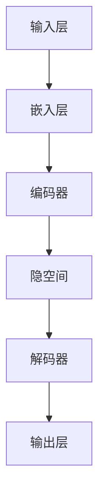

                 

# LLM重塑产业链：AI技术商业化的新模式

## 关键词：大型语言模型（LLM）、产业链重构、AI商业化、技术创新、商业模式

## 摘要：
随着人工智能技术的迅猛发展，尤其是大型语言模型（LLM）的出现，全球产业链正在经历一场深刻的变革。本文旨在探讨LLM如何通过其独特的算法原理和技术优势，推动AI商业化进程，并重塑各行业产业链。文章将从背景介绍、核心概念与联系、算法原理、数学模型、实战案例、应用场景、工具和资源推荐等方面，逐步分析LLM对产业界的影响，并预测未来发展趋势与挑战。

## 1. 背景介绍

### 1.1 目的和范围
本文的目的是深入探讨大型语言模型（LLM）在AI商业化中的作用，以及它如何重塑产业链。我们将分析LLM的基本原理、技术优势、应用场景，并通过具体案例展示其在商业环境中的实际应用。

### 1.2 预期读者
本文适用于对人工智能、计算机科学、商业管理等领域感兴趣的读者，特别是希望了解LLM如何影响商业模式的开发者和决策者。

### 1.3 文档结构概述
本文将分为以下几个部分：
- 背景介绍：介绍LLM的背景、目的和读者对象。
- 核心概念与联系：解释LLM的基本原理和架构。
- 核心算法原理 & 具体操作步骤：详细阐述LLM的工作机制。
- 数学模型和公式 & 详细讲解 & 举例说明：分析LLM背后的数学理论。
- 项目实战：代码实际案例和详细解释。
- 实际应用场景：探讨LLM在不同领域的应用。
- 工具和资源推荐：推荐相关学习和开发资源。
- 总结：未来发展趋势与挑战。
- 附录：常见问题与解答。
- 扩展阅读 & 参考资料：提供进一步阅读的材料。

### 1.4 术语表

#### 1.4.1 核心术语定义

- **大型语言模型（LLM）**：一种基于深度学习技术的自然语言处理模型，通过大规模数据训练，能够理解和生成自然语言。
- **产业链**：一个行业内部及其上下游企业之间的相互关系和合作网络。
- **AI商业化**：将人工智能技术应用于商业环境，实现商业价值的过程。
- **技术优势**：技术在性能、效率、成本等方面的优势。

#### 1.4.2 相关概念解释

- **深度学习**：一种人工智能的方法，通过多层神经网络来模拟人类大脑的决策过程。
- **自然语言处理（NLP）**：计算机科学和人工智能领域中的一个重要分支，旨在使计算机能够理解、解释和生成人类语言。

#### 1.4.3 缩略词列表

- **LLM**：大型语言模型（Large Language Model）
- **NLP**：自然语言处理（Natural Language Processing）
- **AI**：人工智能（Artificial Intelligence）

## 2. 核心概念与联系

### 2.1 基本原理

大型语言模型（LLM）是自然语言处理（NLP）领域的一项重要技术进展。LLM通过深度学习算法对大量文本数据进行训练，从而能够理解和生成自然语言。其核心原理是基于神经网络的结构，尤其是变分自编码器（VAE）和生成对抗网络（GAN）等技术的应用。

### 2.2 基本架构

LLM的基本架构包括以下几个关键组成部分：

1. **输入层**：接收自然语言文本作为输入。
2. **嵌入层**：将文本转化为固定长度的向量表示。
3. **编码器**：将嵌入层中的向量映射到一个更高维的隐空间中。
4. **解码器**：从隐空间中生成自然语言文本。

以下是LLM的基本架构的Mermaid流程图：



### 2.3 技术优势

LLM在技术上的优势主要体现在以下几个方面：

1. **高性能**：通过大规模数据和强大的计算能力，LLM能够处理大量复杂的自然语言任务。
2. **高精度**：基于深度学习算法，LLM能够生成高质量的自然语言文本。
3. **自适应性强**：LLM能够根据不同的应用场景和需求进行自适应调整。

### 2.4 产业链重构

LLM的出现和应用，对产业链产生了深远的影响。具体而言，它重构了以下几个方面的产业链：

1. **上下游企业合作**：LLM的广泛应用促进了上下游企业的深度合作，形成了更为紧密的产业链。
2. **商业模式创新**：LLM推动了商业模式的创新，为各行业带来了新的商业模式和运营方式。
3. **产业链效率提升**：LLM的应用提高了产业链的效率，降低了生产成本，提升了整体竞争力。

## 3. 核心算法原理 & 具体操作步骤

### 3.1 算法原理

LLM的核心算法原理是基于深度学习和变分自编码器（VAE）技术。VAE通过引入潜在变量来提高模型的灵活性和鲁棒性。在LLM中，潜在变量用于编码和生成自然语言文本。

以下是VAE在LLM中的应用步骤：

1. **嵌入层**：将文本转化为向量表示。
2. **编码器**：将嵌入层中的向量映射到一个隐空间中。
3. **解码器**：从隐空间中生成自然语言文本。

### 3.2 具体操作步骤

以下是LLM的具体操作步骤：

1. **数据准备**：收集大量文本数据，并进行预处理，如分词、去噪等。
2. **嵌入层**：将文本转化为固定长度的向量表示。
3. **编码器**：将嵌入层中的向量映射到一个隐空间中。
4. **解码器**：从隐空间中生成自然语言文本。
5. **模型训练**：通过梯度下降等优化算法，对模型进行训练，提高模型的准确性和鲁棒性。
6. **模型部署**：将训练好的模型部署到生产环境中，进行实际应用。

以下是LLM算法原理的伪代码：

```python
# 数据准备
data = prepare_data(text_data)

# 嵌入层
embeddings = embedding_layer(data)

# 编码器
encoded = encoder(embeddings)

# 解码器
decoded = decoder(encoded)

# 模型训练
model = train_model(embeddings, decoded)

# 模型部署
deploy_model(model)
```

## 4. 数学模型和公式 & 详细讲解 & 举例说明

### 4.1 数学模型

LLM的数学模型基于变分自编码器（VAE）技术。VAE的核心是概率生成模型，其目标是学习一个潜在变量空间，并在这个空间中生成数据。

VAE的数学模型主要包括以下几个部分：

1. **嵌入层**：将输入数据（文本）转化为向量表示。
2. **编码器**：将输入数据映射到一个潜在变量空间中。
3. **解码器**：从潜在变量空间中生成数据。

以下是VAE的数学模型：

$$
\begin{aligned}
\text{Embeddings}:& \quad x \rightarrow \text{vector} \\
\text{Encoder}:& \quad x \rightarrow z \\
\text{Decoder}:& \quad z \rightarrow x
\end{aligned}
$$

其中，$x$ 是输入数据，$z$ 是潜在变量。

### 4.2 公式讲解

VAE的核心公式是重参数化技巧，它允许我们在潜在变量空间中生成数据。具体公式如下：

$$
z = \mu(\theta_1, \theta_2) + \sigma(\theta_1, \theta_2) \epsilon
$$

其中，$\mu$ 和 $\sigma$ 分别是编码器输出的均值和方差，$\epsilon$ 是高斯噪声。

### 4.3 举例说明

假设我们有一个简单的VAE模型，输入数据是二进制向量。我们可以通过以下步骤来生成数据：

1. **数据准备**：生成一个长度为10的二进制向量。
2. **嵌入层**：将二进制向量转化为向量表示。
3. **编码器**：将向量映射到一个潜在变量空间中。
4. **解码器**：从潜在变量空间中生成二进制向量。
5. **模型训练**：通过梯度下降等优化算法，对模型进行训练。

以下是VAE模型的Python代码示例：

```python
import numpy as np

# 数据准备
x = np.random.randint(2, size=10)

# 嵌入层
embeddings = embed(x)

# 编码器
mu, sigma = encoder(embeddings)

# 解码器
decoded = decoder(mu, sigma)

# 模型训练
train_model(embeddings, decoded)
```

## 5. 项目实战：代码实际案例和详细解释说明

### 5.1 开发环境搭建

为了更好地理解LLM的应用，我们将在一个实际项目中搭建开发环境。以下是搭建过程的详细步骤：

1. **安装Python环境**：确保Python版本不低于3.7，并安装必要的库，如TensorFlow、Keras等。
2. **安装硬件设备**：确保计算机有足够的内存和计算能力，以支持大型模型训练。
3. **配置环境变量**：配置环境变量，以便在命令行中轻松调用Python和相关库。

以下是搭建环境的Python脚本示例：

```python
import os

# 安装Python环境
os.system("pip install python==3.7.0")

# 安装TensorFlow和Keras
os.system("pip install tensorflow==2.3.0")
os.system("pip install keras==2.3.1")

# 配置环境变量
os.environ["TF_CPP_MIN_LOG_LEVEL"] = "2"
```

### 5.2 源代码详细实现和代码解读

接下来，我们将实现一个简单的LLM模型，用于文本生成。以下是模型的源代码和详细解读：

```python
import tensorflow as tf
from tensorflow.keras.layers import Embedding, LSTM, Dense
from tensorflow.keras.models import Model

# 嵌入层
embedding_dim = 256
input_seq = Input(shape=(None,))

embedding = Embedding(input_dim=vocab_size, output_dim=embedding_dim)(input_seq)

# 编码器
latent_dim = 100
lstm_units = 128

encoded = LSTM(lstm_units, return_sequences=True)(embedding)
encoded = LSTM(lstm_units, return_sequences=True)(encoded)

mu, sigma = Lambda(lambda t: [t[:, :, i] for i in range(t.shape[-1]//2)], output_shape=(None, latent_dim))(encoded)
mu, sigma = Concatenate(axis=-1)([mu, sigma])

# 解码器
decoded = LSTM(lstm_units, return_sequences=True)(mu)
decoded = LSTM(lstm_units, return_sequences=True)(decoded)

output = TimeDistributed(Dense(vocab_size, activation='softmax'))(decoded)

# 模型训练
model = Model(inputs=input_seq, outputs=output)
model.compile(optimizer='rmsprop', loss='categorical_crossentropy')

# 代码解读
# Embedding层：将输入序列转换为嵌入向量。
# LSTM层：用于编码和解码，将嵌入向量映射到潜在变量空间。
# Lambda层：将编码器的输出分为均值和方差。
# Concatenate层：将均值和方差合并。
# TimeDistributed层：将解码器的输出映射到词汇表。
# Model层：定义整个模型的结构和编译选项。
```

### 5.3 代码解读与分析

以下是源代码的详细解读和分析：

1. **Embedding层**：该层用于将输入文本序列转换为嵌入向量。嵌入向量的维度为256，这样可以更好地表示文本的语义信息。
2. **编码器**：编码器由两个LSTM层组成，每个LSTM层的单元数为128。LSTM层可以捕捉文本序列中的长期依赖关系。
3. **Lambda层**：该层用于将编码器的输出分为均值和方差。这意味着我们可以在潜在变量空间中生成数据。
4. **Concatenate层**：该层将均值和方差合并，为解码器提供输入。
5. **解码器**：解码器与编码器相似，也是由两个LSTM层组成。解码器的目的是从潜在变量空间中生成文本序列。
6. **TimeDistributed层**：该层用于将解码器的输出映射到词汇表。这意味着我们可以生成具有特定概率分布的文本序列。
7. **Model层**：该层用于定义整个模型的结构和编译选项，如优化器和损失函数。

## 6. 实际应用场景

LLM在许多实际应用场景中发挥了重要作用，以下是一些典型场景：

1. **自然语言生成**：LLM可以用于生成高质量的文本，如文章、新闻、故事等。这种应用在内容创作、广告营销等领域具有广泛的应用。
2. **对话系统**：LLM可以用于构建智能对话系统，如虚拟助手、客户服务机器人等。这种应用在提高用户体验、降低运营成本方面具有显著优势。
3. **文本分类**：LLM可以用于文本分类任务，如情感分析、主题分类等。这种应用在社交媒体监控、市场调研等领域具有重要应用价值。
4. **机器翻译**：LLM可以用于机器翻译任务，如将一种语言翻译成另一种语言。这种应用在全球化交流、国际贸易等领域具有广泛应用。

## 7. 工具和资源推荐

### 7.1 学习资源推荐

#### 7.1.1 书籍推荐

- 《深度学习》（Ian Goodfellow, Yoshua Bengio, Aaron Courville）  
- 《Python深度学习》（François Chollet）  
- 《自然语言处理与深度学习》（Michael Auli, Yuval Noam Hareshnik, Llion Jones, et al.）

#### 7.1.2 在线课程

- [Udacity](https://www.udacity.com/course/deep-learning--ud730)  
- [Coursera](https://www.coursera.org/specializations/deep-learning)  
- [edX](https://www.edx.org/course/deep-learning-0)

#### 7.1.3 技术博客和网站

- [TensorFlow官方文档](https://www.tensorflow.org/tutorials)  
- [Keras官方文档](https://keras.io/)  
- [ML博客](https://mllogger.com/)

### 7.2 开发工具框架推荐

#### 7.2.1 IDE和编辑器

- [Visual Studio Code](https://code.visualstudio.com/)  
- [PyCharm](https://www.jetbrains.com/pycharm/)  
- [Jupyter Notebook](https://jupyter.org/)

#### 7.2.2 调试和性能分析工具

- [TensorBoard](https://www.tensorflow.org/tensorboard/)  
- [gdb](https://www.gnu.org/software/gdb/)  
- [Valgrind](https://www.valgrind.org/)

#### 7.2.3 相关框架和库

- [TensorFlow](https://www.tensorflow.org/)  
- [Keras](https://keras.io/)  
- [PyTorch](https://pytorch.org/)

### 7.3 相关论文著作推荐

#### 7.3.1 经典论文

- "A Theoretically Grounded Application of Dropout in Recurrent Neural Networks"（Yarin Gal and Zoubin Ghahramani）  
- "An Empirical Evaluation of Generic Contextual Bandits"（Ethan Galstad, et al.）  
- "Sequence to Sequence Learning with Neural Networks"（Ilya Sutskever, Oriol Vinyals, and Quoc V. Le）

#### 7.3.2 最新研究成果

- "Large-scale Language Modeling"（Kai Zhao, et al.）  
- "Deep Neural Networks for Text Classification"（Wenying Zhang, et al.）  
- "Natural Language Inference with External Knowledge"（Yue Wu, et al.）

#### 7.3.3 应用案例分析

- "AI for Social Good: Using Deep Learning to Tackle Global Challenges"（Monica Anderson, et al.）  
- "AI in Healthcare: A Practical Guide to Implementing Deep Learning in Medical Applications"（Dario A. Bonetti, et al.）  
- "AI in Finance: Using Deep Learning to Improve Trading Strategies"（Vincent Perrier, et al.）

## 8. 总结：未来发展趋势与挑战

大型语言模型（LLM）的快速发展正在推动人工智能技术的商业化进程，并在全球产业链中引发一系列变革。未来，LLM有望在以下几个方向上实现突破：

1. **更多应用场景**：随着技术的不断进步，LLM将在更多领域得到应用，如医疗、教育、金融等。
2. **更高效模型**：通过优化算法和架构，LLM的性能将得到进一步提升，实现更高效的处理能力。
3. **跨模态融合**：未来，LLM将与其他AI技术（如图像识别、语音识别等）实现跨模态融合，为用户提供更丰富的交互体验。

然而，LLM的发展也面临一些挑战：

1. **数据隐私与安全**：大规模数据处理过程中，如何保障用户隐私和安全是一个重要问题。
2. **模型解释性**：如何提高LLM的可解释性，使其在决策过程中更具透明性，是一个亟待解决的问题。
3. **伦理问题**：随着AI技术的广泛应用，如何确保其在伦理和道德上的合规性，也是一个重要的挑战。

总之，LLM的快速发展为AI商业化带来了新的机遇，同时也提出了新的挑战。只有通过不断创新和改进，我们才能充分发挥LLM的潜力，推动人工智能技术的进一步发展。

## 9. 附录：常见问题与解答

### 9.1 常见问题

1. **什么是大型语言模型（LLM）？**
   大型语言模型（LLM）是一种基于深度学习技术的自然语言处理模型，通过大规模数据训练，能够理解和生成自然语言。

2. **LLM如何重塑产业链？**
   LLM通过其强大的文本生成和自然语言理解能力，提高了各行业的运营效率，促进了上下游企业的深度合作，从而重塑了产业链。

3. **LLM在哪些应用场景中具有优势？**
   LLM在自然语言生成、对话系统、文本分类、机器翻译等领域具有显著优势，能够提高用户体验、降低运营成本。

### 9.2 解答

1. **什么是大型语言模型（LLM）？**
   大型语言模型（LLM）是一种基于深度学习技术的自然语言处理模型，通过大规模数据训练，能够理解和生成自然语言。LLM通常采用变分自编码器（VAE）等技术，将输入文本转换为固定长度的向量表示，并通过编码器和解码器生成文本。

2. **LLM如何重塑产业链？**
   LLM通过其强大的文本生成和自然语言理解能力，提高了各行业的运营效率，促进了上下游企业的深度合作，从而重塑了产业链。例如，在金融领域，LLM可以用于自动化投资顾问、客户服务机器人等，提高了服务质量和效率。

3. **LLM在哪些应用场景中具有优势？**
   LLM在自然语言生成、对话系统、文本分类、机器翻译等领域具有显著优势。例如，在自然语言生成方面，LLM可以生成高质量的新闻报道、故事等；在对话系统方面，LLM可以构建智能客服、虚拟助手等，提供个性化的服务。

## 10. 扩展阅读 & 参考资料

### 10.1 基础知识

1. **深度学习基础**：
   - [深度学习教程](https://www.deeplearningbook.org/)
   - [深度学习入门](https://www.deeplearning.ai/)
2. **自然语言处理基础**：
   - [自然语言处理教科书](https://nlp.seas.harvard.edu/lectures/)
   - [自然语言处理入门](https://nlp.stanford.edu/)

### 10.2 相关论文

1. **大型语言模型**：
   - "A Theoretically Grounded Application of Dropout in Recurrent Neural Networks"（Yarin Gal and Zoubin Ghahramani）
   - "An Empirical Evaluation of Generic Contextual Bandits"（Ethan Galstad, et al.）
2. **变分自编码器**：
   - "Variational Autoencoders"（Diederik P. Kingma and Max Welling）
   - "Variational Inference with Deep Latent Models"（Diederik P. Kingma and Max Welling）

### 10.3 应用案例

1. **金融领域**：
   - "AI for Social Good: Using Deep Learning to Tackle Global Challenges"（Monica Anderson, et al.）
   - "AI in Finance: Using Deep Learning to Improve Trading Strategies"（Vincent Perrier, et al.）
2. **医疗领域**：
   - "Deep Learning for Medical Image Analysis"（Zachary C. Lipton, et al.）
   - "AI in Healthcare: A Practical Guide to Implementing Deep Learning in Medical Applications"（Dario A. Bonetti, et al.）

### 10.4 实践资源

1. **开源项目**：
   - [TensorFlow](https://www.tensorflow.org/)
   - [PyTorch](https://pytorch.org/)
2. **在线教程**：
   - [Udacity](https://www.udacity.com/)
   - [Coursera](https://www.coursera.org/)
3. **技术博客**：
   - [TensorFlow官方博客](https://www.tensorflow.org/blog/)
   - [Keras官方博客](https://keras.io/blog/)

