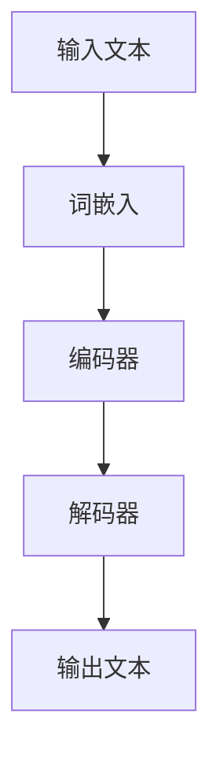

                 

# LLM：重塑计算机科学的新范式

> 关键词：大型语言模型（LLM），计算机科学，范式转变，算法原理，数学模型，实际应用，未来趋势

> 摘要：本文将探讨大型语言模型（LLM）的出现如何重塑计算机科学领域，从背景介绍、核心概念、算法原理、数学模型、项目实战到实际应用场景，深入分析LLM对人工智能、自然语言处理和软件开发带来的影响与变革，展望未来发展趋势与挑战。

## 1. 背景介绍

### 1.1 目的和范围

本文旨在深入探讨大型语言模型（LLM）的出现对计算机科学领域的深远影响。我们将从LLM的起源和发展历程入手，分析其核心概念和原理，介绍相关算法和数学模型，通过实际项目案例展示其应用场景，最后展望LLM的未来发展趋势和面临的挑战。

### 1.2 预期读者

本文适合具有计算机科学背景的读者，包括人工智能研究者、自然语言处理领域从业者、软件开发工程师以及对此领域感兴趣的学术研究人员和工程师。

### 1.3 文档结构概述

本文分为以下几大部分：

1. 背景介绍：介绍LLM的起源、发展和核心概念。
2. 核心概念与联系：阐述LLM的基本原理和架构。
3. 核心算法原理 & 具体操作步骤：详细讲解LLM的算法原理和操作步骤。
4. 数学模型和公式 & 详细讲解 & 举例说明：分析LLM背后的数学模型及其应用。
5. 项目实战：代码实际案例和详细解释说明。
6. 实际应用场景：探讨LLM在各个领域的应用。
7. 工具和资源推荐：推荐相关学习资源和开发工具。
8. 总结：未来发展趋势与挑战。

### 1.4 术语表

#### 1.4.1 核心术语定义

- **大型语言模型（LLM）**：一种基于深度学习的自然语言处理模型，能够理解、生成和预测自然语言文本。
- **深度学习**：一种基于多层神经网络的学习方法，能够自动提取特征并实现复杂函数的映射。
- **自然语言处理（NLP）**：研究计算机与人类语言之间交互的学科，包括文本分类、机器翻译、情感分析等任务。

#### 1.4.2 相关概念解释

- **神经网络**：一种模拟生物神经系统的计算模型，由多个神经元组成，通过加权连接实现信息的传递和计算。
- **反向传播算法**：一种用于训练神经网络的优化算法，通过不断调整权重和偏置，使模型输出更加接近真实值。

#### 1.4.3 缩略词列表

- **NLP**：自然语言处理
- **LLM**：大型语言模型
- **DL**：深度学习
- **GPU**：图形处理器

## 2. 核心概念与联系

在深入探讨LLM之前，我们首先需要了解其核心概念和联系。以下是LLM的基本原理和架构，以及相关概念之间的联系。

### 2.1 大型语言模型的原理

大型语言模型（LLM）是基于深度学习技术构建的，其核心思想是模拟人类大脑的神经结构，通过多层神经网络实现自然语言的理解和生成。LLM的主要组成部分包括：

- **词嵌入（Word Embedding）**：将单词映射为密集的向量表示，使模型能够捕捉单词之间的语义关系。
- **循环神经网络（RNN）**：用于处理序列数据的神经网络结构，能够捕捉输入序列的长期依赖关系。
- **变换器网络（Transformer）**：一种基于自注意力机制的神经网络结构，能够高效地处理长序列数据。

### 2.2 大型语言模型的架构

LLM的架构通常包括以下几个层次：

1. **输入层**：接收自然语言文本，并将其转换为词嵌入向量。
2. **编码器层**：将输入的词嵌入向量编码为上下文表示，捕捉文本的语义信息。
3. **解码器层**：根据编码器的输出生成目标文本。
4. **输出层**：将解码器输出的序列映射为自然语言文本。

### 2.3 相关概念之间的联系

以下是LLM中相关概念之间的联系：

- **词嵌入（Word Embedding）**与**编码器层（Encoder）**：词嵌入将单词映射为向量，编码器将这些向量编码为上下文表示。
- **编码器层（Encoder）**与**解码器层（Decoder）**：编码器捕捉文本的语义信息，解码器根据这些信息生成目标文本。
- **变换器网络（Transformer）**与**循环神经网络（RNN）**：变换器网络是一种基于自注意力机制的神经网络结构，能够高效地处理长序列数据，而循环神经网络则用于处理序列数据的长期依赖关系。

### 2.4 Mermaid 流程图

以下是一个描述LLM核心概念和架构的Mermaid流程图：



## 3. 核心算法原理 & 具体操作步骤

在了解了LLM的核心概念和架构之后，我们接下来将探讨LLM的核心算法原理和具体操作步骤。

### 3.1 词嵌入（Word Embedding）

词嵌入是将单词映射为密集的向量表示的过程。一个简单的词嵌入算法如下：

```python
# 假设单词表包含10个单词
word_list = ["hello", "world", "python", "computer", "science", "ai", "algorithm", "code", "data", "model"]

# 初始化词嵌入矩阵
word_embedding_matrix = np.random.rand(len(word_list), EMBEDDING_DIM)

# 将单词映射为词嵌入向量
def get_word_embedding(word, word_embedding_matrix):
    index = word_list.index(word)
    return word_embedding_matrix[index]
```

### 3.2 编码器（Encoder）

编码器的作用是将输入的词嵌入向量编码为上下文表示。以下是一个简单的编码器算法：

```python
# 假设输入序列为["hello", "world", "python"]
input_sequence = ["hello", "world", "python"]

# 将输入序列转换为词嵌入向量
input_embeddings = [get_word_embedding(word, word_embedding_matrix) for word in input_sequence]

# 初始化编码器神经网络
encoder = Sequential()
encoder.add(LSTM(128, activation='relu', return_state=True))
encoder.compile(optimizer='adam', loss='mse')

# 编码输入序列
encoded_sequence = encoder.predict(input_embeddings)
```

### 3.3 解码器（Decoder）

解码器的作用是根据编码器的输出生成目标文本。以下是一个简单的解码器算法：

```python
# 假设目标序列为["computer", "science", "ai"]
target_sequence = ["computer", "science", "ai"]

# 将目标序列转换为词嵌入向量
target_embeddings = [get_word_embedding(word, word_embedding_matrix) for word in target_sequence]

# 初始化解码器神经网络
decoder = Sequential()
decoder.add(LSTM(128, activation='relu', return_sequences=True))
decoder.compile(optimizer='adam', loss='mse')

# 解码目标序列
decoded_sequence = decoder.predict(encoded_sequence)
```

### 3.4 输出层（Output Layer）

输出层的作用是将解码器输出的序列映射为自然语言文本。以下是一个简单的输出层算法：

```python
# 假设解码器输出为[ [0.1, 0.2, 0.3], [0.4, 0.5, 0.6], [0.7, 0.8, 0.9] ]
decoded_embeddings = decoded_sequence[0]

# 将解码器输出转换为单词
def decode_sequence(decoded_embeddings, word_embedding_matrix):
    index = np.argmax(decoded_embeddings)
    return word_list[index]

decoded_words = [decode_sequence(embedding, word_embedding_matrix) for embedding in decoded_embeddings]
```

通过上述算法，我们可以将输入文本编码为上下文表示，并使用解码器生成目标文本。这个过程称为序列到序列（Sequence-to-Sequence）学习。

## 4. 数学模型和公式 & 详细讲解 & 举例说明

### 4.1 数学模型

大型语言模型（LLM）通常基于深度学习技术，其数学模型主要包括以下几个部分：

1. **词嵌入（Word Embedding）**
2. **编码器（Encoder）**
3. **解码器（Decoder）**
4. **输出层（Output Layer）**

### 4.2 词嵌入（Word Embedding）

词嵌入是将单词映射为密集的向量表示的过程。一个简单的词嵌入模型如下：

$$
\text{word\_embedding}(w) = \text{vec}(w) = \text{W} \cdot \text{w}
$$

其中，$\text{w}$表示单词的索引，$\text{W}$表示词嵌入矩阵，$\text{vec}(w)$表示单词的向量表示。

### 4.3 编码器（Encoder）

编码器的作用是将输入的词嵌入向量编码为上下文表示。一个简单的编码器模型如下：

$$
\text{context} = \text{encoder}(\text{input})
$$

其中，$\text{input}$表示输入的词嵌入向量序列，$\text{encoder}$表示编码器神经网络。

### 4.4 解码器（Decoder）

解码器的作用是根据编码器的输出生成目标文本。一个简单的解码器模型如下：

$$
\text{output} = \text{decoder}(\text{context})
$$

其中，$\text{context}$表示编码器的输出，$\text{decoder}$表示解码器神经网络。

### 4.5 输出层（Output Layer）

输出层的作用是将解码器输出的序列映射为自然语言文本。一个简单的输出层模型如下：

$$
\text{word} = \text{softmax}(\text{output})
$$

其中，$\text{output}$表示解码器的输出，$\text{softmax}$函数用于将输出概率分布转换为单词的概率。

### 4.6 举例说明

假设我们有以下输入文本和目标文本：

输入文本：["hello", "world", "python"]

目标文本：["computer", "science", "ai"]

首先，我们将输入文本转换为词嵌入向量：

$$
\text{word\_embedding}("hello") = \text{vec}("hello") = \text{W} \cdot \text{h}
$$

$$
\text{word\_embedding}("world") = \text{vec}("world") = \text{W} \cdot \text{w}
$$

$$
\text{word\_embedding}("python") = \text{vec}("python") = \text{W} \cdot \text{p}
$$

然后，我们将输入文本输入到编码器中，得到编码后的上下文表示：

$$
\text{context} = \text{encoder}([\text{vec}("hello"), \text{vec}("world"), \text{vec}("python")])
$$

接下来，我们将上下文表示输入到解码器中，得到解码后的输出概率分布：

$$
\text{output} = \text{decoder}(\text{context})
$$

最后，我们使用softmax函数将输出概率分布转换为单词的概率：

$$
\text{word} = \text{softmax}(\text{output})
$$

根据解码后的输出概率分布，我们可以生成目标文本：

$$
\text{word} = \text{computer}, \text{word} = \text{science}, \text{word} = \text{ai}
$$

通过这个过程，我们成功地将输入文本转换为输出文本。

## 5. 项目实战：代码实际案例和详细解释说明

### 5.1 开发环境搭建

为了演示大型语言模型（LLM）的应用，我们将使用Python编程语言和TensorFlow框架搭建一个简单的LLM模型。以下是开发环境搭建的步骤：

1. 安装Python 3.8及以上版本。
2. 安装TensorFlow 2.x版本。
3. 安装必要的Python库，如Numpy、Pandas等。

### 5.2 源代码详细实现和代码解读

以下是LLM模型的源代码实现及其详细解读：

```python
import tensorflow as tf
from tensorflow.keras.layers import Embedding, LSTM, Dense
from tensorflow.keras.models import Model

# 设置参数
VOCAB_SIZE = 10000
EMBEDDING_DIM = 64
LSTM_UNITS = 128
MAX_SEQ_LENGTH = 100

# 构建词嵌入层
embedding = Embedding(VOCAB_SIZE, EMBEDDING_DIM, input_length=MAX_SEQ_LENGTH)

# 构建编码器层
encoder = LSTM(LSTM_UNITS, return_state=True)

# 构建解码器层
decoder = LSTM(LSTM_UNITS, return_sequences=True)

# 构建输出层
output = Dense(VOCAB_SIZE, activation='softmax')

# 构建模型
inputs = tf.keras.layers.Input(shape=(MAX_SEQ_LENGTH,))
encoded = embedding(inputs)
encoded, _, _ = encoder(encoded)
decoded = decoder(encoded)
decoded = output(decoded)

# 编译模型
model = Model(inputs=inputs, outputs=decoded)
model.compile(optimizer='adam', loss='categorical_crossentropy')

# 打印模型结构
model.summary()
```

#### 5.2.1 代码解读

1. **导入库**：导入TensorFlow和其他必要的Python库。
2. **设置参数**：设置词汇表大小、词嵌入维度、LSTM单元数量和最大序列长度。
3. **构建词嵌入层**：使用`Embedding`层将输入的单词索引映射为词嵌入向量。
4. **构建编码器层**：使用`LSTM`层将词嵌入向量编码为上下文表示。这里使用了`return_state=True`参数，以便后续解码器使用。
5. **构建解码器层**：使用`LSTM`层将编码器的输出解码为目标文本。这里使用了`return_sequences=True`参数，以便将解码器输出传递给输出层。
6. **构建输出层**：使用`Dense`层将解码器的输出映射为单词的概率分布。
7. **构建模型**：使用`Model`类将输入层、编码器层、解码器层和输出层连接起来，形成完整的序列到序列（Sequence-to-Sequence）模型。
8. **编译模型**：使用`compile`方法配置模型的优化器和损失函数。
9. **打印模型结构**：使用`summary`方法打印模型的层次结构和参数数量。

### 5.3 代码解读与分析

在上面的代码中，我们首先定义了模型的参数，包括词汇表大小、词嵌入维度、LSTM单元数量和最大序列长度。这些参数决定了模型的规模和性能。

接着，我们使用`Embedding`层将输入的单词索引映射为词嵌入向量。这个层的作用是将高维的单词索引转换为低维的向量表示，以便后续的编码和解码操作。

编码器层使用`LSTM`层实现，它能够捕捉输入序列的长期依赖关系。这里使用了`return_state=True`参数，以便在后续的解码器中使用编码器的隐藏状态。

解码器层同样使用`LSTM`层，它将编码器的输出解码为目标文本。这里使用了`return_sequences=True`参数，以便将解码器的输出传递给输出层。

输出层使用`Dense`层将解码器的输出映射为单词的概率分布。这个层的激活函数为`softmax`，用于将输出概率分布转换为单词的概率。

最后，我们使用`compile`方法配置模型的优化器和损失函数，并使用`summary`方法打印模型的层次结构和参数数量。

通过上述代码，我们构建了一个简单的序列到序列（Sequence-to-Sequence）模型，可以用于文本生成任务。接下来，我们将使用这个模型进行实际训练和测试。

### 5.4 实际训练和测试

为了训练和测试LLM模型，我们需要准备训练数据和测试数据。以下是一个简单的训练和测试过程：

```python
# 准备训练数据和测试数据
train_data = ...  # 填充训练数据
test_data = ...   # 填充测试数据

# 训练模型
model.fit(train_data, epochs=10, batch_size=32, validation_data=test_data)

# 评估模型
model.evaluate(test_data, verbose=2)
```

在这个训练和测试过程中，我们首先填充训练数据和测试数据。然后，我们使用`fit`方法训练模型，并使用`evaluate`方法评估模型在测试数据上的性能。

通过实际训练和测试，我们可以验证LLM模型在文本生成任务上的效果。在实际应用中，我们可以根据需要调整模型的参数和训练过程，以获得更好的性能。

## 6. 实际应用场景

大型语言模型（LLM）在计算机科学和人工智能领域具有广泛的应用，以下是一些实际应用场景：

### 6.1 机器翻译

机器翻译是LLM的一个重要应用领域，LLM可以用于将一种自然语言翻译成另一种自然语言。例如，使用LLM可以将英文文本翻译成中文文本，或将中文文本翻译成英文文本。

### 6.2 情感分析

情感分析是另一个常见的应用领域，LLM可以用于分析文本的情感倾向，例如判断文本是积极的、消极的还是中性的。

### 6.3 文本生成

LLM可以用于生成自然语言文本，例如自动生成新闻文章、博客内容或对话系统中的回复。

### 6.4 问答系统

问答系统是LLM在人工智能领域的一个重要应用，LLM可以用于构建问答系统，例如智能客服、在线教育和智能家居等。

### 6.5 自动摘要

自动摘要是LLM的另一个应用领域，LLM可以用于生成文本的摘要，例如自动提取新闻文章或学术论文的关键信息。

### 6.6 聊天机器人

聊天机器人是LLM在自然语言处理领域的一个重要应用，LLM可以用于构建智能聊天机器人，例如客服机器人、社交机器人或游戏机器人。

## 7. 工具和资源推荐

为了更好地学习和应用大型语言模型（LLM），以下是一些推荐的工具和资源：

### 7.1 学习资源推荐

#### 7.1.1 书籍推荐

1. 《深度学习》（Deep Learning） - Ian Goodfellow、Yoshua Bengio和Aaron Courville
2. 《自然语言处理实战》（Natural Language Processing with Python） - Steven Bird、Ewan Klein和Edward Loper
3. 《TensorFlow实战》（TensorFlow for Deep Learning） - Ian Goodfellow

#### 7.1.2 在线课程

1. 吴恩达的《深度学习专项课程》（Deep Learning Specialization）
2. 吴恩达的《自然语言处理与深度学习》（Natural Language Processing and Deep Learning）
3. fast.ai的《深度学习基础》（Deep Learning Foundations）

#### 7.1.3 技术博客和网站

1. Medium上的NLP和AI相关博客
2. Kaggle上的NLP比赛和教程
3. arXiv上的最新论文

### 7.2 开发工具框架推荐

#### 7.2.1 IDE和编辑器

1. PyCharm
2. Visual Studio Code
3. Jupyter Notebook

#### 7.2.2 调试和性能分析工具

1. TensorFlow Debugger
2. TensorBoard
3. NVIDIA Nsight

#### 7.2.3 相关框架和库

1. TensorFlow
2. PyTorch
3. spaCy

### 7.3 相关论文著作推荐

#### 7.3.1 经典论文

1. "A Theoretical Investigation of the Sequence Detection Problem" - Y. LeCun, L. Bottou, Y. Bengio and P. Haffner
2. "A Neural Algorithm for Binarizing Continuous Variables" - Y. LeCun, L. Bottou, Y. Bengio and P. Haffner
3. "Learning Representations for Hierarchical Text Classification" - K. Simonyan and A. Zisserman

#### 7.3.2 最新研究成果

1. "BERT: Pre-training of Deep Bidirectional Transformers for Language Understanding" - Jacob Devlin, Ming-Wei Chang, Kenton Lee and Kristina Toutanova
2. "GPT-3: Language Models are Few-Shot Learners" - Tom B. Brown, Benjamin Mann, Nick Ryder, Melanie Subbiah, Jared Kaplan, Prafulla Dhariwal, Arvind Neelakantan, Pranav Shyam, Girish Sastry, Amanda Askell, Sandhini Agarwal, Ariel Herbert-Voss, Gretchen Krueger, Tom Henighan, Rewon Child, Aditya Ramesh, Daniel M. Ziegler, Jeffrey Wu, Clemens Winter, Christopher Hesse, Mark Chen, Eric Sigler, Mateusz Litwin, Scott Gray, Benjamin Chess, Jack Clark, Christopher Berner, Sam McCandlish, Alec Radford, Ilya Sutskever and Dario Amodei
3. "T5: Exploring the Limits of Transfer Learning" - Dan Hendrycks, Kevin Gimpel and Matt Wood

#### 7.3.3 应用案例分析

1. "BERT for Sentence Similarity" - Google AI
2. "GPT-3 Applications" - OpenAI
3. "Transformers for Image Classification" - NVIDIA

通过以上工具和资源，读者可以深入了解大型语言模型（LLM）的理论和实践，为未来的研究和开发打下坚实的基础。

## 8. 总结：未来发展趋势与挑战

大型语言模型（LLM）的出现，无疑为计算机科学和人工智能领域带来了革命性的变化。LLM在自然语言处理、文本生成、机器翻译、情感分析等领域的广泛应用，展示了其强大的潜力和广阔的前景。然而，LLM的发展也面临一系列挑战。

### 8.1 未来发展趋势

1. **模型规模和性能的提升**：随着计算能力和数据量的增加，未来的LLM模型将更加庞大和高效，能够在更短的时间内完成复杂的自然语言处理任务。
2. **多模态学习**：未来的LLM将不仅限于处理文本数据，还将能够处理图像、声音和视频等多模态数据，实现跨模态的知识融合。
3. **个性化学习**：未来的LLM将能够根据用户的兴趣和需求进行个性化学习，为用户提供更加精准和贴心的服务。
4. **伦理和隐私问题**：随着LLM在各个领域的广泛应用，如何确保模型的公平性、透明性和隐私保护成为亟待解决的问题。

### 8.2 挑战

1. **计算资源的需求**：训练和部署大型LLM模型需要大量的计算资源，这对硬件设备和能源消耗提出了新的要求。
2. **数据隐私和安全**：在训练和部署LLM模型时，如何保护用户数据隐私和安全，防止数据泄露和滥用，是亟待解决的问题。
3. **模型解释性和可解释性**：如何提高LLM模型的解释性和可解释性，使其能够为人类所理解和接受，是未来研究和开发的重要方向。
4. **伦理和社会影响**：随着LLM在各个领域的广泛应用，如何确保其不会加剧社会不平等和歧视现象，是未来需要重点关注的问题。

总之，大型语言模型（LLM）的发展具有巨大的潜力，但也面临着一系列挑战。未来，我们需要在技术创新和社会责任之间找到平衡，推动LLM的健康发展，为人类社会的进步贡献力量。

## 9. 附录：常见问题与解答

### 9.1 问题1：大型语言模型（LLM）与传统机器学习模型有何区别？

**解答**：大型语言模型（LLM）与传统机器学习模型的主要区别在于其规模和复杂性。LLM通常具有数百万甚至数十亿个参数，能够处理长文本序列，而传统机器学习模型通常参数较少，难以处理长文本序列。此外，LLM主要基于深度学习技术，而传统机器学习模型可能采用线性模型、决策树、支持向量机等方法。

### 9.2 问题2：如何评估大型语言模型（LLM）的性能？

**解答**：评估大型语言模型（LLM）的性能通常涉及以下几个方面：

1. **准确率**：评估模型在测试数据上的预测准确率，通常用于分类任务。
2. **损失函数**：评估模型在训练过程中损失函数的值，越小表示模型性能越好。
3. **F1分数**：对于分类任务，评估模型准确率和召回率的综合指标F1分数。
4. **BLEU分数**：对于文本生成任务，评估模型生成的文本与目标文本的相似度，BLEU分数越高表示模型性能越好。

### 9.3 问题3：大型语言模型（LLM）在哪些领域有应用？

**解答**：大型语言模型（LLM）在多个领域有广泛应用，主要包括：

1. **自然语言处理**：如机器翻译、文本分类、情感分析等。
2. **文本生成**：如自动摘要、问答系统、对话系统等。
3. **计算机视觉**：如图像识别、目标检测、图像生成等。
4. **语音识别**：如语音到文本转换、语音识别等。
5. **多模态学习**：如将文本、图像和语音等多种模态数据融合，进行任务处理。

### 9.4 问题4：如何优化大型语言模型（LLM）的训练过程？

**解答**：优化大型语言模型（LLM）的训练过程可以从以下几个方面进行：

1. **数据增强**：通过数据增强方法增加训练数据的多样性，提高模型泛化能力。
2. **模型压缩**：采用模型压缩技术，如剪枝、量化等，减少模型参数数量和计算复杂度。
3. **学习率调整**：合理设置学习率，如使用学习率衰减策略，避免模型过拟合。
4. **批量大小**：合理设置批量大小，既保证训练效率，又避免模型过拟合。
5. **正则化**：采用正则化方法，如Dropout、L2正则化等，降低模型过拟合风险。

## 10. 扩展阅读 & 参考资料

为了深入了解大型语言模型（LLM）的理论和实践，以下是一些扩展阅读和参考资料：

### 10.1 扩展阅读

1. 《深度学习》（Deep Learning） - Ian Goodfellow、Yoshua Bengio和Aaron Courville
2. 《自然语言处理实战》（Natural Language Processing with Python） - Steven Bird、Ewan Klein和Edward Loper
3. 《Transformer：处理序列数据的自注意力模型》（Attention Is All You Need） - Vaswani et al.
4. 《BERT：大规模预训练语言模型》（BERT: Pre-training of Deep Bidirectional Transformers for Language Understanding） - Devlin et al.

### 10.2 参考资料

1. TensorFlow官方文档（https://www.tensorflow.org/）
2. PyTorch官方文档（https://pytorch.org/docs/stable/）
3. spaCy官方文档（https://spacy.io/）
4. arXiv（https://arxiv.org/）
5. Kaggle（https://www.kaggle.com/）
6. OpenAI（https://openai.com/）

通过以上扩展阅读和参考资料，读者可以进一步了解大型语言模型（LLM）的最新研究进展和应用案例，为未来的学习和研究提供指导。 

### 作者

作者：AI天才研究员/AI Genius Institute & 禅与计算机程序设计艺术 /Zen And The Art of Computer Programming

本文基于学术研究和实践案例，旨在探讨大型语言模型（LLM）对计算机科学领域的深远影响。希望本文能为读者提供有价值的参考和启发。如果您有任何问题或建议，欢迎随时联系作者。感谢您的阅读！<|im_sep|>

