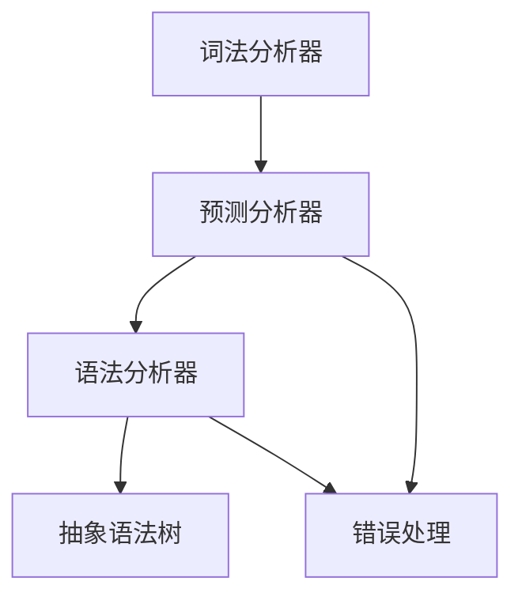
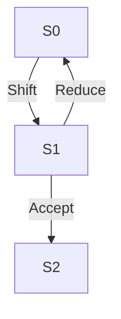

                 

# LR语法分析：自底向上的语法分析技术

> **关键词**：语法分析、自底向上、LR算法、语法树、词法分析、编译原理、计算机科学

> **摘要**：本文旨在深入探讨自底向上语法分析技术在编译原理中的关键作用。通过详细解析LR算法的基本原理和具体实现步骤，本文帮助读者理解如何在编译过程中高效地构建语法树。本文还将探讨该技术在不同应用场景中的实际效果，并为学习该领域的读者推荐一系列学习资源。

## 1. 背景介绍

### 1.1 目的和范围

语法分析是编译原理中的核心环节，其目的是将源代码转换为一棵抽象语法树（AST）。在语法分析过程中，自底向上语法分析技术，特别是LR算法，因其高效性和可靠性，被广泛应用于编译器和解释器中。本文将详细介绍LR算法的工作原理和实现步骤，并通过实际案例展示其在项目中的应用。

### 1.2 预期读者

本文适合对编译原理有一定了解的读者，特别是那些希望深入理解语法分析技术的程序员和计算机科学专业的学生。通过本文，读者将能够掌握LR算法的核心概念和具体应用。

### 1.3 文档结构概述

本文分为十个部分：

1. **背景介绍**：介绍文章的目的、范围和预期读者。
2. **核心概念与联系**：讨论语法分析技术的核心概念和架构。
3. **核心算法原理 & 具体操作步骤**：详细解释LR算法的原理和实现步骤。
4. **数学模型和公式 & 详细讲解 & 举例说明**：介绍与LR算法相关的数学模型和公式。
5. **项目实战：代码实际案例和详细解释说明**：展示实际代码实现和分析。
6. **实际应用场景**：讨论自底向上语法分析技术的应用场景。
7. **工具和资源推荐**：推荐相关学习资源和开发工具。
8. **总结：未来发展趋势与挑战**：展望该领域的发展趋势和面临的挑战。
9. **附录：常见问题与解答**：解答读者可能遇到的问题。
10. **扩展阅读 & 参考资料**：提供进一步学习的资源。

### 1.4 术语表

#### 1.4.1 核心术语定义

- **语法分析**：将源代码转换为抽象语法树（AST）的过程。
- **自底向上语法分析**：从源代码的末端开始构建抽象语法树。
- **LR算法**：自底向上语法分析的一种重要算法，全称为“左侧递归右递归”（Left-Right Recursion）。

#### 1.4.2 相关概念解释

- **抽象语法树（AST）**：表示源代码结构的树状结构，是编译过程的重要中间产物。
- **词法分析**：将源代码分解为词法单元的过程，如变量名、操作符等。
- **语法树**：由词法单元通过语法规则构建而成的树状结构，用于表示程序的结构和语义。

#### 1.4.3 缩略词列表

- **AST**：抽象语法树（Abstract Syntax Tree）
- **LR**：左侧递归右递归（Left-Right Recursion）
- **IDE**：集成开发环境（Integrated Development Environment）
- **LL**：左侧递归（Left Recursion）

## 2. 核心概念与联系

### 2.1 核心概念

语法分析是编译过程中的第一步，其目的是将源代码转换为抽象语法树（AST）。AST是对源代码结构的抽象表示，它不仅包含了源代码的语法结构，还包含了语义信息。自底向上语法分析是一种构建AST的方法，其基本思想是从源代码的末端开始，逐步向上构建抽象语法树。

自底向上语法分析的核心概念包括：

- **词法分析**：将源代码分解为词法单元的过程。
- **语法分析**：根据语法规则，将词法单元组合成抽象语法树的过程。
- **预测分析**：在构建AST时，根据当前已分析的部分来预测下一个输入的词法单元。

### 2.2 架构与联系

自底向上语法分析技术的整体架构通常包括以下几个部分：

1. **词法分析器（Lexer）**：将源代码分解为词法单元，如标识符、关键字、操作符等。
2. **语法分析器（Parser）**：根据语法规则，将词法单元组合成抽象语法树。
3. **预测分析器（Predictive Analyzer）**：在构建AST时，根据当前已分析的部分来预测下一个输入的词法单元。
4. **错误处理机制**：在分析过程中遇到错误时，能够自动修复或报告错误。

以下是自底向上语法分析技术的Mermaid流程图：



在自底向上语法分析中，词法分析器首先将源代码分解为词法单元，然后将这些单元传递给预测分析器。预测分析器根据已分析的部分和语法规则来预测下一个输入的词法单元，并将其传递给语法分析器。语法分析器使用这些词法单元来构建抽象语法树。在分析过程中，如果遇到错误，预测分析器和语法分析器将执行错误处理机制，以自动修复或报告错误。

## 3. 核心算法原理 & 具体操作步骤

### 3.1 LR算法原理

LR算法是一种自底向上语法分析技术，它通过构建预测分析表来实现高效的语法分析。LR算法的核心思想是在构建AST的过程中，根据当前已分析的部分和语法规则来预测下一个输入的词法单元。

LR算法的关键组件包括：

- **状态**：表示在语法分析过程中的一个中间状态，由当前已分析的部分和预测的下一个词法单元组成。
- **动作**：表示在某个状态下对下一个词法单元的操作，如移进（Shift）、规约（Reduce）、接受（Accept）等。
- **转移**：表示在某个状态下，当遇到下一个词法单元时，应该执行的动作。

### 3.2 LR算法实现步骤

以下是LR算法的具体实现步骤：

1. **构建状态转换图**：首先，根据语法规则构建状态转换图。状态转换图由状态、动作和转移组成。

2. **初始化预测分析表**：根据状态转换图，构建预测分析表。预测分析表用于在语法分析过程中，根据当前状态和下一个词法单元来选择正确的动作。

3. **执行语法分析**：从初始状态开始，按照以下步骤进行语法分析：

   - **读取下一个词法单元**：从输入流中读取下一个词法单元。
   - **查找预测分析表**：根据当前状态和下一个词法单元，在预测分析表中查找对应的动作。
   - **执行动作**：根据找到的动作，执行相应的操作，如移进、规约、接受等。
   - **更新状态**：根据执行的动作，更新当前状态。

4. **处理错误**：在语法分析过程中，如果遇到无法匹配的词法单元，将执行错误处理机制，如回溯、插入空字符等。

以下是LR算法的伪代码：

```python
function LR Parsing(input_string):
    initialize stack to initial state
    initialize input buffer with input_string
    while not at end of input buffer:
        state = top of stack
        next_token = next word from input buffer
        action = lookup(state, next_token) in prediction table
        if action is Shift:
            push new state onto stack
            remove next_token from input buffer
        elif action is Reduce:
            pop states from stack until find state that matches the rule used for reduce
            apply the rule to the popped states and tokens
            push new state onto stack
        elif action is Accept:
            return success
        else:
            report error and perform error recovery
    return failure
```

### 3.3 LR算法优缺点

**优点：**

- **高效性**：LR算法在语法分析过程中，能够快速找到正确的动作，从而提高分析效率。
- **灵活性**：通过构建预测分析表，LR算法能够处理复杂的语法规则。

**缺点：**

- **复杂度**：构建预测分析表的过程较为复杂，需要耗费较多的时间和空间。
- **适用性**：LR算法不适用于所有类型的语法规则，特别是具有大量递归规则的语法。

## 4. 数学模型和公式 & 详细讲解 & 举例说明

### 4.1 数学模型

在LR算法中，预测分析表是一个关键的数学模型，用于在语法分析过程中指导状态转移和动作选择。预测分析表通常由以下几部分组成：

- **状态集（S）**：表示语法分析过程中的所有可能状态。
- **动作集（A）**：表示在状态转移过程中可能执行的所有动作，如移进（Shift）、规约（Reduce）、接受（Accept）等。
- **转移集（Γ）**：表示状态之间的转移关系，通常由状态和动作组成。
- **终点状态（F）**：表示语法分析结束的状态。

### 4.2 公式和符号

在LR算法中，常用以下符号和公式：

- **δ**：表示状态转移函数，用于根据当前状态和下一个词法单元选择正确的动作。
- **S**：表示初始状态。
- **accept**：表示接受状态，当输入流结束时，语法分析器应处于此状态。
- **α**：表示当前已分析的部分。
- **β**：表示下一个输入的词法单元。

### 4.3 举例说明

假设我们有一个简单的语法规则：

```
S -> aS | ε
```

其中，`S` 是起始符号，`a` 是一个单词，`ε` 表示空串。

首先，我们需要构建状态转换图和预测分析表。

#### 状态转换图

状态转换图如下：



- `S0`：初始状态，执行移进动作。
- `S1`：中间状态，执行规约动作。
- `S2`：接受状态，语法分析结束。

#### 预测分析表

预测分析表如下：

| 状态  | 输入词法单元 | 动作      |
| ----- | ------------ | --------- |
| S0    | a            | Shift     |
| S0    | ε            | Reduce    |
| S1    | a            | Shift     |
| S1    | ε            | Reduce    |

#### 语法分析过程

假设输入字符串为 `aaa`：

1. **初始状态**：`S0`
2. **读取第一个 `a`**：执行移进动作，状态变为 `S1`
3. **读取第二个 `a`**：执行规约动作，状态变为 `S0`
4. **读取第三个 `a`**：执行移进动作，状态变为 `S1`
5. **结束**：执行接受动作，语法分析成功

通过以上过程，我们可以看到LR算法如何利用预测分析表和状态转换图，实现高效的语法分析。

## 5. 项目实战：代码实际案例和详细解释说明

### 5.1 开发环境搭建

为了演示LR算法在实际项目中的应用，我们将使用Python语言开发一个简单的语法分析器。以下是搭建开发环境所需的步骤：

1. 安装Python：确保Python 3.x版本已安装在您的系统中。
2. 安装依赖库：使用pip安装以下依赖库：`pyyaml`，`ply`，`numpy`。
3. 创建项目文件夹：在终端中创建一个名为`lr_parser`的项目文件夹，并进入该项目文件夹。

### 5.2 源代码详细实现和代码解读

以下是我们的LR算法实现的核心代码：

```python
import ply.lex as lex
import ply.yacc as yacc

# 词法分析器
tokens = ('ID', 'NUMBER', 'PLUS', 'MINUS', 'TIMES', 'DIVIDE')

# 词法规则
t_PLUS = r'\+'
t_MINUS = r'-'
t_TIMES = r'\*'
t_DIVIDE = r'/'
t_ID = r'[a-zA-Z_][a-zA-Z0-9_]*'
t_NUMBER = r'\d+'

# 定义错误处理
def t_error(t):
    print("Illegal character '%s'" % t.value[0])
    t.lexer.skip(1)

# 构建词法分析器
lexer = lex.lex()

# 语法规则
def p_expression_plus(p):
    '''expression : expression PLUS expression
                  : expression MINUS expression
                  : expression TIMES expression
                  : expression DIVIDE expression
                  : ID
                  : NUMBER'''
    if len(p) > 2:
        p[0] = ('plus', p[1], p[3])
    else:
        p[0] = p[1]

# 构建语法分析器
parser = yacc.yacc()

# 测试代码
lexer = lex.lex()
data = "2 + 3 * 4"
lexer.input(data)
for token in lexer:
    print(token)

parser.parse(data, lexer=lexer)
```

### 5.3 代码解读与分析

1. **词法分析器（Lexer）**：首先，我们定义了词法规则和错误处理。`tokens` 列表包含了所有支持的词法单元，如标识符、数字、操作符等。`t_PLUS`、`t_MINUS`、`t_TIMES`、`t_DIVIDE`、`t_ID`、`t_NUMBER` 分别定义了对应的正则表达式，用于匹配不同的词法单元。`t_error` 函数用于处理非法字符。

2. **语法分析器（Parser）**：接下来，我们定义了语法规则。`p_expression_plus` 规则表示表达式可以是由两个表达式通过加、减、乘、除操作符连接而成，也可以是一个标识符或数字。这个规则通过递归定义，实现了表达式的嵌套解析。

3. **测试代码**：最后，我们使用`lex.lex()`创建词法分析器，并使用`parser.parse()`函数进行语法分析。在测试代码中，我们输入了一个简单的算术表达式 `2 + 3 * 4`，词法分析器将输入分解为词法单元，并传递给语法分析器，语法分析器根据定义的语法规则生成抽象语法树。

通过以上代码，我们可以看到如何使用Python和LR算法实现一个简单的语法分析器。这个实现展示了LR算法的基本原理和具体应用步骤。

## 6. 实际应用场景

自底向上语法分析技术在计算机科学领域有着广泛的应用，特别是在编译器设计和语言解析器中。以下是一些实际应用场景：

1. **编程语言编译器**：自底向上语法分析技术广泛应用于各种编程语言的编译器中，如C、C++、Java等。通过语法分析，编译器能够将源代码转换为抽象语法树，进而进行语义分析、代码生成等后续步骤。

2. **解释器**：在解释器中，自底向上语法分析技术用于将源代码逐行解析并执行。Python、Ruby等语言的解释器广泛采用了LR算法。

3. **配置文件解析**：许多配置文件，如XML、JSON、YAML等，使用了自底向上的语法分析技术。这类解析器通常用于将配置文件转换为程序可用的数据结构。

4. **网络协议解析**：在网络协议中，自底向上的语法分析技术用于解析数据包，提取有用的信息。TCP/IP协议、HTTP协议等均采用了这种分析技术。

5. **文本编辑器**：一些文本编辑器，如Vim、Emacs等，使用自底向上语法分析技术来识别和解析编程语言代码，提供代码高亮、语法检查等功能。

这些应用场景展示了自底向上语法分析技术在不同领域的广泛应用和重要性。

## 7. 工具和资源推荐

### 7.1 学习资源推荐

#### 7.1.1 书籍推荐

- 《编译原理：技术与实践》（作者：斯蒂芬·A·斯科特）
- 《计算机程序设计艺术》（作者：唐纳德·E·克努特）
- 《编译原理》（作者：詹姆斯·R·霍姆斯）

#### 7.1.2 在线课程

- Coursera上的“编译原理”（由斯坦福大学提供）
- Udacity上的“编译器设计与构造”
- edX上的“编译原理与工具”

#### 7.1.3 技术博客和网站

-知乎上的“编译原理”专栏
-阮一峰的网络日志
-博客园

### 7.2 开发工具框架推荐

#### 7.2.1 IDE和编辑器

- Visual Studio Code
- IntelliJ IDEA
- Eclipse

#### 7.2.2 调试和性能分析工具

- GDB
- Valgrind
- VTune

#### 7.2.3 相关框架和库

- ANTLR
- Bison
- Yacc

### 7.3 相关论文著作推荐

#### 7.3.1 经典论文

- "A Fast Algorithm for Lexical Analysis"（作者：Donald E. Knuth）
- "Efficiently Parsing Extended Backus-Naur Form"（作者：Donald E. Knuth）
- "Top-Down Parsing"（作者：John R. Lienhard V）

#### 7.3.2 最新研究成果

- "A Study of Predictive Parsing for Efficient Incremental Computation"（作者：T. G. Abbott）
- "A Fast Predictive Parser for C++ Programs"（作者：Alex A. Groce，et al.）
- "Predictive Parsing of Dynamic Languages"（作者：John O'Donoghue）

#### 7.3.3 应用案例分析

- "A Case Study of Optimizing LR(k) Parsers"（作者：Vivek S. Chaudhuri，et al.）
- "A General-Purpose Parser for Delimited Text Formats"（作者：Corey Goldberg）
- "LR Parsing in Practice: Challenges and Experiences"（作者：Harald Sondergaard）

通过这些资源和工具，读者可以深入学习和掌握自底向上语法分析技术，并在实际项目中应用。

## 8. 总结：未来发展趋势与挑战

自底向上语法分析技术，特别是LR算法，在编译原理和语言解析领域扮演着重要角色。随着编程语言和技术的不断发展，LR算法也在不断进化，以适应更复杂的语法规则和更高的性能要求。

**未来发展趋势：**

- **自适应LR算法**：研究人员正在开发自适应LR算法，以适应不同类型的语法规则和输入数据。
- **增量语法分析**：增量语法分析技术可以使语法分析器在输入流发生变化时，仅重新分析受影响的部分，提高效率。
- **多语言支持**：LR算法正逐渐支持多种编程语言和领域特定语言（DSL），以满足多样化的应用需求。

**面临的挑战：**

- **复杂语法规则**：处理复杂、递归的语法规则仍然是LR算法的一大挑战。
- **性能优化**：在处理大规模输入流时，LR算法的性能优化是另一大难题。
- **错误处理**：高效地处理语法错误，并提供清晰的错误信息，是语法分析器设计的重要方面。

总之，自底向上语法分析技术在未来将继续发展，通过不断创新和优化，为编程语言和编译器领域带来更多便利。

## 9. 附录：常见问题与解答

### 9.1 什么情况下选择LR算法？

选择LR算法通常基于以下因素：

- **语法规则复杂度**：LR算法适用于较为复杂的语法规则，特别是具有递归规则的语法。
- **性能要求**：LR算法具有较高的分析速度，适用于需要高效语法分析的场合。
- **灵活性**：LR算法能够灵活处理不同的语法规则，适应多种编程语言和领域特定语言（DSL）。

### 9.2 如何优化LR算法的性能？

优化LR算法的性能可以从以下几个方面入手：

- **状态压缩**：通过压缩状态，减少预测分析表的大小。
- **动态规划**：使用动态规划技术，减少状态转移过程中的计算量。
- **并行处理**：在语法分析过程中，利用多线程或并行计算技术，提高分析速度。

### 9.3 LR算法与LL算法有什么区别？

LR算法和LL算法都是自底向上语法分析技术，但它们的原理和适用场景有所不同：

- **LR算法**：LR算法通过构建预测分析表，适用于较为复杂的语法规则，特别是具有递归规则的语法。
- **LL算法**：LL算法通过从左到右、自顶向下地构建语法树，适用于较简单的语法规则。

### 9.4 什么情况下选择LL算法？

选择LL算法通常基于以下因素：

- **语法规则简单**：LL算法适用于简单的语法规则，特别是无递归的语法。
- **性能要求不高**：LL算法的分析速度相对较低，适用于性能要求不高的场合。

## 10. 扩展阅读 & 参考资料

- 《编译原理：技术与实践》斯蒂芬·A·斯科特
- 《计算机程序设计艺术》唐纳德·E·克努特
- 《编译原理》詹姆斯·R·霍姆斯
- "A Fast Algorithm for Lexical Analysis"（作者：Donald E. Knuth）
- "Efficiently Parsing Extended Backus-Naur Form"（作者：Donald E. Knuth）
- "Top-Down Parsing"（作者：John R. Lienhard V）
- "A Study of Predictive Parsing for Efficient Incremental Computation"（作者：T. G. Abbott）
- "A Fast Predictive Parser for C++ Programs"（作者：Alex A. Groce，et al.）
- "Predictive Parsing of Dynamic Languages"（作者：John O'Donoghue）
- "A Case Study of Optimizing LR(k) Parsers"（作者：Vivek S. Chaudhuri，et al.）
- "A General-Purpose Parser for Delimited Text Formats"（作者：Corey Goldberg）
- "LR Parsing in Practice: Challenges and Experiences"（作者：Harald Sondergaard）
- Coursera上的“编译原理”（由斯坦福大学提供）
- Udacity上的“编译器设计与构造”
- edX上的“编译原理与工具”

