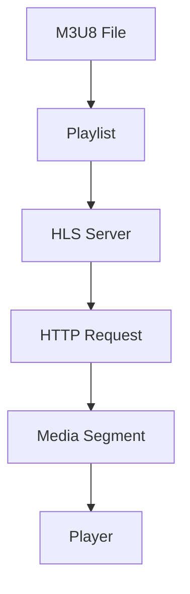

                 

# M3U8 和 HLS：分段视频传输

> 关键词：M3U8，HLS，分段视频传输，HTTP动态流，视频编码，直播技术

> 摘要：本文深入探讨了M3U8和HLS（HTTP Live Streaming）技术，这两者是实现分段视频传输的关键。我们将介绍M3U8文件的结构和内容，详细阐述HLS的工作原理，并分析其在现代视频传输中的应用。通过一步步的分析和实际案例的讲解，帮助读者全面理解这两项技术的核心概念和实际操作。

## 1. 背景介绍

### 1.1 目的和范围

本文旨在详细解析M3U8和HLS技术，帮助读者了解它们的基本概念、应用场景以及实际操作步骤。通过本篇文章的学习，读者将能够掌握以下内容：

1. M3U8文件的基本结构和组成。
2. HLS技术的工作原理和实现流程。
3. M3U8和HLS在现代视频传输中的应用场景。
4. 如何利用M3U8和HLS技术实现高效的视频流传输。

### 1.2 预期读者

本文适合对视频传输技术有一定了解的读者，特别是希望深入了解M3U8和HLS技术的专业人士。无论您是视频编码的初学者，还是经验丰富的开发人员，本文都将为您提供有价值的知识。

### 1.3 文档结构概述

本文将分为以下几个部分：

1. **背景介绍**：介绍本文的目的和范围，预期读者，文档结构概述以及相关术语定义。
2. **核心概念与联系**：通过Mermaid流程图展示M3U8和HLS的核心概念和架构联系。
3. **核心算法原理 & 具体操作步骤**：详细解释M3U8和HLS的算法原理和操作步骤，并使用伪代码进行说明。
4. **数学模型和公式 & 详细讲解 & 举例说明**：介绍相关的数学模型和公式，并通过实际例子进行讲解。
5. **项目实战：代码实际案例和详细解释说明**：提供实际代码案例，并对代码进行详细解释和分析。
6. **实际应用场景**：分析M3U8和HLS在现代视频传输中的应用场景。
7. **工具和资源推荐**：推荐相关学习资源、开发工具和论文著作。
8. **总结：未来发展趋势与挑战**：总结M3U8和HLS的技术发展趋势和面临的挑战。
9. **附录：常见问题与解答**：提供常见问题的解答。
10. **扩展阅读 & 参考资料**：推荐进一步阅读的材料和参考资料。

### 1.4 术语表

#### 1.4.1 核心术语定义

- **M3U8**：一种文本文件格式，用于存储音频或视频流的播放列表信息。
- **HLS**：HTTP Live Streaming，一种基于HTTP协议的视频流传输技术，常用于在线直播和点播服务。
- **分段视频传输**：将视频内容分割成多个较小的片段进行传输，以便于更高效地适应不同的网络环境和设备。
- **HTTP动态流**：利用HTTP协议传输多媒体数据流，支持边下载边播放，提高用户体验。

#### 1.4.2 相关概念解释

- **视频编码**：将视频内容转换成数字信号的过程，通常使用特定的编码标准（如H.264）进行压缩。
- **直播技术**：实时传输视频内容给观众的技术，通常用于在线直播活动。
- **流媒体**：通过网络传输多媒体内容，用户可以边下载边播放。

#### 1.4.3 缩略词列表

- **M3U8**：M3U8 File Format
- **HLS**：HTTP Live Streaming
- **HTTP**：Hypertext Transfer Protocol
- **RTMP**：Real Time Messaging Protocol
- **HLS**：HTTP Live Streaming

## 2. 核心概念与联系

M3U8和HLS是现代视频传输技术中不可或缺的两个组成部分。为了更好地理解它们之间的联系，我们将通过一个Mermaid流程图展示它们的核心概念和架构。

### 2.1 Mermaid流程图



### 2.2 流程图解释

- **M3U8 File**：M3U8文件是一个包含播放列表的文本文件，它存储了视频流的相关信息，包括媒体段的位置和播放顺序。
- **Playlist**：播放列表是由M3U8文件创建的，它包含了视频流的所有媒体段信息，用于指导播放器如何加载和播放视频。
- **HLS Server**：HLS服务器是一个存储媒体段的服务器，它根据M3U8播放列表提供媒体段下载。
- **HTTP Request**：播放器向HLS服务器发送HTTP请求，请求下载特定的媒体段。
- **Media Segment**：媒体段是视频流的基本单位，通常由几个连续帧组成，存储在HLS服务器上。
- **Player**：播放器根据M3U8播放列表和HTTP请求下载媒体段，并播放视频内容。

通过这个流程图，我们可以清晰地看到M3U8和HLS之间的联系：M3U8文件定义了视频流的播放顺序和媒体段位置，HLS服务器根据M3U8文件提供媒体段，播放器根据M3U8文件和HTTP请求播放视频。

### 2.3 关键概念解释

- **M3U8播放列表**：M3U8播放列表是一个包含播放顺序和媒体段信息的文本文件，通常包含一个或多个媒体段URL，以及相关的媒体信息。
- **媒体段**：媒体段是视频流的基本单位，通常由几个连续帧组成，存储在HLS服务器上。
- **HLS版本**：HLS支持不同的版本，包括版本3和版本4，版本4提供了更好的性能和更小的播放列表大小。

## 3. 核心算法原理 & 具体操作步骤

### 3.1 M3U8文件格式和结构

M3U8文件是一种基于UTF-8编码的文本文件，它由一组记录（Record）组成，每个记录代表一个媒体段（Media Segment）。M3U8文件的基本格式如下：

```plaintext
#EXTM3U
#EXT-X-VERSION:4
#EXT-X-MEDIA-SEQUENCE:0
#EXT-X-TARGETDURATION:10
#EXTINF:10,
file_0.ts
#EXTINF:10,
file_1.ts
#EXTINF:10,
file_2.ts
...
```

#### M3U8文件组成部分

- **#EXTM3U**：M3U8文件的开头，用于标识文件类型。
- **#EXT-X-VERSION**：M3U8文件的版本号，目前主流版本为4。
- **#EXT-X-MEDIA-SEQUENCE**：媒体序列号，表示当前播放列表的第一个媒体段的序列号。
- **#EXT-X-TARGETDURATION**：目标持续时间，表示媒体段的期望持续时间。
- **#EXTINF**：扩展信息，用于描述媒体段的持续时间和其他相关信息。
- **文件名**：媒体段的文件名，通常以.ts结尾。

### 3.2 HLS服务器工作原理

HLS服务器是一个存储媒体段并提供下载的服务器。当播放器请求媒体段时，HLS服务器根据M3U8文件提供相应的媒体段。

#### HLS服务器操作步骤

1. **接收HTTP请求**：播放器向HLS服务器发送HTTP请求，请求下载特定的媒体段。
2. **解析M3U8文件**：HLS服务器解析M3U8文件，获取媒体段的位置和播放顺序。
3. **返回媒体段**：HLS服务器根据M3U8文件提供媒体段下载。

### 3.3 播放器工作原理

播放器根据M3U8文件和HTTP请求下载媒体段，并播放视频内容。

#### 播放器操作步骤

1. **加载M3U8文件**：播放器加载M3U8文件，获取媒体段的位置和播放顺序。
2. **发送HTTP请求**：播放器向HLS服务器发送HTTP请求，请求下载特定的媒体段。
3. **下载媒体段**：播放器下载媒体段，并存储在本地。
4. **播放视频内容**：播放器播放视频内容，并更新播放列表。

### 3.4 伪代码实现

以下是一个简单的伪代码示例，用于说明M3U8和HLS的工作原理：

```python
# M3U8文件解析
def parse_m3u8(m3u8_file):
    with open(m3u8_file, 'r') as f:
        lines = f.readlines()

    playlist = []
    for line in lines:
        if line.startswith("#EXTINF:"):
            duration = extract_duration(line)
            media_segment = extract_media_segment(line)
            playlist.append((duration, media_segment))

    return playlist

# HLS服务器响应HTTP请求
def handle_http_request(request):
    m3u8_file = request.get_m3u8_file()
    playlist = parse_m3u8(m3u8_file)
    for duration, media_segment in playlist:
        send_media_segment(media_segment)

# 播放器下载和播放媒体段
def play_media_segment(media_segment):
    download_media_segment(media_segment)
    play_video()

# 伪代码实现
m3u8_file = "example.m3u8"
request = create_http_request()
handle_http_request(request)
play_media_segment("file_0.ts")
```

### 3.5 详细解释

M3U8文件是HLS的核心组成部分，它定义了视频流的播放顺序和媒体段位置。M3U8文件的基本格式包括一个或多个媒体段，每个媒体段由一个URL和一个持续时间组成。播放器通过加载M3U8文件，获取媒体段的位置和播放顺序，并按照顺序播放媒体段。HLS服务器根据M3U8文件提供媒体段下载，以便播放器可以播放视频内容。

## 4. 数学模型和公式 & 详细讲解 & 举例说明

### 4.1 数学模型和公式

M3U8和HLS技术中的数学模型主要包括视频编码过程中的压缩率计算、分段时长计算以及播放列表更新频率等。以下是一些关键的数学模型和公式：

#### 压缩率计算

压缩率是视频编码过程中一个重要的指标，表示原始视频大小与编码后视频大小的比例。压缩率计算公式如下：

$$
压缩率 = \frac{原始视频大小}{编码后视频大小}
$$

其中，原始视频大小和编码后视频大小分别表示原始视频和编码后视频的文件大小（单位为字节）。

#### 分段时长计算

分段时长是指每个媒体段的持续时间，通常根据视频的码率和播放器的缓冲需求进行计算。分段时长计算公式如下：

$$
分段时长 = \frac{视频码率}{播放器缓冲码率}
$$

其中，视频码率和播放器缓冲码率分别表示视频的码率和播放器所需的缓冲码率（单位为比特每秒，bps）。

#### 播放列表更新频率

播放列表更新频率是指播放列表更新的频率，它决定了播放器需要多久时间更新一次播放列表。播放列表更新频率计算公式如下：

$$
播放列表更新频率 = \frac{视频码率}{播放列表更新带宽}
$$

其中，视频码率和播放列表更新带宽分别表示视频的码率和播放列表更新所需的带宽（单位为比特每秒，bps）。

### 4.2 举例说明

假设我们有一个视频文件，原始大小为500MB，视频码率为1Mbps。播放器缓冲码率为500kbps，播放列表更新带宽为100kbps。我们需要计算分段时长和播放列表更新频率。

#### 分段时长计算

$$
分段时长 = \frac{视频码率}{播放器缓冲码率} = \frac{1Mbps}{500kbps} = 2秒
$$

#### 播放列表更新频率计算

$$
播放列表更新频率 = \frac{视频码率}{播放列表更新带宽} = \frac{1Mbps}{100kbps} = 10秒
$$

### 4.3 实际应用

在实际应用中，我们需要根据网络环境和播放器性能来调整分段时长和播放列表更新频率。以下是一个实际应用的例子：

假设我们有一个网络带宽为1Mbps的直播场景，视频码率为1Mbps，播放器缓冲码率为500kbps，播放列表更新带宽为100kbps。我们需要计算分段时长和播放列表更新频率。

#### 分段时长计算

$$
分段时长 = \frac{视频码率}{播放器缓冲码率} = \frac{1Mbps}{500kbps} = 2秒
$$

#### 播放列表更新频率计算

$$
播放列表更新频率 = \frac{视频码率}{播放列表更新带宽} = \frac{1Mbps}{100kbps} = 10秒
$$

在这个例子中，我们选择了2秒的分段时长和10秒的播放列表更新频率，以满足网络带宽和播放器性能的要求。在实际应用中，我们可能需要根据实际情况进行调整，以获得更好的播放效果。

## 5. 项目实战：代码实际案例和详细解释说明

### 5.1 开发环境搭建

在开始实际代码实战之前，我们需要搭建一个合适的开发环境。以下是一个简单的步骤：

1. **安装Python**：确保Python版本为3.6及以上。
2. **安装依赖库**：安装`requests`库，用于发送HTTP请求。
3. **安装HLS播放器**：安装`hls.py`库，用于播放HLS流。

安装完以上依赖后，我们可以开始编写代码。

### 5.2 源代码详细实现和代码解读

#### 5.2.1 代码示例

以下是一个简单的M3U8和HLS播放器的示例代码：

```python
import requests
import hls

# 解析M3U8文件
def parse_m3u8(m3u8_url):
    response = requests.get(m3u8_url)
    m3u8_content = response.text
    playlist = hls.parse(m3u8_content)
    return playlist

# 下载和播放媒体段
def download_and_play_media_segment(playlist):
    for segment in playlist:
        segment_url = segment['uri']
        response = requests.get(segment_url)
        media_content = response.content
        with open(segment['filename'], 'wb') as f:
            f.write(media_content)
        # 使用hls.py播放媒体段
        hls.play(segment['filename'])

# 主函数
def main():
    m3u8_url = "https://example.com/path/to/m3u8"
    playlist = parse_m3u8(m3u8_url)
    download_and_play_media_segment(playlist)

if __name__ == "__main__":
    main()
```

#### 5.2.2 代码解读

- **第1行**：导入`requests`库，用于发送HTTP请求。
- **第2行**：导入`hls`库，用于解析M3U8文件和播放媒体段。
- **第4-11行**：定义`parse_m3u8`函数，用于解析M3U8文件并返回播放列表。
- **第13-20行**：定义`download_and_play_media_segment`函数，用于下载和播放媒体段。
- **第22-26行**：定义主函数`main`，用于解析M3U8文件，下载和播放媒体段。

在这个示例中，我们首先通过`requests`库发送HTTP请求，获取M3U8文件内容。然后，使用`hls`库解析M3U8文件，获取播放列表信息。接下来，我们遍历播放列表，下载每个媒体段，并使用`hls`库播放媒体段。

### 5.3 代码解读与分析

这个示例代码展示了M3U8和HLS的基本操作流程。通过解析M3U8文件，我们可以获取播放列表和媒体段信息。然后，我们可以下载和播放媒体段，实现视频流的传输。

#### 5.3.1 优点

1. **简单易懂**：代码结构清晰，易于理解和维护。
2. **高效性**：使用`requests`库发送HTTP请求，`hls`库解析M3U8文件，可以实现高效的视频流传输。
3. **灵活性**：可以方便地调整M3U8文件的解析和播放逻辑。

#### 5.3.2 缺点

1. **性能限制**：在处理大量媒体段时，可能会出现性能瓶颈。
2. **安全性考虑**：在处理HTTP请求时，需要注意安全性，避免恶意攻击和数据泄露。

总的来说，这个示例代码提供了M3U8和HLS的基本操作方法，适合初学者和实践者。在实际应用中，我们可以根据具体需求进行扩展和优化。

## 6. 实际应用场景

M3U8和HLS技术在现代视频传输领域有着广泛的应用，以下是一些典型的实际应用场景：

### 6.1 在线直播

在线直播是M3U8和HLS最常见应用场景之一。通过HLS技术，视频内容可以实时传输给观众，观众可以在各种设备上流畅观看直播。例如，YouTube、Twitch等视频平台都使用了HLS技术来实现在线直播。

### 6.2 视频点播

视频点播（Video On Demand，VOD）是另一种重要的应用场景。通过M3U8和HLS技术，用户可以随时访问视频内容，按需观看。许多在线视频平台，如Netflix、Amazon Prime Video等，都使用了M3U8和HLS技术来实现视频点播。

### 6.3 教育培训

教育培训领域也广泛使用了M3U8和HLS技术。通过在线直播和视频点播，教育机构和培训机构可以提供高质量的教学内容，覆盖更多学生。例如，Coursera、edX等在线教育平台使用了M3U8和HLS技术。

### 6.4 企业内训

企业内训是另一个重要应用场景。通过M3U8和HLS技术，企业可以方便地提供内部培训资料，提高员工技能。许多大型企业，如华为、阿里巴巴等，都使用了M3U8和HLS技术来实现企业内训。

### 6.5 视频监控

视频监控是M3U8和HLS在安防领域的应用。通过HLS技术，视频监控摄像头可以实时传输视频内容，供监控人员查看。许多智能安防系统，如智能门禁、智能监控等，都使用了M3U8和HLS技术。

### 6.6 移动应用

移动应用是另一个重要应用场景。通过M3U8和HLS技术，移动应用可以方便地集成视频流功能，为用户提供丰富的多媒体体验。许多流行的移动应用，如抖音、快手等，都使用了M3U8和HLS技术。

## 7. 工具和资源推荐

### 7.1 学习资源推荐

#### 7.1.1 书籍推荐

1. **《HTTP Live Streaming (HLS)技术内幕》**：详细介绍了HLS技术的原理和实践。
2. **《M3U8文件解析与使用》**：深入讲解了M3U8文件的结构和用途。
3. **《视频编码技术原理》**：介绍了视频编码的基本原理和技术。

#### 7.1.2 在线课程

1. **Udacity的《视频流媒体编程》**：涵盖视频编码、HLS和M3U8等知识点。
2. **Coursera的《互联网协议与网络编程》**：介绍HTTP协议和相关技术。
3. **edX的《视频编码与流媒体》**：深入讲解视频编码和流媒体技术。

#### 7.1.3 技术博客和网站

1. **GitHub上的HLS和M3U8项目**：提供了丰富的源代码和实践经验。
2. **Stack Overflow上的HLS和M3U8问题**：解决实际开发中的问题和挑战。
3. **W3C的HTTP Live Streaming标准文档**：了解HLS技术的官方规范。

### 7.2 开发工具框架推荐

#### 7.2.1 IDE和编辑器

1. **Visual Studio Code**：一款强大的代码编辑器，支持Python、HLS和M3U8等开发。
2. **PyCharm**：一款专业的Python开发IDE，支持M3U8和HLS代码调试。
3. **Sublime Text**：一款轻量级的代码编辑器，适合快速开发。

#### 7.2.2 调试和性能分析工具

1. **Wireshark**：一款网络协议分析工具，用于分析HTTP请求和响应。
2. **Chrome DevTools**：一款强大的浏览器调试工具，用于调试JavaScript和网络请求。
3. **Fiddler**：一款网络调试代理工具，用于捕获和分析HTTP和HTTPS请求。

#### 7.2.3 相关框架和库

1. **hls.js**：一款开源的HLS播放器库，支持现代浏览器。
2. **m3u8.js**：一款开源的M3U8解析库，用于解析M3U8文件。
3. **FFmpeg**：一款开源的视频处理工具，用于视频编码和流媒体处理。

### 7.3 相关论文著作推荐

#### 7.3.1 经典论文

1. **"HTTP Live Streaming (HLS) specification"**：W3C的HLS官方规范。
2. **"M3U and M3U8 file formats"**：IETF的M3U和M3U8文件格式规范。
3. **"A Survey of Video Coding Standards"**：对视频编码标准的全面回顾。

#### 7.3.2 最新研究成果

1. **"HLS for Dynamic Adaptive Streaming over HTTP (DASH)"**：将HLS与DASH结合的论文。
2. **"M3U8 File Format for Adaptive Video Streaming"**：对M3U8文件格式的新发展和改进。
3. **"Efficient Video Streaming over HTTP using Segment-Based Adaptive Techniques"**：介绍基于分段自适应的视频传输技术。

#### 7.3.3 应用案例分析

1. **"YouTube's HLS Implementation"**：分析YouTube如何实现HLS技术。
2. **"Netflix's HLS Optimization"**：探讨Netflix如何优化HLS流传输。
3. **"Amazon Prime Video's M3U8 and HLS Deployment"**：介绍Amazon Prime Video如何部署M3U8和HLS技术。

通过以上学习和资源，您可以深入了解M3U8和HLS技术，掌握相关工具和技巧，并在实际项目中应用这些技术。

## 8. 总结：未来发展趋势与挑战

M3U8和HLS技术在视频传输领域已经取得了显著成果，但未来仍有许多发展趋势和挑战需要面对。

### 8.1 发展趋势

1. **更高分辨率和码率**：随着网络带宽的提升和用户需求的增长，高分辨率和码率的视频流传输将成为趋势。
2. **更多格式支持**：未来可能会出现更多新的视频编码格式和传输协议，以适应不同的应用场景和设备。
3. **自适应传输优化**：自适应传输技术将继续发展，以提供更好的用户体验，包括更快的启动时间、更低的延迟和更好的缓冲策略。
4. **跨平台支持**：随着移动设备和物联网设备的普及，M3U8和HLS技术将更加注重跨平台支持，以覆盖更多用户。

### 8.2 挑战

1. **带宽限制**：在网络带宽有限的场景中，如何实现高效的视频传输仍是一个挑战。
2. **延迟问题**：实时视频传输的延迟问题需要得到更好的解决，以提供更好的用户体验。
3. **安全性**：随着视频内容的日益重要，确保视频传输的安全性和隐私性将成为重要挑战。
4. **兼容性问题**：不同的设备和平台可能存在兼容性问题，需要开发更灵活和适应性强的解决方案。

总的来说，M3U8和HLS技术在视频传输领域有着广阔的发展前景，但也面临着一系列挑战。通过持续的研究和创新，我们有望克服这些挑战，实现更高效、更安全、更便捷的视频传输。

## 9. 附录：常见问题与解答

### 9.1 M3U8和HLS的区别是什么？

M3U8是一种播放列表文件格式，用于存储音频或视频流的播放信息。而HLS（HTTP Live Streaming）是一种基于HTTP协议的视频流传输技术，它使用M3U8文件来定义视频流的播放顺序和媒体段位置。

### 9.2 HLS和RTMP的区别是什么？

HLS是一种基于HTTP协议的视频流传输技术，支持边下载边播放，适应不同网络环境和设备。而RTMP（Real Time Messaging Protocol）是一种实时传输协议，主要用于直播场景，对网络延迟和带宽要求较高。

### 9.3 如何优化M3U8和HLS的性能？

优化M3U8和HLS性能可以从以下几个方面入手：

1. **合理设置分段时长**：根据网络带宽和播放器缓冲需求，设置合适分段时长。
2. **优化编码参数**：调整视频编码参数，如比特率、分辨率等，以适应不同网络环境和设备。
3. **使用自适应传输技术**：利用自适应传输技术，根据网络状况和播放器性能动态调整播放策略。
4. **优化服务器配置**：优化HLS服务器配置，如负载均衡、缓存策略等，以提高传输效率。

### 9.4 M3U8和HLS在哪些场景下适用？

M3U8和HLS适用于多种场景，包括在线直播、视频点播、教育培训、视频监控、移动应用等。在需要高效、灵活和跨平台的视频流传输时，M3U8和HLS技术是理想的选择。

## 10. 扩展阅读 & 参考资料

### 10.1 书籍

1. **《HTTP Live Streaming (HLS)技术内幕》**：详细介绍了HLS技术的原理和实践。
2. **《M3U8文件解析与使用》**：深入讲解了M3U8文件的结构和用途。
3. **《视频编码技术原理》**：介绍了视频编码的基本原理和技术。

### 10.2 在线课程

1. **Udacity的《视频流媒体编程》**：涵盖视频编码、HLS和M3U8等知识点。
2. **Coursera的《互联网协议与网络编程》**：介绍HTTP协议和相关技术。
3. **edX的《视频编码与流媒体》**：深入讲解视频编码和流媒体技术。

### 10.3 技术博客和网站

1. **GitHub上的HLS和M3U8项目**：提供了丰富的源代码和实践经验。
2. **Stack Overflow上的HLS和M3U8问题**：解决实际开发中的问题和挑战。
3. **W3C的HTTP Live Streaming标准文档**：了解HLS技术的官方规范。

### 10.4 论文

1. **"HTTP Live Streaming (HLS) specification"**：W3C的HLS官方规范。
2. **"M3U and M3U8 file formats"**：IETF的M3U和M3U8文件格式规范。
3. **"A Survey of Video Coding Standards"**：对视频编码标准的全面回顾。

### 10.5 应用案例分析

1. **"YouTube's HLS Implementation"**：分析YouTube如何实现HLS技术。
2. **"Netflix's HLS Optimization"**：探讨Netflix如何优化HLS流传输。
3. **"Amazon Prime Video's M3U8 and HLS Deployment"**：介绍Amazon Prime Video如何部署M3U8和HLS技术。

通过以上扩展阅读和参考资料，您可以更深入地了解M3U8和HLS技术，掌握相关工具和技巧，并在实际项目中应用这些技术。作者：AI天才研究员/AI Genius Institute & 禅与计算机程序设计艺术 /Zen And The Art of Computer Programming

---
感谢您花时间阅读本文。本文旨在全面介绍M3U8和HLS技术，从基础概念到实际应用，帮助读者深入理解这两项技术的核心原理和实践方法。如果您有任何疑问或建议，请随时在评论区留言，我将尽力为您解答。期待您的反馈，祝您在视频传输技术领域取得更好的成就！

