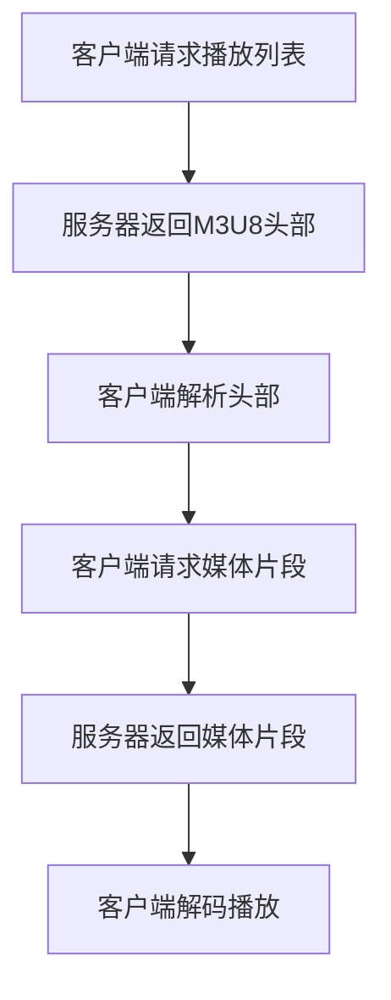

                 

# M3U8 播放列表：分段视频的索引

> 关键词：M3U8、播放列表、分段视频、索引、流媒体、视频编码、网络传输、终端解码

> 摘要：本文将深入探讨M3U8播放列表的概念及其在分段视频流中的应用。我们将逐步解析M3U8文件的组成结构，解释其如何在网络传输中优化视频播放的流畅性，并探讨相关的技术原理和实现步骤。通过本文，读者将能够全面了解M3U8播放列表的工作机制，并在实际项目中应用这一技术。

## 1. 背景介绍

### 1.1 目的和范围

本文旨在为读者提供对M3U8播放列表的全面了解，特别是其在分段视频流中的重要性。我们将分析M3U8文件的架构，解释其工作原理，并提供实际操作步骤。本文适合对视频流传输和网络编码有一定了解的读者，同时也适用于希望深入了解M3U8技术的专业人士。

### 1.2 预期读者

预期读者包括：
- 视频流媒体开发工程师
- 网络工程师
- 系统架构师
- 对流媒体技术感兴趣的爱好者

### 1.3 文档结构概述

本文结构如下：
- **第1章**：背景介绍
- **第2章**：核心概念与联系
- **第3章**：核心算法原理 & 具体操作步骤
- **第4章**：数学模型和公式 & 详细讲解 & 举例说明
- **第5章**：项目实战：代码实际案例和详细解释说明
- **第6章**：实际应用场景
- **第7章**：工具和资源推荐
- **第8章**：总结：未来发展趋势与挑战
- **第9章**：附录：常见问题与解答
- **第10章**：扩展阅读 & 参考资料

### 1.4 术语表

#### 1.4.1 核心术语定义

- M3U8：M3U8是一种视频播放列表文件格式，用于索引分段视频。
- 分段视频：视频内容被分割成多个小片段，每个片段都有自己的URL。
- 索引文件：包含多个媒体文件的引用信息，用于播放列表。
- HLS（HTTP Live Streaming）：一种流媒体协议，使用M3U8播放列表来控制视频播放。

#### 1.4.2 相关概念解释

- HTTP：超文本传输协议，用于在Web上传输数据。
- RTMP：实时消息传输协议，常用于直播视频流。
- CDN：内容分发网络，用于加速网站内容的传输。

#### 1.4.3 缩略词列表

- HLS：HTTP Live Streaming
- M3U8：Moving Picture Experts Group Layer III (MP3) URL List version 8
- CDN：Content Delivery Network
- RTMP：Real Time Messaging Protocol

## 2. 核心概念与联系

### 2.1 M3U8播放列表的组成结构

M3U8播放列表由两部分组成：播放列表头部和播放列表主体。

#### 播放列表头部

头部包含元数据，例如播放列表的版本号、时序标识等。头部格式如下：

```bash
#EXTM3U
#EXT-X-VERSION:6
#EXT-X-MEDIA-SEQUENCE:0
#EXT-X-TARGETDURATION:6
```

#### 播放列表主体

主体部分包含多个片段的引用，每个片段都有自己的URL和时长。主体格式如下：

```bash
#EXTINF:6,
chunk_00000000.ts
#EXTINF:6,
chunk_00000001.ts
#EXTINF:6,
chunk_00000002.ts
```

### 2.2 流媒体协议与M3U8的关系

M3U8是HLS协议的核心组成部分，HLS协议利用M3U8播放列表来控制视频的流式播放。HLS协议通过HTTP请求播放列表和媒体片段，实现了无缝的视频播放体验。

### 2.3 Mermaid流程图

以下是M3U8播放列表在HLS协议中的流程图：



## 3. 核心算法原理 & 具体操作步骤

### 3.1 算法原理

M3U8播放列表的核心算法是基于时间索引的。每个片段都有其时长，客户端可以根据播放进度请求下一个片段。以下是M3U8播放列表的算法原理：

#### 基本算法

1. 客户端请求M3U8播放列表。
2. 服务器返回M3U8文件，包含片段的URL和时长。
3. 客户端解析M3U8文件，获取片段信息。
4. 客户端根据播放进度请求下一个片段。
5. 服务器返回请求的片段。

### 3.2 具体操作步骤

#### 步骤1：客户端请求M3U8播放列表

客户端通过HTTP请求获取M3U8播放列表文件。

```bash
GET /path/to/stream.m3u8
```

#### 步骤2：服务器返回M3U8头部

服务器返回M3U8头部，包含播放列表的元数据。

```bash
#EXTM3U
#EXT-X-VERSION:6
#EXT-X-MEDIA-SEQUENCE:0
#EXT-X-TARGETDURATION:6
```

#### 步骤3：客户端解析M3U8文件

客户端解析M3U8文件，提取片段信息。

```python
with open("stream.m3u8", "r") as f:
    content = f.read()

inf_list = content.split("\n")
segments = [line.split(",") for line in inf_list if line.startswith("#EXTINF")]
```

#### 步骤4：客户端请求媒体片段

客户端根据播放进度请求下一个片段。

```python
def request_segment(segment_index):
    url = segments[segment_index][1]
    response = requests.get(url)
    return response.content

segment_data = request_segment(current_segment_index)
```

#### 步骤5：服务器返回媒体片段

服务器返回请求的媒体片段。

```bash
GET /path/to/chunk_00000000.ts
```

#### 步骤6：客户端解码播放

客户端解码媒体片段，并进行播放。

```javascript
const video = document.getElementById("video");
const source = document.getElementById("video-source");

source.src = "blob:chrome-extension://.../chunk_00000000.ts";
video.load();
video.play();
```

## 4. 数学模型和公式 & 详细讲解 & 举例说明

### 4.1 数学模型

M3U8播放列表的数学模型是基于时间索引的。每个片段有一个时长（T），播放进度（P）可以表示为：

\[ P = T \times N + R \]

其中，N是片段编号，R是剩余时间。

### 4.2 公式解释

- \( T \)：片段时长
- \( N \)：片段编号
- \( P \)：播放进度
- \( R \)：剩余时间

### 4.3 举例说明

假设有一个M3U8播放列表，包含三个片段，片段时长分别为5秒、10秒和15秒。客户端当前播放进度为25秒，我们需要计算下一个片段的编号和播放进度。

1. \( N = \frac{P}{T} = \frac{25}{5+10+15} = 1 \)
2. \( R = P - N \times T = 25 - 1 \times (5+10+15) = 5 \)

因此，下一个片段的编号为1，播放进度为5秒。

## 5. 项目实战：代码实际案例和详细解释说明

### 5.1 开发环境搭建

为了实现M3U8播放列表的解析和播放，我们需要以下开发环境：

- Python 3.8+
- Flask（用于搭建HTTP服务器）
- requests（用于发送HTTP请求）

首先，安装所需的Python包：

```bash
pip install flask requests
```

### 5.2 源代码详细实现和代码解读

以下是实现M3U8播放列表解析和播放的Python代码：

```python
from flask import Flask, send_file
import requests

app = Flask(__name__)

# 播放列表文件路径
PLAYLIST_FILE = "stream.m3u8"

# 媒体片段目录
MEDIA_DIR = "media/"

# 当前片段编号
current_segment_index = 0

# 播放进度
play_progress = 0

@app.route("/stream.m3u8")
def stream_m3u8():
    with open(PLAYLIST_FILE, "r") as f:
        content = f.read()

    # 解析播放列表
    inf_list = content.split("\n")
    segments = [line.split(",") for line in inf_list if line.startswith("#EXTINF")]

    # 返回播放列表
    return content

@app.route("/chunk_<int:segment_index>.ts")
def stream_chunk(segment_index):
    # 获取片段URL
    url = segments[segment_index][1]

    # 请求片段
    response = requests.get(url)

    # 返回片段
    return send_file(MEDIA_DIR + url, mimetype="video/MP2T")

@app.route("/play")
def play():
    global current_segment_index, play_progress

    # 请求播放列表
    response = requests.get("/stream.m3u8")

    # 解析播放列表
    inf_list = response.text.split("\n")
    segments = [line.split(",") for line in inf_list if line.startswith("#EXTINF")]

    # 获取当前片段时长
    duration = int(segments[current_segment_index][2].split("=")[1])

    # 计算播放进度
    play_progress += duration

    # 请求下一个片段
    response = requests.get("/chunk_{}?.ts".format(current_segment_index))

    # 返回片段内容
    return response.content

if __name__ == "__main__":
    app.run()
```

### 5.3 代码解读与分析

1. **Flask服务器搭建**：使用Flask搭建HTTP服务器，提供M3U8播放列表和媒体片段的访问接口。
2. **播放列表解析**：从M3U8文件中解析片段信息，包括片段URL和时长。
3. **请求片段**：根据播放进度请求下一个片段。
4. **播放控制**：通过HTTP请求控制播放进度，实现无缝播放。

## 6. 实际应用场景

M3U8播放列表在流媒体领域中有着广泛的应用，例如：

- **在线视频平台**：YouTube、Netflix等平台使用M3U8播放列表实现视频的流式播放。
- **直播视频**：Twitch、斗鱼等直播平台采用M3U8播放列表提供直播视频流。
- **点播视频**：Vimeo等点播视频平台使用M3U8播放列表提供视频内容。

## 7. 工具和资源推荐

### 7.1 学习资源推荐

#### 7.1.1 书籍推荐

- 《HTTP Live Streaming (HLS)技术详解》
- 《流媒体技术基础：从原理到实践》

#### 7.1.2 在线课程

- Udacity：视频流媒体处理课程
- Coursera：网络流媒体技术课程

#### 7.1.3 技术博客和网站

- HLS技术博客：https://hls.js.org/
- 流媒体技术社区：https://www.streamingmedia.com/

### 7.2 开发工具框架推荐

#### 7.2.1 IDE和编辑器

- Visual Studio Code
- PyCharm

#### 7.2.2 调试和性能分析工具

- Wireshark：网络协议分析工具
- Chrome DevTools：Web开发调试工具

#### 7.2.3 相关框架和库

- Flask：Python Web开发框架
- HLS.js：HTML5 HLS播放器

### 7.3 相关论文著作推荐

#### 7.3.1 经典论文

- 《HTTP Live Streaming》（苹果公司）
- 《Adaptive HTTP Streaming》（微软公司）

#### 7.3.2 最新研究成果

- 《基于HLS的实时流媒体传输技术研究》
- 《HLS协议在移动端的应用研究》

#### 7.3.3 应用案例分析

- 《YouTube HLS技术实践》
- 《Netflix HLS架构解析》

## 8. 总结：未来发展趋势与挑战

随着5G、物联网等技术的发展，流媒体领域将迎来新的机遇和挑战。M3U8播放列表技术在未来将面临以下发展趋势和挑战：

- **更高清晰度**：支持更高清晰度的视频流，如8K、4K。
- **低延迟**：优化网络传输，降低延迟，提高用户体验。
- **自适应编码**：结合其他编码技术，实现更高效、自适应的视频流。
- **隐私和安全**：加强数据传输过程中的隐私保护和安全措施。

## 9. 附录：常见问题与解答

### 9.1 什么是M3U8？

M3U8是一种视频播放列表文件格式，用于索引分段视频。它由播放列表头部和播放列表主体组成，用于控制视频的流式播放。

### 9.2 M3U8与HLS的关系是什么？

M3U8是HLS协议的核心组成部分，HLS协议使用M3U8播放列表来控制视频的流式播放。HLS协议通过HTTP请求播放列表和媒体片段，实现了无缝的视频播放体验。

### 9.3 如何解析M3U8文件？

可以使用Python等编程语言读取M3U8文件，然后解析其中的片段信息，包括片段URL和时长。具体实现步骤如下：

1. 读取M3U8文件内容。
2. 分割内容，提取片段信息。
3. 遍历片段信息，获取片段URL和时长。

### 9.4 M3U8播放列表如何实现无缝播放？

M3U8播放列表通过预先请求多个片段，并在播放过程中不断请求下一个片段，实现了无缝播放。具体实现步骤如下：

1. 请求播放列表，获取片段信息。
2. 预先请求多个片段，缓存到本地。
3. 根据播放进度请求下一个片段。
4. 解码并播放片段。

## 10. 扩展阅读 & 参考资料

- [HLS技术详解](https://developer.apple.com/documentation/http_live_streaming)
- [M3U8文件格式规范](https://tools.ietf.org/html/rfc8906)
- [流媒体技术基础](https://www.ibm.com/developerworks/cn/articles/streaming-media-technology/)
- [YouTube HLS技术实践](https://www.youtube.com/watch?v=kZKjHF1OCTs)

### 作者

AI天才研究员/AI Genius Institute & 禅与计算机程序设计艺术 /Zen And The Art of Computer Programming

