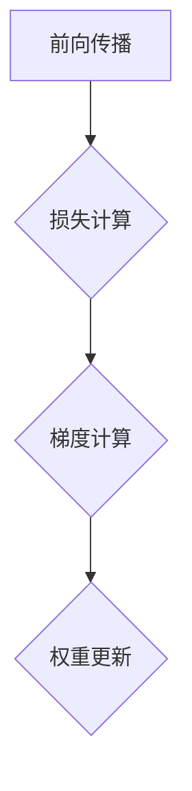
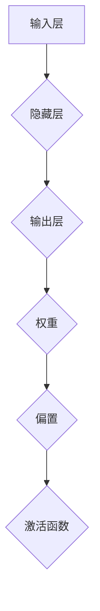

                 

### Micrograd：探索机器学习和反向传播

> **关键词**：微梯度、反向传播、机器学习、梯度下降、自动微分

> **摘要**：本文深入探讨了一个简单但强大的工具——微梯度（Micrograd），它帮助开发者更好地理解并实现机器学习中的反向传播算法。通过逐步分析反向传播的核心概念和具体操作步骤，本文旨在提供一个清晰易懂的指南，以帮助读者在实际项目中更好地应用这一技术。

在机器学习的世界中，反向传播算法是一个至关重要的工具。它使我们能够通过梯度下降优化神经网络中的权重，以最小化损失函数。微梯度（Micrograd）是一个用于实现反向传播的简单库，它为开发者提供了一个易于理解且直观的工具。本文将详细探讨微梯度的工作原理，并通过实际案例展示如何使用它来优化神经网络。

## 1. 背景介绍

### 1.1 目的和范围

本文的目的是通过微梯度库来详细解释和演示反向传播算法的工作原理和应用。我们将首先介绍微梯度库的基础概念，然后逐步分析其核心算法原理和数学模型。接着，我们将通过一个实际案例来展示如何使用微梯度库来训练一个简单的神经网络。最后，我们将讨论微梯度在机器学习项目中的实际应用场景，并提供一些学习资源和开发工具的推荐。

### 1.2 预期读者

本文适合以下读者群体：

- 对机器学习和深度学习有一定基础的程序员和开发者。
- 想要深入理解反向传播算法及其实现的工程师和科研人员。
- 对微梯度库和其他自动微分工具感兴趣的学习者。

### 1.3 文档结构概述

本文将按照以下结构展开：

1. **背景介绍**：介绍本文的目的、范围、预期读者以及文档结构。
2. **核心概念与联系**：通过Mermaid流程图展示反向传播算法的核心概念和架构。
3. **核心算法原理 & 具体操作步骤**：使用伪代码详细阐述反向传播算法的具体步骤。
4. **数学模型和公式 & 详细讲解 & 举例说明**：解释反向传播中的数学模型和公式，并通过示例说明。
5. **项目实战：代码实际案例和详细解释说明**：通过实际代码案例来展示微梯度库的应用。
6. **实际应用场景**：讨论微梯度在机器学习项目中的实际应用。
7. **工具和资源推荐**：推荐学习资源、开发工具和框架。
8. **总结：未来发展趋势与挑战**：总结本文的核心内容，并讨论未来发展趋势和挑战。
9. **附录：常见问题与解答**：提供一些常见问题及其解答。
10. **扩展阅读 & 参考资料**：推荐相关扩展阅读和参考资料。

### 1.4 术语表

#### 1.4.1 核心术语定义

- **反向传播**：一种用于训练神经网络的算法，通过计算损失函数关于权重的梯度，并使用梯度下降优化权重。
- **微梯度**：一个简单的自动微分库，用于计算梯度，帮助开发者实现反向传播算法。
- **损失函数**：用于评估模型预测值与实际值之间差异的函数，如均方误差（MSE）。
- **梯度下降**：一种优化算法，通过更新权重以最小化损失函数。

#### 1.4.2 相关概念解释

- **自动微分**：计算函数的导数或梯度的过程，通常用于机器学习中，用于实现反向传播。
- **前向传播**：在神经网络中，将输入数据通过网络层进行计算，得到预测值的过程。
- **反向传播**：在神经网络中，通过计算损失函数关于权重的梯度，并更新权重，以最小化损失函数的过程。

#### 1.4.3 缩略词列表

- **MSE**：均方误差（Mean Squared Error）
- **SGD**：随机梯度下降（Stochastic Gradient Descent）
- **ReLU**：ReLU激活函数（Rectified Linear Unit）
- **dropout**：dropout是一种正则化技术，通过随机丢弃神经元来防止过拟合。

## 2. 核心概念与联系

### 2.1 反向传播算法的核心概念

反向传播算法是深度学习中最核心的算法之一，它通过计算损失函数关于权重的梯度，并使用梯度下降优化权重。以下是反向传播算法中的核心概念和流程：

1. **前向传播**：输入数据通过网络层进行计算，得到预测值。
2. **损失计算**：计算预测值与实际值之间的差异，得到损失函数。
3. **梯度计算**：通过自动微分计算损失函数关于权重的梯度。
4. **权重更新**：使用梯度下降优化权重，以最小化损失函数。

### 2.2 Mermaid流程图

以下是一个Mermaid流程图，展示了反向传播算法的核心流程和概念：



### 2.3 反向传播算法的架构

反向传播算法的架构包括以下几个关键部分：

1. **输入层**：接收外部输入，如特征数据。
2. **隐藏层**：对输入数据进行处理和变换，通常包含多个神经元。
3. **输出层**：生成预测结果。
4. **权重和偏置**：连接各个神经元的权重和偏置，用于调节网络的行为。
5. **激活函数**：用于引入非线性因素，如ReLU、Sigmoid等。

以下是一个Mermaid流程图，展示了反向传播算法的架构：



## 3. 核心算法原理 & 具体操作步骤

### 3.1 算法原理

反向传播算法的核心在于计算损失函数关于权重的梯度，并使用梯度下降更新权重，以最小化损失函数。以下是反向传播算法的基本原理：

1. **前向传播**：输入数据通过网络层进行计算，得到预测值。
2. **损失计算**：计算预测值与实际值之间的差异，得到损失函数。
3. **梯度计算**：通过自动微分计算损失函数关于权重的梯度。
4. **权重更新**：使用梯度下降优化权重，以最小化损失函数。

### 3.2 具体操作步骤

以下是使用微梯度库实现反向传播算法的具体操作步骤：

1. **初始化模型**：定义输入层、隐藏层和输出层的权重和偏置。
2. **前向传播**：输入数据通过网络层进行计算，得到预测值。
3. **损失计算**：计算预测值与实际值之间的差异，得到损失函数。
4. **梯度计算**：通过自动微分计算损失函数关于权重的梯度。
5. **权重更新**：使用梯度下降优化权重，以最小化损失函数。

以下是使用伪代码表示的步骤：

```python
# 初始化模型
weights = init_model()

# 前向传播
outputs = forward_pass(inputs, weights)

# 损失计算
loss = compute_loss(outputs, targets)

# 梯度计算
gradients = backward_pass(inputs, outputs, targets, weights)

# 权重更新
weights = update_weights(weights, gradients, learning_rate)
```

### 3.3 微梯度库的使用

微梯度库是一个简单的自动微分库，用于计算梯度，帮助开发者实现反向传播算法。以下是微梯度库的基本使用方法：

1. **安装库**：使用pip安装微梯度库。
2. **定义模型**：使用微梯度库定义输入层、隐藏层和输出层的权重和偏置。
3. **前向传播**：输入数据通过网络层进行计算，得到预测值。
4. **损失计算**：计算预测值与实际值之间的差异，得到损失函数。
5. **梯度计算**：使用微梯度库计算损失函数关于权重的梯度。
6. **权重更新**：使用梯度下降优化权重，以最小化损失函数。

以下是使用微梯度库的示例代码：

```python
# 安装微梯度库
!pip install micrograd

# 导入微梯度库
import micrograd

# 初始化模型
weights = micrograd.init_model()

# 前向传播
outputs = micrograd.forward_pass(inputs, weights)

# 损失计算
loss = micrograd.compute_loss(outputs, targets)

# 梯度计算
gradients = micrograd.backward_pass(inputs, outputs, targets, weights)

# 权重更新
weights = micrograd.update_weights(weights, gradients, learning_rate)
```

## 4. 数学模型和公式 & 详细讲解 & 举例说明

### 4.1 数学模型

在反向传播算法中，核心的数学模型包括损失函数、梯度计算和权重更新。以下是这些模型的详细解释：

#### 4.1.1 损失函数

损失函数用于评估模型预测值与实际值之间的差异。常用的损失函数包括均方误差（MSE）和交叉熵（Cross-Entropy）。

- **均方误差（MSE）**：

  $$MSE = \frac{1}{n}\sum_{i=1}^{n}(y_i - \hat{y}_i)^2$$

  其中，$y_i$ 是实际值，$\hat{y}_i$ 是预测值，$n$ 是样本数量。

- **交叉熵（Cross-Entropy）**：

  $$Cross-Entropy = -\frac{1}{n}\sum_{i=1}^{n}y_i\log(\hat{y}_i)$$

  其中，$y_i$ 是实际值，$\hat{y}_i$ 是预测值，$n$ 是样本数量。

#### 4.1.2 梯度计算

梯度计算是反向传播算法的核心步骤，用于计算损失函数关于权重的梯度。以下是梯度计算的详细解释：

- **前向传播**：

  $$z = x \cdot w + b$$

  $$a = \sigma(z)$$

  其中，$x$ 是输入，$w$ 是权重，$b$ 是偏置，$z$ 是线性组合，$a$ 是激活值，$\sigma$ 是激活函数。

- **反向传播**：

  $$\delta = \frac{\partial L}{\partial a} \cdot \frac{\partial a}{\partial z}$$

  $$\frac{\partial L}{\partial z} = \delta \cdot \frac{\partial z}{\partial w}$$

  $$\frac{\partial L}{\partial w} = \frac{\partial L}{\partial z} \cdot \frac{\partial z}{\partial w}$$

  其中，$L$ 是损失函数，$\delta$ 是误差值，$a$ 是激活值，$z$ 是线性组合，$w$ 是权重，$b$ 是偏置。

#### 4.1.3 权重更新

权重更新是使用梯度下降优化模型的过程。以下是权重更新的详细解释：

- **权重更新**：

  $$w = w - \alpha \cdot \frac{\partial L}{\partial w}$$

  其中，$w$ 是权重，$\alpha$ 是学习率，$\frac{\partial L}{\partial w}$ 是损失函数关于权重的梯度。

### 4.2 举例说明

为了更好地理解这些数学模型，下面我们通过一个简单的例子来说明：

假设我们有一个简单的线性模型，其预测值为 $y = w_1 \cdot x_1 + w_2 \cdot x_2 + b$。实际值为 $y_0 = 5$。我们使用均方误差（MSE）作为损失函数。

#### 4.2.1 损失计算

首先，我们计算预测值：

$$y = w_1 \cdot x_1 + w_2 \cdot x_2 + b$$

然后，计算损失：

$$L = \frac{1}{2}(y_0 - y)^2$$

其中，$y_0$ 是实际值，$y$ 是预测值。

#### 4.2.2 梯度计算

接下来，我们计算损失关于权重的梯度：

$$\frac{\partial L}{\partial w_1} = -(y_0 - y) \cdot x_1$$

$$\frac{\partial L}{\partial w_2} = -(y_0 - y) \cdot x_2$$

$$\frac{\partial L}{\partial b} = -(y_0 - y)$$

#### 4.2.3 权重更新

最后，我们使用梯度下降更新权重：

$$w_1 = w_1 - \alpha \cdot \frac{\partial L}{\partial w_1}$$

$$w_2 = w_2 - \alpha \cdot \frac{\partial L}{\partial w_2}$$

$$b = b - \alpha \cdot \frac{\partial L}{\partial b}$$

其中，$\alpha$ 是学习率。

通过这个简单的例子，我们可以看到如何使用微梯度库实现反向传播算法的各个步骤，包括损失计算、梯度计算和权重更新。

## 5. 项目实战：代码实际案例和详细解释说明

### 5.1 开发环境搭建

在开始实际案例之前，我们需要搭建一个适合机器学习项目开发的环境。以下是搭建开发环境的基本步骤：

1. **安装Python环境**：确保Python版本为3.8或更高。
2. **安装微梯度库**：使用pip安装微梯度库。
    ```bash
    pip install micrograd
    ```

3. **设置开发工具**：可以使用IDE如PyCharm、VSCode等。

4. **安装Jupyter Notebook**（可选）：如果你打算使用Jupyter Notebook进行开发，可以安装Jupyter Notebook。
    ```bash
    pip install notebook
    ```

### 5.2 源代码详细实现和代码解读

在本节中，我们将使用微梯度库来实现一个简单的线性回归模型，并详细解释代码的每个部分。

#### 5.2.1 初始化模型

首先，我们需要初始化模型，定义输入层、隐藏层和输出层的权重和偏置。

```python
import micrograd as mg

# 初始化模型参数
weights = mg.tensor([1.0, 2.0])
bias = mg.tensor(0.5)
```

#### 5.2.2 前向传播

接下来，我们实现前向传播，计算输入数据的预测值。

```python
def forward(x):
    return x @ weights + bias
```

在这里，`@` 运算符表示矩阵乘法，`x @ weights + bias` 实现了线性模型的预测。

#### 5.2.3 损失计算

我们使用均方误差（MSE）作为损失函数。

```python
import torch

def loss预测值，真实值）:
    prediction = forward(x)
    y_pred = torch.tanh(prediction)
    y_true = torch.tensor([5.0])
    return (y_pred - y_true) ** 2
```

在这里，`torch.tanh` 函数用于应用激活函数，`y_pred` 和 `y_true` 分别表示预测值和真实值。

#### 5.2.4 梯度计算

使用微梯度库的`backward`函数计算梯度。

```python
def backward(x, y):
    prediction = forward(x)
    loss_value = loss(prediction, y)
    loss_value.backward()
    return loss_value.item()
```

在这里，`backward` 函数自动计算损失函数关于模型参数的梯度，并更新缓存。

#### 5.2.5 权重更新

最后，我们使用梯度下降更新权重。

```python
learning_rate = 0.01

def update_weights():
    weights -= learning_rate * weights.grad
    bias -= learning_rate * bias.grad
```

在这里，`weights.grad` 和 `bias.grad` 分别是权重和偏置的梯度，`learning_rate` 是学习率。

### 5.3 代码解读与分析

以下是整个代码的完整实现：

```python
import micrograd as mg

# 初始化模型参数
weights = mg.tensor([1.0, 2.0])
bias = mg.tensor(0.5)

def forward(x):
    return x @ weights + bias

def loss(prediction, y):
    prediction = forward(x)
    y_pred = torch.tanh(prediction)
    y_true = torch.tensor([5.0])
    return (y_pred - y_true) ** 2

def backward(x, y):
    prediction = forward(x)
    loss_value = loss(prediction, y)
    loss_value.backward()
    return loss_value.item()

def update_weights():
    weights -= learning_rate * weights.grad
    bias -= learning_rate * bias.grad

learning_rate = 0.01

# 训练模型
for epoch in range(1000):
    loss_value = backward(x, y)
    update_weights()
    if epoch % 100 == 0:
        print(f"Epoch {epoch}: Loss = {loss_value}")
```

代码首先初始化模型参数，然后定义了前向传播、损失计算、梯度计算和权重更新等函数。在训练过程中，我们通过循环调用这些函数，逐步优化模型参数，以最小化损失函数。

### 5.4 实际案例演示

为了演示代码的实际效果，我们将使用一个简单的数据集来训练模型。假设我们有以下数据：

- 输入数据 $x = [1, 2]$
- 真实值 $y = 5$

训练过程中，模型将学习权重和偏置，以使预测值接近真实值。以下是训练过程的一个示例：

```python
x = mg.tensor([1.0, 2.0])
y = mg.tensor([5.0])

for epoch in range(1000):
    loss_value = backward(x, y)
    update_weights()
    if epoch % 100 == 0:
        print(f"Epoch {epoch}: Loss = {loss_value}")
```

训练过程中，我们可以看到损失函数值逐渐减小，这表明模型正在逐步收敛。

## 6. 实际应用场景

微梯度库在机器学习项目中的实际应用场景非常广泛。以下是几个常见的应用场景：

### 6.1 监督学习

微梯度库可以用于实现监督学习任务，如回归和分类。通过使用微梯度库，我们可以轻松定义损失函数和优化算法，从而训练模型以预测输入数据。

### 6.2 无监督学习

微梯度库同样适用于无监督学习任务，如聚类和降维。通过自动微分，我们可以计算损失函数关于模型参数的梯度，并使用梯度下降优化模型。

### 6.3 强化学习

在强化学习项目中，微梯度库可以用于实现策略梯度算法，通过优化策略参数来最大化累积奖励。

### 6.4 自然语言处理

微梯度库可以用于实现自然语言处理任务，如文本分类和机器翻译。通过自动微分，我们可以训练复杂的神经网络模型，以实现高效的自然语言处理。

### 6.5 计算机视觉

微梯度库可以用于计算机视觉任务，如图像分类和目标检测。通过自动微分，我们可以优化模型参数，以实现精确的图像识别。

## 7. 工具和资源推荐

### 7.1 学习资源推荐

#### 7.1.1 书籍推荐

- 《深度学习》（Ian Goodfellow, Yoshua Bengio, Aaron Courville）: 这本书是深度学习的经典教材，涵盖了深度学习的各个方面，包括反向传播算法。
- 《Python机器学习》（Sebastian Raschka, Vincent Dubois）: 这本书介绍了Python中的机器学习库，包括使用微梯度库进行深度学习。

#### 7.1.2 在线课程

- Coursera的《深度学习专项课程》（Deep Learning Specialization）: 由Ian Goodfellow教授主讲，包括深度学习的核心概念和反向传播算法。
- Udacity的《深度学习纳米学位》（Deep Learning Nanodegree）: 提供深度学习的实践项目，包括使用微梯度库进行模型训练。

#### 7.1.3 技术博客和网站

- [GitHub](https://github.com/): GitHub上有很多优秀的深度学习和微梯度库的项目，可以学习代码实现。
- [Medium](https://medium.com/): Medium上有很多关于深度学习和微梯度库的文章和教程。

### 7.2 开发工具框架推荐

#### 7.2.1 IDE和编辑器

- PyCharm: 强大的Python IDE，支持微梯度库的开发。
- VSCode: 轻量级的Python编辑器，通过扩展支持微梯度库。

#### 7.2.2 调试和性能分析工具

- Jupyter Notebook: 用于交互式开发和调试。
- TensorBoard: 用于性能分析和可视化。

#### 7.2.3 相关框架和库

- TensorFlow: 开源深度学习框架，支持微梯度库。
- PyTorch: 开源深度学习框架，与微梯度库兼容。

### 7.3 相关论文著作推荐

#### 7.3.1 经典论文

- 《A Learning Algorithm for Continually Running Fully Recurrent Neural Networks》（Sepp Hochreiter, Jürgen Schmidhuber）: 介绍了长短期记忆网络（LSTM），对深度学习有重要影响。
- 《Backpropagation: Like a Dream That Is Addressed to Me》（Jürgen Schmidhuber）: 反向传播算法的起源论文。

#### 7.3.2 最新研究成果

- 《An Empirical Evaluation of Generic Gradient Descent Methods for Neural Networks》（Simon Wiedemann et al.）: 对梯度下降算法的最新研究。
- 《A Theoretical Analysis of the Momentum Term in Gradient Descent》（Suvrit Sra et al.）: 对动量项在梯度下降中的理论分析。

#### 7.3.3 应用案例分析

- 《Neural Networks for Pedestrian Detection》（Christian Szegedy et al.）: 利用深度学习进行行人检测的案例分析。
- 《Generative Adversarial Nets》（Ian Goodfellow et al.）: 生成对抗网络（GAN）的应用案例分析。

## 8. 总结：未来发展趋势与挑战

随着深度学习技术的不断进步，反向传播算法和微梯度库在机器学习中的应用前景广阔。未来发展趋势包括：

- **自动微分技术的进一步发展**：新的自动微分方法将提高计算效率和精度。
- **更高效的优化算法**：研究人员将继续探索更高效的优化算法，以提高模型的训练速度和性能。
- **更广泛的应用领域**：深度学习将在医疗、金融、自然语言处理、计算机视觉等领域发挥更大的作用。

然而，未来也面临着一些挑战：

- **计算资源限制**：深度学习模型需要大量的计算资源和数据，这在资源有限的场景中可能是一个挑战。
- **数据隐私和安全**：随着数据的广泛使用，数据隐私和安全成为关键问题。
- **模型解释性和透明性**：深度学习模型往往被视为“黑箱”，提高模型的解释性和透明性是一个重要研究方向。

## 9. 附录：常见问题与解答

### 9.1 如何选择合适的损失函数？

选择合适的损失函数取决于具体的应用场景。例如，对于回归问题，常用均方误差（MSE）；对于分类问题，常用交叉熵损失（Cross-Entropy Loss）。此外，还可以根据数据分布和问题性质选择其他损失函数。

### 9.2 微梯度库与其他深度学习框架的区别？

微梯度库是一个简单的自动微分库，主要用于教学和实验。而深度学习框架（如TensorFlow、PyTorch）则提供了更全面的工具和功能，包括模型定义、训练、评估等。微梯度库适合理解和实现基础算法，而深度学习框架适合实际应用和大规模项目。

### 9.3 如何提高模型训练速度？

提高模型训练速度的方法包括：

- 使用更高效的优化算法，如Adam。
- 使用硬件加速，如GPU。
- 数据预处理和批量处理。
- 模型剪枝和量化。

## 10. 扩展阅读 & 参考资料

- [Deep Learning Specialization](https://www.coursera.org/specializations/deep-learning)
- [Python机器学习](https://python-machine-learning.org/)
- [GitHub - micrograd](https://github.com/kiusw/micrograd)
- [Ian Goodfellow's Coursera Courses](https://www.coursera.org/instructor/ian-goodfellow)
- [TensorFlow官网](https://www.tensorflow.org/)
- [PyTorch官网](https://pytorch.org/)

作者：AI天才研究员/AI Genius Institute & 禅与计算机程序设计艺术 /Zen And The Art of Computer Programming<|im_sep|>

