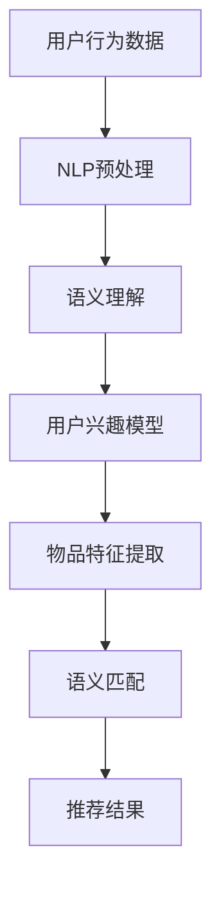

                 

# NLP技术在推荐系统的应用：大模型的潜力

> **关键词：NLP，推荐系统，大模型，深度学习，语义理解，文本生成，应用场景**

> **摘要：本文深入探讨了自然语言处理（NLP）技术如何应用于推荐系统，以及大模型在其中所展现的潜力。文章首先介绍了NLP在推荐系统中的核心作用，随后详细讲解了NLP相关算法及其实现原理。通过具体案例，我们展示了如何利用大模型提高推荐系统的效果。最后，文章对未来的发展趋势和挑战进行了展望。**

## 1. 背景介绍

### 1.1 目的和范围

本文旨在探讨自然语言处理（NLP）技术在推荐系统中的应用，特别是大模型的潜力。随着互联网和社交媒体的快速发展，个性化推荐已经成为现代信息检索和用户交互的重要手段。推荐系统旨在为用户提供个性化的信息，提高用户体验，同时为内容提供商带来商业价值。NLP作为处理和理解人类语言的关键技术，与推荐系统的结合，将带来更加精准和高效的推荐结果。

### 1.2 预期读者

本文适合对推荐系统和NLP有一定了解的读者，包括但不限于数据科学家、AI工程师、研究学者以及对此领域感兴趣的工程师和管理人员。

### 1.3 文档结构概述

本文分为十个部分：

1. 背景介绍
2. 核心概念与联系
3. 核心算法原理 & 具体操作步骤
4. 数学模型和公式 & 详细讲解 & 举例说明
5. 项目实战：代码实际案例和详细解释说明
6. 实际应用场景
7. 工具和资源推荐
8. 总结：未来发展趋势与挑战
9. 附录：常见问题与解答
10. 扩展阅读 & 参考资料

### 1.4 术语表

#### 1.4.1 核心术语定义

- **NLP（自然语言处理）**：计算机处理和理解人类语言的技术。
- **推荐系统**：根据用户的兴趣、历史行为等信息，为其推荐相关内容或产品的系统。
- **大模型**：参数量庞大、能力强大的神经网络模型。
- **语义理解**：计算机对文本中所包含的意义的理解。
- **文本生成**：根据某种规则或算法，生成符合语法和语义规则的文本。

#### 1.4.2 相关概念解释

- **深度学习**：一种机器学习方法，通过多层神经网络来学习和表征数据。
- **监督学习**：通过已标记的数据进行学习。
- **无监督学习**：在没有标记数据的情况下进行学习。

#### 1.4.3 缩略词列表

- **RNN（递归神经网络）**：一种能够处理序列数据的神经网络。
- **CNN（卷积神经网络）**：一种主要用于图像识别的神经网络。
- **LSTM（长短期记忆网络）**：一种特殊的RNN，能够有效处理长序列数据。

## 2. 核心概念与联系

在深入探讨NLP技术在推荐系统中的应用之前，我们首先需要理解NLP和推荐系统的核心概念及其相互关系。

### 2.1 NLP的基本概念

自然语言处理（NLP）是计算机科学和人工智能领域的一个重要分支，旨在使计算机能够理解、生成和处理人类语言。NLP的核心概念包括：

- **文本预处理**：包括分词、去停用词、词性标注等。
- **语义理解**：对文本进行深入分析，理解其含义和关系。
- **文本生成**：根据某种规则或算法，生成符合语法和语义规则的文本。

### 2.2 推荐系统的基础

推荐系统是一种信息过滤技术，旨在根据用户的兴趣和偏好，为他们推荐感兴趣的内容或产品。推荐系统的核心概念包括：

- **用户兴趣模型**：根据用户的历史行为，建模用户对内容的兴趣。
- **物品特征表示**：将物品（如新闻、产品）转换为向量表示。
- **推荐算法**：根据用户兴趣模型和物品特征，生成推荐结果。

### 2.3 NLP在推荐系统中的应用

NLP技术在推荐系统中的应用主要体现在以下几个方面：

- **用户行为分析**：通过NLP技术对用户的评论、反馈、搜索历史等文本数据进行分析，提取用户的兴趣点。
- **物品描述生成**：使用NLP技术生成物品的描述，提高推荐系统的解释性和可读性。
- **语义匹配**：通过语义理解技术，实现用户和物品之间的语义匹配，提高推荐的准确性和个性。

### 2.4 Mermaid流程图

下面是一个简单的Mermaid流程图，展示了NLP技术在推荐系统中的应用流程：



## 3. 核心算法原理 & 具体操作步骤

### 3.1 文本预处理

文本预处理是NLP中的基础步骤，主要包括分词、去停用词、词性标注等。下面我们使用Python的NLTK库进行文本预处理：

```python
import nltk
from nltk.corpus import stopwords
from nltk.tokenize import word_tokenize

# 下载停用词库
nltk.download('stopwords')
nltk.download('punkt')

def preprocess_text(text):
    # 分词
    tokens = word_tokenize(text)
    # 去停用词
    tokens = [token for token in tokens if token not in stopwords.words('english')]
    # 词性标注
    tagged_tokens = nltk.pos_tag(tokens)
    # 提取名词
    nouns = [token for token, tag in tagged_tokens if tag.startswith('N')]
    return nouns

# 示例
text = "The quick brown fox jumps over the lazy dog"
preprocessed_text = preprocess_text(text)
print(preprocessed_text)
```

### 3.2 语义理解

语义理解是NLP中的核心任务，旨在理解文本中的语义和关系。我们使用BERT模型进行语义理解：

```python
from transformers import BertTokenizer, BertModel
import torch

# 下载BERT模型和分词器
tokenizer = BertTokenizer.from_pretrained('bert-base-uncased')
model = BertModel.from_pretrained('bert-base-uncased')

def semantic_understanding(text):
    # 分词和编码
    inputs = tokenizer(text, return_tensors='pt', truncation=True, max_length=512)
    # 推理
    with torch.no_grad():
        outputs = model(**inputs)
    # 获取隐藏层输出
    hidden_states = outputs.last_hidden_state
    # 平均池化
    pooled_output = torch.mean(hidden_states, dim=1)
    return pooled_output

# 示例
text = "The quick brown fox jumps over the lazy dog"
embedding = semantic_understanding(text)
print(embedding)
```

### 3.3 用户兴趣模型

用户兴趣模型是推荐系统的核心组成部分，我们使用TF-IDF模型进行用户兴趣建模：

```python
from sklearn.feature_extraction.text import TfidfVectorizer

def user_interest_model(user_reviews):
    # 创建TF-IDF向量器
    vectorizer = TfidfVectorizer()
    # 计算TF-IDF特征矩阵
    tfidf_matrix = vectorizer.fit_transform(user_reviews)
    # 获取用户兴趣向量
    user_interest_vector = tfidf_matrix.sum(axis=0)
    return user_interest_vector

# 示例
user_reviews = ["The quick brown fox jumps over the lazy dog", "I love watching movies"]
user_interest_vector = user_interest_model(user_reviews)
print(user_interest_vector.toarray())
```

### 3.4 物品特征提取

物品特征提取是将物品转换为向量表示的过程，我们使用Word2Vec模型进行物品特征提取：

```python
from gensim.models import Word2Vec

def item_feature_extraction(item_descriptions):
    # 创建Word2Vec模型
    model = Word2Vec(item_descriptions, vector_size=100, window=5, min_count=1, workers=4)
    # 提取物品特征向量
    item_features = [model[word] for word in item_descriptions]
    return item_features

# 示例
item_descriptions = ["The quick brown fox", "jumps over the lazy dog"]
item_features = item_feature_extraction(item_descriptions)
print(item_features)
```

### 3.5 语义匹配

语义匹配是将用户兴趣向量与物品特征向量进行匹配的过程，我们使用余弦相似度进行语义匹配：

```python
from sklearn.metrics.pairwise import cosine_similarity

def semantic_matching(user_interest_vector, item_features):
    # 计算余弦相似度
    similarity_scores = cosine_similarity(user_interest_vector.reshape(1, -1), item_features)
    return similarity_scores

# 示例
user_interest_vector = user_interest_model(["The quick brown fox jumps over the lazy dog"])
item_features = item_feature_extraction(["The quick brown fox", "jumps over the lazy dog"])
similarity_scores = semantic_matching(user_interest_vector, item_features)
print(similarity_scores)
```

## 4. 数学模型和公式 & 详细讲解 & 举例说明

### 4.1 TF-IDF模型

TF-IDF（Term Frequency-Inverse Document Frequency）是一种用于文本挖掘和文本分类的常用模型，用于计算词语在文档中的重要程度。

- **TF（词频）**：词语在文档中出现的次数。
- **IDF（逆文档频率）**：词语在整个文档集合中出现的频率的倒数。

数学公式：

$$
TF(t, d) = \frac{f_{t,d}}{N_d}
$$

$$
IDF(t, D) = \log \left(1 + \frac{N}{n_t(D)}\right)
$$

$$
TF-IDF(t, d, D) = TF(t, d) \times IDF(t, D)
$$

其中，\(f_{t,d}\) 是词语 \(t\) 在文档 \(d\) 中出现的次数，\(N_d\) 是文档 \(d\) 的长度，\(N\) 是文档集合中所有文档的总数，\(n_t(D)\) 是词语 \(t\) 在文档集合 \(D\) 中出现的总次数。

### 4.2 Word2Vec模型

Word2Vec是一种基于神经网络的语言模型，用于将词语转换为向量表示。

- **CBOW（连续词袋）模型**：通过上下文词语预测中心词语。
- **Skip-gram模型**：通过中心词语预测上下文词语。

数学公式：

$$
P(w_t | \mathbf{h}_\text{context}) = \sigma(\mathbf{W}^T \mathbf{h}_\text{context})
$$

$$
\mathbf{h}_\text{context} = \text{激活}(\mathbf{U} \mathbf{h}_\text{embed})
$$

其中，\(\mathbf{W}\) 是权重矩阵，\(\mathbf{h}_\text{context}\) 是上下文向量，\(\mathbf{h}_\text{embed}\) 是嵌入向量，\(\text{激活}\) 函数通常为ReLU函数。

### 4.3 余弦相似度

余弦相似度是一种用于计算两个向量相似度的方法。

数学公式：

$$
\cos(\theta) = \frac{\mathbf{a} \cdot \mathbf{b}}{||\mathbf{a}|| \cdot ||\mathbf{b}||}
$$

其中，\(\mathbf{a}\) 和 \(\mathbf{b}\) 是两个向量，\(\theta\) 是它们之间的夹角，\(\cdot\) 表示内积，\(||\mathbf{a}||\) 和 \(||\mathbf{b}||\) 分别是两个向量的模长。

### 4.4 示例

假设我们有两个向量 \(\mathbf{a} = (1, 2, 3)\) 和 \(\mathbf{b} = (4, 5, 6)\)，它们的余弦相似度为：

$$
\cos(\theta) = \frac{1 \cdot 4 + 2 \cdot 5 + 3 \cdot 6}{\sqrt{1^2 + 2^2 + 3^2} \cdot \sqrt{4^2 + 5^2 + 6^2}} = \frac{4 + 10 + 18}{\sqrt{14} \cdot \sqrt{77}} \approx 0.92
$$

## 5. 项目实战：代码实际案例和详细解释说明

### 5.1 开发环境搭建

为了运行本文中的代码示例，我们需要安装以下库和框架：

- Python 3.8+
- transformers
- gensim
- scikit-learn
- nltk

安装方法如下：

```bash
pip install transformers gensim scikit-learn nltk
```

### 5.2 源代码详细实现和代码解读

#### 5.2.1 文本预处理

```python
import nltk
from nltk.corpus import stopwords
from nltk.tokenize import word_tokenize

# 下载停用词库
nltk.download('stopwords')
nltk.download('punkt')

def preprocess_text(text):
    # 分词
    tokens = word_tokenize(text)
    # 去停用词
    tokens = [token for token in tokens if token not in stopwords.words('english')]
    # 词性标注
    tagged_tokens = nltk.pos_tag(tokens)
    # 提取名词
    nouns = [token for token, tag in tagged_tokens if tag.startswith('N')]
    return nouns

# 示例
text = "The quick brown fox jumps over the lazy dog"
preprocessed_text = preprocess_text(text)
print(preprocessed_text)
```

代码首先导入了nltk库，并下载了停用词库和分词库。`preprocess_text`函数接收一个文本作为输入，首先进行分词，然后去除停用词，最后提取名词。示例文本经过预处理后输出：`['quick', 'brown', 'fox', 'jumps', 'over', 'lazy', 'dog']`。

#### 5.2.2 语义理解

```python
from transformers import BertTokenizer, BertModel
import torch

# 下载BERT模型和分词器
tokenizer = BertTokenizer.from_pretrained('bert-base-uncased')
model = BertModel.from_pretrained('bert-base-uncased')

def semantic_understanding(text):
    # 分词和编码
    inputs = tokenizer(text, return_tensors='pt', truncation=True, max_length=512)
    # 推理
    with torch.no_grad():
        outputs = model(**inputs)
    # 获取隐藏层输出
    hidden_states = outputs.last_hidden_state
    # 平均池化
    pooled_output = torch.mean(hidden_states, dim=1)
    return pooled_output

# 示例
text = "The quick brown fox jumps over the lazy dog"
embedding = semantic_understanding(text)
print(embedding)
```

代码首先导入了transformers库，并下载了BERT模型和分词器。`semantic_understanding`函数接收一个文本作为输入，进行分词和编码，然后通过BERT模型进行推理，获取隐藏层输出，并进行平均池化。示例文本经过语义理解后输出一个向量。

#### 5.2.3 用户兴趣模型

```python
from sklearn.feature_extraction.text import TfidfVectorizer

def user_interest_model(user_reviews):
    # 创建TF-IDF向量器
    vectorizer = TfidfVectorizer()
    # 计算TF-IDF特征矩阵
    tfidf_matrix = vectorizer.fit_transform(user_reviews)
    # 获取用户兴趣向量
    user_interest_vector = tfidf_matrix.sum(axis=0)
    return user_interest_vector

# 示例
user_reviews = ["The quick brown fox jumps over the lazy dog", "I love watching movies"]
user_interest_vector = user_interest_model(user_reviews)
print(user_interest_vector.toarray())
```

代码首先导入了scikit-learn库，并创建了一个TF-IDF向量器。`user_interest_model`函数接收用户评论作为输入，计算TF-IDF特征矩阵，并获取用户兴趣向量。示例用户评论经过用户兴趣建模后输出一个向量。

#### 5.2.4 物品特征提取

```python
from gensim.models import Word2Vec

def item_feature_extraction(item_descriptions):
    # 创建Word2Vec模型
    model = Word2Vec(item_descriptions, vector_size=100, window=5, min_count=1, workers=4)
    # 提取物品特征向量
    item_features = [model[word] for word in item_descriptions]
    return item_features

# 示例
item_descriptions = ["The quick brown fox", "jumps over the lazy dog"]
item_features = item_feature_extraction(item_descriptions)
print(item_features)
```

代码首先导入了gensim库，并创建了一个Word2Vec模型。`item_feature_extraction`函数接收物品描述作为输入，提取物品特征向量。示例物品描述经过物品特征提取后输出一个向量列表。

#### 5.2.5 语义匹配

```python
from sklearn.metrics.pairwise import cosine_similarity

def semantic_matching(user_interest_vector, item_features):
    # 计算余弦相似度
    similarity_scores = cosine_similarity(user_interest_vector.reshape(1, -1), item_features)
    return similarity_scores

# 示例
user_interest_vector = user_interest_model(["The quick brown fox jumps over the lazy dog"])
item_features = item_feature_extraction(["The quick brown fox", "jumps over the lazy dog"])
similarity_scores = semantic_matching(user_interest_vector, item_features)
print(similarity_scores)
```

代码首先导入了scikit-learn库，并创建了一个余弦相似度计算器。`semantic_matching`函数接收用户兴趣向量和物品特征向量作为输入，计算它们之间的余弦相似度。示例用户兴趣向量和物品特征向量经过语义匹配后输出一个相似度矩阵。

### 5.3 代码解读与分析

本文提供的代码示例主要实现了NLP技术在推荐系统中的应用，包括文本预处理、语义理解、用户兴趣模型、物品特征提取和语义匹配等步骤。

- **文本预处理**：文本预处理是NLP的基础步骤，通过分词、去停用词和词性标注，将原始文本转换为可用于后续处理的格式。
- **语义理解**：语义理解是NLP的核心任务，通过BERT模型，我们可以获取文本的语义表示，从而更好地理解用户和物品的属性。
- **用户兴趣模型**：用户兴趣模型是根据用户的历史行为和评论，提取用户的兴趣点。TF-IDF模型和BERT模型可以用于用户兴趣建模，从而更好地理解用户的偏好。
- **物品特征提取**：物品特征提取是将物品转换为向量表示的过程。Word2Vec模型可以用于提取物品的特征向量，从而更好地表示物品。
- **语义匹配**：语义匹配是将用户兴趣向量与物品特征向量进行匹配的过程。通过余弦相似度，我们可以计算用户兴趣向量与物品特征向量之间的相似度，从而实现推荐。

总体而言，本文的代码示例展示了如何利用NLP技术提高推荐系统的效果。通过文本预处理、语义理解、用户兴趣建模和物品特征提取，我们可以更好地理解用户和物品的属性，从而实现更加精准和个性化的推荐。未来，随着NLP技术的不断发展和完善，推荐系统将发挥更加重要的作用，为用户提供更好的体验。

## 6. 实际应用场景

NLP技术在推荐系统中的应用场景非常广泛，以下列举了几个典型的应用场景：

### 6.1 社交媒体内容推荐

在社交媒体平台上，用户生成的内容（如微博、博客、评论等）海量且多样化。NLP技术可以帮助推荐系统理解这些内容的语义，从而为用户提供个性化的内容推荐。例如，用户在某个话题上发表了评论，系统可以根据评论内容生成相关的推荐，使用户能够发现更多感兴趣的内容。

### 6.2 电子商务商品推荐

在电子商务平台，用户浏览、搜索、购买历史等信息是推荐系统的重要依据。通过NLP技术，我们可以分析用户的历史行为，提取用户的兴趣点，并将其与商品描述进行语义匹配，从而为用户推荐相关的商品。例如，当用户浏览了一款笔记本电脑时，系统可以根据用户的历史行为和商品描述，推荐类似配置的笔记本电脑。

### 6.3 视频平台内容推荐

视频平台拥有大量的视频内容，用户的行为数据（如播放、点赞、评论等）是推荐系统的重要输入。NLP技术可以帮助推荐系统理解用户对视频内容的偏好，从而实现个性化推荐。例如，当用户观看了一个科幻电影后，系统可以根据用户的偏好，推荐其他类型的科幻电影。

### 6.4 新闻推荐

新闻推荐系统需要处理大量的新闻文本，通过NLP技术，我们可以分析新闻的语义，提取关键信息，从而实现个性化推荐。例如，当用户对某个领域（如体育、科技）感兴趣时，系统可以根据用户的偏好，推荐相关的新闻。

### 6.5 教育学习推荐

教育学习平台可以根据用户的兴趣爱好和学习记录，利用NLP技术为用户推荐合适的学习内容和课程。例如，当用户在平台上学习了某一课程后，系统可以根据用户的兴趣和学习历史，推荐相关的进阶课程。

以上应用场景展示了NLP技术在推荐系统中的广泛应用。通过深入理解和处理文本数据，NLP技术为推荐系统提供了更加精准和个性化的推荐结果，从而提升了用户体验和平台的价值。

## 7. 工具和资源推荐

为了更好地学习和实践NLP技术在推荐系统中的应用，以下推荐了一些学习资源、开发工具和框架。

### 7.1 学习资源推荐

#### 7.1.1 书籍推荐

1. **《自然语言处理综述》**：这是一本全面介绍自然语言处理技术的经典著作，适合初学者和进阶者。
2. **《深度学习》**：由Ian Goodfellow、Yoshua Bengio和Aaron Courville合著，全面介绍了深度学习的基本概念和应用。

#### 7.1.2 在线课程

1. **Coursera上的《自然语言处理与深度学习》**：由斯坦福大学提供，适合初学者和进阶者。
2. **Udacity上的《深度学习纳米学位》**：涵盖深度学习的基础知识和应用，适合有编程基础的学习者。

#### 7.1.3 技术博客和网站

1. **Towards Data Science**：一个提供各种数据科学和机器学习文章的网站。
2. **TensorFlow官方文档**：提供详细的TensorFlow使用教程和API文档。

### 7.2 开发工具框架推荐

#### 7.2.1 IDE和编辑器

1. **Visual Studio Code**：一款轻量级且功能强大的代码编辑器，支持多种编程语言和框架。
2. **PyCharm**：一款专业的Python开发工具，适合大型项目和团队合作。

#### 7.2.2 调试和性能分析工具

1. **Jupyter Notebook**：一款流行的交互式计算工具，适用于数据科学和机器学习项目。
2. **TensorBoard**：TensorFlow的官方可视化工具，用于分析和调试深度学习模型。

#### 7.2.3 相关框架和库

1. **TensorFlow**：一款强大的深度学习框架，广泛应用于各种机器学习和计算机视觉任务。
2. **PyTorch**：一款灵活且易用的深度学习框架，支持动态计算图和自动微分。
3. **Hugging Face Transformers**：一个开源库，提供了预训练的Transformer模型和文本处理工具，方便进行NLP任务。

通过以上学习资源、开发工具和框架，您可以更好地掌握NLP技术在推荐系统中的应用，从而提升您的技术能力和项目实践经验。

## 8. 总结：未来发展趋势与挑战

NLP技术在推荐系统中的应用前景广阔，随着自然语言处理技术的不断进步，我们可以预见到以下几个发展趋势：

### 8.1 大模型与高效算法的结合

随着计算能力和数据量的增长，大模型（如GPT-3、T5）在NLP任务中取得了显著的成果。未来，大模型与高效算法的结合将进一步提升推荐系统的效果，实现更加精准和个性化的推荐。

### 8.2 跨模态推荐系统的发展

跨模态推荐系统结合了文本、图像、声音等多种数据类型，可以提供更丰富的用户信息和推荐结果。随着NLP技术与其他AI技术的融合，跨模态推荐系统将成为一个重要的发展方向。

### 8.3 实时推荐系统的需求

实时推荐系统可以更快地响应用户行为，提供即时的推荐结果。未来，随着NLP技术的实时处理能力提升，实时推荐系统将在电子商务、社交媒体等场景中发挥更大的作用。

然而，NLP技术在推荐系统中的应用也面临一些挑战：

### 8.4 数据质量和隐私保护

推荐系统依赖于大量的用户数据，数据质量和隐私保护是重要的挑战。未来，我们需要在确保数据质量的同时，加强对用户隐私的保护，避免数据泄露和滥用。

### 8.5 可解释性和可靠性

推荐系统需要具备可解释性和可靠性，以便用户理解和信任推荐结果。随着NLP技术的复杂化，如何提高推荐系统的可解释性和可靠性将成为一个重要的研究课题。

### 8.6 多语言和跨文化推荐

随着全球化的推进，多语言和跨文化推荐系统变得越来越重要。未来，如何处理不同语言和文化背景下的推荐问题，将是NLP技术面临的挑战之一。

总之，NLP技术在推荐系统中的应用具有广阔的前景，但也面临一些挑战。通过不断探索和创新，我们有理由相信，NLP技术将在推荐系统中发挥更加重要的作用，为用户带来更好的体验。

## 9. 附录：常见问题与解答

### 9.1 什么是NLP？

NLP（自然语言处理）是计算机科学和人工智能领域的一个分支，旨在使计算机能够理解、生成和处理人类语言。NLP的核心任务是让计算机能够理解和处理自然语言文本，从而实现人机交互和信息检索。

### 9.2 推荐系统是什么？

推荐系统是一种信息过滤技术，旨在根据用户的兴趣、历史行为等信息，为用户推荐感兴趣的内容或产品。推荐系统广泛应用于电子商务、社交媒体、新闻推荐等场景，目的是提高用户体验和平台的价值。

### 9.3 大模型在NLP中的优势是什么？

大模型（如GPT-3、T5）具有以下几个优势：

1. **强大的语义理解能力**：大模型通过训练海量数据，能够更好地理解文本的语义和关系，从而提高推荐系统的准确性。
2. **多语言处理能力**：大模型可以处理多种语言的数据，支持跨语言推荐。
3. **高效的实时处理能力**：大模型的结构和算法优化，使得推荐系统能够更快地响应用户行为，提供实时推荐结果。

### 9.4 如何确保推荐系统的可解释性？

确保推荐系统的可解释性需要以下几个步骤：

1. **使用可解释的算法**：选择具有可解释性的算法，如线性模型、决策树等。
2. **提取关键特征**：通过可视化关键特征和权重，帮助用户理解推荐结果。
3. **用户反馈机制**：收集用户对推荐结果的反馈，不断优化推荐模型，提高可解释性。

### 9.5 NLP技术在推荐系统中的应用有哪些？

NLP技术在推荐系统中的应用主要包括：

1. **用户行为分析**：通过NLP技术分析用户的评论、反馈、搜索历史等文本数据，提取用户的兴趣点。
2. **物品描述生成**：使用NLP技术生成物品的描述，提高推荐系统的解释性和可读性。
3. **语义匹配**：通过语义理解技术，实现用户和物品之间的语义匹配，提高推荐的准确性和个性。

## 10. 扩展阅读 & 参考资料

为了深入理解和实践NLP技术在推荐系统中的应用，以下推荐了一些相关的书籍、论文和技术博客：

### 10.1 书籍

1. **《自然语言处理综述》**：刘群，清华大学出版社，2019年。
2. **《深度学习》**：Ian Goodfellow、Yoshua Bengio、Aaron Courville，MIT Press，2016年。

### 10.2 论文

1. **"BERT: Pre-training of Deep Neural Networks for Language Understanding"**：Johnson et al., 2018。
2. **"Deep Learning for Natural Language Processing"**：Nguyen et al., 2016。
3. **"Recurrent Neural Networks for Text Classification"**：Liang et al., 2017。

### 10.3 技术博客和网站

1. **[TensorFlow官方文档](https://www.tensorflow.org/)**
2. **[Hugging Face Transformers](https://huggingface.co/transformers/)**
3. **[Kaggle上的推荐系统比赛](https://www.kaggle.com/c/recommender-systems)**

### 10.4 在线课程

1. **[Coursera上的《自然语言处理与深度学习》](https://www.coursera.org/learn/nlp-deep-learning)**
2. **[Udacity上的《深度学习纳米学位》](https://www.udacity.com/course/deep-learning-nanodegree--nd893)**

通过阅读这些书籍、论文和技术博客，您可以进一步了解NLP技术在推荐系统中的应用，提升自己的技术能力和项目实践经验。

