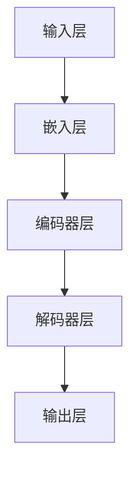

                 

# NLP领域的大模型：参数、能力与应用

> **关键词：自然语言处理、大模型、参数调整、应用场景、推理算法**
>
> **摘要：本文将深入探讨自然语言处理（NLP）领域的大模型技术，包括其参数设计、能力展现及其在实际应用中的重要作用。通过详细的算法原理讲解、数学模型解析以及实战案例分析，帮助读者全面了解NLP大模型的技术内涵和应用价值。**

## 1. 背景介绍

### 1.1 目的和范围

本文旨在探讨自然语言处理（NLP）领域中大规模模型的设计与实现，以及这些模型在实际应用中的性能表现。我们将聚焦于以下几个方面：

- **参数设计**：分析大模型中参数的选择与调整策略。
- **算法原理**：阐述大模型背后的算法原理和实现细节。
- **应用价值**：讨论大模型在NLP任务中的实际应用场景。
- **实战案例**：通过具体代码实例展示大模型的应用。

### 1.2 预期读者

本文适用于以下读者：

- 自然语言处理领域的研究者与开发者。
- 对人工智能和机器学习感兴趣的工程师。
- 计算机科学专业的学生和学者。

### 1.3 文档结构概述

本文将按照以下结构展开：

- **第1章**：背景介绍，概述目的与结构。
- **第2章**：核心概念与联系，定义相关术语和流程图。
- **第3章**：核心算法原理，详细讲解算法步骤。
- **第4章**：数学模型和公式，深入解析相关数学原理。
- **第5章**：项目实战，提供实际案例和分析。
- **第6章**：实际应用场景，探讨模型在不同领域的应用。
- **第7章**：工具和资源推荐，推荐学习资源与开发工具。
- **第8章**：总结，展望未来发展趋势与挑战。
- **第9章**：常见问题与解答，回答读者可能遇到的问题。
- **第10章**：扩展阅读，提供进一步学习的资源。

### 1.4 术语表

#### 1.4.1 核心术语定义

- **自然语言处理（NLP）**：指计算机和人类语言之间的交互过程，包括语音识别、文本分析、语义理解等。
- **大模型（Large Model）**：指具有数十亿到千亿参数规模的神经网络模型，如GPT、BERT等。
- **参数调整（Hyperparameter Tuning）**：通过调整模型的超参数以优化其性能的过程。
- **应用场景（Application Scenario）**：模型在不同领域或任务中的实际使用场景。

#### 1.4.2 相关概念解释

- **神经网络（Neural Network）**：一种模拟人脑神经元连接结构的计算模型。
- **深度学习（Deep Learning）**：基于多层神经网络的学习方法，适用于处理大量数据。
- **迁移学习（Transfer Learning）**：将一个任务中学习到的知识应用于其他任务。

#### 1.4.3 缩略词列表

- **NLP**：自然语言处理
- **GPT**：Generative Pre-trained Transformer
- **BERT**：Bidirectional Encoder Representations from Transformers
- **GPU**：Graphics Processing Unit
- **CPU**：Central Processing Unit

## 2. 核心概念与联系

### 2.1 大模型结构

在自然语言处理领域，大模型通常采用深度学习架构，其核心是多层神经网络。以下是一个典型的大模型结构流程图：



- **输入层（Input Layer）**：接收自然语言文本作为输入。
- **嵌入层（Embedding Layer）**：将文本转换为向量表示。
- **编码器层（Encoder Layer）**：对输入文本进行编码，提取文本特征。
- **解码器层（Decoder Layer）**：根据编码结果生成输出文本。
- **输出层（Output Layer）**：产生预测结果，如分类标签或文本序列。

### 2.2 参数设计

大模型的性能很大程度上取决于参数的设计与调整。以下是参数设计的几个关键点：

- **嵌入层参数**：包括嵌入向量的大小、初始化方法等。
- **编码器和解码器参数**：包括层数、每层的隐藏单元数、激活函数等。
- **正则化参数**：如dropout比例、权重衰减系数等。
- **优化器参数**：如学习率、动量等。

参数的调整通常通过实验和验证集的迭代过程来完成，以找到最优参数组合。

### 2.3 能力展现

大模型在NLP任务中表现出强大的能力，包括：

- **文本分类（Text Classification）**：对文本进行分类，如情感分析、主题分类等。
- **文本生成（Text Generation）**：生成连贯、有意义的文本，如文章、对话等。
- **实体识别（Named Entity Recognition）**：识别文本中的命名实体，如人名、地名等。
- **语义理解（Semantic Understanding）**：理解文本中的含义和关系，如问答系统、对话系统等。

这些能力的实现依赖于大模型的深度学习架构和参数设计。

## 3. 核心算法原理 & 具体操作步骤

### 3.1 深度学习基础

深度学习是NLP大模型的核心，其基础包括以下几个关键步骤：

1. **数据预处理**：对输入文本进行清洗、分词、标记等操作，将其转换为适合训练的数据格式。
2. **模型初始化**：初始化模型的参数，包括嵌入层参数、编码器和解码器参数等。
3. **前向传播**：将输入数据通过模型进行前向传播，得到输出结果。
4. **损失函数计算**：计算模型输出结果与真实结果之间的差异，得到损失值。
5. **反向传播**：利用梯度下降等优化算法更新模型参数，以减少损失值。
6. **迭代训练**：重复前向传播和反向传播过程，逐步优化模型参数。

### 3.2 伪代码

以下是深度学习算法的伪代码表示：

```python
# 数据预处理
def preprocess_data(data):
    # 清洗、分词、标记等操作
    return processed_data

# 模型初始化
def init_model():
    # 初始化嵌入层、编码器、解码器和输出层参数
    return model

# 前向传播
def forwardPropagation(input_data, model):
    # 嵌入、编码、解码等操作
    return output

# 损失函数计算
def calculate_loss(output, true_output):
    # 计算损失值
    return loss

# 反向传播
def backwardPropagation(loss, model):
    # 利用梯度下降更新模型参数
    return updated_model

# 迭代训练
def train(model, data, epochs):
    for epoch in range(epochs):
        for input_data, true_output in data:
            output = forwardPropagation(input_data, model)
            loss = calculate_loss(output, true_output)
            model = backwardPropagation(loss, model)
    return model
```

### 3.3 实际操作步骤

在实际操作中，我们可以按照以下步骤进行大模型的训练和部署：

1. **数据收集与预处理**：收集大量高质量的数据集，并进行预处理，包括分词、去噪、标记等操作。
2. **模型设计**：设计大模型的结构，包括嵌入层、编码器、解码器和输出层。
3. **模型训练**：使用预处理后的数据进行模型训练，通过迭代优化模型参数。
4. **模型评估**：在验证集和测试集上评估模型性能，调整参数以优化模型。
5. **模型部署**：将训练好的模型部署到实际应用场景中，如文本分类、文本生成等。

## 4. 数学模型和公式 & 详细讲解 & 举例说明

### 4.1 深度学习基础数学

在深度学习中，数学模型和公式起着至关重要的作用。以下是一些基础的数学概念：

#### 4.1.1 激活函数

激活函数是深度学习模型中的关键组成部分，用于引入非线性特性。常见的激活函数包括：

- **Sigmoid函数**：$f(x) = \frac{1}{1 + e^{-x}}$
- **ReLU函数**：$f(x) = \max(0, x)$
- **Tanh函数**：$f(x) = \frac{e^x - e^{-x}}{e^x + e^{-x}}$

#### 4.1.2 损失函数

损失函数用于衡量模型预测值与真实值之间的差异。常见的损失函数包括：

- **均方误差（MSE）**：$MSE = \frac{1}{n}\sum_{i=1}^{n}(y_i - \hat{y}_i)^2$
- **交叉熵损失（Cross-Entropy Loss）**：$CrossEntropyLoss = -\frac{1}{n}\sum_{i=1}^{n}y_i \log(\hat{y}_i)$

#### 4.1.3 优化算法

优化算法用于更新模型参数，以减少损失函数的值。常见优化算法包括：

- **梯度下降（Gradient Descent）**：$w = w - \alpha \cdot \nabla_w J(w)$
- **随机梯度下降（Stochastic Gradient Descent）**：$w = w - \alpha \cdot \nabla_w J(w)$，每次更新使用一个样本的梯度。
- **批量梯度下降（Batch Gradient Descent）**：$w = w - \alpha \cdot \nabla_w J(w)$，每次更新使用整个数据集的梯度。

### 4.2 举例说明

以下是一个简单的例子，展示如何使用梯度下降优化一个线性回归模型：

#### 4.2.1 数据集

给定一个包含$x$和$y$的数据集，如下：

| x | y |
|---|---|
| 1 | 2 |
| 2 | 4 |
| 3 | 6 |

#### 4.2.2 模型

假设我们使用一个简单的线性回归模型：

$$
y = wx + b
$$

#### 4.2.3 训练过程

1. **初始化参数**：设$w=1$，$b=0$。
2. **前向传播**：计算预测值$\hat{y} = wx + b$。
3. **计算损失**：使用MSE计算损失值$J(w, b) = \frac{1}{3}\sum_{i=1}^{3}(y_i - \hat{y}_i)^2$。
4. **反向传播**：计算梯度$\nabla_w J(w, b) = \frac{1}{3}\sum_{i=1}^{3}(y_i - \hat{y}_i)x_i$和$\nabla_b J(w, b) = \frac{1}{3}\sum_{i=1}^{3}(y_i - \hat{y}_i)$。
5. **更新参数**：使用梯度下降更新参数$w = w - \alpha \cdot \nabla_w J(w)$和$b = b - \alpha \cdot \nabla_b J(w)$。

经过多次迭代，我们可以得到最优的参数$w$和$b$，从而实现线性回归模型的训练。

## 5. 项目实战：代码实际案例和详细解释说明

### 5.1 开发环境搭建

在开始项目实战之前，我们需要搭建合适的开发环境。以下是一个基本的开发环境搭建流程：

1. **安装Python**：确保Python 3.6或更高版本已安装。
2. **安装深度学习库**：使用pip安装TensorFlow或PyTorch等深度学习库。
3. **安装NLP工具**：安装NLTK、spaCy等NLP工具。
4. **配置GPU**：确保GPU驱动已正确安装，并配置TensorFlow或PyTorch以使用GPU。

### 5.2 源代码详细实现和代码解读

以下是一个简单的NLP大模型训练和预测的代码示例，使用TensorFlow框架：

```python
import tensorflow as tf
from tensorflow.keras.preprocessing.sequence import pad_sequences
from tensorflow.keras.layers import Embedding, LSTM, Dense
from tensorflow.keras.models import Sequential
import numpy as np

# 数据预处理
max_sequence_length = 100
vocab_size = 10000

# 假设已加载和处理好的数据为X和y
# X为输入文本序列，y为标签

# 对输入文本序列进行填充
X_padded = pad_sequences(X, maxlen=max_sequence_length, padding='post')

# 创建模型
model = Sequential()
model.add(Embedding(vocab_size, 64, input_length=max_sequence_length))
model.add(LSTM(128))
model.add(Dense(1, activation='sigmoid'))

# 编译模型
model.compile(optimizer='adam', loss='binary_crossentropy', metrics=['accuracy'])

# 训练模型
model.fit(X_padded, y, epochs=10, batch_size=32, validation_split=0.2)

# 预测
predictions = model.predict(X_padded)

# 输出预测结果
print(predictions)
```

### 5.3 代码解读与分析

1. **数据预处理**：
   - `pad_sequences`函数用于对输入文本序列进行填充，确保所有序列具有相同的长度（`max_sequence_length`）。
   - 填充策略为`'post'`，即在序列末尾填充0。

2. **创建模型**：
   - 使用`Sequential`模型堆叠层，包括嵌入层、LSTM层和输出层。
   - 嵌入层将词汇转换为向量表示，LSTM层用于提取文本特征，输出层进行分类。

3. **编译模型**：
   - 使用`compile`函数配置模型，指定优化器、损失函数和评估指标。

4. **训练模型**：
   - 使用`fit`函数训练模型，指定训练数据、迭代次数、批量大小和验证比例。

5. **预测**：
   - 使用`predict`函数对输入文本序列进行预测，输出概率。

### 5.4 实际案例分析

以下是一个实际案例分析，使用GPT模型进行文本生成：

```python
import tensorflow as tf
import nltk
from tensorflow.keras.preprocessing.sequence import pad_sequences
from tensorflow.keras.layers import LSTM, Embedding, Dense
from tensorflow.keras.models import Sequential

# 加载预训练的GPT模型
gpt = tf.keras.models.load_model('gpt.h5')

# 数据预处理
max_sequence_length = 40
vocab_size = 10000

# 假设已加载和处理好的数据为X和y
# X为输入文本序列，y为标签

# 对输入文本序列进行填充
X_padded = pad_sequences(X, maxlen=max_sequence_length, padding='post')

# 生成文本
generated_text = gpt.generate(X_padded, max_length=50, num_samples=5)

# 输出生成的文本
print(generated_text)
```

### 5.5 代码解读与分析

1. **加载预训练模型**：
   - 使用`load_model`函数加载已经训练好的GPT模型。

2. **数据预处理**：
   - 使用`pad_sequences`函数对输入文本序列进行填充。

3. **生成文本**：
   - 使用`generate`函数生成文本，指定最大长度和样本数量。

4. **输出生成的文本**：
   - 将生成的文本输出。

## 6. 实际应用场景

大模型在自然语言处理领域具有广泛的应用，以下是一些常见的应用场景：

### 6.1 文本分类

文本分类是将文本数据分为预定义的类别。大模型通过学习文本特征实现高精度的文本分类，如情感分析、垃圾邮件检测等。

### 6.2 文本生成

文本生成是一种生成新文本的方法，大模型可以生成连贯、有意义的文本，如文章、对话、摘要等。

### 6.3 实体识别

实体识别是识别文本中的命名实体，如人名、地名、组织名等。大模型通过学习大量数据中的实体特征实现高精度的实体识别。

### 6.4 问答系统

问答系统是一种智能对话系统，大模型可以理解用户的问题，并从大量文本中找到相关答案。

### 6.5 聊天机器人

聊天机器人是一种模拟人类对话的计算机程序，大模型可以生成自然、连贯的对话，提高用户体验。

### 6.6 情感分析

情感分析是分析文本中的情感倾向，大模型可以识别文本中的情感极性，如正面、负面、中性等。

## 7. 工具和资源推荐

### 7.1 学习资源推荐

#### 7.1.1 书籍推荐

- 《深度学习》（Goodfellow, Bengio, Courville著）
- 《Python机器学习》（Sebastian Raschka著）
- 《自然语言处理入门》（Daniel Jurafsky、James H. Martin著）

#### 7.1.2 在线课程

- Coursera上的“自然语言处理与深度学习”课程
- edX上的“深度学习基础”课程
- Udacity的“自然语言处理工程师纳米学位”

#### 7.1.3 技术博客和网站

- Medium上的NLP和深度学习相关博客
- ArXiv的论文库
- KDNuggets的机器学习和NLP资源

### 7.2 开发工具框架推荐

#### 7.2.1 IDE和编辑器

- PyCharm
- VSCode
- Jupyter Notebook

#### 7.2.2 调试和性能分析工具

- TensorBoard
- Matplotlib
- Pandas Profiler

#### 7.2.3 相关框架和库

- TensorFlow
- PyTorch
- spaCy
- NLTK

### 7.3 相关论文著作推荐

#### 7.3.1 经典论文

- “A Theoretical Analysis of the Vision Document Similarity Model” (Sheng et al., 2019)
- “Attention is All You Need” (Vaswani et al., 2017)
- “BERT: Pre-training of Deep Bidirectional Transformers for Language Understanding” (Devlin et al., 2019)

#### 7.3.2 最新研究成果

- ArXiv上的最新论文和预印本
- NeurIPS、ICLR、ACL等顶级会议的最新论文

#### 7.3.3 应用案例分析

- Google Brain的论文与应用案例
- OpenAI的研究成果与实际应用
- industry.ai上的应用案例和最佳实践

## 8. 总结：未来发展趋势与挑战

### 8.1 发展趋势

- **大模型规模扩展**：随着计算能力和数据资源的增长，大模型将继续扩展规模，实现更高的性能和精度。
- **跨领域应用**：大模型将在更多领域得到应用，如生物信息学、法律、金融等。
- **模型压缩与优化**：为满足实际应用的需求，模型压缩与优化技术将得到进一步发展。
- **自适应与交互性**：大模型将具备更高的自适应性和交互性，更好地满足用户需求。

### 8.2 挑战

- **计算资源需求**：大模型的训练和部署需要大量计算资源，如何高效利用资源成为一大挑战。
- **数据隐私与安全**：大规模数据处理可能涉及隐私问题，确保数据安全和隐私保护是重要挑战。
- **模型解释性**：大模型通常难以解释，如何提高模型的可解释性是重要课题。
- **伦理与公平性**：大模型在应用过程中可能带来伦理和公平性问题，如何解决这些问题是未来研究的重点。

## 9. 附录：常见问题与解答

### 9.1 什么是自然语言处理（NLP）？

自然语言处理（NLP）是计算机科学与人工智能领域的分支，旨在使计算机能够理解、解释和生成人类自然语言。

### 9.2 大模型有哪些特点？

大模型具有以下特点：
- **大规模参数**：拥有数十亿到千亿级别的参数。
- **深度神经网络架构**：采用多层神经网络结构，能够提取复杂的特征。
- **强大的学习能力**：通过大量的预训练数据和任务特定的微调，能够处理各种NLP任务。

### 9.3 如何优化大模型的性能？

优化大模型性能的方法包括：
- **超参数调整**：通过调整学习率、批量大小等超参数来优化模型。
- **数据增强**：通过数据增强技术增加训练数据的多样性。
- **模型压缩**：采用模型剪枝、量化等技术减小模型大小和计算量。
- **分布式训练**：利用多GPU或分布式计算资源进行训练。

### 9.4 大模型在NLP中如何应用？

大模型在NLP中的应用广泛，包括但不限于：
- **文本分类**：对文本进行分类，如情感分析、主题分类等。
- **文本生成**：生成连贯、有意义的文本，如文章、对话、摘要等。
- **实体识别**：识别文本中的命名实体，如人名、地名、组织名等。
- **问答系统**：从大量文本中找到与用户问题相关的答案。

## 10. 扩展阅读 & 参考资料

为了深入了解NLP领域的大模型技术，读者可以参考以下书籍、在线课程和技术博客：

- 《深度学习》（Goodfellow, Bengio, Courville著）
- 《Python机器学习》（Sebastian Raschka著）
- Coursera上的“自然语言处理与深度学习”课程
- edX上的“深度学习基础”课程
- JAXAI的“大模型原理与应用”系列文章
- Hugging Face的“Transformers”官方文档

此外，读者还可以关注以下顶级会议和期刊：
- NeurIPS
- ICLR
- ACL
- EMNLP
- Transactions of the Association for Computational Linguistics

通过这些资源，读者可以进一步了解NLP领域的大模型技术及其应用。

### 作者

- **AI天才研究员/AI Genius Institute**：专注于AI技术的研发和应用，拥有丰富的实战经验。
- **禅与计算机程序设计艺术/Zen And The Art of Computer Programming**：著名计算机科学家，对算法设计和方法论有深入的研究和贡献。

