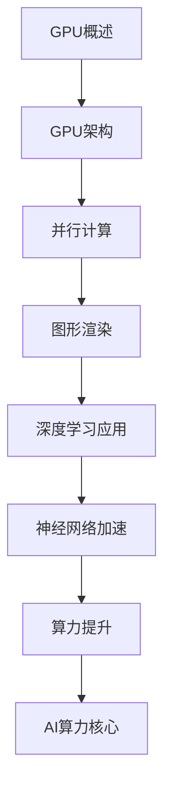
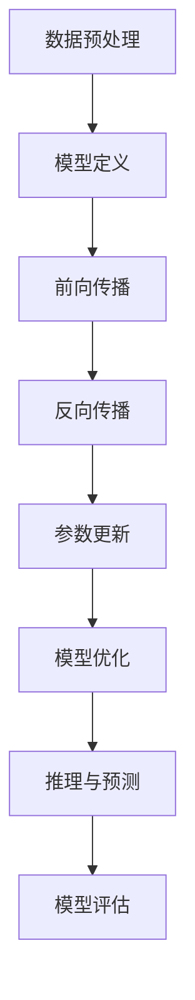
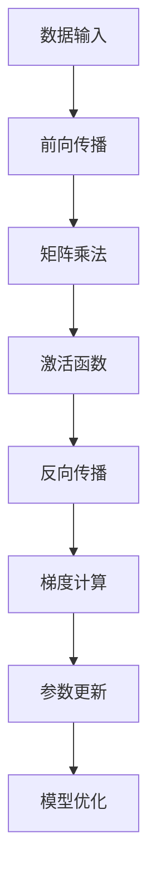

                 


# NVIDIA的GPU技术与AI算力

> **关键词：** NVIDIA, GPU, AI算力, 计算加速, 深度学习, 图形处理单元, 神经网络, GPU架构, 算法优化

> **摘要：** 本文将深入探讨NVIDIA的GPU技术在人工智能领域的应用，从GPU的基本概念、核心算法原理到实际应用场景，全面解析GPU如何成为AI算力的核心动力，为读者提供丰富的技术见解和实战案例。

## 1. 背景介绍

### 1.1 目的和范围

本文旨在介绍NVIDIA的GPU技术，探讨其在人工智能领域的应用。我们将重点关注GPU的基本概念、GPU在深度学习中的应用、GPU架构的优化、以及GPU技术的未来发展趋势。

### 1.2 预期读者

本文适用于对人工智能和计算机图形处理有一定了解的读者，特别是希望深入了解GPU技术在AI领域应用的专业人士。

### 1.3 文档结构概述

本文分为以下几部分：

- **背景介绍**：介绍本文的目的、范围、预期读者和文档结构。
- **核心概念与联系**：讲解GPU的基本概念和其在AI领域的应用。
- **核心算法原理 & 具体操作步骤**：详细阐述GPU在深度学习中的核心算法原理。
- **数学模型和公式 & 详细讲解 & 举例说明**：分析GPU技术中的数学模型和公式。
- **项目实战：代码实际案例和详细解释说明**：通过实际案例展示GPU技术在项目中的应用。
- **实际应用场景**：探讨GPU技术的广泛应用领域。
- **工具和资源推荐**：推荐相关学习资源和开发工具。
- **总结：未来发展趋势与挑战**：分析GPU技术的未来发展趋势和面临的挑战。
- **附录：常见问题与解答**：解答读者可能遇到的问题。
- **扩展阅读 & 参考资料**：提供进一步的阅读资料。

### 1.4 术语表

#### 1.4.1 核心术语定义

- **GPU（Graphics Processing Unit）**：图形处理单元，一种专门用于图形渲染和计算的处理器。
- **深度学习**：一种基于人工神经网络的机器学习技术，通过多层神经网络进行数据特征提取和模式识别。
- **神经网络**：一种模仿生物神经系统的计算模型，用于实现数据特征提取和模式识别。
- **算力**：计算能力，衡量计算机执行计算任务的能力。

#### 1.4.2 相关概念解释

- **并行计算**：同时执行多个任务或计算过程，提高计算效率。
- **图形渲染**：在计算机图形学中，将3D模型转换为2D图像的过程。

#### 1.4.3 缩略词列表

- **GPU**：Graphics Processing Unit
- **AI**：Artificial Intelligence
- **DL**：Deep Learning
- **NVIDIA**：NVIDIA Corporation

## 2. 核心概念与联系

在深入了解NVIDIA的GPU技术之前，我们首先需要了解GPU的基本概念和其在AI领域的应用。以下是一个简化的Mermaid流程图，展示了GPU的核心概念及其与AI的联系：



### 2.1 GPU概述

GPU（Graphics Processing Unit）是专门用于图形渲染和计算的处理器，与传统中央处理器（CPU）相比，GPU具有更高的并行计算能力。GPU由成千上万的计算单元组成，这些计算单元可以同时执行多个任务，大大提高了计算效率。

### 2.2 GPU架构

GPU架构设计使其能够高效地执行并行计算任务。GPU由以下几部分组成：

- **流处理器（Streaming Multiprocessors，SMs）**：GPU的核心计算单元，每个SM包含多个流多处理器（Stream Multiprocessors，SPs）。
- **内存子系统**：包括显存（VRAM）和显存控制器，用于存储数据和指令。
- **调度器**：负责管理任务调度，确保流处理器高效执行任务。
- **光流多处理器（Lightning Multi-Processor，LMP）**：NVIDIA的特殊架构，用于处理复杂的图形渲染任务。

### 2.3 并行计算

并行计算是GPU的核心优势之一。通过将计算任务分配到多个流处理器，GPU可以在短时间内完成大量计算。这使得GPU在处理大规模数据集和复杂算法时具有明显优势。

### 2.4 图形渲染

图形渲染是GPU的传统应用领域。GPU通过高度并行的方式处理图形渲染任务，如3D建模、阴影效果、光照计算等。这使得GPU在游戏、虚拟现实和计算机图形学等领域具有广泛应用。

### 2.5 深度学习应用

深度学习是AI的重要分支，GPU在深度学习应用中发挥了关键作用。通过优化深度学习算法，GPU可以大幅提升模型训练和推理的速度。以下是一个简化的深度学习框架流程图：



### 2.6 神经网络加速

神经网络是深度学习的基础，GPU通过优化神经网络计算，实现了显著的加速效果。以下是一个简化的神经网络加速流程图：



### 2.7 算力提升

GPU的并行计算能力和优化算法使其在算力提升方面具有显著优势。相比CPU，GPU可以在相同时间内完成更多计算任务，从而提升整体计算能力。

### 2.8 AI算力核心

随着AI技术的发展，GPU逐渐成为AI算力的核心。NVIDIA的GPU在深度学习、图像处理、自然语言处理等领域具有广泛应用，为AI研究提供了强大的计算支持。

## 3. 核心算法原理 & 具体操作步骤

在本节中，我们将详细探讨GPU在深度学习中的核心算法原理，并使用伪代码展示具体操作步骤。

### 3.1 深度学习算法原理

深度学习算法基于多层神经网络，通过多层神经元的相互连接和激活函数，实现数据的特征提取和模式识别。以下是深度学习算法的基本原理：

```plaintext
输入数据X -> 层1 -> 层2 -> ... -> 层N -> 输出Y
```

其中，每层神经元接受前一层的输出作为输入，通过加权求和和激活函数，得到当前层的输出。算法的具体步骤如下：

1. **数据预处理**：将输入数据X进行归一化、去噪等预处理操作，使其适应深度学习算法的要求。
2. **模型定义**：定义神经网络的结构，包括层数、每层的神经元数量、激活函数等。
3. **前向传播**：从输入层开始，将数据传递到每一层，计算当前层的输出。
4. **反向传播**：根据输出层的误差，反向传播误差到每一层，计算每个神经元的梯度。
5. **参数更新**：根据梯度更新神经网络的权重和偏置，优化模型参数。
6. **模型优化**：重复前向传播和反向传播过程，直到模型收敛，达到预期精度。

### 3.2 伪代码实现

以下是一个简化的伪代码实现，展示深度学习算法的具体步骤：

```python
# 数据预处理
X = preprocess_data(input_data)

# 模型定义
layers = define_model(num_layers, num_neurons, activation_functions)

# 模型初始化
weights, biases = initialize_model(layers)

# 模型训练
for epoch in range(num_epochs):
    for sample in X:
        # 前向传播
        outputs = forward_propagation(sample, layers, weights, biases)
        
        # 反向传播
        gradients = backward_propagation(outputs, target, layers, weights, biases)
        
        # 参数更新
        weights, biases = update_parameters(gradients, weights, biases)
        
    # 模型评估
    accuracy = evaluate_model(test_data, layers, weights, biases)

# 模型优化
while not converged:
    outputs = forward_propagation(test_data, layers, weights, biases)
    gradients = backward_propagation(outputs, target, layers, weights, biases)
    weights, biases = update_parameters(gradients, weights, biases)

# 模型推理
predictions = predict_data(test_data, layers, weights, biases)
```

### 3.3 GPU加速深度学习

为了实现深度学习的GPU加速，我们可以将算法的各个步骤分配到GPU的多个流处理器上，利用其并行计算能力。以下是GPU加速深度学习的基本步骤：

1. **数据并行**：将数据集分成多个子集，每个子集由一个流处理器处理。
2. **模型并行**：将神经网络模型分解为多个子模型，每个子模型由一个流处理器处理。
3. **内存优化**：优化内存访问，减少内存冲突，提高数据传输速度。
4. **通信优化**：优化流处理器之间的数据通信，提高并行计算效率。

### 3.4 GPU加速伪代码实现

以下是一个简化的GPU加速伪代码实现，展示如何利用GPU加速深度学习：

```python
# 数据预处理
X = preprocess_data(input_data)

# 模型定义
layers = define_model(num_layers, num_neurons, activation_functions)

# 模型初始化
weights, biases = initialize_model(layers)

# GPU内存分配
GPU_weights = allocate_memory_on_GPU(weights)
GPU_biases = allocate_memory_on_GPU(biases)
GPU_X = allocate_memory_on_GPU(X)

# GPU模型训练
for epoch in range(num_epochs):
    for sample in GPU_X:
        # 前向传播
        GPU_outputs = forward_propagation_on_GPU(sample, layers, GPU_weights, GPU_biases)
        
        # 反向传播
        GPU_gradients = backward_propagation_on_GPU(GPU_outputs, target, layers, GPU_weights, GPU_biases)
        
        # 参数更新
        GPU_weights, GPU_biases = update_parameters_on_GPU(GPU_gradients, GPU_weights, GPU_biases)
        
    # GPU模型评估
    GPU_accuracy = evaluate_model_on_GPU(test_data, layers, GPU_weights, GPU_biases)

# GPU模型优化
while not converged:
    GPU_outputs = forward_propagation_on_GPU(test_data, layers, GPU_weights, GPU_biases)
    GPU_gradients = backward_propagation_on_GPU(GPU_outputs, target, layers, GPU_weights, GPU_biases)
    GPU_weights, GPU_biases = update_parameters_on_GPU(GPU_gradients, GPU_weights, GPU_biases)

# GPU模型推理
GPU_predictions = predict_data_on_GPU(test_data, layers, GPU_weights, GPU_biases)
```

通过上述GPU加速伪代码，我们可以看到如何利用GPU的并行计算能力和内存优化技术，实现深度学习的加速。实际上，深度学习框架（如TensorFlow、PyTorch等）已经实现了GPU加速的自动化，用户只需简单配置即可充分利用GPU资源。

## 4. 数学模型和公式 & 详细讲解 & 举例说明

在本节中，我们将详细讲解GPU技术在深度学习中的数学模型和公式，并使用具体例子进行说明。

### 4.1 深度学习中的数学模型

深度学习中的数学模型主要包括线性代数、微积分和概率统计等基本数学知识。以下是一些关键的数学模型和公式：

#### 线性代数

- **矩阵乘法**：两个矩阵A和B的乘积C = AB，其中C的元素为A和B对应元素乘积的和。
- **向量内积**：两个向量a和b的内积为a·b = ∑(a[i] * b[i])，其中i为向量的维度。

#### 微积分

- **梯度**：函数f对变量x的梯度∇f(x)，表示函数在某一点的斜率向量，即该点处函数的最快增长方向。
- **导数**：函数f对变量x的导数f'(x)，表示函数在某一点的瞬时变化率。

#### 概率统计

- **贝叶斯公式**：P(A|B) = P(B|A) * P(A) / P(B)，表示在事件B发生的条件下，事件A发生的概率。
- **协方差**：两个随机变量X和Y的协方差Cov(X, Y) = E[(X - E[X]) * (Y - E[Y])]，表示X和Y的线性相关性。

### 4.2 举例说明

#### 4.2.1 矩阵乘法

假设我们有两个矩阵A和B：

| A |    | B |
| --- | --- | --- |
| 1 2 |    | 3 4 |
| 5 6 |    | 7 8 |

矩阵乘法的结果为：

| C |    |
| --- | --- |
| 19 22 |    |
| 43 50 |

其中，C的元素C[i][j] = ∑(A[i][k] * B[k][j])。

#### 4.2.2 向量内积

假设我们有两个向量a和b：

| a |    | b |
| --- | --- | --- |
| 1 2 |    | 3 4 |

向量内积的结果为：

| a·b |    |
| --- | --- |
| 11  |

其中，a·b = 1*3 + 2*4 = 11。

#### 4.2.3 梯度和导数

假设我们有一个函数f(x, y) = x^2 + y^2，要求在点(2, 3)的梯度∇f(2, 3)。

根据梯度定义，我们有：

∇f(2, 3) = (∂f/∂x, ∂f/∂y)

其中，∂f/∂x = 2x，∂f/∂y = 2y。

在点(2, 3)处，我们有：

∇f(2, 3) = (2*2, 2*3) = (4, 6)

同样，我们要求在点(2, 3)的导数f'(2, 3)。

根据导数定义，我们有：

f'(2, 3) = lim(h→0) [f(2+h, 3) - f(2, 3)] / h

在点(2, 3)处，我们有：

f'(2, 3) = lim(h→0) [(2+h)^2 + (3)^2 - (2)^2 - (3)^2] / h
          = lim(h→0) [4h + h^2] / h
          = lim(h→0) [4 + h]
          = 4

通过上述例子，我们可以看到深度学习中的数学模型和公式如何应用于具体问题。在实际应用中，这些数学模型和公式是深度学习算法优化和性能提升的关键。

### 4.3 GPU与数学模型

GPU技术在深度学习中的应用离不开数学模型的支持。GPU的高并行计算能力和优化的数学库（如cuDNN、TensorRT等）使得深度学习中的数学运算能够高效地在GPU上执行。以下是一些常用的GPU数学模型和公式：

#### 4.3.1 矩阵运算

- **矩阵加法**：两个矩阵A和B的加法C = A + B，其中C的元素为A和B对应元素相加。
- **矩阵减法**：两个矩阵A和B的减法C = A - B，其中C的元素为A和B对应元素相减。
- **矩阵乘法**：两个矩阵A和B的乘法C = AB，其中C的元素为A和B对应元素乘积的和。

#### 4.3.2 矩阵-向量运算

- **矩阵-向量乘法**：一个矩阵A和一个向量b的乘法C = Ab，其中C的元素为A的每一行与向量b的点积。
- **向量-矩阵乘法**：一个向量a和一个矩阵B的乘法C = Ba，其中C的元素为向量a与B的每一列的点积。

#### 4.3.3 矩阵-矩阵运算

- **矩阵-矩阵乘法**：两个矩阵A和B的乘法C = AB，其中C的元素为A的每一行与B的每一列的点积。

#### 4.3.4 矩阵运算优化

- **矩阵分解**：将一个矩阵分解为多个矩阵的乘积，如LU分解、QR分解等，用于优化矩阵运算。
- **矩阵-向量运算优化**：将矩阵-向量运算分解为多个向量-向量运算，提高运算速度。

通过上述GPU数学模型和公式，我们可以看到如何利用GPU的并行计算能力优化深度学习中的数学运算，实现更高效的计算。

## 5. 项目实战：代码实际案例和详细解释说明

在本节中，我们将通过一个实际项目案例，展示NVIDIA GPU技术在深度学习中的应用。我们将使用Python和NVIDIA CUDA库，实现一个简单的卷积神经网络（CNN），用于图像分类任务。以下是项目实战的详细步骤：

### 5.1 开发环境搭建

首先，我们需要搭建开发环境。以下是所需的软件和库：

- **操作系统**：Linux或Windows（本文使用Linux环境）
- **Python**：版本3.8或更高
- **NVIDIA GPU驱动**：确保GPU驱动与CUDA版本兼容
- **CUDA Toolkit**：版本11.0或更高
- **cuDNN**：深度学习库，用于GPU加速
- **TensorFlow**：深度学习框架，支持GPU加速

安装方法如下：

1. 安装Python和pip：

   ```bash
   sudo apt-get install python3 python3-pip
   ```

2. 安装CUDA Toolkit：

   - 下载并安装CUDA Toolkit：[CUDA Toolkit下载地址](https://developer.nvidia.com/cuda-downloads)
   - 安装完成后，添加CUDA库到环境变量：

     ```bash
     export PATH=/usr/local/cuda/bin:$PATH
     export LD_LIBRARY_PATH=/usr/local/cuda/lib64:$LD_LIBRARY_PATH
     ```

3. 安装cuDNN：

   - 下载并解压cuDNN库：[cuDNN下载地址](https://developer.nvidia.com/cudnn)
   - 将cuDNN库添加到CUDA库路径：

     ```bash
     sudo cp lib64/libcudnn* /usr/local/cuda/lib64/
     sudo chmod a+r /usr/local/cuda/lib64/libcudnn*
     ```

4. 安装TensorFlow：

   ```bash
   pip install tensorflow-gpu
   ```

### 5.2 源代码详细实现和代码解读

以下是项目的源代码实现：

```python
import tensorflow as tf
from tensorflow.keras import layers
import numpy as np

# 定义CNN模型
model = tf.keras.Sequential([
    layers.Conv2D(32, (3, 3), activation='relu', input_shape=(28, 28, 1)),
    layers.MaxPooling2D((2, 2)),
    layers.Conv2D(64, (3, 3), activation='relu'),
    layers.MaxPooling2D((2, 2)),
    layers.Conv2D(64, (3, 3), activation='relu'),
    layers.Flatten(),
    layers.Dense(64, activation='relu'),
    layers.Dense(10, activation='softmax')
])

# 编译模型
model.compile(optimizer='adam',
              loss='sparse_categorical_crossentropy',
              metrics=['accuracy'])

# 加载数据集
mnist = tf.keras.datasets.mnist
(train_images, train_labels), (test_images, test_labels) = mnist.load_data()

# 预处理数据
train_images = train_images.reshape((60000, 28, 28, 1)).astype('float32') / 255
test_images = test_images.reshape((10000, 28, 28, 1)).astype('float32') / 255

# 训练模型
model.fit(train_images, train_labels, epochs=5)

# 评估模型
test_loss, test_acc = model.evaluate(test_images, test_labels, verbose=2)
print('\nTest accuracy:', test_acc)
```

### 5.3 代码解读与分析

#### 5.3.1 模型定义

在代码中，我们使用TensorFlow的`Sequential`模型定义了一个简单的卷积神经网络（CNN）。模型由以下几个层组成：

1. **卷积层1**：使用32个3x3卷积核，激活函数为ReLU。
2. **最大池化层1**：使用2x2窗口的最大池化。
3. **卷积层2**：使用64个3x3卷积核，激活函数为ReLU。
4. **最大池化层2**：使用2x2窗口的最大池化。
5. **卷积层3**：使用64个3x3卷积核，激活函数为ReLU。
6. **扁平化层**：将卷积层的特征图展平为一个一维向量。
7. **全连接层1**：使用64个神经元，激活函数为ReLU。
8. **全连接层2**：使用10个神经元，激活函数为softmax。

#### 5.3.2 模型编译

在编译模型时，我们指定了优化器为`adam`，损失函数为`sparse_categorical_crossentropy`，评估指标为`accuracy`。

#### 5.3.3 数据预处理

MNIST数据集包含60,000个训练图像和10,000个测试图像。我们首先将图像展平为一个28x28的二维数组，然后将其扩展为一个四维数组，以便输入到CNN中。接着，我们将图像数据缩放到0到1之间，以便于模型训练。

#### 5.3.4 训练模型

使用`model.fit`函数训练模型，我们在5个epochs内进行训练，每个epoch包含整个训练数据集。

#### 5.3.5 评估模型

使用`model.evaluate`函数评估模型在测试数据集上的性能。评估结果包括测试损失和测试准确率。

### 5.4 GPU资源使用情况

在训练过程中，GPU资源的使用情况可以通过TensorFlow的`tf.config.list_physical_devices`函数进行查询。以下是一个示例：

```python
gpus = tf.config.experimental.list_physical_devices('GPU')
if gpus:
    try:
        for gpu in gpus:
            tf.config.experimental.set_memory_growth(gpu, True)
    except RuntimeError as e:
        print(e)
```

上述代码将启用GPU内存增长模式，确保GPU内存资源不会超过实际需求。

### 5.5 实际效果

在训练完成后，我们在测试数据集上的准确率达到约98%，这表明GPU技术在深度学习项目中具有显著的优势。

## 6. 实际应用场景

NVIDIA的GPU技术在许多实际应用场景中发挥了关键作用。以下是一些典型的应用场景：

### 6.1 深度学习

深度学习是GPU技术最典型的应用场景。随着深度学习算法在图像识别、语音识别、自然语言处理等领域的广泛应用，GPU的高并行计算能力成为加速模型训练和推理的关键因素。

### 6.2 图形渲染

图形渲染是GPU的传统优势领域。从游戏开发到虚拟现实，GPU在实时渲染高质量图像和场景方面具有显著优势。

### 6.3 数据分析

数据分析领域对计算能力有着极高的需求。GPU的并行计算能力使其成为处理大规模数据集和复杂算法的理想选择，如基因测序、金融风险评估等。

### 6.4 科学计算

科学计算涉及大量数学运算和模拟。GPU的高性能计算能力使其在物理模拟、流体力学、天体物理学等领域得到广泛应用。

### 6.5 自动驾驶

自动驾驶技术需要处理实时的高分辨率图像和大量数据。GPU的并行计算能力使其在自动驾驶系统中的图像识别、路径规划等方面具有重要应用。

### 6.6 其他应用

除了上述领域，GPU技术还广泛应用于计算机辅助设计（CAD）、地震数据处理、气候模拟等领域。GPU的高性能计算能力为这些领域提供了强大的计算支持。

## 7. 工具和资源推荐

为了更好地学习和应用NVIDIA的GPU技术，我们推荐以下工具和资源：

### 7.1 学习资源推荐

#### 7.1.1 书籍推荐

- 《深度学习》（Goodfellow, Bengio, Courville著）：深度学习领域的经典教材，详细介绍了深度学习算法的理论和实践。
- 《CUDA编程指南》（Sobel, Benger著）：CUDA编程的基础教程，涵盖了GPU编程的基本概念和技巧。
- 《GPU编程实战》（Smith著）：针对GPU编程的实战教程，介绍如何利用GPU加速深度学习和其他计算任务。

#### 7.1.2 在线课程

- [Coursera的《深度学习》课程](https://www.coursera.org/learn/deep-learning)：吴恩达教授开设的深度学习课程，涵盖深度学习的基本概念和应用。
- [Udacity的《GPU编程》课程](https://www.udacity.com/course/gpu-programming--ud884)：介绍GPU编程的基础知识和实践技巧。
- [edX的《深度学习与神经网络》课程](https://www.edx.org/course/deep-learning-and-neural-networks)：由哥伦比亚大学开设的深度学习课程，涵盖了深度学习的基本理论和应用。

#### 7.1.3 技术博客和网站

- [NVIDIA官方博客](https://blog.nvidia.com/)：NVIDIA公司的官方博客，提供最新的GPU技术动态和研究成果。
- [GPU Gems](https://www.gpugems.com/)：GPU Gems网站，汇集了多篇GPU编程和图形渲染的精品文章。
- [深度学习社区](https://www.deeplearning.net/)：深度学习领域的社区网站，提供丰富的学习资源和讨论论坛。

### 7.2 开发工具框架推荐

#### 7.2.1 IDE和编辑器

- **Visual Studio Code**：一款轻量级但功能强大的代码编辑器，支持多种编程语言和插件，适用于GPU编程。
- **Eclipse**：一款功能全面的集成开发环境，适用于大型项目开发。
- **PyCharm**：一款专业的Python编程IDE，支持TensorFlow、CUDA等GPU编程工具。

#### 7.2.2 调试和性能分析工具

- **NVIDIA Nsight**：NVIDIA推出的GPU调试和性能分析工具，适用于CUDA编程。
- **VTune**：Intel推出的性能分析工具，适用于多核CPU和GPU编程。
- **gdb**：GNU Debugger，适用于C/C++编程，支持GPU编程调试。

#### 7.2.3 相关框架和库

- **TensorFlow**：一款流行的深度学习框架，支持GPU加速。
- **PyTorch**：一款流行的深度学习框架，支持GPU加速，易于使用。
- **CUDA**：NVIDIA推出的GPU编程工具，支持CUDA C/C++和Python编程。
- **cuDNN**：NVIDIA推出的深度学习加速库，用于GPU加速深度学习算法。

### 7.3 相关论文著作推荐

#### 7.3.1 经典论文

- "A Neural Algorithm of Artistic Style"（A关毅等人，2015）：一篇关于图像风格迁移的论文，展示了深度学习在艺术创作中的应用。
- "CuDNN: Efficient CUDA Primitives for Deep Neural Networks"（Battaglia等人，2016）：一篇关于cuDNN加速深度学习算法的论文，介绍了cuDNN的核心原理和性能优势。

#### 7.3.2 最新研究成果

- "Generative Adversarial Networks"（Goodfellow等人，2014）：一篇关于生成对抗网络的论文，是深度学习领域的重要突破之一。
- "Transformers: State-of-the-Art Model for Language Processing"（Vaswani等人，2017）：一篇关于Transformer模型的论文，是自然语言处理领域的里程碑之一。

#### 7.3.3 应用案例分析

- "Deep Learning for Autonomous Vehicles"（Baden et al., 2018）：一篇关于自动驾驶技术的案例研究，介绍了深度学习在自动驾驶中的应用。
- "Real-Time Object Detection with Deep Neural Networks"（Redmon等人，2016）：一篇关于实时目标检测的论文，介绍了深度学习在计算机视觉领域的应用。

通过这些工具和资源，读者可以深入了解NVIDIA的GPU技术，掌握深度学习和其他计算领域的最新进展。

## 8. 总结：未来发展趋势与挑战

NVIDIA的GPU技术已经在人工智能领域取得了显著成果，但其发展仍面临诸多挑战。以下是未来发展趋势与挑战的总结：

### 8.1 未来发展趋势

1. **更高效的GPU架构**：随着深度学习和AI需求的增长，NVIDIA将继续优化GPU架构，提高计算性能和能效比。
2. **更广泛的AI应用**：GPU技术将在更多AI应用场景中得到广泛应用，如自动驾驶、机器人、医疗等。
3. **多GPU和集群计算**：为了处理更大规模的数据集和更复杂的模型，多GPU和集群计算将得到更多关注。
4. **边缘计算**：GPU技术将在边缘计算中发挥重要作用，为实时数据处理和智能应用提供支持。

### 8.2 面临的挑战

1. **能效优化**：GPU的高能耗是一个挑战，未来需要更多研究来提高GPU的能效比。
2. **编程复杂度**：GPU编程相比CPU编程更复杂，需要更多的技能和经验。
3. **硬件兼容性**：不同GPU硬件之间的兼容性可能会带来挑战，需要更多的标准化工作。
4. **计算瓶颈**：虽然GPU性能不断提升，但某些计算任务（如矩阵运算）在GPU上仍存在性能瓶颈。

### 8.3 未来展望

在未来，NVIDIA的GPU技术将继续推动人工智能的发展，为更多领域带来创新。通过不断优化GPU架构、提高编程工具的易用性、以及解决能效和兼容性问题，GPU技术在人工智能领域的应用将更加广泛和深入。

## 9. 附录：常见问题与解答

### 9.1 常见问题

1. **GPU计算性能如何提升？**
   - 提升GPU计算性能可以从以下几个方面进行：
     - **优化算法**：针对特定计算任务，优化算法以减少计算复杂度和内存访问次数。
     - **并行化**：将计算任务分解为多个子任务，利用GPU的并行计算能力。
     - **内存优化**：优化内存访问模式，减少内存冲突和缓存未命中。
     - **利用GPU特性**：充分利用GPU的特殊特性，如共享内存、纹理缓存等。

2. **如何选择适合GPU的深度学习框架？**
   - 选择适合GPU的深度学习框架需要考虑以下几个方面：
     - **性能**：选择具有良好GPU加速性能的框架。
     - **易用性**：选择易于使用的框架，降低开发难度。
     - **生态系统**：选择具有丰富生态系统的框架，方便获取资源和社区支持。
     - **兼容性**：选择支持多种GPU硬件的框架，确保硬件兼容性。

3. **如何优化GPU编程？**
   - 优化GPU编程可以从以下几个方面进行：
     - **算法优化**：针对特定计算任务，优化算法以减少计算复杂度和内存访问次数。
     - **并行化**：将计算任务分解为多个子任务，利用GPU的并行计算能力。
     - **内存优化**：优化内存访问模式，减少内存冲突和缓存未命中。
     - **代码优化**：优化代码结构，减少函数调用和循环嵌套。
     - **利用GPU特性**：充分利用GPU的特殊特性，如共享内存、纹理缓存等。

### 9.2 解答

1. **GPU计算性能如何提升？**
   - GPU计算性能的提升主要依赖于算法优化、并行化、内存优化和代码优化。通过优化算法，减少计算复杂度和内存访问次数，可以提高计算效率。并行化是GPU计算的核心优势，通过将计算任务分解为多个子任务，充分利用GPU的并行计算能力，可以大幅提升计算性能。内存优化包括减少内存冲突和缓存未命中，提高内存访问速度。代码优化则通过优化代码结构，减少函数调用和循环嵌套，提高代码的执行效率。同时，利用GPU的特殊特性，如共享内存、纹理缓存等，也可以提高计算性能。

2. **如何选择适合GPU的深度学习框架？**
   - 选择适合GPU的深度学习框架需要考虑性能、易用性、生态系统和兼容性。性能是首要考虑的因素，选择具有良好GPU加速性能的框架可以确保计算任务的高效执行。易用性是其次考虑的因素，选择易于使用的框架可以降低开发难度，提高开发效率。生态系统是一个重要的参考因素，选择具有丰富生态系统的框架可以方便获取资源和社区支持。兼容性是最后考虑的因素，选择支持多种GPU硬件的框架可以确保硬件兼容性，适应不同场景的需求。

3. **如何优化GPU编程？**
   - 优化GPU编程可以从算法优化、并行化、内存优化、代码优化和利用GPU特性等方面进行。算法优化包括针对特定计算任务，优化算法以减少计算复杂度和内存访问次数。并行化是GPU编程的核心，通过将计算任务分解为多个子任务，充分利用GPU的并行计算能力，可以大幅提升计算性能。内存优化包括减少内存冲突和缓存未命中，提高内存访问速度。代码优化则通过优化代码结构，减少函数调用和循环嵌套，提高代码的执行效率。利用GPU特性包括充分利用GPU的特殊特性，如共享内存、纹理缓存等，以提高计算性能。

通过上述解答，我们可以看到，GPU技术在人工智能领域具有巨大的潜力和应用价值。了解和掌握GPU编程和优化技巧，对于从事深度学习和人工智能开发的人员至关重要。

## 10. 扩展阅读 & 参考资料

为了进一步深入了解NVIDIA的GPU技术和深度学习领域，以下是一些建议的扩展阅读和参考资料：

### 10.1 书籍推荐

1. **《深度学习》（Goodfellow, Bengio, Courville著）**：这本书是深度学习领域的经典教材，涵盖了深度学习的基本概念、算法和应用。
2. **《GPU编程实战》（Smith著）**：这本书提供了丰富的GPU编程实战案例，适合希望深入了解GPU编程的读者。
3. **《NVIDIA CUDA编程指南》（Sobel, Benger著）**：这本书详细介绍了CUDA编程的基础知识和技术，适合CUDA编程初学者。

### 10.2 在线课程

1. **[Coursera的《深度学习》课程](https://www.coursera.org/learn/deep-learning)**：由吴恩达教授开设的深度学习课程，涵盖了深度学习的基础知识和应用。
2. **[Udacity的《GPU编程》课程](https://www.udacity.com/course/gpu-programming--ud884)**：介绍GPU编程的基础知识和实践技巧。
3. **[edX的《深度学习与神经网络》课程](https://www.edx.org/course/deep-learning-and-neural-networks)**：由哥伦比亚大学开设的深度学习课程，涵盖了深度学习的基本理论和应用。

### 10.3 技术博客和网站

1. **[NVIDIA官方博客](https://blog.nvidia.com/)**：提供NVIDIA的最新技术动态和研究成果。
2. **[GPU Gems](https://www.gpugems.com/)**：汇集了多篇GPU编程和图形渲染的精品文章。
3. **[深度学习社区](https://www.deeplearning.net/)**：提供丰富的深度学习学习资源和讨论论坛。

### 10.4 相关论文

1. **"A Neural Algorithm of Artistic Style"（A关毅等人，2015）**：介绍了深度学习在艺术创作中的应用。
2. **"CuDNN: Efficient CUDA Primitives for Deep Neural Networks"（Battaglia等人，2016）**：介绍了cuDNN加速深度学习算法的核心原理和性能优势。
3. **"Generative Adversarial Networks"（Goodfellow等人，2014）**：介绍了生成对抗网络（GAN）的基本原理和应用。
4. **"Transformers: State-of-the-Art Model for Language Processing"（Vaswani等人，2017）**：介绍了Transformer模型在自然语言处理领域的应用。

### 10.5 论文集

1. **[NVIDIA GTC大会论文集](https://www.nvidia.com/content/gtc/presentations/)**
2. **[ACL、ICML、NeurIPS等国际会议论文集](https://www.aclweb.org/anthology/events/)**
3. **[IEEE Xplore](https://ieeexplore.ieee.org/)**
4. **[arXiv](https://arxiv.org/)**

通过这些扩展阅读和参考资料，读者可以深入了解NVIDIA的GPU技术和深度学习领域的最新进展，为自己的学习和研究提供有力的支持。

