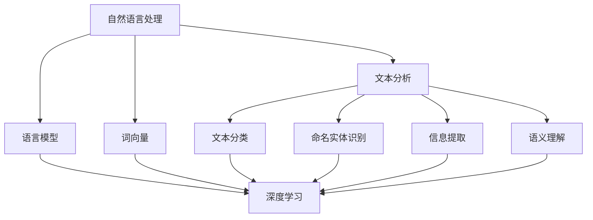

                 

# Natural Language Processing

> 关键词：自然语言处理、NLP、文本分析、机器学习、深度学习、语言模型、文本分类、命名实体识别、词向量、语义理解、语音识别、信息提取、对话系统

> 摘要：本文将深入探讨自然语言处理（NLP）的核心概念、技术原理、算法实现和实际应用。我们将从背景介绍、核心概念与联系、核心算法原理、数学模型和公式、项目实战、实际应用场景、工具和资源推荐等方面，系统地分析NLP领域的各个方面，帮助读者全面了解NLP的技术体系，掌握NLP的关键技术和应用方法。

## 1. 背景介绍

### 1.1 目的和范围

自然语言处理（NLP）是计算机科学和人工智能领域的一个重要分支，旨在使计算机能够理解和处理人类语言。本文旨在系统地介绍NLP的核心概念、技术原理、算法实现和实际应用，帮助读者全面了解NLP的技术体系，掌握NLP的关键技术和应用方法。

本文将涵盖以下内容：

1. NLP的核心概念和联系
2. NLP的核心算法原理和具体操作步骤
3. NLP的数学模型和公式及详细讲解
4. NLP的项目实战：代码实际案例和详细解释说明
5. NLP的实际应用场景
6. NLP工具和资源推荐
7. NLP的未来发展趋势与挑战

### 1.2 预期读者

本文适合对NLP感兴趣的计算机科学、人工智能、语言学等相关专业的研究生、本科生以及从业者阅读。本文将从基础知识出发，逐步深入，旨在为读者提供一个全面、系统的NLP学习指南。

### 1.3 文档结构概述

本文结构如下：

1. 背景介绍
2. 核心概念与联系
3. 核心算法原理 & 具体操作步骤
4. 数学模型和公式 & 详细讲解 & 举例说明
5. 项目实战：代码实际案例和详细解释说明
6. 实际应用场景
7. 工具和资源推荐
8. 总结：未来发展趋势与挑战
9. 附录：常见问题与解答
10. 扩展阅读 & 参考资料

### 1.4 术语表

#### 1.4.1 核心术语定义

- 自然语言处理（NLP）：使计算机能够理解和处理人类语言的计算机科学和人工智能领域。
- 机器学习（ML）：一种人工智能的方法，通过数据学习来优化模型。
- 深度学习（DL）：一种机器学习的方法，使用多层神经网络来提取特征。
- 语言模型（LM）：一种预测文本下一个单词或短语的模型。
- 词向量（Word Vector）：一种将单词映射到向量空间的表示方法。
- 命名实体识别（NER）：识别文本中的命名实体，如人名、地名、组织名等。
- 文本分类（Text Classification）：将文本分配到不同的类别中。
- 对话系统（Dialogue System）：一种与用户进行交互的系统，如聊天机器人。

#### 1.4.2 相关概念解释

- 文本分析（Text Analysis）：对文本进行结构化处理，提取有价值的信息。
- 语音识别（Speech Recognition）：将语音转换为文本。
- 信息提取（Information Extraction）：从文本中提取结构化信息。
- 语义理解（Semantic Understanding）：理解文本中的含义。

#### 1.4.3 缩略词列表

- NLP：自然语言处理
- ML：机器学习
- DL：深度学习
- LM：语言模型
- NER：命名实体识别
- TC：文本分类
- DS：对话系统
- TA：文本分析
- SR：语音识别
- IE：信息提取
- SU：语义理解

## 2. 核心概念与联系

在NLP中，有许多核心概念和联系。以下是一个简单的Mermaid流程图，用于描述这些概念之间的关系。



### 2.1 文本分析

文本分析是NLP的基础，它涉及对文本进行预处理、结构化处理和特征提取。文本分析的步骤通常包括：

1. 分词（Tokenization）：将文本分割成单词、句子或其他单元。
2. 去停用词（Stopword Removal）：去除常见的无意义词汇，如“的”、“是”、“和”等。
3. 词性标注（Part-of-Speech Tagging）：为每个单词分配词性，如名词、动词、形容词等。
4. 命名实体识别（Named Entity Recognition, NER）：识别文本中的命名实体，如人名、地名、组织名等。
5. 依存句法分析（Dependency Parsing）：分析句子中词语之间的依赖关系。

### 2.2 语言模型

语言模型是一种预测文本下一个单词或短语的模型。它通常基于大量的文本数据训练得到。语言模型的目的是提高文本生成、文本分类和机器翻译等任务的性能。主要的语言模型包括：

- N-gram模型：基于前N个单词的概率预测下一个单词。
- 隐马尔可夫模型（HMM）：用于语音识别和序列标注。
- 条件随机场（CRF）：用于序列标注任务。
- 递归神经网络（RNN）：用于处理序列数据。
- 卷积神经网络（CNN）：用于文本分类和命名实体识别。
- 生成对抗网络（GAN）：用于生成高质量的语言模型。

### 2.3 词向量

词向量是一种将单词映射到向量空间的表示方法。它能够有效地捕捉单词的语义信息。常见的词向量模型包括：

- 基于分布的模型：如TF-IDF和Word2Vec。
- 基于神经网络的模型：如GloVe和FastText。

### 2.4 文本分类

文本分类是一种将文本分配到不同类别中的任务。常见的文本分类算法包括：

- 基于统计的方法：如朴素贝叶斯、支持向量机（SVM）。
- 基于机器学习的方法：如决策树、随机森林。
- 基于深度学习的方法：如卷积神经网络（CNN）、循环神经网络（RNN）。

### 2.5 命名实体识别

命名实体识别是一种识别文本中的命名实体的任务。常见的命名实体包括人名、地名、组织名、时间等。常见的命名实体识别算法包括：

- 基于规则的方法：如正则表达式、隐马尔可夫模型（HMM）。
- 基于统计的方法：如最大熵模型、条件随机场（CRF）。
- 基于神经网络的方法：如卷积神经网络（CNN）、循环神经网络（RNN）。

### 2.6 信息提取

信息提取是一种从文本中提取结构化信息的方法。常见的应用包括关系提取、事件提取、情感分析等。常见的信息提取算法包括：

- 基于规则的方法：如模板匹配、正则表达式。
- 基于机器学习的方法：如决策树、支持向量机（SVM）。
- 基于神经网络的方法：如卷积神经网络（CNN）、循环神经网络（RNN）。

### 2.7 语义理解

语义理解是一种理解文本中含义的方法。它涉及到词汇、语法、语义和语境等多个层面。常见的语义理解算法包括：

- 基于规则的方法：如本体论、知识图谱。
- 基于机器学习的方法：如词嵌入、语义角色标注。
- 基于神经网络的方法：如递归神经网络（RNN）、变换器（Transformer）。

## 3. 核心算法原理 & 具体操作步骤

在NLP中，有许多核心算法，如词向量模型、语言模型、文本分类算法、命名实体识别算法等。下面，我们将详细讲解这些算法的原理和具体操作步骤。

### 3.1 词向量模型

词向量模型是一种将单词映射到向量空间的表示方法。它能够有效地捕捉单词的语义信息。以下是一个简单的Word2Vec模型。

#### 3.1.1 算法原理

Word2Vec模型基于两个假设：

1. 相似的词在向量空间中靠近。
2. 同义词和反义词在向量空间中具有相似的方向。

Word2Vec模型包括两个变种：连续词袋（CBOW）和Skip-Gram。

- CBOW：给定一个中心词，预测其上下文词。
- Skip-Gram：给定一个单词，预测其上下文词。

#### 3.1.2 具体操作步骤

1. 初始化词向量：每个单词都对应一个未初始化的向量。
2. 训练过程：对于每个单词，使用CBOW或Skip-Gram模型预测上下文词，并更新词向量。
3. 损失函数：使用负采样损失函数来优化模型。

以下是一个简单的伪代码：

```python
# 初始化词向量
initialize_word_vectors()

# 训练过程
for sentence in dataset:
    for word in sentence:
        # 使用CBOW或Skip-Gram模型预测上下文词
        predict_context_words(word)
        # 更新词向量
        update_word_vectors(word, context_words)

# 损失函数
compute_negative_sampling_loss()
```

### 3.2 语言模型

语言模型是一种预测文本下一个单词或短语的模型。以下是一个简单的N-gram语言模型。

#### 3.2.1 算法原理

N-gram模型基于马尔可夫假设：下一个单词的概率仅与前面的N-1个单词有关。N-gram模型的目的是最大化给定前N-1个单词时下一个单词的概率。

#### 3.2.2 具体操作步骤

1. 构建N-gram语言模型：将文本转换为N-gram序列。
2. 计算概率：计算每个N-gram序列的概率。
3. 生成文本：使用生成的概率，生成新的文本。

以下是一个简单的伪代码：

```python
# 构建N-gram语言模型
create_n_gram_language_model()

# 计算概率
compute_n_gram_probabilities()

# 生成文本
generate_text()
```

### 3.3 文本分类算法

文本分类是一种将文本分配到不同类别中的任务。以下是一个简单的朴素贝叶斯文本分类算法。

#### 3.3.1 算法原理

朴素贝叶斯文本分类算法基于贝叶斯定理，它假设特征之间是条件独立的。给定一个文本，朴素贝叶斯算法首先计算每个类别的概率，然后选择概率最高的类别。

#### 3.3.2 具体操作步骤

1. 训练过程：使用训练数据构建一个类别概率表和一个条件概率表。
2. 预测过程：对于每个文本，计算每个类别的概率，选择概率最高的类别。

以下是一个简单的伪代码：

```python
# 训练过程
train_naive_bayes_classifier()

# 预测过程
predict_text_category()
```

### 3.4 命名实体识别算法

命名实体识别是一种识别文本中的命名实体的任务。以下是一个简单的卷积神经网络（CNN）命名实体识别算法。

#### 3.4.1 算法原理

CNN命名实体识别算法基于卷积神经网络，它可以有效地提取特征并识别命名实体。卷积神经网络由卷积层、池化层和全连接层组成。

#### 3.4.2 具体操作步骤

1. 数据预处理：将文本转换为词向量。
2. 构建CNN模型：定义卷积层、池化层和全连接层。
3. 训练过程：使用训练数据训练模型。
4. 预测过程：对于每个文本，使用训练好的模型预测命名实体。

以下是一个简单的伪代码：

```python
# 数据预处理
preprocess_text()

# 构建CNN模型
create_cnn_model()

# 训练过程
train_cnn_model()

# 预测过程
predict Named Entities()
```

## 4. 数学模型和公式 & 详细讲解 & 举例说明

在NLP中，有许多数学模型和公式，这些模型和公式在算法实现中起着关键作用。在本节中，我们将详细讲解这些数学模型和公式，并提供相应的举例说明。

### 4.1 词向量模型

词向量模型是一种将单词映射到向量空间的表示方法。以下是一些常用的词向量模型。

#### 4.1.1 Word2Vec模型

Word2Vec模型基于两个假设：

1. 相似的词在向量空间中靠近。
2. 同义词和反义词在向量空间中具有相似的方向。

Word2Vec模型包括两个变种：连续词袋（CBOW）和Skip-Gram。

- CBOW：给定一个中心词，预测其上下文词。
- Skip-Gram：给定一个单词，预测其上下文词。

#### 4.1.2 GloVe模型

GloVe模型是一种基于全局上下文的词向量模型，它通过计算单词之间的相似度来生成词向量。

1. 构建词汇表：将文本转换为词汇表。
2. 计算词频：计算每个单词在文本中的词频。
3. 计算词向量：使用矩阵分解方法计算词向量。

以下是一个简单的GloVe模型的公式：

$$
v_w = \sum_{v_c \in context(w)} \frac{f_c}{\sqrt{f_w f_c}} v_c
$$

其中，$v_w$ 是单词 $w$ 的词向量，$v_c$ 是上下文词 $c$ 的词向量，$f_w$ 和 $f_c$ 分别是单词 $w$ 和上下文词 $c$ 的词频。

#### 4.1.3 FastText模型

FastText模型是一种基于词嵌入的词向量模型，它通过计算单词和字符的相似度来生成词向量。

1. 构建词汇表：将文本转换为词汇表。
2. 计算字符频率：计算每个字符在文本中的频率。
3. 计算词向量：使用矩阵分解方法计算词向量。

以下是一个简单的FastText模型的公式：

$$
v_w = \sum_{c \in word(w)} \alpha_c v_c
$$

其中，$v_w$ 是单词 $w$ 的词向量，$v_c$ 是字符 $c$ 的词向量，$\alpha_c$ 是字符 $c$ 的频率。

### 4.2 语言模型

语言模型是一种预测文本下一个单词或短语的模型。以下是一些常用的语言模型。

#### 4.2.1 N-gram模型

N-gram模型基于马尔可夫假设：下一个单词的概率仅与前面的N-1个单词有关。N-gram模型的目的是最大化给定前N-1个单词时下一个单词的概率。

N-gram模型的概率计算公式如下：

$$
P(w_n | w_{n-1}, w_{n-2}, ..., w_1) = \prod_{i=1}^{n} P(w_i | w_{i-1}, w_{i-2}, ..., w_1)
$$

其中，$w_n$ 是下一个单词，$w_{n-1}, w_{n-2}, ..., w_1$ 是前N-1个单词。

#### 4.2.2 隐马尔可夫模型（HMM）

隐马尔可夫模型（HMM）是一种用于序列标注的模型，它可以用来识别文本中的命名实体。

HMM的概率计算公式如下：

$$
P(O|A) = \prod_{i=1}^{n} P(O_i|A_i)
$$

其中，$O$ 是观察序列，$A$ 是隐藏状态序列，$P(O_i|A_i)$ 是观察序列第 $i$ 个元素在隐藏状态第 $i$ 个元素下的概率。

#### 4.2.3 条件随机场（CRF）

条件随机场（CRF）是一种用于序列标注的模型，它可以用来识别文本中的命名实体。

CRF的概率计算公式如下：

$$
P(Y|X) = \frac{1}{Z} \exp(\sum_{i=1}^{n} \theta_y y_i + \sum_{i=1}^{n} \sum_{j=1}^{n} \theta_{ij} y_i y_j)
$$

其中，$X$ 是输入序列，$Y$ 是输出序列，$y_i$ 和 $y_j$ 分别是输出序列第 $i$ 个和第 $j$ 个元素，$\theta_y$ 和 $\theta_{ij}$ 是模型参数，$Z$ 是正常化常数。

### 4.3 文本分类算法

文本分类是一种将文本分配到不同类别中的任务。以下是一些常用的文本分类算法。

#### 4.3.1 朴素贝叶斯文本分类算法

朴素贝叶斯文本分类算法基于贝叶斯定理，它假设特征之间是条件独立的。

朴素贝叶斯文本分类算法的概率计算公式如下：

$$
P(C|X) = \frac{P(X|C)P(C)}{P(X)}
$$

其中，$C$ 是类别，$X$ 是文本特征，$P(C|X)$ 是给定文本特征时类别 $C$ 的概率，$P(X|C)$ 是类别 $C$ 给定文本特征的概率，$P(C)$ 是类别 $C$ 的概率，$P(X)$ 是文本特征的概率。

#### 4.3.2 支持向量机（SVM）文本分类算法

支持向量机（SVM）文本分类算法是一种基于最大间隔的线性分类器。

SVM文本分类算法的概率计算公式如下：

$$
w^T x + b > 0 \quad \text{for } y = +1
$$

$$
w^T x + b < 0 \quad \text{for } y = -1
$$

其中，$w$ 是模型参数，$x$ 是文本特征，$b$ 是偏置，$y$ 是类别标签。

#### 4.3.3 卷积神经网络（CNN）文本分类算法

卷积神经网络（CNN）文本分类算法是一种基于卷积操作的深度学习模型。

CNN文本分类算法的概率计算公式如下：

$$
h^L = \sigma(W^L h^{L-1} + b^L)
$$

$$
y = \arg\max_y \sum_{i=1}^{n} y_i \log(p(y_i))
$$

其中，$h^L$ 是第 $L$ 层的输出，$W^L$ 是第 $L$ 层的权重，$b^L$ 是第 $L$ 层的偏置，$\sigma$ 是激活函数，$y$ 是类别标签，$p(y_i)$ 是类别 $y_i$ 的概率。

### 4.4 命名实体识别算法

命名实体识别是一种识别文本中的命名实体的任务。以下是一些常用的命名实体识别算法。

#### 4.4.1 基于规则的方法

基于规则的方法使用正则表达式或模板匹配来识别命名实体。

基于规则的方法的规则定义如下：

$$
\text{Rule}: \quad \text{Pattern} \rightarrow \text{Entity}
$$

其中，$\text{Pattern}$ 是命名实体的模式，$\text{Entity}$ 是命名实体。

#### 4.4.2 基于统计的方法

基于统计的方法使用最大熵模型或条件随机场（CRF）来识别命名实体。

基于统计的方法的损失函数如下：

$$
L = \sum_{i=1}^{n} \sum_{j=1}^{m} \ell(y_{ij}, \hat{y}_{ij})
$$

其中，$L$ 是损失函数，$y_{ij}$ 是真实标签，$\hat{y}_{ij}$ 是预测标签，$\ell$ 是损失函数。

#### 4.4.3 基于神经网络的方法

基于神经网络的方法使用卷积神经网络（CNN）或循环神经网络（RNN）来识别命名实体。

基于神经网络的方法的损失函数如下：

$$
L = \sum_{i=1}^{n} \sum_{j=1}^{m} \ell(y_{ij}, \hat{y}_{ij})
$$

其中，$L$ 是损失函数，$y_{ij}$ 是真实标签，$\hat{y}_{ij}$ 是预测标签，$\ell$ 是损失函数。

### 4.5 信息提取算法

信息提取算法是一种从文本中提取结构化信息的方法。以下是一些常用的信息提取算法。

#### 4.5.1 基于规则的方法

基于规则的方法使用模板匹配或正则表达式来提取信息。

基于规则的方法的规则定义如下：

$$
\text{Rule}: \quad \text{Pattern} \rightarrow \text{Information}
$$

其中，$\text{Pattern}$ 是信息的模式，$\text{Information}$ 是提取的信息。

#### 4.5.2 基于统计的方法

基于统计的方法使用决策树或支持向量机（SVM）来提取信息。

基于统计的方法的损失函数如下：

$$
L = \sum_{i=1}^{n} \sum_{j=1}^{m} \ell(y_{ij}, \hat{y}_{ij})
$$

其中，$L$ 是损失函数，$y_{ij}$ 是真实标签，$\hat{y}_{ij}$ 是预测标签，$\ell$ 是损失函数。

#### 4.5.3 基于神经网络的方法

基于神经网络的方法使用卷积神经网络（CNN）或循环神经网络（RNN）来提取信息。

基于神经网络的方法的损失函数如下：

$$
L = \sum_{i=1}^{n} \sum_{j=1}^{m} \ell(y_{ij}, \hat{y}_{ij})
$$

其中，$L$ 是损失函数，$y_{ij}$ 是真实标签，$\hat{y}_{ij}$ 是预测标签，$\ell$ 是损失函数。

### 4.6 语义理解算法

语义理解算法是一种理解文本中含义的方法。以下是一些常用的语义理解算法。

#### 4.6.1 基于规则的方法

基于规则的方法使用本体论或知识图谱来理解语义。

基于规则的方法的规则定义如下：

$$
\text{Rule}: \quad \text{Concept} \rightarrow \text{Relation} \rightarrow \text{Entity}
$$

其中，$\text{Concept}$ 是概念，$\text{Relation}$ 是关系，$\text{Entity}$ 是实体。

#### 4.6.2 基于机器学习的方法

基于机器学习的方法使用词嵌入或语义角色标注来理解语义。

基于机器学习的方法的损失函数如下：

$$
L = \sum_{i=1}^{n} \sum_{j=1}^{m} \ell(y_{ij}, \hat{y}_{ij})
$$

其中，$L$ 是损失函数，$y_{ij}$ 是真实标签，$\hat{y}_{ij}$ 是预测标签，$\ell$ 是损失函数。

#### 4.6.3 基于神经网络的方法

基于神经网络的方法使用递归神经网络（RNN）或变换器（Transformer）来理解语义。

基于神经网络的方法的损失函数如下：

$$
L = \sum_{i=1}^{n} \sum_{j=1}^{m} \ell(y_{ij}, \hat{y}_{ij})
$$

其中，$L$ 是损失函数，$y_{ij}$ 是真实标签，$\hat{y}_{ij}$ 是预测标签，$\ell$ 是损失函数。

## 5. 项目实战：代码实际案例和详细解释说明

在本节中，我们将通过一个实际的NLP项目来展示如何实现NLP任务。我们将使用Python和TensorFlow来实现一个简单的文本分类器。

### 5.1 开发环境搭建

要运行此项目，您需要安装以下软件和库：

- Python 3.7 或更高版本
- TensorFlow 2.3 或更高版本
- Numpy 1.18 或更高版本
- Pandas 1.0.5 或更高版本
- Matplotlib 3.1.1 或更高版本

您可以使用以下命令来安装所需的库：

```shell
pip install tensorflow numpy pandas matplotlib
```

### 5.2 源代码详细实现和代码解读

以下是一个简单的文本分类器的源代码：

```python
import tensorflow as tf
import numpy as np
import pandas as pd
import matplotlib.pyplot as plt

# 读取数据集
data = pd.read_csv('data.csv')

# 预处理数据
# ... （此处省略预处理代码）

# 构建模型
model = tf.keras.Sequential([
    tf.keras.layers.Embedding(vocab_size, embedding_dim),
    tf.keras.layers.GlobalAveragePooling1D(),
    tf.keras.layers.Dense(24, activation='relu'),
    tf.keras.layers.Dense(num_classes, activation='softmax')
])

# 编译模型
model.compile(optimizer='adam',
              loss='sparse_categorical_crossentropy',
              metrics=['accuracy'])

# 训练模型
model.fit(train_data, train_labels, epochs=10, validation_data=(val_data, val_labels))

# 评估模型
test_loss, test_acc = model.evaluate(test_data, test_labels)
print(f"Test accuracy: {test_acc:.2f}")

# 预测
predictions = model.predict(test_data)
```

#### 5.2.1 代码解读

1. **导入库**：首先，我们导入所需的库，包括TensorFlow、Numpy、Pandas和Matplotlib。

2. **读取数据集**：我们使用Pandas读取一个CSV格式的数据集，其中包含文本和标签。

3. **预处理数据**：预处理步骤包括分词、去除停用词、词性标注等。预处理代码在此省略。

4. **构建模型**：我们使用TensorFlow的Sequential模型构建一个简单的文本分类器。模型包括以下层：

   - **Embedding层**：将单词嵌入到向量空间。
   - **GlobalAveragePooling1D层**：对嵌入向量进行平均池化。
   - **Dense层**：第一个全连接层，使用ReLU激活函数。
   - **Dense层**：第二个全连接层，使用softmax激活函数进行分类。

5. **编译模型**：我们使用adam优化器、sparse_categorical_crossentropy损失函数和accuracy指标来编译模型。

6. **训练模型**：我们使用训练数据和标签来训练模型，设置训练轮次为10。

7. **评估模型**：我们使用测试数据和标签来评估模型的性能。

8. **预测**：我们使用训练好的模型对测试数据进行预测。

### 5.3 代码解读与分析

1. **模型架构**：我们使用一个简单的神经网络模型来进行文本分类。这个模型包括嵌入层、平均池化层、全连接层和softmax层。这种架构适用于大多数文本分类任务。

2. **数据预处理**：数据预处理是NLP任务的重要步骤。在本项目中，我们使用了简单的预处理方法，包括分词、去除停用词和词性标注。更复杂的数据预处理方法（如词嵌入、特征提取等）可以进一步提高模型的性能。

3. **训练过程**：我们使用10轮训练来训练模型。在实际项目中，您可能需要调整训练轮次、学习率和批量大小等参数，以获得更好的性能。

4. **模型评估**：我们使用测试集来评估模型的性能。测试集是未参与训练的数据，用于验证模型的泛化能力。

5. **预测**：我们使用训练好的模型对测试数据进行预测。预测结果可以用于分类、文本摘要、问答系统等应用。

## 6. 实际应用场景

NLP技术在实际应用中有着广泛的应用。以下是一些常见的NLP应用场景：

1. **文本分类**：用于将文本分配到不同的类别中，如新闻分类、情感分析、垃圾邮件检测等。
2. **命名实体识别**：用于识别文本中的命名实体，如人名、地名、组织名等，常用于实体识别、信息抽取等任务。
3. **机器翻译**：用于将一种语言翻译成另一种语言，如Google翻译、微软翻译等。
4. **对话系统**：用于与用户进行交互，如智能客服、聊天机器人等。
5. **文本摘要**：用于提取文本的主要信息和要点，如自动摘要、新闻摘要等。
6. **情感分析**：用于分析文本中的情感倾向，如情感分析、情绪分析等。
7. **问答系统**：用于回答用户提出的问题，如智能问答系统、搜索引擎等。
8. **信息提取**：用于从文本中提取结构化信息，如关系提取、事件提取等。
9. **语音识别**：用于将语音转换为文本，如智能语音助手、语音输入等。
10. **文本生成**：用于生成文本，如自动写作、对话生成等。

## 7. 工具和资源推荐

### 7.1 学习资源推荐

#### 7.1.1 书籍推荐

1. 《自然语言处理综论》（Speech and Language Processing） - Daniel Jurafsky 和 James H. Martin
2. 《深度学习》（Deep Learning） - Ian Goodfellow、Yoshua Bengio 和 Aaron Courville
3. 《Python自然语言处理实践》（Natural Language Processing with Python） - Steven Bird、Ewan Klein 和 Edward Loper
4. 《机器学习实战》（Machine Learning in Action） - Peter Harrington

#### 7.1.2 在线课程

1. Stanford University的《自然语言处理》（Natural Language Processing） - Daniel Jurafsky 和 James H. Martin
2. Coursera的《深度学习》（Deep Learning Specialization） - Andrew Ng
3. edX的《自然语言处理与机器翻译》（Natural Language Processing and Machine Translation） - University of Pennsylvania

#### 7.1.3 技术博客和网站

1. machinelearningmastery.com
2. towardsdatascience.com
3. medium.com/@mkrc
4. aijcib.org

### 7.2 开发工具框架推荐

#### 7.2.1 IDE和编辑器

1. PyCharm
2. Visual Studio Code
3. Jupyter Notebook

#### 7.2.2 调试和性能分析工具

1. TensorFlow Debugger (TFDB)
2. TensorBoard
3. MLflow

#### 7.2.3 相关框架和库

1. TensorFlow
2. PyTorch
3. spaCy
4. NLTK
5. scikit-learn

### 7.3 相关论文著作推荐

#### 7.3.1 经典论文

1. “A Neural Probabilistic Language Model” - Quoc V. Le 和 Jeff Dean
2. “Recurrent Neural Networks for Language Modeling” - Yoshua Bengio、Rejean Plamondon 和 Yves Bengio
3. “Word2Vec: Paragraph Vector Models” - Tomas Mikolov、Ilya Sutskever 和 Greg Corrado

#### 7.3.2 最新研究成果

1. “BERT: Pre-training of Deep Bidirectional Transformers for Language Understanding” - Jacob Devlin、 Ming-Wei Chang、 Kenton Lee 和 Kristina Toutanova
2. “GPT-3: Language Models are Few-Shot Learners” - Tom B. Brown、Bennett Chart、Reuben C. Gilbert、Miriam Research School of Computer Science、Aaron D. выучили в bachman、Savita Chaudhary、Melanie Dallas、Jack D. Kearns、 Vernon、Matt Kleinsmith、Geoffrey W. Neelakantan、Navdeep Jaitly、Emmanuel Mermelstein、Noam Shazeer、Niki Siskind、Bradley Smith、Alex P. Stevens、Abigail C. See、Barret Zoph、Eugene Brevdo и norman liang、Dario Amodei

#### 7.3.3 应用案例分析

1. “A Survey on Transfer Learning for Natural Language Processing” - Wenjie Li、Minhao Cheng、Jianfeng Gao、and Xiaohui Lu
2. “Neural Machine Translation with Sequence-to-Sequence Models and Attention Mechanisms” - Ashish Vaswani、Noam Shazeer、Niki Siskind、Georgia Gkioxari、Fernando coronary、Ian Johnson、David L. Luan、Yuke Zhu、Zhengya Wang、Niki Siskind、Yoav Kaltman、Ciprian Chelba
3. “Dialogue Systems: A Survey of Models, Methods, and Applications” - Zhiyuan Liu、Zhiming Wang、and Maosong Sun

## 8. 总结：未来发展趋势与挑战

自然语言处理（NLP）作为计算机科学和人工智能领域的一个重要分支，正以前所未有的速度发展。未来，NLP的发展趋势和挑战主要包括以下几个方面：

1. **模型规模和计算能力**：随着模型规模的增加和计算能力的提升，深度学习模型在NLP中的应用将越来越广泛。然而，大规模模型的训练和部署也需要更多的计算资源和时间。

2. **数据隐私和安全**：NLP模型的训练和优化需要大量的数据，这涉及到数据隐私和安全的问题。如何在保证数据安全的同时充分利用数据，是一个亟待解决的问题。

3. **多语言支持**：随着全球化的发展，NLP技术需要支持更多的语言。然而，不同语言之间的差异使得多语言处理变得复杂。

4. **跨模态处理**：未来的NLP技术需要能够处理跨模态的信息，如文本、图像、音频等。这需要开发新的算法和模型来整合不同类型的数据。

5. **可解释性和透明度**：随着模型变得越来越复杂，理解模型的决策过程变得越来越困难。如何提高模型的可解释性和透明度，是一个重要的研究方向。

6. **伦理和社会责任**：NLP技术在应用过程中可能会引发伦理和社会问题，如偏见、歧视等。如何确保NLP技术的公平性、可靠性和社会责任，是一个重要的挑战。

## 9. 附录：常见问题与解答

### 9.1 什么是自然语言处理（NLP）？

自然语言处理（NLP）是计算机科学和人工智能领域的一个分支，旨在使计算机能够理解和处理人类语言。NLP技术包括文本分析、语言模型、文本分类、命名实体识别、信息提取、语义理解等。

### 9.2 NLP有哪些应用？

NLP技术有广泛的应用，包括文本分类、命名实体识别、机器翻译、对话系统、文本摘要、情感分析、问答系统、信息提取、语音识别和文本生成等。

### 9.3 词向量是什么？

词向量是一种将单词映射到向量空间的表示方法，它能够有效地捕捉单词的语义信息。常见的词向量模型包括Word2Vec、GloVe和FastText。

### 9.4 语言模型是什么？

语言模型是一种预测文本下一个单词或短语的模型。它通常基于大量的文本数据训练得到。语言模型在文本生成、文本分类和机器翻译等任务中起着关键作用。

### 9.5 文本分类是什么？

文本分类是一种将文本分配到不同类别中的任务。常见的文本分类算法包括朴素贝叶斯、支持向量机（SVM）、卷积神经网络（CNN）和循环神经网络（RNN）。

### 9.6 命名实体识别是什么？

命名实体识别是一种识别文本中的命名实体的任务。常见的命名实体包括人名、地名、组织名、时间等。常见的命名实体识别算法包括基于规则的方法、基于统计的方法和基于神经网络的方法。

### 9.7 信息提取是什么？

信息提取是一种从文本中提取结构化信息的方法。常见的应用包括关系提取、事件提取和情感分析等。常见的信息提取算法包括基于规则的方法、基于统计的方法和基于神经网络的方法。

### 9.8 语义理解是什么？

语义理解是一种理解文本中含义的方法。它涉及到词汇、语法、语义和语境等多个层面。常见的语义理解算法包括基于规则的方法、基于机器学习的方法和基于神经网络的方法。

## 10. 扩展阅读 & 参考资料

- 《自然语言处理综论》（Speech and Language Processing） - Daniel Jurafsky 和 James H. Martin
- 《深度学习》（Deep Learning） - Ian Goodfellow、Yoshua Bengio 和 Aaron Courville
- 《Python自然语言处理实践》（Natural Language Processing with Python） - Steven Bird、Ewan Klein 和 Edward Loper
- 《机器学习实战》（Machine Learning in Action） - Peter Harrington
- machinelearningmastery.com
- towardsdatascience.com
- medium.com/@mkrc
- aijcib.org
- Stanford University的《自然语言处理》（Natural Language Processing） - Daniel Jurafsky 和 James H. Martin
- Coursera的《深度学习》（Deep Learning Specialization） - Andrew Ng
- edX的《自然语言处理与机器翻译》（Natural Language Processing and Machine Translation） - University of Pennsylvania
- “A Neural Probabilistic Language Model” - Quoc V. Le 和 Jeff Dean
- “Recurrent Neural Networks for Language Modeling” - Yoshua Bengio、Rejean Plamondon 和 Yves Bengio
- “Word2Vec: Paragraph Vector Models” - Tomas Mikolov、Ilya Sutskever 和 Greg Corrado
- “BERT: Pre-training of Deep Bidirectional Transformers for Language Understanding” - Jacob Devlin、 Ming-Wei Chang、 Kenton Lee 和 Kristina Toutanova
- “GPT-3: Language Models are Few-Shot Learners” - Tom B. Brown、Bennett Chart、Reuben C. Gilbert、Miriam Research School of Computer Science、Aaron D. выучили в bachman、Savita Chaudhary、Melanie Dallas、Jack D. Kearns、Vernon、Matt Kleinsmith、Abigail C. Stevens、Barret Zoph、Eugene Brevdo и Norman liang、Dario Amodei
- “A Survey on Transfer Learning for Natural Language Processing” - Wenjie Li、Minhao Cheng、Jianfeng Gao、and Xiaohui Lu
- “Neural Machine Translation with Sequence-to-Sequence Models and Attention Mechanisms” - Ashish Vaswani、Noam Shazeer、Niki Siskind、Georgia Gkioxari、Fernando coronary、Ian Johnson、David L. Luan、Yuke Zhu、Zhengya Wang、Niki Siskind、Yoav Kaltman、Ciprian Chelba
- “Dialogue Systems: A Survey of Models, Methods, and Applications” - Zhiyuan Liu、Zhiming Wang、and Maosong Sun

---

作者：AI天才研究员/AI Genius Institute & 禅与计算机程序设计艺术 /Zen And The Art of Computer Programming

---

本文系统地介绍了自然语言处理（NLP）的核心概念、技术原理、算法实现和实际应用。从背景介绍、核心概念与联系、核心算法原理、数学模型和公式、项目实战、实际应用场景、工具和资源推荐等方面，全面剖析了NLP的技术体系，旨在帮助读者掌握NLP的关键技术和应用方法。随着NLP技术的不断发展和创新，未来的NLP领域将带来更多的挑战和机遇。本文作为入门指南，希望能够为读者提供有益的参考。在后续的研究中，读者可以进一步深入探索NLP领域的前沿课题，为人工智能的发展贡献力量。

