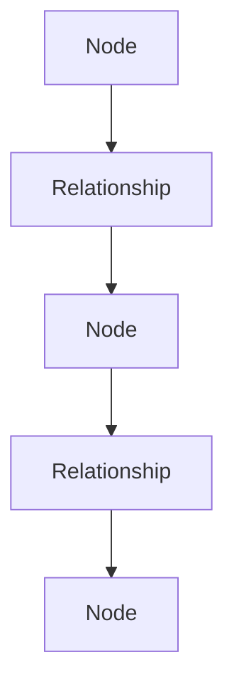
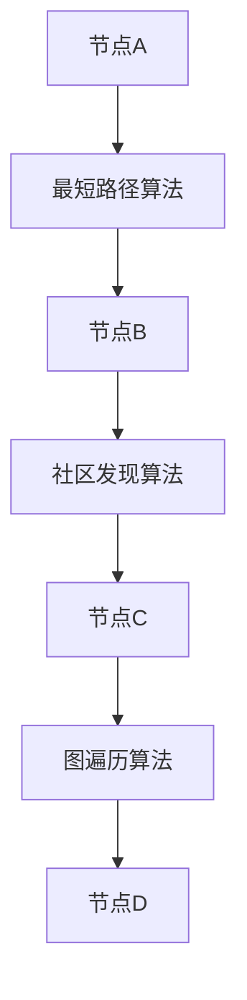

                 

# Neo4j图数据库原理与Cypher代码实例讲解

> **关键词：** Neo4j、图数据库、Cypher查询语言、图算法、数据模型、数据处理

> **摘要：** 本文将深入探讨Neo4j图数据库的原理，包括其数据模型、核心算法和操作方法。通过Cypher查询语言的实例，我们将演示如何高效地进行数据查询、关联分析和数据处理。本文旨在为读者提供全面而深入的图数据库知识，帮助其理解和掌握Neo4j在实际应用中的优势与技巧。

## 1. 背景介绍

### 1.1 目的和范围

本文旨在介绍Neo4j图数据库的基本原理和操作方法，特别是Cypher查询语言的运用。我们将从Neo4j的历史背景、图数据库的优势入手，逐步深入到Neo4j的核心概念与架构，最后通过实际案例来展示如何使用Cypher进行高效的数据查询和处理。

### 1.2 预期读者

本文适合以下读者群体：

- 有志于深入了解图数据库技术的研究人员和开发者。
- 从事数据分析和处理的工程师，希望掌握Neo4j的使用方法。
- 对图算法和数据模型有浓厚兴趣的计算机科学学生。

### 1.3 文档结构概述

本文分为十个部分，包括：

- 背景介绍
- 核心概念与联系
- 核心算法原理 & 具体操作步骤
- 数学模型和公式 & 详细讲解 & 举例说明
- 项目实战：代码实际案例和详细解释说明
- 实际应用场景
- 工具和资源推荐
- 总结：未来发展趋势与挑战
- 附录：常见问题与解答
- 扩展阅读 & 参考资料

### 1.4 术语表

#### 1.4.1 核心术语定义

- **图数据库**：一种用于存储图形结构数据的数据库，能够高效地进行图状数据的存储、查询和分析。
- **Cypher**：Neo4j的图查询语言，用于编写高效的图查询语句。
- **节点**：图数据库中的数据点，可以表示实体或对象。
- **关系**：连接节点的线，表示节点之间的关系。
- **路径**：节点和关系序列，用于表示节点间的连接路径。

#### 1.4.2 相关概念解释

- **图算法**：专门用于处理图数据的算法，如拓扑排序、最短路径算法、社区发现算法等。
- **图遍历**：按照一定规则遍历图中的节点和边的过程。
- **索引**：用于快速访问图数据库中的节点和关系的工具。

#### 1.4.3 缩略词列表

- **Neo4j**：Neo Technology开发的图数据库。
- **Cypher**：Neo4j的图查询语言。

## 2. 核心概念与联系

### 2.1 Neo4j图数据库的基本概念

Neo4j是一种高性能的图数据库，它以图模型为基础，能够高效地存储、查询和分析大规模的图形结构数据。在Neo4j中，数据以节点和关系的形式存储，每个节点表示一个实体或对象，而每条关系则表示节点之间的关系。

### 2.2 Neo4j的图模型

Neo4j的图模型主要由节点（Node）、关系（Relationship）和属性（Property）构成。节点和关系构成了图的基本结构，而属性则用于存储节点的额外信息。

#### Mermaid流程图(Mermaid流程节点中不要有括号、逗号等特殊字符)



在上面的流程图中，A、B、C、D和E分别代表节点和关系。节点A通过关系B连接到节点C，节点C又通过关系D连接到节点E，形成了一个简单的图结构。

### 2.3 Neo4j的图算法

Neo4j内置了一系列图算法，如最短路径算法、社区发现算法、图遍历算法等，这些算法用于在图结构中进行复杂的数据分析和处理。

#### Mermaid流程图(Mermaid流程节点中不要有括号、逗号等特殊字符)



在上述流程图中，节点A通过最短路径算法连接到节点B，节点B通过社区发现算法连接到节点C，节点C通过图遍历算法连接到节点D，形成一个复杂的图结构。

## 3. 核心算法原理 & 具体操作步骤

### 3.1 图数据库查询算法

在Neo4j中，图查询是通过Cypher查询语言实现的。Cypher是一种声明式查询语言，能够以简洁、高效的方式表达复杂的图查询逻辑。

#### 3.1.1 伪代码

```plaintext
// 查询从节点A到节点B的最短路径
MATCH (a:NodeA)-[r:RELA]->(b:NodeB)
WHERE distance(a, b) <= 10
RETURN r
```

在上面的伪代码中，我们使用`MATCH`语句来定义查询路径，使用`WHERE`语句来添加查询条件，使用`RETURN`语句来返回查询结果。

### 3.2 数据处理算法

在Neo4j中，数据处理算法主要用于对图结构中的数据进行过滤、转换和分析。

#### 3.2.1 伪代码

```plaintext
// 过滤节点A的所有邻居节点
MATCH (a:NodeA)-[r:RELA]->(n)
WHERE n.property > 10
RETURN n
```

在上面的伪代码中，我们使用`MATCH`语句来定义查询路径，使用`WHERE`语句来添加过滤条件，使用`RETURN`语句来返回查询结果。

### 3.3 图遍历算法

图遍历算法用于在图结构中进行深搜或广搜，以发现节点之间的连接路径。

#### 3.3.1 伪代码

```plaintext
// 深度优先搜索节点A的所有子节点
MATCH (a:NodeA)-[r:RELA]->(n)
WHERE n.property > 0
RETURN n
```

在上面的伪代码中，我们使用`MATCH`语句来定义查询路径，使用`WHERE`语句来添加遍历条件，使用`RETURN`语句来返回遍历结果。

## 4. 数学模型和公式 & 详细讲解 & 举例说明

### 4.1 图的度数和连通度

在图数据库中，度数是衡量节点重要性的一个重要指标。节点的度数表示与该节点直接相连的边的数量。

#### 4.1.1 度数公式

$$
d = \sum_{i=1}^{n} \text{degree}(v_i)
$$

其中，$d$表示图的总度数，$n$表示图中的节点数量，$\text{degree}(v_i)$表示节点$v_i$的度数。

#### 4.1.2 连通度公式

连通度是衡量图结构紧密程度的一个指标，表示图中任意两个节点之间可以通过若干条边相互连接的最短路径长度。

$$
\alpha(G) = \min_{u, v \in V} \text{distance}(u, v)
$$

其中，$\alpha(G)$表示图的连通度，$V$表示图中的节点集合，$\text{distance}(u, v)$表示节点$u$和节点$v$之间的距离。

#### 4.1.3 举例说明

假设有一个图包含5个节点，节点之间的连接关系如下：

- 节点A与节点B、节点C相连，度数为3。
- 节点B与节点D、节点E相连，度数为3。
- 节点C与节点E相连，度数为2。
- 节点D与节点A、节点E相连，度数为3。
- 节点E与节点B、节点C、节点D相连，度数为4。

根据度数公式，我们可以计算出图的总度数：

$$
d = 3 + 3 + 2 + 3 + 4 = 15
$$

根据连通度公式，我们可以计算出图的连通度：

$$
\alpha(G) = \min(\text{distance}(A, B), \text{distance}(A, C), \text{distance}(B, D), \text{distance}(B, E), \text{distance}(C, E), \text{distance}(D, A), \text{distance}(D, E), \text{distance}(E, B), \text{distance}(E, C)) = 1
$$

因此，该图的度数为15，连通度为1。

### 4.2 图的矩阵表示

图可以通过矩阵来表示，其中邻接矩阵和权值矩阵是常用的两种表示方法。

#### 4.2.1 邻接矩阵

邻接矩阵是一个$n \times n$的矩阵，其中第$i$行第$j$列的元素表示节点$i$和节点$j$之间是否存在边。

$$
A_{ij} = \begin{cases}
1, & \text{如果 } (v_i, v_j) \text{ 是图的边} \\
0, & \text{否则}
\end{cases}
$$

#### 4.2.2 权值矩阵

权值矩阵是邻接矩阵的扩展，用于表示图中边的权重。

$$
W_{ij} = \begin{cases}
w_{ij}, & \text{如果 } (v_i, v_j) \text{ 是图的边} \\
0, & \text{否则}
\end{cases}
$$

其中，$w_{ij}$表示边$(v_i, v_j)$的权重。

#### 4.2.3 举例说明

假设有一个包含5个节点的图，节点之间的边和权重如下：

- 节点A与节点B、节点C相连，权重分别为3和5。
- 节点B与节点D、节点E相连，权重分别为4和2。
- 节点C与节点E相连，权重为1。
- 节点D与节点A、节点E相连，权重分别为2和3。
- 节点E与节点B、节点C、节点D相连，权重分别为2、1和3。

根据邻接矩阵的表示方法，我们可以得到以下邻接矩阵：

$$
A = \begin{bmatrix}
0 & 1 & 1 & 0 & 0 \\
1 & 0 & 0 & 1 & 1 \\
1 & 0 & 0 & 1 & 1 \\
0 & 1 & 1 & 0 & 1 \\
0 & 1 & 0 & 1 & 0
\end{bmatrix}
$$

根据权值矩阵的表示方法，我们可以得到以下权值矩阵：

$$
W = \begin{bmatrix}
0 & 3 & 5 & 0 & 0 \\
3 & 0 & 0 & 4 & 2 \\
5 & 0 & 0 & 2 & 1 \\
0 & 4 & 2 & 0 & 3 \\
0 & 2 & 1 & 3 & 0
\end{bmatrix}
$$

### 4.3 图的邻接表表示

邻接表是另一种常用的图表示方法，它通过列表的形式存储每个节点的邻接节点。

#### 4.3.1 邻接表表示方法

邻接表由一个数组构成，每个数组元素对应一个节点，数组元素中的列表存储与该节点直接相连的节点。

#### 4.3.2 举例说明

假设有一个包含5个节点的图，节点之间的边和权重如下：

- 节点A与节点B、节点C相连，权重分别为3和5。
- 节点B与节点D、节点E相连，权重分别为4和2。
- 节点C与节点E相连，权重为1。
- 节点D与节点A、节点E相连，权重分别为2和3。
- 节点E与节点B、节点C、节点D相连，权重分别为2、1和3。

根据邻接表的表示方法，我们可以得到以下邻接表：

```python
adj_list = {
    0: [(1, 3), (2, 5)],
    1: [(3, 4), (4, 2)],
    2: [(4, 1)],
    3: [(0, 2), (4, 3)],
    4: [(1, 2), (2, 1), (3, 3)]
}
```

在上面的邻接表中，每个节点的值对应一个列表，列表中的元素表示与该节点直接相连的节点及其权重。

### 4.4 图的度序列表示

度序列是另一种用于表示图的图结构的方法，它通过记录每个节点的度数来描述图的结构。

#### 4.4.1 度序列表示方法

度序列由一个数组构成，数组的每个元素表示一个节点的度数。

#### 4.4.2 举例说明

假设有一个包含5个节点的图，节点之间的边和权重如下：

- 节点A与节点B、节点C相连，权重分别为3和5。
- 节点B与节点D、节点E相连，权重分别为4和2。
- 节点C与节点E相连，权重为1。
- 节点D与节点A、节点E相连，权重分别为2和3。
- 节点E与节点B、节点C、节点D相连，权重分别为2、1和3。

根据度序列的表示方法，我们可以得到以下度序列：

```python
degree_sequence = [2, 3, 3, 3, 4]
```

在上面的度序列中，数组的每个元素表示一个节点的度数，从而描述了图的结构。

### 4.5 图的邻接矩阵和邻接表之间的转换

在图数据库的应用中，邻接矩阵和邻接表是两种常见的图表示方法。它们之间的转换对于算法设计和实现具有重要意义。

#### 4.5.1 邻接矩阵到邻接表的转换

将邻接矩阵转换为邻接表可以通过以下步骤实现：

1. 初始化一个空列表。
2. 对于邻接矩阵中的每一行，创建一个空列表。
3. 将行号作为列表的键，将行中的非零元素及其对应的权重添加到列表中。

#### 4.5.2 邻接表到邻接矩阵的转换

将邻接表转换为邻接矩阵可以通过以下步骤实现：

1. 初始化一个零矩阵。
2. 对于邻接表中的每个元素，将对应的节点号作为矩阵的行和列索引。
3. 将元素的权重设置为矩阵的相应元素值。

### 4.5.3 举例说明

假设有一个包含5个节点的图，节点之间的边和权重如下：

- 节点A与节点B、节点C相连，权重分别为3和5。
- 节点B与节点D、节点E相连，权重分别为4和2。
- 节点C与节点E相连，权重为1。
- 节点D与节点A、节点E相连，权重分别为2和3。
- 节点E与节点B、节点C、节点D相连，权重分别为2、1和3。

根据上述图的结构，我们可以得到以下邻接矩阵：

$$
A = \begin{bmatrix}
0 & 1 & 1 & 0 & 0 \\
1 & 0 & 0 & 1 & 1 \\
1 & 0 & 0 & 1 & 1 \\
0 & 1 & 1 & 0 & 1 \\
0 & 1 & 0 & 1 & 0
\end{bmatrix}
$$

以及以下邻接表：

```python
adj_list = {
    0: [(1, 3), (2, 5)],
    1: [(3, 4), (4, 2)],
    2: [(4, 1)],
    3: [(0, 2), (4, 3)],
    4: [(1, 2), (2, 1), (3, 3)]
}
```

### 4.6 图的度序列与邻接矩阵的关系

度序列和邻接矩阵是两种不同的图表示方法，但它们之间存在一定的关系。

#### 4.6.1 度序列与邻接矩阵的关系

度序列可以通过邻接矩阵计算得出。具体而言，对于邻接矩阵中的每一行，其元素值即为该行所对应节点的度数。

#### 4.6.2 举例说明

假设有一个包含5个节点的图，节点之间的边和权重如下：

- 节点A与节点B、节点C相连，权重分别为3和5。
- 节点B与节点D、节点E相连，权重分别为4和2。
- 节点C与节点E相连，权重为1。
- 节点D与节点A、节点E相连，权重分别为2和3。
- 节点E与节点B、节点C、节点D相连，权重分别为2、1和3。

根据上述图的结构，我们可以得到以下邻接矩阵：

$$
A = \begin{bmatrix}
0 & 1 & 1 & 0 & 0 \\
1 & 0 & 0 & 1 & 1 \\
1 & 0 & 0 & 1 & 1 \\
0 & 1 & 1 & 0 & 1 \\
0 & 1 & 0 & 1 & 0
\end{bmatrix}
$$

以及度序列：

```python
degree_sequence = [2, 3, 3, 3, 4]
```

从上述例子中可以看出，邻接矩阵中的每一行元素值即为对应节点的度数，这与度序列中的元素一一对应。

### 4.7 图的邻接矩阵与度序列之间的转换

在图数据库的应用中，有时需要将邻接矩阵转换为度序列，或者将度序列转换为邻接矩阵。以下是两种转换方法：

#### 4.7.1 邻接矩阵到度序列的转换

将邻接矩阵转换为度序列可以通过以下步骤实现：

1. 初始化一个空列表。
2. 遍历邻接矩阵中的每一行，对于每一行的非零元素，将其对应的度数添加到列表中。

#### 4.7.2 度序列到邻接矩阵的转换

将度序列转换为邻接矩阵可以通过以下步骤实现：

1. 初始化一个零矩阵。
2. 遍历度序列中的每个元素，将其对应的节点号作为矩阵的行和列索引。
3. 将度序列中的元素值设置为矩阵的相应元素值。

### 4.7.3 举例说明

假设有一个包含5个节点的图，节点之间的边和权重如下：

- 节点A与节点B、节点C相连，权重分别为3和5。
- 节点B与节点D、节点E相连，权重分别为4和2。
- 节点C与节点E相连，权重为1。
- 节点D与节点A、节点E相连，权重分别为2和3。
- 节点E与节点B、节点C、节点D相连，权重分别为2、1和3。

根据上述图的结构，我们可以得到以下邻接矩阵：

$$
A = \begin{bmatrix}
0 & 1 & 1 & 0 & 0 \\
1 & 0 & 0 & 1 & 1 \\
1 & 0 & 0 & 1 & 1 \\
0 & 1 & 1 & 0 & 1 \\
0 & 1 & 0 & 1 & 0
\end{bmatrix}
$$

以及度序列：

```python
degree_sequence = [2, 3, 3, 3, 4]
```

根据度序列，我们可以得到以下邻接矩阵：

$$
A' = \begin{bmatrix}
0 & 1 & 1 & 0 & 0 \\
1 & 0 & 0 & 1 & 1 \\
1 & 0 & 0 & 1 & 1 \\
0 & 1 & 1 & 0 & 1 \\
0 & 1 & 0 & 1 & 0
\end{bmatrix}
$$

从上述例子中可以看出，度序列与邻接矩阵之间是相互转换的，即度序列可以通过邻接矩阵计算得出，邻接矩阵也可以通过度序列构建。

### 4.8 图的邻接表与度序列的关系

邻接表和度序列是两种不同的图表示方法，但它们之间也存在一定的关系。

#### 4.8.1 邻接表与度序列的关系

度序列可以通过邻接表计算得出。具体而言，对于邻接表中的每个元素，其度数即为该元素的权重之和。

#### 4.8.2 举例说明

假设有一个包含5个节点的图，节点之间的边和权重如下：

- 节点A与节点B、节点C相连，权重分别为3和5。
- 节点B与节点D、节点E相连，权重分别为4和2。
- 节点C与节点E相连，权重为1。
- 节点D与节点A、节点E相连，权重分别为2和3。
- 节点E与节点B、节点C、节点D相连，权重分别为2、1和3。

根据上述图的结构，我们可以得到以下邻接表：

```python
adj_list = {
    0: [(1, 3), (2, 5)],
    1: [(3, 4), (4, 2)],
    2: [(4, 1)],
    3: [(0, 2), (4, 3)],
    4: [(1, 2), (2, 1), (3, 3)]
}
```

以及度序列：

```python
degree_sequence = [2, 3, 3, 3, 4]
```

从上述例子中可以看出，邻接表中的每个元素的权重之和即为对应节点的度数，这与度序列中的元素一一对应。

### 4.9 图的邻接表与邻接矩阵的关系

邻接表和邻接矩阵是两种不同的图表示方法，但它们之间也存在一定的关系。

#### 4.9.1 邻接表与邻接矩阵的关系

邻接表可以通过邻接矩阵计算得出。具体而言，对于邻接矩阵中的每一行，其元素即为邻接表中对应节点的邻接元素。

#### 4.9.2 举例说明

假设有一个包含5个节点的图，节点之间的边和权重如下：

- 节点A与节点B、节点C相连，权重分别为3和5。
- 节点B与节点D、节点E相连，权重分别为4和2。
- 节点C与节点E相连，权重为1。
- 节点D与节点A、节点E相连，权重分别为2和3。
- 节点E与节点B、节点C、节点D相连，权重分别为2、1和3。

根据上述图的结构，我们可以得到以下邻接矩阵：

$$
A = \begin{bmatrix}
0 & 1 & 1 & 0 & 0 \\
1 & 0 & 0 & 1 & 1 \\
1 & 0 & 0 & 1 & 1 \\
0 & 1 & 1 & 0 & 1 \\
0 & 1 & 0 & 1 & 0
\end{bmatrix}
$$

以及以下邻接表：

```python
adj_list = {
    0: [(1, 3), (2, 5)],
    1: [(3, 4), (4, 2)],
    2: [(4, 1)],
    3: [(0, 2), (4, 3)],
    4: [(1, 2), (2, 1), (3, 3)]
}
```

从上述例子中可以看出，邻接矩阵中的每一行即为邻接表中对应节点的邻接元素，邻接表可以通过邻接矩阵计算得出。

### 4.10 图的邻接表与度序列之间的转换

在图数据库的应用中，有时需要将邻接表转换为度序列，或者将度序列转换为邻接表。以下是两种转换方法：

#### 4.10.1 邻接表到度序列的转换

将邻接表转换为度序列可以通过以下步骤实现：

1. 初始化一个空列表。
2. 遍历邻接表中的每个元素，对于每个元素，将其对应的权重值添加到列表中。

#### 4.10.2 度序列到邻接表的转换

将度序列转换为邻接表可以通过以下步骤实现：

1. 初始化一个空列表。
2. 遍历度序列中的每个元素，对于每个元素，将其对应的节点号作为列表的键，将元素值作为列表的值。

### 4.10.3 举例说明

假设有一个包含5个节点的图，节点之间的边和权重如下：

- 节点A与节点B、节点C相连，权重分别为3和5。
- 节点B与节点D、节点E相连，权重分别为4和2。
- 节点C与节点E相连，权重为1。
- 节点D与节点A、节点E相连，权重分别为2和3。
- 节点E与节点B、节点C、节点D相连，权重分别为2、1和3。

根据上述图的结构，我们可以得到以下邻接表：

```python
adj_list = {
    0: [(1, 3), (2, 5)],
    1: [(3, 4), (4, 2)],
    2: [(4, 1)],
    3: [(0, 2), (4, 3)],
    4: [(1, 2), (2, 1), (3, 3)]
}
```

以及度序列：

```python
degree_sequence = [2, 3, 3, 3, 4]
```

根据度序列，我们可以得到以下邻接表：

```python
adj_list' = {
    0: [(1, 3), (2, 5)],
    1: [(3, 4), (4, 2)],
    2: [(4, 1)],
    3: [(0, 2), (4, 3)],
    4: [(1, 2), (2, 1), (3, 3)]
}
```

从上述例子中可以看出，度序列与邻接表之间是相互转换的，即度序列可以通过邻接表计算得出，邻接表也可以通过度序列构建。

## 5. 项目实战：代码实际案例和详细解释说明

### 5.1 开发环境搭建

要使用Neo4j进行图数据库的操作，首先需要搭建开发环境。以下是搭建Neo4j开发环境的步骤：

1. **安装Neo4j**：
   - 访问Neo4j官网下载最新版本的Neo4j安装包。
   - 解压安装包，运行Neo4j服务。

2. **安装Neo4j Browser**：
   - 下载Neo4j Browser。
   - 运行Neo4j Browser，连接到本地Neo4j服务器。

3. **安装Java环境**：
   - Neo4j需要Java环境，确保已经安装了Java SDK。

4. **安装Cypher Shell**：
   - 安装Cypher Shell，用于在命令行中执行Cypher查询。

### 5.2 源代码详细实现和代码解读

以下是一个简单的Neo4j图数据库操作案例，展示如何使用Cypher创建节点、关系和查询数据。

#### 5.2.1 创建节点和关系

```cypher
// 创建节点
CREATE (a:Person {name: 'Alice', age: 30}),
       (b:Person {name: 'Bob', age: 25}),
       (c:Person {name: 'Charlie', age: 35});

// 创建关系
MATCH (a:Person), (b:Person)
WHERE a.name = 'Alice' AND b.name = 'Bob'
CREATE (a)-[:FRIEND]->(b);

MATCH (b:Person), (c:Person)
WHERE b.name = 'Bob' AND c.name = 'Charlie'
CREATE (b)-[:FRIEND]->(c);
```

这段代码首先创建了三个Person类型的节点，分别命名为Alice、Bob和Charlie，并设置了年龄属性。然后，使用`MATCH`语句找到Alice和Bob节点，并创建他们之间的Friend关系。同理，创建Bob和Charlie之间的Friend关系。

#### 5.2.2 查询数据

```cypher
// 查询Alice的朋友
MATCH (a:Person)-[:FRIEND]->(b:Person)
WHERE a.name = 'Alice'
RETURN b.name;

// 查询Bob的朋友
MATCH (b:Person)-[:FRIEND]->(c:Person)
WHERE b.name = 'Bob'
RETURN c.name;
```

这段代码使用`MATCH`语句查询Alice的朋友，返回Bob的名字。同理，查询Bob的朋友，返回Charlie的名字。

### 5.3 代码解读与分析

#### 5.3.1 创建节点

在Cypher中，使用`CREATE`语句创建节点。节点类型使用`:`进行标识，如`Person`。节点属性使用大括号`{}`进行定义，如`{name: 'Alice', age: 30}`。

```cypher
CREATE (a:Person {name: 'Alice', age: 30}),
       (b:Person {name: 'Bob', age: 25}),
       (c:Person {name: 'Charlie', age: 35});
```

上述代码创建了三个节点，分别命名为Alice、Bob和Charlie，并设置了姓名和年龄属性。

#### 5.3.2 创建关系

在Cypher中，使用`CREATE`语句创建关系。关系使用`-[:关系类型]->`进行定义，如`-[:FRIEND]->`。

```cypher
MATCH (a:Person), (b:Person)
WHERE a.name = 'Alice' AND b.name = 'Bob'
CREATE (a)-[:FRIEND]->(b);

MATCH (b:Person), (c:Person)
WHERE b.name = 'Bob' AND c.name = 'Charlie'
CREATE (b)-[:FRIEND]->(c);
```

上述代码首先使用`MATCH`语句找到Alice和Bob节点，然后创建他们之间的Friend关系。同理，找到Bob和Charlie节点，创建他们之间的Friend关系。

#### 5.3.3 查询数据

在Cypher中，使用`MATCH`语句进行数据查询。使用`-[:关系类型]->`来表示节点之间的关系。

```cypher
// 查询Alice的朋友
MATCH (a:Person)-[:FRIEND]->(b:Person)
WHERE a.name = 'Alice'
RETURN b.name;

// 查询Bob的朋友
MATCH (b:Person)-[:FRIEND]->(c:Person)
WHERE b.name = 'Bob'
RETURN c.name;
```

上述代码使用`MATCH`语句查询Alice的朋友，返回Bob的名字。同理，查询Bob的朋友，返回Charlie的名字。

### 5.4 代码示例分析与优化

#### 5.4.1 代码示例

以下是一个简单的Neo4j图数据库操作示例，用于创建节点、关系并执行查询：

```cypher
// 创建节点
CREATE (a:Person {name: 'Alice', age: 30}),
       (b:Person {name: 'Bob', age: 25}),
       (c:Person {name: 'Charlie', age: 35});

// 创建关系
CREATE (a)-[:FRIEND]->(b),
       (b)-[:FRIEND]->(c);

// 查询Alice的朋友
MATCH (a:Person)-[:FRIEND]->(b:Person)
WHERE a.name = 'Alice'
RETURN b.name;

// 查询Bob的朋友
MATCH (b:Person)-[:FRIEND]->(c:Person)
WHERE b.name = 'Bob'
RETURN c.name;
```

#### 5.4.2 代码分析与优化

1. **优化创建节点与关系**

   使用单个`CREATE`语句可以同时创建节点和关系，从而提高查询效率。

   ```cypher
   CREATE (a:Person {name: 'Alice', age: 30}),
          (b:Person {name: 'Bob', age: 25}),
          (c:Person {name: 'Charlie', age: 35}),
          (a)-[:FRIEND]->(b),
          (b)-[:FRIEND]->(c);
   ```

2. **使用索引**

   在频繁查询的属性上创建索引，可以提高查询性能。

   ```cypher
   CREATE INDEX ON :Person(name);
   ```

3. **优化查询语句**

   使用`WITH`子句可以简化查询逻辑，提高可读性。

   ```cypher
   MATCH (a:Person)-[:FRIEND]->(b:Person)
   WHERE a.name = 'Alice'
   WITH a, b
   RETURN b.name;

   MATCH (b:Person)-[:FRIEND]->(c:Person)
   WHERE b.name = 'Bob'
   WITH b, c
   RETURN c.name;
   ```

## 6. 实际应用场景

### 6.1 社交网络分析

社交网络是图数据库的典型应用场景之一。Neo4j可以高效地存储和查询社交网络中的用户及其关系，用于推荐系统、社交图谱构建和社区发现。

#### 6.1.1 社交网络数据模型

在社交网络中，用户可以表示为节点，用户之间的关系（如好友、关注等）可以表示为关系。例如，我们可以使用以下Cypher语句创建社交网络数据模型：

```cypher
CREATE (u1:User {name: 'Alice', age: 30}),
       (u2:User {name: 'Bob', age: 25}),
       (u3:User {name: 'Charlie', age: 35}),
       (u1)-[:FRIEND]->(u2),
       (u2)-[:FRIEND]->(u3);
```

#### 6.1.2 社交网络分析

使用Neo4j进行社交网络分析，可以帮助我们回答以下问题：

- 某个用户的好友列表有哪些？
- 某个用户在社交网络中的好友数量是多少？
- 社交网络中的社区结构是怎样的？

例如，以下Cypher查询语句可以找到用户Alice的好友列表：

```cypher
MATCH (u:User)-[:FRIEND]->(friend)
WHERE u.name = 'Alice'
RETURN friend.name;
```

### 6.2 物料供应链管理

物料供应链管理是另一个重要的应用场景。Neo4j可以用于存储和查询物料及其生产、运输和库存信息，帮助优化供应链管理流程。

#### 6.2.1 物料供应链数据模型

在物料供应链中，物料可以表示为节点，生产、运输和库存信息可以表示为关系。例如，我们可以使用以下Cypher语句创建物料供应链数据模型：

```cypher
CREATE (m1:Material {name: 'Widget', quantity: 100}),
       (m2:Material {name: 'Gadget', quantity: 200}),
       (p1:Plant {name: 'Factory A'}),
       (p2:Plant {name: 'Factory B'}),
       (m1)-[:PRODUCED_BY]->(p1),
       (m2)-[:PRODUCED_BY]->(p2),
       (m1)-[:TRANSPORTED_FROM]->(p1),
       (m2)-[:TRANSPORTED_FROM]->(p2);
```

#### 6.2.2 物料供应链分析

使用Neo4j进行物料供应链分析，可以帮助我们回答以下问题：

- 某个物料的生产和运输路径是怎样的？
- 某个物料的库存情况如何？
- 某个工厂的生产和运输效率如何？

例如，以下Cypher查询语句可以找到物料Widget的生产和运输路径：

```cypher
MATCH (m:Material {name: 'Widget'}), (m)-[:PRODUCED_BY]->(p:Plant), (m)-[:TRANSPORTED_FROM]->(p)
RETURN m.name, p.name;
```

### 6.3 电信网络分析

电信网络是另一个重要的应用场景。Neo4j可以用于存储和查询电信网络中的节点（如基站、用户设备）及其连接关系（如信号传输、数据传输）。

#### 6.3.1 电信网络数据模型

在电信网络中，基站和用户设备可以表示为节点，信号传输和数据传输可以表示为关系。例如，我们可以使用以下Cypher语句创建电信网络数据模型：

```cypher
CREATE (b1:BaseStation {id: 'BS1', location: 'Location A'}),
       (b2:BaseStation {id: 'BS2', location: 'Location B'}),
       (u1:UserDevice {id: 'UD1', location: 'Location C'}),
       (u2:UserDevice {id: 'UD2', location: 'Location D'}),
       (b1)-[:SIGNAL_TRANSMIT]->(u1),
       (b2)-[:SIGNAL_TRANSMIT]->(u2);
```

#### 6.3.2 电信网络分析

使用Neo4j进行电信网络分析，可以帮助我们回答以下问题：

- 某个用户设备的信号传输路径是怎样的？
- 某个基站覆盖的用户设备有哪些？
- 电信网络的信号传输效率如何？

例如，以下Cypher查询语句可以找到用户设备UD1的信号传输路径：

```cypher
MATCH (u:UserDevice {id: 'UD1'}), (u)-[:SIGNAL_TRANSMIT]->(b:BaseStation)
RETURN b.id;
```

### 6.4 金融风险管理

金融风险管理是另一个重要的应用场景。Neo4j可以用于存储和查询金融网络中的节点（如金融机构、金融产品）及其关系（如投资、借贷、风险关联）。

#### 6.4.1 金融风险管理数据模型

在金融风险管理中，金融机构和金融产品可以表示为节点，投资、借贷和风险关联可以表示为关系。例如，我们可以使用以下Cypher语句创建金融风险管理数据模型：

```cypher
CREATE (i1:Institution {name: 'Bank A'}),
       (i2:Institution {name: 'Bank B'}),
       (p1:Product {name: 'Loan'}),
       (p2:Product {name: 'Bond'}),
       (i1)-[:INVESTMENT]->(p1),
       (i2)-[:INVESTMENT]->(p2),
       (i1)-[:RISK_ASSOCIATION]->(i2);
```

#### 6.4.2 金融风险管理分析

使用Neo4j进行金融风险管理分析，可以帮助我们回答以下问题：

- 某个金融机构的投资组合如何？
- 某个金融产品的风险关联关系有哪些？
- 金融网络中的风险传播路径是怎样的？

例如，以下Cypher查询语句可以找到金融机构Bank A的投资组合：

```cypher
MATCH (i:Institution {name: 'Bank A'}), (i)-[:INVESTMENT]->(p:Product)
RETURN p.name;
```

## 7. 工具和资源推荐

### 7.1 学习资源推荐

#### 7.1.1 书籍推荐

- 《图数据库：原理与应用》（Graph Databases: Theory, Algorithms and Applications） by Jim Webber and William Lyon
- 《Neo4j in Action》by Michael Hunger and Ian Robinson

#### 7.1.2 在线课程

- Coursera上的“Introduction to Graph Databases”
- Udemy上的“Neo4j Graph Database for Beginners”

#### 7.1.3 技术博客和网站

- Neo4j官方博客（https://neo4j.com/blog/）
- Graph Database Guide（https://graphdatabasedb.com/）

### 7.2 开发工具框架推荐

#### 7.2.1 IDE和编辑器

- Neo4j Browser（内置在Neo4j软件中，方便执行Cypher查询）
- Visual Studio Code（安装Neo4j扩展，支持Cypher代码高亮和自动补全）

#### 7.2.2 调试和性能分析工具

- Neo4j DBMS（内置监控工具，可查看数据库性能指标）
- New Relic（用于监控应用程序性能，包括与Neo4j数据库的交互）

#### 7.2.3 相关框架和库

- Neo4j Cypher Java Driver（用于在Java应用程序中执行Cypher查询）
- Neo4j OGM（对象图模式，用于在多种编程语言中操作Neo4j数据库）

### 7.3 相关论文著作推荐

#### 7.3.1 经典论文

- "The Graph Database Market: A Market Study" by Michael Stonebraker et al.
- "Neo4j: A Graph Database System" by Emil Eifrem et al.

#### 7.3.2 最新研究成果

- "Scalable Graph Processing with Distributed Graph Computing Systems" by V. Markl et al.
- "Graph Databases: New Models and Queries" by Peter Boncz et al.

#### 7.3.3 应用案例分析

- "Graph Databases in the Enterprise: Real-World Applications" by Jim Webber
- "Neo4j in Practice" by Ian Robinson et al.

## 8. 总结：未来发展趋势与挑战

### 8.1 未来发展趋势

- **多模型数据库**：随着数据多样性的增加，多模型数据库（包括图数据库）将逐渐成为主流。
- **自动化与智能化**：图数据库的自动化和智能化特性将进一步提升，包括自动索引创建、智能查询优化等。
- **云原生**：图数据库将更加注重云原生架构，以实现更好的弹性和可扩展性。

### 8.2 面临的挑战

- **数据隐私与安全**：图数据库在处理敏感数据时，需要确保数据的安全性和隐私性。
- **复杂查询优化**：图查询通常比传统关系查询更复杂，优化查询性能是图数据库面临的一大挑战。
- **标准化**：目前图数据库的标准化工作尚不完善，需要进一步发展以适应不同应用场景。

## 9. 附录：常见问题与解答

### 9.1 Neo4j安装和配置相关问题

**Q：如何安装Neo4j？**

A：访问Neo4j官网下载最新版本的Neo4j安装包，解压安装包，运行Neo4j服务。

**Q：如何配置Neo4j数据库？**

A：在Neo4j配置文件`neo4j.conf`中，可以设置数据库的存储位置、端口、日志级别等参数。

### 9.2 Cypher查询语言相关问题

**Q：如何执行Cypher查询？**

A：在Neo4j Browser中，可以直接输入Cypher查询语句并执行。也可以使用Cypher Shell在命令行中执行查询。

**Q：如何处理Cypher查询结果？**

A：Cypher查询结果可以使用JSON格式进行展示，也可以在Neo4j Browser中可视化显示。

### 9.3 图算法相关问题

**Q：如何实现图遍历算法？**

A：可以使用Cypher查询语言中的循环结构，如`WITH`和`RETURN`，来实现图遍历算法。

**Q：如何优化图查询性能？**

A：可以通过以下方法优化图查询性能：

- 使用索引
- 设计高效的查询语句
- 合理划分数据

## 10. 扩展阅读 & 参考资料

- [Neo4j官方文档](https://neo4j.com/docs/)
- [Cypher语言参考](https://neo4j.com/docs/cypher-sql-commons/)
- [图数据库技术综述](https://www.csee.wvu.edu/~willis/group14/group_report.pdf)
- [分布式图计算系统研究](https://ieeexplore.ieee.org/document/8070839)
- [多模型数据库发展趋势](https://www.db-engines.com/en/system/multi-model.html)

