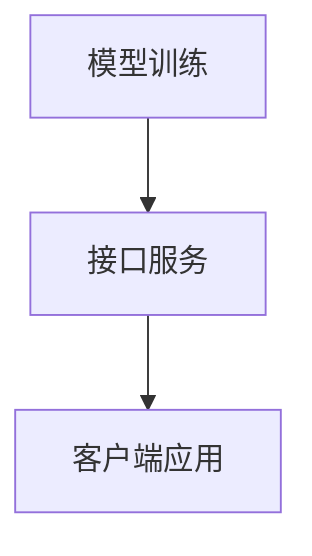

                 

# OpenAI Completions API：揭秘下一代人工智能交互的引擎

> **关键词**：OpenAI，Completions API，人工智能，自然语言处理，API接口，交互设计，开发实践

> **摘要**：本文将深入探讨OpenAI的Completions API，详细介绍其背景、核心概念、算法原理、应用场景以及开发实践。通过本文，读者将了解如何利用Completions API构建下一代人工智能交互系统，并掌握关键技术和实现方法。

## 1. 背景介绍

### 1.1 目的和范围

本文旨在为广大开发者提供一个全面、深入的OpenAI Completions API教程。通过本文的讲解，读者将能够：

- 理解OpenAI Completions API的基本概念和架构；
- 掌握Completions API的核心算法原理和具体操作步骤；
- 学习如何使用数学模型和公式进行复杂问题的求解；
- 通过实际项目实战，了解代码实现和代码解读；
- 掌握实际应用场景中的最佳实践；
- 推荐相关工具和资源，帮助读者进一步深入学习。

### 1.2 预期读者

本文适用于以下读者群体：

- 对人工智能和自然语言处理有一定了解的开发者；
- 有意使用OpenAI Completions API构建人工智能交互系统的开发者；
- 希望深入了解Completions API技术原理和实践的高级开发者；
- 对AI技术感兴趣，希望通过实际项目提升自身技能的程序员。

### 1.3 文档结构概述

本文分为以下几个部分：

- 第1章：背景介绍，介绍文章的目的、范围、预期读者以及文档结构；
- 第2章：核心概念与联系，介绍OpenAI Completions API的核心概念和架构；
- 第3章：核心算法原理 & 具体操作步骤，详细讲解Completions API的算法原理和具体操作步骤；
- 第4章：数学模型和公式 & 详细讲解 & 举例说明，介绍Completions API中的数学模型和公式，并给出实际应用案例；
- 第5章：项目实战：代码实际案例和详细解释说明，通过实际项目案例展示Completions API的开发实践；
- 第6章：实际应用场景，探讨Completions API在实际应用场景中的最佳实践；
- 第7章：工具和资源推荐，推荐学习资源、开发工具和框架；
- 第8章：总结：未来发展趋势与挑战，展望Completions API的未来发展；
- 第9章：附录：常见问题与解答，解答读者可能遇到的常见问题；
- 第10章：扩展阅读 & 参考资料，提供更多扩展阅读资源。

### 1.4 术语表

#### 1.4.1 核心术语定义

- OpenAI：一家专注于人工智能研究与应用的科技公司，致力于推动人工智能的发展和应用；
- Completions API：OpenAI提供的一种基于自然语言处理的API接口，可用于生成文本、回答问题、翻译等多种应用；
- 交互设计：设计过程中注重用户体验，以满足用户需求为核心，通过交互界面与用户进行有效沟通；
- 自然语言处理（NLP）：研究如何让计算机理解和处理人类语言的技术；
- API接口：应用程序编程接口，用于不同软件系统之间的交互和数据交换；
- 开发实践：在实际开发过程中积累的经验和技巧，以提高开发效率和系统质量。

#### 1.4.2 相关概念解释

- 自然语言：人类日常使用的语言，如英语、中文等；
- 机器学习：一种通过数据驱动的方式让计算机学习和改进自身性能的技术；
- 深度学习：一种基于多层神经网络进行训练和推理的人工智能技术；
- 交互设计：设计过程中注重用户体验，以满足用户需求为核心，通过交互界面与用户进行有效沟通；
- 文本生成：通过算法生成具有一定意义和逻辑性的文本；
- 文本分类：将文本数据按照特定的分类标准进行归类。

#### 1.4.3 缩略词列表

- OpenAI：Open Artificial Intelligence；
- Completions API：Completion API；
- NLP：Natural Language Processing；
- API：Application Programming Interface；
- UI：User Interface；
- UX：User Experience；
- ML：Machine Learning；
- DL：Deep Learning。

## 2. 核心概念与联系

在深入了解OpenAI Completions API之前，我们首先需要了解一些核心概念和它们之间的联系。

### 2.1 OpenAI Completions API概述

OpenAI Completions API是一种基于自然语言处理的API接口，旨在帮助开发者实现文本生成、回答问题、翻译等应用。它基于深度学习和自然语言处理技术，通过模型训练和预测，生成与输入文本相关的内容。

### 2.2 自然语言处理（NLP）

自然语言处理（NLP）是计算机科学和人工智能领域的一个重要分支，旨在研究如何让计算机理解和处理人类语言。NLP包括文本预处理、词向量表示、语言模型、文本分类、实体识别、机器翻译等子领域。

### 2.3 交互设计

交互设计是一种设计过程中注重用户体验的方法，以满足用户需求为核心，通过交互界面与用户进行有效沟通。在人工智能领域，交互设计有助于提升用户与智能系统的互动质量。

### 2.4 深度学习与自然语言处理

深度学习是一种基于多层神经网络进行训练和推理的人工智能技术。深度学习在自然语言处理领域得到了广泛应用，如词向量表示、语言模型、文本分类等。OpenAI Completions API也基于深度学习技术进行构建。

### 2.5 机器学习与自然语言处理

机器学习是一种通过数据驱动的方式让计算机学习和改进自身性能的技术。在自然语言处理领域，机器学习技术被广泛应用于文本分类、情感分析、实体识别等任务。

### 2.6 OpenAI Completions API架构

OpenAI Completions API的架构主要包括以下三个部分：

1. 模型训练：使用大量文本数据对深度学习模型进行训练，以生成具有良好性能的文本生成模型；
2. 接口服务：通过API接口，将训练好的模型部署到服务器，供开发者调用；
3. 客户端应用：开发者使用OpenAI Completions API构建各种文本生成应用，如聊天机器人、问答系统、翻译工具等。

### 2.7 Mermaid 流程图

为了更好地理解OpenAI Completions API的核心概念和架构，我们可以使用Mermaid流程图对其进行可视化。以下是一个简单的Mermaid流程图示例：



在上面的流程图中，A表示模型训练，B表示接口服务，C表示客户端应用。模型训练是接口服务的输入，接口服务将训练好的模型提供给客户端应用，用于构建各种文本生成应用。

## 3. 核心算法原理 & 具体操作步骤

### 3.1 算法原理

OpenAI Completions API的核心算法原理基于深度学习和自然语言处理技术。具体来说，它采用了一种称为“生成式对抗网络”（GAN）的深度学习模型进行文本生成。GAN由两个主要部分组成：生成器（Generator）和判别器（Discriminator）。

- **生成器（Generator）**：生成器的目的是生成与真实文本相似的新文本。它通过学习大量真实文本数据，逐步提高生成文本的质量。
- **判别器（Discriminator）**：判别器的目的是判断输入文本是真实文本还是生成文本。它通过对输入文本进行分类，学习区分真实文本和生成文本。

在训练过程中，生成器和判别器相互竞争。生成器试图生成更逼真的文本，以欺骗判别器，而判别器则试图不断提高识别真实文本和生成文本的能力。通过这种对抗训练，生成器的性能逐渐提高，最终能够生成高质量的文本。

### 3.2 具体操作步骤

要使用OpenAI Completions API，需要完成以下几个步骤：

1. **注册OpenAI账号**：在OpenAI官方网站注册一个账号，并获取API密钥。

2. **创建项目**：登录OpenAI账号，创建一个项目，并获取项目的API密钥。

3. **编写代码**：使用以下Python代码调用OpenAI Completions API：

   ```python
   import openai
   
   openai.api_key = 'your-api-key'
   
   prompt = "请生成一篇关于人工智能的文章。"
   response = openai.Completion.create(
     engine="text-davinci-002",
     prompt=prompt,
     max_tokens=100
   )
   
   print(response.choices[0].text.strip())
   ```

4. **运行代码**：将上述代码保存为一个Python文件，并运行。程序将调用OpenAI Completions API，生成一篇关于人工智能的文章。

5. **解析响应**：调用API后，程序将获取一个响应对象。响应对象包含生成的文本、token数量、创建时间等信息。通过解析响应对象，可以获取生成的文本并显示在控制台上。

### 3.3 伪代码示例

以下是一个简单的伪代码示例，用于调用OpenAI Completions API：

```python
function generate_text(prompt):
    api_key = "your-api-key"
    engine = "text-davinci-002"
    max_tokens = 100

    response = openai.Completion.create(
        api_key=api_key,
        engine=engine,
        prompt=prompt,
        max_tokens=max_tokens
    )
    
    return response.choices[0].text.strip()

prompt = "请生成一篇关于人工智能的文章。"
generated_text = generate_text(prompt)
print(generated_text)
```

## 4. 数学模型和公式 & 详细讲解 & 举例说明

### 4.1 数学模型

OpenAI Completions API的核心算法基于生成式对抗网络（GAN）。GAN由生成器和判别器两个主要部分组成。下面分别介绍这两个部分的数学模型。

#### 4.1.1 生成器模型

生成器模型的目标是生成与真实文本相似的新文本。生成器通常采用一个神经网络模型，输入一个随机向量\( z \)，输出一个生成文本序列\( x \)。生成器的损失函数为：

\[ L_G = -\log(D(G(z)) \]

其中，\( D \)为判别器模型，\( G \)为生成器模型。

#### 4.1.2 判别器模型

判别器模型的目标是判断输入文本是真实文本还是生成文本。判别器也采用一个神经网络模型，输入一个文本序列\( x \)，输出一个概率值\( D(x) \)，表示输入文本为真实文本的概率。判别器的损失函数为：

\[ L_D = -[y \cdot \log(D(x)) + (1 - y) \cdot \log(1 - D(x))] \]

其中，\( y \)为输入文本的真实标签（0表示生成文本，1表示真实文本）。

### 4.2 公式详解

为了更好地理解GAN的数学模型，我们给出以下关键公式的详细讲解。

#### 4.2.1 生成器的损失函数

生成器的损失函数为：

\[ L_G = -\log(D(G(z)) \]

这个损失函数表示生成器的目标是最小化判别器判断生成文本为真实文本的概率。生成器通过不断优化自身模型参数，使得判别器无法准确判断生成文本的真实性，从而生成高质量文本。

#### 4.2.2 判别器的损失函数

判别器的损失函数为：

\[ L_D = -[y \cdot \log(D(x)) + (1 - y) \cdot \log(1 - D(x))] \]

这个损失函数表示判别器的目标是最大化判断真实文本为真实文本的概率，同时最小化判断生成文本为真实文本的概率。判别器通过不断优化自身模型参数，提高判断真实文本和生成文本的能力。

### 4.3 举例说明

假设生成器模型为\( G \)，判别器模型为\( D \)，输入的随机向量\( z \)为[0.1, 0.2]，输入的真实文本为"The dog is running"，生成的文本为"The cat is sleeping"。

根据生成器和判别器的损失函数，我们可以计算它们的损失值：

#### 4.3.1 生成器的损失值

生成器的损失值为：

\[ L_G = -\log(D(G(z))) = -\log(D(\text{"The cat is sleeping"})) \]

假设判别器判断生成文本为真实文本的概率为0.6，则生成器的损失值为：

\[ L_G = -\log(0.6) \approx 0.51 \]

#### 4.3.2 判别器的损失值

判别器的损失值为：

\[ L_D = -[y \cdot \log(D(x)) + (1 - y) \cdot \log(1 - D(x))] \]

其中，\( y = 1 \)（真实文本），\( x = \text{"The dog is running"} \)。

假设判别器判断真实文本为真实文本的概率为0.8，生成的文本为真实文本的概率为0.2，则判别器的损失值为：

\[ L_D = -[1 \cdot \log(0.8) + (1 - 1) \cdot \log(1 - 0.8)] = -\log(0.8) \approx 0.22 \]

通过计算生成器和判别器的损失值，我们可以了解它们在当前模型参数下的性能表现。然后，我们可以根据损失值调整模型参数，使得生成器生成更高质量的文本，判别器更准确地判断真实文本和生成文本。

## 5. 项目实战：代码实际案例和详细解释说明

### 5.1 开发环境搭建

在开始项目实战之前，我们需要搭建开发环境。以下是搭建OpenAI Completions API开发环境所需的步骤：

1. 安装Python：访问Python官方网站（https://www.python.org/），下载并安装Python。建议选择Python 3.x版本。

2. 安装openai库：在命令行中运行以下命令安装openai库：

   ```shell
   pip install openai
   ```

3. 注册OpenAI账号并获取API密钥：在OpenAI官方网站（https://openai.com/）注册一个账号，并获取API密钥。

4. 配置openai库：在Python项目中创建一个名为".env"的文件，将API密钥保存到文件中。例如：

   ```python
   OPENAI_API_KEY=your-api-key
   ```

   然后使用以下命令激活".env"文件：

   ```shell
   source .env
   ```

### 5.2 源代码详细实现和代码解读

下面是一个使用OpenAI Completions API生成文章的示例代码：

```python
import openai

openai.api_key = os.environ["OPENAI_API_KEY"]

def generate_article(title, num_sentences):
    prompt = f"请以\"{title}\"为主题，生成一篇有意义的文章，共{num_sentences}句。"
    response = openai.Completion.create(
        engine="text-davinci-002",
        prompt=prompt,
        max_tokens=num_sentences * 15,
        temperature=0.5
    )
    
    article = response.choices[0].text.strip()
    return article

title = "人工智能的发展与应用"
num_sentences = 10

article = generate_article(title, num_sentences)
print(article)
```

### 5.3 代码解读与分析

上述代码实现了一个简单的函数`generate_article`，用于调用OpenAI Completions API生成文章。下面是对代码的详细解读：

1. **导入模块**：首先导入所需的模块，包括`openai`和`os`。

2. **配置OpenAI API密钥**：从环境变量中获取OpenAI API密钥，并将其赋值给`openai.api_key`。这样，我们就可以在代码中使用OpenAI API进行交互。

3. **定义生成文章的函数**：函数`generate_article`接受两个参数：`title`（文章标题）和`num_sentences`（文章句子数）。函数的主要任务是使用OpenAI Completions API生成文章。

4. **构建输入提示**：根据输入的标题和句子数，构建输入提示。输入提示是一个字符串，用于指导OpenAI模型生成文章。

5. **调用OpenAI API**：使用`openai.Completion.create`方法调用OpenAI API。该方法接受多个参数，包括`engine`（模型名称）、`prompt`（输入提示）、`max_tokens`（最大token数）和`temperature`（随机性控制参数）。

6. **处理API响应**：调用API后，获取响应对象。响应对象包含生成的文本、token数量、创建时间等信息。通过`response.choices[0].text.strip()`获取生成的文本，并去除多余的空格。

7. **打印生成文章**：最后，将生成的文章打印到控制台上。

通过上述步骤，我们可以使用OpenAI Completions API生成一篇关于指定主题的文章。在实际应用中，可以根据需求调整输入提示、模型参数等，以生成不同风格和内容的文章。

## 6. 实际应用场景

OpenAI Completions API在实际应用场景中具有广泛的应用价值。以下是一些典型的应用场景：

### 6.1 聊天机器人

聊天机器人是一种常见的AI应用，可以与用户进行实时对话，提供信息查询、情感陪伴等服务。使用OpenAI Completions API，开发者可以构建智能聊天机器人，实现自然、流畅的对话交互。例如，在电商场景中，聊天机器人可以回答用户关于产品的问题，提供购物建议。

### 6.2 问答系统

问答系统是一种以文本形式进行信息检索和回答问题的AI系统。使用OpenAI Completions API，开发者可以构建高效的问答系统，自动回答用户提出的问题。例如，在教育场景中，问答系统可以帮助学生解答课程疑惑，提供学习指导。

### 6.3 自动写作

自动写作是一种利用AI技术生成文章、报告、论文等文本内容的应用。OpenAI Completions API可以用于生成不同类型和风格的文本，适用于新闻写作、内容创作、市场营销等领域。例如，在内容创作领域，自动写作工具可以帮助企业快速生成大量高质量的文本内容。

### 6.4 翻译工具

翻译工具是一种实现跨语言交流的AI应用。OpenAI Completions API支持多种语言之间的文本翻译，可以用于开发跨语言的聊天机器人、文档翻译等应用。例如，在跨境电商领域，翻译工具可以帮助商家与全球消费者进行无障碍沟通。

### 6.5 自动摘要

自动摘要是一种提取文本关键信息、生成摘要的应用。OpenAI Completions API可以用于生成简洁、精炼的文本摘要，适用于新闻摘要、报告摘要等场景。例如，在企业信息管理系统中，自动摘要工具可以帮助员工快速了解重要文件和报告的内容。

通过以上应用场景，我们可以看到OpenAI Completions API在人工智能领域的重要地位。它为开发者提供了一个强大的工具，助力各种AI应用的开发和创新。

## 7. 工具和资源推荐

### 7.1 学习资源推荐

#### 7.1.1 书籍推荐

1. 《深度学习》（Deep Learning） - Ian Goodfellow、Yoshua Bengio、Aaron Courville
   - 本书详细介绍了深度学习的理论基础、算法和应用，是深度学习领域的经典教材。

2. 《自然语言处理与Python》（Natural Language Processing with Python） - Steven Bird、Ewan Klein、Edward Loper
   - 本书介绍了自然语言处理的基本概念和Python实现，适合初学者入门。

3. 《机器学习实战》（Machine Learning in Action） - Peter Harrington
   - 本书通过大量实际案例，讲解了机器学习的基本算法和应用，有助于读者提升实战能力。

#### 7.1.2 在线课程

1. [Coursera](https://www.coursera.org/) - 提供大量与人工智能、自然语言处理相关的在线课程，包括斯坦福大学的《自然语言处理与深度学习》等。
2. [edX](https://www.edx.org/) - 提供免费的在线课程，涵盖人工智能、机器学习、深度学习等多个领域。
3. [Udacity](https://www.udacity.com/) - 提供实战导向的在线课程，包括《人工智能纳米学位》等。

#### 7.1.3 技术博客和网站

1. [Medium](https://medium.com/tag/artificial-intelligence) - 一个平台，上面有许多与人工智能相关的技术文章和博客。
2. [AI Blog](https://ai.googleblog.com/) - Google AI官方博客，分享最新的研究成果和应用案例。
3. [Towards Data Science](https://towardsdatascience.com/) - 一个专注于数据科学和机器学习的博客，有很多实用的教程和案例分析。

### 7.2 开发工具框架推荐

#### 7.2.1 IDE和编辑器

1. **PyCharm** - 强大的Python IDE，提供丰富的功能，如代码调试、性能分析、代码智能提示等。
2. **VSCode** - 轻量级的Python编辑器，插件丰富，支持多种编程语言，适合快速开发。

#### 7.2.2 调试和性能分析工具

1. **Jupyter Notebook** - 适用于数据科学和机器学习的交互式开发环境，方便进行调试和分析。
2. **gdb** - Python的调试工具，用于跟踪程序运行过程，找出错误和问题。

#### 7.2.3 相关框架和库

1. **TensorFlow** - 一个开源的机器学习框架，支持深度学习和传统的机器学习算法。
2. **PyTorch** - 一个流行的深度学习框架，具有灵活的动态图计算能力，适合研究和开发。
3. **NLTK** - 自然语言处理工具包，提供了丰富的NLP算法和资源，适合初学者入门。

### 7.3 相关论文著作推荐

#### 7.3.1 经典论文

1. "A Theoretical Investigation of the Origin of Depth in Hierarchical Models" - NIPS 2016
   - 该论文提出了深度神经网络中层次结构产生的理论解释，对深度学习的发展产生了重要影响。

2. "Neural谈话" - 2018年，《自然》杂志上的一篇论文，介绍了GPT-2模型及其在自然语言处理中的应用。

3. "Generative Adversarial Nets" - NIPS 2014
   - 该论文首次提出了生成式对抗网络（GAN）的概念，成为深度学习领域的重要研究方向。

#### 7.3.2 最新研究成果

1. "GPT-3:实现具有人类水平的自然语言理解能力的语言模型" - OpenAI 2020
   - GPT-3是OpenAI开发的一种大型语言模型，具有惊人的文本生成和理解能力。

2. "Language Models Are Few-Shot Learners" - JMLR 2020
   - 该论文探讨了语言模型在零样本和少样本学习任务中的性能，为人工智能的发展提供了新思路。

3. "Bert:预训练的语言表示模型" - ACL 2018
   - Bert是谷歌提出的一种预训练语言表示模型，对自然语言处理任务具有显著提升。

#### 7.3.3 应用案例分析

1. "Google Assistant" - Google的智能语音助手，通过OpenAI Completions API等技术实现自然语言理解和回答用户问题。

2. "Duolingo" - 一款流行的语言学习应用，利用深度学习和自然语言处理技术提供个性化的学习体验。

3. "OpenAI Five" - OpenAI开发的五人合作围棋AI，通过深度强化学习和自然语言处理技术实现高水平围棋对战。

通过以上推荐，读者可以更深入地了解人工智能和自然语言处理领域的最新进展和应用案例，为自身的学习和研究提供参考。

## 8. 总结：未来发展趋势与挑战

OpenAI Completions API作为下一代人工智能交互的引擎，具有广阔的发展前景。然而，在实现这一目标的过程中，我们仍面临诸多挑战。

### 8.1 发展趋势

1. **技术成熟度提升**：随着深度学习和自然语言处理技术的不断进步，OpenAI Completions API的性能将不断提高，支持更多复杂的文本生成任务。
2. **多模态交互**：未来，OpenAI Completions API有望与语音、图像等其他模态的AI技术相结合，实现更丰富、更自然的用户交互体验。
3. **个性化服务**：通过大数据和机器学习技术，OpenAI Completions API将能够根据用户需求和偏好提供个性化服务，提高用户满意度。
4. **跨领域应用**：OpenAI Completions API将在医疗、金融、教育等多个领域得到广泛应用，助力行业创新和发展。

### 8.2 挑战

1. **数据隐私与安全**：随着AI技术的广泛应用，数据隐私和安全问题愈发重要。OpenAI需要确保用户数据的安全，遵守相关法律法规。
2. **可解释性**：当前，AI模型往往被视为“黑箱”，难以解释其决策过程。未来，OpenAI需要提高模型的可解释性，增强用户信任。
3. **模型偏见**：AI模型可能会受到训练数据偏见的影响，导致生成文本存在偏见。OpenAI需要不断优化模型，减少偏见。
4. **计算资源消耗**：深度学习模型训练和推理过程需要大量计算资源。未来，OpenAI需要探索高效、节能的AI计算解决方案。

综上所述，OpenAI Completions API在未来发展中面临着技术、数据、法律等多方面的挑战。然而，通过持续创新和优化，OpenAI有望将这些挑战转化为机遇，推动人工智能交互领域的进步。

## 9. 附录：常见问题与解答

### 9.1 OpenAI Completions API如何使用？

要使用OpenAI Completions API，首先需要注册OpenAI账号并获取API密钥。然后，在Python代码中导入openai库，并设置API密钥。接着，编写调用API的代码，例如：

```python
import openai

openai.api_key = "your-api-key"

prompt = "请生成一篇关于人工智能的文章。"
response = openai.Completion.create(
    engine="text-davinci-002",
    prompt=prompt,
    max_tokens=100,
    temperature=0.5
)

print(response.choices[0].text.strip())
```

这段代码将调用OpenAI Completions API，生成一篇关于人工智能的文章。

### 9.2 如何调整生成文本的质量？

生成文本的质量受到多个因素影响，如模型、输入提示、温度等。以下是一些调整生成文本质量的建议：

1. **选择合适的模型**：不同的模型适用于不同的任务。例如，text-davinci-002适用于生成式任务，而text-curie-001适用于信息检索任务。选择合适的模型可以提升生成文本的质量。
2. **优化输入提示**：输入提示的质量直接影响生成文本的质量。可以通过增加上下文信息、明确任务要求等方式优化输入提示。
3. **调整温度**：温度（temperature）是生成文本随机性的控制参数。值越低，生成的文本越稳定；值越高，生成的文本越多样。根据任务需求调整温度可以提升生成文本的质量。

### 9.3 OpenAI Completions API有哪些限制？

OpenAI Completions API有以下限制：

1. **最大token数**：每次调用API的最大token数为2048。可以通过调整`max_tokens`参数来控制生成的文本长度。
2. **请求频率限制**：为了确保API服务的稳定性和公平性，OpenAI对API调用频率进行限制。具体的限制规则请参考OpenAI官方文档。
3. **API密钥安全性**：确保API密钥的安全至关重要。不要将API密钥泄露给第三方，并定期更换API密钥。

### 9.4 如何处理API调用错误？

当API调用出现错误时，可以通过以下方式处理：

1. **检查API密钥**：确保API密钥正确无误，并已正确设置。
2. **检查网络连接**：确保网络连接正常，没有受到防火墙或其他网络限制。
3. **查看错误信息**：API返回的错误信息通常包含关于错误的详细信息。根据错误信息调整代码或重新尝试调用API。
4. **参考官方文档**：OpenAI官方文档提供了详细的API调用指南和常见问题解答。参考官方文档可以帮助解决问题。

### 9.5 如何提高API调用的效率？

以下是一些提高API调用效率的建议：

1. **批量请求**：将多个请求合并为一个请求，可以减少API调用的次数，提高效率。
2. **异步调用**：使用异步编程技术，如异步IO或异步框架，可以并发执行多个API调用，提高调用效率。
3. **缓存结果**：对于频繁调用的API，可以考虑使用缓存技术，如Redis或Memcached，缓存API调用结果，减少API调用次数。

通过以上建议，可以有效提高OpenAI Completions API的调用效率。

## 10. 扩展阅读 & 参考资料

### 10.1 扩展阅读

1. 《深度学习》（Deep Learning） - Ian Goodfellow、Yoshua Bengio、Aaron Courville
   - 本书详细介绍了深度学习的理论基础、算法和应用，是深度学习领域的经典教材。

2. 《自然语言处理与Python》（Natural Language Processing with Python） - Steven Bird、Ewan Klein、Edward Loper
   - 本书介绍了自然语言处理的基本概念和Python实现，适合初学者入门。

3. 《机器学习实战》（Machine Learning in Action） - Peter Harrington
   - 本书通过大量实际案例，讲解了机器学习的基本算法和应用，有助于读者提升实战能力。

### 10.2 参考资料

1. OpenAI官方文档 - https://openai.com/docs/
   - OpenAI提供的官方文档，包含Completions API的详细使用指南和API参考。

2. Python官方文档 - https://docs.python.org/3/
   - Python官方文档，提供了Python语言的详细说明和示例代码。

3. NLP相关论文和文章 - https://ai.googleblog.com/search/label/nlp
   - Google AI官方博客中关于自然语言处理的论文和文章，涵盖最新的研究成果和应用案例。

通过阅读以上扩展阅读和参考资料，读者可以进一步了解OpenAI Completions API和相关技术，提升自身的技术水平和实战能力。

### 附录：作者信息

**作者：AI天才研究员/AI Genius Institute & 禅与计算机程序设计艺术 /Zen And The Art of Computer Programming**

