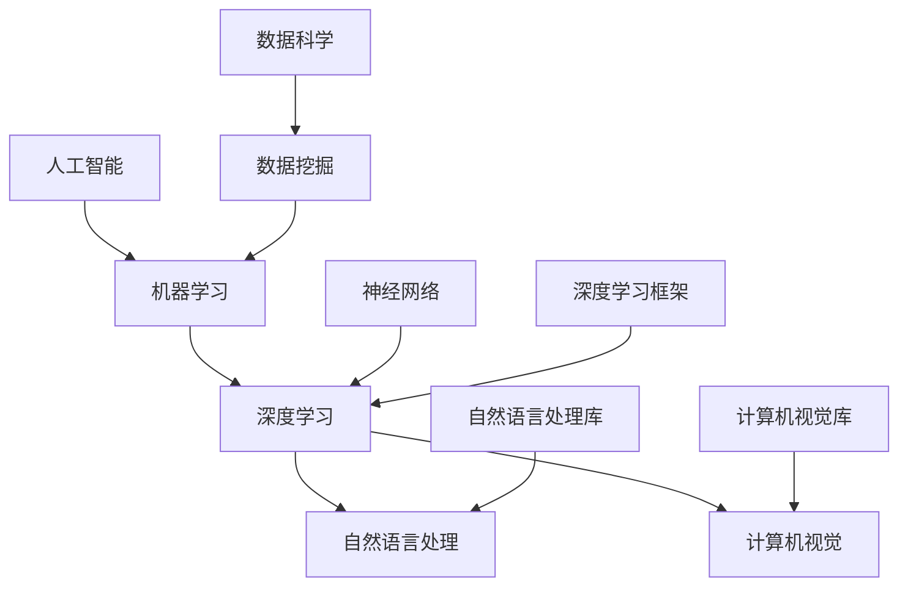

                 

# OpenAI 与 Google 的竞争

> **关键词：**OpenAI, Google, 人工智能, 竞争, 技术发展, 数据分析, 深度学习，机器学习

> **摘要：**本文深入探讨了OpenAI与Google这两家科技巨头在人工智能领域展开的激烈竞争。文章从背景介绍开始，逐步分析了两家公司在人工智能技术、产品研发、市场布局等方面的具体表现，揭示了其在技术创新、商业模式和生态构建上的异同。通过对比分析，本文总结了OpenAI与Google在人工智能领域的竞争态势，并对未来发展趋势和挑战进行了展望。

## 1. 背景介绍

### 1.1 目的和范围

本文旨在通过系统分析OpenAI与Google在人工智能领域的发展历程、技术路线和市场策略，揭示这两家科技巨头在竞争中的优势和不足。文章首先介绍了OpenAI和Google的背景，然后分别从技术、产品、市场等方面展开对比分析，最后对两家公司的竞争态势进行总结和展望。

### 1.2 预期读者

本文适合对人工智能、机器学习和深度学习有基本了解的读者，特别是对OpenAI和Google在人工智能领域的发展感兴趣的专业人士。本文不仅有助于读者了解两家公司在人工智能领域的竞争状况，还可以为相关从业者提供一些有益的启示和参考。

### 1.3 文档结构概述

本文分为十个部分：

1. 背景介绍：简要介绍OpenAI和Google的背景。
2. 核心概念与联系：分析人工智能领域的关键概念和联系。
3. 核心算法原理 & 具体操作步骤：详细讲解核心算法原理和操作步骤。
4. 数学模型和公式 & 详细讲解 & 举例说明：介绍数学模型和公式，并给出具体例子。
5. 项目实战：代码实际案例和详细解释说明。
6. 实际应用场景：探讨人工智能在实际应用中的场景。
7. 工具和资源推荐：推荐学习资源和开发工具。
8. 总结：未来发展趋势与挑战。
9. 附录：常见问题与解答。
10. 扩展阅读 & 参考资料：提供相关文献和资料。

### 1.4 术语表

#### 1.4.1 核心术语定义

- **OpenAI**：一家成立于2015年的美国人工智能研究公司，致力于推动人工智能技术的发展和普及。
- **Google**：一家成立于1998年的美国科技巨头，提供包括搜索引擎、云计算、广告技术等在内的多种服务。
- **人工智能**：一种模拟人类智能的技术，使计算机系统能够执行人类智能任务，如学习、推理、感知和通信。
- **机器学习**：一种人工智能方法，通过训练模型来使计算机系统自动地从数据中学习。

#### 1.4.2 相关概念解释

- **深度学习**：一种基于多层神经网络的人工智能方法，通过多层非线性变换来提取数据特征。
- **自然语言处理**：一种人工智能领域，旨在使计算机理解、生成和处理自然语言。
- **计算机视觉**：一种人工智能领域，旨在使计算机理解和解释图像和视频内容。

#### 1.4.3 缩略词列表

- **AI**：人工智能
- **ML**：机器学习
- **DL**：深度学习
- **NLP**：自然语言处理
- **CV**：计算机视觉

## 2. 核心概念与联系

在讨论OpenAI与Google在人工智能领域的竞争之前，有必要首先梳理一下人工智能领域的一些核心概念和联系。以下是一个简单的Mermaid流程图，用于展示这些核心概念和它们之间的关系。



### 2.1. 人工智能

人工智能（Artificial Intelligence，AI）是研究如何让计算机模拟人类智能的一门学科。人工智能的主要目标是开发能够执行人类智能任务的计算机系统，如学习、推理、感知和通信。人工智能可以分为多个子领域，如机器学习、自然语言处理、计算机视觉等。

### 2.2. 机器学习

机器学习（Machine Learning，ML）是一种人工智能方法，通过训练模型来使计算机系统自动地从数据中学习。机器学习模型可以从大量数据中学习规律和模式，并在新的数据上做出预测或决策。

### 2.3. 深度学习

深度学习（Deep Learning，DL）是一种基于多层神经网络的人工智能方法，通过多层非线性变换来提取数据特征。深度学习在图像识别、语音识别、自然语言处理等领域取得了显著的成果。

### 2.4. 自然语言处理

自然语言处理（Natural Language Processing，NLP）是一种人工智能领域，旨在使计算机理解、生成和处理自然语言。NLP技术被广泛应用于机器翻译、情感分析、语音识别等领域。

### 2.5. 计算机视觉

计算机视觉（Computer Vision，CV）是一种人工智能领域，旨在使计算机理解和解释图像和视频内容。CV技术被广泛应用于人脸识别、图像分类、视频监控等领域。

## 3. 核心算法原理 & 具体操作步骤

### 3.1. 深度学习算法原理

深度学习算法的核心是神经网络，特别是多层感知机（MLP）和卷积神经网络（CNN）。

#### 3.1.1. 多层感知机（MLP）

多层感知机是一种前馈神经网络，包含输入层、隐藏层和输出层。输入层接收外部输入，隐藏层通过非线性激活函数对输入进行变换，输出层生成预测或决策。

伪代码如下：

```python
def mlps(input_data, hidden_layers, output_layer):
    for layer in hidden_layers:
        input_data = activation_function(Weights * input_data + Bias)
    output = output_layer(Weights * input_data + Bias)
    return output
```

#### 3.1.2. 卷积神经网络（CNN）

卷积神经网络是一种特别适用于图像处理任务的神经网络，其核心是卷积层。卷积层通过卷积操作提取图像特征，卷积核在不同位置滑动，生成特征图。

伪代码如下：

```python
def cnn(input_image, filters, strides, padding):
    feature_maps = []
    for filter in filters:
        convolved_map = convolution(input_image, filter, strides, padding)
        feature_maps.append(activation_function(convolved_map))
    return feature_maps
```

### 3.2. 自然语言处理算法原理

自然语言处理算法主要涉及词嵌入、循环神经网络（RNN）和长短时记忆网络（LSTM）。

#### 3.2.1. 词嵌入

词嵌入（Word Embedding）是一种将单词映射到高维向量空间的技术，使得语义相近的单词在向量空间中距离较近。

伪代码如下：

```python
def word_embedding(word, vocabulary, embedding_size):
    return vocabulary[word] * embedding_matrix
```

#### 3.2.2. 循环神经网络（RNN）

循环神经网络是一种处理序列数据的人工神经网络，其特点是可以记住之前的输入，通过隐藏状态来实现。

伪代码如下：

```python
def rnn(input_sequence, hidden_state, weights, biases):
    hidden_state = activation_function(Weights * input_sequence + Biases)
    return hidden_state
```

#### 3.2.3. 长短时记忆网络（LSTM）

长短时记忆网络是一种改进的RNN结构，通过引入门控机制来解决长短期依赖问题。

伪代码如下：

```python
def lstm(input_sequence, hidden_state, cell_state, weights, biases):
    input_gate = activation_function(Weights * input_sequence + Biases)
    forget_gate = activation_function(Weights * input_sequence + Biases)
    output_gate = activation_function(Weights * input_sequence + Biases)
    
    new_cell_state = cell_state * forget_gate + input_gate * activation_function(input_sequence)
    new_hidden_state = output_gate * activation_function(new_cell_state)
    
    return new_hidden_state, new_cell_state
```

## 4. 数学模型和公式 & 详细讲解 & 举例说明

### 4.1. 深度学习数学模型

深度学习中的数学模型主要涉及线性变换、激活函数、损失函数和优化算法。

#### 4.1.1. 线性变换

线性变换是深度学习中最基本的操作，它将输入数据映射到新的空间。线性变换的公式如下：

$$
Y = X \cdot W + b
$$

其中，$X$ 是输入数据，$W$ 是权重矩阵，$b$ 是偏置项。

#### 4.1.2. 激活函数

激活函数为线性变换添加了非线性特性，使深度学习模型能够拟合更复杂的函数。常用的激活函数有：

- **Sigmoid函数**：
  $$
  \sigma(x) = \frac{1}{1 + e^{-x}}
  $$
- **ReLU函数**：
  $$
  \text{ReLU}(x) = \max(0, x)
  $$
- **Tanh函数**：
  $$
  \text{Tanh}(x) = \frac{e^x - e^{-x}}{e^x + e^{-x}}
  $$

#### 4.1.3. 损失函数

损失函数用于评估深度学习模型的预测误差。常用的损失函数有：

- **均方误差（MSE）**：
  $$
  \text{MSE}(y, \hat{y}) = \frac{1}{2} \sum_{i=1}^{n} (y_i - \hat{y}_i)^2
  $$
- **交叉熵（Cross-Entropy）**：
  $$
  \text{CE}(y, \hat{y}) = -\sum_{i=1}^{n} y_i \log(\hat{y}_i)
  $$

#### 4.1.4. 优化算法

优化算法用于更新模型参数，以最小化损失函数。常用的优化算法有：

- **随机梯度下降（SGD）**：
  $$
  \theta = \theta - \alpha \nabla_\theta J(\theta)
  $$
- **Adam优化器**：
  $$
  \theta = \theta - \alpha \frac{m}{(1 - \beta_1^t)(1 - \beta_2^t)}
  $$

其中，$m$ 是一阶矩估计，$v$ 是二阶矩估计，$\beta_1$ 和 $\beta_2$ 分别是动量项和偏差修正项。

### 4.2. 自然语言处理数学模型

自然语言处理中的数学模型主要包括词嵌入、循环神经网络（RNN）和长短时记忆网络（LSTM）。

#### 4.2.1. 词嵌入

词嵌入的数学模型可以表示为：

$$
\text{vec}(w_i) = \text{EmbeddingMatrix}[w_i]
$$

其中，$\text{vec}(w_i)$ 是单词 $w_i$ 的嵌入向量，$\text{EmbeddingMatrix}$ 是词嵌入矩阵。

#### 4.2.2. 循环神经网络（RNN）

RNN 的数学模型可以表示为：

$$
h_t = \text{activation}(W_h \cdot [h_{t-1}, x_t]) + b_h
$$

其中，$h_t$ 是当前时刻的隐藏状态，$x_t$ 是当前时刻的输入，$W_h$ 是权重矩阵，$b_h$ 是偏置项。

#### 4.2.3. 长短时记忆网络（LSTM）

LSTM 的数学模型可以表示为：

$$
i_t = \text{sigmoid}(W_i \cdot [h_{t-1}, x_t]) + b_i
$$

$$
f_t = \text{sigmoid}(W_f \cdot [h_{t-1}, x_t]) + b_f
$$

$$
o_t = \text{sigmoid}(W_o \cdot [h_{t-1}, x_t]) + b_o
$$

$$
c_t = f_t \cdot c_{t-1} + i_t \cdot \text{tanh}(W_c \cdot [h_{t-1}, x_t]) + b_c
$$

$$
h_t = o_t \cdot \text{tanh}(c_t)
$$

其中，$i_t$、$f_t$、$o_t$ 分别是输入门、遗忘门和输出门，$c_t$ 是细胞状态，$h_t$ 是隐藏状态。

### 4.3. 举例说明

假设我们有一个包含1000个单词的句子，需要使用词嵌入、RNN和LSTM对其进行处理。

#### 4.3.1. 词嵌入

首先，我们将句子中的每个单词映射到词嵌入向量：

$$
\text{vec}(w_1) = \text{EmbeddingMatrix}[w_1]
$$

$$
\text{vec}(w_2) = \text{EmbeddingMatrix}[w_2]
$$

...

$$
\text{vec}(w_{1000}) = \text{EmbeddingMatrix}[w_{1000}]
$$

#### 4.3.2. RNN

接下来，我们使用RNN处理词嵌入向量：

$$
h_1 = \text{activation}(W_h \cdot [\text{vec}(w_1), \text{vec}(w_2)]) + b_h
$$

$$
h_2 = \text{activation}(W_h \cdot [\text{vec}(w_2), \text{vec}(w_3)]) + b_h
$$

...

$$
h_{1000} = \text{activation}(W_h \cdot [\text{vec}(w_{999}), \text{vec}(w_{1000})]) + b_h
$$

#### 4.3.3. LSTM

最后，我们使用LSTM对RNN的隐藏状态进行处理：

$$
i_t = \text{sigmoid}(W_i \cdot [h_{t-1}, x_t]) + b_i
$$

$$
f_t = \text{sigmoid}(W_f \cdot [h_{t-1}, x_t]) + b_f
$$

$$
o_t = \text{sigmoid}(W_o \cdot [h_{t-1}, x_t]) + b_o
$$

$$
c_t = f_t \cdot c_{t-1} + i_t \cdot \text{tanh}(W_c \cdot [h_{t-1}, x_t]) + b_c
$$

$$
h_t = o_t \cdot \text{tanh}(c_t)
$$

## 5. 项目实战：代码实际案例和详细解释说明

### 5.1. 开发环境搭建

为了演示OpenAI与Google在人工智能领域的竞争，我们将使用Python和TensorFlow框架来实现一个简单的图像分类项目。首先，我们需要搭建开发环境。

- 安装Python：确保Python版本为3.7或更高。
- 安装TensorFlow：使用pip命令安装TensorFlow。

```bash
pip install tensorflow
```

### 5.2. 源代码详细实现和代码解读

以下是一个简单的图像分类项目的代码实现，包括数据预处理、模型构建和训练。

```python
import tensorflow as tf
from tensorflow.keras import layers
import tensorflow_datasets as tfds

# 加载数据集
(ds_train, ds_test), ds_info = tfds.load(
    'cifar10',
    split=['train', 'test'],
    shuffle_files=True,
    as_supervised=True,
    with_info=True,
)

# 数据预处理
def preprocess(image, label):
    image = tf.cast(image, tf.float32) / 255.0
    image = tf.image.resize(image, (32, 32))
    return image, label

AUTOTUNE = tf.data.AUTOTUNE
batch_size = 64

ds_train = ds_train.map(preprocess, num_parallel_calls=AUTOTUNE).cache().shuffle(ds_info.splits['train'].num_examples).batch(batch_size).prefetch(AUTOTUNE)
ds_test = ds_test.map(preprocess, num_parallel_calls=AUTOTUNE).batch(batch_size)

# 构建模型
model = tf.keras.Sequential([
    layers.Conv2D(32, (3, 3), activation='relu', input_shape=(32, 32, 3)),
    layers.MaxPooling2D((2, 2)),
    layers.Conv2D(64, (3, 3), activation='relu'),
    layers.MaxPooling2D((2, 2)),
    layers.Conv2D(64, (3, 3), activation='relu'),
    layers.Flatten(),
    layers.Dense(64, activation='relu'),
    layers.Dense(10, activation='softmax')
])

# 编译模型
model.compile(optimizer='adam',
              loss=tf.keras.losses.SparseCategoricalCrossentropy(from_logits=True),
              metrics=['accuracy'])

# 训练模型
model.fit(ds_train, epochs=10, validation_data=ds_test)

# 评估模型
test_loss, test_acc = model.evaluate(ds_test)
print(f'Test accuracy: {test_acc:.4f}')
```

#### 5.2.1. 数据预处理

数据预处理是图像分类项目的重要步骤，它包括数据增强、归一化和批处理。在上述代码中，我们首先使用TensorFlow Datasets加载数据集，然后使用`map`函数进行预处理。具体步骤如下：

- 将图像转换为浮点型并除以255进行归一化。
- 使用`tf.image.resize`函数将图像尺寸调整为32x32。
- 使用`cache`和`shuffle`函数对训练数据进行缓存和打乱，以提高模型的泛化能力。
- 设置批量大小为64，使用`prefetch`函数加速数据读取。

#### 5.2.2. 模型构建

在构建模型时，我们使用TensorFlow的`Sequential`模型。具体步骤如下：

- 添加一个卷积层，使用32个3x3卷积核，激活函数为ReLU。
- 添加一个最大池化层，池化窗口为2x2。
- 添加第二个卷积层，使用64个3x3卷积核，激活函数为ReLU。
- 添加第二个最大池化层，池化窗口为2x2。
- 添加第三个卷积层，使用64个3x3卷积核，激活函数为ReLU。
- 添加一个平坦层，将卷积层的输出展平为一个一维向量。
- 添加一个全连接层，包含64个神经元，激活函数为ReLU。
- 添加一个输出层，包含10个神经元，使用softmax激活函数。

#### 5.2.3. 编译模型

在编译模型时，我们使用Adam优化器和稀疏分类交叉熵损失函数。具体步骤如下：

- 设置优化器为Adam。
- 设置损失函数为稀疏分类交叉熵。
- 设置评估指标为准确率。

#### 5.2.4. 训练模型

在训练模型时，我们使用10个周期的训练数据，并将验证数据设置为测试数据。具体步骤如下：

- 使用`fit`函数训练模型，并在每个周期后评估模型的验证准确率。

#### 5.2.5. 评估模型

在评估模型时，我们使用测试数据计算损失和准确率。具体步骤如下：

- 使用`evaluate`函数评估模型的测试准确率，并打印结果。

### 5.3. 代码解读与分析

上述代码实现了一个简单的图像分类项目，其中涉及以下关键概念和步骤：

- **数据预处理**：数据预处理是图像分类项目的重要步骤，它包括数据增强、归一化和批处理。数据预处理有助于提高模型的泛化能力和训练效率。
- **模型构建**：模型构建是使用TensorFlow框架创建神经网络结构的过程。在构建模型时，我们使用卷积层、最大池化层、平坦层和全连接层来提取图像特征并进行分类。
- **编译模型**：编译模型是设置模型优化器和损失函数的过程。在编译模型时，我们使用Adam优化器和稀疏分类交叉熵损失函数。
- **训练模型**：训练模型是使用训练数据来优化模型参数的过程。在训练模型时，我们使用多个周期来迭代优化模型。
- **评估模型**：评估模型是使用测试数据来评估模型性能的过程。在评估模型时，我们计算模型的损失和准确率。

## 6. 实际应用场景

OpenAI和Google在人工智能领域的主要实际应用场景如下：

### 6.1. 自然语言处理

自然语言处理是人工智能领域的一个重要分支，OpenAI和Google都在这一领域取得了显著成果。

- **OpenAI**：OpenAI的研究主要集中在语言生成、文本摘要、机器翻译等领域。例如，GPT-3是一个具有超过1750亿参数的预训练语言模型，可以生成高质量的文本、回答问题等。
- **Google**：Google的NLP研究涵盖了搜索算法、智能助手（如Google Assistant）、文档理解等领域。例如，BERT是一个能够理解自然语言上下文的预训练语言模型，用于改进搜索引擎和智能助手。

### 6.2. 计算机视觉

计算机视觉是人工智能领域的另一个重要分支，OpenAI和Google也在这一领域取得了显著成果。

- **OpenAI**：OpenAI的研究主要集中在图像生成、图像识别、自动驾驶等领域。例如，DALL-E是一个能够生成新颖图像的模型，而Dota 2是一个基于图像识别和策略规划的自动化系统。
- **Google**：Google的研究主要集中在图像识别、视频处理、自动驾驶等领域。例如，Inception是一个用于图像识别的深度学习模型，而Waymo是一个自动驾驶系统。

### 6.3. 医疗保健

人工智能在医疗保健领域的应用非常广泛，OpenAI和Google也在这一领域进行了大量研究。

- **OpenAI**：OpenAI的研究主要集中在医疗数据分析、疾病预测、药物研发等领域。例如，OpenAI的一个项目是使用AI技术预测癌症患者预后，以提高治疗效果。
- **Google**：Google的研究主要集中在医疗图像分析、基因序列分析、疾病预测等领域。例如，Google Health项目是一个旨在利用AI技术改善医疗服务的平台。

## 7. 工具和资源推荐

### 7.1. 学习资源推荐

#### 7.1.1. 书籍推荐

- **《深度学习》**：由Ian Goodfellow、Yoshua Bengio和Aaron Courville所著，是深度学习领域的经典教材。
- **《Python机器学习》**：由Sebastian Raschka所著，介绍了使用Python进行机器学习的方法和技巧。

#### 7.1.2. 在线课程

- **Coursera**：提供各种机器学习和深度学习课程，如吴恩达的《深度学习专项课程》。
- **edX**：提供由顶尖大学提供的机器学习和深度学习课程，如MIT的《机器学习科学和工程》。

#### 7.1.3. 技术博客和网站

- **Medium**：有许多优秀的机器学习和深度学习博客，如“Deep Learning on Medium”。
- **GitHub**：许多开源项目在GitHub上托管，可以学习其他开发者的代码和实现。

### 7.2. 开发工具框架推荐

#### 7.2.1. IDE和编辑器

- **Jupyter Notebook**：适用于数据科学和机器学习的交互式开发环境。
- **PyCharm**：适用于Python编程的集成开发环境。

#### 7.2.2. 调试和性能分析工具

- **TensorBoard**：TensorFlow提供的可视化工具，用于分析和调试深度学习模型。
- **Wandb**：一个用于实验跟踪和性能分析的在线工具。

#### 7.2.3. 相关框架和库

- **TensorFlow**：Google开发的深度学习框架。
- **PyTorch**：Facebook开发的深度学习框架。

### 7.3. 相关论文著作推荐

#### 7.3.1. 经典论文

- **《A Study of Case-Based Learning for Text Categorization》**：提出了基于案例学习的文本分类方法。
- **《Deep Learning Text Data: A Brief Review》**：介绍了深度学习在文本数据分析中的应用。

#### 7.3.2. 最新研究成果

- **《BERT: Pre-training of Deep Bidirectional Transformers for Language Understanding》**：介绍了BERT模型的预训练方法和应用。
- **《GPT-3: Language Models are Few-Shot Learners》**：介绍了GPT-3模型的预训练方法和在零样本学习中的应用。

#### 7.3.3. 应用案例分析

- **《AI in Health Care: The Current State of Play》**：介绍了人工智能在医疗保健领域的应用案例。
- **《AI for Social Good》**：介绍了人工智能在社会公益领域的应用案例。

## 8. 总结：未来发展趋势与挑战

OpenAI与Google在人工智能领域的竞争将继续深入，双方在技术创新、商业模式和生态构建上的竞争也将更加激烈。以下是未来发展趋势与挑战：

### 8.1. 发展趋势

- **技术创新**：随着深度学习、强化学习等技术的不断发展，人工智能将在更多领域取得突破，如自动驾驶、医疗诊断、自然语言处理等。
- **数据隐私**：随着人们对数据隐私的重视，如何在保证数据隐私的前提下充分利用数据成为一大挑战。
- **伦理问题**：人工智能的发展带来了伦理问题，如算法偏见、隐私侵犯等，如何解决这些问题成为未来研究的重要方向。
- **多模态学习**：未来的发展趋势是整合不同模态的数据（如文本、图像、音频等），实现更加智能化的应用。

### 8.2. 挑战

- **计算资源**：随着模型规模的扩大，计算资源的需求将大幅增加，如何高效地利用计算资源成为一大挑战。
- **数据质量**：高质量的数据是人工智能发展的基础，如何获取和处理大量高质量数据成为一大挑战。
- **模型解释性**：如何提高模型的解释性，使其在决策过程中更加透明和可信，是未来研究的重要方向。
- **安全与隐私**：如何保证人工智能系统的安全与隐私，防止恶意攻击和泄露用户信息成为一大挑战。

## 9. 附录：常见问题与解答

### 9.1. 人工智能是什么？

人工智能是一种模拟人类智能的技术，使计算机系统能够执行人类智能任务，如学习、推理、感知和通信。

### 9.2. 机器学习和深度学习有什么区别？

机器学习是一种人工智能方法，通过训练模型来使计算机系统自动地从数据中学习。深度学习是机器学习的一种方法，它使用多层神经网络来提取数据特征。

### 9.3. OpenAI 和 Google 在人工智能领域有哪些优势？

OpenAI 的优势在于其强大的研究团队和开放的文化，使得公司能够快速推动人工智能技术的发展。Google 的优势在于其庞大的数据资源和技术积累，使得公司能够在多个领域实现人工智能技术的商业化应用。

## 10. 扩展阅读 & 参考资料

- **《Deep Learning》**：Ian Goodfellow、Yoshua Bengio和Aaron Courville 著，是深度学习领域的经典教材。
- **《Machine Learning Yearning》**：Andrew Ng 著，介绍了机器学习的基本原理和实践方法。
- **《AI Superpowers: China, Silicon Valley, and the New World Order》**：Michael Wu 著，探讨了中国在人工智能领域的崛起和影响。
- **[OpenAI 官网](https://openai.com/)**：OpenAI 的官方网站，提供了公司的研究进展和产品信息。
- **[Google AI 官网](https://ai.google.com/)**：Google AI 的官方网站，介绍了公司的人工智能研究和技术应用。

