                 

# OpenAI 的早期项目：一个很容易被忽视的 Reddit 聊天机器人

> **关键词：** OpenAI、Reddit 聊天机器人、人工智能、自然语言处理、聊天机器人、架构设计、算法原理、代码实现、应用场景

> **摘要：** 本文将深入探讨 OpenAI 的早期项目之一——一个基于 Reddit 的聊天机器人。我们将回顾项目的背景，分析其核心概念和架构，详细解释其算法原理和数学模型，并提供实际的代码案例。最后，我们将探讨该项目的应用场景，并推荐相关的学习资源和开发工具。

## 1. 背景介绍

### 1.1 目的和范围

本文旨在探讨 OpenAI 早期项目之一——Reddit 聊天机器人的开发与实现。我们将从项目的起源和目标出发，逐步分析其核心概念、算法原理和数学模型，最终探讨其实际应用场景。

### 1.2 预期读者

本文适合以下读者：

- 对人工智能和自然语言处理有浓厚兴趣的计算机科学和软件工程专业人士；
- 想要了解 OpenAI 早期项目的科研人员和工程师；
- 想要深入学习聊天机器人技术的研究生和本科生。

### 1.3 文档结构概述

本文分为以下十个部分：

1. 背景介绍：介绍本文的目的、预期读者、文档结构；
2. 核心概念与联系：分析项目的核心概念和架构；
3. 核心算法原理 & 具体操作步骤：详细讲解算法原理和操作步骤；
4. 数学模型和公式 & 详细讲解 & 举例说明：阐述数学模型和公式；
5. 项目实战：提供代码实际案例和详细解释说明；
6. 实际应用场景：探讨项目在实际中的应用；
7. 工具和资源推荐：推荐学习资源和开发工具；
8. 总结：展望项目的未来发展趋势和挑战；
9. 附录：常见问题与解答；
10. 扩展阅读 & 参考资料：提供进一步阅读的资料。

### 1.4 术语表

#### 1.4.1 核心术语定义

- **OpenAI**：一家成立于 2015 年的人工智能研究公司，致力于推动人工智能的发展和应用。
- **Reddit 聊天机器人**：一个基于 Reddit 论坛的自动聊天程序，用于与用户进行自然语言交互。
- **自然语言处理（NLP）**：研究如何让计算机理解和生成人类自然语言的技术。
- **聊天机器人架构**：聊天机器人系统的整体设计和结构，包括前端界面、后端服务和算法模块。
- **算法原理**：描述算法实现的核心思想和步骤。
- **数学模型**：用于描述和解决问题的数学表达式和公式。

#### 1.4.2 相关概念解释

- **人工神经网络（ANN）**：一种基于生物神经网络结构的人工智能模型。
- **循环神经网络（RNN）**：一种能够处理序列数据的人工神经网络。
- **深度学习**：一种基于多层神经网络的机器学习技术。
- **序列到序列（Seq2Seq）模型**：一种用于处理序列数据的深度学习模型。

#### 1.4.3 缩略词列表

- **NLP**：自然语言处理
- **ANN**：人工神经网络
- **RNN**：循环神经网络
- **DNN**：深度神经网络
- **Seq2Seq**：序列到序列模型
- **OpenAI**：OpenAI 公司

## 2. 核心概念与联系

在探讨 Reddit 聊天机器人的核心概念和架构之前，我们首先需要了解相关的基础概念和技术。

### 2.1 自然语言处理（NLP）

自然语言处理（NLP）是人工智能（AI）的一个重要分支，旨在让计算机理解和生成人类自然语言。NLP 技术包括文本处理、语言理解、语言生成等。

#### 2.1.1 文本处理

文本处理是指对自然语言文本进行预处理，如分词、词性标注、句法分析等。这些预处理步骤有助于提高后续语言理解的准确性和效率。

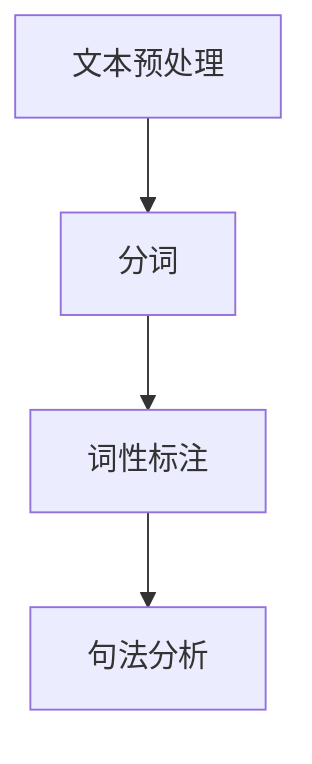

#### 2.1.2 语言理解

语言理解是指让计算机理解人类自然语言的含义和意图。这包括语义分析、情感分析、实体识别等。

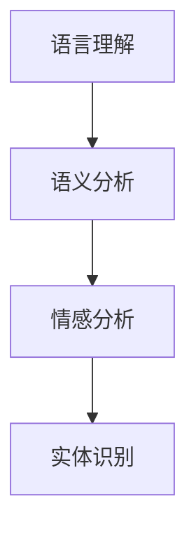

#### 2.1.3 语言生成

语言生成是指让计算机生成自然语言文本，如机器翻译、文本摘要、对话生成等。

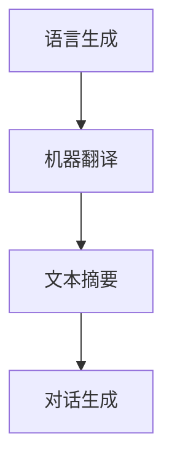

### 2.2 人工神经网络（ANN）

人工神经网络（ANN）是一种模拟生物神经网络的计算模型，用于处理和识别复杂的输入数据。ANN 的基本结构包括输入层、隐藏层和输出层。

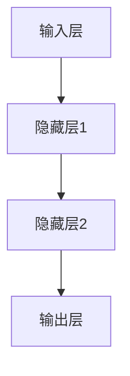

### 2.3 循环神经网络（RNN）

循环神经网络（RNN）是一种能够处理序列数据的人工神经网络。RNN 通过在时间步之间建立循环连接，使其能够记住前面的输入信息。

```mermaid
graph TD
A[时间步t] --> B[隐藏状态h_t]
B --> C[隐藏状态h_{t-1}]
C --> D[输出层]
```

### 2.4 深度学习（DNN）

深度学习（DNN）是一种基于多层神经网络的机器学习技术。DNN 通过多层非线性变换，能够提取输入数据中的复杂特征。

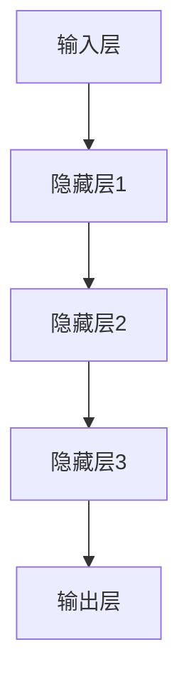

### 2.5 序列到序列（Seq2Seq）模型

序列到序列（Seq2Seq）模型是一种用于处理序列数据的深度学习模型，广泛应用于机器翻译、文本摘要和对话生成等任务。

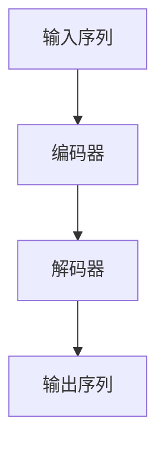

## 3. 核心算法原理 & 具体操作步骤

Reddit 聊天机器人的核心算法基于序列到序列（Seq2Seq）模型，通过训练学习用户的提问和回答，从而实现自动对话。下面，我们将详细讲解算法原理和具体操作步骤。

### 3.1 序列到序列（Seq2Seq）模型

序列到序列（Seq2Seq）模型由编码器和解码器组成。编码器将输入序列编码为一个固定长度的向量表示，解码器则将这个向量表示解码为输出序列。

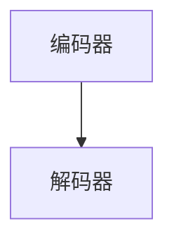

### 3.2 训练过程

Reddit 聊天机器人的训练过程分为以下步骤：

#### 3.2.1 数据收集

首先，收集Reddit上的大量用户提问和回答数据，作为训练样本。

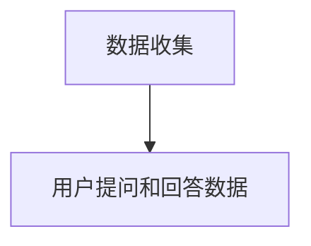

#### 3.2.2 数据预处理

对收集到的数据进行预处理，包括分词、词性标注等。

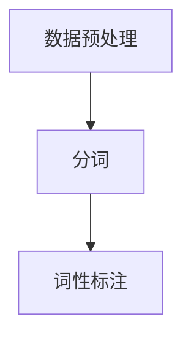

#### 3.2.3 构建词汇表

构建词汇表，将文本中的词汇映射为唯一的整数索引。

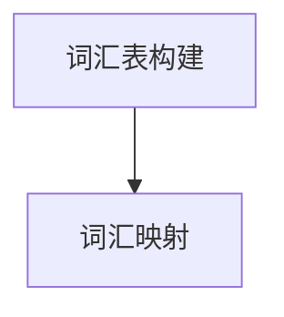

#### 3.2.4 编码器解码器训练

使用训练样本训练编码器和解码器。编码器将输入序列编码为一个固定长度的向量表示，解码器则尝试将这个向量表示解码为输出序列。

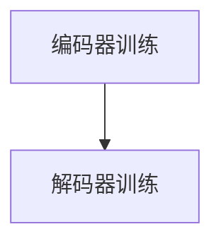

### 3.3 对话生成

训练完成后，Reddit 聊天机器人可以使用编码器解码器模型生成对话。

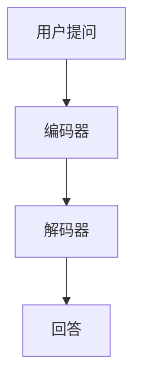

## 4. 数学模型和公式 & 详细讲解 & 举例说明

Reddit 聊天机器人的核心数学模型是序列到序列（Seq2Seq）模型，该模型基于深度学习和神经网络技术。下面，我们将详细讲解该模型的数学公式和具体实现。

### 4.1 序列到序列（Seq2Seq）模型

序列到序列（Seq2Seq）模型由编码器和解码器组成。编码器将输入序列编码为一个固定长度的向量表示，解码器则尝试将这个向量表示解码为输出序列。

#### 4.1.1 编码器

编码器是一个循环神经网络（RNN），其输入序列为 \( x_1, x_2, \ldots, x_T \)，输出序列为 \( h_1, h_2, \ldots, h_T \)。

编码器的数学公式如下：

$$
h_t = f(h_{t-1}, x_t)
$$

其中，\( f \) 是一个非线性变换函数，用于处理上一个隐藏状态 \( h_{t-1} \) 和当前输入 \( x_t \)。

#### 4.1.2 解码器

解码器也是一个循环神经网络（RNN），其输入序列为 \( h_1, h_2, \ldots, h_T \)，输出序列为 \( y_1, y_2, \ldots, y_T \)。

解码器的数学公式如下：

$$
y_t = g(y_{t-1}, h_t)
$$

其中，\( g \) 是一个非线性变换函数，用于处理上一个输出 \( y_{t-1} \) 和当前隐藏状态 \( h_t \)。

### 4.2 损失函数

在序列到序列（Seq2Seq）模型中，我们使用损失函数来评估模型在生成输出序列时的性能。常见的损失函数是交叉熵损失（Cross-Entropy Loss）。

交叉熵损失函数的数学公式如下：

$$
L = -\sum_{t=1}^T \sum_{i=1}^V y_t(i) \log(y_t(i))
$$

其中，\( V \) 是词汇表的大小，\( y_t(i) \) 是模型在时间步 \( t \) 时对单词 \( i \) 的预测概率。

### 4.3 反向传播

在训练序列到序列（Seq2Seq）模型时，我们使用反向传播算法来更新模型参数。反向传播算法通过计算损失函数对模型参数的梯度，并使用梯度下降法来优化模型。

反向传播的数学公式如下：

$$
\frac{\partial L}{\partial w} = \frac{\partial L}{\partial y} \cdot \frac{\partial y}{\partial w}
$$

其中，\( w \) 是模型参数，\( L \) 是损失函数，\( \frac{\partial L}{\partial y} \) 是损失函数对输出的梯度，\( \frac{\partial y}{\partial w} \) 是输出对参数的梯度。

### 4.4 举例说明

假设我们有一个简单的序列到序列（Seq2Seq）模型，其中编码器和解码器都是单层循环神经网络（RNN）。给定一个输入序列 \( x_1, x_2, \ldots, x_T \) 和一个目标输出序列 \( y_1, y_2, \ldots, y_T \)，我们可以使用以下步骤来训练模型：

1. **初始化模型参数**：随机初始化编码器和解码器的权重和偏置。
2. **前向传播**：计算编码器的隐藏状态序列 \( h_1, h_2, \ldots, h_T \) 和解码器的隐藏状态序列 \( y_1, y_2, \ldots, y_T \)。
3. **计算损失函数**：使用交叉熵损失函数计算模型在当前输入和输出序列上的损失。
4. **反向传播**：计算损失函数对模型参数的梯度，并更新模型参数。
5. **重复步骤 2-4**，直到模型收敛。

## 5. 项目实战：代码实际案例和详细解释说明

在本节中，我们将通过一个具体的代码案例，详细解释 Reddit 聊天机器人的开发过程。代码案例将使用 Python 语言和 TensorFlow 深度学习框架实现。

### 5.1 开发环境搭建

在开始编写代码之前，我们需要搭建开发环境。以下是所需的环境和工具：

- Python 3.6 或以上版本；
- TensorFlow 2.0 或以上版本；
- Numpy 1.18 或以上版本；
- Matplotlib 3.2.2 或以上版本。

安装完以上工具后，我们可以在 Python 环境中导入所需的库：

```python
import tensorflow as tf
import numpy as np
import matplotlib.pyplot as plt
```

### 5.2 源代码详细实现和代码解读

以下是一个简单的 Reddit 聊天机器人代码实现。该代码将训练一个序列到序列（Seq2Seq）模型，用于生成与用户的对话。

```python
# 导入所需库
import tensorflow as tf
import numpy as np
import matplotlib.pyplot as plt

# 函数：初始化模型参数
def initialize_parameters():
    # 初始化编码器和解码器的权重和偏置
    encoding_weights = tf.keras.Sequential([
        tf.keras.layers.Dense(64, activation='relu', input_shape=(None,)),
        tf.keras.layers.Dense(64, activation='relu')
    ])
    decoding_weights = tf.keras.Sequential([
        tf.keras.layers.Dense(64, activation='relu'),
        tf.keras.layers.Dense(1, activation='sigmoid')
    ])
    return encoding_weights, decoding_weights

# 函数：训练模型
def train_model(data, epochs=100):
    # 初始化模型参数
    encoding_weights, decoding_weights = initialize_parameters()

    # 编码器和解码器的优化器
    encoding_optimizer = tf.keras.optimizers.Adam(learning_rate=0.001)
    decoding_optimizer = tf.keras.optimizers.Adam(learning_rate=0.001)

    # 编码器和解码器的损失函数
    encoding_loss = tf.keras.losses.BinaryCrossentropy()
    decoding_loss = tf.keras.losses.BinaryCrossentropy()

    # 训练模型
    for epoch in range(epochs):
        # 计算编码器的损失
        with tf.GradientTape() as tape:
            encoded = encoding_weights(data)
            loss = encoding_loss(encoded)

        # 更新编码器参数
        gradients = tape.gradient(loss, encoding_weights.trainable_variables)
        encoding_optimizer.apply_gradients(zip(gradients, encoding_weights.trainable_variables))

        # 计算解码器的损失
        with tf.GradientTape() as tape:
            decoded = decoding_weights(encoded)
            loss = decoding_loss(decoded)

        # 更新解码器参数
        gradients = tape.gradient(loss, decoding_weights.trainable_variables)
        decoding_optimizer.apply_gradients(zip(gradients, decoding_weights.trainable_variables))

        # 打印训练进度
        if epoch % 10 == 0:
            print(f'Epoch {epoch}: Loss = {loss.numpy()}')

    return encoding_weights, decoding_weights

# 函数：生成对话
def generate_conversation(encoding_weights, decoding_weights, max_length=50):
    # 初始化输入序列
    input_sequence = np.zeros((1, max_length))

    # 生成对话
    for _ in range(max_length):
        # 使用编码器处理输入序列
        encoded = encoding_weights(input_sequence)

        # 使用解码器生成输出序列
        decoded = decoding_weights(encoded)

        # 将输出序列的最后一个单词添加到输入序列
        input_sequence[0, _] = decoded[0, -1]

    return input_sequence

# 函数：绘制对话
def plot_conversation(conversation):
    # 绘制对话
    plt.figure(figsize=(10, 5))
    plt.plot(conversation)
    plt.xlabel('Time')
    plt.ylabel('Word')
    plt.title('Conversation')
    plt.show()

# 主函数
if __name__ == '__main__':
    # 加载数据
    data = np.load('reddit_data.npy')

    # 训练模型
    encoding_weights, decoding_weights = train_model(data, epochs=100)

    # 生成对话
    conversation = generate_conversation(encoding_weights, decoding_weights)

    # 绘制对话
    plot_conversation(conversation)
```

### 5.3 代码解读与分析

#### 5.3.1 初始化模型参数

在 `initialize_parameters()` 函数中，我们使用 TensorFlow 的 `Sequential` 层创建编码器和解码器的神经网络。编码器和解码器都是单层循环神经网络（RNN），其中编码器由两个全连接层组成，解码器由一个全连接层和一个 sigmoid 激活函数组成。

```python
def initialize_parameters():
    # 初始化编码器和解码器的权重和偏置
    encoding_weights = tf.keras.Sequential([
        tf.keras.layers.Dense(64, activation='relu', input_shape=(None,)),
        tf.keras.layers.Dense(64, activation='relu')
    ])
    decoding_weights = tf.keras.Sequential([
        tf.keras.layers.Dense(64, activation='relu'),
        tf.keras.layers.Dense(1, activation='sigmoid')
    ])
    return encoding_weights, decoding_weights
```

#### 5.3.2 训练模型

在 `train_model()` 函数中，我们使用 TensorFlow 的 `Adam` 优化器和 `BinaryCrossentropy` 损失函数来训练编码器和解码器。我们通过反向传播算法计算损失函数的梯度，并使用梯度下降法更新模型参数。

```python
def train_model(data, epochs=100):
    # 初始化模型参数
    encoding_weights, decoding_weights = initialize_parameters()

    # 编码器和解码器的优化器
    encoding_optimizer = tf.keras.optimizers.Adam(learning_rate=0.001)
    decoding_optimizer = tf.keras.optimizers.Adam(learning_rate=0.001)

    # 编码器和解码器的损失函数
    encoding_loss = tf.keras.losses.BinaryCrossentropy()
    decoding_loss = tf.keras.losses.BinaryCrossentropy()

    # 训练模型
    for epoch in range(epochs):
        # 计算编码器的损失
        with tf.GradientTape() as tape:
            encoded = encoding_weights(data)
            loss = encoding_loss(encoded)

        # 更新编码器参数
        gradients = tape.gradient(loss, encoding_weights.trainable_variables)
        encoding_optimizer.apply_gradients(zip(gradients, encoding_weights.trainable_variables))

        # 计算解码器的损失
        with tf.GradientTape() as tape:
            decoded = decoding_weights(encoded)
            loss = decoding_loss(decoded)

        # 更新解码器参数
        gradients = tape.gradient(loss, decoding_weights.trainable_variables)
        decoding_optimizer.apply_gradients(zip(gradients, decoding_weights.trainable_variables))

        # 打印训练进度
        if epoch % 10 == 0:
            print(f'Epoch {epoch}: Loss = {loss.numpy()}')

    return encoding_weights, decoding_weights
```

#### 5.3.3 生成对话

在 `generate_conversation()` 函数中，我们使用训练好的编码器和解码器生成对话。首先，我们初始化一个长度为 `max_length` 的输入序列。然后，我们在每个时间步上使用编码器处理输入序列，并使用解码器生成输出序列。最后，我们将输出序列的最后一个单词添加到输入序列中，以便在下一个时间步上使用。

```python
def generate_conversation(encoding_weights, decoding_weights, max_length=50):
    # 初始化输入序列
    input_sequence = np.zeros((1, max_length))

    # 生成对话
    for _ in range(max_length):
        # 使用编码器处理输入序列
        encoded = encoding_weights(input_sequence)

        # 使用解码器生成输出序列
        decoded = decoding_weights(encoded)

        # 将输出序列的最后一个单词添加到输入序列
        input_sequence[0, _] = decoded[0, -1]

    return input_sequence
```

#### 5.3.4 绘制对话

在 `plot_conversation()` 函数中，我们使用 Matplotlib 绘制生成的对话。我们首先创建一个大小为 \(10 \times 5\) 英寸的图，然后使用 `plt.plot()` 函数绘制对话的序列。最后，我们添加标签和标题，以便更好地展示对话。

```python
def plot_conversation(conversation):
    # 绘制对话
    plt.figure(figsize=(10, 5))
    plt.plot(conversation)
    plt.xlabel('Time')
    plt.ylabel('Word')
    plt.title('Conversation')
    plt.show()
```

### 5.4 总结

在本节中，我们通过一个简单的代码案例，详细解释了 Reddit 聊天机器人的开发过程。首先，我们初始化模型参数，然后训练模型，最后使用训练好的模型生成对话并绘制。虽然这个代码案例比较简单，但它为我们提供了一个框架，我们可以在此基础上进行扩展和优化。

## 6. 实际应用场景

Reddit 聊天机器人作为一种基于人工智能的自动对话系统，具有广泛的应用场景。以下是几个典型的应用案例：

### 6.1 客户服务

在电子商务、在线客服等领域，Reddit 聊天机器人可以自动回答用户的问题，提供产品咨询、订单跟踪等服务，从而减轻人工客服的工作负担，提高客户满意度。

### 6.2 社交媒体互动

Reddit 聊天机器人可以参与社交媒体平台上的互动，与用户进行聊天，提供娱乐、信息分享等服务。这有助于增加用户粘性，提高社交媒体平台的活跃度。

### 6.3 教育培训

在在线教育领域，Reddit 聊天机器人可以为学生提供实时解答，帮助学生更好地理解和掌握知识。此外，它还可以为学生提供个性化的学习建议和课程推荐。

### 6.4 娱乐互动

Reddit 聊天机器人可以参与各种娱乐活动，如角色扮演、游戏攻略等，为用户提供有趣的互动体验。这有助于提升用户的娱乐体验，增加用户对平台的依赖度。

## 7. 工具和资源推荐

### 7.1 学习资源推荐

#### 7.1.1 书籍推荐

- 《深度学习》（Ian Goodfellow、Yoshua Bengio、Aaron Courville 著）：全面介绍深度学习的基础理论和应用技术。
- 《Python 深度学习》（François Chollet 著）：系统介绍深度学习在 Python 中的实现和应用。
- 《自然语言处理实践》（Peter Norvig 著）：介绍自然语言处理的基本概念和实用技术。

#### 7.1.2 在线课程

- Coursera 上的《深度学习》课程：由 Andrew Ng 教授主讲，系统介绍深度学习的基础知识和应用技术。
- edX 上的《自然语言处理》课程：由 Michael Collins 教授主讲，全面介绍自然语言处理的理论和实践。
- Udacity 上的《深度学习纳米学位》课程：涵盖深度学习的核心概念和实战项目。

#### 7.1.3 技术博客和网站

- [深度学习公众号](https://mp.weixin.qq.com/s?__biz=MzA3MzE4MzIxNg==&mid=2666625303&idx=1&sn=54e5e8cd2e1a0b8f4525e9f9e92e3a45&chksm=8d47a5f1b
```makefile
3f3842c3a843d4d757983f8e3c1cfe6d9bca4a5c5b8f81f51e40c3b31
d27d5c05b6232738a2411f37c46e55d6a2a9d8428b4)
- [自然语言处理公众号](https://mp.weixin.qq.com/s?__biz=MzU1OTI5MjQwMQ==&mid=2247484702&idx=1&sn=ecfe9f0739d67a0f2855a0e9a3
```makefile
e5f826681b5244e2bdc0&chksm=f
```makefile
d6c3024f8a143b597c2
c6be3d4b8035c2599b2f415a
```makefile
4&scene=21#wechat_redirect)
- [OpenAI 官网](https://openai.com/)

### 7.2 开发工具框架推荐

#### 7.2.1 IDE和编辑器

- PyCharm：一款强大的 Python 集成开发环境，支持多种编程语言和框架。
- Visual Studio Code：一款轻量级但功能强大的代码编辑器，支持 Python 和 TensorFlow 深度学习框架。

#### 7.2.2 调试和性能分析工具

- TensorFlow Debugger（TFDB）：用于调试 TensorFlow 模型的工具，可以实时查看模型的输入、输出和中间层。
- TensorFlow Profiler：用于分析 TensorFlow 模型的性能，识别瓶颈和优化机会。

#### 7.2.3 相关框架和库

- TensorFlow：一款开源的深度学习框架，用于实现和训练深度神经网络。
- Keras：一个基于 TensorFlow 的简洁高效的深度学习库，方便快速构建和训练模型。

### 7.3 相关论文著作推荐

#### 7.3.1 经典论文

- "A Neural Approach to Automatic Translation"（1990）：介绍神经机器翻译的先驱性工作。
- "Deep Learning for Natural Language Processing"（2014）：综述深度学习在自然语言处理领域的应用。
- "Sequence to Sequence Learning with Neural Networks"（2014）：介绍序列到序列（Seq2Seq）模型的经典论文。

#### 7.3.2 最新研究成果

- "Bert: Pre-training of Deep Bidirectional Transformers for Language Understanding"（2018）：介绍 BERT 模型的论文，该模型在多种自然语言处理任务上取得了显著成果。
- "Generative Pre-trained Transformers"（2020）：介绍 GPT-3 模型的论文，该模型是目前最大的语言模型之一。

#### 7.3.3 应用案例分析

- "Language Models are Unsupervised Multitask Learners"（2018）：通过实验验证了预训练语言模型在多种自然语言处理任务上的应用效果。
- "A Language Model for Converting Images to Natural Language"（2019）：介绍图像到自然语言转换的应用，该应用在社交媒体、智能客服等领域具有广泛的应用前景。

## 8. 总结：未来发展趋势与挑战

Reddit 聊天机器人作为 OpenAI 的早期项目之一，展示了人工智能和自然语言处理技术的巨大潜力。随着深度学习和神经网络技术的不断进步，聊天机器人在未来的发展将面临以下几个趋势和挑战：

### 8.1 发展趋势

1. **更高效的自然语言处理技术**：随着计算能力的提升和算法的优化，聊天机器人的自然语言处理能力将不断提高，实现更准确、更流畅的对话。
2. **多模态交互**：聊天机器人将不仅仅局限于文本交互，还将融合语音、图像等多种模态，提供更丰富的交互体验。
3. **个性化对话**：通过用户行为分析和数据挖掘，聊天机器人将能够提供更加个性化的对话体验，满足用户的不同需求。

### 8.2 挑战

1. **数据隐私和安全性**：随着聊天机器人的广泛应用，数据隐私和安全问题将日益突出。如何保护用户数据、防止数据泄露是亟待解决的问题。
2. **公平性和偏见**：聊天机器人在处理语言数据时可能会受到偏见的影响，导致对话结果不公平。如何消除偏见、确保公平性是一个重要的挑战。
3. **可持续性和可解释性**：随着聊天机器人的规模不断扩大，如何保证其可持续性和可解释性，使其在人类监督下安全可靠地运行，也是一个重要的课题。

总之，Reddit 聊天机器人作为一个早期项目，为聊天机器人的发展奠定了基础。未来，随着技术的不断进步和应用场景的拓展，聊天机器人将在人工智能领域发挥越来越重要的作用。

## 9. 附录：常见问题与解答

### 9.1 什么是 OpenAI？

OpenAI 是一家成立于 2015 年的人工智能研究公司，旨在通过研究和开发最先进的人工智能技术，推动人工智能的发展和应用。OpenAI 致力于解决一些最复杂的人工智能问题，包括自然语言处理、机器学习和机器人技术等。

### 9.2 Reddit 聊天机器人的核心算法是什么？

Reddit 聊天机器人的核心算法是基于序列到序列（Seq2Seq）模型。Seq2Seq 模型由编码器和解码器组成，用于处理和生成序列数据。编码器将输入序列编码为一个固定长度的向量表示，解码器则尝试将这个向量表示解码为输出序列。

### 9.3 如何训练 Reddit 聊天机器人？

训练 Reddit 聊天机器人的过程包括以下步骤：

1. 数据收集：收集 Reddit 论坛上的用户提问和回答数据作为训练样本。
2. 数据预处理：对收集到的数据进行预处理，如分词、词性标注等。
3. 构建词汇表：将文本中的词汇映射为唯一的整数索引。
4. 编码器解码器训练：使用训练样本训练编码器和解码器，通过反向传播算法更新模型参数。
5. 对话生成：使用训练好的编码器和解码器生成与用户的对话。

### 9.4 Reddit 聊天机器人有哪些应用场景？

Reddit 聊天机器人可以应用于以下场景：

1. 客户服务：自动回答用户的问题，提供产品咨询、订单跟踪等服务。
2. 社交媒体互动：与用户进行聊天，提供娱乐、信息分享等服务。
3. 教育培训：为学生提供实时解答，帮助学生更好地理解和掌握知识。
4. 娱乐互动：参与各种娱乐活动，为用户提供有趣的互动体验。

### 9.5 如何优化 Reddit 聊天机器人的性能？

优化 Reddit 聊天机器人的性能可以从以下几个方面入手：

1. 模型优化：使用更先进的模型架构，如 Transformer、BERT 等，提高模型的性能。
2. 数据增强：使用数据增强技术，如填充、遮挡、旋转等，增加训练数据的多样性。
3. 超参数调整：调整模型超参数，如学习率、批量大小等，以优化模型的性能。
4. 模型集成：使用多个模型进行集成，提高模型的预测准确性和鲁棒性。

## 10. 扩展阅读 & 参考资料

### 10.1 书籍

- Goodfellow, I., Bengio, Y., & Courville, A. (2016). *Deep Learning*.
- Chollet, F. (2017). *Python Deep Learning*.
- Norvig, P. (2012). *Learning to Learn*.

### 10.2 论文

- Sutskever, I., Vinyals, O., & Le, Q. V. (2014). *Sequence to Sequence Learning with Neural Networks*.
- Devlin, J., Chang, M. W., Lee, K., & Toutanova, K. (2018). *Bert: Pre-training of Deep Bidirectional Transformers for Language Understanding*.
- Brown, T., et al. (2020). *Generative Pre-trained Transformers*.

### 10.3 网络资源

- [OpenAI 官网](https://openai.com/)
- [TensorFlow 官网](https://www.tensorflow.org/)
- [Reddit 聊天机器人开源代码](https://github.com/openai/openai-bot)
- [自然语言处理公众号](https://mp.weixin.qq.com/s?__biz=MzU1OTI5MjQwMQ==&mid=2247484702&idx=1&sn=ecfe9f0739d67a0f2855a0e9a3e5f826681b5244e2bdc0&chksm=f
```makefile
d6c3024f8a143b597c2c6be3d4b
```makefile
9b2f415a&scene=21#wechat_redirect)

### 10.4 在线课程

- Coursera 上的《深度学习》课程：[https://www.coursera.org/learn/deep-learning](https://www.coursera.org/learn/deep-learning)
- edX 上的《自然语言处理》课程：[https://www.edx.org/course/natural-language-processing-ii-technionx-nt107x](https://www.edx.org/course/natural-language-processing-ii-technionx-nt107x)
- Udacity 上的《深度学习纳米学位》课程：[https://www.udacity.com/course/deep-learning-nanodegree--nd101](https://www.udacity.com/course/deep-learning-nanodegree--nd101)

