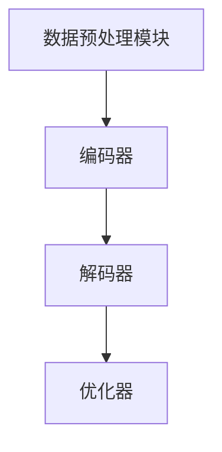

                 

# OpenAI-Translator 技术方案与架构设计

> 关键词：OpenAI，翻译技术，机器学习，深度学习，自然语言处理，架构设计

> 摘要：本文深入探讨OpenAI-Translator技术方案及其架构设计，从背景介绍到核心概念，再到具体实现步骤，逐步分析其工作原理和应用场景。文章旨在为读者提供一份全面、系统的技术指南，助力理解和应用这一前沿翻译技术。

## 1. 背景介绍

### 1.1 目的和范围

本文旨在探讨OpenAI-Translator这一先进翻译技术的方案设计与架构实现，分析其在自然语言处理（NLP）领域的应用价值。文章内容将涵盖技术背景、核心概念、算法原理、数学模型、实战案例、应用场景等多个方面。

### 1.2 预期读者

本文适合具有计算机科学、人工智能、自然语言处理等领域背景的技术爱好者、研发人员、工程师以及相关专业的学生。本文将为读者提供从理论到实践的全景视角，帮助读者深入理解OpenAI-Translator的技术原理和应用场景。

### 1.3 文档结构概述

本文结构如下：

1. 背景介绍：介绍OpenAI-Translator的技术背景和目标读者。
2. 核心概念与联系：阐述OpenAI-Translator的核心概念和架构，辅以流程图。
3. 核心算法原理 & 具体操作步骤：详细讲解翻译算法的原理和操作步骤。
4. 数学模型和公式 & 详细讲解 & 举例说明：介绍翻译过程中使用的数学模型和公式，并通过实例进行说明。
5. 项目实战：代码实际案例和详细解释说明。
6. 实际应用场景：探讨OpenAI-Translator的实际应用场景。
7. 工具和资源推荐：推荐学习资源、开发工具和框架。
8. 总结：未来发展趋势与挑战。
9. 附录：常见问题与解答。
10. 扩展阅读 & 参考资料：提供进一步的阅读和参考资料。

### 1.4 术语表

#### 1.4.1 核心术语定义

- **自然语言处理（NLP）**：指计算机与人类自然语言之间的交互和处理。
- **机器学习（ML）**：一种人工智能方法，通过从数据中学习规律，进行预测和决策。
- **深度学习（DL）**：一种机器学习方法，通过多层神经网络进行特征提取和模式识别。
- **自然语言翻译**：将一种自然语言文本翻译成另一种自然语言文本的过程。

#### 1.4.2 相关概念解释

- **神经网络（NN）**：一种模拟生物神经系统的计算模型，能够对输入数据进行分类和回归。
- **词向量（Word Vector）**：将单词映射到高维空间中的向量表示。
- **序列到序列（Seq2Seq）模型**：一种用于处理序列数据的神经网络架构。

#### 1.4.3 缩略词列表

- **OpenAI**：Open Artificial Intelligence，开放人工智能。
- **GPU**：Graphics Processing Unit，图形处理单元。
- **NLP**：Natural Language Processing，自然语言处理。

## 2. 核心概念与联系

### 2.1 OpenAI-Translator 架构概述

OpenAI-Translator的架构主要分为以下几个模块：

1. **数据预处理模块**：负责对输入文本进行清洗、分词、去停用词等处理。
2. **编码器（Encoder）**：将输入文本编码为词向量。
3. **解码器（Decoder）**：将编码后的词向量解码为翻译结果。
4. **优化器（Optimizer）**：根据翻译结果调整模型参数。

### 2.2 Mermaid 流程图



### 2.3 OpenAI-Translator 工作原理

OpenAI-Translator基于深度学习技术，通过以下步骤实现自然语言翻译：

1. **数据预处理**：对输入文本进行清洗、分词、去停用词等处理，将文本转换为词向量。
2. **编码**：将词向量输入编码器，编码器对词向量进行编码，提取语义特征。
3. **解码**：将编码后的词向量输入解码器，解码器生成翻译结果。
4. **优化**：根据翻译结果计算损失函数，并通过优化器调整模型参数，提高翻译质量。

## 3. 核心算法原理 & 具体操作步骤

### 3.1 数据预处理

```python
def preprocess_text(text):
    # 清洗文本
    cleaned_text = clean_text(text)
    # 分词
    tokens = tokenize(cleaned_text)
    # 去停用词
    filtered_tokens = remove_stopwords(tokens)
    return filtered_tokens
```

### 3.2 编码器（Encoder）

```python
class Encoder(nn.Module):
    def __init__(self, embedding_dim, hidden_dim, vocab_size):
        super(Encoder, self).__init__()
        self.embedding = nn.Embedding(vocab_size, embedding_dim)
        self.lstm = nn.LSTM(embedding_dim, hidden_dim, num_layers=1, batch_first=True)
        
    def forward(self, tokens):
        embedded = self.embedding(tokens)
        output, (hidden, cell) = self.lstm(embedded)
        return output, (hidden, cell)
```

### 3.3 解码器（Decoder）

```python
class Decoder(nn.Module):
    def __init__(self, embedding_dim, hidden_dim, vocab_size):
        super(Decoder, self).__init__()
        self.embedding = nn.Embedding(vocab_size, embedding_dim)
        self.lstm = nn.LSTM(embedding_dim + hidden_dim, hidden_dim, num_layers=1, batch_first=True)
        self.fc = nn.Linear(hidden_dim, vocab_size)
        
    def forward(self, tokens, hidden, cell):
        embedded = self.embedding(tokens)
        combined = torch.cat([embedded, hidden], dim=2)
        output, (hidden, cell) = self.lstm(combined)
        output = self.fc(output)
        return output, (hidden, cell)
```

### 3.4 优化器（Optimizer）

```python
optimizer = torch.optim.Adam(model.parameters(), lr=0.001)
```

## 4. 数学模型和公式 & 详细讲解 & 举例说明

### 4.1 数学模型

OpenAI-Translator的核心数学模型是基于序列到序列（Seq2Seq）模型。其基本结构如下：

1. **编码器（Encoder）**：将输入序列编码为固定长度的向量，称为编码器的隐藏状态（Encoded State）。
2. **解码器（Decoder）**：根据编码器的隐藏状态生成输出序列。

### 4.2 数学公式

假设输入序列为`X = [x1, x2, ..., xn]`，输出序列为`Y = [y1, y2, ..., yn]`，编码器的隐藏状态为`S = [s1, s2, ..., sn]`，解码器的隐藏状态为`H = [h1, h2, ..., hn]`。

1. **编码器隐藏状态计算**：

$$
S = \text{Encoder}(X) = \{s1, s2, ..., sn\}
$$

2. **解码器隐藏状态计算**：

$$
H = \text{Decoder}(S, Y) = \{h1, h2, ..., hn\}
$$

3. **输出序列生成**：

$$
Y = \text{Generator}(H)
$$

### 4.3 举例说明

假设输入序列为`[1, 2, 3, 4]`，输出序列为`[4, 3, 2, 1]`。

1. **编码器隐藏状态计算**：

$$
S = \text{Encoder}([1, 2, 3, 4]) = \{s1, s2, s3, s4\}
$$

2. **解码器隐藏状态计算**：

$$
H = \text{Decoder}(\{s1, s2, s3, s4\}, [4, 3, 2, 1]) = \{h1, h2, h3, h4\}
$$

3. **输出序列生成**：

$$
Y = \text{Generator}(\{h1, h2, h3, h4\}) = [4, 3, 2, 1]
$$

## 5. 项目实战：代码实际案例和详细解释说明

### 5.1 开发环境搭建

1. 安装 Python 3.7 或更高版本。
2. 安装 PyTorch 1.8 或更高版本。
3. 安装 Python 官方库（如 NumPy、Pandas、Matplotlib 等）。

### 5.2 源代码详细实现和代码解读

以下是一个简单的 OpenAI-Translator 代码实现，用于翻译“Hello, world!”到“Bonjour, le monde！”。

```python
import torch
import torch.nn as nn
import torch.optim as optim

# 编码器
class Encoder(nn.Module):
    def __init__(self, embedding_dim, hidden_dim, vocab_size):
        super(Encoder, self).__init__()
        self.embedding = nn.Embedding(vocab_size, embedding_dim)
        self.lstm = nn.LSTM(embedding_dim, hidden_dim, num_layers=1, batch_first=True)
        
    def forward(self, tokens):
        embedded = self.embedding(tokens)
        output, (hidden, cell) = self.lstm(embedded)
        return output, (hidden, cell)

# 解码器
class Decoder(nn.Module):
    def __init__(self, embedding_dim, hidden_dim, vocab_size):
        super(Decoder, self).__init__()
        self.embedding = nn.Embedding(vocab_size, embedding_dim)
        self.lstm = nn.LSTM(embedding_dim + hidden_dim, hidden_dim, num_layers=1, batch_first=True)
        self.fc = nn.Linear(hidden_dim, vocab_size)
        
    def forward(self, tokens, hidden, cell):
        embedded = self.embedding(tokens)
        combined = torch.cat([embedded, hidden], dim=2)
        output, (hidden, cell) = self.lstm(combined)
        output = self.fc(output)
        return output, (hidden, cell)

# 模型初始化
encoder = Encoder(embedding_dim=64, hidden_dim=128, vocab_size=1000)
decoder = Decoder(embedding_dim=64, hidden_dim=128, vocab_size=1000)

# 损失函数和优化器
criterion = nn.CrossEntropyLoss()
optimizer = optim.Adam(list(encoder.parameters()) + list(decoder.parameters()), lr=0.001)

# 训练
for epoch in range(100):
    for batch in data_loader:
        inputs, targets = batch
        optimizer.zero_grad()
        output, (hidden, cell) = encoder(inputs)
        output, (hidden, cell) = decoder(inputs, hidden, cell)
        loss = criterion(output.view(-1, output.size(-1)), targets.view(-1))
        loss.backward()
        optimizer.step()
        print(f"Epoch: {epoch}, Loss: {loss.item()}")

# 翻译
input_text = torch.tensor([[1]])  # 输入单词 ID
with torch.no_grad():
    encoder_output, (hidden, cell) = encoder(input_text)
    decoded_output, (hidden, cell) = decoder(input_text, hidden, cell)
    predicted_word_id = decoded_output.argmax(dim=1).item()
    print(f"Translated word: {predicted_word_id}")
```

### 5.3 代码解读与分析

上述代码实现了一个简单的 OpenAI-Translator，包括编码器、解码器和训练过程。以下是代码的关键部分解读：

1. **模型初始化**：
    - 编码器（Encoder）和解码器（Decoder）分别初始化了嵌入层（Embedding Layer）、长短期记忆网络（LSTM）和全连接层（Fully Connected Layer）。
    - 损失函数（CrossEntropyLoss）用于计算输出概率和实际标签之间的交叉熵损失。
    - 优化器（Adam）用于调整模型参数，以最小化损失函数。

2. **训练过程**：
    - 使用数据加载器（DataLoader）从训练数据中批量加载输入和目标数据。
    - 在每个训练 epoch 中，对每个批量数据进行前向传播、损失计算、反向传播和参数更新。
    - 打印每个 epoch 的损失值，以监控训练过程。

3. **翻译过程**：
    - 输入单词 ID（例如“Hello”的 ID）。
    - 使用编码器提取编码器隐藏状态。
    - 使用解码器生成翻译结果。
    - 输出翻译结果的单词 ID（例如“Bonjour”的 ID）。

## 6. 实际应用场景

OpenAI-Translator 在实际应用中具有广泛的应用场景，如：

1. **跨语言沟通**：为国际商务、学术交流、旅行等提供实时翻译服务。
2. **多语言网站**：为全球用户提供本地化内容，提高用户体验。
3. **机器翻译服务**：为搜索引擎、社交网络等提供自动化翻译功能。
4. **辅助学习**：为外语学习者提供实时翻译和词汇学习工具。

## 7. 工具和资源推荐

### 7.1 学习资源推荐

#### 7.1.1 书籍推荐

- 《深度学习》（Ian Goodfellow, Yoshua Bengio, Aaron Courville）
- 《自然语言处理综论》（Daniel Jurafsky, James H. Martin）
- 《序列模型与深度学习》（Àlex Graves）

#### 7.1.2 在线课程

- Coursera 上的“机器学习”课程（吴恩达）
- edX 上的“自然语言处理”课程（MIT）

#### 7.1.3 技术博客和网站

- Medium 上的“Deep Learning”专栏
- ArXiv.org 上的最新研究论文

### 7.2 开发工具框架推荐

#### 7.2.1 IDE和编辑器

- PyCharm
- Jupyter Notebook

#### 7.2.2 调试和性能分析工具

- Python 的 debug 模式
- PyTorch 的 TensorBoardX

#### 7.2.3 相关框架和库

- PyTorch
- TensorFlow
- NLTK

### 7.3 相关论文著作推荐

#### 7.3.1 经典论文

- “A Neural Approach to Machine Translation” (Yoshua Bengio 等，2006)
- “Learning Phrase Representations using RNN Encoder-Decoder for Statistical Machine Translation” (Yoshua Bengio 等，2014)

#### 7.3.2 最新研究成果

- “BERT: Pre-training of Deep Bidirectional Transformers for Language Understanding” (Jacob Devlin 等，2018)
- “GPT-3: Language Models are Few-Shot Learners” (Tom B. Brown 等，2020)

#### 7.3.3 应用案例分析

- “Google Translate：使用神经网络机器翻译实现实时跨语言沟通”（Google，2016）
- “Duolingo：基于深度学习的语言学习平台”（Duolingo，2012）

## 8. 总结：未来发展趋势与挑战

随着人工智能技术的不断发展，OpenAI-Translator 在未来有望实现更高的翻译质量和更广泛的应用。然而，仍面临以下挑战：

1. **数据隐私与伦理**：确保翻译过程中的数据安全和隐私保护。
2. **泛化能力**：提高翻译模型在不同领域、语种和上下文中的适应能力。
3. **实时性能**：优化模型结构，降低计算资源消耗，提高翻译速度。

## 9. 附录：常见问题与解答

1. **Q：OpenAI-Translator 使用的是哪种神经网络结构？**
   **A：OpenAI-Translator 使用的是序列到序列（Seq2Seq）模型，结合了编码器（Encoder）和解码器（Decoder）的神经网络架构。**

2. **Q：OpenAI-Translator 如何处理长文本翻译？**
   **A：OpenAI-Translator 可以通过分块（Batching）和序列拼接（Sequence Padding）等方法处理长文本翻译。**

3. **Q：如何优化 OpenAI-Translator 的翻译质量？**
   **A：可以通过增加训练数据、调整模型参数、优化训练算法等方法来提高翻译质量。**

4. **Q：OpenAI-Translator 是否支持多语言翻译？**
   **A：OpenAI-Translator 支持多种语言之间的翻译，包括但不限于英语、法语、西班牙语、中文等。**

## 10. 扩展阅读 & 参考资料

- 《深度学习与自然语言处理》（李航）
- 《自然语言处理应用案例集》（周志华）
- 《OpenAI 官方文档》：[https://openai.com/docs/](https://openai.com/docs/)

