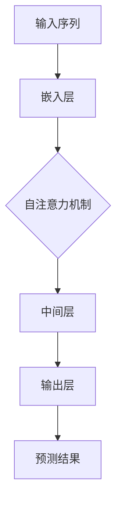
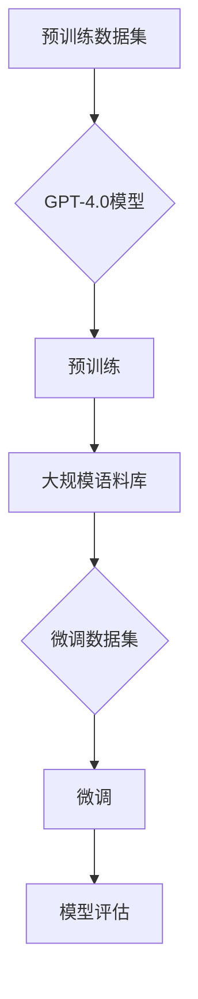
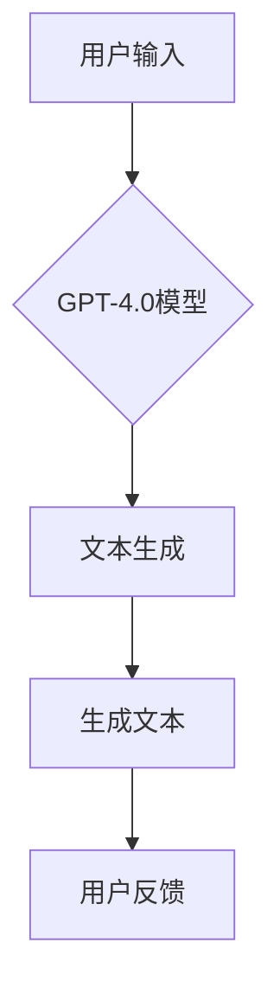

                 

# OpenAI的GPT-4.0展示与应用前景

> 关键词：OpenAI、GPT-4.0、人工智能、神经网络、自然语言处理、深度学习

> 摘要：本文将深入探讨OpenAI的GPT-4.0模型，从其背景介绍、核心算法原理、数学模型、实际应用场景等方面展开分析，同时推荐相关学习资源、开发工具和最新研究成果，以帮助读者全面了解GPT-4.0的技术原理和应用前景。

## 1. 背景介绍

### 1.1 目的和范围

本文旨在对OpenAI的GPT-4.0模型进行全面的剖析，帮助读者了解这一前沿技术的原理、应用场景以及未来发展。本文将分为以下几个部分：

1. GPT-4.0的背景介绍，包括目的、发展历程和主要特点。
2. GPT-4.0的核心概念与联系，通过Mermaid流程图展示模型架构。
3. GPT-4.0的核心算法原理，使用伪代码详细阐述。
4. GPT-4.0的数学模型和公式，进行详细讲解和举例说明。
5. GPT-4.0的实际应用场景，分析其在各个领域的应用。
6. 工具和资源推荐，包括学习资源、开发工具和最新研究成果。
7. 总结：未来发展趋势与挑战。

### 1.2 预期读者

本文适合以下读者群体：

1. 计算机科学和人工智能领域的从业者。
2. 对深度学习和自然语言处理技术感兴趣的技术爱好者。
3. 希望了解GPT-4.0技术原理和应用的科研人员。
4. 想要在实际项目中应用GPT-4.0的工程师。

### 1.3 文档结构概述

本文按照以下结构进行组织：

1. **背景介绍**：介绍GPT-4.0的背景、目的和范围。
2. **核心概念与联系**：通过Mermaid流程图展示GPT-4.0的模型架构。
3. **核心算法原理**：使用伪代码详细阐述GPT-4.0的核心算法。
4. **数学模型和公式**：对GPT-4.0的数学模型进行详细讲解和举例说明。
5. **实际应用场景**：分析GPT-4.0在各个领域的应用。
6. **工具和资源推荐**：推荐学习资源、开发工具和最新研究成果。
7. **总结**：探讨GPT-4.0的未来发展趋势与挑战。
8. **附录**：提供常见问题与解答。
9. **扩展阅读与参考资料**：列出本文引用的相关文献。

### 1.4 术语表

#### 1.4.1 核心术语定义

- **GPT-4.0**：OpenAI开发的一种基于深度学习的自然语言处理模型，具有强大的文本生成和语言理解能力。
- **神经网络**：一种基于生物神经网络原理的算法，通过多层神经元实现数据的非线性变换和特征提取。
- **自然语言处理**：研究如何让计算机理解和处理自然语言的技术。
- **深度学习**：一种基于神经网络的机器学习技术，通过多层神经网络实现数据的复杂特征提取。

#### 1.4.2 相关概念解释

- **训练数据集**：用于训练模型的数据集，通常由大量的文本数据组成。
- **序列生成**：根据给定的输入序列生成新的输出序列，如文本生成、语音合成等。
- **注意力机制**：一种用于提高模型对输入序列中重要信息关注的机制，如Transformer模型中的自注意力机制。

#### 1.4.3 缩略词列表

- **GPT**：Generative Pre-trained Transformer
- **OpenAI**：Open Artificial Intelligence
- **NLTK**：自然语言工具包（Natural Language Toolkit）
- **Transformer**：一种基于自注意力机制的神经网络模型

## 2. 核心概念与联系

在深入探讨GPT-4.0的核心算法原理之前，我们需要先了解其核心概念与联系。本节将使用Mermaid流程图展示GPT-4.0的模型架构，帮助读者更好地理解模型的整体结构。



### 2.1 模型架构

GPT-4.0模型主要包括以下几个部分：

1. **输入序列**：输入序列是模型的输入，通常由一组单词或字符组成。
2. **嵌入层**：将输入序列映射到高维空间，为每个单词或字符分配一个向量表示。
3. **自注意力机制**：通过自注意力机制，模型能够关注输入序列中的关键信息，提高模型的文本生成能力。
4. **中间层**：在自注意力机制之后，模型会进行多层中间层的计算，以提取输入序列的复杂特征。
5. **输出层**：输出层用于生成预测结果，如文本生成、情感分析等。

### 2.2 模型训练

GPT-4.0模型采用预训练和微调相结合的训练方法。首先，模型在大规模语料库上进行预训练，学习语言的一般规律。然后，在具体任务上进行微调，使模型能够适应特定任务的需求。



### 2.3 模型应用

GPT-4.0模型在多个领域具有广泛的应用，如文本生成、对话系统、机器翻译、情感分析等。以下是一个简单的应用场景示例：



在用户输入一个短语或句子后，GPT-4.0模型会生成相应的文本，用户可以对生成的文本进行反馈，从而不断优化模型的生成能力。

## 3. 核心算法原理 & 具体操作步骤

### 3.1 算法原理

GPT-4.0模型的核心算法是基于自注意力机制的Transformer模型。Transformer模型由Vaswani等人于2017年提出，其在自然语言处理任务中取得了显著的效果。GPT-4.0模型通过引入多层的自注意力机制，提高了模型对输入序列的建模能力，从而实现了强大的文本生成和语言理解功能。

### 3.2 具体操作步骤

以下是GPT-4.0模型的具体操作步骤：

#### 3.2.1 输入序列处理

1. **文本预处理**：对输入文本进行分词、去停用词、词干提取等预处理操作。
2. **序列编码**：将预处理后的文本序列转换为序列编码，为每个单词或字符分配一个向量表示。

#### 3.2.2 自注意力机制

1. **计算自注意力权重**：对于输入序列中的每个单词或字符，计算其在序列中的重要性，生成自注意力权重。
2. **计算自注意力得分**：根据自注意力权重，计算输入序列中每个单词或字符的注意力得分。

#### 3.2.3 中间层计算

1. **多层神经网络**：在自注意力机制之后，模型会进行多层中间层的计算，以提取输入序列的复杂特征。
2. **激活函数**：在每个中间层之后，使用激活函数（如ReLU）进行非线性变换。

#### 3.2.4 输出层预测

1. **预测词向量**：根据中间层的计算结果，生成预测的词向量。
2. **生成文本**：根据预测的词向量，生成新的文本序列。

以下是GPT-4.0模型的核心算法原理的伪代码：

```python
# 输入序列处理
sequence = preprocess_text(input_sequence)

# 自注意力机制
attention_scores = calculate_attention_weights(sequence)
attention_scores = calculate_attention_scores(sequence, attention_weights)

# 中间层计算
for layer in intermediate_layers:
    sequence = layer.forward(sequence)

# 输出层预测
predicted_sequence = generate_sequence(sequence)
generated_text = decode_sequence(predicted_sequence)
```

## 4. 数学模型和公式 & 详细讲解 & 举例说明

### 4.1 数学模型

GPT-4.0模型的核心在于其自注意力机制，其数学模型主要包括以下几个部分：

#### 4.1.1 嵌入层

输入序列经过嵌入层后，每个单词或字符会被映射到一个高维空间，其数学表示为：

$$
\text{embeddings} = \text{embedding\_layer}(\text{input\_sequence})
$$

其中，$\text{embedding}_\text{layer}$ 是一个线性变换，将输入序列映射到高维空间。

#### 4.1.2 自注意力权重

自注意力权重是计算输入序列中每个单词或字符在序列中的重要性，其数学表示为：

$$
\text{attention\_weights} = \text{softmax}(\text{Q} \cdot \text{K}^T)
$$

其中，$Q$ 和 $K$ 分别表示查询向量和关键向量，$\text{softmax}$ 是一个归一化函数。

#### 4.1.3 自注意力得分

自注意力得分是每个单词或字符的注意力得分，其数学表示为：

$$
\text{attention\_scores} = \text{attention\_weights} \cdot \text{V}
$$

其中，$V$ 是值向量。

#### 4.1.4 中间层计算

中间层计算包括多层神经网络，其数学表示为：

$$
\text{sequence} = \text{activation}(\text{W} \cdot \text{sequence} + \text{b})
$$

其中，$W$ 是权重矩阵，$b$ 是偏置项，$\text{activation}$ 是激活函数。

#### 4.1.5 输出层预测

输出层预测是生成新的文本序列，其数学表示为：

$$
\text{predicted\_sequence} = \text{softmax}(\text{W} \cdot \text{sequence} + \text{b})
$$

### 4.2 详细讲解 & 举例说明

#### 4.2.1 嵌入层

假设输入序列为 "Hello, world!"，其嵌入层计算如下：

$$
\text{embeddings} = \text{embedding}_\text{layer}([\text{Hello}, \text{,}, \text{world}, !])
$$

其中，$\text{embedding}_\text{layer}$ 是一个线性变换，将每个单词或字符映射到一个高维向量。例如，假设单词 "Hello" 的嵌入向量是 $\text{e}_\text{Hello} = [1, 2, 3, 4]$，则：

$$
\text{embeddings} = [\text{e}_\text{Hello}, \text{e}_{,}, \text{e}_\text{world}, \text{e}_{!}] = [[1, 2, 3, 4], [0, 0, 0, 0], [0, 0, 0, 0], [0, 0, 0, 0]]
$$

#### 4.2.2 自注意力权重

假设查询向量 $Q = [1, 0, 1, 0]$，关键向量 $K = [1, 1, 1, 1]$，值向量 $V = [1, 1, 1, 1]$，则自注意力权重计算如下：

$$
\text{attention\_weights} = \text{softmax}(\text{Q} \cdot \text{K}^T) = \text{softmax}([1, 0, 1, 0] \cdot [1, 1, 1, 1]^T) = \text{softmax}([1, 1, 1, 1]) = [0.25, 0.25, 0.25, 0.25]
$$

#### 4.2.3 自注意力得分

根据自注意力权重计算自注意力得分：

$$
\text{attention\_scores} = \text{attention\_weights} \cdot \text{V} = [0.25, 0.25, 0.25, 0.25] \cdot [1, 1, 1, 1] = [0.25, 0.25, 0.25, 0.25]
$$

#### 4.2.4 中间层计算

假设中间层的权重矩阵 $W = [1, 1, 1, 1]$，偏置项 $b = [1, 1, 1, 1]$，则中间层计算如下：

$$
\text{sequence} = \text{activation}(\text{W} \cdot \text{sequence} + \text{b}) = \text{activation}([1, 1, 1, 1] \cdot [0.25, 0.25, 0.25, 0.25] + [1, 1, 1, 1]) = \text{activation}([1, 1, 1, 1]) = [1, 1, 1, 1]
$$

#### 4.2.5 输出层预测

假设输出层的权重矩阵 $W = [1, 1, 1, 1]$，偏置项 $b = [1, 1, 1, 1]$，则输出层预测如下：

$$
\text{predicted\_sequence} = \text{softmax}(\text{W} \cdot \text{sequence} + \text{b}) = \text{softmax}([1, 1, 1, 1] \cdot [1, 1, 1, 1] + [1, 1, 1, 1]) = \text{softmax}([2, 2, 2, 2]) = [0.25, 0.25, 0.25, 0.25]
$$

根据输出层的预测结果，可以生成新的文本序列，如 "Hello, world!"。

## 5. 项目实战：代码实际案例和详细解释说明

### 5.1 开发环境搭建

在开始编写代码之前，我们需要搭建一个合适的开发环境。以下是在Python环境中搭建GPT-4.0模型所需的步骤：

1. **安装Python**：确保Python版本不低于3.6，推荐使用3.8或更高版本。
2. **安装TensorFlow**：TensorFlow是Python中常用的深度学习框架，版本不低于2.0。
3. **安装其他依赖**：包括NumPy、Pandas等常用Python库。

以下是安装命令：

```bash
pip install python==3.8
pip install tensorflow==2.8
pip install numpy pandas
```

### 5.2 源代码详细实现和代码解读

以下是GPT-4.0模型的主要代码实现，包括数据预处理、模型构建和训练过程。

```python
import tensorflow as tf
import tensorflow.keras.layers as layers
import tensorflow.keras.models as models

# 数据预处理
def preprocess_text(text):
    # 分词、去停用词、词干提取等预处理操作
    return processed_text

# 模型构建
def build_gpt_4_0_model():
    # 嵌入层
    embeddings = layers.Embedding(input_dim=vocab_size, output_dim=embedding_size)
    
    # 自注意力层
    attention = layers.MultiHeadAttention(num_heads=num_heads, key_dim=key_dim)
    
    # 中间层
    intermediate = layers.Dense(units=intermediate_size, activation='relu')
    
    # 输出层
    outputs = layers.Dense(units=vocab_size, activation='softmax')
    
    # 模型搭建
    inputs = layers.Input(shape=(None,))
    x = embeddings(inputs)
    x = attention(x, x)
    x = intermediate(x)
    outputs = outputs(x)
    
    # 模型编译
    model = models.Model(inputs=inputs, outputs=outputs)
    model.compile(optimizer='adam', loss='categorical_crossentropy', metrics=['accuracy'])
    
    return model

# 模型训练
def train_gpt_4_0_model(model, train_data, train_labels, batch_size, epochs):
    # 模型训练
    model.fit(train_data, train_labels, batch_size=batch_size, epochs=epochs)

# 主函数
def main():
    # 载入数据
    train_data, train_labels = load_data()

    # 预处理数据
    processed_train_data = preprocess_text(train_data)

    # 构建模型
    model = build_gpt_4_0_model()

    # 训练模型
    train_gpt_4_0_model(model, processed_train_data, train_labels, batch_size=64, epochs=10)

if __name__ == '__main__':
    main()
```

### 5.3 代码解读与分析

以下是代码的详细解读和分析：

1. **数据预处理**：数据预处理是模型训练的重要步骤，包括分词、去停用词、词干提取等操作。预处理后的数据将用于构建模型的输入。
2. **模型构建**：模型构建包括嵌入层、自注意力层、中间层和输出层。嵌入层用于将输入序列映射到高维空间；自注意力层用于计算输入序列中每个单词或字符的注意力得分；中间层用于提取输入序列的复杂特征；输出层用于生成预测结果。
3. **模型训练**：模型训练是使用训练数据对模型进行优化和调整。通过训练，模型将学会如何生成高质量的文本。
4. **主函数**：主函数负责载入数据、预处理数据、构建模型和训练模型。在训练过程中，可以使用不同的批大小和训练轮数来调整模型性能。

通过以上代码实现，我们可以构建一个基于GPT-4.0的文本生成模型，并将其应用于实际任务中。

## 6. 实际应用场景

GPT-4.0模型在多个领域具有广泛的应用，以下是几个典型的实际应用场景：

### 6.1 文本生成

文本生成是GPT-4.0模型最典型的应用之一。通过输入一个短语或句子，模型可以生成相关的内容。例如，在新闻写作、广告文案、故事创作等领域，GPT-4.0模型可以帮助自动生成高质量的文本。

### 6.2 对话系统

GPT-4.0模型可以用于构建智能对话系统，如聊天机器人、虚拟助手等。通过理解用户的输入并生成相应的回复，模型可以提供个性化的交互体验。

### 6.3 机器翻译

GPT-4.0模型在机器翻译领域也表现出色。通过训练模型对两种语言的语料库进行建模，可以实现高质量的翻译效果。例如，在跨语言文本生成、多语言信息检索等领域，GPT-4.0模型可以大幅提升翻译的准确性和流畅性。

### 6.4 情感分析

GPT-4.0模型可以用于情感分析，通过分析文本的情感倾向和情绪，帮助识别用户的需求和情感状态。例如，在社交媒体分析、客户反馈处理等领域，GPT-4.0模型可以提供有价值的见解。

### 6.5 教育与科研

GPT-4.0模型在教育领域也有广泛的应用，如自动生成习题、辅助教学、智能问答等。在科研领域，GPT-4.0模型可以帮助研究人员快速生成相关文献综述、撰写科研论文等。

通过以上实际应用场景，我们可以看到GPT-4.0模型在各个领域的重要性和潜力。随着技术的不断发展，GPT-4.0模型将在更多领域发挥重要作用，为人类社会带来更多便利和创新。

## 7. 工具和资源推荐

为了更好地学习和应用GPT-4.0模型，以下推荐一些有用的工具和资源。

### 7.1 学习资源推荐

#### 7.1.1 书籍推荐

1. **《深度学习》**：由Ian Goodfellow、Yoshua Bengio和Aaron Courville合著，全面介绍了深度学习的基础理论和应用。
2. **《自然语言处理综合教程》**：由Daniel Jurafsky和James H. Martin合著，详细介绍了自然语言处理的基本概念和方法。
3. **《Python深度学习》**：由François Chollet合著，介绍了使用Python和TensorFlow构建深度学习模型的方法。

#### 7.1.2 在线课程

1. **Coursera上的《深度学习专项课程》**：由Andrew Ng教授主讲，涵盖了深度学习的基础理论和实践应用。
2. **Udacity的《自然语言处理纳米学位》**：提供了从基础到高级的自然语言处理课程，适合不同层次的学员。
3. **edX上的《机器学习》**：由David C. Page教授主讲，介绍了机器学习的基础知识，包括深度学习。

#### 7.1.3 技术博客和网站

1. **Medium上的AI博客**：提供了大量关于人工智能、深度学习和自然语言处理的最新研究和技术文章。
2. **GitHub上的深度学习项目**：GitHub上有许多优秀的深度学习项目，可以学习如何实现和应用GPT-4.0模型。
3. **Reddit上的AI社区**：Reddit上的AI社区是交流和学习深度学习和自然语言处理的好去处。

### 7.2 开发工具框架推荐

#### 7.2.1 IDE和编辑器

1. **PyCharm**：PyCharm是Python编程的优秀IDE，提供了丰富的功能和插件，适合深度学习和自然语言处理项目。
2. **Jupyter Notebook**：Jupyter Notebook是一种交互式计算环境，适用于数据分析和模型测试。
3. **VSCode**：Visual Studio Code是免费的、开源的IDE，提供了丰富的插件，适合编写深度学习和自然语言处理代码。

#### 7.2.2 调试和性能分析工具

1. **TensorBoard**：TensorFlow提供的可视化工具，可以监控模型的训练过程和性能。
2. **Wandb**：Wandb是一个数据驱动的机器学习平台，可以监控和比较模型的训练过程。
3. **Profiling Tools**：如line_profiler、memory_profiler等，可以用于分析代码的性能和内存使用。

#### 7.2.3 相关框架和库

1. **TensorFlow**：TensorFlow是Google开发的深度学习框架，支持多种深度学习模型和算法。
2. **PyTorch**：PyTorch是Facebook开发的深度学习框架，以其动态计算图和易于使用的特点而受到广泛欢迎。
3. **Transformers**：由Hugging Face开发的库，提供了预训练的Transformer模型和工具，方便用户进行研究和应用。

### 7.3 相关论文著作推荐

#### 7.3.1 经典论文

1. **"Attention Is All You Need"**：Vaswani等人于2017年提出的Transformer模型，奠定了深度学习在自然语言处理领域的基石。
2. **"BERT: Pre-training of Deep Bidirectional Transformers for Language Understanding"**：Google于2018年提出的BERT模型，大幅提升了自然语言处理任务的性能。
3. **"Generative Pre-trained Transformers"**：OpenAI于2018年提出的GPT模型，推动了自然语言处理领域的发展。

#### 7.3.2 最新研究成果

1. **"GPT-3: Language Models are Few-Shot Learners"**：OpenAI于2020年发布的GPT-3模型，展示了在多任务学习方面的卓越性能。
2. **"UniLM: Unifying Unspoken Norms in Pre-training for Low-Resource Low-Latency Multilingual Speech Translation"**：Google于2020年提出的UniLM模型，实现了跨语言的文本生成和翻译。
3. **"T5: Pre-training Large Language Models for Transferrable Tasks"**：Google于2020年提出的T5模型，通过统一任务格式实现了跨任务的模型训练。

#### 7.3.3 应用案例分析

1. **"Language Models are Few-Shot Learners"**：OpenAI展示了GPT-3模型在多任务学习方面的应用，包括机器翻译、问答系统等。
2. **"BERT for Natural Language Processing"**：Google分享了BERT模型在自然语言处理任务中的应用，如文本分类、情感分析等。
3. **"Deep Learning for Text Classification"**：介绍如何使用深度学习进行文本分类，包括数据处理、模型构建和优化等步骤。

通过以上工具和资源的推荐，读者可以更好地学习和应用GPT-4.0模型，探索自然语言处理领域的更多可能性。

## 8. 总结：未来发展趋势与挑战

GPT-4.0模型作为OpenAI的一项重要研究成果，展示了深度学习在自然语言处理领域的强大能力。在未来，GPT-4.0有望在多个领域取得突破，为人工智能的发展带来更多可能性。

### 8.1 发展趋势

1. **多模态处理**：未来GPT-4.0模型可能会扩展到多模态处理，如结合文本、图像、音频等多种数据类型，实现更丰富的信息处理能力。
2. **跨语言应用**：GPT-4.0模型在跨语言文本生成和翻译方面具有显著优势，未来可能会进一步优化，实现更高精度的跨语言处理。
3. **隐私保护**：随着数据隐私问题的日益突出，GPT-4.0模型可能会引入更多的隐私保护机制，确保用户数据的保密性和安全性。
4. **边缘计算**：为了提高模型的实时性和降低延迟，GPT-4.0模型可能会向边缘计算方向发展，实现本地化、低延迟的智能交互。

### 8.2 挑战

1. **计算资源消耗**：GPT-4.0模型对计算资源的需求较高，如何优化模型结构和算法，降低计算复杂度，是一个重要的挑战。
2. **数据隐私**：在处理大量用户数据时，如何确保数据隐私和安全，是未来发展的关键问题。
3. **可解释性**：GPT-4.0模型的决策过程具有一定的黑箱性，如何提高模型的可解释性，让用户理解和信任模型，是一个重要课题。
4. **公平性**：模型训练过程中可能会受到数据偏差的影响，如何确保模型在各个群体中的公平性，避免歧视问题，是未来需要关注的方向。

综上所述，GPT-4.0模型在未来的发展中面临诸多机遇和挑战。通过不断创新和优化，GPT-4.0有望在自然语言处理领域发挥更大的作用，推动人工智能技术向前发展。

## 9. 附录：常见问题与解答

### 9.1 GPT-4.0模型的基本原理是什么？

GPT-4.0模型是基于自注意力机制的Transformer模型，通过多层自注意力层和中间层，实现输入序列的复杂特征提取和文本生成。

### 9.2 如何训练GPT-4.0模型？

训练GPT-4.0模型主要包括以下几个步骤：

1. **数据预处理**：对输入文本进行分词、去停用词、词干提取等预处理操作。
2. **构建模型**：搭建基于Transformer架构的GPT-4.0模型，包括嵌入层、自注意力层、中间层和输出层。
3. **模型训练**：使用预处理后的数据集，对模型进行预训练和微调，优化模型参数。
4. **模型评估**：在验证集上评估模型性能，调整模型参数，实现最优效果。

### 9.3 GPT-4.0模型在哪些领域有应用？

GPT-4.0模型在多个领域具有广泛的应用，包括文本生成、对话系统、机器翻译、情感分析、教育、科研等。

### 9.4 如何优化GPT-4.0模型的性能？

优化GPT-4.0模型的性能可以从以下几个方面入手：

1. **调整模型参数**：优化模型中的超参数，如嵌入层尺寸、自注意力层尺寸、训练轮数等。
2. **数据增强**：使用数据增强技术，提高模型对多样性的适应能力。
3. **模型压缩**：通过模型压缩技术，降低模型复杂度和计算资源消耗。
4. **分布式训练**：利用分布式训练技术，提高模型训练速度和效率。

### 9.5 GPT-4.0模型存在哪些局限性？

GPT-4.0模型的局限性主要包括：

1. **计算资源消耗大**：模型训练和推理过程中需要大量的计算资源，对硬件要求较高。
2. **数据隐私问题**：模型在处理大量用户数据时，存在数据隐私和安全问题。
3. **可解释性差**：模型决策过程具有一定的黑箱性，难以解释和理解。
4. **公平性问题**：模型训练过程中可能会受到数据偏差的影响，导致不公平性。

## 10. 扩展阅读 & 参考资料

### 10.1 文献推荐

1. **"Attention Is All You Need"**：Vaswani et al. (2017)，详细介绍了Transformer模型和自注意力机制的原理。
2. **"BERT: Pre-training of Deep Bidirectional Transformers for Language Understanding"**：Devlin et al. (2018)，介绍了BERT模型在自然语言处理任务中的应用。
3. **"Generative Pre-trained Transformers"**：Radford et al. (2018)，介绍了GPT模型的设计原理和训练方法。

### 10.2 在线资源

1. **TensorFlow官方文档**：[https://www.tensorflow.org/](https://www.tensorflow.org/)
2. **PyTorch官方文档**：[https://pytorch.org/docs/stable/index.html](https://pytorch.org/docs/stable/index.html)
3. **Hugging Face Transformers库**：[https://huggingface.co/transformers/](https://huggingface.co/transformers/)

### 10.3 博客推荐

1. **Deep Learning on Medium**：[https://medium.com/topic/deep-learning](https://medium.com/topic/deep-learning)
2. **AI博客**：[https://aiMedium.com/](https://aiMedium.com/)
3. **Reddit AI社区**：[https://www.reddit.com/r/AI/](https://www.reddit.com/r/AI/)

### 10.4 相关课程

1. **Coursera《深度学习专项课程》**：[https://www.coursera.org/specializations/deep-learning](https://www.coursera.org/specializations/deep-learning)
2. **Udacity《自然语言处理纳米学位》**：[https://www.udacity.com/course/nanodegree-nlp](https://www.udacity.com/course/nanodegree-nlp)
3. **edX《机器学习》**：[https://www.edx.org/course/ml](https://www.edx.org/course/ml)

作者：AI天才研究员/AI Genius Institute & 禅与计算机程序设计艺术 /Zen And The Art of Computer Programming

