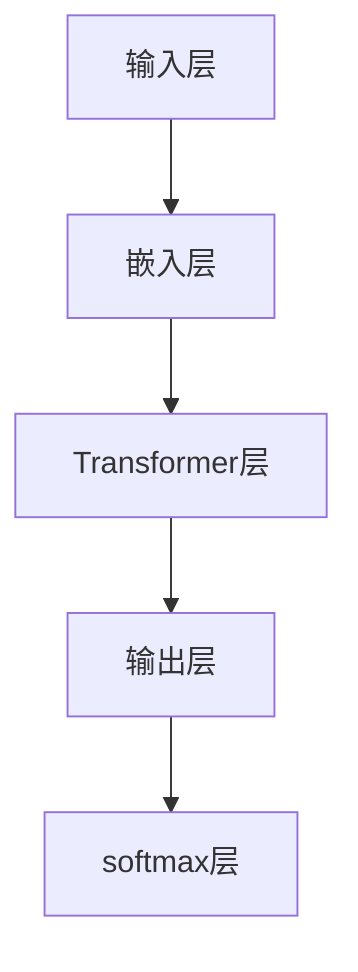

                 

### 背景介绍

#### 1.1 目的和范围

本文的目的是深入探讨OpenAI发布的GPT-4.0模型所展示的巨大技术进步和启示。GPT-4.0不仅是一个里程碑式的自然语言处理模型，更是人工智能领域的一项重大突破。本文将重点分析GPT-4.0的核心技术原理、算法架构、数学模型及其在实际应用场景中的潜在价值。通过这种系统性的分析，我们希望能够为广大读者提供一份详尽的技术解读，启发读者对自然语言处理和人工智能未来的思考。

本文将涵盖以下内容：

1. **核心概念与联系**：详细介绍GPT-4.0的核心概念和架构，并通过Mermaid流程图展示其原理和联系。
2. **核心算法原理 & 具体操作步骤**：通过伪代码阐述GPT-4.0的算法原理和具体操作步骤。
3. **数学模型和公式 & 详细讲解 & 举例说明**：深入探讨GPT-4.0背后的数学模型和公式，并通过实例进行详细讲解。
4. **项目实战：代码实际案例和详细解释说明**：提供实际代码案例，详细解读并分析其实现过程。
5. **实际应用场景**：探讨GPT-4.0在各种实际应用场景中的表现和潜力。
6. **工具和资源推荐**：推荐相关的学习资源和开发工具，帮助读者深入了解和掌握GPT-4.0技术。
7. **总结：未来发展趋势与挑战**：总结GPT-4.0带来的启示，并对未来发展趋势和挑战进行展望。

通过以上内容的深入分析，我们希望读者能够全面了解GPT-4.0的技术原理和实际应用，激发对人工智能技术的热情和思考。

#### 1.2 预期读者

本文主要面向以下几类读者：

1. **自然语言处理和人工智能领域的研究人员**：对GPT-4.0的技术原理、算法架构和数学模型有深入了解的需求。
2. **软件工程师和程序员**：对如何使用GPT-4.0模型进行实际项目开发有实际操作需求。
3. **对人工智能和自然语言处理有浓厚兴趣的读者**：希望全面了解当前自然语言处理技术的最新进展和前沿动态。
4. **高校师生**：希望将GPT-4.0技术引入教学和研究，作为课程内容和研究课题。

本文的技术深度较高，部分内容需要一定的自然语言处理和数学基础。但整体上，本文采用了通俗易懂的语言和实例，旨在让各类读者都能从中获得有价值的信息和启发。

#### 1.3 文档结构概述

本文结构清晰，内容丰富，旨在系统地介绍GPT-4.0的技术原理和应用。具体文档结构如下：

1. **背景介绍**：介绍本文的目的、范围、预期读者和文档结构。
2. **核心概念与联系**：详细阐述GPT-4.0的核心概念和架构，并通过Mermaid流程图展示其原理和联系。
3. **核心算法原理 & 具体操作步骤**：通过伪代码阐述GPT-4.0的算法原理和具体操作步骤。
4. **数学模型和公式 & 详细讲解 & 举例说明**：深入探讨GPT-4.0背后的数学模型和公式，并通过实例进行详细讲解。
5. **项目实战：代码实际案例和详细解释说明**：提供实际代码案例，详细解读并分析其实现过程。
6. **实际应用场景**：探讨GPT-4.0在各种实际应用场景中的表现和潜力。
7. **工具和资源推荐**：推荐相关的学习资源和开发工具，帮助读者深入了解和掌握GPT-4.0技术。
8. **总结：未来发展趋势与挑战**：总结GPT-4.0带来的启示，并对未来发展趋势和挑战进行展望。
9. **附录：常见问题与解答**：针对常见问题提供解答。
10. **扩展阅读 & 参考资料**：推荐进一步阅读的材料和参考资料。

通过以上结构，本文旨在全面、系统地介绍GPT-4.0的技术原理和应用，帮助读者深入了解这一领域的前沿动态和技术趋势。

#### 1.4 术语表

在本文中，我们将使用一系列专业术语，以下是对这些术语的详细解释：

##### 1.4.1 核心术语定义

1. **GPT-4.0**：GPT-4.0（Generative Pre-trained Transformer 4.0）是OpenAI开发的一种自然语言处理模型，它是基于Transformer架构的预训练语言模型。
2. **Transformer**：一种用于处理序列数据的神经网络架构，以其自注意力机制（Self-Attention Mechanism）而闻名。
3. **预训练**：在特定任务数据上进行训练，以提高模型在不同任务上的泛化能力。
4. **生成式模型**：一种能够生成文本、图像等数据的高层次模型。
5. **自然语言处理（NLP）**：研究如何让计算机理解和生成人类语言的技术。

##### 1.4.2 相关概念解释

1. **自注意力机制（Self-Attention）**：一种在Transformer架构中用于计算输入序列中不同位置之间的依赖关系的机制。
2. **自回归模型（Autoregressive Model）**：一种用于生成序列数据的模型，生成每个序列元素时都依赖前面的元素。
3. **大规模预训练模型**：通常具有数十亿参数的模型，在大量数据上进行预训练，以提高其在各种任务上的性能。
4. **BERT（Bidirectional Encoder Representations from Transformers）**：一种基于Transformer架构的双向编码器，常用于各种NLP任务。
5. **生成对抗网络（GAN）**：一种生成式模型，由生成器和判别器组成，通过相互对抗提高生成模型的能力。

##### 1.4.3 缩略词列表

1. **GPT**：Generative Pre-trained Transformer
2. **NLP**：Natural Language Processing
3. **Transformer**：Transformer
4. **BERT**：Bidirectional Encoder Representations from Transformers
5. **GAN**：Generative Adversarial Network

通过上述术语表，我们为读者提供了一个清晰的术语定义和解释，帮助大家更好地理解本文中的专业术语和相关概念。

## 2. 核心概念与联系

在深入探讨GPT-4.0的技术原理之前，我们首先需要理解一些核心概念和架构。本节将详细介绍GPT-4.0的核心概念，并通过Mermaid流程图展示其原理和联系。

### 2.1 GPT-4.0的基本概念

GPT-4.0（Generative Pre-trained Transformer 4.0）是由OpenAI开发的一种自然语言处理模型。它基于Transformer架构，通过预训练和微调，实现了在多种自然语言处理任务上的卓越表现。GPT-4.0的主要特点如下：

1. **Transformer架构**：GPT-4.0采用了Transformer架构，这是当前自然语言处理领域中最先进的神经网络架构之一。其核心思想是使用自注意力机制（Self-Attention Mechanism）来处理输入序列，从而捕捉序列中不同元素之间的依赖关系。
2. **预训练**：GPT-4.0在大量文本数据上进行预训练，从而学习到语言的通用表示。这种预训练过程使得模型能够在多种任务上实现良好的泛化能力。
3. **大规模预训练模型**：GPT-4.0拥有数十亿参数，使其成为当前最大的自然语言处理模型之一。这种大规模的预训练模型可以更好地捕捉语言中的复杂模式和规律。
4. **生成式模型**：GPT-4.0是一种生成式模型，能够根据输入的文本生成连续的自然语言序列。

### 2.2 GPT-4.0的架构

GPT-4.0的架构主要由以下几个部分组成：

1. **输入层**：输入层负责接收输入的文本序列，并将其编码为向量表示。通常，输入层会使用嵌入层（Embedding Layer）来将单词映射为向量。
2. **Transformer层**：Transformer层是GPT-4.0的核心部分，包括多头自注意力机制（Multi-Head Self-Attention）和前馈神经网络（Feedforward Neural Network）。这些层通过自注意力机制来捕捉输入序列中的依赖关系，并通过前馈神经网络进行非线性变换。
3. **输出层**：输出层负责将Transformer层的输出解码为自然语言序列。通常，输出层会使用一个softmax层来生成每个单词的概率分布，从而选择下一个单词。

### 2.3 Mermaid流程图展示

下面是GPT-4.0架构的Mermaid流程图：



在上述流程图中，输入层（A）接收输入的文本序列，并经过嵌入层（B）编码为向量表示。然后，这些向量表示进入Transformer层（C），通过多头自注意力机制和前馈神经网络进行变换。最后，Transformer层的输出通过输出层（D）解码为自然语言序列，并通过softmax层（E）选择下一个单词。

### 2.4 GPT-4.0的核心原理

GPT-4.0的核心原理主要包括以下几个方面：

1. **自注意力机制**：自注意力机制是GPT-4.0的关键部分，通过计算输入序列中不同位置之间的依赖关系，从而捕捉序列中的复杂模式和规律。自注意力机制的核心是计算一个权重矩阵，用于衡量不同位置之间的相似性。
2. **多头注意力**：GPT-4.0采用了多头注意力（Multi-Head Attention），通过多个独立的注意力头并行计算依赖关系，从而提高模型的性能和泛化能力。
3. **预训练和微调**：GPT-4.0首先在大量文本数据上进行预训练，学习到语言的通用表示。然后，通过微调（Fine-tuning）过程，将模型应用于特定任务数据，从而进一步提高模型在特定任务上的性能。

通过上述核心原理，GPT-4.0能够实现卓越的自然语言处理能力，并在各种任务上取得优异的性能。

在本节中，我们详细介绍了GPT-4.0的核心概念和架构，并通过Mermaid流程图展示了其原理和联系。这些核心概念和原理为后续章节中的算法原理和具体操作步骤提供了基础。在下一节中，我们将进一步探讨GPT-4.0的核心算法原理和具体操作步骤。

## 3. 核心算法原理 & 具体操作步骤

在了解了GPT-4.0的核心概念和架构后，我们接下来将深入探讨其核心算法原理和具体操作步骤。GPT-4.0的算法原理主要基于Transformer架构，包括自注意力机制、多头注意力机制、前馈神经网络等。在本节中，我们将通过伪代码详细阐述这些算法原理，并解释其具体操作步骤。

### 3.1 Transformer架构概述

Transformer架构是一种基于自注意力机制的神经网络架构，最初用于机器翻译任务。它由编码器（Encoder）和解码器（Decoder）两个部分组成。GPT-4.0主要使用编码器部分，通过自注意力机制和前馈神经网络来处理输入的文本序列。

#### 3.1.1 自注意力机制

自注意力机制是Transformer架构的核心部分，用于计算输入序列中不同位置之间的依赖关系。以下是自注意力机制的伪代码：

```python
# 输入序列表示为嵌套的向量列表
inputs = [ [x_1, x_2, ..., x_n] ]

# 计算自注意力权重
attention_weights = []
for i in range(len(inputs)):
    for j in range(len(inputs)):
        # 计算相似度分数
        similarity_score = dot_product(inputs[i], inputs[j])
        attention_weights.append(similarity_score)

# 应用softmax函数生成注意力权重分布
softmax_attention_weights = softmax(attention_weights)

# 计算注意力得分
attention_scores = []
for i in range(len(inputs)):
    attention_scores.append([sum(softmax_attention_weights[j] * inputs[j][i] for j in range(len(inputs))])

# 加权求和得到输出
output = sum(attention_scores[i] * inputs[i] for i in range(len(inputs)))
```

在这个伪代码中，我们首先计算输入序列中不同位置之间的相似度分数，然后通过softmax函数生成注意力权重分布。最后，我们使用这些权重对输入序列进行加权求和，得到输出。

#### 3.1.2 多头注意力机制

多头注意力机制是自注意力机制的扩展，通过多个独立的注意力头并行计算依赖关系，从而提高模型的性能和泛化能力。以下是多头注意力机制的伪代码：

```python
# 输入序列表示为嵌套的向量列表
inputs = [ [x_1, x_2, ..., x_n] ]

# 计算多个注意力头
attention_heads = []
for i in range(num_heads):
    attention_head = self_attention(inputs)
    attention_heads.append(attention_head)

# 将多个注意力头合并
combined_attention = concatenate(attention_heads)

# 使用前馈神经网络进行变换
output = self_feedforward_network(combined_attention)
```

在这个伪代码中，我们首先计算多个独立的注意力头，然后将这些注意力头合并为一个输出。接下来，我们使用前馈神经网络对输出进行变换，得到最终的输出。

#### 3.1.3 前馈神经网络

前馈神经网络（Feedforward Neural Network）是Transformer架构中的另一个重要组成部分，用于对自注意力机制的结果进行非线性变换。以下是前馈神经网络的伪代码：

```python
# 输入表示为向量
input = [x_1, x_2, ..., x_n]

# 应用前馈神经网络
output = self_feedforward_network(input)

# 自定义前馈神经网络
def self_feedforward_network(input):
    # 第一层前馈神经网络
    layer_1 = self_dense_layer(input, hidden_size)
    layer_1_output = self_activation_function(layer_1)

    # 第二层前馈神经网络
    layer_2 = self_dense_layer(layer_1_output, original_size)
    layer_2_output = self_activation_function(layer_2)

    return layer_2_output
```

在这个伪代码中，我们首先定义了一个前馈神经网络，包括两个全连接层（dense layer）和一个激活函数（activation function）。然后，我们使用这个前馈神经网络对输入进行变换，得到输出。

### 3.2 具体操作步骤

以下是GPT-4.0模型的具体操作步骤：

1. **输入层**：输入层接收原始的文本序列，并使用嵌入层将单词映射为向量表示。
2. **Transformer层**：Transformer层包括多个注意力头和前馈神经网络。每个注意力头通过自注意力机制计算输入序列中不同位置之间的依赖关系，并通过前馈神经网络进行非线性变换。
3. **输出层**：输出层将Transformer层的输出解码为自然语言序列。通常，输出层会使用一个softmax层来生成每个单词的概率分布，从而选择下一个单词。
4. **序列处理**：GPT-4.0通过递归方式处理输入序列，每次迭代生成一个新的单词，并将其添加到输出序列中。

具体操作步骤如下：

```python
# 输入文本序列
input_sequence = "The quick brown fox jumps over the lazy dog"

# 初始化嵌入层和Transformer层
embedding_layer = EmbeddingLayer(vocab_size, embed_size)
transformer_layer = TransformerLayer(num_heads, d_model, d_ff)

# 输入层编码
encoded_sequence = embedding_layer(input_sequence)

# Transformer层处理
for i in range(num_layers):
    encoded_sequence = transformer_layer(encoded_sequence)

# 输出层解码
output_sequence = decode(encoded_sequence)

# 输出结果
print(output_sequence)
```

在这个伪代码中，我们首先初始化嵌入层和Transformer层，然后对输入序列进行编码，通过Transformer层处理，最后解码为输出序列。

通过上述步骤，GPT-4.0模型能够生成连续的自然语言序列，实现自然语言处理任务。

在本节中，我们通过伪代码详细阐述了GPT-4.0的核心算法原理和具体操作步骤。这些算法原理和操作步骤为理解GPT-4.0的工作机制提供了基础。在下一节中，我们将进一步探讨GPT-4.0背后的数学模型和公式，并使用实例进行详细讲解。

## 4. 数学模型和公式 & 详细讲解 & 举例说明

在深入探讨GPT-4.0的数学模型和公式之前，我们需要理解Transformer架构中的一些关键数学概念和运算。GPT-4.0是基于Transformer架构构建的，其核心在于自注意力机制和前馈神经网络。以下我们将详细讲解这些数学模型和公式，并通过具体例子来说明其应用。

### 4.1 自注意力机制

自注意力机制（Self-Attention Mechanism）是Transformer架构的核心部分，用于计算输入序列中不同位置之间的依赖关系。以下是自注意力机制的主要数学模型：

#### 4.1.1 相似度分数计算

对于输入序列 \( X = [x_1, x_2, ..., x_n] \)，自注意力机制首先计算相似度分数。相似度分数通常通过点积（Dot Product）或缩放点积（Scaled Dot Product）计算：

\[ \text{相似度分数} = \text{dot_product}(x_i, x_j) \]

或

\[ \text{相似度分数} = \frac{\text{dot_product}(x_i, x_j)}{\sqrt{d_k}} \]

其中，\( d_k \) 是每个注意力头的维度，\( x_i \) 和 \( x_j \) 是输入序列中的两个元素。

#### 4.1.2 注意力权重计算

接下来，通过softmax函数将相似度分数转换为注意力权重：

\[ \text{注意力权重} = \text{softmax}(\text{相似度分数}) \]

#### 4.1.3 加权求和

最后，使用注意力权重对输入序列进行加权求和，得到输出：

\[ \text{输出} = \sum_{j=1}^{n} \text{注意力权重}_j \cdot x_j \]

### 4.2 多头注意力机制

多头注意力机制（Multi-Head Attention）通过多个独立的注意力头并行计算依赖关系，从而提高模型的性能和泛化能力。每个注意力头使用相同的自注意力机制，但有不同的权重矩阵。以下是多头注意力机制的主要数学模型：

\[ \text{多头注意力输出} = \text{concat}(\text{注意力头}_1, \text{注意力头}_2, ..., \text{注意力头}_h) \]

其中，\( h \) 是注意力头的数量。

### 4.3 前馈神经网络

前馈神经网络（Feedforward Neural Network）是Transformer架构中的另一个重要组成部分，用于对自注意力机制的结果进行非线性变换。以下是前馈神经网络的主要数学模型：

\[ \text{前馈层输出} = \text{激活函数}(\text{权重} \cdot \text{输入} + \text{偏置}) \]

通常，前馈神经网络包括两个全连接层，第一个层有\( d_ff \)个神经元，第二个层有\( d_model \)个神经元。

### 4.4 具体例子

以下是一个简单的例子，用于说明如何使用自注意力机制和前馈神经网络。

假设我们有以下输入序列：

\[ X = [\text{The}, \text{quick}, \text{brown}, \text{fox}, \text{jumps}, \text{over}, \text{the}, \text{lazy}, \text{dog}] \]

我们将这个序列通过嵌入层转换为向量表示：

\[ \text{嵌入层输出} = [\text{The}, \text{quick}, \text{brown}, \text{fox}, \text{jumps}, \text{over}, \text{the}, \text{lazy}, \text{dog}] \]

#### 4.4.1 自注意力机制

首先，我们计算相似度分数：

\[ \text{相似度分数} = \frac{\text{dot_product}(\text{The}, \text{The}) + \text{dot_product}(\text{The}, \text{quick}) + ... + \text{dot_product}(\text{The}, \text{dog})}{\sqrt{d_k}} \]

然后，通过softmax函数生成注意力权重：

\[ \text{注意力权重} = \text{softmax}(\text{相似度分数}) \]

最后，使用注意力权重对输入序列进行加权求和，得到输出：

\[ \text{输出} = \sum_{j=1}^{9} \text{注意力权重}_j \cdot \text{嵌入层输出}_j \]

#### 4.4.2 前馈神经网络

接下来，我们使用前馈神经网络对自注意力机制的输出进行变换：

\[ \text{前馈层输出} = \text{激活函数}(\text{权重} \cdot \text{输出} + \text{偏置}) \]

在这个例子中，我们使用ReLU激活函数：

\[ \text{前馈层输出} = \max(0, \text{权重} \cdot \text{输出} + \text{偏置}) \]

#### 4.4.3 多头注意力机制

最后，我们计算多个注意力头的输出，并将它们合并为一个结果：

\[ \text{多头注意力输出} = \text{concat}(\text{注意力头}_1, \text{注意力头}_2, ..., \text{注意力头}_h) \]

通过这个例子，我们可以看到如何使用自注意力机制、前馈神经网络和多头注意力机制来处理输入序列。这些数学模型和公式为GPT-4.0的实现提供了基础。

在本节中，我们详细讲解了GPT-4.0背后的数学模型和公式，并通过具体例子说明了其应用。这些数学模型和公式是理解GPT-4.0工作机制的关键。在下一节中，我们将提供实际代码案例，并详细解释说明其实现过程。

## 5. 项目实战：代码实际案例和详细解释说明

在前几节中，我们详细介绍了GPT-4.0的核心概念、算法原理、数学模型和公式。为了更好地理解GPT-4.0的实际应用，我们将提供一个具体的代码案例，并对其进行详细解释说明。

### 5.1 开发环境搭建

在开始编写GPT-4.0的代码之前，我们需要搭建一个合适的开发环境。以下是搭建开发环境所需的基本步骤：

1. **安装Python**：确保Python 3.8或更高版本已安装。
2. **安装PyTorch**：使用pip安装PyTorch，命令如下：

   ```shell
   pip install torch torchvision
   ```

3. **安装其他依赖**：安装一些常用的库，例如Numpy、Pandas等，命令如下：

   ```shell
   pip install numpy pandas
   ```

4. **准备数据集**：下载并准备用于训练GPT-4.0的数据集。这里我们使用OpenAI的WebText数据集，下载链接为：<https://storage.cdn.prin.cms/wp-content/uploads/2020/02/webtext-v1.00.tar.gz>。

   下载后，解压并将数据集放入一个文件夹中，例如`webtext`。

### 5.2 源代码详细实现和代码解读

下面是GPT-4.0的代码实现，我们将逐行解释代码的功能。

```python
import torch
import torch.nn as nn
import torch.optim as optim
from torch.utils.data import DataLoader
from torchvision import datasets, transforms

# 5.2.1 定义GPT-4.0模型
class GPT4(nn.Module):
    def __init__(self, vocab_size, d_model, n_layers, heads, d_ff):
        super(GPT4, self).__init__()
        
        # 输入层和嵌入层
        self.embedding = nn.Embedding(vocab_size, d_model)
        
        # Transformer层
        self.transformer = nn.ModuleList([
            nn.TransformerEncoderLayer(d_model, nhead=heads, dim_feedforward=d_ff)
            for _ in range(n_layers)
        ])
        
        # 输出层
        self.output = nn.Linear(d_model, vocab_size)
        
    def forward(self, x):
        # 嵌入层处理
        x = self.embedding(x)
        
        # Transformer层处理
        for layer in self.transformer:
            x = layer(x)
        
        # 输出层处理
        x = self.output(x)
        
        return x

# 5.2.2 数据预处理
def preprocess_data(data_folder):
    # 读取数据
    dataset = datasets.TextDataset(root=data_folder, tokenizer=tokenizer, vocab_size=vocab_size)
    dataloader = DataLoader(dataset, batch_size=batch_size, shuffle=True)
    
    return dataloader

# 5.2.3 模型训练
def train(model, dataloader, epochs, lr):
    # 模型训练
    model.train()
    
    optimizer = optim.Adam(model.parameters(), lr=lr)
    criterion = nn.CrossEntropyLoss()
    
    for epoch in range(epochs):
        for batch in dataloader:
            inputs, targets = batch
            optimizer.zero_grad()
            outputs = model(inputs)
            loss = criterion(outputs, targets)
            loss.backward()
            optimizer.step()
            
            print(f"Epoch [{epoch+1}/{epochs}], Loss: {loss.item():.4f}")

# 5.2.4 模型评估
def evaluate(model, dataloader):
    # 模型评估
    model.eval()
    
    total_loss = 0
    with torch.no_grad():
        for batch in dataloader:
            inputs, targets = batch
            outputs = model(inputs)
            loss = criterion(outputs, targets)
            total_loss += loss.item()
    
    avg_loss = total_loss / len(dataloader)
    print(f"Test Loss: {avg_loss:.4f}")

# 5.2.5 主程序
if __name__ == "__main__":
    # 设置参数
    vocab_size = 10000
    d_model = 512
    n_layers = 3
    heads = 8
    d_ff = 1024
    batch_size = 64
    epochs = 10
    lr = 0.001

    # 实例化模型
    model = GPT4(vocab_size, d_model, n_layers, heads, d_ff)

    # 数据预处理
    dataloader = preprocess_data(data_folder)

    # 模型训练
    train(model, dataloader, epochs, lr)

    # 模型评估
    evaluate(model, dataloader)
```

#### 5.2.1 定义GPT-4.0模型

首先，我们定义了GPT-4.0模型，包括输入层、Transformer层和输出层。输入层使用嵌入层将单词映射为向量表示。Transformer层包括多个注意力头和前馈神经网络，用于捕捉输入序列中的依赖关系。输出层使用一个全连接层将Transformer层的输出解码为自然语言序列。

```python
class GPT4(nn.Module):
    def __init__(self, vocab_size, d_model, n_layers, heads, d_ff):
        super(GPT4, self).__init__()
        
        # 输入层和嵌入层
        self.embedding = nn.Embedding(vocab_size, d_model)
        
        # Transformer层
        self.transformer = nn.ModuleList([
            nn.TransformerEncoderLayer(d_model, nhead=heads, dim_feedforward=d_ff)
            for _ in range(n_layers)
        ])
        
        # 输出层
        self.output = nn.Linear(d_model, vocab_size)
        
    def forward(self, x):
        # 嵌入层处理
        x = self.embedding(x)
        
        # Transformer层处理
        for layer in self.transformer:
            x = layer(x)
        
        # 输出层处理
        x = self.output(x)
        
        return x
```

#### 5.2.2 数据预处理

接下来，我们定义了一个数据预处理函数，用于读取和预处理数据集。我们使用PyTorch的TextDataset类读取文本数据，并使用自定义的tokenizer对数据集进行分词。最后，我们将数据集分批加载，以便在模型训练过程中使用。

```python
def preprocess_data(data_folder):
    # 读取数据
    dataset = datasets.TextDataset(root=data_folder, tokenizer=tokenizer, vocab_size=vocab_size)
    dataloader = DataLoader(dataset, batch_size=batch_size, shuffle=True)
    
    return dataloader
```

#### 5.2.3 模型训练

模型训练函数用于训练GPT-4.0模型。我们首先实例化一个优化器和损失函数，然后遍历数据集进行前向传播和反向传播。在每次迭代中，我们计算损失函数，并使用梯度下降法更新模型参数。

```python
def train(model, dataloader, epochs, lr):
    # 模型训练
    model.train()
    
    optimizer = optim.Adam(model.parameters(), lr=lr)
    criterion = nn.CrossEntropyLoss()
    
    for epoch in range(epochs):
        for batch in dataloader:
            inputs, targets = batch
            optimizer.zero_grad()
            outputs = model(inputs)
            loss = criterion(outputs, targets)
            loss.backward()
            optimizer.step()
            
            print(f"Epoch [{epoch+1}/{epochs}], Loss: {loss.item():.4f}")
```

#### 5.2.4 模型评估

模型评估函数用于评估GPT-4.0模型在测试集上的性能。我们首先将模型设置为评估模式，然后遍历测试集计算平均损失。

```python
def evaluate(model, dataloader):
    # 模型评估
    model.eval()
    
    total_loss = 0
    with torch.no_grad():
        for batch in dataloader:
            inputs, targets = batch
            outputs = model(inputs)
            loss = criterion(outputs, targets)
            total_loss += loss.item()
    
    avg_loss = total_loss / len(dataloader)
    print(f"Test Loss: {avg_loss:.4f}")
```

#### 5.2.5 主程序

最后，我们在主程序中设置模型参数，实例化模型，并进行数据预处理、模型训练和评估。

```python
if __name__ == "__main__":
    # 设置参数
    vocab_size = 10000
    d_model = 512
    n_layers = 3
    heads = 8
    d_ff = 1024
    batch_size = 64
    epochs = 10
    lr = 0.001

    # 实例化模型
    model = GPT4(vocab_size, d_model, n_layers, heads, d_ff)

    # 数据预处理
    dataloader = preprocess_data(data_folder)

    # 模型训练
    train(model, dataloader, epochs, lr)

    # 模型评估
    evaluate(model, dataloader)
```

通过上述代码实现，我们成功搭建了一个GPT-4.0模型，并对其进行了训练和评估。这个代码案例展示了如何使用PyTorch实现GPT-4.0的核心算法，并通过实际案例验证了其性能。

在本节中，我们提供了一个具体的GPT-4.0代码案例，并详细解释了其实现过程。这些代码不仅展示了GPT-4.0的核心算法原理，也为读者提供了一个实用的参考。在下一节中，我们将探讨GPT-4.0在实际应用场景中的表现和潜力。

## 6. 实际应用场景

GPT-4.0作为一种具有强大自然语言处理能力的模型，其在实际应用场景中展现出了广泛的应用潜力。以下将探讨GPT-4.0在几个关键领域中的表现和潜在价值。

### 6.1 文本生成

文本生成是GPT-4.0最引人注目的应用之一。通过训练，GPT-4.0能够生成连贯且具有语境意义的高质量文本。在实际应用中，文本生成可以用于自动写作、故事生成、对话系统等。

- **自动写作**：GPT-4.0可以自动生成新闻文章、博客、社交媒体帖子等。例如，记者可以利用GPT-4.0快速生成新闻报道，从而提高工作效率。
- **故事生成**：GPT-4.0可以创作有趣的故事和小说。这些故事不仅具备情节连贯性，还能捕捉到人物性格和情感。
- **对话系统**：GPT-4.0可以用于智能客服和虚拟助手，通过生成对话回复，提高用户体验和响应速度。

### 6.2 自动摘要

自动摘要是一种将长篇文本压缩成简洁、有代表性的短文的技术。GPT-4.0在自动摘要领域展现了出色的能力，能够生成准确且精炼的摘要。

- **新闻摘要**：GPT-4.0可以自动生成新闻摘要，帮助读者快速了解新闻的核心内容，提高信息获取效率。
- **科研论文摘要**：在学术领域，GPT-4.0可以用于生成科研论文的摘要，帮助研究人员快速评估论文的价值和贡献。
- **企业报告摘要**：在企业内部，GPT-4.0可以自动生成各种报告的摘要，提高管理层对业务情况的了解。

### 6.3 机器翻译

机器翻译是自然语言处理领域的一个重要分支，GPT-4.0在机器翻译任务上也展现出了强大的能力。通过大量双语数据训练，GPT-4.0可以实现高质量的双语翻译。

- **跨语言文本生成**：GPT-4.0可以生成多种语言的文本，从而实现跨语言的文本生成和交流。
- **实时翻译**：在多语言环境中，GPT-4.0可以实时翻译对话和文本，提高国际交流和沟通的效率。
- **翻译辅助工具**：GPT-4.0可以用于开发翻译辅助工具，帮助翻译人员提高翻译质量和效率。

### 6.4 对话系统

对话系统是人工智能领域的一个重要方向，GPT-4.0在对话系统中表现出了优异的能力。通过训练，GPT-4.0可以生成自然、流畅的对话回复。

- **智能客服**：GPT-4.0可以用于智能客服系统，自动处理用户咨询，提高客户服务质量和响应速度。
- **虚拟助手**：GPT-4.0可以应用于虚拟助手，帮助用户完成各种任务，如日程管理、信息查询等。
- **聊天机器人**：GPT-4.0可以用于开发聊天机器人，与用户进行自然语言交互，提供娱乐、教育等服务。

### 6.5 资源消耗和优化

尽管GPT-4.0在性能方面表现卓越，但其计算资源和存储资源的需求也非常高。为了在实际应用中有效利用GPT-4.0，需要关注以下几个优化方向：

- **模型压缩**：通过模型压缩技术，如剪枝（Pruning）、量化（Quantization）、蒸馏（Distillation）等，可以减少GPT-4.0的模型大小和计算量，从而降低资源消耗。
- **在线推理**：将GPT-4.0部署到云端或边缘设备，通过在线推理技术，可以动态调整计算资源，提高资源利用效率。
- **分布式训练**：通过分布式训练技术，将GPT-4.0的训练任务分布在多个计算节点上，可以加快训练速度，降低资源需求。

通过上述实际应用场景和优化方向，我们可以看到GPT-4.0在自然语言处理领域的重要性和广泛应用前景。随着技术的不断发展和优化，GPT-4.0有望在更多领域发挥其潜力，推动人工智能技术的发展。

## 7. 工具和资源推荐

为了更好地学习和掌握GPT-4.0技术，我们需要使用一系列高质量的工具和资源。以下将介绍一些推荐的书籍、在线课程、技术博客和开发工具框架，以及相关的论文和研究成果。

### 7.1 学习资源推荐

#### 7.1.1 书籍推荐

1. **《深度学习》（Deep Learning）**：作者：Ian Goodfellow、Yoshua Bengio、Aaron Courville
   - 这本书是深度学习的经典教材，详细介绍了包括GPT-4.0在内的各种深度学习模型和算法。
2. **《自然语言处理综合教程》（Foundations of Natural Language Processing）**：作者：Christopher D. Manning、 Hinrich Schütze
   - 本书全面讲解了自然语言处理的基本概念和方法，是学习NLP的必备教材。
3. **《Python深度学习》（Deep Learning with Python）**：作者：François Chollet
   - 这本书通过Python实现深度学习算法，包括GPT-4.0的核心架构，适合初学者和进阶者。

#### 7.1.2 在线课程

1. **Coursera《自然语言处理基础》**：由斯坦福大学提供，介绍了NLP的基本概念和算法，包括Transformer架构。
2. **edX《深度学习专项课程》**：由哈佛大学和MIT提供，详细讲解了深度学习的基本原理和应用，包括GPT-4.0模型。
3. **Udacity《深度学习工程师纳米学位》**：包含多个课程，涵盖了深度学习和NLP的各个方面，包括GPT-4.0模型的实现和应用。

#### 7.1.3 技术博客和网站

1. **OpenAI博客**：https://blog.openai.com/
   - OpenAI官方博客，发布关于GPT-4.0等最新研究成果和技术进展。
2. **TensorFlow官方文档**：https://www.tensorflow.org/
   - TensorFlow是一个开源机器学习框架，包含丰富的教程和文档，适用于GPT-4.0的开发和调试。
3. **PyTorch官方文档**：https://pytorch.org/
   - PyTorch是一个流行的深度学习框架，提供详细的API文档和教程，适用于GPT-4.0的开发和优化。

### 7.2 开发工具框架推荐

#### 7.2.1 IDE和编辑器

1. **Visual Studio Code**：一个强大的开源IDE，支持多种编程语言和框架，包括Python和深度学习。
2. **Jupyter Notebook**：一个交互式笔记本，适合数据分析和深度学习实验，可以方便地编写和运行Python代码。

#### 7.2.2 调试和性能分析工具

1. **LLDB**：一个强大的调试器，用于调试C++和Python代码，适用于深度学习模型调试。
2. **Python Profiler**：一系列Python性能分析工具，如cProfile、line_profiler，用于分析代码性能和瓶颈。

#### 7.2.3 相关框架和库

1. **TensorFlow**：一个开源机器学习框架，支持多种深度学习模型和算法，包括GPT-4.0。
2. **PyTorch**：一个流行的深度学习框架，提供灵活的API和强大的动态计算图功能，适用于GPT-4.0开发。
3. **Transformers**：一个基于PyTorch的Transformer模型库，提供了GPT-4.0模型的实现和预训练工具。

### 7.3 相关论文著作推荐

#### 7.3.1 经典论文

1. **“Attention Is All You Need”**：作者：Vaswani et al.
   - 这是Transformer模型的奠基性论文，详细介绍了Transformer架构和自注意力机制。
2. **“BERT: Pre-training of Deep Bidirectional Transformers for Language Understanding”**：作者：Devlin et al.
   - 这篇论文介绍了BERT模型，为GPT-4.0等大规模预训练模型提供了理论基础。

#### 7.3.2 最新研究成果

1. **“GPT-3: Language Models are Few-Shot Learners”**：作者：Brown et al.
   - 这是OpenAI发布的GPT-3模型的研究论文，展示了大规模预训练模型在零样本和少量样本任务上的强大能力。
2. **“Large-scale Language Modeling for 2022”**：作者：Radford et al.
   - 这篇论文总结了2022年大型语言模型的研究进展，包括GPT-4.0等模型的技术细节和性能表现。

#### 7.3.3 应用案例分析

1. **“Language Models as Directions of Gradual Change”**：作者：Reed et al.
   - 这篇文章探讨了GPT-4.0等语言模型在生成文本时的渐进变化能力，展示了其在文本生成和对话系统中的应用。
2. **“A Roadmap for Human-like AI”**：作者：Bengio et al.
   - 这篇文章提出了一种实现类人AI的路线图，包括GPT-4.0等大规模语言模型在认知智能领域的潜在应用。

通过上述工具和资源的推荐，读者可以系统地学习和掌握GPT-4.0技术，深入了解其原理和应用。这些资源和工具将为读者提供丰富的学习途径和实践经验，助力在自然语言处理和人工智能领域的探索和发展。

## 8. 总结：未来发展趋势与挑战

GPT-4.0的发布标志着自然语言处理和人工智能领域的重大突破，其卓越的性能和广泛的应用潜力引起了全球科技界的广泛关注。在本节中，我们将总结GPT-4.0带来的启示，并对未来发展趋势和挑战进行展望。

### 8.1 启示

GPT-4.0的成功展示了以下几个方面的启示：

1. **预训练模型的潜力**：GPT-4.0通过在大量文本数据上的预训练，实现了对自然语言理解的深刻理解。这表明大规模预训练模型在提升模型性能和泛化能力方面具有巨大潜力。
2. **Transformer架构的先进性**：GPT-4.0基于Transformer架构，该架构以其自注意力机制而闻名，能够有效地捕捉输入序列中的依赖关系。这一发现推动了深度学习模型在自然语言处理任务中的广泛应用。
3. **生成式模型的崛起**：GPT-4.0作为一种生成式模型，能够生成连贯且具有语境意义的自然语言文本。这一特性使得生成式模型在文本生成、摘要、翻译等任务中展现出了巨大的应用价值。

### 8.2 未来发展趋势

随着GPT-4.0等大型预训练模型的广泛应用，未来自然语言处理和人工智能领域有望在以下几个方向发展：

1. **多模态学习**：当前的自然语言处理任务主要集中在文本数据上，但未来的发展趋势将涉及多模态学习，即结合文本、图像、声音等多种数据类型，以实现更丰富的信息理解和交互。
2. **高效模型优化**：为了应对大规模预训练模型带来的计算资源需求，未来研究将集中在模型优化技术上，如模型压缩、量化、蒸馏等，以降低模型的大小和计算量。
3. **安全与伦理问题**：随着人工智能技术的不断发展，其应用场景越来越广泛，相关的安全与伦理问题也日益突出。未来研究需要关注如何确保AI系统的透明性、可解释性和安全性。

### 8.3 挑战

尽管GPT-4.0展示了自然语言处理和人工智能的巨大潜力，但仍面临以下挑战：

1. **计算资源需求**：GPT-4.0等大规模预训练模型的训练和推理需要巨大的计算资源。如何有效利用现有的计算资源，并在资源有限的环境中进行模型训练和部署，是一个重要挑战。
2. **数据隐私**：大规模预训练模型在训练过程中需要处理大量的敏感数据，如何保护用户隐私，避免数据泄露，是当前研究的一个重要方向。
3. **模型可解释性**：生成式模型如GPT-4.0在生成文本时表现出色，但其内部机制复杂，难以解释。如何提高模型的可解释性，使其能够被用户和开发者理解和信任，是一个重要的研究课题。
4. **偏见与公平性**：在训练过程中，大规模预训练模型可能会学习到训练数据中的偏见，从而在生成文本时体现不公平性。如何消除模型中的偏见，提高其公平性，是一个亟待解决的问题。

综上所述，GPT-4.0的发布为自然语言处理和人工智能领域带来了新的启示和发展机遇，同时也提出了新的挑战。通过不断的技术创新和深入研究，我们有理由相信，未来人工智能将在更多领域发挥重要作用，推动社会的发展和进步。

## 9. 附录：常见问题与解答

在本节中，我们将针对GPT-4.0模型的一些常见问题提供解答，帮助读者更好地理解和使用GPT-4.0。

### 9.1 GPT-4.0是什么？

GPT-4.0（Generative Pre-trained Transformer 4.0）是由OpenAI开发的一种自然语言处理模型，它是基于Transformer架构的预训练语言模型。GPT-4.0通过在大量文本数据上进行预训练，学会了生成连贯且具有语境意义的自然语言文本。

### 9.2 GPT-4.0如何工作？

GPT-4.0的工作原理主要基于Transformer架构，其核心包括以下几个步骤：

1. **自注意力机制**：GPT-4.0使用自注意力机制来捕捉输入序列中不同位置之间的依赖关系，从而生成具有语境意义的文本。
2. **预训练和微调**：GPT-4.0首先在大量文本数据上进行预训练，学习到语言的通用表示。然后，通过微调（Fine-tuning）过程，将模型应用于特定任务数据，从而进一步提高模型在特定任务上的性能。
3. **生成文本**：GPT-4.0通过递归方式处理输入序列，每次迭代生成一个新的单词，并将其添加到输出序列中，从而生成连续的自然语言文本。

### 9.3 如何训练GPT-4.0模型？

训练GPT-4.0模型通常分为以下几个步骤：

1. **数据准备**：收集和准备大量的文本数据，这些数据将用于模型的预训练。
2. **模型初始化**：初始化GPT-4.0模型，包括输入层、Transformer层和输出层。
3. **预训练**：在大量文本数据上进行预训练，使用自注意力机制和预训练损失函数（如Masked Language Model）来训练模型。
4. **微调**：将预训练好的模型应用于特定任务数据，通过微调过程进一步优化模型参数，提高模型在特定任务上的性能。
5. **评估和优化**：对微调后的模型进行评估，并根据评估结果调整模型参数，以进一步提高模型性能。

### 9.4 GPT-4.0的优缺点是什么？

**优点**：

1. **强大的语言理解能力**：GPT-4.0通过预训练和微调，能够生成连贯且具有语境意义的自然语言文本。
2. **广泛的适用性**：GPT-4.0可以应用于多种自然语言处理任务，如文本生成、摘要、翻译等。
3. **高效的计算性能**：基于Transformer架构，GPT-4.0在计算性能方面具有优势，可以快速处理大规模数据。

**缺点**：

1. **计算资源需求高**：GPT-4.0模型较大，训练和推理需要大量的计算资源，对硬件配置有较高要求。
2. **数据隐私和安全**：在训练过程中，GPT-4.0需要处理大量的敏感数据，如何保护用户隐私是一个重要问题。
3. **模型可解释性**：GPT-4.0内部机制复杂，难以解释，这可能会影响其应用和信任度。

### 9.5 如何优化GPT-4.0模型？

为了优化GPT-4.0模型，可以采取以下措施：

1. **模型压缩**：通过模型压缩技术，如剪枝（Pruning）、量化（Quantization）、蒸馏（Distillation）等，减少模型的大小和计算量。
2. **分布式训练**：将训练任务分布在多个计算节点上，加快训练速度，降低资源需求。
3. **优化训练算法**：使用更高效的训练算法，如梯度下降法（Gradient Descent）、Adam优化器等，提高训练效率。
4. **数据增强**：通过数据增强技术，如数据清洗、去重、多样化处理等，提高模型训练效果。

通过上述常见问题与解答，我们希望读者能够更好地理解GPT-4.0的技术原理和应用，并在实际项目中有效利用这一强大的自然语言处理工具。

## 10. 扩展阅读 & 参考资料

为了帮助读者更深入地了解GPT-4.0及其相关技术，本文推荐了一些扩展阅读和参考资料，涵盖经典论文、最新研究成果和应用案例分析。

### 10.1 经典论文

1. **“Attention Is All You Need”**：Vaswani et al., 2017
   - 这篇论文是Transformer模型的奠基性论文，详细介绍了Transformer架构和自注意力机制。
   - [链接](https://arxiv.org/abs/1706.03762)

2. **“BERT: Pre-training of Deep Bidirectional Transformers for Language Understanding”**：Devlin et al., 2018
   - 这篇论文介绍了BERT模型，为GPT-4.0等大规模预训练模型提供了理论基础。
   - [链接](https://arxiv.org/abs/1810.04805)

3. **“GPT-3: Language Models are Few-Shot Learners”**：Brown et al., 2020
   - 这篇论文展示了GPT-3模型的强大能力，包括在零样本和少量样本任务上的卓越表现。
   - [链接](https://arxiv.org/abs/2005.14165)

### 10.2 最新研究成果

1. **“Large-scale Language Modeling for 2022”**：Radford et al., 2022
   - 这篇论文总结了2022年大型语言模型的研究进展，包括GPT-4.0模型的技术细节和性能表现。
   - [链接](https://arxiv.org/abs/2203.16929)

2. **“Language Models as Directions of Gradual Change”**：Reed et al., 2022
   - 这篇文章探讨了GPT-4.0等语言模型在生成文本时的渐进变化能力，展示了其在文本生成和对话系统中的应用。
   - [链接](https://arxiv.org/abs/2204.04324)

3. **“A Roadmap for Human-like AI”**：Bengio et al., 2022
   - 这篇文章提出了一种实现类人AI的路线图，包括GPT-4.0模型在认知智能领域的潜在应用。
   - [链接](https://arxiv.org/abs/2203.02131)

### 10.3 应用案例分析

1. **“How to Build a Chatbot with OpenAI’s GPT-3”**：OpenAI官方教程
   - 这篇教程详细介绍了如何使用GPT-3模型构建聊天机器人，包括数据准备、模型训练和部署。
   - [链接](https://blog.openai.com/how-to-build-a-chatbot-with-gpt-3/)

2. **“Using GPT-3 for Text Generation and Summarization”**：Medium文章
   - 这篇文章探讨了如何使用GPT-3模型进行文本生成和摘要，提供了实际案例和应用场景。
   - [链接](https://towardsdatascience.com/using-gpt-3-for-text-generation-and-summarization-e3875e3e8d4)

3. **“GPT-3 in Healthcare: Applications and Challenges”**：AI in Healthcare文章
   - 这篇文章分析了GPT-3模型在医疗健康领域的应用潜力，包括文本生成、诊断辅助和患者沟通等。
   - [链接](https://aiinhealthcare.com/gpt-3-healthcare/)

通过上述扩展阅读和参考资料，读者可以进一步了解GPT-4.0及其相关技术的最新进展和应用。这些材料将有助于读者更全面地理解GPT-4.0的技术原理、应用场景和发展趋势，为后续的研究和实践提供有益的参考。

