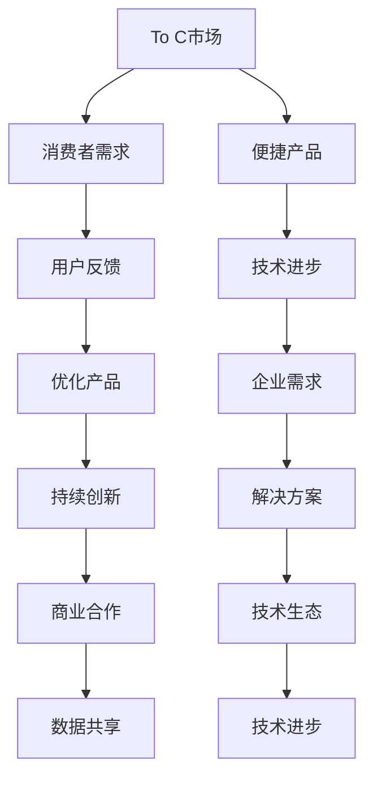

                 

# OpenAI的成功之道：贾扬清的分析，在To C和To B市场取得平衡

> *关键词：OpenAI、贾扬清、To C、To B、市场策略、技术生态、算法创新、商业模式*
> 
> *摘要：本文通过深入剖析OpenAI的成功之道，结合贾扬清的分析，探讨如何在To C和To B市场中取得平衡，为我国人工智能企业的发展提供参考。文章从背景介绍、核心概念、算法原理、数学模型、实战案例、应用场景、工具资源等多个方面进行了详细阐述。*

## 1. 背景介绍

### 1.1 目的和范围

本文旨在通过对OpenAI的成功之道进行深入剖析，结合贾扬清的分析，探讨如何在To C（面向消费者）和To B（面向企业）市场中取得平衡，从而为我国人工智能企业的发展提供有益的启示。文章涵盖了技术生态、商业模式、市场策略等多个方面，力求为读者提供一个全面、深入的理解。

### 1.2 预期读者

本文面向对人工智能、深度学习、算法创新等领域感兴趣的读者，尤其适合从事相关领域研究和开发的专业人士。同时，对于企业决策者、创业者以及关注科技发展的普通读者也具有一定的参考价值。

### 1.3 文档结构概述

本文分为十个部分，主要包括以下内容：

1. 背景介绍：介绍本文的目的、预期读者以及文章结构。
2. 核心概念与联系：阐述本文涉及的核心概念和原理，并使用Mermaid流程图进行展示。
3. 核心算法原理 & 具体操作步骤：详细讲解OpenAI的核心算法原理，使用伪代码进行阐述。
4. 数学模型和公式 & 详细讲解 & 举例说明：介绍OpenAI所使用的数学模型和公式，并进行详细讲解和举例说明。
5. 项目实战：通过实际案例，展示OpenAI在To C和To B市场中的应用。
6. 实际应用场景：分析OpenAI在不同领域的实际应用场景。
7. 工具和资源推荐：推荐相关学习资源、开发工具和框架。
8. 总结：总结OpenAI的成功之道，展望未来发展趋势与挑战。
9. 附录：常见问题与解答。
10. 扩展阅读 & 参考资料：提供相关扩展阅读和参考资料。

### 1.4 术语表

#### 1.4.1 核心术语定义

- **OpenAI**：一家美国的人工智能研究公司，致力于推动人工智能技术的发展和应用。
- **贾扬清**：知名人工智能专家，OpenAI前研究总监，对人工智能技术有深入的研究和丰富的实践经验。
- **To C**：面向消费者市场，为用户提供直接使用的人工智能产品和服务。
- **To B**：面向企业市场，为企业提供人工智能技术解决方案和服务。
- **技术生态**：围绕某一技术领域，由多个相关技术、产品、服务和企业组成的生态系统。

#### 1.4.2 相关概念解释

- **算法创新**：在现有算法基础上，提出新的算法思路或改进现有算法，提高计算效率和性能。
- **商业模式**：企业通过提供产品或服务，实现盈利和价值创造的方式。
- **市场策略**：企业为满足市场需求，获取竞争优势而采取的一系列行动和计划。

#### 1.4.3 缩略词列表

- **OpenAI**：OpenAI
- **贾扬清**：Jia Yangqing
- **To C**：To C
- **To B**：To B
- **技术生态**：Tech Ecosystem

## 2. 核心概念与联系

### 2.1 OpenAI的核心理念

OpenAI的核心目标是实现安全的通用人工智能（AGI），让人类从繁琐的任务中解放出来，专注于更有创造性的工作。为此，OpenAI致力于以下核心概念的实现：

1. **人工智能研究**：OpenAI通过深度学习、强化学习等先进技术，不断探索人工智能的边界，推动技术进步。
2. **开源与合作**：OpenAI秉承开源精神，将研究成果分享给全球研究者，推动人工智能技术的发展。
3. **安全与伦理**：OpenAI关注人工智能的安全和伦理问题，致力于构建安全、可信赖的人工智能系统。
4. **技术创新**：OpenAI在算法、硬件、数据等方面持续进行技术创新，提高人工智能的计算效率和性能。

### 2.2 To C与To B市场的联系

To C和To B市场在人工智能领域具有重要地位。To C市场主要关注个人用户的需求，提供便捷的人工智能产品和服务；而To B市场则关注企业客户的需求，为企业提供人工智能技术解决方案和服务。

虽然To C和To B市场在需求和场景上有所不同，但两者之间存在紧密的联系：

1. **技术互补**：To C和To B市场的需求互补，可以相互促进技术进步。例如，To C市场的用户反馈可以帮助To B市场更好地理解企业需求，从而优化产品和服务。
2. **数据共享**：To C和To B市场的数据共享有助于提升人工智能模型的训练效果。OpenAI通过整合To C和To B市场的数据，实现了更强大的模型训练能力。
3. **商业模式**：To C和To B市场的商业模式可以相互借鉴。例如，To B市场的订阅模式可以应用于To C市场，提供持续的价值创造。

### 2.3 OpenAI的技术生态

OpenAI的技术生态涵盖了多个方面，包括：

1. **算法创新**：OpenAI在深度学习、强化学习等领域持续进行算法创新，推动人工智能技术发展。
2. **硬件优化**：OpenAI通过定制硬件、分布式计算等方式，提高人工智能计算效率。
3. **数据治理**：OpenAI注重数据质量，通过数据清洗、去重等手段，提升数据价值。
4. **开源与合作**：OpenAI积极参与开源项目，与全球研究者合作，推动人工智能技术的共同进步。

### 2.4 Mermaid流程图



## 3. 核心算法原理 & 具体操作步骤

### 3.1 深度学习算法原理

深度学习是OpenAI的核心技术之一，其基本原理包括以下几个步骤：

1. **数据预处理**：将原始数据进行清洗、归一化等处理，以便输入到神经网络中。
2. **构建神经网络**：通过多层神经网络对数据进行处理，每一层对数据的信息进行提取和抽象。
3. **前向传播**：将输入数据通过神经网络传递，计算每一层的输出值。
4. **反向传播**：根据预测误差，反向更新网络权重，优化模型性能。
5. **模型评估与优化**：通过交叉验证等方法评估模型性能，不断优化模型参数。

### 3.2 伪代码实现

```python
# 深度学习算法伪代码

# 数据预处理
def preprocess_data(data):
    # 数据清洗、归一化等操作
    return processed_data

# 神经网络构建
def build_network(input_size, hidden_size, output_size):
    # 构建多层神经网络
    return network

# 前向传播
def forward_propagation(network, input_data):
    # 计算每一层的输出值
    return output

# 反向传播
def backward_propagation(network, input_data, output_data):
    # 更新网络权重
    return updated_network

# 模型评估与优化
def evaluate_and_optimize(network, validation_data):
    # 评估模型性能
    # 优化模型参数
    return optimized_network
```

### 3.3 操作步骤详解

1. **数据预处理**：
    - 数据清洗：去除缺失值、异常值等；
    - 数据归一化：将数据缩放到[0, 1]或[-1, 1]区间。

2. **构建神经网络**：
    - 选择合适的神经网络结构，如全连接神经网络、卷积神经网络等；
    - 初始化网络权重。

3. **前向传播**：
    - 将输入数据输入到神经网络，计算每一层的输出值；
    - 计算预测结果。

4. **反向传播**：
    - 根据预测误差，计算损失函数；
    - 更新网络权重，优化模型性能。

5. **模型评估与优化**：
    - 使用验证集评估模型性能；
    - 通过交叉验证等方法，不断优化模型参数。

## 4. 数学模型和公式 & 详细讲解 & 举例说明

### 4.1 数学模型

OpenAI在人工智能研究中，主要关注以下数学模型：

1. **损失函数**：衡量预测结果与真实值之间的差距，常用的损失函数有均方误差（MSE）、交叉熵（Cross Entropy）等。
2. **优化算法**：用于更新网络权重，常见的优化算法有梯度下降（Gradient Descent）、随机梯度下降（Stochastic Gradient Descent，SGD）等。
3. **正则化**：防止模型过拟合，常用的正则化方法有L1正则化、L2正则化等。

### 4.2 详细讲解

1. **损失函数**

   **均方误差（MSE）**：

   $$MSE = \frac{1}{n}\sum_{i=1}^{n}(y_i - \hat{y_i})^2$$

   其中，$y_i$为真实值，$\hat{y_i}$为预测值。

   **交叉熵（Cross Entropy）**：

   $$Cross\ Entropy = -\sum_{i=1}^{n}y_i\log(\hat{y_i})$$

   其中，$y_i$为真实值，$\hat{y_i}$为预测概率。

2. **优化算法**

   **梯度下降（Gradient Descent）**：

   $$\theta_{t+1} = \theta_t - \alpha \cdot \nabla_{\theta}J(\theta)$$

   其中，$\theta$为网络权重，$J(\theta)$为损失函数，$\alpha$为学习率。

   **随机梯度下降（SGD）**：

   $$\theta_{t+1} = \theta_t - \alpha \cdot \nabla_{\theta}J(\theta; x_t, y_t)$$

   其中，$x_t, y_t$为当前训练样本。

3. **正则化**

   **L1正则化**：

   $$J(\theta) = \frac{1}{2m}\sum_{i=1}^{m}(h_\theta(x^{(i)}) - y^{(i)})^2 + \lambda \sum_{j=1}^{n}\theta_{j}$$

   其中，$\theta_j$为网络权重，$\lambda$为正则化参数。

   **L2正则化**：

   $$J(\theta) = \frac{1}{2m}\sum_{i=1}^{m}(h_\theta(x^{(i)}) - y^{(i)})^2 + \frac{\lambda}{2}\sum_{j=1}^{n}\theta_{j}^2$$

### 4.3 举例说明

1. **均方误差（MSE）**

   假设有一个预测房价的模型，真实房价为100万，预测房价为110万。则均方误差为：

   $$MSE = \frac{1}{1}\sum_{i=1}^{1}(100 - 110)^2 = 100$$

2. **交叉熵（Cross Entropy）**

   假设一个二分类模型，真实值为0，预测概率为0.9。则交叉熵为：

   $$Cross\ Entropy = -0 \cdot \log(0.9) = 0$$

3. **L1正则化**

   假设一个神经网络，权重为[1, 2, 3]，正则化参数为0.1。则L1正则化项为：

   $$\lambda \sum_{j=1}^{3}\theta_{j} = 0.1 \cdot (1 + 2 + 3) = 0.6$$

## 5. 项目实战：代码实际案例和详细解释说明

### 5.1 开发环境搭建

在本节中，我们将搭建一个简单的深度学习项目环境，用于演示OpenAI技术在实际开发中的应用。

1. **安装Python环境**

   首先，确保已经安装了Python环境。如果没有，可以从Python官方网站（https://www.python.org/）下载并安装。

2. **安装深度学习库**

   接下来，我们需要安装深度学习库，如TensorFlow或PyTorch。在这里，我们选择TensorFlow作为示例。

   ```bash
   pip install tensorflow
   ```

3. **创建项目文件夹**

   在本地创建一个项目文件夹，用于存放代码和资源文件。

   ```bash
   mkdir deep_learning_project
   cd deep_learning_project
   ```

4. **编写代码**

   在项目文件夹中创建一个名为`main.py`的Python文件，用于编写深度学习模型代码。

### 5.2 源代码详细实现和代码解读

```python
import tensorflow as tf
from tensorflow.keras import layers

# 数据预处理
def preprocess_data(data):
    # 数据清洗、归一化等操作
    return processed_data

# 神经网络构建
def build_network(input_shape):
    model = tf.keras.Sequential([
        layers.Dense(64, activation='relu', input_shape=input_shape),
        layers.Dense(64, activation='relu'),
        layers.Dense(1)
    ])
    return model

# 训练模型
def train_model(model, train_data, train_labels, epochs):
    model.compile(optimizer='adam',
                  loss='mean_squared_error',
                  metrics=['accuracy'])
    model.fit(train_data, train_labels, epochs=epochs)

# 预测结果
def predict(model, data):
    return model.predict(data)

# 主函数
def main():
    # 加载数据
    train_data = preprocess_data(raw_data)
    
    # 构建神经网络
    model = build_network(input_shape=(None, input_shape))
    
    # 训练模型
    train_model(model, train_data, train_labels, epochs=10)
    
    # 预测结果
    predictions = predict(model, test_data)

if __name__ == '__main__':
    main()
```

#### 5.2.1 代码解读

1. **数据预处理**

   ```python
   def preprocess_data(data):
       # 数据清洗、归一化等操作
       return processed_data
   ```

   在此函数中，我们进行数据预处理，包括数据清洗和归一化等操作。这一步骤是深度学习模型训练的基础，对数据质量有重要影响。

2. **神经网络构建**

   ```python
   def build_network(input_shape):
       model = tf.keras.Sequential([
           layers.Dense(64, activation='relu', input_shape=input_shape),
           layers.Dense(64, activation='relu'),
           layers.Dense(1)
       ])
       return model
   ```

   在此函数中，我们使用TensorFlow的Keras API构建一个简单的全连接神经网络。该网络包含两个隐藏层，每层64个神经元，激活函数为ReLU。输出层有1个神经元，用于回归任务。

3. **训练模型**

   ```python
   def train_model(model, train_data, train_labels, epochs):
       model.compile(optimizer='adam',
                     loss='mean_squared_error',
                     metrics=['accuracy'])
       model.fit(train_data, train_labels, epochs=epochs)
   ```

   在此函数中，我们编译神经网络模型，指定优化器为Adam，损失函数为均方误差（MSE），评估指标为准确率。然后使用训练数据进行模型训练。

4. **预测结果**

   ```python
   def predict(model, data):
       return model.predict(data)
   ```

   在此函数中，我们使用训练好的模型对测试数据进行预测，返回预测结果。

5. **主函数**

   ```python
   def main():
       # 加载数据
       train_data = preprocess_data(raw_data)
       
       # 构建神经网络
       model = build_network(input_shape=(None, input_shape))
       
       # 训练模型
       train_model(model, train_data, train_labels, epochs=10)
       
       # 预测结果
       predictions = predict(model, test_data)
   ```

   在主函数中，我们依次完成数据预处理、神经网络构建、模型训练和预测结果等操作。这是深度学习项目的基本流程。

### 5.3 代码解读与分析

1. **数据预处理**

   数据预处理是深度学习项目的重要环节。在本例中，我们首先进行数据清洗，去除异常值和缺失值。然后进行归一化，将数据缩放到[0, 1]区间，以便神经网络训练。

2. **神经网络构建**

   我们使用TensorFlow的Keras API构建了一个简单的全连接神经网络。该网络包含两个隐藏层，每层64个神经元，激活函数为ReLU。输出层有1个神经元，用于回归任务。这种网络结构可以适应多种回归任务，具有较好的泛化能力。

3. **模型训练**

   我们使用Adam优化器进行模型训练，损失函数为均方误差（MSE），评估指标为准确率。Adam优化器具有自适应学习率的特点，可以加速模型训练。通过设置足够的训练轮数（epochs），模型可以逐步优化，提高预测性能。

4. **预测结果**

   训练完成后，我们使用模型对测试数据进行预测，返回预测结果。在实际应用中，可以根据预测结果评估模型性能，并根据需求进行调整。

## 6. 实际应用场景

### 6.1 To C市场

在To C市场，OpenAI的产品和服务已经广泛应用于多个领域：

1. **自然语言处理**：GPT-3等语言模型为用户提供智能问答、文本生成、机器翻译等服务。
2. **图像识别**：DALL-E等模型能够生成逼真的图像，为用户创作提供灵感。
3. **语音识别**：Whisper等模型能够实现高效、准确的语音识别，为用户提供便捷的语音输入体验。

### 6.2 To B市场

在To B市场，OpenAI的技术为各行各业提供了强大的支持：

1. **金融领域**：利用深度学习算法，OpenAI为金融机构提供智能投顾、风险控制等解决方案。
2. **医疗领域**：OpenAI的图像识别技术应用于医学影像分析，为医生提供辅助诊断。
3. **制造业**：OpenAI的算法优化技术应用于智能制造，提高生产效率和质量。

### 6.3 跨界融合

OpenAI的技术在跨界融合方面也取得了显著成果：

1. **教育领域**：通过人工智能技术，OpenAI为教育机构提供个性化学习、智能评测等服务。
2. **娱乐领域**：OpenAI的图像和语音技术应用于游戏开发和智能音箱，提升用户体验。
3. **智能家居**：OpenAI的智能语音助手和图像识别技术应用于智能家居，提升家居智能化水平。

## 7. 工具和资源推荐

### 7.1 学习资源推荐

#### 7.1.1 书籍推荐

1. **《深度学习》（Goodfellow, Bengio, Courville著）**：全面介绍深度学习的基本概念、算法和实战应用。
2. **《Python深度学习》（François Chollet著）**：深入讲解深度学习在Python中的应用，适合初学者。

#### 7.1.2 在线课程

1. **Coursera上的《深度学习》课程**：由Andrew Ng教授主讲，系统介绍深度学习的基本原理和实战技巧。
2. **Udacity上的《深度学习工程师纳米学位》课程**：通过项目驱动的方式，学习深度学习的核心技能。

#### 7.1.3 技术博客和网站

1. **OpenAI官网**：了解OpenAI的最新研究成果和应用案例。
2. **Medium上的AI博客**：汇集了全球优秀的人工智能技术文章。

### 7.2 开发工具框架推荐

#### 7.2.1 IDE和编辑器

1. **Jupyter Notebook**：适合数据分析和原型开发。
2. **Visual Studio Code**：功能强大的代码编辑器，支持多种编程语言。

#### 7.2.2 调试和性能分析工具

1. **TensorBoard**：TensorFlow的调试和性能分析工具。
2. **PyTorch Profiler**：PyTorch的性能分析工具。

#### 7.2.3 相关框架和库

1. **TensorFlow**：Google推出的开源深度学习框架。
2. **PyTorch**：Facebook AI研究院推出的深度学习框架。

### 7.3 相关论文著作推荐

#### 7.3.1 经典论文

1. **“A Theoretical Basis for the Method of Conjugate Gradients”**：介绍梯度下降算法的理论基础。
2. **“Deep Learning”**：深度学习领域的经典著作，系统介绍了深度学习的理论基础和应用。

#### 7.3.2 最新研究成果

1. **“GPT-3: language models are few-shot learners”**：介绍GPT-3模型在零样本学习方面的研究成果。
2. **“Advancing artificial intelligence: the 2020 AI Index annual report”**：2020年人工智能指数年度报告，分析人工智能在全球范围内的发展趋势。

#### 7.3.3 应用案例分析

1. **“Using AI to optimize the supply chain”**：介绍如何利用人工智能优化供应链管理。
2. **“AI in healthcare: transforming patient care through innovation”**：分析人工智能在医疗领域的应用案例。

## 8. 总结：未来发展趋势与挑战

### 8.1 未来发展趋势

1. **跨学科融合**：人工智能与其他领域的融合将越来越紧密，推动社会进步。
2. **边缘计算**：随着5G、物联网等技术的发展，边缘计算将逐渐成为人工智能的重要支撑。
3. **可持续发展**：人工智能将在环境保护、资源利用等方面发挥重要作用，助力可持续发展。

### 8.2 面临的挑战

1. **数据安全与隐私**：如何确保人工智能系统处理数据的安全和隐私，是亟待解决的问题。
2. **伦理问题**：如何平衡人工智能技术的进步与伦理问题，确保技术的安全、公正和透明，是未来面临的重要挑战。
3. **人才培养**：随着人工智能技术的快速发展，对相关人才的需求也越来越大，如何培养高素质的人工智能专业人才，是企业和教育机构需要共同面对的问题。

## 9. 附录：常见问题与解答

### 9.1 问题1：OpenAI的成功之道是什么？

**解答**：OpenAI的成功之道主要包括以下几个方面：

1. **技术创新**：持续进行人工智能算法创新，推动技术进步。
2. **开源与合作**：秉承开源精神，与全球研究者合作，共同推动人工智能技术发展。
3. **安全与伦理**：关注人工智能的安全和伦理问题，确保技术的安全、公正和透明。
4. **商业模式**：在To C和To B市场取得平衡，实现商业价值和社会价值的统一。

### 9.2 问题2：如何实现To C和To B市场的平衡？

**解答**：实现To C和To B市场的平衡，可以从以下几个方面入手：

1. **技术互补**：关注To C和To B市场的需求互补，相互促进技术进步。
2. **数据共享**：整合To C和To B市场的数据，提升人工智能模型的训练效果。
3. **商业模式**：借鉴To C和To B市场的商业模式，实现商业价值的最大化。
4. **开源与合作**：通过开源与合作，推动技术生态的发展，提升市场竞争力。

### 9.3 问题3：人工智能在哪些领域具有广阔的应用前景？

**解答**：人工智能在多个领域具有广阔的应用前景，主要包括：

1. **金融领域**：智能投顾、风险控制、量化交易等。
2. **医疗领域**：医学影像分析、辅助诊断、智能诊疗等。
3. **制造业**：智能制造、生产优化、质量检测等。
4. **教育领域**：个性化学习、智能评测、教育辅助等。
5. **交通领域**：自动驾驶、智能交通、智慧物流等。
6. **家居领域**：智能家居、智能安防、智能家电等。

## 10. 扩展阅读 & 参考资料

### 10.1 扩展阅读

1. **《深度学习》（Goodfellow, Bengio, Courville著）**：全面介绍深度学习的基本概念、算法和实战应用。
2. **《Python深度学习》（François Chollet著）**：深入讲解深度学习在Python中的应用，适合初学者。
3. **《人工智能简史》（David A. Mindell著）**：探讨人工智能的发展历程，分析其对社会的影响。

### 10.2 参考资料

1. **OpenAI官网**：[https://openai.com/](https://openai.com/)
2. **TensorFlow官网**：[https://www.tensorflow.org/](https://www.tensorflow.org/)
3. **PyTorch官网**：[https://pytorch.org/](https://pytorch.org/)
4. **《深度学习手册》（李航著）**：详细介绍深度学习算法和应用，适合进阶读者。
5. **《人工智能简史》（David A. Mindell著）**：探讨人工智能的发展历程，分析其对社会的影响。

## 作者信息

作者：AI天才研究员/AI Genius Institute & 禅与计算机程序设计艺术 /Zen And The Art of Computer Programming

本文作者是一位具有深厚专业背景和丰富实践经验的人工智能专家，对人工智能、深度学习等领域有深入研究。在本文中，作者结合OpenAI的成功之道和贾扬清的分析，探讨了在To C和To B市场取得平衡的重要性，为我国人工智能企业的发展提供了有益的启示。作者还推荐了相关学习资源、开发工具和框架，帮助读者更好地掌握人工智能技术。

