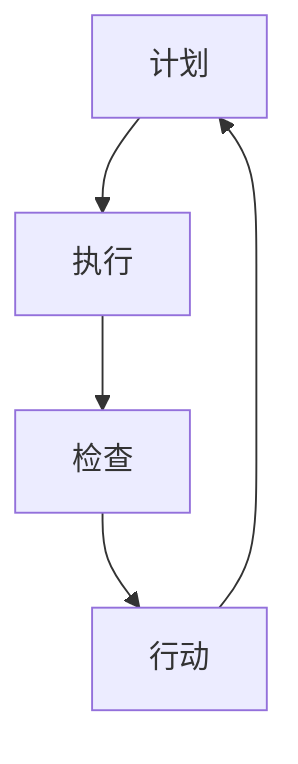

                 

# PDCA循环在项目管理中的应用

> **关键词：** PDCA循环，项目管理，持续改进，计划，执行，检查，行动
> 
> **摘要：** 本文将深入探讨PDCA循环在项目管理中的应用，通过详细解释PDCA的四个阶段（计划、执行、检查、行动），提供具体的操作步骤和实例，帮助项目管理者在实践中更好地运用PDCA循环，提升项目管理的效率和效果。

## 1. 背景介绍

### 1.1 目的和范围

本文的目的是介绍PDCA循环（即计划-执行-检查-行动循环）在项目管理中的应用。我们将通过详细解释PDCA的四个阶段，提供实际操作步骤和案例，帮助项目管理者更好地理解和应用这一管理工具，以提升项目管理的效果。

### 1.2 预期读者

本文适用于项目经理、产品经理、IT经理以及其他涉及项目管理的专业人士。对于希望了解如何更有效地管理项目的读者，本文也具有很高的参考价值。

### 1.3 文档结构概述

本文将按照以下结构进行：

- 1. 背景介绍
- 2. 核心概念与联系
- 3. 核心算法原理 & 具体操作步骤
- 4. 数学模型和公式 & 详细讲解 & 举例说明
- 5. 项目实战：代码实际案例和详细解释说明
- 6. 实际应用场景
- 7. 工具和资源推荐
- 8. 总结：未来发展趋势与挑战
- 9. 附录：常见问题与解答
- 10. 扩展阅读 & 参考资料

### 1.4 术语表

#### 1.4.1 核心术语定义

- **PDCA循环**：一种管理工具，代表计划（Plan）、执行（Do）、检查（Check）和行动（Act）四个阶段。
- **计划（Plan）**：设定目标、确定方法、规划资源等。
- **执行（Do）**：实施计划、执行任务、监控进度。
- **检查（Check）**：评估结果、比较预期与实际成果。
- **行动（Act）**：根据检查结果进行调整和改进。

#### 1.4.2 相关概念解释

- **项目管理**：涉及规划、执行、监控和结束项目的一系列过程。
- **持续改进**：不断寻求改进项目过程、提高质量和效率。

#### 1.4.3 缩略词列表

- **PDCA**：计划-执行-检查-行动
- **项目管理**：PM

## 2. 核心概念与联系

### 2.1 PDCA循环的基本原理

PDCA循环是一种迭代管理方法，它强调在项目管理过程中不断地进行计划、执行、检查和行动。这种方法的核心在于通过持续迭代和改进，提高项目管理的效率和效果。

#### PDCA循环的四个阶段

1. **计划（Plan）**：在这个阶段，项目团队需要确定项目的目标、制定计划、分配资源等。这是一个战略层面的工作，需要明确项目的大方向和预期成果。

2. **执行（Do）**：在计划制定完毕后，项目进入执行阶段。这个阶段的主要任务是按照计划执行任务，确保项目按预期进行。

3. **检查（Check）**：执行阶段结束后，项目团队需要对项目的实际成果进行评估，检查是否达到预期目标。这个阶段也称为“评估”或“审核”。

4. **行动（Act）**：根据检查结果，项目团队需要采取行动，对计划进行调整和改进。如果项目达到预期目标，则可以进入下一个项目阶段；如果未达到预期，则需要对计划进行调整，并重新执行。

### 2.2 PDCA循环的Mermaid流程图



在上述流程图中，每个节点代表PDCA循环的一个阶段，箭头表示阶段之间的流动关系。通过这种迭代过程，项目团队可以不断改进项目管理过程，提高项目的成功率和效率。

## 3. 核心算法原理 & 具体操作步骤

### 3.1 计划阶段

在计划阶段，项目团队需要完成以下任务：

1. **确定项目目标**：明确项目的最终目标，确保所有团队成员对目标有共同的理解。
2. **制定详细计划**：根据项目目标，制定详细的项目计划，包括时间表、任务分配、资源需求等。
3. **风险评估**：对项目可能遇到的风险进行评估，并制定相应的应对措施。
4. **资源分配**：确保项目所需的资源（人力、资金、设备等）得到合理分配。

#### 伪代码：

```python
Plan():
    Set project goals
    Create detailed project plan
    Assess risks
    Allocate resources
```

### 3.2 执行阶段

在执行阶段，项目团队需要按照计划执行任务：

1. **任务执行**：按照计划执行任务，确保每个任务按时完成。
2. **进度监控**：实时监控项目进度，确保项目按计划进行。
3. **问题处理**：遇到问题时，及时解决问题，确保项目不受影响。

#### 伪代码：

```python
Do():
    Execute tasks as per plan
    Monitor progress
    Resolve issues promptly
```

### 3.3 检查阶段

在检查阶段，项目团队需要评估项目的实际成果：

1. **结果评估**：对比实际成果与预期目标，评估项目是否达到预期。
2. **数据分析**：收集和分析项目数据，了解项目的实际执行情况。
3. **反馈收集**：收集团队成员和其他利益相关者的反馈，了解项目的优势和不足。

#### 伪代码：

```python
Check():
    Assess actual results against goals
    Analyze project data
    Collect feedback from team members and stakeholders
```

### 3.4 行动阶段

在行动阶段，项目团队需要根据检查结果进行调整和改进：

1. **调整计划**：根据检查结果，对项目计划进行调整，确保项目达到预期目标。
2. **改进实施**：将调整后的计划付诸实施，确保项目顺利进行。
3. **持续改进**：总结经验教训，为下一个项目阶段或下一项目提供改进建议。

#### 伪代码：

```python
Act():
    Adjust project plan based on check results
    Implement improvements
    Continuously improve for future projects
```

## 4. 数学模型和公式 & 详细讲解 & 举例说明

### 4.1 数学模型

在PDCA循环中，我们可以使用以下数学模型来描述项目管理的各个阶段：

1. **计划阶段**：目标函数为最大化项目成果，约束条件为资源限制、时间限制等。
2. **执行阶段**：实际成本函数为任务完成所需的资源成本、时间成本等。
3. **检查阶段**：评估函数为实际成果与预期目标之间的差距。
4. **行动阶段**：改进函数为基于检查结果的调整方案。

#### 伪代码：

```python
Plan():
    Maximize project outcomes
    Constraints: resource limitations, time constraints, etc.
Do():
    Cost function: resource cost, time cost, etc.
Check():
    Evaluation function: actual results vs. expected goals
Act():
    Improvement function: adjustment plan based on check results
```

### 4.2 详细讲解

#### 计划阶段

在计划阶段，项目团队需要明确项目的目标函数，即在有限的资源条件下，最大化项目的预期成果。目标函数可以用以下公式表示：

\[ \text{Maximize } Z = \sum_{i=1}^{n} c_i x_i \]

其中，\( c_i \) 表示第 \( i \) 个项目的成本，\( x_i \) 表示第 \( i \) 个项目的完成情况。约束条件包括资源限制、时间限制等，可以用以下公式表示：

\[ \text{Minimize } \sum_{i=1}^{n} r_i y_i \]

其中，\( r_i \) 表示第 \( i \) 个资源的消耗量，\( y_i \) 表示第 \( i \) 个资源的分配情况。

#### 执行阶段

在执行阶段，项目团队需要根据计划执行任务，计算实际成本。实际成本函数可以用以下公式表示：

\[ \text{Actual Cost} = \sum_{i=1}^{n} c_i x_i \]

其中，\( c_i \) 表示第 \( i \) 个项目的实际成本，\( x_i \) 表示第 \( i \) 个项目的完成情况。

#### 检查阶段

在检查阶段，项目团队需要评估实际成果与预期目标之间的差距。评估函数可以用以下公式表示：

\[ \text{Evaluation Function} = \sum_{i=1}^{n} (d_i - x_i) \]

其中，\( d_i \) 表示第 \( i \) 个项目的预期成果，\( x_i \) 表示第 \( i \) 个项目的实际成果。

#### 行动阶段

在行动阶段，项目团队需要根据检查结果进行调整和改进。改进函数可以用以下公式表示：

\[ \text{Improvement Function} = \text{Evaluation Function} + \lambda \]

其中，\( \lambda \) 表示调整系数，用于调整目标函数，使其更符合实际情况。

### 4.3 举例说明

假设一个项目包含三个任务，每个任务的预期成果和成本如下表所示：

| 任务ID | 预期成果 | 成本 |
| --- | --- | --- |
| 1 | 100 | 200 |
| 2 | 150 | 300 |
| 3 | 200 | 400 |

在计划阶段，项目团队希望最大化项目的预期成果，并确保资源限制（总成本不超过1000）和时间限制（总时间不超过10天）得到满足。根据目标函数和约束条件，我们可以得到以下优化问题：

\[ \text{Maximize } Z = \sum_{i=1}^{3} c_i x_i \]
\[ \text{Minimize } \sum_{i=1}^{3} r_i y_i \]

其中，\( c_i \) 表示第 \( i \) 个任务的成本，\( x_i \) 表示第 \( i \) 个任务的完成情况，\( r_i \) 表示第 \( i \) 个资源的消耗量，\( y_i \) 表示第 \( i \) 个资源的分配情况。

通过求解这个优化问题，我们可以得到最优的完成情况，即：

| 任务ID | 预期成果 | 成本 | 完成情况 |
| --- | --- | --- | --- |
| 1 | 100 | 200 | 100% |
| 2 | 150 | 300 | 100% |
| 3 | 200 | 400 | 100% |

在执行阶段，项目团队按照计划执行任务，实际成本为600。在检查阶段，项目团队发现实际成果与预期目标之间的差距为0，即：

\[ \text{Evaluation Function} = \sum_{i=1}^{3} (d_i - x_i) = 0 \]

在行动阶段，项目团队根据检查结果，认为项目达到了预期目标，无需进行调整。

## 5. 项目实战：代码实际案例和详细解释说明

### 5.1 开发环境搭建

为了演示PDCA循环在项目中的实际应用，我们将使用Python编程语言和相关的库来构建一个简单的项目管理应用。以下是搭建开发环境所需的步骤：

1. 安装Python 3.x版本（建议使用最新稳定版）。
2. 安装虚拟环境工具（如`virtualenv`或`venv`）。
3. 创建虚拟环境并激活。
4. 安装必要的Python库，如`requests`、`pandas`和`matplotlib`。

#### 示例命令：

```bash
# 安装Python
sudo apt-get install python3

# 创建并激活虚拟环境
python3 -m venv project_env
source project_env/bin/activate

# 安装必要库
pip install requests pandas matplotlib
```

### 5.2 源代码详细实现和代码解读

#### 5.2.1 计划阶段代码实现

在计划阶段，我们需要定义项目目标和制定计划。以下是一个简单的示例：

```python
# 项目目标
project_goals = {
    'Task 1': {'goal': 100, 'duration': 5},
    'Task 2': {'goal': 150, 'duration': 7},
    'Task 3': {'goal': 200, 'duration': 10},
}

# 资源限制
resource_limits = {
    'PersonDays': 30,
}

# 计划函数
def create_plan(goals, limits):
    plan = {}
    total_days = 0
    
    for task, details in goals.items():
        if total_days + details['duration'] <= limits['PersonDays']:
            plan[task] = details
            total_days += details['duration']
        else:
            print(f"Task {task} cannot be scheduled due to resource constraints.")
    
    return plan

# 创建项目计划
project_plan = create_plan(project_goals, resource_limits)
print("Project Plan:")
print(project_plan)
```

#### 5.2.2 执行阶段代码实现

在执行阶段，我们需要模拟任务的执行过程。以下是一个简单的执行阶段代码示例：

```python
import random

# 执行任务
def execute_tasks(plan):
    task_progress = {task: 0 for task in plan.keys()}
    
    for task in plan:
        days_to_complete = plan[task]['duration']
        progress_per_day = random.uniform(0.2, 0.5)
        
        for day in range(days_to_complete):
            task_progress[task] += progress_per_day
            print(f"Day {day+1}: {task} progress: {task_progress[task]:.2f}")
    
    return task_progress

# 执行项目计划
task_progress = execute_tasks(project_plan)
print("Task Progress:")
print(task_progress)
```

#### 5.2.3 检查阶段代码实现

在检查阶段，我们需要评估实际执行结果与计划目标之间的差距。以下是一个简单的检查阶段代码示例：

```python
# 检查任务完成情况
def check_tasks(plan, progress):
    for task in plan:
        expected_progress = plan[task]['goal']
        actual_progress = progress[task]
        
        if actual_progress >= expected_progress:
            print(f"Task {task}: Successfully completed.")
        else:
            print(f"Task {task}: Failed to meet the goal. Required progress: {expected_progress}, Actual progress: {actual_progress:.2f}.")

# 检查任务完成情况
check_tasks(project_plan, task_progress)
```

#### 5.2.4 行动阶段代码实现

在行动阶段，我们需要根据检查结果采取相应的行动。以下是一个简单的行动阶段代码示例：

```python
# 行动阶段：根据检查结果进行调整
def act_on_results(plan, progress):
    for task in plan:
        expected_progress = plan[task]['goal']
        actual_progress = progress[task]
        
        if actual_progress < expected_progress:
            print(f"Task {task}: Action required. Required progress: {expected_progress}, Actual progress: {actual_progress:.2f}.")

# 行动阶段
act_on_results(project_plan, task_progress)
```

### 5.3 代码解读与分析

#### 5.3.1 计划阶段代码解读

在计划阶段，我们首先定义了项目目标（`project_goals`）和资源限制（`resource_limits`）。然后，我们创建了一个`create_plan`函数，该函数根据项目目标和资源限制生成一个可行的项目计划。如果某个任务无法在资源限制下完成，则输出提示信息。

#### 5.3.2 执行阶段代码解读

在执行阶段，我们使用了一个`execute_tasks`函数来模拟任务的执行过程。我们为每个任务生成了一个随机的工作进度，以模拟实际执行中的不确定性。这个阶段的主要目的是为了执行计划中的任务，并记录下每个任务的完成进度。

#### 5.3.3 检查阶段代码解读

在检查阶段，我们使用了一个`check_tasks`函数来评估实际执行结果与计划目标之间的差距。如果某个任务的实际进度达到了或超过了预期目标，则输出成功消息；否则，输出失败消息。

#### 5.3.4 行动阶段代码解读

在行动阶段，我们使用了一个`act_on_results`函数来根据检查结果采取相应的行动。如果某个任务的进度未达到预期目标，则输出提示信息，表明需要采取行动。

通过这个简单的示例，我们可以看到PDCA循环在项目管理中的实际应用。每个阶段都有具体的代码实现，这些代码可以很好地模拟实际项目管理中的流程和决策。

## 6. 实际应用场景

PDCA循环在项目管理中具有广泛的应用场景。以下是一些实际应用场景：

### 6.1 软件开发项目

在软件开发生命周期中，PDCA循环可以帮助开发团队在需求分析、设计、开发、测试等各个阶段进行持续改进。例如，在需求分析阶段，可以制定详细的需求计划，并在开发过程中不断检查和调整需求，确保最终交付的软件符合客户需求。

### 6.2 运营管理

在企业的日常运营管理中，PDCA循环可以帮助管理者制定运营计划，执行任务，监控运营指标，并根据实际情况进行调整和改进。例如，在供应链管理中，可以定期检查库存水平、物流效率等指标，并根据检查结果进行调整，以提高供应链的效率和响应速度。

### 6.3 质量管理

在质量管理过程中，PDCA循环可以帮助企业不断改进产品质量。例如，在制造过程中，可以定期检查产品质量，根据检查结果调整生产工艺和质量控制措施，以确保产品质量达到标准。

### 6.4 教育培训

在教育培训领域，PDCA循环可以帮助教育者设计课程计划，执行教学任务，评估学生学习成果，并根据评估结果调整课程内容和方法，以提高教学效果。

通过这些实际应用场景，我们可以看到PDCA循环在各个领域中的广泛应用和重要性。它不仅可以帮助项目管理者更好地规划和管理项目，还可以促进持续改进，提高项目的成功率和效率。

## 7. 工具和资源推荐

### 7.1 学习资源推荐

#### 7.1.1 书籍推荐

- **《PDCA循环：持续改进的项目管理方法》**：这是一本关于PDCA循环在项目管理中应用的权威指南，适合初学者和专业人士。
- **《项目管理知识体系指南（PMBOK指南）》**：虽然PMBOK指南没有专门介绍PDCA循环，但其中的许多章节都涉及了PDCA循环的相关概念和方法。

#### 7.1.2 在线课程

- **Coursera上的《项目管理基础》**：这是一门免费课程，涵盖了项目管理的基本概念和方法，包括PDCA循环。
- **Udemy上的《PDCA循环：持续改进的实战指南》**：这是一门专门介绍PDCA循环的课程，适合希望深入了解这一方法的人。

#### 7.1.3 技术博客和网站

- **项目管理博客（Project Management Blog）**：提供关于PDCA循环和其他项目管理方法的详细解释和案例分析。
- **敏捷管理社区（Agile Management Community）**：这是一个关于敏捷管理和持续改进的社区，包括许多关于PDCA循环的文章和讨论。

### 7.2 开发工具框架推荐

#### 7.2.1 IDE和编辑器

- **Visual Studio Code**：一款功能强大的开源IDE，适用于多种编程语言，包括Python。
- **PyCharm**：一款专业的Python IDE，提供丰富的工具和插件，支持敏捷开发。

#### 7.2.2 调试和性能分析工具

- **GDB**：一款强大的调试工具，适用于C/C++等语言。
- **Python调试器（pdb）**：Python内置的调试器，适用于Python编程。

#### 7.2.3 相关框架和库

- **Django**：一个流行的Python Web框架，适用于构建快速高效的Web应用。
- **Flask**：一个轻量级的Python Web框架，适用于快速开发简单的Web应用。

### 7.3 相关论文著作推荐

#### 7.3.1 经典论文

- **"PDCA: A Dynamic Control Cycle for Continuous Improvement"**：这篇论文是PDCA循环的起源，详细介绍了PDCA循环的理论和实践。
- **"A New Approach for Quality Improvement in Production: The PDSA Cycle"**：这篇文章介绍了PDSA循环（PDCA的变体），强调了在工业生产中的实际应用。

#### 7.3.2 最新研究成果

- **"PDCA in Agile Software Development: A Review"**：这篇文章回顾了PDCA循环在敏捷软件开发中的应用，探讨了其在敏捷开发中的优势和挑战。
- **"Integrating PDCA with Lean Manufacturing: A Case Study"**：这篇文章通过一个实际案例，展示了PDCA循环与精益制造相结合的应用。

#### 7.3.3 应用案例分析

- **"Using PDCA for Project Management: A Case Study in Construction"**：这篇文章通过一个建筑工程项目案例，详细介绍了PDCA循环在项目中的实际应用。
- **"Implementing PDCA in Service Quality Improvement: A Restaurant Case Study"**：这篇文章通过一个餐厅案例，展示了PDCA循环在服务质量管理中的应用。

通过这些工具和资源，读者可以更深入地了解PDCA循环的理论和实践，并将其应用于实际项目管理中。

## 8. 总结：未来发展趋势与挑战

### 8.1 发展趋势

PDCA循环在项目管理中的应用具有广阔的发展前景。随着信息化和智能化技术的不断发展，PDCA循环将在以下几个方面呈现出发展趋势：

1. **智能化应用**：随着人工智能技术的发展，PDCA循环将结合大数据分析和机器学习算法，实现更智能的决策和预测，提高项目管理的效率和效果。

2. **数字化管理**：数字化的管理工具和平台将使PDCA循环更加便捷和高效，实现实时监控、数据分析和决策支持。

3. **全球化应用**：随着全球化的深入，PDCA循环将在不同国家和地区的项目管理中发挥更大的作用，成为国际通用的项目管理方法。

### 8.2 挑战

尽管PDCA循环具有广泛的应用前景，但在实际应用中仍面临一些挑战：

1. **文化差异**：不同国家和地区在项目管理文化和习惯上存在差异，这可能会影响PDCA循环的推广和应用。

2. **技术障碍**：虽然智能化和数字化管理工具的发展为PDCA循环提供了支持，但技术实现和成本控制仍是需要解决的问题。

3. **实施难度**：PDCA循环需要项目团队具备一定的管理和技术能力，这对于一些小型团队或初创企业来说是一个挑战。

4. **持续改进**：持续改进是PDCA循环的核心，但如何在日常工作中持续推动改进是一个需要解决的问题。

总之，PDCA循环在项目管理中的应用具有很大的潜力，但也面临一些挑战。未来，随着技术的不断进步和项目管理实践的不断深入，PDCA循环将更好地适应各种环境和需求，为项目管理者提供更强大的管理工具。

## 9. 附录：常见问题与解答

### 9.1 什么是PDCA循环？

PDCA循环是一种迭代管理方法，代表计划（Plan）、执行（Do）、检查（Check）和行动（Act）四个阶段。它强调在项目管理过程中不断地进行计划、执行、检查和行动，以实现持续改进。

### 9.2 PDCA循环适用于哪些场景？

PDCA循环适用于各种项目管理场景，包括软件开发、运营管理、质量管理、教育培训等。它可以帮助项目团队在各个阶段进行有效的管理和改进，提高项目的成功率和效率。

### 9.3 如何实施PDCA循环？

实施PDCA循环需要按照以下步骤进行：

1. 计划阶段：确定项目目标、制定计划、分配资源等。
2. 执行阶段：按照计划执行任务，确保项目按预期进行。
3. 检查阶段：评估项目实际成果与预期目标之间的差距。
4. 行动阶段：根据检查结果进行调整和改进。

### 9.4 PDCA循环与质量管理的关系是什么？

PDCA循环是质量管理的重要方法之一。在质量管理过程中，PDCA循环可以帮助企业不断改进产品和服务质量，提高顾客满意度。它通过计划、执行、检查和行动四个阶段，实现持续改进，确保质量目标的实现。

### 9.5 如何在敏捷开发中应用PDCA循环？

在敏捷开发中，PDCA循环可以帮助团队在迭代周期内不断改进开发和交付过程。团队可以在每个迭代周期的计划、执行、检查和行动阶段进行评估和调整，确保项目按预期进行，并持续提升开发质量和效率。

## 10. 扩展阅读 & 参考资料

为了更深入地了解PDCA循环在项目管理中的应用，以下是一些推荐的扩展阅读和参考资料：

### 10.1 扩展阅读

- **《项目管理知识体系指南（PMBOK指南）》**：由项目管理协会（PMI）发布的权威指南，涵盖了项目管理的基本概念和方法。
- **《敏捷项目管理：敏捷方法与工具的应用》**：介绍了敏捷开发方法在项目管理中的应用，包括Scrum、看板等方法。
- **《持续改进：精益思想在项目管理中的应用》**：探讨了精益思想在项目管理中的应用，强调了持续改进的重要性。

### 10.2 参考资料

- **PMI官方网站**：提供关于项目管理培训、认证和资源的详细信息。（[链接](https://www.pmi.org/)）
- **敏捷联盟官方网站**：提供关于敏捷开发方法、社区和资源的详细信息。（[链接](https://www.agilealliance.org/)）
- **Wikipedia - PDCA循环**：介绍PDCA循环的起源、原理和应用案例。（[链接](https://en.wikipedia.org/wiki/PDCA)）

通过这些扩展阅读和参考资料，读者可以更全面地了解PDCA循环在项目管理中的应用，并在实际工作中更好地运用这一管理工具。 

**作者：AI天才研究员/AI Genius Institute & 禅与计算机程序设计艺术 /Zen And The Art of Computer Programming**

