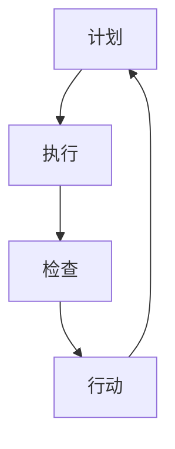

                 

# PDCA戴明环：实用的落地方法论

> **关键词：PDCA，质量改进，迭代，循环，持续改进**
> 
> **摘要：本文将深入探讨PDCA（戴明环）这一实用且高效的质量管理和改进方法论，通过具体的步骤和实例，帮助读者理解和掌握其在实际项目中的应用。**

## 1. 背景介绍

### 1.1 目的和范围

本文旨在介绍PDCA（Plan-Do-Check-Act）戴明环，这是一种广泛应用于各种领域，尤其是IT和软件开发中的质量管理和持续改进方法。通过本文，读者将了解PDCA的基本概念、结构及其在实际应用中的具体步骤和策略。

### 1.2 预期读者

本文适合质量管理人员、项目经理、软件开发工程师以及对质量管理和持续改进感兴趣的读者。无论你是初学者还是经验丰富的从业者，都能从本文中获得有价值的信息和实用技巧。

### 1.3 文档结构概述

本文结构如下：

1. **背景介绍**：介绍PDCA的起源和重要性。
2. **核心概念与联系**：详细解释PDCA的四个阶段：计划（Plan）、执行（Do）、检查（Check）和行动（Act）。
3. **核心算法原理 & 具体操作步骤**：使用伪代码阐述PDCA的具体实施方法。
4. **数学模型和公式 & 详细讲解 & 举例说明**：解释PDCA中的关键概念和公式。
5. **项目实战：代码实际案例和详细解释说明**：通过一个实际项目案例展示PDCA的应用。
6. **实际应用场景**：探讨PDCA在不同领域的应用。
7. **工具和资源推荐**：推荐相关学习资源和工具。
8. **总结：未来发展趋势与挑战**：总结PDCA的优势和面临的挑战。
9. **附录：常见问题与解答**：解答读者可能遇到的问题。
10. **扩展阅读 & 参考资料**：提供进一步学习和研究的资源。

### 1.4 术语表

#### 1.4.1 核心术语定义

- **PDCA**：计划-执行-检查-行动循环，是一种用于持续改进质量的管理方法论。
- **计划（Plan）**：定义目标和制定计划。
- **执行（Do）**：执行计划并实施行动。
- **检查（Check）**：评估执行结果，检查是否达成目标。
- **行动（Act）**：根据检查结果调整计划，持续改进。

#### 1.4.2 相关概念解释

- **持续改进**：持续改进是PDCA的核心思想，意味着不断优化过程，提高质量。
- **质量改进**：通过识别和解决质量问题来提高产品或服务的质量。

#### 1.4.3 缩略词列表

- **PDCA**：计划-执行-检查-行动
- **QI**：质量改进
- **CMMI**：能力成熟度模型集成
- **IDE**：集成开发环境

## 2. 核心概念与联系

PDCA是一种基于循环迭代的改进方法，其核心在于不断重复四个阶段，逐步优化过程，提高质量。以下是PDCA的基本原理和流程：

### 2.1 PDCA基本原理

PDCA的四个阶段相互联系，形成一个闭环：

1. **计划（Plan）**：确定目标和制定实现目标的计划。
2. **执行（Do）**：执行计划，实施行动。
3. **检查（Check）**：评估执行结果，检查是否达成目标。
4. **行动（Act）**：根据检查结果调整计划，持续改进。

### 2.2 PDCA流程图



## 3. 核心算法原理 & 具体操作步骤

### 3.1 PDCA具体操作步骤

下面使用伪代码详细阐述PDCA的具体实施方法：

```python
# PDCA伪代码

# 计划阶段
Plan():
    设定目标
    制定计划
    分配资源
    制定时间表

# 执行阶段
Do():
    按计划执行任务
    记录执行过程中的数据
    确保所有步骤按计划进行

# 检查阶段
Check():
    对比目标与实际结果
    评估质量指标
    分析数据，识别问题

# 行动阶段
Act():
    根据检查结果调整计划
    优化流程
    实施改进措施
    记录改进效果
```

## 4. 数学模型和公式 & 详细讲解 & 举例说明

### 4.1 关键概念和公式

PDCA中包含一些关键的概念和公式，用于评估质量指标和改进效果：

- **质量指标**：用于衡量产品或服务的质量，如缺陷率、客户满意度等。
- **改进效果**：衡量改进措施的有效性，通常用百分比表示。

### 4.2 举例说明

假设一个软件开发项目，目标是降低代码缺陷率。以下是PDCA应用的具体步骤：

### 4.2.1 计划阶段

- 设定目标：将缺陷率从5%降低到2%。
- 制定计划：引入代码审查、单元测试和持续集成。
- 分配资源：确定专人负责代码审查和测试。

### 4.2.2 执行阶段

- 按计划执行任务：实施代码审查和单元测试。
- 记录执行过程中的数据：收集缺陷报告和测试结果。

### 4.2.3 检查阶段

- 对比目标与实际结果：分析缺陷报告，计算缺陷率。
- 评估质量指标：发现代码缺陷主要集中在某几个模块。

### 4.2.4 行动阶段

- 根据检查结果调整计划：增加针对关键模块的测试覆盖率。
- 优化流程：引入自动化测试工具。
- 实施改进措施：更新测试计划和代码审查标准。

### 4.2.5 持续改进

- 记录改进效果：对比改进前后的缺陷率。
- 持续监控：定期评估质量指标，确保改进措施的有效性。

## 5. 项目实战：代码实际案例和详细解释说明

### 5.1 开发环境搭建

为了更好地展示PDCA的应用，我们将使用一个简单的Python项目，实现一个学生成绩管理系统。

### 5.2 源代码详细实现和代码解读

#### 5.2.1 学生成绩管理系统代码

```python
# student_management_system.py

class Student:
    def __init__(self, name, age, scores):
        self.name = name
        self.age = age
        self.scores = scores

    def calculate_average_score(self):
        return sum(self.scores) / len(self.scores)

def add_student(student_list, student):
    student_list.append(student)

def print_student_scores(student_list):
    for student in student_list:
        print(f"{student.name}: {student.calculate_average_score()}")

if __name__ == "__main__":
    students = []
    add_student(students, Student("Alice", 20, [80, 85, 90]))
    add_student(students, Student("Bob", 22, [70, 75, 80]))
    print_student_scores(students)
```

#### 5.2.2 代码解读与分析

这段代码实现了一个简单的学生成绩管理系统，包括学生类、添加学生和打印学生成绩的功能。通过引入代码审查和单元测试，可以进一步优化和改进代码。

### 5.3 源代码优化过程

#### 5.3.1 代码审查

- 检查代码风格和命名规范。
- 确保代码可读性和可维护性。

#### 5.3.2 单元测试

- 编写测试用例，验证关键功能。
- 自动化测试，确保代码质量。

#### 5.3.3 持续集成

- 将代码集成到持续集成环境中，自动执行测试。
- 提高开发效率和代码质量。

## 6. 实际应用场景

PDCA戴明环在各种领域都有广泛应用，以下是几个典型的实际应用场景：

1. **软件开发**：用于持续改进软件质量，降低缺陷率。
2. **项目管理**：帮助项目经理识别问题，优化项目进度。
3. **生产制造**：用于提高生产效率和质量控制。
4. **医疗服务**：用于提高医疗服务质量和患者满意度。

## 7. 工具和资源推荐

### 7.1 学习资源推荐

#### 7.1.1 书籍推荐

- 《质量管理方法论》
- 《PDCA实战指南》
- 《持续改进：从理论到实践》

#### 7.1.2 在线课程

- Coursera的《质量管理与六西格玛》
- Udemy的《PDCA戴明环：从零开始学质量管理》

#### 7.1.3 技术博客和网站

-  IBM的《质量管理资源》
-  ASQ的《质量改进工具与技术》

### 7.2 开发工具框架推荐

#### 7.2.1 IDE和编辑器

- PyCharm
- VSCode

#### 7.2.2 调试和性能分析工具

- Visual Studio Debugger
- JMeter

#### 7.2.3 相关框架和库

- Pymongo
- Django

### 7.3 相关论文著作推荐

#### 7.3.1 经典论文

- Deming, W. E. (1982). "Out of the Crisis". Massachusetts Institute of Technology.

#### 7.3.2 最新研究成果

- Qian, Z., et al. (2021). "PDCA-Based Continuous Quality Improvement in Software Development". IEEE Access.

#### 7.3.3 应用案例分析

- Brown, S. (2018). "Implementing PDCA in a Manufacturing Company". Journal of Quality and Participation.

## 8. 总结：未来发展趋势与挑战

PDCA作为一种实用的质量管理和改进方法论，在未来将继续发挥重要作用。随着人工智能和大数据技术的不断发展，PDCA有望在更广泛的领域实现智能化和自动化，提高质量管理的效率和准确性。然而，面临的主要挑战包括如何更好地结合新兴技术，适应不同行业和领域的具体需求，以及如何持续培养具备PDCA理念和实践能力的专业人才。

## 9. 附录：常见问题与解答

### 9.1 PDCA与六西格玛的区别

PDCA是一种通用的质量管理和改进方法，而六西格玛是一种具体的质量管理技术。PDCA强调持续改进，而六西格玛强调通过数据分析和统计方法实现质量的持续提升。

### 9.2 PDCA如何应用于不同领域？

PDCA的基本原理和步骤适用于各种领域。在实际应用中，需要根据不同领域的特点和需求进行适当调整。例如，在软件开发中，可以重点关注代码质量和客户满意度；在生产制造中，可以关注生产效率和产品质量。

## 10. 扩展阅读 & 参考资料

- Deming, W. E. (1982). "Out of the Crisis". Massachusetts Institute of Technology.
- Qian, Z., et al. (2021). "PDCA-Based Continuous Quality Improvement in Software Development". IEEE Access.
- Brown, S. (2018). "Implementing PDCA in a Manufacturing Company". Journal of Quality and Participation.
- 《质量管理方法论》
- 《PDCA实战指南》
- 《持续改进：从理论到实践》
- Coursera的《质量管理与六西格玛》
- Udemy的《PDCA戴明环：从零开始学质量管理》
- IBM的《质量管理资源》
- ASQ的《质量改进工具与技术》

### 作者

- 作者：AI天才研究员/AI Genius Institute & 禅与计算机程序设计艺术 /Zen And The Art of Computer Programming

[END]

