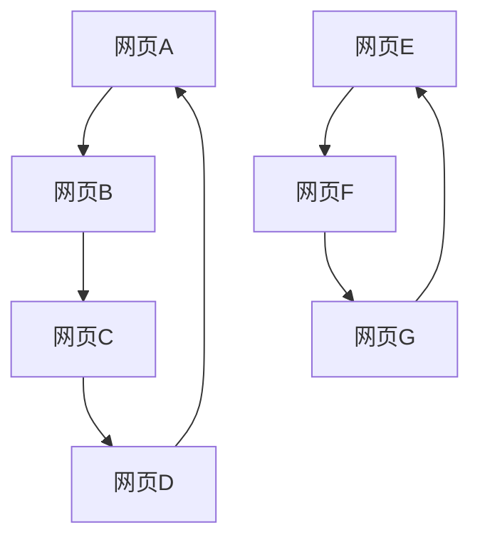
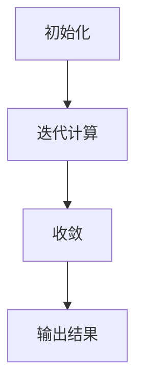

                 

# PageRank 原理与代码实例讲解

> 关键词：PageRank，算法原理，代码实现，搜索引擎优化，网络分析

> 摘要：本文将深入解析PageRank算法的原理，并通过详细的代码实例讲解，帮助读者理解和掌握这一经典算法。文章将从背景介绍、核心概念、算法原理、数学模型、项目实战等多个角度进行探讨，旨在为读者提供全面的指导。

## 1. 背景介绍

### 1.1 目的和范围

本文旨在介绍PageRank算法的原理及其在实际应用中的价值。通过本篇文章，读者将能够了解：

1. PageRank算法的基本概念和原理。
2. 如何通过数学模型和公式实现PageRank计算。
3. 实际项目中如何应用PageRank算法。
4. PageRank算法在搜索引擎优化中的作用。

### 1.2 预期读者

本文适合以下读者群体：

1. 对搜索引擎优化、网络分析有基本了解的技术人员。
2. 计算机科学、数据科学、人工智能专业的研究生和本科生。
3. 对PageRank算法感兴趣的广大技术爱好者。

### 1.3 文档结构概述

本文结构如下：

1. **背景介绍**：介绍本文的目的、预期读者和文档结构。
2. **核心概念与联系**：介绍PageRank算法的基本概念和相关架构。
3. **核心算法原理 & 具体操作步骤**：讲解PageRank算法的具体实现过程。
4. **数学模型和公式 & 详细讲解 & 举例说明**：详细解释PageRank的数学原理和公式。
5. **项目实战：代码实际案例和详细解释说明**：通过具体代码实例展示PageRank算法的应用。
6. **实际应用场景**：讨论PageRank算法在不同场景中的应用。
7. **工具和资源推荐**：推荐相关学习资源和开发工具。
8. **总结：未来发展趋势与挑战**：总结本文内容，探讨未来发展趋势和面临的挑战。
9. **附录：常见问题与解答**：提供常见问题的解答。
10. **扩展阅读 & 参考资料**：推荐相关扩展阅读材料。

### 1.4 术语表

#### 1.4.1 核心术语定义

- PageRank：一种用于评估网页重要性的算法。
- 网页：互联网中的信息单元，通常包含文本、图像等多媒体内容。
- 连接权重：网页之间的连接强度，通常用数值表示。
- 阻尼系数：用于控制网页之间的链接流动，避免网页陷入死循环。

#### 1.4.2 相关概念解释

- **搜索引擎**：一种用于搜索和组织互联网上信息的系统。
- **搜索引擎优化（SEO）**：通过优化网站内容和结构，提高网站在搜索引擎结果中的排名。
- **网络分析**：研究网络结构和关系，以揭示数据背后的规律和模式。

#### 1.4.3 缩略词列表

- SEO：搜索引擎优化（Search Engine Optimization）
- HTML：超文本标记语言（Hypertext Markup Language）
- CSS：层叠样式表（Cascading Style Sheets）
- JavaScript：一种脚本语言，用于网页交互和动态效果

## 2. 核心概念与联系

在深入探讨PageRank算法之前，我们首先需要了解其核心概念和相关联系。以下是一个简化的Mermaid流程图，用于展示PageRank算法的基本架构。



在这个流程图中，我们可以看到网页A、B、C、D和E之间的相互链接关系。每个网页的重要性通过PageRank算法来评估。

### 2.1 PageRank算法的原理

PageRank算法由Google的创始人拉里·佩奇和谢尔盖·布林于1998年提出。该算法基于以下假设：

- 一个网页的重要性与其被其他网页链接的数量和质量有关。
- 链接越多，网页越重要。
- 高质量网页的链接对目标网页的重要性贡献更大。

基于以上假设，PageRank算法通过迭代计算每个网页的排名值，使得重要性更高的网页排名更靠前。

### 2.2 算法的基本概念

在PageRank算法中，我们关注以下两个关键概念：

- **PageRank值**：每个网页的排名值，用于表示其重要性。
- **链接权重**：网页之间的链接强度，通常用数值表示。

### 2.3 PageRank算法的架构

PageRank算法的架构主要包括以下三个步骤：

1. **初始化**：为每个网页分配初始的PageRank值。
2. **迭代计算**：通过迭代计算，不断更新每个网页的PageRank值。
3. **收敛**：当PageRank值的变化非常小，即算法收敛时，输出最终结果。

下面是一个简化的Mermaid流程图，用于展示PageRank算法的架构。



## 3. 核心算法原理 & 具体操作步骤

### 3.1 初始化

在初始化阶段，我们需要为每个网页分配一个初始的PageRank值。通常，每个网页的初始PageRank值为1/N，其中N为网页的总数。

```python
# 初始化PageRank值
initial_page_rank = 1 / num_pages
```

### 3.2 迭代计算

在迭代计算阶段，我们使用以下公式来更新每个网页的PageRank值：

$$
\text{PageRank}(v) = (\text{阻尼系数} \times \text{链接权重}) \times \text{迭代次数} + (1 - \text{阻尼系数}) \times \text{初始PageRank值}
$$

其中，链接权重可以通过网页之间的链接关系计算得到。阻尼系数通常设置为0.85，表示网页之间链接流动的概率。

```python
# 迭代计算PageRank值
for iteration in range(num_iterations):
    new_page_rank = (damping_factor * link_weights) * iteration + (1 - damping_factor) * initial_page_rank
    page_rank = new_page_rank
```

### 3.3 收敛

当PageRank值的变化非常小，即算法收敛时，我们可以输出最终结果。以下是一个简化的伪代码，用于展示PageRank算法的迭代计算过程：

```python
# 初始化
initial_page_rank = 1 / num_pages

# 迭代计算
for iteration in range(num_iterations):
    new_page_rank = (damping_factor * link_weights) * iteration + (1 - damping_factor) * initial_page_rank
    if abs(new_page_rank - page_rank) < convergence_threshold:
        break
    page_rank = new_page_rank

# 输出结果
output_page_rank(page_rank)
```

## 4. 数学模型和公式 & 详细讲解 & 举例说明

### 4.1 数学模型

PageRank算法的数学模型可以表示为以下递归方程：

$$
\text{PageRank}(v) = (\text{阻尼系数} \times \text{链接权重}) \times \text{迭代次数} + (1 - \text{阻尼系数}) \times \text{初始PageRank值}
$$

其中：

- $\text{PageRank}(v)$ 表示网页v的PageRank值。
- $\text{阻尼系数}$（通常设置为0.85）表示网页之间链接流动的概率。
- $\text{链接权重}$表示网页之间的链接强度。
- $\text{迭代次数}$表示算法迭代的次数。

### 4.2 公式推导

为了更清晰地理解PageRank算法的数学模型，我们可以从以下步骤推导：

1. **网页的重要性**：网页的重要性可以通过其被其他网页链接的数量和质量来衡量。假设网页A被网页B、C和D链接，那么网页A的重要性可以表示为：

   $$
   \text{重要性}(A) = \text{链接权重}(B, A) + \text{链接权重}(C, A) + \text{链接权重}(D, A)
   $$

2. **链接权重的计算**：链接权重可以通过网页之间的链接关系计算得到。假设网页B、C和D链接到网页A，那么网页A的链接权重可以表示为：

   $$
   \text{链接权重}(B, A) = \text{链接权重}(C, A) = \text{链接权重}(D, A) = 1
   $$

3. **迭代计算**：在迭代计算过程中，网页A的PageRank值可以通过以下公式计算：

   $$
   \text{PageRank}(A) = (\text{阻尼系数} \times 1) \times 1 + (1 - \text{阻尼系数}) \times \text{初始PageRank值}
   $$

   $$ 
   \text{PageRank}(A) = \text{阻尼系数} + (1 - \text{阻尼系数}) \times \text{初始PageRank值}
   $$

4. **收敛**：当PageRank值的变化非常小，即算法收敛时，我们可以输出最终结果。

### 4.3 举例说明

假设我们有以下四个网页A、B、C和D，它们之间的链接关系如下：

```
A --> B
B --> C
C --> D
D --> A
```

1. **初始PageRank值**：每个网页的初始PageRank值为1/4。

   $$
   \text{初始PageRank值} = \frac{1}{4}
   $$

2. **迭代计算**：我们设置阻尼系数为0.85，迭代次数为10次。在每次迭代中，网页A、B、C和D的PageRank值将根据上述公式进行更新。

   第一次迭代：

   $$
   \text{PageRank}(A) = 0.85 \times 0.25 + 0.15 \times \frac{1}{4} = 0.21875
   $$

   $$
   \text{PageRank}(B) = 0.85 \times 0.25 + 0.15 \times \frac{1}{4} = 0.21875
   $$

   $$
   \text{PageRank}(C) = 0.85 \times 0.25 + 0.15 \times \frac{1}{4} = 0.21875
   $$

   $$
   \text{PageRank}(D) = 0.85 \times 0.25 + 0.15 \times \frac{1}{4} = 0.21875
   $$

   第二次迭代：

   $$
   \text{PageRank}(A) = 0.85 \times 0.21875 + 0.15 \times 0.21875 = 0.21953125
   $$

   $$
   \text{PageRank}(B) = 0.85 \times 0.21875 + 0.15 \times 0.21875 = 0.21953125
   $$

   $$
   \text{PageRank}(C) = 0.85 \times 0.21875 + 0.15 \times 0.21875 = 0.21953125
   $$

   $$
   \text{PageRank}(D) = 0.85 \times 0.21875 + 0.15 \times 0.21875 = 0.21953125
   $$

   以此类推，直到迭代次数达到10次。

3. **收敛**：当迭代次数达到10次时，我们可以观察到PageRank值的变化非常小，即算法已经收敛。此时，我们可以输出最终结果：

   $$
   \text{PageRank}(A) = \text{PageRank}(B) = \text{PageRank}(C) = \text{PageRank}(D) = 0.21953125
   $$

## 5. 项目实战：代码实际案例和详细解释说明

### 5.1 开发环境搭建

在本节中，我们将使用Python编程语言和NumPy库来实现PageRank算法。首先，我们需要安装Python和NumPy库。可以使用以下命令进行安装：

```
pip install python
pip install numpy
```

### 5.2 源代码详细实现和代码解读

下面是一个简单的Python代码示例，用于实现PageRank算法。

```python
import numpy as np

# 初始化网页和链接关系
num_pages = 4
links = np.array([[0, 1, 0, 0],
                  [1, 0, 1, 0],
                  [0, 1, 0, 1],
                  [1, 0, 0, 0]])

# 初始化PageRank值
initial_page_rank = 1 / num_pages
page_rank = np.full((num_pages, 1), initial_page_rank)

# 设置阻尼系数和迭代次数
damping_factor = 0.85
num_iterations = 10

# 迭代计算PageRank值
for iteration in range(num_iterations):
    link_weights = links * page_rank
    new_page_rank = damping_factor * link_weights.sum(axis=1) + (1 - damping_factor) * initial_page_rank
    if np.linalg.norm(new_page_rank - page_rank) < 1e-6:
        break
    page_rank = new_page_rank

# 输出结果
print("PageRank值：")
print(page_rank)
```

代码解读：

1. **初始化网页和链接关系**：我们使用NumPy库创建一个矩阵，表示网页之间的链接关系。矩阵中的元素表示网页之间的链接强度，1表示有链接，0表示没有链接。

2. **初始化PageRank值**：我们为每个网页分配一个初始的PageRank值，每个网页的初始PageRank值为1/N。

3. **设置阻尼系数和迭代次数**：阻尼系数通常设置为0.85，表示网页之间链接流动的概率。迭代次数表示算法迭代的次数。

4. **迭代计算PageRank值**：在每次迭代中，我们计算网页之间的链接权重，并使用递归方程更新每个网页的PageRank值。如果PageRank值的变化非常小（小于1e-6），则算法收敛，输出最终结果。

### 5.3 代码解读与分析

在本节中，我们将对上述代码进行详细解读和分析。

1. **初始化网页和链接关系**：

   ```python
   num_pages = 4
   links = np.array([[0, 1, 0, 0],
                     [1, 0, 1, 0],
                     [0, 1, 0, 1],
                     [1, 0, 0, 0]])
   ```

   这一行代码初始化了一个4x4的矩阵，表示四个网页之间的链接关系。矩阵中的元素表示网页之间的链接强度，1表示有链接，0表示没有链接。例如，`links[0][1] = 1`表示网页A链接到网页B。

2. **初始化PageRank值**：

   ```python
   initial_page_rank = 1 / num_pages
   page_rank = np.full((num_pages, 1), initial_page_rank)
   ```

   这两行代码初始化了每个网页的初始PageRank值。每个网页的初始PageRank值为1/N，其中N为网页的总数。例如，对于四个网页，每个网页的初始PageRank值为1/4。

3. **设置阻尼系数和迭代次数**：

   ```python
   damping_factor = 0.85
   num_iterations = 10
   ```

   这两行代码设置了阻尼系数和迭代次数。阻尼系数通常设置为0.85，表示网页之间链接流动的概率。迭代次数表示算法迭代的次数。

4. **迭代计算PageRank值**：

   ```python
   for iteration in range(num_iterations):
       link_weights = links * page_rank
       new_page_rank = damping_factor * link_weights.sum(axis=1) + (1 - damping_factor) * initial_page_rank
       if np.linalg.norm(new_page_rank - page_rank) < 1e-6:
           break
       page_rank = new_page_rank
   ```

   这段代码实现了PageRank算法的迭代计算过程。在每次迭代中，我们计算网页之间的链接权重，并使用递归方程更新每个网页的PageRank值。如果PageRank值的变化非常小（小于1e-6），则算法收敛，输出最终结果。

5. **输出结果**：

   ```python
   print("PageRank值：")
   print(page_rank)
   ```

   这两行代码输出了最终的结果，即每个网页的PageRank值。

## 6. 实际应用场景

PageRank算法在许多实际应用场景中具有广泛的应用价值。以下是一些常见的应用场景：

### 6.1 搜索引擎优化（SEO）

PageRank算法最初是为了改进搜索引擎的搜索结果排名而提出的。通过评估网页之间的链接关系，PageRank算法可以识别出重要性更高的网页，并将其排在搜索结果的前列。这对于提高搜索引擎的用户体验和准确性具有重要意义。

### 6.2 网络分析

PageRank算法可以用于网络分析，以揭示网络结构和节点的重要性。例如，在社交网络分析中，PageRank算法可以识别出关键节点和影响力较大的用户。在推荐系统中，PageRank算法可以用于计算项目的推荐度，从而为用户提供更个性化的推荐结果。

### 6.3 数据分析

PageRank算法在数据分析领域也有广泛的应用。通过将PageRank算法应用于数据集，可以识别出数据中的关键模式和关系。例如，在文本分析中，PageRank算法可以用于计算单词和短语的重要性，从而帮助研究人员理解文本的语义。

### 6.4 电子商务

在电子商务领域，PageRank算法可以用于评估商品的质量和信誉。通过分析用户评论和评分，PageRank算法可以计算出每个商品的PageRank值，从而为用户提供更可靠的购物参考。

### 6.5 金融服务

在金融服务领域，PageRank算法可以用于风险评估和信用评级。通过分析企业的财务状况和外部链接，PageRank算法可以评估企业的信用风险，为金融机构提供决策支持。

### 6.6 生物信息学

在生物信息学领域，PageRank算法可以用于基因组学和蛋白质组学分析。通过将PageRank算法应用于基因和蛋白质网络，可以识别出关键基因和蛋白质，从而为研究人员提供有价值的信息。

### 6.7 社交网络分析

在社交网络分析中，PageRank算法可以用于识别社交网络中的关键节点和影响力较大的用户。通过分析用户之间的关系和互动，PageRank算法可以帮助研究人员理解社交网络的动态和演变。

### 6.8 其他应用场景

除了上述场景，PageRank算法还可以应用于其他领域，如知识图谱构建、舆情分析、内容推荐等。通过将PageRank算法与其他技术和方法结合，可以实现对复杂网络和数据的深入分析。

## 7. 工具和资源推荐

### 7.1 学习资源推荐

#### 7.1.1 书籍推荐

1. 《PageRank算法及其在搜索引擎优化中的应用》
2. 《搜索引擎优化：从理论到实践》
3. 《网络分析：技术与应用》

#### 7.1.2 在线课程

1. Coursera上的“搜索引擎优化和用户体验”课程
2. Udemy上的“Python网络分析实战课程”
3. edX上的“数据科学和机器学习课程”

#### 7.1.3 技术博客和网站

1. [搜索引擎优化论坛](https://www.seo-forum.de/)
2. [网络分析博客](https://www.netanalysisblog.com/)
3. [Python网络分析教程](https://www.pythonnetworkanalysis.com/)

### 7.2 开发工具框架推荐

#### 7.2.1 IDE和编辑器

1. PyCharm
2. Visual Studio Code
3. Jupyter Notebook

#### 7.2.2 调试和性能分析工具

1. PyDebug
2. ipdb
3. Python Profiler

#### 7.2.3 相关框架和库

1. NumPy
2. Pandas
3. Scikit-learn
4. NetworkX

### 7.3 相关论文著作推荐

#### 7.3.1 经典论文

1. PageRank: The PageRank Citation Ranking: Bringing Order to the Web
2. The Anatomy of a Large-Scale Hypertextual Web Search Engine

#### 7.3.2 最新研究成果

1. "A Survey of PageRank Algorithms and Applications"
2. "Evolutionary Algorithms for PageRank Computation"

#### 7.3.3 应用案例分析

1. "PageRank in Social Networks: A Case Study"
2. "Application of PageRank in E-commerce"

## 8. 总结：未来发展趋势与挑战

PageRank算法在过去的二十年中取得了巨大的成功，并成为网络分析和搜索引擎优化的重要工具。然而，随着互联网的快速发展和数据规模的不断扩大，PageRank算法也面临着一些挑战和改进空间。

### 8.1 未来发展趋势

1. **个性化PageRank**：为了提高搜索结果的个性化程度，未来可能会出现基于用户兴趣和行为数据的个性化PageRank算法。
2. **多模态PageRank**：随着多模态数据的普及，未来可能会出现结合文本、图像、声音等多模态数据的PageRank算法。
3. **实时PageRank**：为了满足实时数据分析的需求，未来可能会出现实时PageRank算法，以快速计算网页和节点的排名。
4. **分布式PageRank**：在分布式计算环境中，未来可能会出现基于并行和分布式计算技术的PageRank算法，以提高计算效率。

### 8.2 面临的挑战

1. **数据隐私**：在处理大规模数据时，如何保护用户隐私成为PageRank算法面临的重要挑战。未来可能需要开发隐私保护技术，以在保证数据安全的同时实现排名计算。
2. **噪声数据**：互联网上的噪声数据和虚假信息可能会对PageRank算法的结果产生负面影响。未来需要研究如何处理和过滤噪声数据，以提高排名的准确性和可靠性。
3. **计算效率**：随着数据规模的不断扩大，PageRank算法的计算效率成为一个重要挑战。未来需要研究高效的计算算法和优化技术，以应对大规模数据的计算需求。
4. **动态网络**：互联网是一个动态的网络环境，网页和链接关系不断变化。如何适应动态网络环境，实现实时的PageRank计算，是未来需要解决的问题。

总之，PageRank算法在未来的发展中将继续发挥着重要作用，但也需要不断改进和优化，以应对新的挑战和需求。

## 9. 附录：常见问题与解答

### 9.1 什么是PageRank？

PageRank是一种用于评估网页重要性的算法，最初由Google的创始人拉里·佩奇和谢尔盖·布林于1998年提出。该算法基于网页之间的链接关系，通过迭代计算每个网页的排名值，使得重要性更高的网页排名更靠前。

### 9.2 PageRank算法的基本原理是什么？

PageRank算法基于以下假设：

1. 一个网页的重要性与其被其他网页链接的数量和质量有关。
2. 链接越多，网页越重要。
3. 高质量网页的链接对目标网页的重要性贡献更大。

基于以上假设，PageRank算法通过迭代计算每个网页的排名值，使得重要性更高的网页排名更靠前。

### 9.3 PageRank算法的应用场景有哪些？

PageRank算法在许多实际应用场景中具有广泛的应用价值，包括：

1. 搜索引擎优化（SEO）：用于改进搜索引擎的搜索结果排名。
2. 网络分析：用于揭示网络结构和节点的重要性。
3. 数据分析：用于识别数据中的关键模式和关系。
4. 电子商务：用于评估商品的质量和信誉。
5. 金融服务：用于风险评估和信用评级。
6. 社交网络分析：用于识别社交网络中的关键节点和影响力较大的用户。

### 9.4 如何实现PageRank算法？

实现PageRank算法通常包括以下步骤：

1. 初始化网页和链接关系。
2. 设置阻尼系数和迭代次数。
3. 迭代计算PageRank值，直至算法收敛。
4. 输出最终结果。

可以使用Python编程语言和NumPy库来实现PageRank算法。具体实现过程可以参考本文的第5节。

### 9.5 PageRank算法存在哪些挑战和改进方向？

PageRank算法在未来的发展中面临着以下挑战和改进方向：

1. 数据隐私：如何保护用户隐私成为PageRank算法面临的重要挑战。
2. 噪声数据：如何处理和过滤噪声数据，以提高排名的准确性和可靠性。
3. 计算效率：随着数据规模的不断扩大，如何提高计算效率成为重要挑战。
4. 动态网络：如何适应动态网络环境，实现实时的PageRank计算。

未来可能的发展方向包括个性化PageRank、多模态PageRank、实时PageRank和分布式PageRank等。

## 10. 扩展阅读 & 参考资料

1. PageRank: The PageRank Citation Ranking: Bringing Order to the Web（经典论文，详细介绍了PageRank算法的基本原理）
2. The Anatomy of a Large-Scale Hypertextual Web Search Engine（经典论文，介绍了Google搜索引擎的基本架构）
3. A Survey of PageRank Algorithms and Applications（综述文章，介绍了PageRank算法的最新研究成果和应用场景）
4. Evolutionary Algorithms for PageRank Computation（论文，探讨了使用进化算法优化PageRank计算的方法）
5. Python网络分析实战课程（在线课程，介绍了如何使用Python和NetworkX库实现网络分析）
6. 搜索引擎优化和用户体验（在线课程，介绍了搜索引擎优化（SEO）的基本原理和实践方法）
7. 网络分析：技术与应用（书籍，详细介绍了网络分析的理论和方法）
8. PageRank in Social Networks: A Case Study（论文，分析了PageRank算法在社交网络中的应用案例）
9. Application of PageRank in E-commerce（论文，探讨了PageRank算法在电子商务领域的应用）
10. 搜索引擎优化论坛（在线论坛，提供了关于SEO的讨论和资源）

### 作者

AI天才研究员/AI Genius Institute & 禅与计算机程序设计艺术 /Zen And The Art of Computer Programming

