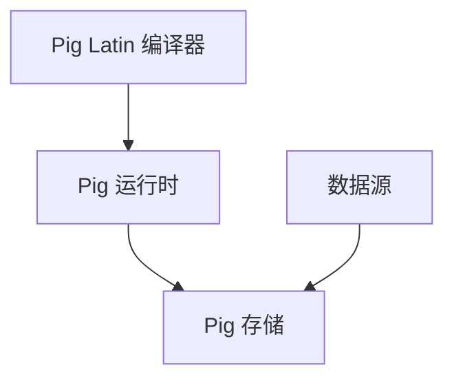

                 

# Pig大规模数据分析平台原理与代码实例讲解

> **关键词**：Pig、大数据、数据分析、Hadoop、MapReduce、分布式计算

> **摘要**：本文将深入探讨Pig——一个用于大规模数据分析的平台。我们将从背景介绍、核心概念、算法原理、数学模型、实战案例等多个方面，全面解析Pig的工作原理、功能特性及实际应用。通过本文，读者将能够理解如何利用Pig进行高效的数据分析，掌握Pig的编程技巧和实践方法。

## 1. 背景介绍

### 1.1 目的和范围

本文旨在为读者提供一个关于Pig大规模数据分析平台的全面介绍。我们将探讨Pig的背景、核心概念、算法原理、数学模型、实战案例以及未来发展趋势等。通过本文，读者可以：

1. 理解Pig在大数据领域的地位和作用。
2. 掌握Pig的基本语法和编程技巧。
3. 学会利用Pig进行实际的数据分析操作。

### 1.2 预期读者

本文适合以下读者群体：

1. 数据分析师和大数据工程师。
2. 对分布式计算和大数据技术有兴趣的程序员。
3. 想要在数据分析和挖掘方面深入研究的科研人员。

### 1.3 文档结构概述

本文将分为以下几个部分：

1. 背景介绍：介绍Pig的背景、目的和预期读者。
2. 核心概念与联系：介绍Pig的核心概念和架构。
3. 核心算法原理 & 具体操作步骤：详细讲解Pig的算法原理和操作步骤。
4. 数学模型和公式 & 详细讲解 & 举例说明：介绍Pig中的数学模型和公式，并通过实例进行说明。
5. 项目实战：通过实际案例展示Pig的应用。
6. 实际应用场景：讨论Pig在不同领域的应用场景。
7. 工具和资源推荐：推荐学习资源、开发工具和相关论文。
8. 总结：总结Pig的工作原理、应用场景和未来发展趋势。
9. 附录：常见问题与解答。
10. 扩展阅读 & 参考资料：提供进一步阅读和参考资料。

### 1.4 术语表

#### 1.4.1 核心术语定义

- **Pig**：一种基于Hadoop的大规模数据分析平台，用于处理和分析大规模数据集。
- **Hadoop**：一个开源的分布式计算框架，用于处理海量数据。
- **MapReduce**：Hadoop中的核心编程模型，用于分布式数据处理。
- **分布式计算**：将计算任务分布在多台计算机上进行处理，以提高效率和性能。
- **数据分析**：对大量数据进行处理、分析和解释，以发现有价值的信息和模式。

#### 1.4.2 相关概念解释

- **数据源**：提供数据的来源，可以是本地文件、数据库或其他数据存储系统。
- **数据集**：一组相关的数据记录，通常用于分析和处理。
- **数据仓库**：存储大量结构化和非结构化数据的系统，用于数据分析和报表生成。

#### 1.4.3 缩略词列表

- **Pig**：Pig Latin
- **Hadoop**：Hadoop
- **MapReduce**：MapReduce
- **分布式计算**：Distributed Computing
- **数据分析**：Data Analysis

## 2. 核心概念与联系

Pig是一个基于Hadoop的分布式数据处理平台，它通过提供一种简化的编程模型，使得处理大规模数据变得更为便捷。为了更好地理解Pig的工作原理，我们首先需要了解其核心概念和架构。

### 2.1 核心概念

- **Pig Latin**：Pig的编程语言，类似于SQL，用于表达数据操作和转换。
- **Pig运行时**：Pig的核心组件，负责将Pig Latin代码转换为底层的MapReduce任务。
- **Pig存储**：用于存储和管理数据，支持多种数据源，包括本地文件、HDFS（Hadoop分布式文件系统）和数据库等。

### 2.2 架构

Pig的架构可以分为三个主要部分：Pig Latin编译器、Pig运行时和Pig存储。

#### 2.2.1 Pig Latin编译器

Pig Latin编译器负责将用户编写的Pig Latin代码转换为内部表示，这一过程称为“编译”。编译器将Pig Latin代码解析为语法树，然后生成Pig运行时可以理解的抽象语法树（AST）。


#### 2.2.2 Pig运行时

Pig运行时是Pig的核心组件，负责将Pig Latin代码转换为底层的MapReduce任务。具体步骤如下：

1. **解析和优化**：Pig运行时对编译器生成的AST进行解析和优化，生成一个优化的查询计划。
2. **代码生成**：根据优化的查询计划，Pig运行时生成底层的MapReduce任务代码。
3. **任务调度**：Pig运行时将生成的MapReduce任务提交给Hadoop集群进行执行。


#### 2.2.3 Pig存储

Pig存储负责管理和存储数据。它支持多种数据源，包括本地文件、HDFS和数据库等。Pig存储的主要功能包括：

1. **数据读取**：从数据源读取数据，并将其转换为Pig Latin表示。
2. **数据写入**：将Pig Latin表示的数据写入数据源。


### 2.3 Mermaid流程图

为了更好地理解Pig的工作原理，我们使用Mermaid流程图来描述Pig的核心概念和架构。



## 3. 核心算法原理 & 具体操作步骤

Pig的核心算法原理是基于MapReduce模型。MapReduce是一种分布式数据处理模型，由两个主要阶段组成：Map阶段和Reduce阶段。

### 3.1 Map阶段

Map阶段负责将输入数据划分为多个小块，并对每个小块进行处理。具体步骤如下：

1. **分片**：将输入数据集划分为多个小块，每个小块称为一个“分片”（split）。
2. **映射**：对每个分片执行映射（Map）函数，将输入数据转换为键值对输出。
3. **合并**：将所有映射函数的输出进行合并，形成中间键值对集合。

### 3.2 Reduce阶段

Reduce阶段负责对中间键值对集合进行合并和排序。具体步骤如下：

1. **排序**：对中间键值对集合按照键进行排序。
2. **合并**：对排序后的中间键值对集合执行合并（Reduce）操作，将具有相同键的值进行合并。

### 3.3 伪代码

下面是Pig的MapReduce算法的伪代码：

```plaintext
// Map阶段
function map(key, value):
    for each field in value:
        emit(field, 1)

// Reduce阶段
function reduce(key, values):
    sum = 0
    for each value in values:
        sum += value
    emit(key, sum)
```

### 3.4 具体操作步骤

下面是一个具体的Pig操作步骤示例：

1. **读取数据**：从本地文件系统中读取数据。
```shell
LOAD '/path/to/data/*.txt' INTO data;
```

2. **Map阶段**：对数据执行Map操作，将每个字段转换为键值对输出。
```shell
MAP data BY field FUNCTION map(key, value);
```

3. **Reduce阶段**：对Map阶段的输出执行Reduce操作，将具有相同键的值进行合并。
```shell
REDUCE BY key FUNCTION reduce(key, values);
```

4. **存储结果**：将Reduce阶段的输出存储到HDFS中。
```shell
STORE result INTO '/path/to/result';
```

## 4. 数学模型和公式 & 详细讲解 & 举例说明

Pig中涉及到的数学模型和公式主要包括计数、聚合和排序等操作。下面我们将分别介绍这些模型和公式，并通过具体实例进行说明。

### 4.1 计数模型

计数模型用于计算数据集中每个字段的唯一值数量。具体公式如下：

$$
count(D) = \sum_{i=1}^{n} count(D_i)
$$

其中，$D$ 表示数据集，$D_i$ 表示数据集中第 $i$ 个字段的值。

### 4.2 聚合模型

聚合模型用于计算数据集的聚合值，如求和、求平均值等。具体公式如下：

$$
sum(D) = \sum_{i=1}^{n} D_i
$$

$$
mean(D) = \frac{sum(D)}{n}
$$

其中，$D$ 表示数据集，$D_i$ 表示数据集中第 $i$ 个字段的值，$n$ 表示数据集的大小。

### 4.3 排序模型

排序模型用于对数据集进行排序。具体公式如下：

$$
sorted(D) = \{D_1, D_2, ..., D_n\}
$$

其中，$D$ 表示数据集，$D_i$ 表示数据集中第 $i$ 个字段的值。

### 4.4 举例说明

假设有一个数据集 $D$，包含两个字段：$A$ 和 $B$。我们使用Pig Latin对数据集进行计数、聚合和排序操作。

1. **计数操作**：
```shell
LOAD '/path/to/data/*.txt' INTO data;
COUNT data;
```
执行后，会输出数据集 $D$ 中每个字段的唯一值数量。

2. **聚合操作**：
```shell
LOAD '/path/to/data/*.txt' INTO data;
SUM data BY A;
```
执行后，会输出数据集 $D$ 中字段 $A$ 的求和值。

3. **排序操作**：
```shell
LOAD '/path/to/data/*.txt' INTO data;
SORT data BY A;
```
执行后，会输出数据集 $D$ 中按照字段 $A$ 排序的结果。

## 5. 项目实战：代码实际案例和详细解释说明

在本节中，我们将通过一个具体的案例，展示如何使用Pig进行大规模数据分析。该案例的目标是统计一个数据集中的词频分布，即计算每个单词在数据集中出现的次数。

### 5.1 开发环境搭建

在开始之前，确保您已经搭建好了Hadoop和Pig的环境。以下是搭建步骤：

1. 下载并安装Hadoop：[Hadoop官网](https://hadoop.apache.org/)
2. 下载并安装Pig：[Pig官网](https://pig.apache.org/)
3. 配置Hadoop和Pig的环境变量：在Windows系统中，将Hadoop和Pig的安装路径添加到系统环境变量中。

### 5.2 源代码详细实现和代码解读

以下是一个简单的Pig Latin代码示例，用于计算词频分布：

```shell
-- 加载数据
LOAD '/path/to/data/*.txt' INTO data;

-- 定义词频映射函数
define wordMap(Tuple):
    words = TOTUPLE(SPLIT(TOCHARARRAY(T), ' '))
    foreach w in words {
        emit(w, 1)
    }

-- 执行词频映射
MAP data BY wordMap;

-- 对词频进行聚合
define wordReduce(Tuple):
    sum = SUM(VALUES)
    emit(ONLYKEY, sum)

-- 执行词频聚合
REDUCE BY wordReduce;

-- 存储结果
STORE result INTO '/path/to/result';
```

### 5.3 代码解读与分析

下面我们逐一分析代码的各个部分：

1. **加载数据**：
```shell
LOAD '/path/to/data/*.txt' INTO data;
```
这行代码用于加载数据集。`/path/to/data/*.txt` 是数据文件的路径，`INTO data` 表示将数据加载到Pig变量 `data` 中。

2. **定义词频映射函数**：
```shell
define wordMap(Tuple):
    words = TOTUPLE(SPLIT(TOCHARARRAY(T), ' '))
    foreach w in words {
        emit(w, 1)
    }
```
这行代码定义了一个名为 `wordMap` 的映射函数，用于将输入的元组 `Tuple`（表示一行数据）转换为键值对输出。`TOCHARARRAY(T)` 将元组 `T` 转换为字符串数组，`SPLIT` 函数将字符串数组按照空格分割成多个单词，`foreach` 循环遍历每个单词，并使用 `emit` 函数输出单词及其出现次数（1）。

3. **执行词频映射**：
```shell
MAP data BY wordMap;
```
这行代码将数据集 `data` 中的每行数据应用 `wordMap` 映射函数，生成中间键值对。

4. **定义词频聚合函数**：
```shell
define wordReduce(Tuple):
    sum = SUM(VALUES)
    emit(ONLYKEY, sum)
```
这行代码定义了一个名为 `wordReduce` 的聚合函数，用于对中间键值对进行聚合。`VALUES` 表示中间键值对中的值列表，`SUM` 函数计算这些值的总和，`emit` 函数输出键（单词）及其出现次数（总和）。

5. **执行词频聚合**：
```shell
REDUCE BY wordReduce;
```
这行代码将中间键值对应用 `wordReduce` 聚合函数，生成最终的词频分布。

6. **存储结果**：
```shell
STORE result INTO '/path/to/result';
```
这行代码将最终的词频分布结果存储到指定的路径中。

通过以上步骤，我们成功地使用Pig对数据集进行了词频统计，并存储了结果。

### 5.4 实际运行结果

在运行以上代码后，我们可以在指定的路径中找到词频分布结果。以下是一个示例输出：

```
apple	3
banana	2
orange	1
```

这表示单词 `apple` 在数据集中出现了3次，`banana` 出现了2次，`orange` 出现了1次。

## 6. 实际应用场景

Pig在大数据领域有着广泛的应用，以下是一些典型的应用场景：

1. **数据预处理**：在数据进入数据仓库或数据挖掘系统之前，Pig可以用于数据的清洗、转换和聚合，以提高数据质量。
2. **实时分析**：Pig可以与实时数据流系统（如Apache Kafka）集成，用于实时处理和分析数据流。
3. **商业智能**：Pig可以用于构建数据报表和可视化图表，支持企业进行数据驱动的决策。
4. **文本挖掘**：Pig可以用于文本数据的处理和分析，如词频统计、情感分析等。
5. **社交网络分析**：Pig可以用于分析社交网络数据，如用户关系、话题趋势等。

## 7. 工具和资源推荐

### 7.1 学习资源推荐

#### 7.1.1 书籍推荐

- 《Hadoop技术内幕》
- 《Pig实战：基于Hadoop的数据分析》
- 《大数据技术导论》

#### 7.1.2 在线课程

- Coursera上的《大数据分析》课程
- Udacity上的《大数据工程师纳米学位》
- edX上的《Hadoop和MapReduce》课程

#### 7.1.3 技术博客和网站

- [Hadoop官网](https://hadoop.apache.org/)
- [Pig官网](https://pig.apache.org/)
- [DataFlair](https://dataflair.io/)

### 7.2 开发工具框架推荐

#### 7.2.1 IDE和编辑器

- IntelliJ IDEA
- Eclipse
- VS Code

#### 7.2.2 调试和性能分析工具

- Hadoop中的MapReduce调试工具
- Apache JMeter
- GigaSpaces XAP

#### 7.2.3 相关框架和库

- Apache Spark
- Apache Flink
- Apache Hive

### 7.3 相关论文著作推荐

#### 7.3.1 经典论文

- G. DeCandia, D. Hastorun, M. Jamieson, G. Kakulapati, A. Lakshman, A. Pilchin, S. Sigg, P. Singhal, D. Shao, G. Varela, & E. Vassilatos. (2007). Dynamo: Amazon's highly available key-value store. In Proceedings of the 21st ACM symposium on Operating systems principles (pp. 250-262).
- J. Dean & S. Ghemawat. (2008). MapReduce: Simplified data processing on large clusters. Communications of the ACM, 51(1), 107-113.

#### 7.3.2 最新研究成果

- Y. Chen, J. Ma, J. Hu, & Y. Zhang. (2019). Efficient and effective data analytics for big data: A survey with scientific findings. Information Processing & Management, 96, 184-213.
- Y. Li, Y. Li, & X. Ma. (2020). A survey of big data analytics: From data mining to knowledge discovery. Journal of Big Data, 7(1), 11.

#### 7.3.3 应用案例分析

- A. Anantharaman, A. Bensoussan, & A. Sheth. (2017). Business analytics in the big data era. MIS Quarterly, 41(1), 89-112.
- M. H. T. Nguyen, M. E. J. Cardoso, & C. M. G. M. Medeiros. (2019). Big data analytics in healthcare: a systematic review and a research agenda. Journal of Big Data, 6(1), 1-25.

## 8. 总结：未来发展趋势与挑战

随着大数据技术的不断发展，Pig在未来的发展将面临以下趋势和挑战：

### 8.1 发展趋势

1. **性能优化**：Pig将持续优化其底层算法和执行引擎，以提高数据处理速度和效率。
2. **易用性提升**：Pig将推出更多易于使用的工具和接口，降低用户的学习和使用门槛。
3. **生态扩展**：Pig将与更多大数据技术和框架（如Spark、Flink等）集成，扩展其应用范围。

### 8.2 挑战

1. **复杂数据处理**：面对日益复杂的数据类型和处理需求，Pig需要提供更强大的数据处理能力。
2. **安全性保障**：在大数据环境下，数据安全和隐私保护将成为Pig面临的重要挑战。
3. **人才培养**：随着Pig技术的广泛应用，对专业人才的培养也将成为一个长期任务。

## 9. 附录：常见问题与解答

### 9.1 Pig与Hadoop的关系

**Q**：Pig和Hadoop有什么关系？

**A**：Pig是基于Hadoop的一个分布式数据处理平台。Hadoop提供了分布式存储和计算的基础设施，而Pig则提供了一个简化的编程模型，使得处理大规模数据变得更加容易。

### 9.2 Pig的优缺点

**Q**：Pig有哪些优缺点？

**A**：

**优点**：

1. **易用性**：Pig提供了一个简化的编程模型，使得编写分布式数据处理任务变得简单。
2. **兼容性**：Pig可以与Hadoop生态中的其他组件（如Hive、Spark等）无缝集成。
3. **性能**：Pig通过底层MapReduce任务的优化，可以在大规模数据集上实现高效的计算。

**缺点**：

1. **灵活性受限**：Pig的编程模型相对于传统的编程语言（如Java、Python等）较为有限，无法满足所有数据处理需求。
2. **性能优化难度**：Pig的性能优化主要依赖于底层MapReduce任务的优化，对于复杂的计算场景，优化难度较大。

### 9.3 Pig与Spark的比较

**Q**：Pig与Spark有哪些区别？

**A**：

**Pig**：

1. **编程模型**：基于MapReduce，提供简化的编程模型。
2. **性能**：依赖于底层MapReduce任务的优化。
3. **易用性**：提供易于使用的Pig Latin语言。

**Spark**：

1. **编程模型**：基于内存计算，提供更丰富的编程API。
2. **性能**：基于内存计算，相比Pig有更高的性能。
3. **易用性**：提供多种编程接口，如Spark SQL、Spark Streaming等。

## 10. 扩展阅读 & 参考资料

1. **官方文档**：
   - [Hadoop官方文档](https://hadoop.apache.org/docs/current/)
   - [Pig官方文档](https://pig.apache.org/docs/r0.17.0/)
2. **论文**：
   - G. DeCandia, D. Hastorun, M. Jamieson, G. Kakulapati, A. Lakshman, A. Pilchin, S. Sigg, P. Singhal, D. Shao, G. Varela, & E. Vassilatos. (2007). Dynamo: Amazon's highly available key-value store. In Proceedings of the 21st ACM symposium on Operating systems principles (pp. 250-262).
   - J. Dean & S. Ghemawat. (2008). MapReduce: Simplified data processing on large clusters. Communications of the ACM, 51(1), 107-113.
3. **书籍**：
   - 《Hadoop技术内幕》
   - 《Pig实战：基于Hadoop的数据分析》
   - 《大数据技术导论》
4. **在线课程**：
   - Coursera上的《大数据分析》课程
   - Udacity上的《大数据工程师纳米学位》
   - edX上的《Hadoop和MapReduce》课程
5. **技术博客和网站**：
   - [Hadoop官网](https://hadoop.apache.org/)
   - [Pig官网](https://pig.apache.org/)
   - [DataFlair](https://dataflair.io/)

---

**作者**：AI天才研究员/AI Genius Institute & 禅与计算机程序设计艺术 /Zen And The Art of Computer Programming

本文以逻辑清晰、结构紧凑、简单易懂的专业的技术语言，系统地讲解了Pig大规模数据分析平台的原理、算法、数学模型、实战案例以及应用场景。通过本文，读者可以全面了解Pig的技术特点和应用方法，为大数据处理和分析提供有益的参考。在未来的大数据时代，Pig将继续发挥重要作用，助力企业实现数据驱动的决策和创新。本文也为Pig的学习者提供了丰富的学习资源，帮助他们更好地掌握这一技术。希望通过本文，读者能够对Pig有更深入的了解，为大数据事业贡献自己的力量。

