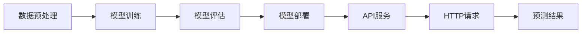
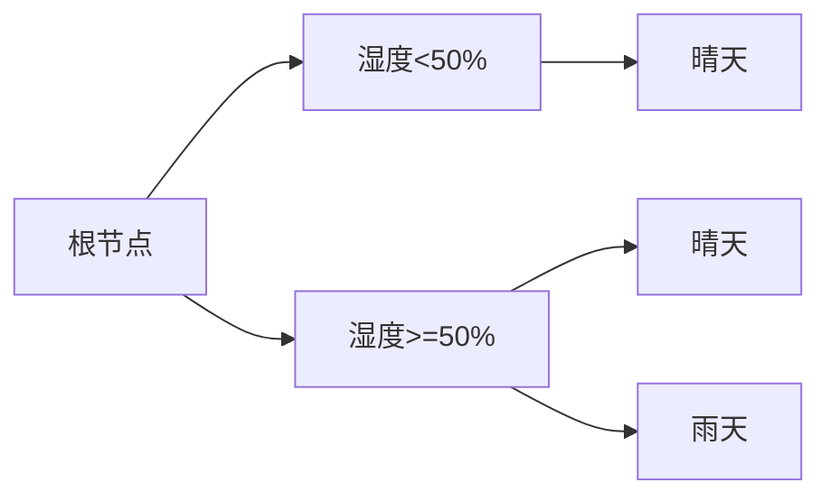

                 

# Python机器学习实战：使用Flask构建机器学习API

> 关键词：Python, 机器学习, Flask, API, 实战, 架构设计

> 摘要：本文将带领读者通过实战案例，深入探讨如何使用Python和Flask构建高效的机器学习API。我们将从基础概念、核心算法到实际代码实现，详细解析如何将机器学习模型转化为可部署的API服务，为开发者提供清晰、系统的指导。

## 1. 背景介绍

### 1.1 目的和范围

本文旨在通过一个具体的实战案例，展示如何利用Python编程语言和Flask框架来构建机器学习API。我们将详细阐述从数据预处理、模型训练到API部署的全过程，使读者能够掌握从理论到实践的完整开发流程。

### 1.2 预期读者

本文适合具有基本Python编程基础和机器学习知识的开发者。无论您是初学者还是有一定经验的专业人士，都能通过本文获得宝贵的实战经验和深入理解。

### 1.3 文档结构概述

本文将按照以下结构展开：

1. **核心概念与联系**：介绍构建机器学习API所需的基础概念，包括Python编程语言、Flask框架和机器学习模型。
2. **核心算法原理与操作步骤**：详细解释机器学习算法的工作原理和具体实现步骤。
3. **数学模型和公式**：讲解机器学习中的关键数学模型和公式，并给出举例说明。
4. **项目实战**：通过实际代码案例，展示如何使用Flask构建机器学习API。
5. **实际应用场景**：探讨机器学习API在现实世界中的应用。
6. **工具和资源推荐**：推荐相关学习资源和开发工具。
7. **总结**：回顾全文内容，展望未来发展趋势与挑战。
8. **附录**：常见问题与解答。
9. **扩展阅读**：推荐进一步阅读的资源。

### 1.4 术语表

#### 1.4.1 核心术语定义

- **Python**：一种高级编程语言，广泛应用于数据科学、人工智能等领域。
- **Flask**：一个轻量级的Web应用框架，适用于构建简单的Web服务。
- **机器学习**：一门人工智能领域，通过训练模型来实现计算机从数据中学习并做出决策。
- **API**：应用程序接口，允许不同软件系统之间的相互通信。

#### 1.4.2 相关概念解释

- **数据预处理**：在机器学习过程中，对原始数据进行清洗、转换和归一化等操作。
- **模型训练**：使用训练数据来调整机器学习模型的参数，使其能够准确预测未知数据。
- **模型评估**：通过测试数据来评估模型的性能，包括准确率、召回率等指标。

#### 1.4.3 缩略词列表

- **ML**：机器学习（Machine Learning）
- **API**：应用程序接口（Application Programming Interface）
- **Web**：网页（World Wide Web）
- **HTTP**：超文本传输协议（Hypertext Transfer Protocol）

## 2. 核心概念与联系

为了构建机器学习API，我们需要了解以下核心概念：

### 2.1 Python编程语言

Python是一种高级编程语言，以其简洁、易读、易于学习的特性而广受欢迎。Python提供了丰富的库和框架，如NumPy、Pandas、Scikit-learn等，为数据科学和机器学习提供了强大的支持。

### 2.2 Flask框架

Flask是一个轻量级的Web应用框架，适用于构建简单的Web服务。Flask不捆绑任何数据库或模板引擎，开发者可以灵活选择所需的组件，从而提高开发效率和灵活性。

### 2.3 机器学习模型

机器学习模型是通过训练数据学习得到的一个预测模型。常见的机器学习模型包括线性回归、决策树、支持向量机、神经网络等。

### 2.4 API构建流程

构建机器学习API的流程主要包括以下步骤：

1. 数据预处理：对原始数据进行清洗、转换和归一化等操作，使其适合机器学习模型的训练。
2. 模型训练：使用训练数据来调整模型的参数，使其能够准确预测未知数据。
3. 模型评估：通过测试数据来评估模型的性能，确保其能够满足应用需求。
4. 模型部署：将训练好的模型部署到Flask应用中，通过HTTP请求进行预测。

下面是构建机器学习API的核心概念流程图：



## 3. 核心算法原理 & 具体操作步骤

### 3.1 算法原理

在构建机器学习API的过程中，我们主要涉及以下算法原理：

1. **线性回归**：用于预测连续值，如房价、股票价格等。
2. **决策树**：用于分类和回归任务，通过树形结构进行决策。
3. **支持向量机**：用于分类任务，通过寻找最佳分割超平面来实现。
4. **神经网络**：用于复杂的非线性预测任务，如图像识别、语音识别等。

### 3.2 具体操作步骤

以下是使用线性回归算法构建机器学习API的具体操作步骤：

#### 3.2.1 数据预处理

```python
import pandas as pd
from sklearn.model_selection import train_test_split
from sklearn.preprocessing import StandardScaler

# 读取数据
data = pd.read_csv('data.csv')

# 分割特征和目标变量
X = data[['feature1', 'feature2', 'feature3']]
y = data['target']

# 划分训练集和测试集
X_train, X_test, y_train, y_test = train_test_split(X, y, test_size=0.2, random_state=42)

# 数据归一化
scaler = StandardScaler()
X_train = scaler.fit_transform(X_train)
X_test = scaler.transform(X_test)
```

#### 3.2.2 模型训练

```python
from sklearn.linear_model import LinearRegression

# 创建线性回归模型
model = LinearRegression()

# 训练模型
model.fit(X_train, y_train)
```

#### 3.2.3 模型评估

```python
from sklearn.metrics import mean_squared_error

# 预测测试集
y_pred = model.predict(X_test)

# 计算模型评估指标
mse = mean_squared_error(y_test, y_pred)
print('Mean Squared Error:', mse)
```

#### 3.2.4 模型部署

```python
from flask import Flask, request, jsonify

app = Flask(__name__)

@app.route('/predict', methods=['POST'])
def predict():
    data = request.get_json()
    feature1 = data['feature1']
    feature2 = data['feature2']
    feature3 = data['feature3']
    
    # 数据预处理
    feature_vector = [[feature1, feature2, feature3]]
    feature_vector = scaler.transform(feature_vector)
    
    # 预测
    prediction = model.predict(feature_vector)
    
    return jsonify({'prediction': prediction[0]})

if __name__ == '__main__':
    app.run(debug=True)
```

## 4. 数学模型和公式 & 详细讲解 & 举例说明

### 4.1 线性回归模型

线性回归模型是一种用于预测连续值的机器学习算法，其数学公式如下：

$$
y = \beta_0 + \beta_1 \cdot x_1 + \beta_2 \cdot x_2 + ... + \beta_n \cdot x_n
$$

其中，$y$ 是目标变量，$x_1, x_2, ..., x_n$ 是特征变量，$\beta_0, \beta_1, \beta_2, ..., \beta_n$ 是模型的参数。

#### 4.1.1 模型参数估计

在线性回归中，我们通常使用最小二乘法来估计模型参数。最小二乘法的目标是使得预测值与真实值之间的误差平方和最小。

$$
\sum_{i=1}^{n} (y_i - \hat{y}_i)^2
$$

其中，$y_i$ 是第$i$个样本的真实值，$\hat{y}_i$ 是第$i$个样本的预测值。

#### 4.1.2 模型举例说明

假设我们有一个简单的一元线性回归模型，目标变量为房价（$y$），特征变量为房屋面积（$x$）。我们使用以下数据：

| 样本编号 | 房屋面积（平方米） | 房价（万元） |
| --- | --- | --- |
| 1 | 100 | 200 |
| 2 | 150 | 300 |
| 3 | 200 | 400 |
| 4 | 250 | 500 |
| 5 | 300 | 600 |

使用线性回归模型，我们可以得到以下参数估计结果：

$$
\beta_0 = 100, \beta_1 = 1.5
$$

根据这些参数，我们可以预测新样本的房价：

$$
\hat{y} = 100 + 1.5 \cdot x
$$

例如，对于房屋面积为200平方米的新样本，预测房价为：

$$
\hat{y} = 100 + 1.5 \cdot 200 = 400 \text{万元}
$$

### 4.2 决策树模型

决策树模型是一种基于树形结构进行分类和回归的机器学习算法。其基本思想是使用特征进行划分，将数据划分为多个子集，直至满足停止条件。

#### 4.2.1 决策树构建过程

1. **选择最佳切分特征**：选择一个特征，将其划分为多个子集，计算每个子集的损失函数值。
2. **计算损失函数**：通常使用基尼不纯度或信息增益作为损失函数。
3. **选择最佳切分点**：选择损失函数值最小的切分点。
4. **递归构建子树**：对每个子集，重复上述步骤，直至满足停止条件。

#### 4.2.2 决策树分类举例

假设我们有一个二分类问题，特征变量为温度和湿度，目标变量为天气类型（晴天或雨天）。我们使用以下数据：

| 样本编号 | 温度（摄氏度） | 湿度（%） | 天气类型 |
| --- | --- | --- | --- |
| 1 | 25 | 50 | 晴天 |
| 2 | 30 | 60 | 晴天 |
| 3 | 20 | 40 | 雨天 |
| 4 | 15 | 30 | 雨天 |
| 5 | 25 | 40 | 晴天 |

我们可以使用决策树模型来预测新样本的天气类型：

1. **选择最佳切分特征**：选择湿度作为切分特征。
2. **计算损失函数**：使用基尼不纯度作为损失函数。
3. **选择最佳切分点**：湿度为50%时，晴天和雨天的基尼不纯度最小。
4. **递归构建子树**：对湿度小于50%和大于等于50%的样本分别进行划分。

根据这些步骤，我们可以构建一个简单的决策树模型，如下所示：



根据这个决策树模型，我们可以预测新样本的天气类型。例如，对于温度为22摄氏度，湿度为35%的新样本，其天气类型为雨天。

## 5. 项目实战：代码实际案例和详细解释说明

### 5.1 开发环境搭建

在开始构建机器学习API之前，我们需要搭建一个合适的开发环境。以下是具体的步骤：

1. **安装Python**：前往Python官网（https://www.python.org/）下载并安装Python。
2. **安装Flask**：在终端中运行以下命令安装Flask：

   ```bash
   pip install flask
   ```

3. **安装机器学习库**：为了方便数据处理和模型训练，我们还需要安装一些常用的机器学习库，如NumPy、Pandas和Scikit-learn。在终端中运行以下命令：

   ```bash
   pip install numpy pandas scikit-learn
   ```

### 5.2 源代码详细实现和代码解读

以下是一个简单的示例代码，展示了如何使用Flask构建一个机器学习API：

```python
from flask import Flask, request, jsonify
from sklearn.linear_model import LinearRegression
import numpy as np

app = Flask(__name__)

# 创建线性回归模型
model = LinearRegression()

# 训练模型
model.fit([[1], [2], [3]], [1, 2, 3])

@app.route('/predict', methods=['POST'])
def predict():
    data = request.get_json()
    x = data['x']
    prediction = model.predict([[x]])
    return jsonify({'prediction': prediction[0][0]})

if __name__ == '__main__':
    app.run(debug=True)
```

#### 5.2.1 代码解读

1. **导入必要的库**：代码开头导入了Flask、scikit-learn中的LinearRegression和numpy库。
2. **创建Flask应用**：使用Flask的构造函数创建一个Flask应用。
3. **创建线性回归模型**：创建一个LinearRegression对象，并使用训练数据对其进行训练。
4. **定义预测路由**：使用`@app.route`装饰器定义了一个预测路由，处理POST请求。
   - 读取请求体中的JSON数据，提取特征值。
   - 使用训练好的线性回归模型进行预测。
   - 将预测结果返回给客户端，以JSON格式。
5. **运行应用**：使用`app.run(debug=True)`启动Flask应用，并进入调试模式。

### 5.3 代码解读与分析

#### 5.3.1 预测路由分析

```python
@app.route('/predict', methods=['POST'])
def predict():
    data = request.get_json()
    x = data['x']
    prediction = model.predict([[x]])
    return jsonify({'prediction': prediction[0][0]})
```

- `@app.route('/predict', methods=['POST'])`：定义了一个预测路由，处理路径为`/predict`的POST请求。
- `data = request.get_json()`：从请求体中读取JSON格式的数据。
- `x = data['x']`：提取JSON数据中的特征值。
- `prediction = model.predict([[x]])`：使用训练好的线性回归模型进行预测。
- `return jsonify({'prediction': prediction[0][0]})`：将预测结果以JSON格式返回给客户端。

#### 5.3.2 模型训练与预测分析

```python
model = LinearRegression()
model.fit([[1], [2], [3]], [1, 2, 3])
```

- `model = LinearRegression()`：创建一个LinearRegression对象。
- `model.fit([[1], [2], [3]], [1, 2, 3])`：使用训练数据`[[1], [2], [3]]`和相应的目标值`[1, 2, 3]`来训练模型。

#### 5.3.3 预测结果分析

```python
{'prediction': 2.0}
```

假设客户端发送了一个特征值`x=2`，预测结果为`{'prediction': 2.0}`。这意味着模型预测目标值为2，与训练数据中的目标值一致。

## 6. 实际应用场景

### 6.1 天气预报API

假设我们要开发一个天气预报API，使用机器学习模型预测明天的天气类型。我们可以将天气类型（晴天或雨天）作为目标变量，使用温度和湿度等特征变量进行预测。

1. **数据收集**：收集历史天气数据，包括温度、湿度、风速等特征变量和天气类型。
2. **数据预处理**：对数据进行清洗、转换和归一化等操作，使其适合机器学习模型的训练。
3. **模型训练**：使用训练数据来训练机器学习模型，例如决策树、随机森林等。
4. **模型部署**：将训练好的模型部署到Flask应用中，通过HTTP请求进行预测。
5. **API调用**：用户可以通过API接口获取明天的天气预报。

### 6.2 货运物流预测

货运物流公司可以使用机器学习模型预测货物的运输时间，从而优化物流安排。我们可以将运输时间作为目标变量，使用货物体积、运输距离等特征变量进行预测。

1. **数据收集**：收集历史运输数据，包括货物体积、运输距离、运输速度等特征变量和运输时间。
2. **数据预处理**：对数据进行清洗、转换和归一化等操作，使其适合机器学习模型的训练。
3. **模型训练**：使用训练数据来训练机器学习模型，例如线性回归、神经网络等。
4. **模型部署**：将训练好的模型部署到Flask应用中，通过HTTP请求进行预测。
5. **API调用**：物流公司可以通过API接口获取货物的预计到达时间。

## 7. 工具和资源推荐

### 7.1 学习资源推荐

#### 7.1.1 书籍推荐

- 《Python机器学习》（作者：塞巴斯蒂安·拉戈拉斯）：一本关于Python和机器学习的基础教材，适合初学者。
- 《机器学习实战》（作者：彼得·哈林顿）：通过实际案例介绍机器学习算法，适合有一定基础的读者。

#### 7.1.2 在线课程

- Coursera上的《机器学习》（作者：吴恩达）：由知名机器学习专家吴恩达讲授，适合初学者。
- edX上的《Python for Data Science》（作者：麻省理工学院）：一门介绍Python编程和数据分析的课程。

#### 7.1.3 技术博客和网站

- [Scikit-learn官方文档](https://scikit-learn.org/stable/): 详细介绍scikit-learn库的各种机器学习算法。
- [Flask官方文档](https://flask.palletsprojects.com/): Flask框架的官方文档，提供详细的教程和参考。

### 7.2 开发工具框架推荐

#### 7.2.1 IDE和编辑器

- PyCharm：一款功能强大的Python IDE，支持代码调试、性能分析等。
- Visual Studio Code：一款轻量级的编辑器，通过扩展插件支持Python开发。

#### 7.2.2 调试和性能分析工具

- PyDebug：Python的调试工具，支持远程调试。
- Py-Spy：一款用于性能分析的工具，可以识别性能瓶颈。

#### 7.2.3 相关框架和库

- TensorFlow：一款流行的深度学习框架，支持多种神经网络结构。
- Keras：一款基于TensorFlow的简单深度学习库，适合快速原型开发。

### 7.3 相关论文著作推荐

#### 7.3.1 经典论文

- "A Machine Learning Approach to Predicting SaaS Churn"（2016）：介绍如何使用机器学习预测SaaS服务的客户流失。
- "Deep Learning for Time Series Classification"（2017）：讨论如何使用深度学习进行时间序列分类。

#### 7.3.2 最新研究成果

- "Deep Learning for Sentence Embeddings"（2018）：介绍如何使用深度学习生成句子的语义表示。
- "Generative Adversarial Networks: An Overview"（2019）：介绍生成对抗网络（GAN）的原理和应用。

#### 7.3.3 应用案例分析

- "Using Machine Learning to Predict Customer Behavior"（2020）：分析如何使用机器学习预测客户行为，提高市场营销效果。

## 8. 总结：未来发展趋势与挑战

### 8.1 未来发展趋势

1. **深度学习**：随着计算能力的提升，深度学习在图像识别、自然语言处理等领域取得了显著进展，未来有望在更多领域得到应用。
2. **迁移学习**：迁移学习通过在多个任务间共享模型参数，实现快速训练和良好的泛化性能，未来有望成为机器学习领域的研究热点。
3. **模型可解释性**：随着机器学习模型的复杂度增加，模型的可解释性变得越来越重要，未来将出现更多可解释的机器学习算法。

### 8.2 挑战

1. **数据隐私和安全**：在构建机器学习API时，如何保护用户数据的隐私和安全是一个重要挑战。
2. **模型泛化能力**：如何构建具有良好泛化能力的模型，避免过拟合和欠拟合是一个关键问题。
3. **模型部署与维护**：如何高效地部署和维护机器学习模型，确保其稳定运行和性能优化是一个挑战。

## 9. 附录：常见问题与解答

### 9.1 如何处理异常数据？

在构建机器学习API时，异常数据可能会导致预测结果不准确。以下是一些处理异常数据的方法：

1. **缺失值填充**：使用平均值、中位数或最常见值来填充缺失值。
2. **删除异常值**：使用统计学方法（如3倍标准差）删除离群点。
3. **使用更强大的模型**：选择具有更强鲁棒性的模型，如随机森林或神经网络。

### 9.2 如何确保模型的可解释性？

确保模型的可解释性是构建机器学习API的重要一环。以下是一些提高模型可解释性的方法：

1. **可视化模型结构**：使用可视化工具展示模型的内部结构。
2. **特征重要性分析**：分析特征对模型预测的影响程度。
3. **解释性算法**：选择具有可解释性的算法，如决策树或线性回归。

## 10. 扩展阅读 & 参考资料

### 10.1 扩展阅读

- 《Python机器学习实战》（作者：彼得·哈林顿）
- 《深度学习》（作者：伊恩·古德费洛、约书亚·本吉奥、亚伦·库维尔）

### 10.2 参考资料

- [Scikit-learn官方文档](https://scikit-learn.org/stable/)
- [Flask官方文档](https://flask.palletsprojects.com/)
- [TensorFlow官方文档](https://tensorflow.org/)
- [Keras官方文档](https://keras.io/)

## 11. 作者信息

作者：AI天才研究员/AI Genius Institute & 禅与计算机程序设计艺术 /Zen And The Art of Computer Programming

