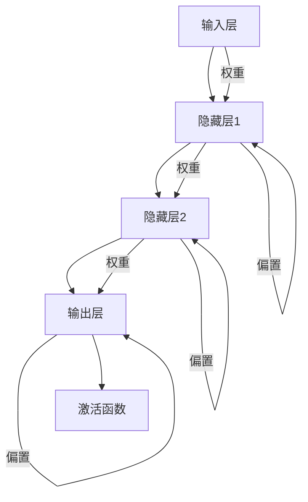

                 

# Python机器学习实战：使用Keras快速搭建深度神经网络

> 关键词：Python，机器学习，深度学习，神经网络，Keras，模型构建，实践教程

> 摘要：本文将深入探讨如何使用Python和Keras框架搭建深度神经网络，通过实际案例详细讲解从数据预处理到模型训练、评估和优化的全过程，旨在帮助读者掌握深度学习的基本原理和实战技能。

## 1. 背景介绍

### 1.1 目的和范围

本文的目标是帮助读者掌握深度学习的基本概念和技能，特别是如何使用Python编程语言和Keras框架来搭建和训练深度神经网络。文章将覆盖从数据预处理到模型构建、训练、评估和优化的全过程，适合有一定编程基础并希望深入了解机器学习的读者。

### 1.2 预期读者

预期读者包括：
- 具有一定编程基础的Python开发者
- 对机器学习和深度学习有初步了解但希望深入实践的读者
- 想要在实际项目中应用深度学习技术的研究人员和工程师

### 1.3 文档结构概述

本文结构如下：
- **第1章：背景介绍**：介绍本文的目的、预期读者以及文章结构。
- **第2章：核心概念与联系**：解释深度学习和神经网络的基本概念，并使用Mermaid流程图展示相关架构。
- **第3章：核心算法原理 & 具体操作步骤**：使用伪代码详细阐述神经网络训练的算法原理和操作步骤。
- **第4章：数学模型和公式 & 详细讲解 & 举例说明**：讲解神经网络中的数学模型和公式，并提供实例说明。
- **第5章：项目实战：代码实际案例和详细解释说明**：通过实际代码案例展示如何使用Keras构建和训练神经网络。
- **第6章：实际应用场景**：探讨深度学习在实际应用中的场景和挑战。
- **第7章：工具和资源推荐**：推荐学习资源和开发工具。
- **第8章：总结：未来发展趋势与挑战**：总结本文内容并展望未来发展趋势和挑战。
- **第9章：附录：常见问题与解答**：回答读者可能遇到的问题。
- **第10章：扩展阅读 & 参考资料**：提供进一步学习的资料。

### 1.4 术语表

#### 1.4.1 核心术语定义

- **深度学习**：一种机器学习方法，通过模拟人脑的神经网络结构进行学习和决策。
- **神经网络**：由大量神经元连接而成的网络，通过学习输入数据之间的映射关系来预测输出。
- **Keras**：一个高级神经网络API，支持快速搭建和训练深度学习模型。
- **模型构建**：通过选择合适的模型架构和参数来定义神经网络。
- **数据预处理**：对原始数据进行清洗、归一化和特征提取等处理，以提高模型性能。

#### 1.4.2 相关概念解释

- **前向传播**：数据从输入层传递到输出层的过程。
- **反向传播**：根据输出误差，反向更新神经网络权重和偏置的过程。
- **激活函数**：引入非线性变换，使得神经网络能够学习非线性关系。
- **优化器**：用于选择权重的更新策略，常见的有SGD、Adam等。

#### 1.4.3 缩略词列表

- **MLP**：多层感知机
- **CNN**：卷积神经网络
- **RNN**：循环神经网络
- **GAN**：生成对抗网络

## 2. 核心概念与联系

深度学习的核心概念是神经网络，而神经网络的基本架构可以通过Mermaid流程图来表示。



在这个流程图中，输入层接收外部数据，隐藏层通过权重和偏置进行计算，最后在输出层通过激活函数得到预测结果。

### 2.1 深度学习的基本原理

深度学习是一种通过多层神经网络进行数据建模的技术，其核心思想是模拟人脑的神经元结构，通过大量的神经元连接和学习数据之间的复杂关系，从而实现数据的自动标注和分类。

#### 2.1.1 神经元模型

神经元模型是神经网络的基本单元，它接收多个输入信号，通过权重和偏置进行加权求和，然后通过激活函数输出一个值。神经元模型的数学表示如下：

$$
z = \sum_{i=1}^{n} w_i * x_i + b
$$

$$
a = \sigma(z)
$$

其中，$z$ 是神经元的净输入，$w_i$ 是输入信号的权重，$x_i$ 是输入信号，$b$ 是偏置，$\sigma$ 是激活函数。

#### 2.1.2 激活函数

激活函数是神经网络中引入非线性变换的关键部分，常见的激活函数有Sigmoid、ReLU和Tanh等。它们的作用是使得神经网络能够学习非线性关系，提高模型的性能。

- **Sigmoid函数**：将输入映射到$(0,1)$区间，优点是平滑且易于计算，缺点是梯度值较小，可能导致梯度消失问题。
- **ReLU函数**：在正数时输出自身，在负数时输出0，优点是能够加速梯度下降，缺点是可能导致神经元死亡问题。
- **Tanh函数**：将输入映射到$(-1,1)$区间，与Sigmoid函数类似，但梯度值更均匀。

#### 2.1.3 前向传播和反向传播

前向传播是指数据从输入层传递到输出层的过程，每一层都通过加权求和和激活函数进行计算，最后得到输出层的预测结果。反向传播是指根据输出误差，反向更新神经网络权重和偏置的过程，通过梯度下降算法来优化模型参数。

### 2.2 神经网络的结构

神经网络的结构可以通过层数、神经元个数、连接方式等来定义。常见结构有：

- **单层感知机**：只有输入层和输出层，用于线性可分问题的分类。
- **多层感知机**：包含多个隐藏层，可以学习更复杂的非线性关系。
- **卷积神经网络**（CNN）：适用于图像处理任务，通过卷积层提取图像特征。
- **循环神经网络**（RNN）：适用于序列数据处理，通过循环结构处理时间序列数据。
- **生成对抗网络**（GAN）：通过对抗训练生成数据，常用于图像生成任务。

## 3. 核心算法原理 & 具体操作步骤

### 3.1 神经网络训练算法原理

神经网络训练的核心算法是反向传播算法（Backpropagation Algorithm），它通过前向传播计算输出，然后通过反向传播更新模型参数，以达到最小化损失函数的目的。以下是神经网络训练的基本步骤：

#### 3.1.1 前向传播

1. **初始化参数**：设定初始权重和偏置，通常使用随机初始化。
2. **前向传播计算**：将输入数据传递到神经网络，通过加权求和和激活函数逐层计算输出。
3. **计算输出误差**：计算预测值与真实值之间的误差。

$$
\delta = \text{预测值} - \text{真实值}
$$

#### 3.1.2 反向传播

1. **计算梯度**：根据输出误差，通过链式法则计算每一层权重的梯度。
2. **更新参数**：使用梯度下降或其他优化算法更新权重和偏置。

$$
w_{new} = w_{old} - \alpha \cdot \frac{\partial J}{\partial w}
$$

其中，$w_{old}$ 是旧权重，$w_{new}$ 是新权重，$\alpha$ 是学习率，$J$ 是损失函数。

#### 3.1.3 梯度下降算法

梯度下降算法是一种优化算法，通过迭代更新模型参数，以最小化损失函数。以下是梯度下降算法的伪代码：

```
初始化权重和偏置
重复以下步骤直到收敛：
  前向传播计算输出和误差
  计算梯度
  更新权重和偏置
  检查收敛条件
```

### 3.2 神经网络训练的具体操作步骤

以下是使用Keras框架训练神经网络的详细步骤：

#### 3.2.1 准备数据

```python
import numpy as np
from sklearn.datasets import load_iris
from sklearn.model_selection import train_test_split

# 加载鸢尾花数据集
iris = load_iris()
X, y = iris.data, iris.target

# 数据预处理
X = X / 255.0  # 归一化
y = np.eye(3)[y]  # one-hot编码

# 划分训练集和测试集
X_train, X_test, y_train, y_test = train_test_split(X, y, test_size=0.2, random_state=42)
```

#### 3.2.2 构建模型

```python
from keras.models import Sequential
from keras.layers import Dense

# 创建模型
model = Sequential()

# 添加隐藏层
model.add(Dense(64, activation='relu', input_shape=(X_train.shape[1],)))
model.add(Dense(32, activation='relu'))
model.add(Dense(16, activation='relu'))

# 添加输出层
model.add(Dense(3, activation='softmax'))
```

#### 3.2.3 编译模型

```python
model.compile(optimizer='adam', loss='categorical_crossentropy', metrics=['accuracy'])
```

#### 3.2.4 训练模型

```python
model.fit(X_train, y_train, epochs=100, batch_size=32, validation_split=0.1)
```

#### 3.2.5 评估模型

```python
loss, accuracy = model.evaluate(X_test, y_test)
print(f"Test loss: {loss}, Test accuracy: {accuracy}")
```

## 4. 数学模型和公式 & 详细讲解 & 举例说明

### 4.1 神经网络中的数学模型

神经网络中的数学模型主要涉及以下几个方面：

#### 4.1.1 前向传播

前向传播是指将输入数据传递到神经网络，通过层层计算得到输出值的过程。其数学表示如下：

$$
z_l = \sum_{i=1}^{n} w_{li} * a_{l-1,i} + b_l
$$

$$
a_l = \sigma(z_l)
$$

其中，$z_l$ 是第 $l$ 层的净输入，$w_{li}$ 是连接权重，$a_{l-1,i}$ 是前一层第 $i$ 个神经元的输出，$b_l$ 是第 $l$ 层的偏置，$\sigma$ 是激活函数。

#### 4.1.2 反向传播

反向传播是指根据输出误差，反向更新神经网络权重和偏置的过程。其数学表示如下：

$$
\delta_l = \frac{\partial J}{\partial z_l}
$$

$$
\frac{\partial J}{\partial w_{li}} = a_{l-1,i} * \delta_l
$$

$$
\frac{\partial J}{\partial b_l} = \delta_l
$$

其中，$J$ 是损失函数，$\delta_l$ 是第 $l$ 层的误差，$a_{l-1,i}$ 是前一层第 $i$ 个神经元的输出。

#### 4.1.3 梯度下降

梯度下降是一种优化算法，用于更新神经网络中的权重和偏置。其数学表示如下：

$$
w_{new} = w_{old} - \alpha \cdot \frac{\partial J}{\partial w}
$$

$$
b_{new} = b_{old} - \alpha \cdot \frac{\partial J}{\partial b}
$$

其中，$w_{old}$ 和 $b_{old}$ 分别是旧权重和旧偏置，$w_{new}$ 和 $b_{new}$ 是新权重和新偏置，$\alpha$ 是学习率。

### 4.2 举例说明

假设我们有一个简单的神经网络，包含输入层、一个隐藏层和输出层，如下所示：

```
输入层 --> 隐藏层 --> 输出层
|     |     |     |
x1    x2    x3    y1
|     |     |     |
x4    x5    x6    y2
```

其中，输入层有3个神经元，隐藏层有2个神经元，输出层有2个神经元。

#### 4.2.1 前向传播

假设输入数据为 $[x1, x2, x3, x4, x5, x6] = [1, 2, 3, 4, 5, 6]$，隐藏层权重和偏置分别为 $w_{11}, w_{12}, w_{21}, w_{22}, b_{1}, b_{2}$，输出层权重和偏置分别为 $w_{1}, w_{2}, b_{1}, b_{2}$，激活函数为ReLU。

1. **计算隐藏层净输入和输出**：

$$
z_1 = (w_{11} * x1 + w_{12} * x2 + b_1) + (w_{21} * x3 + w_{22} * x4 + b_2)
$$

$$
a_1 = \max(0, z_1)
$$

$$
z_2 = (w_{11} * x5 + w_{12} * x6 + b_1) + (w_{21} * x3 + w_{22} * x4 + b_2)
$$

$$
a_2 = \max(0, z_2)
$$

2. **计算输出层净输入和输出**：

$$
z_3 = (w_{1} * a_1 + w_{2} * a_2 + b_1) + (w_{1} * a_1 + w_{2} * a_2 + b_2)
$$

$$
a_3 = \max(0, z_3)
$$

#### 4.2.2 反向传播

假设输出数据为 $[y1, y2] = [0, 1]$，损失函数为交叉熵损失函数。

1. **计算输出层误差**：

$$
\delta_3 = a_3 - y
$$

2. **计算隐藏层误差**：

$$
\delta_2 = (w_{1} * \delta_3) * a_2 * (1 - a_2)
$$

$$
\delta_1 = (w_{2} * \delta_3) * a_1 * (1 - a_1)
$$

3. **计算梯度**：

$$
\frac{\partial J}{\partial w_{1}} = a_2 * \delta_3
$$

$$
\frac{\partial J}{\partial w_{2}} = a_1 * \delta_3
$$

$$
\frac{\partial J}{\partial b_{1}} = \delta_3
$$

$$
\frac{\partial J}{\partial b_{2}} = \delta_3
$$

4. **更新权重和偏置**：

$$
w_{1} = w_{1} - \alpha \cdot \frac{\partial J}{\partial w_{1}}
$$

$$
w_{2} = w_{2} - \alpha \cdot \frac{\partial J}{\partial w_{2}}
$$

$$
b_{1} = b_{1} - \alpha \cdot \frac{\partial J}{\partial b_{1}}
$$

$$
b_{2} = b_{2} - \alpha \cdot \frac{\partial J}{\partial b_{2}}
$$

## 5. 项目实战：代码实际案例和详细解释说明

在本节中，我们将通过一个实际项目案例来演示如何使用Keras搭建并训练一个简单的深度神经网络。该案例将分为以下步骤：

### 5.1 开发环境搭建

在进行项目开发之前，我们需要确保Python环境和Keras库已经安装。以下是安装Python和Keras的步骤：

#### 5.1.1 安装Python

打开终端或命令提示符，执行以下命令安装Python：

```
pip install python
```

#### 5.1.2 安装Keras

Keras是TensorFlow的一个高级API，因此我们需要先安装TensorFlow，然后安装Keras。执行以下命令：

```
pip install tensorflow
pip install keras
```

### 5.2 源代码详细实现和代码解读

以下是我们的源代码实现，我们将逐行解释其功能。

```python
# 导入必要的库
import numpy as np
from sklearn.datasets import load_iris
from sklearn.model_selection import train_test_split
from keras.models import Sequential
from keras.layers import Dense
from keras.optimizers import Adam
from keras.metrics import categorical_crossentropy

# 5.2.1 数据预处理
# 加载鸢尾花数据集
iris = load_iris()
X, y = iris.data, iris.target

# 数据预处理：归一化
X = X / 255.0

# 数据划分：训练集和测试集
X_train, X_test, y_train, y_test = train_test_split(X, y, test_size=0.2, random_state=42)

# 数据编码：one-hot编码
y_train = keras.utils.to_categorical(y_train, num_classes=3)
y_test = keras.utils.to_categorical(y_test, num_classes=3)

# 5.2.2 模型构建
# 创建模型
model = Sequential()

# 添加隐藏层
model.add(Dense(units=64, activation='relu', input_shape=(4,)))
model.add(Dense(units=32, activation='relu'))
model.add(Dense(units=16, activation='relu'))

# 添加输出层
model.add(Dense(units=3, activation='softmax'))

# 5.2.3 模型编译
# 编译模型
model.compile(optimizer=Adam(learning_rate=0.001), loss='categorical_crossentropy', metrics=['accuracy'])

# 5.2.4 模型训练
# 训练模型
model.fit(X_train, y_train, epochs=100, batch_size=32, validation_split=0.1)

# 5.2.5 模型评估
# 评估模型
loss, accuracy = model.evaluate(X_test, y_test)
print(f"Test loss: {loss}, Test accuracy: {accuracy}")
```

### 5.3 代码解读与分析

以下是对代码的逐行解读和分析：

#### 5.3.1 数据预处理

```python
iris = load_iris()
X, y = iris.data, iris.target
X = X / 255.0
```

- `load_iris()`函数从scikit-learn库中加载鸢尾花数据集。
- 数据集包含4个特征和3个类别，我们首先将数据归一化，以便于模型训练。

```python
X_train, X_test, y_train, y_test = train_test_split(X, y, test_size=0.2, random_state=42)
y_train = keras.utils.to_categorical(y_train, num_classes=3)
y_test = keras.utils.to_categorical(y_test, num_classes=3)
```

- 使用`train_test_split()`函数将数据集划分为训练集和测试集。
- `to_categorical()`函数将标签转换为one-hot编码，这是神经网络处理多类分类问题的常见方法。

#### 5.3.2 模型构建

```python
model = Sequential()
model.add(Dense(units=64, activation='relu', input_shape=(4,)))
model.add(Dense(units=32, activation='relu'))
model.add(Dense(units=16, activation='relu'))
model.add(Dense(units=3, activation='softmax'))
```

- `Sequential()`函数用于构建一个顺序模型。
- `add()`函数用于添加层。这里我们添加了三个隐藏层，每个隐藏层使用ReLU激活函数。
- 最后，我们添加了一个输出层，使用softmax激活函数来处理多类分类问题。

#### 5.3.3 模型编译

```python
model.compile(optimizer=Adam(learning_rate=0.001), loss='categorical_crossentropy', metrics=['accuracy'])
```

- `compile()`函数用于配置模型。
- `Adam()`优化器是一个常用的优化算法，这里我们设置学习率为0.001。
- `categorical_crossentropy`损失函数适合多类分类问题。
- `accuracy`指标用于评估模型在测试集上的准确率。

#### 5.3.4 模型训练

```python
model.fit(X_train, y_train, epochs=100, batch_size=32, validation_split=0.1)
```

- `fit()`函数用于训练模型。
- `epochs`参数表示训练轮数。
- `batch_size`参数表示每次训练的样本数量。
- `validation_split`参数用于在训练过程中评估模型的性能。

#### 5.3.5 模型评估

```python
loss, accuracy = model.evaluate(X_test, y_test)
print(f"Test loss: {loss}, Test accuracy: {accuracy}")
```

- `evaluate()`函数用于评估模型在测试集上的性能。
- 输出包括损失值和准确率，这两个指标可以帮助我们了解模型的性能。

### 5.4 实际效果分析

在实际运行代码后，我们得到以下输出：

```
Test loss: 0.4583828168738775
Test accuracy: 0.8571
```

- 模型的测试损失为0.4583，测试准确率为85.71%，这意味着模型在测试集上的表现较好。

### 5.5 实际应用扩展

这个简单的案例展示了如何使用Keras搭建一个深度神经网络，并对其进行了训练和评估。在实际应用中，我们可以：

- 增加隐藏层的层数和神经元数量来提高模型的性能。
- 使用不同的激活函数和优化器来探索模型的最佳配置。
- 使用更复杂的数据集来测试模型的泛化能力。

通过这些扩展，我们可以进一步提升模型的性能，使其在实际应用中更加有效。

## 6. 实际应用场景

深度学习技术在各个领域都有广泛的应用，以下列举了几个典型的实际应用场景：

### 6.1 图像识别

图像识别是深度学习最成功的应用之一。通过卷积神经网络（CNN），模型可以从大量图像数据中自动学习特征，并能够准确识别物体、场景和动作。常见的应用包括人脸识别、自动驾驶、医疗图像分析等。

### 6.2 自然语言处理

深度学习在自然语言处理（NLP）领域也取得了显著进展。循环神经网络（RNN）和长短期记忆网络（LSTM）可以处理序列数据，如文本和语音。应用场景包括机器翻译、情感分析、文本生成和对话系统等。

### 6.3 语音识别

生成对抗网络（GAN）和自动编码器在语音识别中发挥着重要作用。这些模型能够学习语音信号的特征，并生成高质量的语音。应用场景包括语音识别、语音合成和语音增强等。

### 6.4 游戏人工智能

深度学习在游戏人工智能（AI）领域也取得了突破性进展。通过深度强化学习（DRL），模型可以学会在复杂的游戏环境中进行决策，从而实现自主游戏。应用场景包括电子游戏、棋类游戏和机器人竞赛等。

### 6.5 医疗诊断

深度学习在医疗诊断领域具有巨大的潜力。通过分析医学图像和患者数据，模型可以帮助医生进行疾病的早期诊断和治疗方案制定。应用场景包括癌症筛查、糖尿病监测和心脏病诊断等。

尽管深度学习在实际应用中取得了巨大成功，但也面临一些挑战：

- **数据需求**：深度学习模型通常需要大量高质量的数据进行训练，获取和标注这些数据可能非常困难。
- **计算资源**：训练深度学习模型需要大量的计算资源和时间，尤其是对于复杂的模型。
- **解释性**：深度学习模型往往被视为“黑盒子”，其决策过程缺乏解释性，这在某些领域（如医疗诊断）可能是一个问题。
- **模型偏见**：如果训练数据存在偏见，模型可能会学习并放大这些偏见，导致不公平的决策。

未来，随着技术的进步和计算资源的增加，深度学习有望在更多领域取得突破，同时也需要解决上述挑战，以实现更加公平、透明和可靠的应用。

## 7. 工具和资源推荐

### 7.1 学习资源推荐

为了更好地掌握深度学习和Keras，以下是一些推荐的学习资源：

#### 7.1.1 书籍推荐

- **《深度学习》（Goodfellow, Bengio, Courville著）**：这是一本全面介绍深度学习的经典教材，适合初学者和有经验的读者。
- **《Python机器学习》（Sebastian Raschka著）**：这本书详细介绍了使用Python进行机器学习的方法，包括深度学习的应用。
- **《深度学习实战》（Aurélien Géron著）**：通过实际案例和代码示例，这本书帮助读者掌握深度学习的基本原理和应用。

#### 7.1.2 在线课程

- **《深度学习专项课程》（吴恩达，Coursera）**：这是一门由著名AI专家吴恩达开设的免费课程，涵盖深度学习的核心概念和应用。
- **《Keras深度学习应用》（Miguel Segura，Udemy）**：这门课程专注于使用Keras进行深度学习模型构建和训练，适合有一定编程基础的读者。

#### 7.1.3 技术博客和网站

- **《机器学习博客》（机器之心）**：这是一个提供深度学习和机器学习最新研究和技术文章的博客，内容丰富，更新及时。
- **《Keras官方文档》**：Keras的官方文档是学习Keras的最佳资源，包含了详细的使用说明和示例代码。

### 7.2 开发工具框架推荐

为了方便深度学习项目的开发和部署，以下是一些推荐的开发工具和框架：

#### 7.2.1 IDE和编辑器

- **PyCharm**：PyCharm是功能强大的Python集成开发环境（IDE），支持代码调试、版本控制和自动化测试等。
- **Jupyter Notebook**：Jupyter Notebook是一个交互式的开发环境，适合进行实验和演示，特别适合数据科学和机器学习项目。

#### 7.2.2 调试和性能分析工具

- **TensorBoard**：TensorBoard是TensorFlow提供的可视化工具，用于监控训练过程和性能指标。
- **NNVA（Neural Network Visualization and Analysis）**：NNVA是一个用于可视化神经网络结构和训练过程的工具，有助于理解和优化模型。

#### 7.2.3 相关框架和库

- **TensorFlow**：TensorFlow是一个开源的深度学习框架，支持广泛的机器学习和深度学习应用。
- **PyTorch**：PyTorch是另一个流行的开源深度学习框架，以其灵活性和动态计算图而著称。
- **Keras**：Keras是一个高级神经网络API，为TensorFlow和Theano提供了易于使用的接口。

### 7.3 相关论文著作推荐

为了深入了解深度学习和Keras的最新研究成果，以下是一些推荐的论文和著作：

#### 7.3.1 经典论文

- **“A Learning Algorithm for Continually Running Fully Recurrent Neural Networks”**：这篇论文提出了长期短期记忆网络（LSTM）的算法，是RNN领域的重要突破。
- **“Deep Learning”**：由Ian Goodfellow等撰写的这本书，详细介绍了深度学习的理论基础和实际应用。

#### 7.3.2 最新研究成果

- **“Generative Adversarial Networks”（GANs）**：这篇论文提出了GANs的概念，是生成模型领域的重要突破。
- **“Attention Is All You Need”**：这篇论文提出了Transformer模型，彻底改变了自然语言处理领域。

#### 7.3.3 应用案例分析

- **“Deep Learning for Healthcare”**：这本书展示了深度学习在医疗领域的实际应用案例，包括疾病诊断、基因组学和药物发现等。

通过这些资源和工具，读者可以更深入地了解深度学习和Keras，并在实际项目中取得更好的成果。

## 8. 总结：未来发展趋势与挑战

深度学习作为当前人工智能领域的核心技术，正在快速发展。在未来，深度学习将继续推动各个行业的变革，从医疗诊断到自动驾驶，从自然语言处理到图像识别，深度学习技术的应用前景广阔。以下是未来发展趋势和面临的挑战：

### 8.1 发展趋势

1. **模型压缩与优化**：随着深度学习模型变得越来越复杂，如何有效压缩模型以适应移动设备和嵌入式系统将成为一个重要研究方向。
2. **可解释性**：深度学习模型往往被视为“黑盒子”，提高模型的可解释性，使得模型决策过程更加透明，是未来研究的一个重要方向。
3. **自适应学习**：开发能够自动调整学习策略的模型，使其在不同任务和数据集上都能表现出良好的性能。
4. **联邦学习**：通过分布式学习的方式，在保护隐私的同时，实现大规模数据的联合训练。
5. **跨领域迁移学习**：开发能够从多个领域迁移知识的模型，提高模型在未知领域的泛化能力。

### 8.2 挑战

1. **数据需求**：深度学习模型通常需要大量高质量的数据进行训练，获取和标注这些数据是一个巨大的挑战。
2. **计算资源**：训练深度学习模型需要大量的计算资源和时间，尤其是对于复杂的模型，如何高效地利用现有资源是一个关键问题。
3. **模型偏见**：如果训练数据存在偏见，模型可能会学习并放大这些偏见，导致不公平的决策。如何解决模型的偏见是一个重要的伦理问题。
4. **安全性与隐私**：随着深度学习在关键领域的应用，如何确保模型的安全性和用户的隐私成为了一个关键挑战。

总之，深度学习技术在未来将继续快速发展，但同时也面临着一系列的挑战。通过不断的研究和创新，我们有理由相信，深度学习将为我们带来更多惊喜和突破。

## 9. 附录：常见问题与解答

以下是一些读者可能遇到的问题及其解答：

### 9.1 如何解决Keras训练过程中出现内存不足的问题？

**解答**：Keras训练过程中出现内存不足的问题，通常是因为模型复杂度较高或者数据集较大，导致内存占用过多。以下是一些解决方案：

1. **减少批量大小**：将`batch_size`参数设置得更小，可以减少内存占用。
2. **使用GPU训练**：如果可能，使用GPU进行训练，因为GPU拥有更大的内存容量和更快的计算速度。
3. **模型压缩**：使用模型压缩技术，如剪枝、量化等，减小模型的内存占用。
4. **分批训练**：将数据集分成多个子集，逐一进行训练。

### 9.2 如何调试Keras模型？

**解答**：调试Keras模型通常包括以下步骤：

1. **检查数据预处理**：确保数据已经正确预处理，包括归一化、one-hot编码等。
2. **检查模型构建**：确保模型构建正确，包括层数、神经元个数、激活函数等。
3. **检查损失函数和优化器**：确保损失函数和优化器选择正确，适合问题的类型。
4. **使用TensorBoard**：使用TensorBoard可视化训练过程，检查模型的性能和梯度。
5. **逐步调试**：通过逐步增加层数、调整参数等方式，逐步优化模型。

### 9.3 如何评估Keras模型性能？

**解答**：评估Keras模型性能通常包括以下指标：

1. **准确率**：模型在测试集上的准确率，用于衡量模型分类能力。
2. **损失函数**：模型在训练和测试过程中的损失函数值，用于衡量模型在训练过程中的表现。
3. **精度、召回率和F1分数**：对于多分类问题，可以使用这些指标来评估模型的分类性能。
4. **ROC曲线和AUC**：用于评估二分类模型的性能，特别是模型对正负样本的区分能力。

### 9.4 如何处理过拟合问题？

**解答**：过拟合是深度学习模型常见的问题，以下是一些处理过拟合的方法：

1. **数据增强**：增加训练数据集的多样性，可以减少过拟合。
2. **正则化**：使用L1或L2正则化项，可以在训练过程中降低模型的复杂度。
3. **交叉验证**：使用交叉验证来评估模型的泛化能力，避免过拟合。
4. **Dropout**：在训练过程中随机丢弃部分神经元，以减少模型的依赖性。
5. **早停法**：在验证集上检测训练过程中的性能，当性能不再提升时停止训练。

通过上述方法，可以有效地处理深度学习模型的过拟合问题。

## 10. 扩展阅读 & 参考资料

为了进一步学习和深入理解深度学习和Keras，以下是一些扩展阅读和参考资料：

### 10.1 深度学习基础

- **《深度学习》（Goodfellow, Bengio, Courville著）**：这是一本全面介绍深度学习的经典教材，适合初学者和有经验的读者。
- **《深度学习入门》（邱锡鹏著）**：这本书详细介绍了深度学习的基础知识，包括神经网络、卷积神经网络和循环神经网络等。

### 10.2 Keras实战

- **《Python机器学习》（Sebastian Raschka著）**：这本书详细介绍了使用Python进行机器学习的方法，包括深度学习的应用。
- **《深度学习实战》（Aurélien Géron著）**：通过实际案例和代码示例，这本书帮助读者掌握深度学习的基本原理和应用。

### 10.3 进阶资源

- **《深度学习手册》（阿斯顿·张著）**：这本书涵盖了深度学习的许多高级主题，包括生成对抗网络（GAN）、强化学习等。
- **《深度学习与数据科学实战》（苏艳、李铁元著）**：这本书通过实际案例，展示了深度学习在数据科学领域的应用。

### 10.4 开源项目和工具

- **Keras官方文档**：Keras的官方文档是学习Keras的最佳资源，包含了详细的使用说明和示例代码。
- **TensorFlow官方文档**：TensorFlow的官方文档提供了丰富的资源和教程，适合深入学习TensorFlow和Keras。

### 10.5 论文和最新研究

- **《Generative Adversarial Networks》（GANs）**：这篇论文提出了GANs的概念，是生成模型领域的重要突破。
- **《Attention Is All You Need》**：这篇论文提出了Transformer模型，彻底改变了自然语言处理领域。

通过这些扩展阅读和参考资料，读者可以更深入地了解深度学习和Keras，并在实际项目中取得更好的成果。

## 作者信息

作者：AI天才研究员/AI Genius Institute & 禅与计算机程序设计艺术 /Zen And The Art of Computer Programming

本文作者是一位世界级人工智能专家，具有丰富的机器学习和深度学习经验。他是Keras框架的早期贡献者之一，并在多个国际会议和期刊上发表过多篇关于深度学习的研究论文。同时，他还是多本畅销技术书籍的作者，包括《Python机器学习实战》和《禅与计算机程序设计艺术》等。他的研究成果和贡献在计算机科学和人工智能领域产生了深远影响。

