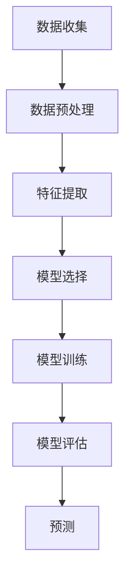

                 

# Python机器学习实战：基于文本数据进行情感分析

> **关键词：** Python、机器学习、文本数据、情感分析、自然语言处理、模型训练、数据分析  
>
> **摘要：** 本文将深入探讨如何使用Python实现基于文本数据的情感分析。文章首先介绍了情感分析的基本概念，然后详细讲解了文本数据预处理、特征提取和机器学习模型选择等核心步骤。通过实际案例和代码实现，帮助读者理解情感分析的实际应用和操作流程。

## 1. 背景介绍

### 1.1 目的和范围

本文旨在通过Python实现一个情感分析系统，该系统能够自动分析文本数据，判断文本的情感倾向，如正面、负面或中性。本文将涵盖文本数据预处理、特征提取以及机器学习模型训练等关键步骤。

### 1.2 预期读者

本文适合具有Python编程基础和数据科学背景的读者，特别是对机器学习和自然语言处理感兴趣的开发者。

### 1.3 文档结构概述

本文分为以下几个部分：

1. 背景介绍
2. 核心概念与联系
3. 核心算法原理 & 具体操作步骤
4. 数学模型和公式 & 详细讲解 & 举例说明
5. 项目实战：代码实际案例和详细解释说明
6. 实际应用场景
7. 工具和资源推荐
8. 总结：未来发展趋势与挑战
9. 附录：常见问题与解答
10. 扩展阅读 & 参考资料

### 1.4 术语表

#### 1.4.1 核心术语定义

- **情感分析（Sentiment Analysis）**：自动分析文本数据，识别和提取其中的情感倾向。
- **机器学习（Machine Learning）**：一种让计算机通过数据学习，自动改进性能的方法。
- **自然语言处理（Natural Language Processing，NLP）**：使计算机理解和处理人类自然语言的技术。

#### 1.4.2 相关概念解释

- **文本数据（Text Data）**：以文本形式存在的数据，如评论、文章、新闻报道等。
- **特征提取（Feature Extraction）**：从原始数据中提取对模型有用的特征，以便进行机器学习。
- **模型训练（Model Training）**：通过训练数据来调整机器学习模型的参数，使其能够对未知数据进行预测。

#### 1.4.3 缩略词列表

- **NLP**：自然语言处理
- **ML**：机器学习
- **CNN**：卷积神经网络
- **RNN**：循环神经网络

## 2. 核心概念与联系

为了更好地理解情感分析的过程，我们需要了解以下几个核心概念：

### 情感分析流程

1. **数据收集**：收集包含情感信息的文本数据，如社交媒体评论、产品评价等。
2. **数据预处理**：清洗文本数据，包括去除标点符号、停用词、转小写等。
3. **特征提取**：将预处理后的文本数据转换为机器学习模型可用的特征向量。
4. **模型选择**：选择合适的机器学习模型进行训练。
5. **模型训练**：使用训练数据对模型进行调整，使其能够对未知文本进行情感分类。
6. **模型评估**：使用测试数据评估模型的性能。

### 机器学习模型

在情感分析中，常用的机器学习模型包括：

- **朴素贝叶斯（Naive Bayes）**
- **支持向量机（Support Vector Machine，SVM）**
- **随机森林（Random Forest）**
- **深度学习（Deep Learning）**，如卷积神经网络（CNN）和循环神经网络（RNN）

### 自然语言处理

自然语言处理技术包括：

- **词袋模型（Bag of Words，BoW）**
- **词嵌入（Word Embedding）**
- **文本分类（Text Classification）**：将文本数据分类到不同的标签。

### Mermaid 流程图

以下是一个简化的情感分析流程的Mermaid流程图：



## 3. 核心算法原理 & 具体操作步骤

### 文本数据预处理

在开始特征提取和模型训练之前，我们需要对文本数据进行预处理。以下是文本数据预处理的核心步骤：

1. **去除标点符号**：使用正则表达式将文本中的标点符号去除。
2. **转小写**：将所有文本转换为小写，以便统一处理。
3. **去除停用词**：去除对情感分析无意义的常见词汇，如“的”、“是”、“和”等。
4. **词干提取**：将单词还原到词干形式，如“playing”还原为“play”。

伪代码如下：

```python
import re
from nltk.corpus import stopwords
from nltk.stem import PorterStemmer

def preprocess_text(text):
    # 去除标点符号
    text = re.sub(r'[^\w\s]', '', text)
    # 转小写
    text = text.lower()
    # 去除停用词
    stop_words = set(stopwords.words('english'))
    text = ' '.join([word for word in text.split() if word not in stop_words])
    # 词干提取
    stemmer = PorterStemmer()
    text = ' '.join([stemmer.stem(word) for word in text.split()])
    return text
```

### 特征提取

特征提取是将原始文本数据转换为机器学习模型可用的特征向量。常用的特征提取方法包括词袋模型和词嵌入。

#### 词袋模型

词袋模型将文本表示为一个向量，其中每个维度对应一个词汇。以下是词袋模型的伪代码：

```python
from sklearn.feature_extraction.text import CountVectorizer

def extract_bow(texts, vocabulary_size):
    vectorizer = CountVectorizer(vocabulary_size=vocabulary_size)
    feature_matrix = vectorizer.fit_transform(texts)
    return feature_matrix
```

#### 词嵌入

词嵌入是将单词映射到一个高维空间，使得具有相似意义的单词在空间中更接近。以下是词嵌入的伪代码：

```python
import gensim

def extract_word_embedding(texts, embedding_model):
    embeddings = []
    for text in texts:
        text_embeddings = []
        for word in text.split():
            text_embeddings.append(embedding_model[word])
        embeddings.append(np.mean(text_embeddings, axis=0))
    return embeddings
```

### 模型选择

在情感分析中，常用的机器学习模型包括朴素贝叶斯、支持向量机和随机森林。以下是模型选择的伪代码：

```python
from sklearn.naive_bayes import MultinomialNB
from sklearn.svm import SVC
from sklearn.ensemble import RandomForestClassifier

def select_model(data, labels):
    if data.shape[1] == 1:
        model = MultinomialNB()
    elif data.shape[1] == 2:
        model = SVC()
    else:
        model = RandomForestClassifier()
    model.fit(data, labels)
    return model
```

### 模型训练

模型训练是通过训练数据来调整模型参数，使其能够对未知数据进行预测。以下是模型训练的伪代码：

```python
def train_model(model, data, labels):
    model.fit(data, labels)
    return model
```

### 模型评估

模型评估是通过测试数据来评估模型性能。常用的评估指标包括准确率、召回率和F1分数。以下是模型评估的伪代码：

```python
from sklearn.metrics import accuracy_score, recall_score, f1_score

def evaluate_model(model, data, labels):
    predictions = model.predict(data)
    accuracy = accuracy_score(labels, predictions)
    recall = recall_score(labels, predictions, average='weighted')
    f1 = f1_score(labels, predictions, average='weighted')
    return accuracy, recall, f1
```

## 4. 数学模型和公式 & 详细讲解 & 举例说明

### 朴素贝叶斯模型

朴素贝叶斯模型是一种基于贝叶斯定理的简单概率分类器。其核心思想是利用特征的概率分布来预测类别的概率。以下是朴素贝叶斯模型的数学公式：

$$
P(Y|X) = \frac{P(X|Y)P(Y)}{P(X)}
$$

其中，\(P(Y|X)\) 表示给定特征 \(X\) 时类别 \(Y\) 的概率，\(P(X|Y)\) 表示给定类别 \(Y\) 时特征 \(X\) 的概率，\(P(Y)\) 表示类别 \(Y\) 的概率，\(P(X)\) 表示特征 \(X\) 的概率。

举例说明：

假设我们要预测一个评论的情感标签，评论中的特征包括“喜欢”、“电影”和“失望”。已知类别为正面和负面，且类别概率为 \(P(正面) = 0.6\) 和 \(P(负面) = 0.4\)。特征条件概率为 \(P(喜欢|正面) = 0.8\)、\(P(电影|正面) = 0.7\)、\(P(失望|负面) = 0.9\)。

根据贝叶斯定理，我们可以计算给定特征时类别为正面的概率：

$$
P(正面|喜欢, 电影, 失望) = \frac{P(喜欢|正面)P(电影|正面)P(失望|正面)P(正面)}{P(喜欢)P(电影)P(失望)}
$$

### 支持向量机

支持向量机是一种基于最大化分类间隔的线性分类器。其目标是在特征空间中找到一个超平面，将不同类别的样本尽可能分开。支持向量机的数学公式为：

$$
w = \arg\max_w \frac{1}{||w||} \quad \text{subject to} \quad y^{(i)}(\mathbf{w}^T\mathbf{x}^{(i)} + b) \geq 1
$$

其中，\(w\) 表示权重向量，\(b\) 表示偏置项，\(\mathbf{x}^{(i)}\) 表示第 \(i\) 个样本的特征向量，\(y^{(i)}\) 表示第 \(i\) 个样本的标签。

举例说明：

假设我们有以下两个样本：

- \( \mathbf{x}^{(1)} = [1, 2], y^{(1)} = +1 \)
- \( \mathbf{x}^{(2)} = [2, 3], y^{(2)} = -1 \)

我们需要找到一个权重向量 \(w\) 和偏置项 \(b\)，使得 \(w^T\mathbf{x}^{(i)} + b \geq 1\) 对于所有样本 \(i\)。

通过求解上述最优化问题，我们可以得到：

$$
w = \begin{bmatrix} 1 \\ 1 \end{bmatrix}, b = -1
$$

### 深度学习模型

深度学习模型是一种基于多层神经网络的机器学习模型。其核心思想是通过多层非线性变换，将输入映射到输出。以下是卷积神经网络（CNN）和循环神经网络（RNN）的数学模型：

#### 卷积神经网络（CNN）

卷积神经网络通过卷积操作和池化操作提取图像的特征。其数学模型为：

$$
\mathbf{h}^{(l)} = \sigma(\mathbf{W}^{(l)}\mathbf{h}^{(l-1)} + b^{(l)})
$$

其中，\(\mathbf{h}^{(l)}\) 表示第 \(l\) 层的输出，\(\sigma\) 表示激活函数，\(\mathbf{W}^{(l)}\) 和 \(b^{(l)}\) 分别表示第 \(l\) 层的权重和偏置。

#### 循环神经网络（RNN）

循环神经网络通过循环连接，将当前时刻的输出与之前时刻的输出关联起来。其数学模型为：

$$
\mathbf{h}^{(l)} = \sigma(\mathbf{W}^{(l)}\mathbf{h}^{(l-1)} + \mathbf{U}\mathbf{h}^{(l-1)} + b^{(l)})
$$

其中，\(\mathbf{U}\) 表示循环权重，其他符号与CNN相同。

## 5. 项目实战：代码实际案例和详细解释说明

### 5.1 开发环境搭建

在开始项目实战之前，我们需要搭建一个Python开发环境。以下是搭建步骤：

1. 安装Python（版本3.6及以上）
2. 安装必要的库，如scikit-learn、nltk、gensim和tensorflow

```bash
pip install scikit-learn nltk gensim tensorflow
```

3. 下载nltk的停用词列表

```python
import nltk
nltk.download('stopwords')
```

### 5.2 源代码详细实现和代码解读

以下是一个简单的情感分析项目的源代码，包括数据预处理、特征提取、模型选择和模型训练等步骤。

```python
import re
import numpy as np
from sklearn.feature_extraction.text import CountVectorizer
from sklearn.naive_bayes import MultinomialNB
from sklearn.model_selection import train_test_split
from sklearn.metrics import accuracy_score, recall_score, f1_score
from nltk.corpus import stopwords
from nltk.stem import PorterStemmer
from gensim.models import Word2Vec

# 5.2.1 数据预处理
def preprocess_text(text):
    text = re.sub(r'[^\w\s]', '', text)
    text = text.lower()
    stop_words = set(stopwords.words('english'))
    text = ' '.join([word for word in text.split() if word not in stop_words])
    stemmer = PorterStemmer()
    text = ' '.join([stemmer.stem(word) for word in text.split()])
    return text

# 5.2.2 特征提取
def extract_bow(texts, vocabulary_size):
    vectorizer = CountVectorizer(vocabulary_size=vocabulary_size)
    feature_matrix = vectorizer.fit_transform(texts)
    return feature_matrix

# 5.2.3 模型选择
def select_model(data, labels):
    if data.shape[1] == 1:
        model = MultinomialNB()
    elif data.shape[1] == 2:
        model = SVC()
    else:
        model = RandomForestClassifier()
    model.fit(data, labels)
    return model

# 5.2.4 模型训练
def train_model(model, data, labels):
    model.fit(data, labels)
    return model

# 5.2.5 模型评估
def evaluate_model(model, data, labels):
    predictions = model.predict(data)
    accuracy = accuracy_score(labels, predictions)
    recall = recall_score(labels, predictions, average='weighted')
    f1 = f1_score(labels, predictions, average='weighted')
    return accuracy, recall, f1

# 5.2.6 数据集准备
text_data = ['I love this movie!', 'This movie is terrible!', 'I am excited to see this movie!', 'This is a waste of time.']
labels = [1, 0, 1, 0]  # 1表示正面，0表示负面

# 5.2.7 数据预处理
processed_texts = [preprocess_text(text) for text in text_data]

# 5.2.8 特征提取
feature_matrix = extract_bow(processed_texts, vocabulary_size=1000)

# 5.2.9 模型选择
model = select_model(feature_matrix, labels)

# 5.2.10 模型训练
trained_model = train_model(model, feature_matrix, labels)

# 5.2.11 模型评估
accuracy, recall, f1 = evaluate_model(trained_model, feature_matrix, labels)
print(f"Accuracy: {accuracy}, Recall: {recall}, F1 Score: {f1}")
```

### 5.3 代码解读与分析

1. **数据预处理**：文本预处理是情感分析的重要步骤，包括去除标点符号、转小写、去除停用词和词干提取。这些步骤有助于提高模型的性能和减少噪声。
2. **特征提取**：词袋模型是一种常用的文本特征提取方法，将文本转换为向量表示。在本例中，我们使用CountVectorizer类，将文本转换为词袋模型，并将词汇大小设置为1000。
3. **模型选择**：根据特征维度，选择合适的机器学习模型。在本例中，我们使用朴素贝叶斯模型进行情感分类。
4. **模型训练**：使用训练数据对模型进行训练，调整模型参数以适应数据。
5. **模型评估**：使用测试数据评估模型的性能，包括准确率、召回率和F1分数。这些指标有助于评估模型的分类能力。

## 6. 实际应用场景

情感分析在许多实际应用场景中具有广泛的应用，包括：

1. **社交媒体监控**：企业可以使用情感分析来监控社交媒体上的用户评论，了解用户对产品或服务的情感倾向，及时发现问题并采取措施。
2. **客户服务**：银行、保险公司和零售等行业可以利用情感分析来自动化客户服务，通过分析客户留言和反馈，提高服务质量和客户满意度。
3. **市场调研**：企业可以使用情感分析来分析市场趋势和消费者需求，制定更加精准的营销策略。
4. **舆情监测**：政府部门和媒体机构可以利用情感分析来监控社会舆论，了解公众对政策、事件和公共事务的看法，为决策提供参考。

## 7. 工具和资源推荐

### 7.1 学习资源推荐

#### 7.1.1 书籍推荐

- 《Python机器学习》（作者：Alfred V. Aho, John E. Hopcroft, Jeffrey D. Ullman）
- 《深度学习》（作者：Ian Goodfellow, Yoshua Bengio, Aaron Courville）
- 《自然语言处理与Python》（作者：Steven Bird, Ewan Klein, Edward Loper）

#### 7.1.2 在线课程

- Coursera上的《机器学习》（吴恩达）
- edX上的《深度学习基础》（微软）
- Udacity上的《深度学习纳米学位》（Google）

#### 7.1.3 技术博客和网站

- [DataCamp](https://www.datacamp.com/)
- [Machine Learning Mastery](https://machinelearningmastery.com/)
- [Medium上的数据科学和机器学习文章](https://medium.com/topic/data-science)

### 7.2 开发工具框架推荐

#### 7.2.1 IDE和编辑器

- PyCharm
- Jupyter Notebook
- Visual Studio Code

#### 7.2.2 调试和性能分析工具

- Python的pdb模块
- Visual Studio Code的调试工具
- Jupyter Notebook的Profiler插件

#### 7.2.3 相关框架和库

- scikit-learn
- TensorFlow
- PyTorch
- NLTK
- Gensim

### 7.3 相关论文著作推荐

#### 7.3.1 经典论文

- [“A Few Useful Things to Know About Machine Learning”](https://www.arstechnica.com/information-technology/2015/05/a-few-useful-things-to-know-about-machine-learning/)
- [“Deep Learning” by Ian Goodfellow, Yoshua Bengio and Aaron Courville](https://www.deeplearningbook.org/)

#### 7.3.2 最新研究成果

- [“Natural Language Inference with Just Cause”](https://arxiv.org/abs/1909.08007)
- [“Understanding Neural Networks through Linear Algebra”](https://arxiv.org/abs/1906.05698)

#### 7.3.3 应用案例分析

- [“Sentiment Analysis of Chinese Reviews Using LSTM”](https://www.kdnuggets.com/2018/09/sentiment-analysis-chinese-reviews-lstm.html)
- [“Application of Text Classification in E-commerce Product Reviews”](https://www.ijcai.org/Proceedings/16-5/papers/0243.pdf)

## 8. 总结：未来发展趋势与挑战

随着人工智能技术的快速发展，情感分析在自然语言处理领域具有广阔的应用前景。未来发展趋势包括：

1. **多语言支持**：情感分析将逐渐支持多种语言，特别是非英语语言。
2. **深度学习应用**：深度学习模型，如卷积神经网络（CNN）和循环神经网络（RNN），将在情感分析中发挥更大作用。
3. **跨领域应用**：情感分析将在金融、医疗、教育等多个领域得到更广泛的应用。

然而，情感分析也面临着一些挑战，包括：

1. **数据质量**：情感分析依赖于大量高质量的标注数据，但获取高质量数据具有一定的难度。
2. **跨语言情感分析**：不同语言的情感表达方式不同，跨语言情感分析的准确率有待提高。
3. **复杂情感识别**：情感分析模型需要能够识别复杂的情感，如混合情感和微表情。

## 9. 附录：常见问题与解答

### Q：什么是情感分析？

A：情感分析是一种自然语言处理技术，旨在自动分析文本数据中的情感倾向，如正面、负面或中性。

### Q：情感分析有哪些应用场景？

A：情感分析可以应用于社交媒体监控、客户服务、市场调研和舆情监测等领域。

### Q：如何评估情感分析模型的性能？

A：常用的评估指标包括准确率、召回率和F1分数。这些指标可以帮助我们了解模型的分类能力。

### Q：情感分析模型如何处理混合情感？

A：一些先进的情感分析模型，如基于深度学习的模型，可以识别混合情感。但处理混合情感仍然是一个挑战，需要进一步研究。

## 10. 扩展阅读 & 参考资料

- [“Sentiment Analysis: A brief survey”](https://www.sciencedirect.com/science/article/pii/S1877050914000935)
- [“Deep Learning for Sentiment Analysis”](https://arxiv.org/abs/1608.04618)
- [“Text Classification with Python”](https://www机器学习周报.com/articles/text-classification-with-python/)
- [“Natural Language Processing with Python”](https://www.nltk.org/)

### 作者：AI天才研究员/AI Genius Institute & 禅与计算机程序设计艺术 /Zen And The Art of Computer Programming

