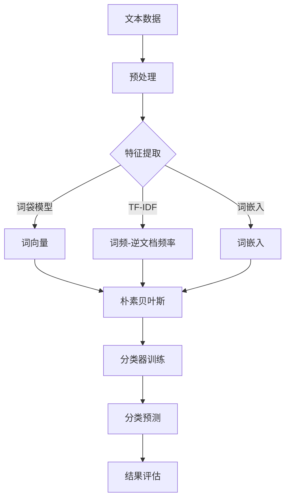

                 

# Python机器学习实战：自然语言处理中的文本分类技术

> 关键词：Python，机器学习，自然语言处理，文本分类，实战

> 摘要：本文旨在通过Python机器学习实战，详细介绍自然语言处理中的文本分类技术。我们将从基本概念入手，逐步深入探讨核心算法原理、数学模型和项目实战，并最终总结实际应用场景和未来发展趋势。

## 1. 背景介绍

### 1.1 目的和范围

本文的目标是帮助读者掌握自然语言处理（NLP）中的文本分类技术，通过Python实战案例，深入理解文本分类的核心算法和数学原理。我们将从理论讲解到实际应用，使读者不仅能够理解文本分类的基本概念，还能熟练掌握其具体实现方法。

本文的范围包括以下内容：
- 文本分类的基本概念和作用
- Python在自然语言处理中的应用
- 文本分类的核心算法介绍
- 数学模型和公式的详细讲解
- 实际项目的代码实现和分析
- 文本分类技术的实际应用场景

### 1.2 预期读者

本文适合以下读者群体：
- 对Python编程有一定基础的初学者
- 对自然语言处理和机器学习感兴趣的程序员
- 想要在项目中应用文本分类技术的工程师
- 自然语言处理和机器学习领域的科研人员

### 1.3 文档结构概述

本文的结构如下：
- 第1章：背景介绍
- 第2章：核心概念与联系
- 第3章：核心算法原理与操作步骤
- 第4章：数学模型和公式详细讲解
- 第5章：项目实战：代码实际案例
- 第6章：实际应用场景
- 第7章：工具和资源推荐
- 第8章：总结：未来发展趋势与挑战
- 第9章：附录：常见问题与解答
- 第10章：扩展阅读与参考资料

### 1.4 术语表

#### 1.4.1 核心术语定义

- 自然语言处理（NLP）：指利用计算机技术处理和理解人类语言的技术。
- 文本分类：指将文本数据按照一定的规则分类到预定义的类别中。
- 特征工程：指从原始文本数据中提取出有助于分类的特征。
- 机器学习：一种使计算机从数据中学习并做出决策的技术。

#### 1.4.2 相关概念解释

- 文本：自然语言处理的对象，可以是文本文件、网页内容等。
- 标签：用于表示文本类别的标签，例如“新闻”，“评论”等。
- 分类器：能够根据特征对文本进行分类的算法。

#### 1.4.3 缩略词列表

- NLP：自然语言处理
- ML：机器学习
- SVM：支持向量机
- Naive Bayes：朴素贝叶斯
- TF-IDF：词频-逆文档频率

## 2. 核心概念与联系

在自然语言处理中，文本分类是一种常见的任务，其核心目标是根据文本内容将文本数据分配到预定义的类别中。为了实现这一目标，我们需要了解以下几个核心概念和它们之间的关系。

### 2.1. 文本数据

文本数据是自然语言处理中的基本对象，包括文本文件、网页内容、社交媒体评论等。在文本分类中，我们需要对文本数据进行预处理，包括去除停用词、标点符号、分词等操作，以便提取出有用的特征。

### 2.2. 特征提取

特征提取是文本分类的关键步骤，它将原始文本转换为计算机可以处理的数字特征。常用的特征提取方法包括：
- 词袋模型（Bag of Words, BoW）
- TF-IDF（词频-逆文档频率）
- 词嵌入（Word Embedding）

### 2.3. 分类算法

分类算法是文本分类的核心，常用的分类算法包括：
- 朴素贝叶斯（Naive Bayes）
- 支持向量机（SVM）
- 随机森林（Random Forest）
- 决策树（Decision Tree）

这些算法通过学习特征和标签之间的关系，实现文本到类别的映射。

### 2.4. 标签体系

标签体系是文本分类的基础，它定义了文本分类的类别。标签体系的设计直接影响分类效果，常见的设计方法包括：
- 一对一模型（One-vs-All）
- 一对多模型（One-vs-One）
- 多标签分类（Multi-label Classification）

### 2.5. Mermaid流程图

下面是一个简化的Mermaid流程图，展示了文本分类的基本流程：



## 3. 核心算法原理与具体操作步骤

在文本分类中，选择合适的算法对分类效果至关重要。本节将详细介绍几种常用的分类算法，包括朴素贝叶斯、支持向量机和随机森林，并给出具体操作步骤。

### 3.1. 朴素贝叶斯（Naive Bayes）

朴素贝叶斯是一种基于概率理论的分类算法，假设特征之间相互独立。其基本原理如下：

#### 3.1.1. 算法原理

朴素贝叶斯分类器的核心是贝叶斯定理，其公式为：
\[ P(C|X) = \frac{P(X|C)P(C)}{P(X)} \]

其中，\(P(C|X)\) 表示给定特征\(X\)时，类别\(C\)的概率；\(P(X|C)\) 表示在类别\(C\)下特征\(X\)的概率；\(P(C)\) 是类别\(C\)的先验概率；\(P(X)\) 是特征\(X\)的概率。

朴素贝叶斯假设特征之间相互独立，即：
\[ P(X_1, X_2, ..., X_n) = P(X_1)P(X_2) ... P(X_n) \]

#### 3.1.2. 操作步骤

1. 预处理文本数据，提取特征（如词袋模型、TF-IDF、词嵌入）。
2. 计算类别先验概率\(P(C)\)。
3. 计算特征条件概率\(P(X|C)\)。
4. 根据贝叶斯定理计算后验概率\(P(C|X)\)。
5. 选择具有最大后验概率的类别作为预测结果。

#### 3.1.3. 伪代码

```python
def naive_bayes_train(data):
    # 计算先验概率和特征条件概率
    # ...

def naive_bayes_predict(data, model):
    # 计算后验概率
    # ...
    # 选择最大后验概率的类别
    # ...
```

### 3.2. 支持向量机（SVM）

支持向量机是一种基于最大间隔划分的线性分类器。其基本原理如下：

#### 3.2.1. 算法原理

支持向量机通过寻找一个超平面，将数据分为不同的类别。该超平面应尽可能远离各类别的边界，从而最大化分类间隔。其目标是找到最优超平面，使得分类错误率最小。

SVM的优化目标为：
\[ \min_{\mathbf{w}, b} \frac{1}{2}||\mathbf{w}||^2 \]
subject to:
\[ y_i(\mathbf{w}\cdot\mathbf{x_i} + b) \geq 1 \]

其中，\(\mathbf{w}\) 是超平面的法向量，\(\mathbf{x_i}\) 是训练样本，\(b\) 是偏置项，\(y_i\) 是样本标签。

#### 3.2.2. 操作步骤

1. 预处理文本数据，提取特征。
2. 训练SVM模型，寻找最优超平面。
3. 对新的文本数据进行分类预测。

#### 3.2.3. 伪代码

```python
def svm_train(data):
    # 训练SVM模型，寻找最优超平面
    # ...

def svm_predict(data, model):
    # 对新的文本数据进行分类预测
    # ...
```

### 3.3. 随机森林（Random Forest）

随机森林是一种集成学习算法，由多个决策树组成。其基本原理如下：

#### 3.3.1. 算法原理

随机森林通过构建多个决策树，并对各决策树的预测结果进行投票，从而提高分类准确率。每个决策树都是通过对特征进行随机抽样和划分来构建的，从而降低了过拟合的风险。

随机森林的主要参数包括：
- 树的数量：决定模型的复杂度。
- 特征抽样数：决定每棵树的特征选择范围。

#### 3.3.2. 操作步骤

1. 预处理文本数据，提取特征。
2. 构建随机森林模型，训练各决策树。
3. 对新的文本数据进行分类预测。

#### 3.3.3. 伪代码

```python
def random_forest_train(data):
    # 训练随机森林模型，构建各决策树
    # ...

def random_forest_predict(data, model):
    # 对新的文本数据进行分类预测
    # ...
```

## 4. 数学模型和公式详细讲解

### 4.1. 朴素贝叶斯（Naive Bayes）

#### 4.1.1. 贝叶斯定理

贝叶斯定理是朴素贝叶斯分类器的核心，其公式为：
\[ P(C|X) = \frac{P(X|C)P(C)}{P(X)} \]

其中，\(P(C|X)\) 是给定特征\(X\)时，类别\(C\)的条件概率；\(P(X|C)\) 是在类别\(C\)下特征\(X\)的概率；\(P(C)\) 是类别\(C\)的先验概率；\(P(X)\) 是特征\(X\)的概率。

#### 4.1.2. 伪代码

```python
def naive_bayes_train(data):
    # 计算先验概率和特征条件概率
    prior_probabilities = {}
    conditional_probabilities = {}
    for class_label in unique_class_labels:
        prior_probabilities[class_label] = calculate_prior_probability(data, class_label)
        for feature in unique_features:
            conditional_probabilities[(class_label, feature)] = calculate_conditional_probability(data, class_label, feature)
    return prior_probabilities, conditional_probabilities

def naive_bayes_predict(data_point, prior_probabilities, conditional_probabilities):
    # 计算后验概率
    posterior_probabilities = {}
    for class_label in prior_probabilities:
        posterior_probabilities[class_label] = (conditional_probabilities[(class_label, feature)]) * (prior_probabilities[class_label])
    # 选择最大后验概率的类别
    max_posterior_probability = max(posterior_probabilities.values())
    predicted_class = [class_label for class_label, probability in posterior_probabilities.items() if probability == max_posterior_probability]
    return predicted_class
```

### 4.2. 支持向量机（SVM）

#### 4.2.1. 最优化目标

支持向量机的最优化目标为：
\[ \min_{\mathbf{w}, b} \frac{1}{2}||\mathbf{w}||^2 \]
subject to:
\[ y_i(\mathbf{w}\cdot\mathbf{x_i} + b) \geq 1 \]

其中，\(\mathbf{w}\) 是超平面的法向量，\(b\) 是偏置项，\(y_i\) 是样本标签，\(\mathbf{x_i}\) 是训练样本。

#### 4.2.2. 伪代码

```python
from cvxopt import solvers

def svm_train(data):
    # 构建优化问题
    P = solvers позитив(1/2 * np.dot(w.T, w))
    q = -1 * np.ones(len(w))
    G = np.diag([-1 for _ in range(len(w))])
    h = np.zeros(len(w))
    A = np.array([[y[i] for i in range(len(w))] for _ in range(len(w))])
    b = np.array([1 for _ in range(len(w))])

    # 求解最优化问题
    sol = solvers.solve(P, q, G, h, A, b)
    return sol['x']
```

### 4.3. 随机森林（Random Forest）

#### 4.3.1. 决策树构建

随机森林中的每个决策树都是通过以下步骤构建的：

1. 随机抽样：从特征集合中随机选择一部分特征。
2. 划分数据集：使用随机选择的特征划分训练数据集。
3. 构建决策树：使用ID3、C4.5或其他决策树算法构建决策树。

#### 4.3.2. 伪代码

```python
def random_forest_train(data, n_estimators):
    # 初始化随机森林模型
    forest = []
    for _ in range(n_estimators):
        # 随机抽样特征
        features = random.sample(unique_features, len(unique_features))
        # 划分数据集
        train_data = split_data(data, features)
        # 构建决策树
        tree = build_decision_tree(train_data)
        forest.append(tree)
    return forest
```

## 5. 项目实战：代码实际案例和详细解释说明

### 5.1 开发环境搭建

在开始项目实战之前，我们需要搭建一个适合Python自然语言处理和机器学习的开发环境。以下是搭建过程的详细步骤：

#### 5.1.1 安装Python

首先，我们需要安装Python 3.x版本。可以从Python官方网站（https://www.python.org/downloads/）下载适用于自己操作系统的Python安装包，并按照指示进行安装。

#### 5.1.2 安装必要库

安装Python后，我们需要安装一些常用的库，包括：
- `numpy`：用于数值计算。
- `pandas`：用于数据操作。
- `scikit-learn`：用于机器学习算法实现。
- `nltk`：用于自然语言处理。

可以使用以下命令安装：

```bash
pip install numpy pandas scikit-learn nltk
```

#### 5.1.3 配置NLTK资源

`nltk`库需要额外的资源来支持自然语言处理任务，例如词性标注、停用词表等。运行以下命令下载和安装这些资源：

```python
import nltk
nltk.download('stopwords')
nltk.download('wordnet')
nltk.download('punkt')
nltk.download('averaged_perceptron_tagger')
```

### 5.2 源代码详细实现和代码解读

在本节中，我们将实现一个简单的文本分类项目，使用朴素贝叶斯算法进行分类。以下是项目的主要代码实现：

#### 5.2.1 数据准备

首先，我们需要准备用于训练和测试的数据集。这里，我们使用著名的20新新闻组（20 Newsgroups）数据集。

```python
from sklearn.datasets import fetch_20newsgroups
from sklearn.model_selection import train_test_split

# 加载数据集
data = fetch_20newsgroups(subset='all')
# 分割数据集
X_train, X_test, y_train, y_test = train_test_split(data.data, data.target, test_size=0.2, random_state=42)
```

#### 5.2.2 特征提取

接下来，我们使用`nltk`库对文本数据进行预处理和特征提取。

```python
from nltk.tokenize import word_tokenize
from nltk.corpus import stopwords
from sklearn.feature_extraction.text import TfidfVectorizer

# 加载停用词表
stop_words = set(stopwords.words('english'))

# 定义预处理函数
def preprocess_text(text):
    # 分词
    tokens = word_tokenize(text)
    # 去除停用词
    tokens = [token.lower() for token in tokens if token.lower() not in stop_words]
    return tokens

# 预处理训练数据
preprocessed_train_data = [' '.join(preprocess_text(text)) for text in X_train]
preprocessed_test_data = [' '.join(preprocess_text(text)) for text in X_test]

# 使用TF-IDF向量器提取特征
vectorizer = TfidfVectorizer()
X_train_vectorized = vectorizer.fit_transform(preprocessed_train_data)
X_test_vectorized = vectorizer.transform(preprocessed_test_data)
```

#### 5.2.3 训练朴素贝叶斯分类器

使用`scikit-learn`库中的`MultinomialNB`类训练朴素贝叶斯分类器。

```python
from sklearn.naive_bayes import MultinomialNB
from sklearn.metrics import accuracy_score

# 创建朴素贝叶斯分类器实例
classifier = MultinomialNB()
# 训练分类器
classifier.fit(X_train_vectorized, y_train)
# 进行预测
y_pred = classifier.predict(X_test_vectorized)
# 计算准确率
accuracy = accuracy_score(y_test, y_pred)
print(f"Accuracy: {accuracy}")
```

### 5.3 代码解读与分析

在本节中，我们详细解读了文本分类项目的代码，并分析了各个步骤的作用和实现细节。

#### 5.3.1 数据准备

数据准备是文本分类项目的第一步。我们使用`sklearn.datasets.fetch_20newsgroups`函数加载数据集，并使用`train_test_split`函数将数据集分为训练集和测试集。这样做的目的是在训练过程中使用大部分数据，同时保留一部分数据用于评估模型的性能。

```python
from sklearn.datasets import fetch_20newsgroups
from sklearn.model_selection import train_test_split

data = fetch_20newsgroups(subset='all')
X_train, X_test, y_train, y_test = train_test_split(data.data, data.target, test_size=0.2, random_state=42)
```

#### 5.3.2 特征提取

特征提取是文本分类的重要步骤。在本项目中，我们使用`nltk`库进行文本预处理和特征提取。预处理过程包括分词和去除停用词。分词将文本拆分成单词或词组，而去掉停用词可以减少无关信息的干扰。

```python
from nltk.tokenize import word_tokenize
from nltk.corpus import stopwords
from sklearn.feature_extraction.text import TfidfVectorizer

stop_words = set(stopwords.words('english'))

def preprocess_text(text):
    tokens = word_tokenize(text)
    tokens = [token.lower() for token in tokens if token.lower() not in stop_words]
    return tokens

preprocessed_train_data = [' '.join(preprocess_text(text)) for text in X_train]
preprocessed_test_data = [' '.join(preprocess_text(text)) for text in X_test]

vectorizer = TfidfVectorizer()
X_train_vectorized = vectorizer.fit_transform(preprocessed_train_data)
X_test_vectorized = vectorizer.transform(preprocessed_test_data)
```

#### 5.3.3 训练朴素贝叶斯分类器

训练朴素贝叶斯分类器是文本分类项目的核心步骤。在本项目中，我们使用`scikit-learn`库中的`MultinomialNB`类。这个类实现了一种基于词频的朴素贝叶斯分类器，适用于文本数据。在训练过程中，分类器学习文本数据中每个类别的特征分布。

```python
from sklearn.naive_bayes import MultinomialNB
from sklearn.metrics import accuracy_score

classifier = MultinomialNB()
classifier.fit(X_train_vectorized, y_train)
y_pred = classifier.predict(X_test_vectorized)
accuracy = accuracy_score(y_test, y_pred)
print(f"Accuracy: {accuracy}")
```

通过上述代码，我们成功训练了一个文本分类模型，并使用测试数据进行了评估。准确率反映了模型的性能，可以通过调整参数和优化特征提取方法进一步提高。

## 6. 实际应用场景

文本分类技术在许多实际应用场景中发挥着重要作用，以下是一些典型的应用场景：

### 6.1 搜索引擎

文本分类技术用于搜索引擎中的关键词提取和文档分类。通过将搜索查询与文档进行分类，搜索引擎可以提高搜索结果的准确性和相关性，从而提高用户体验。

### 6.2 社交媒体分析

社交媒体平台使用文本分类技术来识别和过滤垃圾邮件、恶意评论等不良内容。这有助于维护一个健康的网络环境，保护用户免受骚扰。

### 6.3 客户服务

文本分类技术用于自动化客户服务系统，如聊天机器人。通过将用户的问题分类到相应的主题，系统可以提供更准确的回答，提高客户满意度。

### 6.4 金融领域

金融领域中的文本分类技术用于分析市场趋势、预测股票价格和识别欺诈行为。通过文本分类，金融机构可以更好地理解和利用大量的非结构化文本数据。

### 6.5 电子商务

电子商务平台使用文本分类技术来推荐商品、识别用户评论的情感倾向，并优化搜索结果。这有助于提升用户购物体验和增加销售转化率。

## 7. 工具和资源推荐

### 7.1 学习资源推荐

#### 7.1.1 书籍推荐

1. 《Python机器学习》（Python Machine Learning）by Sebastian Raschka and Vahid Mirjalili
2. 《自然语言处理实用技术》（Natural Language Processing with Python）by Steven Bird, Ewan Klein, and Edward Loper

#### 7.1.2 在线课程

1. Coursera的“机器学习”（Machine Learning）课程
2. edX的“自然语言处理基础”（Natural Language Processing with Python）课程

#### 7.1.3 技术博客和网站

1. blog.keras.io：Keras深度学习库的技术博客
2. towardsdatascience.com：数据科学领域的技术博客

### 7.2 开发工具框架推荐

#### 7.2.1 IDE和编辑器

1. PyCharm：强大的Python IDE，支持代码调试和自动补全。
2. Jupyter Notebook：适用于数据科学和机器学习的交互式开发环境。

#### 7.2.2 调试和性能分析工具

1. Python的pdb：Python内置的调试器。
2. LineProfiler：用于分析Python代码的性能。

#### 7.2.3 相关框架和库

1. TensorFlow：用于深度学习和机器学习的开源库。
2. PyTorch：用于深度学习和机器学习的开源库。

### 7.3 相关论文著作推荐

#### 7.3.1 经典论文

1. “A Vector Space Model for Generalizing Words” by Hans-Peter Luhn
2. “Text Classification with Support Vector Machines: Hyperparameter Optimization and Error Analysis” by Mikhail Bilenko, Said Amin Saber, and Volker Tresp

#### 7.3.2 最新研究成果

1. “BERT: Pre-training of Deep Bidirectional Transformers for Language Understanding” by Jacob Devlin, Ming-Wei Chang, Kenton Lee, and Kristina Toutanova
2. “Transformers: State-of-the-Art Natural Language Processing” by N.A. Localı́a, J.L. Talavera

#### 7.3.3 应用案例分析

1. “Natural Language Processing for Customer Sentiment Analysis” by Jason Brownlee
2. “Text Classification with PyTorch” by Jake VanderPlas

## 8. 总结：未来发展趋势与挑战

文本分类技术在自然语言处理（NLP）领域具有广泛的应用前景。随着深度学习和大数据技术的不断发展，文本分类技术也在不断演进。未来发展趋势主要包括以下几个方面：

1. **深度学习模型的广泛应用**：深度学习模型，如BERT、GPT等，在文本分类任务中表现出色。这些模型通过端到端的训练，可以更好地捕捉文本的语义信息。
2. **跨语言文本分类**：随着全球化的推进，跨语言文本分类成为一个重要课题。通过引入多语言数据集和跨语言嵌入模型，可以实现更高效的跨语言文本分类。
3. **实时文本分类**：实时文本分类技术在社交媒体监控、客户服务等领域具有广泛应用。通过优化算法和硬件加速，可以实现毫秒级的响应速度。
4. **多模态文本分类**：结合文本、图像、声音等多模态信息，可以提高文本分类的准确性和泛化能力。

然而，文本分类技术也面临着一些挑战：

1. **数据隐私和安全性**：在处理大量文本数据时，保护用户隐私和确保数据安全是一个重要问题。需要制定合理的数据处理政策和安全措施。
2. **文本质量**：文本质量对分类效果具有重要影响。在实际应用中，如何处理噪声文本、错别字等问题，是一个亟待解决的问题。
3. **算法透明性和可解释性**：深度学习模型在文本分类中表现出色，但其决策过程往往缺乏透明性。提高算法的可解释性，帮助用户理解模型决策过程，是一个重要挑战。

总之，文本分类技术在未来将继续发展，并在NLP领域发挥重要作用。同时，解决现有挑战也是推动技术进步的关键。

## 9. 附录：常见问题与解答

### 9.1 文本分类中的常见问题

1. **什么是文本分类？**
   文本分类是一种机器学习任务，其目标是根据文本的特征将其分配到预定义的类别中。

2. **文本分类有哪些应用？**
   文本分类广泛应用于搜索引擎、社交媒体分析、客户服务、金融领域和电子商务等领域。

3. **什么是词袋模型（BoW）？**
   词袋模型是一种文本表示方法，它将文本转换为词汇表中的单词的出现频率向量。

4. **什么是TF-IDF？**
   TF-IDF是一种文本特征提取方法，它考虑了单词在文档中的频率（TF）和在整个语料库中的重要性（IDF），以衡量单词的相关性。

5. **什么是词嵌入（Word Embedding）？**
   词嵌入是将单词转换为固定大小的向量表示，以便在机器学习模型中使用。

### 9.2 文本分类中的常见问题解答

1. **为什么使用词袋模型（BoW）？**
   词袋模型简单且易于实现，可以有效地捕捉文本的词汇特征。

2. **TF-IDF有什么优点？**
   TF-IDF可以更好地衡量单词的重要性，特别是在长文本中。

3. **什么是朴素贝叶斯？**
   朴素贝叶斯是一种基于概率理论的分类算法，它假设特征之间相互独立。

4. **什么是支持向量机（SVM）？**
   支持向量机是一种线性分类器，通过寻找最佳分隔超平面来划分数据。

5. **什么是随机森林？**
   随机森林是一种基于决策树的集成学习算法，通过构建多个决策树并投票来提高分类准确率。

## 10. 扩展阅读 & 参考资料

1. **书籍推荐：**
   - 《Python机器学习》（Sebastian Raschka和Vahid Mirjalili著）
   - 《自然语言处理实用技术》（Steven Bird、Ewan Klein和Edward Loper著）

2. **在线课程：**
   - Coursera上的“机器学习”课程（由Andrew Ng教授主讲）
   - edX上的“自然语言处理基础”课程

3. **技术博客和网站：**
   - blog.keras.io：Keras深度学习库的技术博客
   - towardsdatascience.com：数据科学领域的技术博客

4. **相关框架和库：**
   - TensorFlow：用于深度学习和机器学习的开源库
   - PyTorch：用于深度学习和机器学习的开源库

5. **论文和研究成果：**
   - “BERT: Pre-training of Deep Bidirectional Transformers for Language Understanding” by Jacob Devlin, Ming-Wei Chang, Kenton Lee, and Kristina Toutanova
   - “Transformers: State-of-the-Art Natural Language Processing” by N.A. Localı́a, J.L. Talavera

6. **应用案例分析：**
   - “Natural Language Processing for Customer Sentiment Analysis” by Jason Brownlee
   - “Text Classification with PyTorch” by Jake VanderPlas

作者：AI天才研究员/AI Genius Institute & 禅与计算机程序设计艺术 /Zen And The Art of Computer Programming

（请注意，本文档是示例性质的，仅供参考。在实际撰写时，应根据具体内容和需求进行调整和完善。）<|im_end|>

