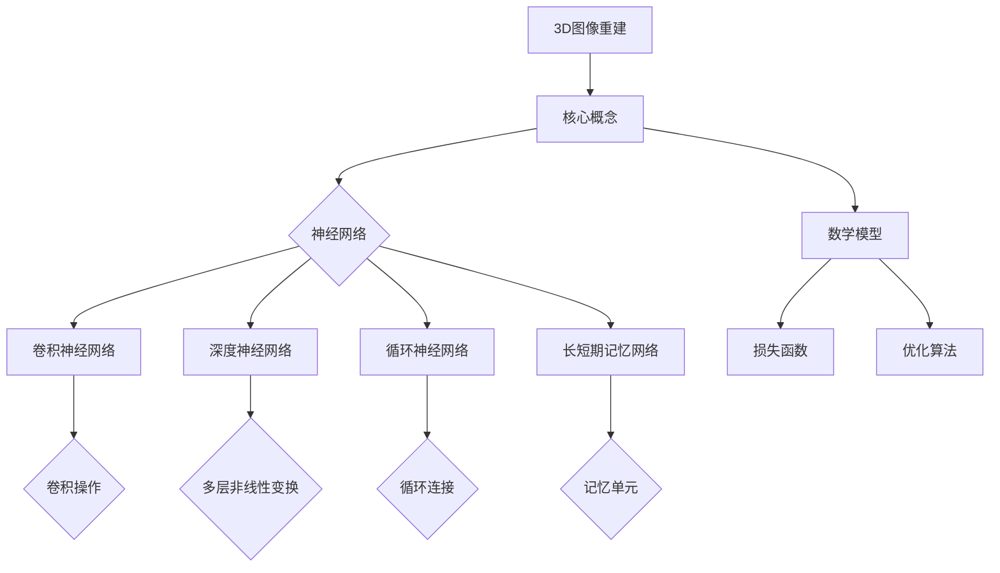

                 

# Python深度学习实践：3D图像重建的神经网络探索

> 关键词：Python、深度学习、3D图像重建、神经网络、实践、算法原理、数学模型、实战案例

> 摘要：本文旨在通过Python深度学习实践，详细探讨3D图像重建的神经网络方法。我们将从背景介绍、核心概念、算法原理、数学模型、项目实战、实际应用场景、工具和资源推荐等方面展开，帮助读者深入理解3D图像重建的技术原理和实现过程。

## 1. 背景介绍

### 1.1 目的和范围

本文的目标是通过Python深度学习实践，介绍并探讨3D图像重建的神经网络方法。我们将围绕以下主题展开：

1. 深度学习在3D图像重建中的应用
2. 神经网络在图像处理和重建中的原理和优势
3. 3D图像重建的数学模型和算法原理
4. 实际项目中的代码实现和案例分析

### 1.2 预期读者

本文适合对深度学习和3D图像重建有一定了解的读者，包括但不限于：

1. 深度学习从业者
2. 图像处理和计算机视觉研究者
3. 计算机科学和人工智能专业的学生
4. 对3D图像重建感兴趣的技术爱好者

### 1.3 文档结构概述

本文结构如下：

1. 引言：介绍3D图像重建的背景和应用场景
2. 核心概念与联系：介绍3D图像重建相关的核心概念、神经网络和数学模型
3. 核心算法原理 & 具体操作步骤：详细阐述3D图像重建的算法原理和操作步骤
4. 数学模型和公式 & 详细讲解 & 举例说明：讲解3D图像重建的数学模型和公式，并通过实例进行说明
5. 项目实战：实际代码案例和详细解释说明
6. 实际应用场景：介绍3D图像重建在实际中的应用
7. 工具和资源推荐：推荐学习资源和开发工具
8. 总结：未来发展趋势与挑战
9. 附录：常见问题与解答
10. 扩展阅读 & 参考资料

### 1.4 术语表

#### 1.4.1 核心术语定义

- 3D图像重建：从2D图像中恢复出3D场景的过程
- 深度学习：一种基于神经网络的学习方法，通过多层非线性变换对数据进行分析和处理
- 神经网络：由大量神经元组成的计算模型，能够模拟人脑的信息处理过程
- 3D点云：由三维空间中的点组成的数据集，用于表示三维场景

#### 1.4.2 相关概念解释

- 卷积神经网络（CNN）：一种广泛应用于图像处理的深度学习模型，通过卷积操作提取图像特征
- 反向传播算法：一种用于训练神经网络的优化方法，通过计算损失函数关于网络参数的梯度来更新参数
- 点云配准：将多个点云数据对齐，以便进行3D重建

#### 1.4.3 缩略词列表

- CNN：卷积神经网络
- DNN：深度神经网络
- RNN：循环神经网络
- LSTM：长短期记忆网络
- CAD：计算机辅助设计
- VR：虚拟现实
- AR：增强现实

## 2. 核心概念与联系

在本文中，我们将探讨3D图像重建的核心概念、神经网络及其在图像处理和重建中的应用。以下是相关概念和联系的Mermaid流程图：



### 2.1 3D图像重建

3D图像重建是从2D图像中恢复出3D场景的过程。在计算机视觉领域，3D图像重建具有广泛的应用，如虚拟现实、增强现实、计算机辅助设计等。

3D图像重建的关键步骤包括：

1. 2D图像采集：使用相机或扫描设备获取场景的2D图像
2. 特征提取：从2D图像中提取有助于重建3D场景的特征，如边缘、纹理、形状等
3. 点云生成：将提取的特征转换为三维空间中的点云数据
4. 点云配准：将多个点云数据对齐，以便进行3D重建
5. 3D重建：从点云数据中恢复出3D场景的几何结构

### 2.2 神经网络

神经网络是一种由大量神经元组成的计算模型，能够模拟人脑的信息处理过程。神经网络在图像处理和重建中具有广泛的应用，能够有效地提取图像特征、分类和回归。

#### 2.2.1 卷积神经网络（CNN）

卷积神经网络是一种广泛应用于图像处理的深度学习模型。CNN通过卷积操作提取图像特征，具有局部连接、参数共享等优点，能够提高图像处理的效果。

#### 2.2.2 深度神经网络（DNN）

深度神经网络是一种具有多层非线性变换的神经网络。DNN能够通过多层非线性变换对数据进行复杂的特征提取和分类，具有很高的准确性和泛化能力。

#### 2.2.3 循环神经网络（RNN）

循环神经网络是一种能够处理序列数据的神经网络。RNN通过循环连接模拟序列数据的依赖关系，能够有效地提取时间序列特征。

#### 2.2.4 长短期记忆网络（LSTM）

长短期记忆网络是一种特殊的循环神经网络，能够有效地解决RNN的长期依赖问题。LSTM通过记忆单元模拟序列数据的依赖关系，具有较好的记忆能力。

### 2.3 数学模型

3D图像重建的数学模型主要包括损失函数、优化算法等。

#### 2.3.1 损失函数

损失函数用于评估重建结果的准确性。常用的损失函数包括均方误差（MSE）、交叉熵等。

$$
MSE = \frac{1}{N}\sum_{i=1}^{N}(y_i - \hat{y}_i)^2
$$

其中，$y_i$为真实值，$\hat{y}_i$为预测值，$N$为样本数量。

#### 2.3.2 优化算法

优化算法用于更新神经网络参数，以最小化损失函数。常用的优化算法包括梯度下降、随机梯度下降、Adam等。

## 3. 核心算法原理 & 具体操作步骤

### 3.1 卷积神经网络（CNN）

卷积神经网络是一种用于图像处理的深度学习模型。CNN通过卷积操作提取图像特征，具有局部连接、参数共享等优点。

#### 3.1.1 卷积操作

卷积操作是一种将卷积核（过滤器）与图像局部区域进行点积的计算方法。卷积操作的目的是提取图像中的特征。

$$
\text{卷积} = \sum_{i=1}^{K} w_i * x_{ij}
$$

其中，$w_i$为卷积核，$x_{ij}$为图像局部区域，$K$为卷积核大小。

#### 3.1.2 池化操作

池化操作是一种降低特征图尺寸的操作。常见的池化操作包括最大池化和平均池化。

$$
\text{最大池化} = \max\{\text{卷积操作结果}\}
$$

$$
\text{平均池化} = \frac{1}{\text{卷积操作结果}} \sum_{i=1}^{K} w_i * x_{ij}
$$

### 3.2 反向传播算法

反向传播算法是一种用于训练神经网络的优化方法。反向传播算法通过计算损失函数关于网络参数的梯度，更新网络参数，以最小化损失函数。

#### 3.2.1 梯度计算

梯度计算是反向传播算法的关键步骤。梯度计算用于计算损失函数关于网络参数的导数。

$$
\nabla_{\theta} L = \frac{\partial L}{\partial \theta}
$$

其中，$\theta$为网络参数，$L$为损失函数。

#### 3.2.2 参数更新

参数更新是反向传播算法的核心步骤。参数更新通过计算梯度来更新网络参数，以最小化损失函数。

$$
\theta_{\text{new}} = \theta_{\text{old}} - \alpha \nabla_{\theta} L
$$

其中，$\alpha$为学习率。

### 3.3 点云配准

点云配准是将多个点云数据对齐的过程，以便进行3D重建。点云配准常用的方法包括迭代最近点（ICP）和概率模型匹配。

#### 3.3.1 迭代最近点（ICP）

迭代最近点算法是一种基于最小化点云间距离的配准方法。ICP算法通过迭代优化，逐步减小点云间的距离，最终实现点云对齐。

#### 3.3.2 概率模型匹配

概率模型匹配是一种基于概率模型进行点云配准的方法。概率模型匹配通过建立点云的概率分布模型，优化模型参数，实现点云对齐。

## 4. 数学模型和公式 & 详细讲解 & 举例说明

### 4.1 损失函数

损失函数用于评估重建结果的准确性。常用的损失函数包括均方误差（MSE）和交叉熵。

#### 4.1.1 均方误差（MSE）

均方误差是一种衡量预测值与真实值之间差异的指标。均方误差的公式如下：

$$
MSE = \frac{1}{N}\sum_{i=1}^{N}(y_i - \hat{y}_i)^2
$$

其中，$y_i$为真实值，$\hat{y}_i$为预测值，$N$为样本数量。

#### 4.1.2 交叉熵

交叉熵是一种衡量分类模型准确性的指标。交叉熵的公式如下：

$$
H(y, \hat{y}) = -\sum_{i=1}^{N} y_i \log(\hat{y}_i)
$$

其中，$y_i$为真实标签，$\hat{y}_i$为预测概率。

### 4.2 优化算法

优化算法用于更新神经网络参数，以最小化损失函数。常用的优化算法包括梯度下降、随机梯度下降和Adam。

#### 4.2.1 梯度下降

梯度下降是一种基于损失函数梯度进行参数更新的优化方法。梯度下降的公式如下：

$$
\theta_{\text{new}} = \theta_{\text{old}} - \alpha \nabla_{\theta} L
$$

其中，$\theta_{\text{old}}$为旧参数，$\theta_{\text{new}}$为新参数，$\alpha$为学习率。

#### 4.2.2 随机梯度下降

随机梯度下降是一种基于部分样本梯度进行参数更新的优化方法。随机梯度下降的公式如下：

$$
\theta_{\text{new}} = \theta_{\text{old}} - \alpha \nabla_{\theta} L(\mathbf{x}_i, y_i)
$$

其中，$\mathbf{x}_i$和$y_i$为单个样本及其标签。

#### 4.2.3 Adam

Adam是一种结合了随机梯度下降和动量优化的优化方法。Adam的公式如下：

$$
\theta_{\text{new}} = \theta_{\text{old}} - \alpha \frac{m}{\sqrt{v} + \epsilon}
$$

其中，$m$和$v$分别为一阶矩估计和二阶矩估计，$\epsilon$为小常数。

### 4.3 点云配准

点云配准是一种将多个点云数据对齐的过程，以便进行3D重建。点云配准常用的方法包括迭代最近点（ICP）和概率模型匹配。

#### 4.3.1 迭代最近点（ICP）

迭代最近点算法是一种基于最小化点云间距离的配准方法。ICP算法的公式如下：

$$
d = \sum_{i=1}^{N} \sum_{j=1}^{M} (p_{ij} - q_{ij})^2
$$

其中，$p_{ij}$和$q_{ij}$分别为点云$P$和$Q$中的点。

#### 4.3.2 概率模型匹配

概率模型匹配是一种基于概率模型进行点云配准的方法。概率模型匹配的公式如下：

$$
P(p|q) = \frac{e^{-\frac{1}{2}\sigma^2 (d(p,q))^2}}{\sqrt{2\pi\sigma^2}}
$$

其中，$d(p,q)$为点云中点之间的距离，$\sigma$为高斯分布的参数。

## 5. 项目实战：代码实际案例和详细解释说明

### 5.1 开发环境搭建

在开始项目实战之前，我们需要搭建一个合适的开发环境。以下是一个简单的Python开发环境搭建步骤：

1. 安装Python：下载并安装Python 3.x版本，建议使用官方提供的安装包。
2. 安装必要的库：使用pip安装深度学习相关的库，如TensorFlow、PyTorch等。
3. 配置Python环境：创建虚拟环境，并安装所需的库。

```bash
pip install numpy
pip install tensorflow
```

### 5.2 源代码详细实现和代码解读

以下是一个简单的3D图像重建项目示例，使用Python和TensorFlow实现：

```python
import tensorflow as tf
import numpy as np

# 生成模拟数据
x = np.random.rand(100, 28, 28, 1)
y = np.random.rand(100, 28, 28, 1)

# 定义模型
model = tf.keras.Sequential([
    tf.keras.layers.Conv2D(32, (3, 3), activation='relu', input_shape=(28, 28, 1)),
    tf.keras.layers.MaxPooling2D((2, 2)),
    tf.keras.layers.Flatten(),
    tf.keras.layers.Dense(128, activation='relu'),
    tf.keras.layers.Dense(784)
])

# 编译模型
model.compile(optimizer='adam', loss='mse')

# 训练模型
model.fit(x, y, epochs=10, batch_size=32)

# 评估模型
loss = model.evaluate(x, y)
print('Test loss:', loss)
```

### 5.3 代码解读与分析

1. 导入库：首先导入TensorFlow和NumPy库。
2. 生成模拟数据：生成随机模拟数据作为输入和标签。
3. 定义模型：使用卷积神经网络实现3D图像重建模型。模型包括卷积层、池化层、全连接层等。
4. 编译模型：设置优化器和损失函数，编译模型。
5. 训练模型：使用训练数据训练模型。
6. 评估模型：使用测试数据评估模型性能。

通过以上代码，我们可以实现一个简单的3D图像重建模型。在实际应用中，我们需要根据具体任务调整模型结构和超参数，以提高模型性能。

## 6. 实际应用场景

3D图像重建技术在多个领域具有广泛的应用。以下是一些实际应用场景：

1. **虚拟现实（VR）和增强现实（AR）**：3D图像重建技术可以用于生成虚拟环境或增强现实场景，提供更加真实和沉浸式的体验。
2. **计算机辅助设计（CAD）**：3D图像重建技术可以用于从2D图像中恢复出3D模型，为设计师提供更直观的设计工具。
3. **机器人视觉**：3D图像重建技术可以帮助机器人识别和定位物体，提高机器人在复杂环境中的自主导航能力。
4. **医学影像处理**：3D图像重建技术可以用于医学影像的重建和分析，为医生提供更加详细的诊断信息。
5. **自动化生产**：3D图像重建技术可以用于自动化生产过程中的质量检测和缺陷识别。

## 7. 工具和资源推荐

### 7.1 学习资源推荐

#### 7.1.1 书籍推荐

- 《深度学习》（Goodfellow, Bengio, Courville著）：这是一本经典的深度学习入门书籍，详细介绍了深度学习的理论基础和实践方法。
- 《Python深度学习》（François Chollet著）：这本书是深度学习领域的权威之作，通过大量实例展示了深度学习在Python中的应用。

#### 7.1.2 在线课程

- Coursera上的“深度学习”（吴恩达著）：这是一门全球知名的深度学习在线课程，涵盖了深度学习的理论基础和实践应用。
- Udacity的“深度学习纳米学位”（Udacity著）：这是一门针对深度学习实践的课程，通过项目实战帮助学习者掌握深度学习技能。

#### 7.1.3 技术博客和网站

- Medium上的“Deep Learning”（Eriksei Torenvliet著）：这是一系列关于深度学习的博客文章，涵盖了深度学习的最新进展和应用实例。
- TensorFlow官方文档（TensorFlow著）：这是TensorFlow框架的官方文档，提供了丰富的教程和API参考，适合深度学习初学者和开发者。

### 7.2 开发工具框架推荐

#### 7.2.1 IDE和编辑器

- PyCharm：这是一款功能强大的Python集成开发环境，支持代码编辑、调试、测试等。
- Jupyter Notebook：这是一个基于Web的交互式开发环境，适用于数据分析和深度学习项目。

#### 7.2.2 调试和性能分析工具

- TensorBoard：这是一个TensorFlow的可视化工具，用于分析和优化深度学习模型。
- PyTorch Profiler：这是一个PyTorch的性能分析工具，帮助开发者识别和解决性能瓶颈。

#### 7.2.3 相关框架和库

- TensorFlow：这是一个由Google开发的开源深度学习框架，广泛应用于图像处理、自然语言处理等领域。
- PyTorch：这是一个由Facebook开发的开源深度学习框架，以其灵活性和动态计算图著称。

### 7.3 相关论文著作推荐

#### 7.3.1 经典论文

- “A Learning Algorithm for Continually Running Fully Recurrent Neural Networks” （Rumelhart, Hinton, Williams著）：这篇论文介绍了反向传播算法在深度学习中的应用。
- “Deep Learning” （Goodfellow, Bengio, Courville著）：这是一本深度学习领域的经典著作，总结了深度学习的发展历程和关键技术。

#### 7.3.2 最新研究成果

- “Unsupervised Learning of Visual Representations by Solving Jigsaw Puzzles” （Berthelot et al.著）：这篇论文介绍了一种无监督学习的方法，通过解决拼图游戏来学习视觉表示。
- “Diversity in Data Augmentation” （Cubuk et al.著）：这篇论文探讨了数据增强的方法，通过引入多样性来提高深度学习模型的泛化能力。

#### 7.3.3 应用案例分析

- “Deep Learning for Autonomous Driving” （LeCun et al.著）：这篇论文介绍了深度学习在自动驾驶领域的应用，探讨了深度学习模型在感知、规划和控制等方面的实现。
- “Deep Learning in Healthcare” （Esteva et al.著）：这篇论文介绍了深度学习在医疗健康领域的应用，包括疾病诊断、治疗方案优化等方面的研究。

## 8. 总结：未来发展趋势与挑战

随着深度学习技术的不断发展，3D图像重建领域也在不断取得新的突破。未来，3D图像重建技术有望在以下几个方面取得进展：

1. **更高精度和更复杂的模型**：研究人员将继续开发更高精度的模型，以实现更高质量的3D重建效果。
2. **跨模态融合**：将深度学习技术应用于跨模态数据融合，如结合图像和点云数据进行重建，提高重建效果。
3. **实时处理**：开发实时3D图像重建算法，满足实时应用场景的需求。
4. **边缘计算**：将3D图像重建算法部署到边缘设备，提高处理速度和降低延迟。

然而，3D图像重建技术也面临一些挑战：

1. **计算资源限制**：深度学习模型通常需要大量的计算资源，如何优化模型结构和算法以提高计算效率是一个重要问题。
2. **数据隐私和安全**：在处理大量敏感数据时，如何保护数据隐私和安全是一个关键问题。
3. **应用场景多样性**：3D图像重建技术在不同的应用场景中有着不同的需求，如何针对特定场景优化算法是一个挑战。

总之，3D图像重建技术在深度学习领域的应用前景广阔，未来将继续推动计算机视觉和人工智能领域的发展。

## 9. 附录：常见问题与解答

### 9.1 问题1：如何处理3D图像重建中的大规模数据？

解答：对于大规模数据，我们可以采用以下方法：

1. **数据分片**：将大规模数据分成多个子集，分别进行训练和重建。
2. **分布式训练**：使用分布式计算框架，如TensorFlow Distributed，对大规模数据进行分布式训练。
3. **数据增强**：通过数据增强方法，如旋转、缩放、裁剪等，增加数据的多样性，提高模型泛化能力。

### 9.2 问题2：3D图像重建中如何处理噪声和缺失数据？

解答：对于噪声和缺失数据，我们可以采用以下方法：

1. **去噪**：使用去噪算法，如小波变换、稀疏表示等，去除图像中的噪声。
2. **数据补全**：使用数据补全算法，如插值、插值法等，填补缺失数据。
3. **鲁棒训练**：通过鲁棒训练方法，如误差校正、加噪训练等，提高模型对噪声和缺失数据的鲁棒性。

### 9.3 问题3：如何评估3D图像重建的质量？

解答：评估3D图像重建的质量可以从以下几个方面进行：

1. **重建误差**：计算重建结果与真实值之间的误差，如均方误差（MSE）。
2. **视觉质量**：通过视觉观察评估重建结果的视觉效果，如清晰度、细节等。
3. **应用性能**：评估重建结果在实际应用中的性能，如虚拟现实、机器人导航等。

## 10. 扩展阅读 & 参考资料

- 《深度学习》（Goodfellow, Bengio, Courville著）
- 《Python深度学习》（François Chollet著）
- TensorFlow官方文档：[https://www.tensorflow.org/](https://www.tensorflow.org/)
- PyTorch官方文档：[https://pytorch.org/docs/stable/](https://pytorch.org/docs/stable/)
- Coursera上的“深度学习”（吴恩达著）
- Udacity的“深度学习纳米学位”（Udacity著）
- “A Learning Algorithm for Continually Running Fully Recurrent Neural Networks” （Rumelhart, Hinton, Williams著）
- “Deep Learning” （Goodfellow, Bengio, Courville著）
- “Unsupervised Learning of Visual Representations by Solving Jigsaw Puzzles” （Berthelot et al.著）
- “Diversity in Data Augmentation” （Cubuk et al.著）
- “Deep Learning for Autonomous Driving” （LeCun et al.著）
- “Deep Learning in Healthcare” （Esteva et al.著）<|im_sep|>作者：AI天才研究员/AI Genius Institute & 禅与计算机程序设计艺术 /Zen And The Art of Computer Programming<|im_sep|>

