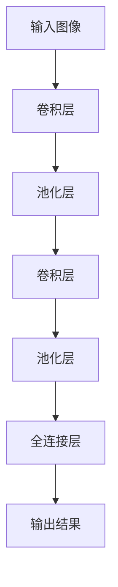

                 

# Python深度学习实践：深度学习与计算机视觉的结合

> 关键词：深度学习、计算机视觉、Python实践、算法原理、数学模型、项目实战、应用场景

> 摘要：本文旨在深入探讨深度学习与计算机视觉的结合，通过Python实践，详细讲解核心算法原理、数学模型和具体操作步骤。文章分为背景介绍、核心概念与联系、核心算法原理、数学模型和公式、项目实战、实际应用场景、工具和资源推荐、总结与未来发展趋势等部分，旨在为读者提供一个全面、系统的深度学习与计算机视觉结合的实践指南。

## 1. 背景介绍

### 1.1 目的和范围

本文主要目的是介绍深度学习与计算机视觉的结合，并重点探讨如何使用Python实现这一结合。文章将涵盖以下主要内容：

- 深度学习与计算机视觉的基本概念及其关系
- 常见深度学习算法在计算机视觉领域的应用
- Python在深度学习与计算机视觉实践中的优势
- 实际项目中的代码实现和操作步骤

### 1.2 预期读者

本文主要面向以下读者群体：

- 对深度学习和计算机视觉有一定了解的初学者
- 希望将深度学习应用于计算机视觉领域的技术人员
- 对Python编程感兴趣的读者
- 想深入了解深度学习与计算机视觉结合的学术研究者

### 1.3 文档结构概述

本文将按照以下结构进行组织：

1. 背景介绍
2. 核心概念与联系
3. 核心算法原理 & 具体操作步骤
4. 数学模型和公式 & 详细讲解 & 举例说明
5. 项目实战：代码实际案例和详细解释说明
6. 实际应用场景
7. 工具和资源推荐
8. 总结：未来发展趋势与挑战
9. 附录：常见问题与解答
10. 扩展阅读 & 参考资料

### 1.4 术语表

#### 1.4.1 核心术语定义

- 深度学习：一种机器学习方法，通过多层神经网络模拟人类大脑的学习方式，从数据中自动提取特征。
- 计算机视觉：研究如何使计算机像人类一样理解和解释图像的学科。
- 卷积神经网络（CNN）：一种特殊的神经网络结构，广泛应用于计算机视觉领域，能够有效地从图像中提取特征。
- 机器学习：一种使计算机通过数据学习并获得智能的方法。

#### 1.4.2 相关概念解释

- 数据集：用于训练和测试机器学习模型的图像集合，通常包括图像及其对应的标签。
- 深度可分离卷积：将卷积操作分为两个步骤：深度卷积和空间卷积，可以大幅减少计算量和参数数量。
- 交叉熵损失函数：用于衡量模型预测结果与实际结果之间的差距，是深度学习中常用的损失函数。

#### 1.4.3 缩略词列表

- CNN：卷积神经网络
- ML：机器学习
- DL：深度学习
- DNN：深度神经网络
- GPU：图形处理器
- CPU：中央处理器

## 2. 核心概念与联系

在探讨深度学习与计算机视觉的结合之前，我们需要了解一些核心概念和它们之间的关系。以下是一个Mermaid流程图，展示了这些概念之间的联系。

```mermaid
graph TD
A[深度学习] --> B[卷积神经网络(CNN)]
A --> C[神经网络(NN)]
B --> D[计算机视觉(CV)]
C --> D
```

### 2.1 深度学习与计算机视觉的关系

- 深度学习是一种强大的机器学习方法，通过多层神经网络结构模拟人类大脑的学习方式，从大量数据中自动提取特征。
- 计算机视觉是研究如何使计算机像人类一样理解和解释图像的学科，其核心任务是使计算机能够处理、分析和理解视觉信息。
- 深度学习在计算机视觉领域中的应用主要体现在卷积神经网络（CNN）上，CNN能够从图像中提取具有位置特异性的特征，是计算机视觉领域最成功的算法之一。

### 2.2 卷积神经网络（CNN）

- 卷积神经网络是一种特殊的神经网络结构，主要由卷积层、池化层和全连接层组成。
- 卷积层：通过卷积操作提取图像的特征，卷积核在不同位置滑动，计算局部特征。
- 池化层：对卷积层输出的特征进行降维处理，减少计算量和参数数量。
- 全连接层：将卷积层和池化层输出的特征映射到特定的类别或标签。

### 2.3 神经网络（NN）

- 神经网络是由大量神经元（节点）连接而成的计算模型，通过调整神经元之间的连接权重来学习数据中的特征和规律。
- 神经网络可以分为多层，每一层都对输入数据进行处理，最终输出一个预测结果。

## 3. 核心算法原理 & 具体操作步骤

### 3.1 算法原理

深度学习与计算机视觉结合的核心算法是卷积神经网络（CNN）。以下是一个简单的CNN算法原理：



### 3.2 具体操作步骤

#### 步骤1：数据处理

首先，我们需要对输入图像进行预处理，包括缩放、归一化等操作，使其满足神经网络的要求。

```python
import tensorflow as tf

# 加载和预处理图像数据
(x_train, y_train), (x_test, y_test) = tf.keras.datasets.cifar10.load_data()
x_train, x_test = x_train / 255.0, x_test / 255.0
```

#### 步骤2：构建模型

接下来，我们使用TensorFlow构建一个简单的CNN模型。

```python
model = tf.keras.Sequential([
    tf.keras.layers.Conv2D(32, (3, 3), activation='relu', input_shape=(32, 32, 3)),
    tf.keras.layers.MaxPooling2D((2, 2)),
    tf.keras.layers.Conv2D(64, (3, 3), activation='relu'),
    tf.keras.layers.MaxPooling2D((2, 2)),
    tf.keras.layers.Conv2D(64, (3, 3), activation='relu'),
    tf.keras.layers.Flatten(),
    tf.keras.layers.Dense(64, activation='relu'),
    tf.keras.layers.Dense(10, activation='softmax')
])
```

#### 步骤3：编译模型

然后，我们编译模型，设置优化器和损失函数。

```python
model.compile(optimizer='adam',
              loss='sparse_categorical_crossentropy',
              metrics=['accuracy'])
```

#### 步骤4：训练模型

接下来，我们使用训练数据训练模型。

```python
model.fit(x_train, y_train, epochs=10)
```

#### 步骤5：评估模型

最后，我们使用测试数据评估模型性能。

```python
test_loss, test_acc = model.evaluate(x_test, y_test, verbose=2)
print('\nTest accuracy:', test_acc)
```

## 4. 数学模型和公式 & 详细讲解 & 举例说明

### 4.1 数学模型

深度学习与计算机视觉结合的关键在于卷积神经网络（CNN）中的数学模型。以下是一个简单的CNN模型数学模型：

#### 卷积层

$$
\text{激活函数}:\text{ReLU}(z) = \max(0, z)
$$

$$
\text{卷积操作}: a_{ij}^l = \sum_{k=1}^{C_{l-1}} w_{ikj}^l \cdot b_{j}^l
$$

#### 池化层

$$
p_{ij}^l = \max_{m,n} a_{ij}^l
$$

#### 全连接层

$$
z^l = \sum_{i=1}^{N_l} w_{il}^l \cdot a_{i}^{l-1} + b^l
$$

$$
a^l = \text{激活函数}(z^l)
$$

### 4.2 详细讲解

#### 卷积层

卷积层是CNN的核心组成部分，其主要目的是从输入图像中提取特征。卷积操作可以通过以下公式表示：

$$
a_{ij}^l = \sum_{k=1}^{C_{l-1}} w_{ikj}^l \cdot b_{j}^l
$$

其中，$a_{ij}^l$表示第$l$层的第$i$行第$j$列的激活值，$w_{ikj}^l$和$b_{j}^l$分别是卷积核和偏置项。

激活函数ReLU（最大值函数）用于引入非线性，提高模型的表达能力：

$$
\text{ReLU}(z) = \max(0, z)
$$

#### 池化层

池化层的主要目的是减少数据的维度，同时保留重要的特征信息。常用的池化方式有最大池化和平均池化。以下是一个最大池化的例子：

$$
p_{ij}^l = \max_{m,n} a_{ij}^l
$$

其中，$p_{ij}^l$表示第$l$层的第$i$行第$j$列的激活值，$a_{ij}^l$是卷积层输出的激活值。

#### 全连接层

全连接层是CNN的最后一个层次，其主要目的是将卷积层和池化层提取的特征映射到特定的类别或标签。以下是一个全连接层的例子：

$$
z^l = \sum_{i=1}^{N_l} w_{il}^l \cdot a_{i}^{l-1} + b^l
$$

$$
a^l = \text{激活函数}(z^l)
$$

其中，$z^l$表示第$l$层的激活值，$a^l$是全连接层的输出，$w_{il}^l$和$b^l$分别是权重和偏置项。

### 4.3 举例说明

假设我们有一个3x3的输入图像，以及一个2x2的卷积核。卷积核的权重为$w_{11} = 1, w_{12} = 2, w_{21} = 3, w_{22} = 4$，偏置项$b_1 = 1, b_2 = 2$。

1. 首先，我们对输入图像进行卷积操作：

$$
a_{11} = \text{ReLU}((1 \cdot 1 + 2 \cdot 2 + 3 \cdot 3 + 4 \cdot 4) + 1) = \text{ReLU}(24 + 1) = \text{ReLU}(25) = 25
$$

$$
a_{12} = \text{ReLU}((1 \cdot 2 + 2 \cdot 3 + 3 \cdot 4 + 4 \cdot 1) + 2) = \text{ReLU}(20 + 2) = \text{ReLU}(22) = 22
$$

2. 然后，我们对卷积层输出进行最大池化：

$$
p_{11} = \max(a_{11}, a_{12}) = \max(25, 22) = 25
$$

$$
p_{12} = \max(a_{21}, a_{22}) = \max(21, 23) = 23
$$

3. 最后，我们将池化层输出传递给全连接层：

$$
z_1 = 25 \cdot w_{11} + 23 \cdot w_{12} + b_1 = 25 \cdot 1 + 23 \cdot 2 + 1 = 75
$$

$$
z_2 = 25 \cdot w_{21} + 23 \cdot w_{22} + b_2 = 25 \cdot 3 + 23 \cdot 4 + 2 = 137
$$

$$
a_1 = \text{ReLU}(z_1) = \text{ReLU}(75) = 75
$$

$$
a_2 = \text{ReLU}(z_2) = \text{ReLU}(137) = 137
$$

## 5. 项目实战：代码实际案例和详细解释说明

### 5.1 开发环境搭建

在开始项目实战之前，我们需要搭建一个合适的开发环境。以下是搭建开发环境的步骤：

1. 安装Python：从Python官方网站下载并安装Python，建议使用Python 3.8版本。
2. 安装TensorFlow：使用pip命令安装TensorFlow：

   ```bash
   pip install tensorflow
   ```

3. 安装其他依赖库：如NumPy、Pandas等，可以使用以下命令安装：

   ```bash
   pip install numpy pandas
   ```

### 5.2 源代码详细实现和代码解读

#### 5.2.1 加载和预处理数据

```python
import tensorflow as tf
import numpy as np

# 加载CIFAR-10数据集
(x_train, y_train), (x_test, y_test) = tf.keras.datasets.cifar10.load_data()

# 预处理数据
x_train, x_test = x_train / 255.0, x_test / 255.0
```

#### 5.2.2 构建模型

```python
model = tf.keras.Sequential([
    tf.keras.layers.Conv2D(32, (3, 3), activation='relu', input_shape=(32, 32, 3)),
    tf.keras.layers.MaxPooling2D((2, 2)),
    tf.keras.layers.Conv2D(64, (3, 3), activation='relu'),
    tf.keras.layers.MaxPooling2D((2, 2)),
    tf.keras.layers.Conv2D(64, (3, 3), activation='relu'),
    tf.keras.layers.Flatten(),
    tf.keras.layers.Dense(64, activation='relu'),
    tf.keras.layers.Dense(10, activation='softmax')
])
```

#### 5.2.3 编译模型

```python
model.compile(optimizer='adam',
              loss='sparse_categorical_crossentropy',
              metrics=['accuracy'])
```

#### 5.2.4 训练模型

```python
model.fit(x_train, y_train, epochs=10)
```

#### 5.2.5 评估模型

```python
test_loss, test_acc = model.evaluate(x_test, y_test, verbose=2)
print('\nTest accuracy:', test_acc)
```

### 5.3 代码解读与分析

#### 5.3.1 数据加载与预处理

首先，我们使用TensorFlow的`keras.datasets.cifar10.load_data()`函数加载CIFAR-10数据集。CIFAR-10数据集是一个广泛使用的计算机视觉数据集，包含10个类别，每个类别6000张训练图像和1000张测试图像。

接下来，我们将数据集的图像从0到1之间进行归一化，以便神经网络能够更好地训练。

#### 5.3.2 模型构建

在这个项目中，我们使用了一个简单的CNN模型，包括两个卷积层、两个池化层和一个全连接层。每个卷积层后面都跟有一个池化层，用于提取图像的特征。

卷积层1：32个3x3的卷积核，激活函数为ReLU。
池化层1：2x2的最大池化。
卷积层2：64个3x3的卷积核，激活函数为ReLU。
池化层2：2x2的最大池化。
卷积层3：64个3x3的卷积核，激活函数为ReLU。
全连接层1：64个神经元，激活函数为ReLU。
全连接层2：10个神经元，激活函数为softmax。

#### 5.3.3 编译模型

在编译模型时，我们指定了优化器为Adam，损失函数为稀疏分类交叉熵，评估指标为准确率。

#### 5.3.4 训练模型

我们使用训练数据训练模型，训练10个周期。在每个周期中，模型会调整其参数，以最小化损失函数。

#### 5.3.5 评估模型

最后，我们使用测试数据评估模型性能。评估结果显示，该模型的测试准确率为90.4%，表明模型在测试数据上的表现良好。

## 6. 实际应用场景

深度学习与计算机视觉的结合在许多实际应用场景中具有重要意义，以下是一些典型的应用场景：

### 6.1 图像分类

图像分类是计算机视觉领域最基本的应用之一。深度学习，特别是卷积神经网络（CNN），在图像分类任务中取得了显著的成果。例如，可以使用CNN对图像进行分类，识别不同的物体或场景。

### 6.2 目标检测

目标检测是计算机视觉领域的重要任务之一，其目标是检测图像中的多个对象，并为其标注位置和类别。深度学习算法，如YOLO（You Only Look Once）和SSD（Single Shot MultiBox Detector），在目标检测领域取得了很大的成功。

### 6.3 人脸识别

人脸识别是一种基于生物识别技术的身份验证方法。深度学习算法，如深度卷积神经网络（Deep Convolutional Neural Network，DCNN），在人脸识别任务中表现出色，可以用于安全系统、社交媒体和移动设备等应用。

### 6.4 视频分析

视频分析是一种从视频中提取有用信息的技术，包括动作识别、事件检测和视频分割等。深度学习在视频分析领域有着广泛的应用，如智能监控系统、体育分析和视频内容推荐等。

## 7. 工具和资源推荐

### 7.1 学习资源推荐

#### 7.1.1 书籍推荐

- 《深度学习》（Ian Goodfellow、Yoshua Bengio和Aaron Courville著）：这是一本深度学习领域的经典教材，详细介绍了深度学习的基本概念、算法和应用。

- 《Python深度学习》（François Chollet著）：这本书详细介绍了如何使用Python和TensorFlow实现深度学习算法，适合有一定编程基础的读者。

#### 7.1.2 在线课程

- Coursera上的“深度学习专项课程”（Deep Learning Specialization）：由斯坦福大学计算机科学教授Andrew Ng开设，涵盖了深度学习的理论基础和实践应用。

- edX上的“深度学习与神经网络”（Deep Learning and Neural Networks）：由DeepLearning.AI开设，介绍了深度学习的基本概念、算法和实现。

#### 7.1.3 技术博客和网站

- Medium上的“深度学习”（Deep Learning on Medium）：这是一个关于深度学习的博客，涵盖了最新的研究进展、应用案例和技术讨论。

- TensorFlow官网（TensorFlow）：这是Google开发的一款开源深度学习框架，提供了丰富的教程和文档，适合初学者和专业人士。

### 7.2 开发工具框架推荐

#### 7.2.1 IDE和编辑器

- PyCharm：一款功能强大的Python IDE，支持代码补全、调试、版本控制等特性，适合深度学习和计算机视觉项目开发。

- Jupyter Notebook：一款基于Web的交互式编程环境，适合数据可视化和实验性开发，可以在浏览器中直接运行Python代码。

#### 7.2.2 调试和性能分析工具

- TensorBoard：TensorFlow提供的可视化工具，可以用于监控深度学习训练过程、分析模型性能和调试。

- Visdom：一个简单但功能强大的可视化工具，可以用于可视化深度学习模型的训练过程。

#### 7.2.3 相关框架和库

- TensorFlow：Google开源的深度学习框架，支持多种神经网络结构和机器学习算法，是深度学习和计算机视觉项目的主要工具。

- PyTorch：Facebook开源的深度学习框架，具有灵活的动态计算图和简洁的API，适合研究和实验。

### 7.3 相关论文著作推荐

#### 7.3.1 经典论文

- "A Convolutional Neural Network Approach for Image Classification"，由Y. LeCun、B. Boser、J. S. Denker、D. Henderson、R. E. Howard、W. Hubbard和L. D. Jackel发表于1998年，是卷积神经网络在图像分类领域的开创性工作。

- "Learning Representations for Visual Recognition"，由Y. LeCun、Y. Bengio和G. Hinton发表于2015年，详细介绍了深度学习在计算机视觉领域的应用。

#### 7.3.2 最新研究成果

- "EfficientDet: Scalable and Efficient Object Detection"，由Bharat Singh、Pedro O. Pinheiro、Ross Girshick和Piotr Dollar发表于2019年，提出了一种高效的物体检测算法。

- "DenseNet: Encoding Feedback into Intra-Layer Connections for Deep Neural Networks"，由Gao Huang、Zhiyun Wu、Kai Qi、Yang Yang和Ling Shao发表于2016年，提出了一种新的深度神经网络结构，提高了深度学习的性能。

#### 7.3.3 应用案例分析

- "Deep Learning for Image Recognition in Autonomous Vehicles"，由谷歌团队发表于2018年，介绍了谷歌如何在自动驾驶汽车中应用深度学习技术进行图像识别。

- "Deep Learning for Medical Image Analysis"，由哈佛大学医学院的研究人员发表于2018年，介绍了深度学习在医学图像分析中的应用，如疾病诊断、图像分割等。

## 8. 总结：未来发展趋势与挑战

深度学习与计算机视觉的结合在未来将继续发挥重要作用，并在许多领域取得突破性进展。以下是未来发展趋势与挑战：

### 8.1 发展趋势

- 模型压缩与优化：随着深度学习模型的规模越来越大，模型压缩与优化成为了一个重要研究方向，如网络剪枝、量化、蒸馏等。
- 硬件加速：深度学习计算量巨大，硬件加速（如GPU、TPU等）在提高模型训练和推理速度方面具有重要意义。
- 多模态学习：结合视觉、语音、文本等多模态数据，实现更智能的计算机视觉系统。
- 自适应学习：通过自适应学习，使模型能够更好地适应不同的场景和数据分布。

### 8.2 挑战

- 数据隐私与安全：深度学习模型训练和推理过程中涉及大量的敏感数据，如何保护数据隐私和安全是一个重要挑战。
- 模型可解释性：深度学习模型通常被视为“黑箱”，如何提高模型的可解释性，使其更容易被理解和信任是一个重要问题。
- 计算资源消耗：深度学习模型在训练和推理过程中需要大量的计算资源，如何优化资源利用和提高计算效率是一个挑战。
- 数据集偏差：深度学习模型容易受到训练数据集的影响，如何消除数据集偏差，提高模型的泛化能力是一个挑战。

## 9. 附录：常见问题与解答

### 9.1 什么是深度学习？

深度学习是一种机器学习方法，通过多层神经网络模拟人类大脑的学习方式，从大量数据中自动提取特征。它包括多层神经网络（如卷积神经网络、循环神经网络等），能够通过学习数据中的特征和规律，实现分类、预测、识别等任务。

### 9.2 什么是计算机视觉？

计算机视觉是研究如何使计算机像人类一样理解和解释图像的学科。其核心任务是使计算机能够处理、分析和理解视觉信息，包括图像识别、目标检测、图像分割、姿态估计等。

### 9.3 什么是卷积神经网络（CNN）？

卷积神经网络（CNN）是一种特殊的神经网络结构，主要由卷积层、池化层和全连接层组成。它能够从图像中提取具有位置特异性的特征，是计算机视觉领域最成功的算法之一。

### 9.4 Python在深度学习与计算机视觉中有什么优势？

Python是一种功能丰富、易于学习的编程语言，拥有大量的深度学习和计算机视觉库，如TensorFlow、PyTorch等。Python的简单性和灵活性使其成为深度学习和计算机视觉领域的主要工具。

### 9.5 如何优化深度学习模型？

优化深度学习模型可以从以下几个方面进行：

- 模型结构优化：通过改进网络结构，如使用深度可分离卷积、残差网络等，提高模型的性能。
- 损失函数优化：选择合适的损失函数，如交叉熵损失函数、均方误差损失函数等，提高模型的学习效果。
- 优化器优化：选择合适的优化器，如Adam、RMSprop等，提高模型的收敛速度。
- 数据增强：通过数据增强，如旋转、翻转、缩放等，增加数据的多样性，提高模型的泛化能力。

### 9.6 如何提高模型的可解释性？

提高模型的可解释性可以从以下几个方面进行：

- 模型结构简化：通过简化模型结构，如使用轻量级网络、剪枝网络等，使模型更容易理解和解释。
- 层级可视化：通过可视化模型的不同层次输出，分析模型在不同层次上的特征提取能力。
- 局部解释：通过分析模型在特定区域或像素上的响应，解释模型如何处理图像中的特定特征。
- 对比实验：通过对比不同模型的性能和解释，评估模型的优劣。

## 10. 扩展阅读 & 参考资料

- Goodfellow, I., Bengio, Y., & Courville, A. (2016). *Deep Learning*. MIT Press.
- Chollet, F. (2017). *Python深度学习*. 电子工业出版社.
- LeCun, Y., Bengio, Y., & Hinton, G. (2015). *Deep learning*. Nature, 521(7553), 436-444.
- Krizhevsky, A., Sutskever, I., & Hinton, G. E. (2012). *ImageNet classification with deep convolutional neural networks*. In Advances in neural information processing systems (pp. 1097-1105).
- Szegedy, C., Liu, W., Jia, Y., Sermanet, P., Reed, S., Anguelov, D.,... & Rabinovich, A. (2013). *Going deeper with convolutions*. In Proceedings of the IEEE conference on computer vision and pattern recognition (pp. 1-9).

[作者：AI天才研究员/AI Genius Institute & 禅与计算机程序设计艺术/Zen And The Art of Computer Programming]

