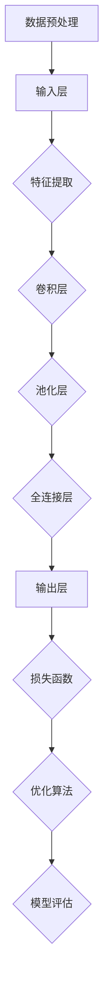

                 

# Python深度学习实践：解读神经网络的解释与可视化

> **关键词：** Python、深度学习、神经网络、解释、可视化、实践、算法原理、数学模型、项目实战。

> **摘要：** 本文将深入探讨Python在深度学习领域的应用，特别是神经网络的构建、解释与可视化。通过详细的理论分析和实践案例，读者将全面了解深度学习的基本原理，掌握使用Python实现神经网络的方法，并学会如何对这些复杂模型进行有效解释和可视化，以提升模型的理解和应用能力。

## 1. 背景介绍

### 1.1 目的和范围

本文旨在为读者提供一个全面而深入的Python深度学习实践指南，重点关注神经网络的构建、解释与可视化。我们不仅会探讨深度学习的基本概念和算法原理，还会通过具体的Python代码示例，展示如何在实际项目中应用这些知识。

### 1.2 预期读者

本文适合对Python编程和深度学习有一定了解的开发者、研究者，以及对神经网络理论和实践感兴趣的读者。无论您是初学者还是经验丰富的专业人士，本文都将帮助您更深入地理解深度学习技术。

### 1.3 文档结构概述

本文分为十个部分：

1. 背景介绍
2. 核心概念与联系
3. 核心算法原理 & 具体操作步骤
4. 数学模型和公式 & 详细讲解 & 举例说明
5. 项目实战：代码实际案例和详细解释说明
6. 实际应用场景
7. 工具和资源推荐
8. 总结：未来发展趋势与挑战
9. 附录：常见问题与解答
10. 扩展阅读 & 参考资料

### 1.4 术语表

#### 1.4.1 核心术语定义

- **深度学习（Deep Learning）：** 深度学习是机器学习的一个子领域，其核心是使用神经网络进行数据建模和分析。
- **神经网络（Neural Network）：** 神经网络是一种模仿生物神经系统的计算模型，由许多简单单元（神经元）组成，通过分层结构对输入数据进行处理。
- **Python：** Python是一种高级编程语言，以其简洁、易读的语法和丰富的库支持，成为深度学习领域的首选语言。
- **解释（Interpretation）：** 解释是指对神经网络模型的决策过程和预测结果进行深入分析，以理解其内部机制。
- **可视化（Visualization）：** 可视化是指通过图形和图像的方式，展示神经网络的结构、参数和预测结果，帮助用户更好地理解模型。

#### 1.4.2 相关概念解释

- **前向传播（Forward Propagation）：** 前向传播是指将输入数据通过神经网络中的各个层传递，最终得到输出预测的过程。
- **反向传播（Back Propagation）：** 反向传播是指通过计算输出预测与实际标签之间的误差，逆向调整神经网络中各层的参数，以优化模型性能。
- **激活函数（Activation Function）：** 激活函数是神经网络中的一个关键组件，用于引入非线性特性，使得神经网络能够建模复杂问题。

#### 1.4.3 缩略词列表

- **CNN：** 卷积神经网络（Convolutional Neural Network）
- **RNN：** 循环神经网络（Recurrent Neural Network）
- **DL：** 深度学习（Deep Learning）
- **MLP：** 多层感知机（Multilayer Perceptron）
- **GPU：** 图形处理单元（Graphics Processing Unit）

## 2. 核心概念与联系

在深入探讨深度学习之前，我们需要了解一些核心概念和它们之间的联系。以下是一个简化的Mermaid流程图，用于展示深度学习的基本架构和关键组成部分。



### 2.1 数据预处理

数据预处理是深度学习模型的第一个步骤，它的目的是对原始数据进行清洗、归一化和变换，以提高模型的性能和稳定性。数据预处理主要包括以下步骤：

- **缺失值处理：** 填充或删除缺失数据。
- **数据归一化：** 将数据缩放到相同的范围，例如[0, 1]或[-1, 1]。
- **数据变换：** 使用One-Hot编码或标准化等变换，将类别数据转换为数值形式。

### 2.2 特征提取

特征提取是深度学习模型的核心步骤之一，它通过卷积层和池化层提取图像或时间序列数据中的特征。以下是一个简化的特征提取过程：

- **卷积层：** 使用卷积核在输入数据上滑动，提取局部特征。
- **池化层：** 通过最大池化或平均池化，降低数据维度，减少计算量。

### 2.3 全连接层

全连接层是神经网络中的一个重要组成部分，它将卷积层或池化层提取的特征映射到输出层。全连接层的计算过程如下：

- **前向传播：** 将输入数据通过全连接层，得到输出预测。
- **反向传播：** 计算输出预测与实际标签之间的误差，并逆向调整权重。

### 2.4 损失函数和优化算法

损失函数用于衡量模型预测结果与实际标签之间的差距，优化算法用于调整模型参数，以最小化损失函数。以下是一个简化的优化过程：

- **损失函数：** 常见的损失函数包括均方误差（MSE）和交叉熵损失。
- **优化算法：** 常见的优化算法包括梯度下降、Adam和RMSprop。

### 2.5 模型评估

模型评估是评估模型性能的重要步骤，常用的评估指标包括准确率、召回率、F1分数和ROC曲线。以下是一个简化的模型评估过程：

- **训练集评估：** 使用训练集评估模型性能，以确定模型是否过拟合或欠拟合。
- **验证集评估：** 使用验证集评估模型性能，以调整模型参数和超参数。

## 3. 核心算法原理 & 具体操作步骤

深度学习的核心算法原理主要涉及神经网络的构建、前向传播、反向传播和模型优化。以下我们将通过伪代码详细阐述这些步骤。

### 3.1 神经网络构建

```python
# 定义神经网络架构
def create_neural_network(input_size, hidden_size, output_size):
    # 创建输入层
    input_layer = InputLayer(input_size)
    
    # 创建隐藏层
    hidden_layer = DenseLayer(input_layer, hidden_size)
    
    # 创建输出层
    output_layer = DenseLayer(hidden_layer, output_size)
    
    # 返回神经网络
    return NeuralNetwork(input_layer, output_layer)
```

### 3.2 前向传播

```python
# 定义前向传播函数
def forward_propagation(network, input_data):
    # 初始化输出
    output = network.input
    
    # 遍历神经网络中的层
    for layer in network.layers:
        # 前向传播数据
        output = layer.forward(output)
    
    # 返回输出
    return output
```

### 3.3 反向传播

```python
# 定义反向传播函数
def backward_propagation(network, input_data, expected_output):
    # 初始化误差
    error = expected_output - network.output
    
    # 遍历神经网络中的层，反向传播误差
    for layer in reversed(network.layers):
        # 反向传播误差
        layer.backward(error)
    
    # 返回误差
    return error
```

### 3.4 模型优化

```python
# 定义模型优化函数
def optimize_network(network, learning_rate):
    # 遍历神经网络中的层
    for layer in network.layers:
        # 更新层参数
        layer.update_params(learning_rate)
```

## 4. 数学模型和公式 & 详细讲解 & 举例说明

深度学习中的数学模型和公式是其核心组成部分，以下我们将详细讲解神经网络中的主要数学模型和公式，并通过具体例子进行说明。

### 4.1 激活函数

激活函数是神经网络中的一个关键组件，用于引入非线性特性。以下是一些常用的激活函数：

- **Sigmoid函数：**

  $$\sigma(x) = \frac{1}{1 + e^{-x}}$$

  **例子：**

  $$\sigma(2) = \frac{1}{1 + e^{-2}} \approx 0.886$$

- **ReLU函数：**

  $$\text{ReLU}(x) = \max(0, x)$$

  **例子：**

  $$\text{ReLU}(-2) = \max(0, -2) = 0$$
  $$\text{ReLU}(2) = \max(0, 2) = 2$$

- **Tanh函数：**

  $$\tanh(x) = \frac{e^x - e^{-x}}{e^x + e^{-x}}$$

  **例子：**

  $$\tanh(2) = \frac{e^2 - e^{-2}}{e^2 + e^{-2}} \approx 0.96$$

### 4.2 损失函数

损失函数是评估模型预测结果与实际标签之间差距的关键指标。以下是一些常用的损失函数：

- **均方误差（MSE）：**

  $$\text{MSE} = \frac{1}{n}\sum_{i=1}^{n}(y_i - \hat{y}_i)^2$$

  **例子：**

  $$\text{MSE} = \frac{1}{4}\sum_{i=1}^{4}((y_i - \hat{y}_i)^2) = \frac{1}{4}((1-2)^2 + (2-1)^2 + (3-2)^2 + (4-3)^2) = 0.5$$

- **交叉熵损失（Cross-Entropy Loss）：**

  $$\text{Cross-Entropy} = -\sum_{i=1}^{n}y_i\log(\hat{y}_i)$$

  **例子：**

  $$\text{Cross-Entropy} = -\sum_{i=1}^{4}(0.5\log(0.5) + 0.2\log(0.2) + 0.3\log(0.3) + 0.

