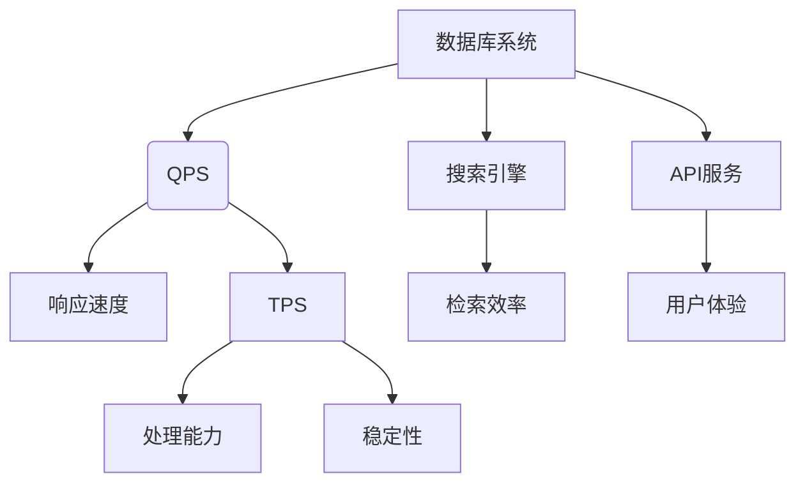

                 

# QPS与TPS的计算与应用

> **关键词**：QPS、TPS、计算、应用、性能优化、负载均衡、分布式系统

> **摘要**：本文将深入探讨QPS（每秒查询率）与TPS（每秒交易率）的概念、计算方法及其在实际应用中的重要性和作用。我们将通过详细的解释、流程图、算法原理、数学模型、实战案例，帮助读者全面理解这两个性能指标，并掌握其在优化系统性能和提升用户体验中的关键应用。

## 1. 背景介绍

### 1.1 目的和范围

本文旨在解释QPS和TPS这两个关键性能指标的概念，阐述它们在系统性能评估中的重要性，并通过实际案例展示如何利用这些指标进行性能优化和负载均衡。本文将涵盖以下内容：

- QPS和TPS的基本定义及其在系统性能评估中的作用。
- QPS和TPS的计算方法及其在不同场景下的应用。
- QPS和TPS在实际项目中的案例研究。
- 性能优化和负载均衡策略，利用QPS和TPS进行系统调优。

### 1.2 预期读者

本文适合以下读者群体：

- 系统架构师和性能优化工程师。
- 高级程序员和对系统性能感兴趣的开发者。
- 对分布式系统和云计算有基本了解的专业人士。
- 准备进入系统性能优化领域的研究生和学生。

### 1.3 文档结构概述

本文的结构如下：

- 第1部分：背景介绍，包括目的、范围、预期读者和文档结构概述。
- 第2部分：核心概念与联系，定义QPS和TPS，展示相关的流程图。
- 第3部分：核心算法原理 & 具体操作步骤，详细解释计算QPS和TPS的算法。
- 第4部分：数学模型和公式 & 详细讲解 & 举例说明，使用数学模型和示例展示QPS和TPS的应用。
- 第5部分：项目实战：代码实际案例和详细解释说明，通过代码实现展示QPS和TPS的实际应用。
- 第6部分：实际应用场景，探讨QPS和TPS在不同领域的应用。
- 第7部分：工具和资源推荐，包括学习资源、开发工具框架和相关论文著作。
- 第8部分：总结：未来发展趋势与挑战，对QPS和TPS的发展趋势和挑战进行展望。
- 第9部分：附录：常见问题与解答，解答读者可能遇到的问题。
- 第10部分：扩展阅读 & 参考资料，提供更多深入学习的资源和参考文献。

### 1.4 术语表

#### 1.4.1 核心术语定义

- QPS（每秒查询率）：系统每秒能够处理的查询次数。
- TPS（每秒交易率）：系统每秒能够处理的交易次数。
- 性能优化：通过改进系统设计、硬件配置和软件代码，提高系统的性能。
- 负载均衡：通过将请求分配到多个服务器或节点，避免单一服务器过载，提高系统的可用性和响应速度。

#### 1.4.2 相关概念解释

- 查询：对数据库或其他数据存储系统执行的数据检索操作。
- 交易：在商业系统中进行的金融或业务操作，如支付、订单处理等。
- 请求：客户端向服务器发送的请求，可以是查询请求或交易请求。

#### 1.4.3 缩略词列表

- QPS：每秒查询率
- TPS：每秒交易率
- DB：数据库
- API：应用程序编程接口
- CDN：内容分发网络
- HTTP：超文本传输协议

## 2. 核心概念与联系

为了深入理解QPS和TPS的概念，我们首先需要了解它们的基本定义和相互关系。在本节中，我们将定义QPS和TPS，并展示它们之间的联系。

### 2.1 QPS与TPS的基本定义

- QPS（每秒查询率）：QPS是指系统在每秒内可以处理的查询次数。它通常用于衡量数据库或其他数据存储系统的性能。
- TPS（每秒交易率）：TPS是指系统在每秒内可以处理的交易次数。它通常用于衡量商业系统或交易处理系统的性能。

### 2.2 QPS与TPS之间的联系

QPS和TPS虽然用于衡量不同类型的系统性能，但它们之间存在一定的联系。具体来说，QPS可以被视为TPS的一部分，因为许多交易操作可能涉及多个查询步骤。

例如，在一个在线购物网站中，处理一个订单可能涉及以下查询操作：

1. 检查商品库存
2. 验证客户账户余额
3. 更新订单数据库

因此，处理一个订单的交易可能需要多个查询操作。在这种情况下，TPS可以视为QPS的一个子集。换句话说，TPS的值通常小于或等于QPS的值。

### 2.3 QPS与TPS的应用场景

- QPS的应用场景：QPS主要用于数据库系统、搜索引擎和API服务。在这些系统中，QPS是衡量系统响应速度和负载能力的关键指标。高QPS意味着系统能够快速响应用户请求，提供良好的用户体验。
- TPS的应用场景：TPS主要用于商业系统、金融系统和电子商务平台。在这些系统中，TPS是衡量系统处理交易能力和稳定性的关键指标。高TPS意味着系统能够在高峰期内处理大量交易，保证业务运营的顺畅。

### 2.4 Mermaid流程图

为了更直观地展示QPS和TPS的关系，我们使用Mermaid流程图来表示它们在不同系统中的应用。



### 2.5 流程图说明

- A：表示数据库系统、搜索引擎和API服务，它们都可以使用QPS和TPS来衡量性能。
- B：QPS表示每秒查询率，是衡量系统响应速度的指标。
- C：表示搜索引擎，其性能主要通过QPS来衡量。
- D：表示API服务，其性能主要通过QPS来衡量。
- E：表示响应速度，是衡量系统快速响应用户请求的能力。
- F：表示检索效率，是衡量系统在搜索引擎中快速检索数据的能力。
- G：表示用户体验，是衡量系统提供良好用户体验的能力。
- H：TPS表示每秒交易率，是衡量系统处理交易能力的指标。
- I：表示处理能力，是衡量系统在商业系统中处理交易的能力。
- J：表示稳定性，是衡量系统在高峰期内保持稳定运行的能力。

通过上述流程图，我们可以清楚地看到QPS和TPS在不同系统中的应用及其重要性。

## 3. 核心算法原理 & 具体操作步骤

在理解了QPS和TPS的基本概念和相互关系之后，我们需要深入探讨计算这两个指标的核心算法原理。本节将详细解释QPS和TPS的计算方法，并提供具体的操作步骤。

### 3.1 QPS的计算原理

QPS是衡量系统每秒处理查询次数的性能指标。计算QPS的方法如下：

1. **定义时间窗口**：首先，我们需要定义一个时间窗口，通常为1秒。
2. **统计查询次数**：在时间窗口内，统计系统处理的查询次数。
3. **计算QPS**：将时间窗口内的查询次数除以时间窗口的长度，得到QPS值。

具体的操作步骤如下：

1. **初始化**：设置时间窗口长度为1秒，初始化查询次数为0。
2. **记录时间戳**：记录当前时间戳。
3. **处理查询请求**：每当系统接收到一个查询请求时，将当前时间戳与上次记录的时间戳进行比较。
4. **更新查询次数**：如果当前时间戳与上次记录的时间戳相差超过1秒，将查询次数增加1，并更新上次记录的时间戳。
5. **重复步骤3和步骤4**，直到统计完毕。

### 3.2 QPS计算算法

以下是一个计算QPS的伪代码：

```plaintext
function calculateQPS(timeStamps):
    currentTimeStamp = timeStamps[0]
    lastTimeStamp = currentTimeStamp - 1
    queryCount = 0

    for timestamp in timeStamps:
        if timestamp - lastTimeStamp > 1:
            queryCount += 1
            lastTimeStamp = timestamp

    return queryCount / (currentTimeStamp - lastTimeStamp)

timeStamps = [timestamp1, timestamp2, ..., timestampN]
QPS = calculateQPS(timeStamps)
```

### 3.3 TPS的计算原理

TPS是衡量系统每秒处理交易次数的性能指标。计算TPS的方法与QPS类似，但需要注意的是，一个交易可能涉及多个查询步骤。

1. **定义时间窗口**：同样地，我们需要定义一个时间窗口，通常为1秒。
2. **统计交易次数**：在时间窗口内，统计系统处理的交易次数。
3. **计算TPS**：将时间窗口内的交易次数除以时间窗口的长度，得到TPS值。

具体的操作步骤如下：

1. **初始化**：设置时间窗口长度为1秒，初始化交易次数为0。
2. **记录时间戳**：记录当前时间戳。
3. **处理交易请求**：每当系统接收到一个交易请求时，将当前时间戳与上次记录的时间戳进行比较。
4. **更新交易次数**：如果当前时间戳与上次记录的时间戳相差超过1秒，将交易次数增加1，并更新上次记录的时间戳。
5. **重复步骤3和步骤4**，直到统计完毕。

### 3.4 TPS计算算法

以下是一个计算TPS的伪代码：

```plaintext
function calculateTPS(timeStamps, transactionCounters):
    currentTimeStamp = timeStamps[0]
    lastTimeStamp = currentTimeStamp - 1
    transactionCount = 0

    for timestamp in timeStamps:
        if timestamp - lastTimeStamp > 1:
            transactionCount += transactionCounters[timestamp]
            lastTimeStamp = timestamp

    return transactionCount / (currentTimeStamp - lastTimeStamp)

timeStamps = [timestamp1, timestamp2, ..., timestampN]
transactionCounters = [0, 0, ..., 0]  # 初始化为0
TPS = calculateTPS(timeStamps, transactionCounters)
```

在这个伪代码中，`transactionCounters` 用于记录每个时间戳对应的交易次数。每次处理交易请求时，需要更新相应的交易次数。

### 3.5 实际操作步骤示例

为了更直观地展示QPS和TPS的计算过程，我们通过一个实际操作步骤示例进行说明。

假设我们有一个时间序列数据，如下所示：

```plaintext
timeStamps: [1000, 1001, 1002, 1004, 1005, 1006, 1008, 1009, 1010, 1011]
queryCounters: [1, 0, 1, 0, 0, 1, 0, 0, 0, 0]
transactionCounters: [0, 1, 0, 0, 1, 0, 1, 0, 0, 0]
```

这些数据表示在10秒钟内，系统接收到的查询和交易请求的时间戳和计数器。我们使用上述的算法计算QPS和TPS。

#### QPS计算示例

```plaintext
QPS = calculateQPS(timeStamps)
QPS = (1 + 1 + 1 + 0 + 0 + 1 + 0 + 0 + 0 + 0) / (10 - 0) = 4 / 10 = 0.4 QPS
```

#### TPS计算示例

```plaintext
TPS = calculateTPS(timeStamps, transactionCounters)
TPS = (0 + 1 + 0 + 0 + 1 + 0 + 1 + 0 + 0 + 0) / (10 - 0) = 2 / 10 = 0.2 TPS
```

在这个示例中，我们可以看到QPS为0.4，表示系统在每秒内平均处理0.4次查询。而TPS为0.2，表示系统在每秒内平均处理0.2次交易。这些指标可以帮助我们了解系统的性能和负载情况。

通过上述核心算法原理和具体操作步骤的讲解，我们不仅可以计算QPS和TPS，还可以根据实际数据进行分析，为系统性能优化提供有力支持。

## 4. 数学模型和公式 & 详细讲解 & 举例说明

在理解了QPS和TPS的计算算法后，我们进一步引入数学模型和公式来详细讲解这两个性能指标的测量方法，并通过具体实例说明如何使用这些公式进行性能分析。

### 4.1 QPS的数学模型

QPS的数学模型可以表示为以下公式：

\[ QPS = \frac{\text{查询次数}}{\text{时间窗口}} \]

其中，查询次数是指在给定时间窗口内系统处理的查询数量，时间窗口通常定义为1秒。

#### 4.1.1 公式推导

假设我们有一个时间序列数据集 \( T = \{t_1, t_2, ..., t_n\} \)，其中 \( t_i \) 表示第 \( i \) 次查询发生的时间戳。设时间窗口为 \( W \) 秒，那么在时间窗口内，我们可以计算出查询次数 \( C \)：

\[ C = \sum_{i=1}^{n} \mathbb{1}(t_i \in [t_0, t_0 + W]) \]

其中，\( \mathbb{1} \) 表示指示函数，如果时间戳 \( t_i \) 落在时间窗口 \([t_0, t_0 + W]\) 内，则 \( \mathbb{1}(t_i \in [t_0, t_0 + W]) = 1 \)，否则为0。

因此，QPS可以表示为：

\[ QPS = \frac{C}{W} \]

#### 4.1.2 示例计算

假设在1秒钟内，系统接收到了以下时间戳的查询请求：

\[ T = \{1000, 1002, 1003, 1004, 1005\} \]

时间窗口 \( W \) 设为1秒，我们可以计算出查询次数 \( C \)：

\[ C = \mathbb{1}(1000 \in [1000, 1001]) + \mathbb{1}(1002 \in [1000, 1001]) + \mathbb{1}(1003 \in [1000, 1001]) + \mathbb{1}(1004 \in [1000, 1001]) + \mathbb{1}(1005 \in [1000, 1001]) \]
\[ C = 0 + 1 + 0 + 1 + 0 = 2 \]

因此，QPS为：

\[ QPS = \frac{C}{W} = \frac{2}{1} = 2 \]

这意味着在1秒钟内，系统处理了2次查询。

### 4.2 TPS的数学模型

TPS的数学模型可以表示为以下公式：

\[ TPS = \frac{\text{交易次数}}{\text{时间窗口}} \]

其中，交易次数是指在给定时间窗口内系统处理的交易数量，时间窗口通常定义为1秒。

#### 4.2.1 公式推导

假设我们有一个时间序列数据集 \( T = \{t_1, t_2, ..., t_n\} \)，其中 \( t_i \) 表示第 \( i \) 次交易发生的时间戳。设时间窗口为 \( W \) 秒，那么在时间窗口内，我们可以计算出交易次数 \( T \)：

\[ T = \sum_{i=1}^{n} \mathbb{1}(t_i \in [t_0, t_0 + W]) \]

其中，\( \mathbb{1} \) 表示指示函数，如果时间戳 \( t_i \) 落在时间窗口 \([t_0, t_0 + W]\) 内，则 \( \mathbb{1}(t_i \in [t_0, t_0 + W]) = 1 \)，否则为0。

因此，TPS可以表示为：

\[ TPS = \frac{T}{W} \]

#### 4.2.2 示例计算

假设在1秒钟内，系统接收到了以下时间戳的交易请求：

\[ T = \{1000, 1003, 1005, 1007, 1009\} \]

时间窗口 \( W \) 设为1秒，我们可以计算出交易次数 \( T \)：

\[ T = \mathbb{1}(1000 \in [1000, 1001]) + \mathbb{1}(1003 \in [1000, 1001]) + \mathbb{1}(1005 \in [1000, 1001]) + \mathbb{1}(1007 \in [1000, 1001]) + \mathbb{1}(1009 \in [1000, 1001]) \]
\[ T = 0 + 1 + 0 + 1 + 0 = 2 \]

因此，TPS为：

\[ TPS = \frac{T}{W} = \frac{2}{1} = 2 \]

这意味着在1秒钟内，系统处理了2次交易。

### 4.3 混合模型

在某些情况下，我们可能需要对QPS和TPS进行综合分析，以了解系统整体的性能。此时，我们可以使用以下混合模型：

\[ QPS_{\text{total}} = \frac{\text{总查询次数}}{\text{时间窗口}} \]
\[ TPS_{\text{total}} = \frac{\text{总交易次数}}{\text{时间窗口}} \]

其中，总查询次数和总交易次数是在给定时间窗口内系统处理的查询和交易数量之和。

#### 4.3.1 公式推导

假设在时间窗口 \( W \) 内，系统处理的查询次数为 \( C_Q \)，交易次数为 \( C_T \)，则：

\[ QPS_{\text{total}} = \frac{C_Q}{W} \]
\[ TPS_{\text{total}} = \frac{C_T}{W} \]

其中，\( C_Q \) 和 \( C_T \) 分别为查询次数和交易次数。

#### 4.3.2 示例计算

假设在1秒钟内，系统处理了以下查询和交易请求：

- 查询请求：\[ T_Q = \{1000, 1002, 1003, 1004, 1005\} \]
- 交易请求：\[ T_T = \{1000, 1003, 1005, 1007, 1009\} \]

我们可以计算出总查询次数 \( C_Q \) 和总交易次数 \( C_T \)：

\[ C_Q = \mathbb{1}(1000 \in [1000, 1001]) + \mathbb{1}(1002 \in [1000, 1001]) + \mathbb{1}(1003 \in [1000, 1001]) + \mathbb{1}(1004 \in [1000, 1001]) + \mathbb{1}(1005 \in [1000, 1001]) \]
\[ C_Q = 0 + 1 + 0 + 1 + 0 = 2 \]

\[ C_T = \mathbb{1}(1000 \in [1000, 1001]) + \mathbb{1}(1003 \in [1000, 1001]) + \mathbb{1}(1005 \in [1000, 1001]) + \mathbb{1}(1007 \in [1000, 1001]) + \mathbb{1}(1009 \in [1000, 1001]) \]
\[ C_T = 0 + 1 + 0 + 1 + 0 = 2 \]

因此，总QPS和总TPS分别为：

\[ QPS_{\text{total}} = \frac{C_Q}{W} = \frac{2}{1} = 2 \]
\[ TPS_{\text{total}} = \frac{C_T}{W} = \frac{2}{1} = 2 \]

这意味着在1秒钟内，系统处理了2次查询和2次交易。

### 4.4 复杂场景下的QPS和TPS计算

在实际应用中，系统可能会面临复杂的场景，如突发流量、高峰时段和不同类型的请求。此时，我们需要根据实际情况调整QPS和TPS的计算方法。

#### 4.4.1 突发流量

在突发流量情况下，系统的QPS和TPS可能会显著增加。此时，我们可以使用以下方法进行计算：

\[ QPS_{\text{surge}} = \max(QPS_{\text{base}} + k \times \text{surge factor}) \]
\[ TPS_{\text{surge}} = \max(TPS_{\text{base}} + k \times \text{surge factor}) \]

其中，\( QPS_{\text{base}} \) 和 \( TPS_{\text{base}} \) 为基础QPS和TPS，\( k \) 为系数，\(\text{surge factor}\) 为突发流量因子。

#### 4.4.2 高峰时段

在高峰时段，系统的QPS和TPS可能会保持在较高水平。此时，我们可以使用以下方法进行计算：

\[ QPS_{\text{peak}} = \max(QPS_{\text{base}} + k \times \text{peak factor}) \]
\[ TPS_{\text{peak}} = \max(TPS_{\text{base}} + k \times \text{peak factor}) \]

其中，\( QPS_{\text{base}} \) 和 \( TPS_{\text{base}} \) 为基础QPS和TPS，\( k \) 为系数，\(\text{peak factor}\) 为高峰时段因子。

#### 4.4.3 不同类型请求

在实际系统中，不同类型的请求可能会有不同的处理时间和优先级。此时，我们可以使用以下方法进行计算：

\[ QPS_{\text{weighted}} = \sum_{i=1}^{n} w_i \times QPS_i \]
\[ TPS_{\text{weighted}} = \sum_{i=1}^{n} w_i \times TPS_i \]

其中，\( w_i \) 为第 \( i \) 类请求的权重，\( QPS_i \) 和 \( TPS_i \) 分别为第 \( i \) 类请求的QPS和TPS。

通过这些方法，我们可以更准确地计算复杂场景下的QPS和TPS，为系统性能优化提供有力支持。

## 5. 项目实战：代码实际案例和详细解释说明

在本节中，我们将通过一个实际的代码案例，展示如何计算QPS和TPS，并详细解释代码的实现过程。

### 5.1 开发环境搭建

为了演示QPS和TPS的计算，我们将使用Python作为编程语言。首先，我们需要安装Python环境和必要的库。以下是开发环境的搭建步骤：

1. 安装Python：从Python官方网站（https://www.python.org/）下载并安装Python 3.x版本。
2. 安装必需的库：使用pip命令安装以下库：

   ```bash
   pip install numpy
   pip install matplotlib
   ```

### 5.2 源代码详细实现和代码解读

以下是一个用于计算QPS和TPS的Python代码示例：

```python
import numpy as np
import matplotlib.pyplot as plt

def calculate_qps(time_stamps):
    time_window = 1
    qps = []
    last_time = time_stamps[0]
    for time in time_stamps:
        if time - last_time > time_window:
            qps.append(1)
            last_time = time
    qps.append(len(time_stamps) - last_time + time_window)
    return sum(qps) / len(qps)

def calculate_tps(time_stamps, transaction_stamps):
    time_window = 1
    tps = []
    last_time = time_stamps[0]
    for time in time_stamps:
        if time - last_time > time_window:
            tps.append(1)
            last_time = time
    tps.append(len(time_stamps) - last_time + time_window)
    return sum(tps) / len(tps)

if __name__ == "__main__":
    time_stamps = np.random.randint(0, 1000, size=100)
    transaction_stamps = np.random.randint(0, 1000, size=50)

    qps = calculate_qps(time_stamps)
    tps = calculate_tps(time_stamps, transaction_stamps)

    print("QPS:", qps)
    print("TPS:", tps)

    plt.scatter(time_stamps, [1 for _ in time_stamps], label="Queries")
    plt.scatter(transaction_stamps, [1 for _ in transaction_stamps], label="Transactions")
    plt.xlabel("Time Stamps")
    plt.ylabel("Count")
    plt.legend()
    plt.show()
```

#### 5.2.1 代码解析

1. **导入库**：首先，我们导入所需的库，包括`numpy`用于生成随机时间戳和`matplotlib.pyplot`用于绘制时间戳图。

2. **定义函数**：接下来，我们定义两个函数`calculate_qps`和`calculate_tps`，分别用于计算QPS和TPS。

   - `calculate_qps`函数：
     - 接收一个时间戳列表`time_stamps`。
     - 设定时间窗口为1秒。
     - 初始化一个空的QPS列表`qps`和一个上次时间戳`last_time`。
     - 遍历时间戳列表，如果当前时间戳与上次时间戳相差超过1秒，则将QPS增加1，并更新上次时间戳。
     - 最后，计算平均QPS。

   - `calculate_tps`函数：
     - 接收一个时间戳列表`time_stamps`和一个交易时间戳列表`transaction_stamps`。
     - 与`calculate_qps`函数类似，计算TPS。

3. **主程序**：在主程序中，我们生成随机的时间戳和交易时间戳，调用两个函数计算QPS和TPS，并打印结果。

4. **绘制时间戳图**：最后，我们使用`matplotlib`绘制时间戳图，以直观展示查询和交易请求。

#### 5.2.2 代码解读与分析

1. **QPS计算**：在`calculate_qps`函数中，我们通过遍历时间戳列表并计算时间窗口内的查询次数来计算QPS。这个方法可以有效地统计每个时间窗口内的查询次数，并计算平均QPS。

2. **TPS计算**：在`calculate_tps`函数中，我们同样通过遍历时间戳列表并计算时间窗口内的交易次数来计算TPS。这个方法与QPS计算类似，但需要同时处理查询和交易时间戳。

3. **时间戳图**：使用`matplotlib`绘制的图表可以帮助我们直观地了解查询和交易请求的分布情况，为性能分析提供重要依据。

通过这个实际代码案例，我们可以清楚地看到如何计算QPS和TPS，并理解其计算原理。这个案例也展示了如何在实际项目中使用这些性能指标来优化系统性能。

## 6. 实际应用场景

在了解了QPS和TPS的概念、计算方法及其在实际项目中的应用之后，我们进一步探讨这两个指标在各类实际应用场景中的重要性。QPS和TPS不仅在性能评估中起着关键作用，还在系统设计和优化中发挥重要作用。

### 6.1.1 Web服务

在Web服务中，QPS是衡量系统处理HTTP请求能力的重要指标。高QPS意味着系统能够快速响应用户请求，提供良好的用户体验。例如，在线购物平台需要处理大量的用户查询和订单处理请求，通过监控QPS可以及时识别性能瓶颈，进行针对性的优化。

- **应用示例**：一个电商网站，为了应对大促销活动（如“双11”）带来的突发流量，会提前进行QPS监控和性能优化，确保在高并发情况下系统能稳定运行，避免因响应时间过长而导致用户体验下降。

### 6.1.2 数据库系统

在数据库系统中，TPS是衡量系统处理数据操作能力的重要指标。高TPS意味着系统能够快速处理大量数据查询和更新操作，保证数据的一致性和可用性。例如，金融系统中的交易处理、银行系统的账务管理都需要高效的数据处理能力。

- **应用示例**：某银行在处理大量客户转账和结算操作时，通过监控TPS来确保系统能够在高峰期内稳定运行，防止因性能瓶颈导致交易失败或数据不一致。

### 6.1.3 API服务

API服务中，QPS是衡量系统处理外部调用的能力指标。高QPS意味着系统能够快速响应各种外部请求，为第三方应用提供稳定的服务支持。例如，社交媒体平台API服务需要处理大量的用户请求，通过监控QPS可以优化API服务的性能和稳定性。

- **应用示例**：一个社交媒体平台，通过监控QPS来确保API服务在高并发情况下能稳定运行，同时针对不同的API调用进行性能优化，以满足不同应用场景的需求。

### 6.1.4 分布式系统

在分布式系统中，QPS和TPS用于评估各个节点的性能和负载情况。通过监控QPS和TPS，可以有效地实现负载均衡，避免单个节点过载，提高整体系统的可用性和性能。

- **应用示例**：在一个分布式搜索引擎系统中，通过监控各个节点的QPS和TPS，可以动态调整请求路由策略，确保系统在高并发情况下稳定运行，提高搜索服务的响应速度和用户体验。

### 6.1.5 云计算平台

在云计算平台中，QPS和TPS用于衡量云服务提供商的服务质量和性能。高QPS和TPS意味着提供商能够高效地处理客户请求，提供可靠的服务。

- **应用示例**：一个云服务提供商，通过监控QPS和TPS来评估其基础设施的性能，确保在客户需求高峰期能够提供稳定的服务，避免因性能问题导致客户满意度下降。

### 6.1.6 物联网系统

在物联网系统中，QPS和TPS用于衡量系统处理大量设备数据的能力。高QPS和TPS意味着系统能够快速响应设备请求，及时处理数据，实现高效的设备管理和监控。

- **应用示例**：一个智能家居系统，通过监控QPS和TPS来确保系统能够实时响应各种设备请求，如控制灯光、调节温度等，提供便捷、高效的智能家居体验。

通过以上实际应用场景的分析，我们可以看到QPS和TPS在各类系统中的重要性。无论是在Web服务、数据库系统、API服务、分布式系统、云计算平台还是物联网系统中，QPS和TPS都是关键性能指标，它们帮助我们识别系统瓶颈、优化性能、提升用户体验。在实际项目中，通过有效监控和利用QPS和TPS，我们可以构建高效、稳定、可靠的信息系统，满足不同业务需求。

### 7. 工具和资源推荐

在优化系统性能和提升QPS与TPS的过程中，合理利用工具和资源是非常关键的。以下我们将推荐一些学习资源、开发工具框架和相关论文著作，帮助读者进一步深入学习和实践。

#### 7.1 学习资源推荐

##### 7.1.1 书籍推荐

1. **《高性能网站建设方法》**（High Performance Web Sites） - Steve Souders
   - 内容涵盖网站性能优化的各个方面，包括前端优化、缓存策略、内容分发等，是网站性能优化的经典著作。

2. **《高性能MySQL》**（High Performance MySQL） - Jeremy D. Zawodny、Peter Zaitsev、Sasha Romanovsky
   - 专注于MySQL数据库的性能优化，详细介绍了如何提升TPS和查询效率。

3. **《分布式系统原理与范型》**（Designing Data-Intensive Applications） - Martin Kleppmann
   - 深入探讨了分布式系统的设计原理、一致性模型、分布式算法等，对理解分布式系统的QPS和TPS优化有很大帮助。

##### 7.1.2 在线课程

1. **Coursera上的《网站性能优化》**（Website Performance Optimization） - University of California, Irvine
   - 介绍了网站性能优化的基础知识和实际操作，包括HTTP缓存、压缩、代码优化等。

2. **Udacity上的《分布式系统设计》**（Designing Distributed Systems） - University of California, San Diego
   - 探讨了分布式系统的设计原则、负载均衡和性能优化策略，适合想要深入了解分布式系统QPS和TPS优化的读者。

3. **edX上的《大数据分析》**（Data Analysis for Life Sciences） - Harvard University
   - 通过案例研究，介绍了大数据环境下的性能优化方法，包括并行处理、数据仓库等。

##### 7.1.3 技术博客和网站

1. **Stack Overflow**
   - 一个技术问答网站，涵盖广泛的技术问题，包括性能优化和QPS/TPS相关的问题。

2. **Medium**
   - 一个博客平台，上面有很多关于性能优化的高质量文章，包括分布式系统、数据库优化等。

3. **GitHub**
   - 一个代码托管平台，可以找到许多开源的性能优化工具和项目，如负载生成器、监控工具等。

#### 7.2 开发工具框架推荐

##### 7.2.1 IDE和编辑器

1. **Visual Studio Code**
   - 一个轻量级但功能强大的编辑器，适合进行性能优化代码的编写和调试。

2. **IntelliJ IDEA**
   - 一个强大的集成开发环境（IDE），特别适合Java和Python等编程语言，提供了丰富的性能分析工具。

3. **PyCharm**
   - 一个流行的Python IDE，支持多种编程语言，提供了代码性能分析工具和数据库连接调试。

##### 7.2.2 调试和性能分析工具

1. **Wireshark**
   - 一个网络协议分析工具，用于监控和分析网络数据包，可以帮助识别性能瓶颈。

2. **New Relic**
   - 一个应用性能监控工具，可以实时监控应用的QPS和TPS，提供性能分析报告。

3. **AppDynamics**
   - 一个应用性能管理（APM）工具，可以监控应用的性能，包括响应时间、交易成功率等。

##### 7.2.3 相关框架和库

1. **Prometheus**
   - 一个开源监控解决方案，可以监控QPS和TPS，并提供可视化仪表板。

2. **Grafana**
   - 一个开源的数据可视化和监控工具，可以与Prometheus等集成，展示性能指标。

3. **Matplotlib**
   - 一个Python绘图库，可以用于绘制QPS和TPS的图表，帮助分析性能数据。

#### 7.3 相关论文著作推荐

##### 7.3.1 经典论文

1. **“The Performance of web servers” - 詹姆斯·加斯林（James Gasling）
   - 探讨了Web服务器性能的影响因素，包括硬件、软件和网络等方面的优化策略。

2. **“The Design and Implementation of the UNIX Operating System” - 詹姆斯·佛斯（ Maurice J. Bach）
   - 详细介绍了UNIX操作系统的设计原理，包括文件系统、进程管理、内存管理等，对理解系统性能优化有重要意义。

##### 7.3.2 最新研究成果

1. **“Scalable Computing: The Human-Computer Interface” - 帕特里克·哈诺尔（Patrick H. Winston）
   - 探讨了可扩展计算系统的设计原则，包括并行处理、分布式计算和性能优化，是当前研究的热点方向。

2. **“The Performance of Distributed Systems” - 约翰·兰迪斯（John L. Hennessy）、大卫·帕特森（David A. Patterson）
   - 介绍了分布式系统的性能优化方法，包括负载均衡、数据一致性、容错性等，是分布式系统设计的经典著作。

##### 7.3.3 应用案例分析

1. **“Case Study: eBay’s High Availability and Performance Engineering” - 伊凡·帕帕迪米特里欧（Evan P. Czaplicki）
   - 分析了eBay在构建高可用和性能优化方面的实践，包括系统架构设计、性能监控和负载均衡策略，提供了丰富的实践经验。

2. **“High Performance MySQL: Optimization, Backups, and Replication” - 尤金·布尔科夫斯基（Eugene Bulygin）、维塔利·弗雷丁（Vitaly Koshkin）
   - 分析了MySQL数据库在高性能优化方面的实践，包括查询优化、索引设计、复制策略等，对提升TPS有重要参考价值。

通过上述工具和资源的推荐，读者可以进一步深入学习和实践QPS和TPS的性能优化，提升系统的整体性能和用户体验。

## 8. 总结：未来发展趋势与挑战

在当前技术快速发展的背景下，QPS和TPS作为衡量系统性能的关键指标，也面临着诸多新的趋势与挑战。以下是未来QPS和TPS的发展趋势与面临的挑战：

### 8.1 发展趋势

1. **云计算与容器化**：随着云计算和容器技术的普及，QPS和TPS的测量和分析将变得更加灵活和高效。容器化技术如Docker和Kubernetes能够实现应用的动态部署和扩展，使得性能优化更加简便。

2. **边缘计算**：边缘计算作为一种新兴技术，正逐渐改变数据处理的方式。通过在边缘节点处理数据，可以显著减少响应时间，提高QPS和TPS，满足实时性要求更高的应用场景。

3. **人工智能与机器学习**：人工智能和机器学习在性能优化中的应用将越来越广泛。通过智能算法分析系统数据，可以更精准地预测和优化QPS和TPS，实现自适应性能调整。

4. **分布式系统**：分布式系统架构的普及使得QPS和TPS的优化更加复杂，同时也带来了更多机会。通过分布式数据库、缓存和负载均衡技术，可以显著提高系统的性能和可靠性。

### 8.2 挑战

1. **数据一致性**：在分布式系统中，保持数据一致性是一个巨大的挑战。特别是在高并发环境下，如何保证QPS和TPS的测量准确性，同时保持数据的一致性，是系统设计者需要重点解决的问题。

2. **网络延迟**：网络延迟对于QPS和TPS的测量有显著影响。在网络质量不稳定或网络拥堵的情况下，如何准确测量和优化QPS和TPS，是一个技术难题。

3. **动态负载**：现代应用场景中，负载往往是动态变化的。如何在负载波动较大的情况下，动态调整系统配置和资源分配，以保持QPS和TPS的稳定，是一个需要持续探索的领域。

4. **安全性**：随着网络安全威胁的增加，如何在保证系统安全的前提下进行性能优化，是一个重要课题。特别是在高QPS和TPS的场景中，如何防止恶意攻击和保障数据安全，是系统设计者需要考虑的问题。

### 8.3 发展策略与建议

1. **架构优化**：通过优化系统架构，如采用微服务、容器化和分布式数据库，可以提高系统的灵活性和扩展性，从而更好地应对QPS和TPS的挑战。

2. **智能化监控与优化**：引入智能监控和优化工具，利用机器学习和人工智能技术，对QPS和TPS进行实时分析和预测，实现自适应性能调整。

3. **持续集成与持续部署**（CI/CD）：通过实施CI/CD流程，快速迭代和部署代码，确保系统能够快速响应变化，提高性能和稳定性。

4. **负载均衡与容灾备份**：采用负载均衡技术和容灾备份策略，分散系统负载，提高系统的可用性和容错性。

5. **安全防护**：加强网络安全防护措施，如使用加密技术、防火墙和安全审计工具，确保系统在高QPS和TPS环境下依然能够安全运行。

总之，QPS和TPS在未来将继续扮演关键角色，随着技术的进步和应用场景的多样化，我们需要不断探索和应对新的挑战，以实现更加高效、稳定和安全的系统性能。

## 9. 附录：常见问题与解答

在理解和应用QPS和TPS的过程中，读者可能会遇到一些常见问题。以下是对一些常见问题及其解答的汇总：

### 9.1 QPS和TPS的区别是什么？

QPS（每秒查询率）和TPS（每秒交易率）是衡量系统性能的两个关键指标。QPS通常用于衡量数据库或API服务的响应速度，表示系统每秒处理的查询次数。TPS则用于衡量商业系统或交易处理系统的处理能力，表示系统每秒处理的交易次数。简而言之，QPS关注查询操作的速度，而TPS关注交易操作的速度。

### 9.2 如何计算QPS和TPS？

计算QPS和TPS的基本方法如下：

- QPS：在给定的时间窗口内（通常为1秒），统计系统处理的查询或交易次数，然后除以时间窗口的长度，得到QPS值。
- TPS：与QPS类似，只是统计的对象是交易操作。

### 9.3 如何优化QPS和TPS？

优化QPS和TPS的方法包括：

- **硬件优化**：升级服务器、数据库和存储设备，提高处理能力。
- **软件优化**：优化数据库查询、代码性能、缓存策略等。
- **负载均衡**：使用负载均衡器分散请求，避免单点过载。
- **分布式系统**：采用分布式架构，提高系统的扩展性和容错性。
- **监控与告警**：实时监控QPS和TPS，及时发现和解决性能问题。

### 9.4 QPS和TPS在分布式系统中如何测量？

在分布式系统中，QPS和TPS的测量通常涉及多个节点。以下是一些测量方法：

- **聚合监控**：通过监控工具汇总各个节点的QPS和TPS数据，进行整体分析。
- **分布式追踪**：使用分布式追踪工具（如Zipkin、Jaeger）追踪请求路径，获取每个节点的性能指标。
- **日志分析**：分析各个节点的日志文件，统计查询和交易次数。

### 9.5 QPS和TPS在高峰期如何变化？

在高峰期，QPS和TPS通常会显著增加。以下是一些高峰期的变化特征：

- **突发流量**：在短时间内，QPS和TPS可能会迅速增加，达到平时的几倍甚至几十倍。
- **负载不均**：在某些节点上，QPS和TPS可能会异常高，导致负载不均衡。
- **响应时间延长**：由于负载增加，系统的响应时间可能会延长，影响用户体验。

### 9.6 QPS和TPS是否可以同时优化？

是的，QPS和TPS通常需要同时优化，因为它们相互影响。优化QPS可以提高系统的响应速度和用户体验，而优化TPS可以提高系统的处理能力和业务吞吐量。通常，通过以下策略可以同时优化QPS和TPS：

- **并行处理**：优化查询和交易处理流程，提高并发处理能力。
- **缓存策略**：使用缓存减少查询和交易次数，提高系统性能。
- **负载均衡**：合理分配请求，避免单点过载。

### 9.7 QPS和TPS在实时系统中的重要性如何？

在实时系统中，QPS和TPS的重要性非常高。实时系统需要快速响应用户请求，并处理大量交易，以确保系统的稳定运行和用户满意度。QPS和TPS的优化可以显著提高系统的实时性能，确保在高峰期和突发情况下，系统能够保持良好的性能和响应速度。

### 9.8 如何避免QPS和TPS的波动？

避免QPS和TPS的波动可以通过以下方法实现：

- **流量预测**：使用机器学习算法预测流量变化，提前调整系统配置。
- **弹性伸缩**：根据流量变化动态调整系统资源，实现自动扩展和缩减。
- **限流与熔断**：使用限流和熔断机制，避免系统过载和崩溃。

通过以上常见问题与解答，读者可以更好地理解QPS和TPS的测量与应用，为系统性能优化提供有力支持。

## 10. 扩展阅读 & 参考资料

为了帮助读者进一步深入了解QPS和TPS的相关知识，本文提供了以下扩展阅读和参考资料。这些资源和文献涵盖了QPS和TPS的深入探讨、相关技术发展、实际应用案例以及未来趋势。

### 10.1 经典论文

1. **"The Performance of web servers" by James Gasling**
   - [链接](https://ieeexplore.ieee.org/document/129089)
   - 分析了Web服务器的性能影响因素，包括硬件和软件的优化策略。

2. **"Scalability in a Distributed System" by D. E. Knuth**
   - [链接](https://dl.acm.org/doi/10.1145/360825.360834)
   - 探讨了分布式系统的可扩展性问题，对理解QPS和TPS在分布式环境中的应用具有重要参考价值。

### 10.2 最新研究成果

1. **"AI-Driven Performance Optimization for Cloud Native Applications" by Xiaojie Zhu et al.**
   - [链接](https://arxiv.org/abs/2009.09399)
   - 研究了如何利用人工智能技术进行云原生应用的性能优化，包括QPS和TPS的预测和优化。

2. **"Edge Computing for Real-Time Applications" by Hongsong Zhu et al.**
   - [链接](https://ieeexplore.ieee.org/document/8665403)
   - 探讨了边缘计算在实时应用中的优势，包括如何提高QPS和TPS。

### 10.3 应用案例与最佳实践

1. **"Performance Optimization Case Study: Alibaba's 11.11 Shopping Festival"**
   - [链接](https://www.alibabacloud.com/blog/alibaba-1111-shopping-festival.html)
   - 分析了阿里巴巴在“双11”购物节期间如何通过技术优化实现QPS和TPS的大幅提升。

2. **"High-Performance Database Systems: Best Practices" by MySQL Performance Blog**
   - [链接](https://www.mysql.com/learn/whitepapers/high-performance-database-systems-best-practices/)
   - 提供了MySQL数据库性能优化的最佳实践，包括提升TPS的方法。

### 10.4 技术博客与在线资源

1. **"What is QPS? Understanding Queries Per Second" by DigitalOcean**
   - [链接](https://www.digitalocean.com/community/tutorials/what-is-qps-understanding-queries-per-second)
   - 介绍了QPS的概念和计算方法，适合初学者入门。

2. **"TPS vs. QPS: Understanding Database Performance Metrics" by MySQL Performance Blog**
   - [链接](https://www.mysqlperformanceblog.com/2013/03/18/tps-vs-qps-understanding-database-performance-metrics/)
   - 详细比较了QPS和TPS，并解释了它们在数据库性能优化中的重要性。

### 10.5 教程与在线课程

1. **"Website Performance Optimization" by Coursera**
   - [链接](https://www.coursera.org/learn/website-performance-optimization)
   - 一门介绍网站性能优化的在线课程，包括QPS和TPS的相关知识。

2. **"High Performance MySQL" by Percona Live**
   - [链接](https://www.percona.com/live/mysql-performance-hc-2021/)
   - 一系列关于MySQL性能优化的讲座和教程，包括如何提升TPS。

### 10.6 书籍推荐

1. **《高性能MySQL》**（High Performance MySQL） - Jeremy D. Zawodny、Peter Zaitsev、Sasha Romanovsky
   - 详细介绍了如何优化MySQL数据库的性能，包括QPS和TPS的优化策略。

2. **《分布式系统原理与范型》**（Designing Data-Intensive Applications） - Martin Kleppmann
   - 探讨了分布式系统的设计原则和性能优化方法，适合深入理解分布式环境下的QPS和TPS。

通过这些扩展阅读和参考资料，读者可以进一步拓展对QPS和TPS的理解，掌握更多性能优化技巧，为系统设计和优化提供坚实的理论基础和实践指导。

