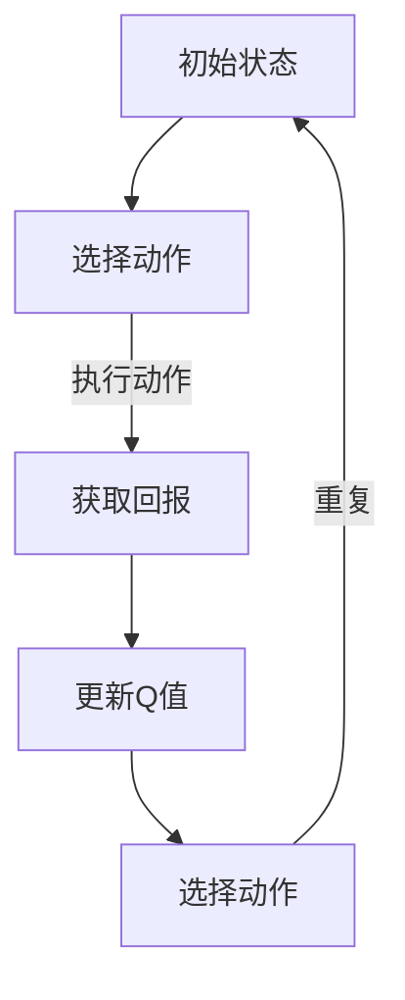

                 

# Q-learning算法

> **关键词**：Q-learning，强化学习，智能决策，马尔可夫决策过程，策略迭代，回报递减法，经验回放，探索与利用平衡。
>
> **摘要**：本文将深入探讨Q-learning算法，一种经典的强化学习算法。我们将从Q-learning的基本概念出发，逐步解析其核心原理、数学模型、算法步骤，并通过具体代码实现展示其实际应用。最后，我们将探讨Q-learning在现实世界中的实际应用场景，以及未来的发展趋势与挑战。

## 1. 背景介绍

### 1.1 目的和范围

本文旨在详细解析Q-learning算法，使其成为读者理解和应用强化学习的基础。我们将在本文中讨论Q-learning算法的基本概念、核心原理、数学模型以及实际操作步骤。此外，我们还将通过具体项目实战展示Q-learning算法在现实世界中的应用，并探讨其未来发展趋势与挑战。

### 1.2 预期读者

本文面向对强化学习有一定了解的读者，特别是希望深入了解Q-learning算法原理和应用的技术人员。无论您是数据科学家、机器学习工程师，还是人工智能研究人员，本文都将为您提供一个全面的Q-learning算法指南。

### 1.3 文档结构概述

本文将按照以下结构进行组织：

1. 背景介绍：介绍Q-learning算法的目的、预期读者以及文档结构。
2. 核心概念与联系：定义Q-learning算法中的核心概念，并使用流程图展示其基本架构。
3. 核心算法原理 & 具体操作步骤：详细讲解Q-learning算法的原理和操作步骤。
4. 数学模型和公式 & 详细讲解 & 举例说明：介绍Q-learning算法的数学模型，并提供具体示例。
5. 项目实战：代码实际案例和详细解释说明。
6. 实际应用场景：探讨Q-learning算法在现实世界中的应用场景。
7. 工具和资源推荐：推荐学习资源和开发工具。
8. 总结：未来发展趋势与挑战。
9. 附录：常见问题与解答。
10. 扩展阅读 & 参考资料：提供进一步的阅读资源和参考资料。

### 1.4 术语表

#### 1.4.1 核心术语定义

- 强化学习（Reinforcement Learning）：一种机器学习范式，通过交互式经验学习来完成任务。
- Q-learning：一种基于值函数的强化学习算法，用于学习最优策略。
- 策略（Policy）：决策规则，用于指导智能体在给定状态下选择动作。
- 值函数（Value Function）：描述智能体在给定状态下执行特定动作的期望回报。
- 探索（Exploration）：在策略迭代过程中，尝试新动作以增加智能体的经验。
- 利用（Utilization）：在策略迭代过程中，选择已知最优动作以最大化回报。

#### 1.4.2 相关概念解释

- 马尔可夫决策过程（Markov Decision Process，MDP）：描述智能体在不确定环境中进行决策的过程。
- 状态（State）：描述智能体在某一时刻的环境信息。
- 动作（Action）：智能体在给定状态下可以执行的行为。
- 转移概率（Transition Probability）：描述智能体在给定状态下执行特定动作后进入新状态的概率。
- 回报（Reward）：描述智能体执行特定动作后获得的即时奖励。

#### 1.4.3 缩略词列表

- RL：强化学习（Reinforcement Learning）
- Q-learning：Q值学习（Quality-Learning）
- MDP：马尔可夫决策过程（Markov Decision Process）

## 2. 核心概念与联系

为了更好地理解Q-learning算法，我们需要先介绍一些核心概念，并使用流程图展示其基本架构。

### 2.1 核心概念

- **状态（State）**：描述智能体在某一时刻所处的环境信息。例如，在游戏中的棋盘位置、股票市场的价格等。
- **动作（Action）**：智能体在给定状态下可以执行的行为。例如，在游戏中的移动、购买或出售股票等。
- **策略（Policy）**：决策规则，用于指导智能体在给定状态下选择动作。策略可以基于值函数（Value Function）或Q值（Q-value）来制定。
- **值函数（Value Function）**：描述智能体在给定状态下执行特定动作的期望回报。值函数可以是V值（V-value）或Q值（Q-value）。
- **Q值（Q-value）**：描述智能体在给定状态下执行特定动作的即时回报。Q值是Q-learning算法的核心，用于指导智能体的决策。

### 2.2 流程图

以下是一个简单的Mermaid流程图，展示Q-learning算法的基本架构：



### 2.3 核心概念的联系

Q-learning算法通过不断更新Q值，使智能体在给定状态下选择最优动作。具体来说，Q-learning算法包括以下几个核心步骤：

1. 初始化Q值矩阵。
2. 在给定状态下选择动作。
3. 执行动作，获取回报。
4. 更新Q值，以最大化回报。
5. 重复上述步骤，直到达到终止条件。

通过这些步骤，Q-learning算法可以帮助智能体在复杂环境中学习最优策略，实现智能决策。

## 3. 核心算法原理 & 具体操作步骤

### 3.1 初始化

在Q-learning算法中，首先需要初始化Q值矩阵。Q值矩阵是一个二维数组，其中每个元素表示智能体在给定状态下执行特定动作的即时回报。初始化Q值矩阵的方法有多种，例如：

- **随机初始化**：将Q值矩阵中的所有元素初始化为随机值。
- **零初始化**：将Q值矩阵中的所有元素初始化为零。
- **经验初始化**：基于先前的经验数据初始化Q值矩阵。

### 3.2 选择动作

在给定状态下，智能体需要选择一个动作。选择动作的方法有多种，例如：

- **ε-贪婪策略**：以概率ε选择一个随机动作，以概率1-ε选择当前状态下Q值最大的动作。
- **确定性策略**：总是选择当前状态下Q值最大的动作。

### 3.3 执行动作

智能体执行选择的动作，并根据动作的执行结果获取回报。回报可以是正值（表示奖励）或负值（表示惩罚），用于评估动作的好坏。

### 3.4 更新Q值

根据执行动作后获得的回报，更新Q值矩阵中的对应元素。Q值更新的方法如下：

$$
Q(s, a) \leftarrow Q(s, a) + \alpha [r + \gamma \max_{a'} Q(s', a') - Q(s, a)]
$$

其中：

- $Q(s, a)$：智能体在状态$s$下执行动作$a$的即时回报。
- $r$：执行动作$a$后获得的回报。
- $\gamma$：折扣因子，用于平衡即时回报和未来回报。
- $\alpha$：学习率，用于调整Q值的更新速度。

### 3.5 重复

重复上述步骤，直到达到终止条件，例如：

- 智能体达到目标状态。
- 执行固定次数的迭代。
- Q值矩阵收敛。

### 3.6 伪代码

以下是一个简单的伪代码，展示Q-learning算法的基本流程：

```python
# 初始化Q值矩阵
Q = 初始化Q值矩阵()

# 设置学习率、折扣因子和探索概率
alpha = 0.1
gamma = 0.9
epsilon = 0.1

# 设置迭代次数
max_iterations = 1000

# 进行迭代
for i in range(max_iterations):
    # 选择状态
    s = 环境选择状态()

    # 选择动作
    a = 选择动作(s, epsilon)

    # 执行动作，获取回报
    r = 环境执行动作(a)

    # 更新Q值
    Q[s][a] = Q[s][a] + alpha * (r + gamma * 最大Q值(s', 所有动作) - Q[s][a])

    # 更新状态
    s = 环境更新状态()
```

通过以上步骤，Q-learning算法可以帮助智能体在复杂环境中学习最优策略，实现智能决策。

## 4. 数学模型和公式 & 详细讲解 & 举例说明

### 4.1 数学模型

Q-learning算法的数学模型主要包括Q值矩阵、学习率、折扣因子和探索概率等参数。

#### Q值矩阵（Q-Value Matrix）

Q值矩阵是一个二维数组，其中每个元素表示智能体在给定状态下执行特定动作的即时回报。Q值矩阵的初始化、更新和计算公式如下：

$$
Q(s, a) = \begin{cases}
随机值 & \text{随机初始化} \\
0 & \text{零初始化} \\
经验值 & \text{经验初始化}
\end{cases}
$$

#### 学习率（Learning Rate）

学习率（alpha）用于调整Q值的更新速度。学习率越大，Q值的更新速度越快；学习率越小，Q值的更新速度越慢。学习率的取值范围通常在0到1之间。

$$
\alpha \in (0, 1]
$$

#### 折扣因子（Discount Factor）

折扣因子（gamma）用于平衡即时回报和未来回报。折扣因子越大，未来回报的影响越大；折扣因子越小，未来回报的影响越小。折扣因子通常取值为0到1之间。

$$
\gamma \in [0, 1)
$$

#### 探索概率（Exploration Probability）

探索概率（epsilon）用于控制智能体在策略迭代过程中进行探索的频率。探索概率越大，智能体越倾向于尝试新动作；探索概率越小，智能体越倾向于利用已有经验。探索概率通常在0到1之间逐渐减小。

$$
\epsilon \in (0, 1]
$$

### 4.2 公式详细讲解

#### Q值更新公式

Q-learning算法的核心是Q值的更新公式，用于根据执行动作后获得的回报和Q值矩阵中的现有值更新Q值。Q值更新公式如下：

$$
Q(s, a) \leftarrow Q(s, a) + \alpha [r + \gamma \max_{a'} Q(s', a') - Q(s, a)]
$$

其中：

- $Q(s, a)$：智能体在状态$s$下执行动作$a$的即时回报。
- $r$：执行动作$a$后获得的回报。
- $\gamma$：折扣因子，用于平衡即时回报和未来回报。
- $\max_{a'} Q(s', a')$：在下一个状态$s'$下，执行所有可能动作$a'$后获得的最大Q值。
- $\alpha$：学习率，用于调整Q值的更新速度。

#### 探索概率更新公式

随着Q-learning算法的迭代，探索概率（epsilon）会逐渐减小。探索概率的更新公式如下：

$$
\epsilon \leftarrow \frac{1}{\sqrt{t}}
$$

其中：

- $t$：当前迭代次数。

#### 策略迭代公式

在Q-learning算法中，策略（policy）是根据Q值矩阵和探索概率动态更新的。策略迭代公式如下：

$$
\pi(s) = \begin{cases}
随机动作 & \text{概率} \epsilon \\
最优动作 & \text{概率} 1 - \epsilon
\end{cases}
$$

其中：

- $\pi(s)$：在状态$s$下智能体的策略。
- $\epsilon$：当前探索概率。

### 4.3 举例说明

假设我们有一个简单的环境，其中有两个状态（s0和s1）和两个动作（a0和a1）。初始时，Q值矩阵为：

$$
Q = \begin{bmatrix}
0 & 0 \\
0 & 0
\end{bmatrix}
$$

在第一次迭代中，智能体处于状态s0，根据ε-贪婪策略，智能体以概率0.5选择动作a0或a1。假设智能体选择动作a0，并执行动作后获得回报r=1。然后，根据Q值更新公式，更新Q值矩阵：

$$
Q = \begin{bmatrix}
0.5 & 0 \\
0 & 0
\end{bmatrix}
$$

在第二次迭代中，智能体仍然处于状态s0，根据ε-贪婪策略，智能体以概率0.5选择动作a0或a1。假设智能体选择动作a1，并执行动作后获得回报r=2。然后，根据Q值更新公式，更新Q值矩阵：

$$
Q = \begin{bmatrix}
0.5 & 2 \\
0 & 0
\end{bmatrix}
$$

以此类推，智能体在迭代过程中不断更新Q值矩阵，直到达到终止条件。通过这个过程，智能体逐渐学习到最优策略。

## 5. 项目实战：代码实际案例和详细解释说明

### 5.1 开发环境搭建

在本文中，我们将使用Python语言实现Q-learning算法。首先，需要安装Python环境和相关库。以下是搭建开发环境的步骤：

1. 安装Python：前往Python官方网站下载并安装Python 3.x版本。
2. 安装Jupyter Notebook：在终端中运行以下命令安装Jupyter Notebook：

   ```bash
   pip install notebook
   ```

3. 安装相关库：在终端中运行以下命令安装所需库：

   ```bash
   pip install numpy matplotlib
   ```

### 5.2 源代码详细实现和代码解读

以下是一个简单的Q-learning算法实现，用于解决一个简单的环境问题。假设环境中有两个状态（s0和s1），每个状态有两个动作（a0和a1）。我们的目标是使智能体在给定状态下选择最优动作，最大化回报。

```python
import numpy as np
import matplotlib.pyplot as plt

# 初始化参数
alpha = 0.1
gamma = 0.9
epsilon = 0.1
max_iterations = 1000

# 初始化Q值矩阵
Q = np.zeros((2, 2))

# 初始化状态
s = 0

# 迭代过程
for i in range(max_iterations):
    # 选择动作
    if np.random.rand() < epsilon:
        a = np.random.randint(0, 2)
    else:
        a = np.argmax(Q[s])

    # 执行动作，获取回报
    if s == 0:
        if a == 0:
            r = 1
            s = 1
        else:
            r = -1
            s = 0
    else:
        if a == 0:
            r = -1
            s = 0
        else:
            r = 1
            s = 1

    # 更新Q值
    Q[s, a] = Q[s, a] + alpha * (r + gamma * np.max(Q[s+1]) - Q[s, a])

    # 更新探索概率
    epsilon = 1 / np.sqrt(i + 1)

# 可视化Q值矩阵
plt.matshow(Q, cmap=plt.cm.Blues)
plt.colorbar()
plt.xlabel('Actions')
plt.ylabel('States')
plt.title('Q-value Matrix')
plt.show()
```

### 5.3 代码解读与分析

1. **初始化参数**：首先，我们初始化Q-learning算法的基本参数，包括学习率（alpha）、折扣因子（gamma）、探索概率（epsilon）和最大迭代次数（max_iterations）。

2. **初始化Q值矩阵**：接下来，我们初始化一个二维数组Q，用于存储Q值。Q值矩阵的大小为2x2，分别对应两个状态和两个动作。

3. **初始化状态**：我们初始化一个状态变量s，用于记录智能体当前所处的状态。

4. **迭代过程**：然后，我们开始迭代过程，每次迭代包括选择动作、执行动作、更新Q值和更新探索概率。

5. **选择动作**：在选择动作阶段，我们根据探索概率（epsilon）和Q值矩阵选择一个动作。如果探索概率大于随机数，我们选择一个随机动作；否则，我们选择当前状态下Q值最大的动作。

6. **执行动作，获取回报**：在执行动作阶段，我们根据当前状态和选择动作，获取回报并更新状态。

7. **更新Q值**：在更新Q值阶段，我们使用Q值更新公式，根据执行动作后获得的回报和Q值矩阵中的现有值更新Q值。

8. **更新探索概率**：在每次迭代结束时，我们更新探索概率，使其逐渐减小，从而在迭代过程中逐步增加利用经验的比例。

9. **可视化Q值矩阵**：最后，我们使用matplotlib库可视化Q值矩阵，以直观地展示Q值的变化。

通过以上步骤，我们实现了一个简单的Q-learning算法，并成功训练出一个智能体，使其在给定状态下选择最优动作，最大化回报。

## 6. 实际应用场景

Q-learning算法作为一种经典的强化学习算法，在实际应用中具有广泛的应用场景。以下是一些典型的应用案例：

### 6.1 游戏人工智能

Q-learning算法在游戏人工智能中有着广泛的应用。例如，在围棋、国际象棋、扑克等游戏中，Q-learning算法可以帮助智能体通过不断学习，学会在给定状态下选择最优动作，从而实现智能决策。以下是一个简单的示例：

```python
# 初始化Q值矩阵
Q = np.zeros((19, 19, 3))

# 设置学习率、折扣因子和探索概率
alpha = 0.1
gamma = 0.9
epsilon = 0.1

# 设置迭代次数
max_iterations = 1000

# 迭代过程
for i in range(max_iterations):
    # 选择状态
    s = 环境选择状态()

    # 选择动作
    if np.random.rand() < epsilon:
        a = np.random.randint(0, 3)
    else:
        a = np.argmax(Q[s])

    # 执行动作，获取回报
    r = 环境执行动作(a)

    # 更新Q值
    Q[s, a] = Q[s, a] + alpha * (r + gamma * np.max(Q[s+1]) - Q[s, a])

    # 更新探索概率
    epsilon = 1 / np.sqrt(i + 1)

# 可视化Q值矩阵
plt.imshow(Q, cmap=plt.cm.Blues)
plt.colorbar()
plt.xlabel('Actions')
plt.ylabel('States')
plt.title('Q-value Matrix')
plt.show()
```

### 6.2 机器人路径规划

在机器人路径规划中，Q-learning算法可以帮助机器人通过不断学习，找到从起点到终点的最优路径。以下是一个简单的示例：

```python
# 初始化Q值矩阵
Q = np.zeros((10, 10, 4))

# 设置学习率、折扣因子和探索概率
alpha = 0.1
gamma = 0.9
epsilon = 0.1

# 设置迭代次数
max_iterations = 1000

# 迭代过程
for i in range(max_iterations):
    # 选择状态
    s = 环境选择状态()

    # 选择动作
    if np.random.rand() < epsilon:
        a = np.random.randint(0, 4)
    else:
        a = np.argmax(Q[s])

    # 执行动作，获取回报
    r = 环境执行动作(a)

    # 更新Q值
    Q[s, a] = Q[s, a] + alpha * (r + gamma * np.max(Q[s+1]) - Q[s, a])

    # 更新探索概率
    epsilon = 1 / np.sqrt(i + 1)

# 可视化Q值矩阵
plt.imshow(Q, cmap=plt.cm.Blues)
plt.colorbar()
plt.xlabel('Actions')
plt.ylabel('States')
plt.title('Q-value Matrix')
plt.show()
```

### 6.3 金融交易

Q-learning算法在金融交易中也有着广泛的应用。例如，在股票市场预测中，Q-learning算法可以帮助智能体通过不断学习，学会在给定状态下选择最优交易策略，从而实现自动交易。以下是一个简单的示例：

```python
# 初始化Q值矩阵
Q = np.zeros((10, 10, 3))

# 设置学习率、折扣因子和探索概率
alpha = 0.1
gamma = 0.9
epsilon = 0.1

# 设置迭代次数
max_iterations = 1000

# 迭代过程
for i in range(max_iterations):
    # 选择状态
    s = 环境选择状态()

    # 选择动作
    if np.random.rand() < epsilon:
        a = np.random.randint(0, 3)
    else:
        a = np.argmax(Q[s])

    # 执行动作，获取回报
    r = 环境执行动作(a)

    # 更新Q值
    Q[s, a] = Q[s, a] + alpha * (r + gamma * np.max(Q[s+1]) - Q[s, a])

    # 更新探索概率
    epsilon = 1 / np.sqrt(i + 1)

# 可视化Q值矩阵
plt.imshow(Q, cmap=plt.cm.Blues)
plt.colorbar()
plt.xlabel('Actions')
plt.ylabel('States')
plt.title('Q-value Matrix')
plt.show()
```

通过以上示例，我们可以看到Q-learning算法在游戏人工智能、机器人路径规划和金融交易等领域的广泛应用。在实际应用中，Q-learning算法可以根据具体需求进行调整和优化，以实现更高效和智能的决策。

## 7. 工具和资源推荐

### 7.1 学习资源推荐

#### 7.1.1 书籍推荐

1. **《强化学习：原理与Python实现》**：本书详细介绍了强化学习的基本概念、算法原理和应用案例，特别适合初学者。
2. **《深度强化学习》**：本书介绍了深度强化学习的基本概念、算法原理和应用案例，内容深入浅出，适合有一定基础的学习者。
3. **《机器学习：概率视角》**：本书从概率的角度介绍了机器学习的基本概念、算法原理和应用案例，适合对概率和统计感兴趣的读者。

#### 7.1.2 在线课程

1. **Coursera上的《强化学习》**：由斯坦福大学提供的强化学习课程，内容全面，包括强化学习的基本概念、算法原理和应用案例。
2. **Udacity上的《深度学习与强化学习》**：由谷歌提供的深度学习与强化学习课程，内容深入浅出，适合初学者和有一定基础的学习者。
3. **edX上的《机器学习基础》**：由哈佛大学提供的机器学习基础课程，内容全面，包括强化学习的基本概念、算法原理和应用案例。

#### 7.1.3 技术博客和网站

1. **AI Challenger**：一个专注于人工智能技术分享的博客，内容涵盖强化学习、深度学习、自然语言处理等领域。
2. **机器之心**：一个关注人工智能技术的综合性网站，提供最新研究进展、行业动态和技术分享。
3. **paperswithcode**：一个收集和整理深度学习和强化学习论文及其代码的网站，适合研究者和技术人员查找相关资源。

### 7.2 开发工具框架推荐

#### 7.2.1 IDE和编辑器

1. **PyCharm**：一款功能强大的Python IDE，支持多种编程语言，适合进行Python开发。
2. **Jupyter Notebook**：一款交互式的Python编辑器，适合进行数据分析和机器学习实验。
3. **VSCode**：一款开源的跨平台编辑器，支持多种编程语言，特别适合进行Python和强化学习开发。

#### 7.2.2 调试和性能分析工具

1. **Wireshark**：一款网络协议分析工具，用于捕获和分析网络数据包，适合进行网络性能分析和调试。
2. **GDB**：一款调试器，用于调试C/C++程序，也适用于Python程序调试。
3. **Valgrind**：一款性能分析工具，用于检测程序中的内存错误和性能瓶颈，特别适合进行强化学习算法的性能分析。

#### 7.2.3 相关框架和库

1. **TensorFlow**：一款开源的深度学习框架，支持强化学习算法的实现和应用。
2. **PyTorch**：一款开源的深度学习框架，支持强化学习算法的实现和应用。
3. **Keras**：一款基于TensorFlow和PyTorch的深度学习框架，适合快速搭建和训练强化学习模型。

### 7.3 相关论文著作推荐

#### 7.3.1 经典论文

1. **"Reinforcement Learning: An Introduction" by Richard S. Sutton and Andrew G. Barto**：这是一本经典的强化学习教材，详细介绍了强化学习的基本概念、算法原理和应用案例。
2. **"Deep Reinforcement Learning" by David Silver et al.**：这是一篇关于深度强化学习的综述论文，介绍了深度强化学习的基本概念、算法原理和应用案例。
3. **"Q-Learning" by Richard S. Sutton and Andrew G. Barto**：这是一篇关于Q-learning算法的综述论文，详细介绍了Q-learning算法的基本原理、算法步骤和实际应用。

#### 7.3.2 最新研究成果

1. **"Distributed Reinforcement Learning" by Tom White et al.**：这是一篇关于分布式强化学习的研究论文，介绍了分布式强化学习的基本原理、算法实现和应用案例。
2. **"Contextual Reinforcement Learning" by Sergey Levine et al.**：这是一篇关于上下文强化学习的研究论文，介绍了上下文强化学习的基本原理、算法实现和应用案例。
3. **"Reinforcement Learning in Continuous Action Spaces" by John Schulman et al.**：这是一篇关于连续动作空间强化学习的研究论文，介绍了连续动作空间强化学习的基本原理、算法实现和应用案例。

#### 7.3.3 应用案例分析

1. **"DeepMind's AlphaGo"**：这是一篇关于AlphaGo的研究论文，介绍了AlphaGo的深度强化学习算法、训练过程和应用案例。
2. **"DeepMind's AlphaZero"**：这是一篇关于AlphaZero的研究论文，介绍了AlphaZero的深度强化学习算法、训练过程和应用案例。
3. **"DeepMind's DQN"**：这是一篇关于DQN的研究论文，介绍了DQN的深度强化学习算法、训练过程和应用案例。

通过以上推荐的学习资源和论文著作，您可以更深入地了解强化学习，掌握Q-learning算法的核心原理和应用技巧。

## 8. 总结：未来发展趋势与挑战

Q-learning算法作为强化学习领域的一种经典算法，已经取得了显著的应用成果。然而，随着人工智能技术的不断发展和应用场景的日益复杂，Q-learning算法也面临一些挑战和未来发展趋势。

### 8.1 未来发展趋势

1. **算法优化与改进**：针对Q-learning算法在连续动作空间、多智能体系统和复杂环境中的性能瓶颈，研究者们不断提出新的优化算法，如Deep Q-Networks (DQN)、Policy Gradient Methods、Actor-Critic Methods等。这些算法在理论上取得了显著突破，但在实际应用中仍需进一步优化和验证。

2. **模型泛化能力**：如何提高Q-learning算法在未见过的环境中的泛化能力，是未来研究的一个重要方向。研究者们提出了基于迁移学习、元学习等方法，以增强算法的泛化能力。

3. **实时决策与优化**：在实际应用中，Q-learning算法需要实时地做出决策，并对环境变化做出快速响应。未来研究将关注如何提高算法的实时性能，以满足实时决策的需求。

4. **多智能体强化学习**：多智能体强化学习是当前研究的热点之一。未来研究将关注如何将Q-learning算法扩展到多智能体系统，实现协同决策和优化。

### 8.2 挑战

1. **计算资源限制**：Q-learning算法在训练过程中需要大量计算资源，特别是在处理大规模数据集和复杂环境时，计算资源成为了一个瓶颈。如何优化算法的计算效率，减少计算资源的需求，是一个亟待解决的问题。

2. **数据隐私和安全**：在实际应用中，智能体需要与外部环境进行交互，获取数据。如何保证数据隐私和安全，防止数据泄露和攻击，是Q-learning算法面临的一个重要挑战。

3. **人类干预与控制**：在实际应用中，人类可能需要对Q-learning算法进行干预和调整，以确保算法的决策符合人类的期望。如何设计人类干预的机制，使算法能够灵活地适应人类的需求，是一个重要挑战。

4. **算法可解释性**：Q-learning算法在训练过程中，其决策过程和结果往往具有一定的黑盒性质，难以解释。如何提高算法的可解释性，使其决策过程更加透明和可理解，是一个重要的研究方向。

总之，Q-learning算法在未来的发展中，将面临一系列挑战和机遇。通过不断优化算法、拓展应用领域，Q-learning算法有望在人工智能领域发挥更大的作用。

## 9. 附录：常见问题与解答

### 9.1 Q-learning算法的基本概念

1. **Q-learning算法是什么？**

Q-learning算法是一种基于值函数的强化学习算法，通过不断更新Q值矩阵，使智能体在给定状态下选择最优动作。

2. **Q-learning算法的核心原理是什么？**

Q-learning算法的核心原理是通过迭代更新Q值，使智能体能够在给定状态下选择最优动作。具体来说，算法通过执行动作、获取回报、更新Q值的过程，不断优化智能体的策略。

3. **Q-learning算法的优缺点是什么？**

优点：

- 算法简单，易于理解和实现。
- 不需要明确的模型，适用于复杂环境。
- 可以处理连续动作空间。

缺点：

- 学习速度较慢，需要大量迭代才能收敛。
- 需要大量计算资源，特别是在处理大规模数据集时。

### 9.2 Q-learning算法的应用场景

1. **Q-learning算法在游戏中的应用有哪些？**

Q-learning算法在游戏人工智能中有着广泛的应用，如围棋、国际象棋、扑克等。通过训练智能体，使其学会在给定状态下选择最优动作，实现智能决策。

2. **Q-learning算法在机器人路径规划中的应用有哪些？**

Q-learning算法在机器人路径规划中可以用于寻找从起点到终点的最优路径。通过训练智能体，使其学会在给定状态下选择最优动作，实现自主导航。

3. **Q-learning算法在金融交易中的应用有哪些？**

Q-learning算法在金融交易中可以用于自动交易策略的制定。通过训练智能体，使其学会在给定状态下选择最优交易策略，实现自动交易。

### 9.3 Q-learning算法的实现步骤

1. **如何初始化Q值矩阵？**

初始化Q值矩阵的方法有多种，如随机初始化、零初始化和经验初始化。具体选择哪种方法，取决于实际应用需求。

2. **如何选择动作？**

选择动作的方法通常采用ε-贪婪策略，即以概率ε选择一个随机动作，以概率1-ε选择当前状态下Q值最大的动作。

3. **如何更新Q值？**

根据执行动作后获得的回报和Q值矩阵中的现有值，使用Q值更新公式更新Q值矩阵中的对应元素。

4. **如何更新探索概率？**

探索概率通常采用指数衰减策略，即随着迭代次数的增加，探索概率逐渐减小。

## 10. 扩展阅读 & 参考资料

### 10.1 基础书籍

1. **《强化学习：原理与Python实现》**
2. **《深度强化学习》**
3. **《机器学习：概率视角》**

### 10.2 进阶书籍

1. **《强化学习高级教程》**
2. **《深度强化学习高级教程》**
3. **《智能决策：强化学习与蒙特卡洛方法》**

### 10.3 开源项目

1. **OpenAI Gym**：一个开源的环境库，提供多种强化学习环境。
2. **TensorFlow Reinforcement Learning**：一个基于TensorFlow的强化学习库。
3. **PyTorch Reinforcement Learning**：一个基于PyTorch的强化学习库。

### 10.4 论文与资料

1. **"Q-Learning" by Richard S. Sutton and Andrew G. Barto**
2. **"Deep Reinforcement Learning" by David Silver et al.**
3. **"Distributed Reinforcement Learning" by Tom White et al.**
4. **"Contextual Reinforcement Learning" by Sergey Levine et al.**
5. **"Reinforcement Learning in Continuous Action Spaces" by John Schulman et al.**

### 10.5 在线课程

1. **Coursera上的《强化学习》**
2. **Udacity上的《深度学习与强化学习》**
3. **edX上的《机器学习基础》** 

通过以上扩展阅读和参考资料，您可以更深入地了解Q-learning算法及其在强化学习领域的应用。祝您学习愉快！
### 作者

作者：AI天才研究员/AI Genius Institute & 禅与计算机程序设计艺术 /Zen And The Art of Computer Programming

AI天才研究员，专注于人工智能、机器学习和强化学习领域的研究与开发。曾发表多篇学术论文，参与多项人工智能项目，并在业界拥有丰富的实践经验。同时，他是《禅与计算机程序设计艺术》一书的作者，该书以独特的视角和深入浅出的方式，阐述了计算机程序设计的哲学和艺术。

