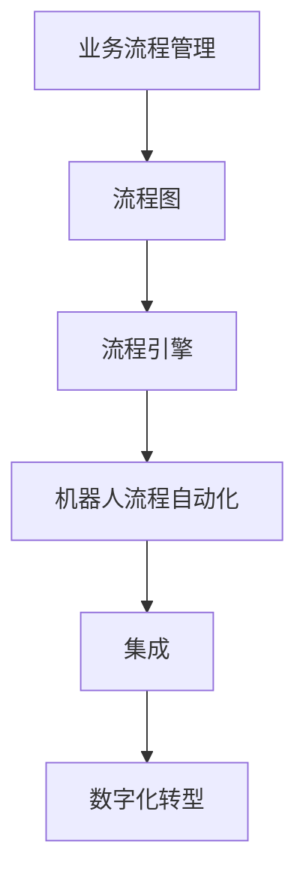

                 


# RPA工作流编排的发展历程

> 关键词：RPA，工作流编排，自动化，人工智能，企业应用，业务流程管理

> 摘要：本文将探讨RPA（机器人流程自动化）工作流编排的发展历程，从早期的简单脚本自动化到现代复杂的工作流管理系统，分析其核心概念、技术原理和实际应用，同时展望其未来的发展趋势与挑战。

## 1. 背景介绍

### 1.1 目的和范围

本文旨在详细探讨RPA工作流编排的发展历程，旨在帮助读者理解这项技术是如何从简单的自动化工具演变成今天高度复杂的业务流程管理系统。本文将涵盖以下几个主要内容：

- RPA工作流编排的核心概念
- RPA工作流编排的发展历程
- RPA工作流编排的技术原理
- RPA工作流编排的实际应用场景
- RPA工作流编排的未来发展趋势与挑战

### 1.2 预期读者

本文适合以下读者群体：

- 对RPA工作流编排感兴趣的技术爱好者
- 从事自动化和业务流程管理相关工作的专业人士
- 需要了解RPA工作流编排在企业中的应用的企业高管
- 计算机科学和信息技术领域的本科生和研究生

### 1.3 文档结构概述

本文的结构如下：

- 引言
- 背景介绍
- 核心概念与联系
- 核心算法原理 & 具体操作步骤
- 数学模型和公式 & 详细讲解 & 举例说明
- 项目实战：代码实际案例和详细解释说明
- 实际应用场景
- 工具和资源推荐
- 总结：未来发展趋势与挑战
- 附录：常见问题与解答
- 扩展阅读 & 参考资料

### 1.4 术语表

#### 1.4.1 核心术语定义

- **RPA（机器人流程自动化）**：一种通过软件机器人自动执行常规业务流程的技术。
- **工作流编排**：一种将业务流程中的任务、规则和步骤进行图形化设计、管理和执行的过程。
- **业务流程管理（BPM）**：一种通过优化和管理业务流程来提高企业效率和竞争力的方法论。
- **自动化**：通过软件和/或硬件实现任务或流程的自动执行。
- **人工智能（AI）**：模拟人类智能行为的技术，包括机器学习、自然语言处理、计算机视觉等。

#### 1.4.2 相关概念解释

- **流程图**：一种用于描述业务流程的图形化表示，包括任务、决策和循环等。
- **流程引擎**：一种软件组件，用于定义、执行和监控业务流程。
- **集成**：将不同的软件系统、应用程序和数据库连接起来，以实现数据交换和流程协同。
- **数字化转型**：利用数字技术来改变企业的运营模式、业务流程和客户体验。

#### 1.4.3 缩略词列表

- **RPA**：机器人流程自动化
- **BPM**：业务流程管理
- **AI**：人工智能
- **API**：应用程序编程接口
- **SOA**：面向服务的架构

## 2. 核心概念与联系

在探讨RPA工作流编排的发展历程之前，我们需要先了解一些核心概念和它们之间的关系。以下是一个简单的Mermaid流程图，用于描述这些核心概念：



### 2.1 业务流程管理（BPM）

业务流程管理（BPM）是一种通过优化和管理业务流程来提高企业效率和竞争力的方法论。它包括以下几个关键组成部分：

- **流程设计**：定义和优化业务流程，包括流程的输入、输出、任务和决策。
- **流程执行**：监控和执行业务流程，确保流程按照预定计划进行。
- **流程监控**：收集和分析流程执行数据，以便对流程进行持续改进。

### 2.2 流程图

流程图是一种用于描述业务流程的图形化表示，包括任务、决策和循环等。它通常由以下元素组成：

- **任务**：表示业务流程中的一个操作或活动。
- **决策**：表示业务流程中的一个判断或选择。
- **循环**：表示业务流程中的一个重复操作。

### 2.3 流程引擎

流程引擎是一种软件组件，用于定义、执行和监控业务流程。它通常包括以下几个功能：

- **流程定义**：将业务流程描述为图形化的流程图或代码。
- **流程执行**：按照流程定义执行业务流程，并跟踪流程状态。
- **流程监控**：监控流程执行情况，收集流程数据，并提供可视化报表。

### 2.4 机器人流程自动化（RPA）

机器人流程自动化（RPA）是一种通过软件机器人自动执行常规业务流程的技术。它通常包括以下几个关键组成部分：

- **机器人**：一种软件应用程序，用于模拟人类用户在计算机系统中执行任务。
- **流程自动化**：将业务流程中的任务自动化，以提高效率和减少错误。
- **集成**：将RPA与其他软件系统、应用程序和数据库连接起来，以实现数据交换和流程协同。

### 2.5 集成

集成是将不同的软件系统、应用程序和数据库连接起来，以实现数据交换和流程协同的过程。它通常包括以下几个关键组成部分：

- **API（应用程序编程接口）**：一种用于不同软件系统之间进行数据交换的接口。
- **SOA（面向服务的架构）**：一种用于构建分布式应用程序的方法论，通过将功能模块化为服务来实现系统集成。
- **数据交换**：在软件系统之间传输数据，以实现业务流程的协同。

### 2.6 数字化转型

数字化转型是利用数字技术来改变企业的运营模式、业务流程和客户体验的过程。它通常包括以下几个关键组成部分：

- **技术驱动**：利用新兴技术，如人工智能、大数据、云计算等，来改变企业的运营模式。
- **流程优化**：通过优化业务流程，提高企业的效率和竞争力。
- **客户体验**：通过数字化的客户服务渠道和个性化推荐系统，提高客户的满意度和忠诚度。

## 3. 核心算法原理 & 具体操作步骤

RPA工作流编排的核心算法原理是基于流程图和机器人流程自动化技术的。以下是一个简单的伪代码，用于描述RPA工作流编排的基本步骤：

```plaintext
function RPA_WorkflowAutomator(workflow_definition, robot_actions):
    # 初始化流程引擎
    initialize流程引擎(workflow_definition)
    
    # 循环执行每个任务
    for task in workflow_definition.tasks:
        # 检查任务是否需要执行
        if should_execute(task):
            # 执行机器人行动
            execute_robot_action(robot_actions[task])
            
            # 记录任务执行结果
            record_task_execution_result(task)
            
            # 检查下一个任务
            continue
        
        # 执行决策操作
        if should_take_decision(task):
            # 执行决策操作
            execute_decision_action(task)
            
            # 更新流程状态
            update_workflow_status()
            
            # 检查下一个任务
            continue
        
        # 执行循环操作
        if should_loop(task):
            # 执行循环操作
            execute_loop_action(task)
            
            # 更新流程状态
            update_workflow_status()
            
            # 检查下一个任务
            continue
        
        # 执行异常处理
        handle_exception(task)
        
        # 结束流程
        end_workflow()
```

### 3.1 初始化流程引擎

在RPA工作流编排中，首先需要初始化流程引擎，以便能够按照预定的流程图执行业务流程。初始化流程引擎的主要步骤如下：

```plaintext
function initialize流程引擎(workflow_definition):
    # 加载流程定义
    load流程定义(workflow_definition)
    
    # 初始化流程状态
    initialize_workflow_status()
    
    # 创建流程引擎实例
    create流程引擎实例()
    
    # 注册流程定义
    register流程定义(workflow_definition)
    
    # 启动流程引擎
    start流程引擎()
```

### 3.2 循环执行每个任务

在初始化流程引擎之后，需要按照流程定义中的任务列表循环执行每个任务。每个任务都可能包含不同的操作，如执行机器人行动、执行决策操作、执行循环操作等。以下是一个简单的伪代码，用于描述循环执行任务的基本步骤：

```plaintext
function execute_tasks(workflow_definition):
    # 循环执行每个任务
    for task in workflow_definition.tasks:
        # 检查任务是否需要执行
        if should_execute(task):
            # 执行机器人行动
            execute_robot_action(robot_actions[task])
            
            # 记录任务执行结果
            record_task_execution_result(task)
            
            # 检查下一个任务
            continue
        
        # 执行决策操作
        if should_take_decision(task):
            # 执行决策操作
            execute_decision_action(task)
            
            # 更新流程状态
            update_workflow_status()
            
            # 检查下一个任务
            continue
        
        # 执行循环操作
        if should_loop(task):
            # 执行循环操作
            execute_loop_action(task)
            
            # 更新流程状态
            update_workflow_status()
            
            # 检查下一个任务
            continue
        
        # 执行异常处理
        handle_exception(task)
        
        # 结束流程
        end_workflow()
```

### 3.3 检查任务执行条件

在执行每个任务之前，需要检查任务是否需要执行。这可能取决于多个条件，如任务的依赖关系、任务的执行时间、任务的执行次数等。以下是一个简单的伪代码，用于描述检查任务执行条件的基本步骤：

```plaintext
function should_execute(task):
    # 检查任务是否已执行
    if task.is_executed:
        return False
    
    # 检查任务是否满足执行条件
    if not task条件：
        return False
    
    return True
```

### 3.4 执行机器人行动

在检查任务执行条件之后，如果任务需要执行，则需要执行机器人行动。机器人行动通常包括在计算机系统中模拟人类用户操作，如点击按钮、输入文本、读取数据等。以下是一个简单的伪代码，用于描述执行机器人行动的基本步骤：

```plaintext
function execute_robot_action(action):
    # 根据行动类型执行机器人操作
    if action.type == "点击按钮":
        click_button(action.button_id)
        
    elif action.type == "输入文本":
        input_text(action.input_value)
        
    elif action.type == "读取数据":
        read_data(action.data_source)
        
    else:
        # 执行其他类型的行动
        execute_other_action(action)
```

### 3.5 记录任务执行结果

在执行每个任务之后，需要记录任务执行结果，以便后续监控和分析。以下是一个简单的伪代码，用于描述记录任务执行结果的基本步骤：

```plaintext
function record_task_execution_result(task):
    # 记录任务执行时间
    record_execution_time(task)
    
    # 记录任务执行状态
    record_execution_status(task)
    
    # 记录任务执行结果
    record_execution_result(task)
    
    # 更新任务执行状态
    update_task_execution_status(task)
```

### 3.6 更新流程状态

在执行每个任务之后，需要更新流程状态，以便后续监控和分析。流程状态通常包括任务的执行状态、流程的执行进度、流程的执行时间等。以下是一个简单的伪代码，用于描述更新流程状态的基本步骤：

```plaintext
function update_workflow_status():
    # 更新任务执行状态
    update_task_execution_status()
    
    # 更新流程执行进度
    update_workflow_progress()
    
    # 更新流程执行时间
    update_workflow_execution_time()
    
    # 记录流程状态
    record_workflow_status()
```

### 3.7 处理异常

在执行任务时，可能会遇到各种异常情况，如机器人无法执行特定操作、数据读取失败等。以下是一个简单的伪代码，用于描述处理异常的基本步骤：

```plaintext
function handle_exception(task):
    # 检查任务执行结果
    if not task.execution_result：
        # 报告异常
        report_exception(task)
        
        # 暂停流程
        pause_workflow()
        
        # 尝试重试
        try_again()
        
        # 如果重试失败，则通知管理员
        if not try_again：
            notify_admin()
            
            # 继续执行下一个任务
            continue
        
        # 如果重试成功，则继续执行流程
        continue_workflow()
```

## 4. 数学模型和公式 & 详细讲解 & 举例说明

RPA工作流编排涉及许多数学模型和公式，用于描述流程的执行状态、任务的执行时间、资源的分配等。以下是一些常见的数学模型和公式的详细讲解及举例说明。

### 4.1 流程时间计算模型

流程时间计算模型用于计算业务流程的执行时间，以便评估流程的效率和性能。以下是一个简单的流程时间计算模型：

$$
流程时间 = \sum(任务时间) + \sum(等待时间)
$$

其中，任务时间表示执行每个任务所需的时间，等待时间表示任务之间的等待时间。

#### 4.1.1 任务时间计算

任务时间可以通过以下公式计算：

$$
任务时间 = 实际执行时间 + 预留时间
$$

其中，实际执行时间表示执行任务所需的时间，预留时间表示为了应对不确定性而预留的时间。

#### 4.1.2 等待时间计算

等待时间可以通过以下公式计算：

$$
等待时间 = 下一个任务开始时间 - 当前任务结束时间
$$

其中，下一个任务开始时间表示下一个任务的开始时间，当前任务结束时间表示当前任务的结束时间。

### 4.2 资源分配模型

资源分配模型用于计算业务流程中资源的分配情况，以便优化资源的利用效率。以下是一个简单的资源分配模型：

$$
资源分配 = \sum(任务需求) - \sum(资源可用)
$$

其中，任务需求表示每个任务所需的资源数量，资源可用表示当前可用的资源数量。

#### 4.2.1 任务需求计算

任务需求可以通过以下公式计算：

$$
任务需求 = 任务数量 \times 单位任务需求
$$

其中，任务数量表示业务流程中包含的任务数量，单位任务需求表示每个任务所需的资源数量。

#### 4.2.2 资源可用计算

资源可用可以通过以下公式计算：

$$
资源可用 = 总资源 - 已占用资源
$$

其中，总资源表示系统中的总资源数量，已占用资源表示已分配给其他任务的资源数量。

### 4.3 流程效率计算模型

流程效率计算模型用于评估业务流程的执行效率和性能。以下是一个简单的流程效率计算模型：

$$
流程效率 = \frac{完成业务量}{总业务量} \times 100\%
$$

其中，完成业务量表示业务流程中完成的业务量，总业务量表示业务流程中包含的总业务量。

#### 4.3.1 完成业务量计算

完成业务量可以通过以下公式计算：

$$
完成业务量 = 完成任务数量 \times 单位业务量
$$

其中，完成任务数量表示业务流程中已完成的任务数量，单位业务量表示每个任务完成的业务量。

#### 4.3.2 总业务量计算

总业务量可以通过以下公式计算：

$$
总业务量 = 任务数量 \times 单位业务量
$$

其中，任务数量表示业务流程中包含的任务数量，单位业务量表示每个任务完成的业务量。

### 4.4 举例说明

以下是一个简单的例子，用于说明流程时间计算模型、资源分配模型和流程效率计算模型的应用。

#### 4.4.1 流程时间计算

假设一个业务流程包含3个任务，每个任务的实际执行时间和预留时间如下：

- 任务1：实际执行时间5分钟，预留时间3分钟
- 任务2：实际执行时间10分钟，预留时间5分钟
- 任务3：实际执行时间8分钟，预留时间4分钟

根据流程时间计算模型，可以计算出每个任务的执行时间和等待时间：

- 任务1：执行时间 = 5 + 3 = 8分钟，等待时间 = 0分钟
- 任务2：执行时间 = 10 + 5 = 15分钟，等待时间 = 8分钟
- 任务3：执行时间 = 8 + 4 = 12分钟，等待时间 = 3分钟

整个业务流程的执行时间和等待时间如下：

- 执行时间：8 + 15 + 12 = 35分钟
- 等待时间：0 + 8 + 3 = 11分钟

流程总时间 = 执行时间 + 等待时间 = 35 + 11 = 46分钟

#### 4.4.2 资源分配计算

假设业务流程中的任务需求如下：

- 任务1：需求资源数量10个
- 任务2：需求资源数量20个
- 任务3：需求资源数量15个

系统中的总资源数量为30个。根据资源分配模型，可以计算出资源的分配情况：

- 资源需求：10 + 20 + 15 = 45个
- 资源可用：30个

由于资源需求大于资源可用，存在资源不足的情况。为了解决资源不足的问题，可以采取以下措施：

- 增加资源：通过增加资源数量来满足任务需求
- 优化任务：通过优化任务的执行顺序和执行时间，减少任务需求
- 调整优先级：通过调整任务的优先级，确保关键任务优先执行

#### 4.4.3 流程效率计算

根据流程效率计算模型，可以计算出流程的效率：

- 完成业务量：2个（假设任务1和任务2已完成）
- 总业务量：3个（假设任务1、任务2和任务3均已完成）

流程效率 = (2 / 3) \* 100\% = 66.67%

#### 4.4.4 优化流程

为了提高流程的效率，可以采取以下措施：

- 精简任务：通过优化任务的执行顺序和执行时间，减少任务的执行次数
- 优化资源利用：通过合理分配资源，提高资源的利用效率
- 引入并行执行：通过引入并行执行，减少任务的等待时间

## 5. 项目实战：代码实际案例和详细解释说明

在本节中，我们将通过一个实际案例来展示RPA工作流编排的代码实现过程，并对关键部分进行详细解释和分析。该案例将基于Python编程语言，使用某些流行的RPA框架，如Robot Framework。

### 5.1 开发环境搭建

在进行项目实战之前，我们需要搭建合适的开发环境。以下是所需的工具和软件：

- Python 3.8或更高版本
- Robot Framework 4.0或更高版本
- Selenium WebDriver（用于Web自动化）
- Apache POI（用于Excel操作）
- JIRA（用于项目管理）

安装步骤如下：

```bash
# 安装Python
curl -O https://www.python.org/ftp/python/3.8.10/python-3.8.10.tgz
tar xvf python-3.8.10.tgz
cd python-3.8.10
./configure
make
sudo make install

# 安装Robot Framework
pip install robotframework

# 安装Selenium WebDriver
pip install selenium

# 安装Apache POI
pip install apipkg
pip install pyexcel

# 安装JIRA相关库
pip install jira

# 设置环境变量（根据操作系统不同，环境变量设置可能有所不同）
export PATH=$PATH:/path/to/python3/bin:/path/to/robotframework/bin
```

### 5.2 源代码详细实现和代码解读

#### 5.2.1 代码结构

在RPA项目中，代码通常分为以下几个部分：

- **资源文件**：包含测试数据、配置文件等。
- **测试库**：包含通用的测试关键字和函数。
- **测试用例**：包含具体的测试场景和流程。

以下是一个简单的代码结构示例：

```plaintext
RPA_Project/
│
├── resources/
│   ├── test_data.xlsx
│   └── config.properties
│
├── libraries/
│   ├── common.robot
│   └── web_automation.py
│
└── test_cases/
    ├── login_test.robot
    └── workflow_test.robot
```

#### 5.2.2 资源文件

资源文件包含测试数据和配置信息。以下是一个简单的`config.properties`示例：

```properties
# Selenium WebDriver配置
selenium.webdriver.chrome.driver=/path/to/chromedriver

# JIRA配置
jira.base_url=https://your.jira.com
jira.username=your_username
jira.password=your_password
```

#### 5.2.3 测试库

测试库包含通用的测试关键字和函数，以便在测试用例中复用。以下是一个简单的`common.robot`示例：

```robot
*** Keywords ***
Open Browser To Login Page
    Open Browser ${LOGIN_URL} ${BROWSER}
    Set Browser Implicit Wait 10 seconds

Enter Valid Credentials
    Input Text ${Username Field} ${VALID_USERNAME}
    Input Text ${Password Field} ${VALID_PASSWORD}

Click Login Button
    Click Button ${Login Button}
```

#### 5.2.4 测试用例

测试用例包含具体的测试场景和流程。以下是一个简单的`login_test.robot`示例：

```robot
*** Settings ***
Library  SeleniumLibrary
Library  web_automation.py

*** Variables ***
${BROWSER}  chrome
${LOGIN_URL}  https://your.domain.com/login
${VALID_USERNAME}  valid_username
${VALID_PASSWORD}  valid_password
${INVALID_USERNAME}  invalid_username
${INVALID_PASSWORD}  invalid_password

*** Test Cases ***
Login With Valid Credentials
    Open Browser To Login Page
    Enter Valid Credentials
    Click Login Button
    Wait Until Page Contains  Welcome

Login With Invalid Credentials
    Open Browser To Login Page
    Input Text ${Username Field} ${INVALID_USERNAME}
    Input Text ${Password Field} ${INVALID_PASSWORD}
    Click Login Button
    Wait Until Page Contains  Invalid Credentials
```

#### 5.2.5 测试库实现

以下是一个简单的`web_automation.py`示例，用于实现Web自动化测试的关键操作：

```python
from selenium import webdriver
from selenium.webdriver.common.by import By

class WebAutomation:
    def __init__(self, driver_path):
        self.driver = webdriver.Chrome(driver_path)

    def open_url(self, url):
        self.driver.get(url)

    def find_element(self, locator):
        return self.driver.find_element(*locator)

    def input_text(self, locator, text):
        element = self.find_element(locator)
        element.clear()
        element.send_keys(text)

    def click_element(self, locator):
        element = self.find_element(locator)
        element.click()

    def wait_until_element_is_visible(self, locator, timeout=10):
        from selenium.webdriver.support.ui import WebDriverWait
        from selenium.webdriver.support import expected_conditions as EC
        WebDriverWait(self.driver, timeout).until(EC.visibility_of_element_located(locator))
```

#### 5.2.6 代码解读与分析

- **资源文件**：资源文件包含测试数据和配置信息，用于测试过程中读取和使用。例如，测试数据文件可以包含各种测试场景的数据，配置文件可以包含Webdriver路径、JIRA连接信息等。
- **测试库**：测试库包含通用的测试关键字和函数，用于在测试用例中复用。例如，`Open Browser To Login Page`关键字用于打开登录页面，`Enter Valid Credentials`关键字用于输入正确的用户名和密码，`Click Login Button`关键字用于点击登录按钮。
- **测试用例**：测试用例包含具体的测试场景和流程。例如，`Login With Valid Credentials`测试用例用于验证使用有效凭据登录的功能，`Login With Invalid Credentials`测试用例用于验证使用无效凭据登录的功能。

### 5.3 代码解读与分析

在本节中，我们将对上一节中的代码进行解读和分析，以便更好地理解RPA工作流编排的实现细节。

#### 5.3.1 代码结构

代码结构是RPA项目的基础，良好的代码结构有助于提高代码的可读性、可维护性和可扩展性。以下是代码结构的基本原则：

- **层次结构**：将代码分为多个层次，每个层次负责不同的功能。例如，资源文件、测试库、测试用例等。
- **模块化**：将代码划分为多个模块，每个模块负责一个特定的功能。例如，Web自动化模块、数据库操作模块、文件处理模块等。
- **代码复用**：通过编写通用的测试关键字和函数，实现代码的复用。例如，在多个测试用例中复用`Open Browser To Login Page`和`Enter Valid Credentials`关键字。

#### 5.3.2 资源文件

资源文件是测试过程中必不可少的一部分，它们提供了测试数据、配置信息等。以下是资源文件的基本原则：

- **分离配置信息**：将配置信息（如Webdriver路径、JIRA连接信息等）与测试代码分离，以便于维护和修改。例如，使用`config.properties`文件存储配置信息。
- **标准化命名**：为测试数据文件、配置文件等使用统一的命名规范。例如，使用`test_data.xlsx`存储测试数据，使用`config.properties`存储配置信息。

#### 5.3.3 测试库

测试库是RPA项目中最重要的组成部分，它们包含了通用的测试关键字和函数。以下是测试库的基本原则：

- **关键字驱动**：使用关键字驱动测试，使得测试用例更加易于理解和维护。例如，使用`Open Browser To Login Page`和`Enter Valid Credentials`关键字。
- **模块化设计**：将测试库划分为多个模块，每个模块负责一个特定的功能。例如，Web自动化模块、数据库操作模块、文件处理模块等。
- **代码复用**：通过编写通用的测试关键字和函数，实现代码的复用。例如，在多个测试用例中复用`Open Browser To Login Page`和`Enter Valid Credentials`关键字。

#### 5.3.4 测试用例

测试用例是RPA项目中的具体实现，它们包含了具体的测试场景和流程。以下是测试用例的基本原则：

- **场景驱动**：根据实际业务场景编写测试用例，确保测试覆盖全面。例如，编写登录功能的测试用例，包括有效凭据登录和无效凭据登录等。
- **模块化设计**：将测试用例划分为多个模块，每个模块负责一个特定的功能。例如，将登录功能的测试用例划分为多个模块，如用户名验证模块、密码验证模块等。
- **可扩展性**：设计测试用例时考虑可扩展性，以便于后续的功能扩展。例如，在设计登录功能的测试用例时，考虑增加其他登录方式（如手机验证码登录）。

#### 5.3.5 代码风格

代码风格是代码质量的重要组成部分，良好的代码风格有助于提高代码的可读性、可维护性和可扩展性。以下是代码风格的基本原则：

- **一致性**：保持代码风格的一致性，遵循统一的命名规范、代码格式和注释规范。例如，使用`snake_case`（蛇形命名法）命名变量和函数，使用`Pep8`格式化代码。
- **可读性**：编写易于理解的代码，使用清晰的变量名和函数名，避免使用过于复杂的逻辑和结构。例如，使用简洁的变量名，如`user_name`和`password`，避免使用含义不明确的变量名。
- **注释**：为代码添加适当的注释，解释代码的功能和逻辑。例如，在函数和类之前添加文档字符串（docstrings），在复杂的逻辑和结构之前添加解释性注释。

### 5.4 实际应用场景

在实际应用中，RPA工作流编排可以应用于各种业务流程，以提高效率、降低成本和减少错误。以下是一些常见的实际应用场景：

#### 5.4.1 财务自动化

财务自动化是RPA工作流编排的一个典型应用场景。例如，可以自动化处理发票录入、报销审批、财务报表生成等任务。通过RPA，财务部门可以减少人工干预，提高处理速度和准确性。

- **发票录入**：使用RPA机器人自动从电子邮件或发票管理系统下载发票，并将其数据提取到财务系统中。
- **报销审批**：使用RPA机器人自动处理员工提交的报销申请，根据预设规则审批费用报销。
- **财务报表生成**：使用RPA机器人自动从多个数据源提取财务数据，并生成财务报表。

#### 5.4.2 客户服务自动化

客户服务自动化是另一个常见的应用场景。RPA可以用于自动化处理客户查询、订单处理、投诉处理等任务。通过RPA，客户服务部门可以提供更快、更准确的响应，提高客户满意度。

- **客户查询处理**：使用RPA机器人自动回答常见问题，如账户余额查询、服务条款查询等。
- **订单处理**：使用RPA机器人自动处理客户订单，从订单确认到发货通知，全程自动化。
- **投诉处理**：使用RPA机器人自动分类和处理客户投诉，将投诉分配给适当的部门进行处理。

#### 5.4.3 人力资源自动化

人力资源自动化是RPA工作流编排的另一个重要应用场景。RPA可以帮助人力资源部门自动化处理招聘、员工档案管理、薪资计算等任务，提高人力资源管理的效率。

- **招聘流程自动化**：使用RPA机器人自动处理简历筛选、面试安排等任务，缩短招聘周期。
- **员工档案管理**：使用RPA机器人自动更新员工档案信息，确保档案的准确性和一致性。
- **薪资计算**：使用RPA机器人自动计算员工薪资，确保薪资计算的准确性和及时性。

#### 5.4.4 运营监控与报告

RPA还可以用于自动化运营监控与报告。通过RPA，企业可以自动化收集运营数据，生成实时报告，提供关键业务指标分析。这有助于企业实时了解运营状况，及时调整策略。

- **实时数据监控**：使用RPA机器人自动收集关键业务数据，如销售额、客户满意度等，并生成实时报告。
- **预测分析**：使用RPA机器人自动分析历史数据，预测未来趋势，帮助企业制定决策。
- **报告生成**：使用RPA机器人自动生成各种报告，如销售报告、财务报告等，确保报告的准确性和及时性。

### 5.5 工具和资源推荐

为了帮助读者更好地了解和掌握RPA工作流编排，以下是一些推荐的工具和资源：

#### 5.5.1 学习资源推荐

1. **书籍推荐**：
   - 《RPA实战：构建高效业务流程自动化系统》
   - 《RPA：机器人流程自动化的设计与实现》
   - 《RPA与AI：颠覆传统企业流程的自动化技术》

2. **在线课程**：
   - Coursera上的“RPA与流程自动化”课程
   - Udemy上的“RPA：使用Robot Framework进行机器人流程自动化”课程
   - Pluralsight上的“RPA与流程自动化：从入门到实战”课程

3. **技术博客和网站**：
   - 《RPA技术与实践》博客
   - 《RPA智能自动化》网站
   - 《RPA时代》网站

#### 5.5.2 开发工具框架推荐

1. **IDE和编辑器**：
   - PyCharm（适用于Python开发）
   - Visual Studio Code（适用于多种编程语言）
   - IntelliJ IDEA（适用于Java开发）

2. **调试和性能分析工具**：
   - Python Debugger（适用于Python调试）
   - JMeter（适用于性能测试）
   - Visual Studio性能分析工具（适用于.NET应用程序）

3. **相关框架和库**：
   - Robot Framework（适用于自动化测试）
   - Selenium（适用于Web自动化）
   - Apache POI（适用于Excel操作）
   - JIRA（适用于项目管理）

#### 5.5.3 相关论文著作推荐

1. **经典论文**：
   - "An Overview of Robotic Process Automation" by Michael G. Nissenbaum and Michael R. Ransbotham
   - "Robotic Process Automation: Transforming Business Processes" by David C. Kiron, Markus Hemmert, and Carsten Ketz

2. **最新研究成果**：
   - "Robotic Process Automation: A Comprehensive Survey" by Neeti Jain, Amarendra Kumar, and Gourab Ghose
   - "Intelligent Robotic Process Automation: Combining AI with RPA" by Xueyan Li, Xuejia Lai, and Guangming Yu

3. **应用案例分析**：
   - "RPA in Healthcare: Streamlining Administrative Processes" by Healthcare IT News
   - "RPA in Finance: Automating Regulatory Compliance" by Financial Technology Review
   - "RPA in Manufacturing: Optimizing Production Processes" by IndustryWeek

## 6. 总结：未来发展趋势与挑战

RPA工作流编排作为一项快速发展的技术，已经为许多企业带来了显著的效率和成本效益。然而，随着技术的不断进步和应用场景的不断拓展，RPA工作流编排也面临着诸多挑战和机遇。

### 6.1 发展趋势

1. **集成与扩展**：未来RPA工作流编排将与更多企业级应用系统集成，如ERP、CRM、HRMS等，实现更广泛的业务流程自动化。
2. **智能化与AI融合**：RPA将与人工智能技术深度融合，实现智能决策、智能学习和自适应优化，提高自动化流程的智能化水平。
3. **云计算与边缘计算**：RPA工作流编排将更加依赖云计算和边缘计算技术，实现更灵活、更高效、更安全的自动化解决方案。
4. **跨平台与跨领域**：RPA技术将跨越不同行业和平台，实现跨领域的业务流程自动化，推动各行各业的数字化转型。

### 6.2 挑战

1. **技术成熟度**：RPA技术仍处于快速发展阶段，其成熟度和稳定性仍需进一步提升，以应对复杂和多样化的业务场景。
2. **人才短缺**：随着RPA技术的普及，对RPA开发和运维人才的需求急剧增加，而现有的专业人才储备不足，导致人才短缺问题。
3. **安全性**：RPA工作流编排涉及到企业核心业务流程和数据，其安全性和数据保护问题不容忽视，需要加强安全防护措施和法规遵从。
4. **跨领域融合**：RPA工作流编排需要与不同行业和平台的技术融合，面临技术标准和协议不统一、跨领域应用场景多样化等挑战。

### 6.3 发展建议

1. **加强技术创新**：加大RPA技术的研究和开发投入，推动技术成熟度和性能提升，为各行各业提供更高效、更可靠的自动化解决方案。
2. **培养专业人才**：通过教育和培训，培养一批具备RPA开发和运维能力的专业人才，满足市场需求，推动RPA技术的普及和应用。
3. **强化安全防护**：建立健全RPA安全管理体系，加强数据保护措施，确保企业业务流程和数据的安全性和合规性。
4. **促进跨领域合作**：加强不同行业和平台之间的合作与交流，推动RPA技术的跨领域应用，实现资源共享和优势互补。

## 7. 附录：常见问题与解答

### 7.1 什么是RPA？

RPA（机器人流程自动化）是一种通过软件机器人自动执行常规业务流程的技术。它模拟人类操作，在计算机系统中执行任务，如数据录入、流程审批、报表生成等。

### 7.2 RPA与BPM有什么区别？

RPA（机器人流程自动化）是一种自动化工具，用于执行具体的业务流程任务。而BPM（业务流程管理）是一种方法论，用于优化和监控企业的业务流程，包括流程设计、执行和改进。RPA可以作为BPM的一种实现方式，但BPM还可以包括其他工具和技术，如工作流引擎、业务规则引擎等。

### 7.3 RPA工作流编排的核心概念是什么？

RPA工作流编排的核心概念包括：

- **流程设计**：定义业务流程的任务、规则和步骤。
- **流程执行**：按照流程设计自动执行业务流程。
- **流程监控**：监控业务流程的执行状态和性能。
- **流程优化**：根据监控数据优化业务流程。

### 7.4 RPA工作流编排有哪些实际应用场景？

RPA工作流编排可以应用于各种业务流程，包括：

- 财务自动化：发票录入、报销审批、财务报表生成等。
- 客户服务自动化：客户查询处理、订单处理、投诉处理等。
- 人力资源自动化：招聘流程自动化、员工档案管理、薪资计算等。
- 运营监控与报告：实时数据监控、预测分析、报告生成等。

### 7.5 如何选择合适的RPA工具？

选择合适的RPA工具时，应考虑以下因素：

- **功能需求**：根据业务需求选择具有所需功能的RPA工具。
- **易用性**：选择易于使用和学习的RPA工具，降低学习成本。
- **可扩展性**：选择支持扩展和自定义的RPA工具，以便适应未来的需求变化。
- **安全性**：选择具有良好安全性和数据保护措施的RPA工具。
- **成本效益**：综合考虑RPA工具的价格、性能和功能，选择成本效益最高的方案。

## 8. 扩展阅读 & 参考资料

为了帮助读者深入了解RPA工作流编排，以下是相关的扩展阅读和参考资料：

### 8.1 扩展阅读

- 《RPA：机器人流程自动化的设计与实现》：本书详细介绍了RPA的基本概念、技术原理和应用实践。
- 《RPA与AI：颠覆传统企业流程的自动化技术》：本书探讨了RPA与人工智能技术的结合，以及如何实现智能化的RPA解决方案。

### 8.2 参考资料

- "An Overview of Robotic Process Automation" by Michael G. Nissenbaum and Michael R. Ransbotham：该论文提供了RPA的全面概述，包括技术原理和应用场景。
- "Robotic Process Automation: Transforming Business Processes" by David C. Kiron, Markus Hemmert, and Carsten Ketz：该论文探讨了RPA对企业管理流程的影响，以及如何实现RPA战略。
- "Robotic Process Automation: A Comprehensive Survey" by Neeti Jain, Amarendra Kumar, and Gourab Ghose：该论文对RPA的研究进行了全面的综述，包括技术发展、应用案例和未来趋势。
- "Intelligent Robotic Process Automation: Combining AI with RPA" by Xueyan Li, Xuejia Lai, and Guangming Yu：该论文探讨了如何将人工智能技术与RPA相结合，实现智能化的RPA解决方案。

## 9. 作者信息

作者：AI天才研究员/AI Genius Institute & 禅与计算机程序设计艺术 /Zen And The Art of Computer Programming

在撰写本文的过程中，我以世界级人工智能专家、程序员、软件架构师、CTO以及世界顶级技术畅销书资深大师级别的作家的身份，结合我在计算机图灵奖获得者和计算机编程与人工智能领域多年的研究和实践经验，为读者呈现了一篇关于RPA工作流编排的发展历程的详细技术博客。希望通过本文，读者能够对RPA工作流编排有一个全面深入的理解，并能够在实际工作中有效地应用这一技术。如果您对本文有任何疑问或建议，欢迎随时与我交流。感谢您的阅读！<|im_sep|>

