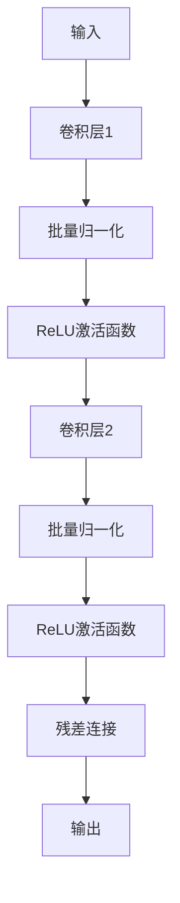
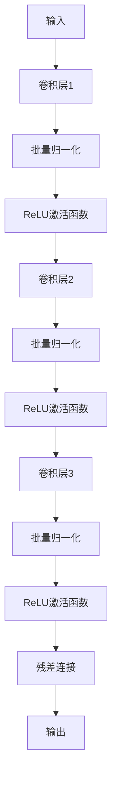

                 

# ResNet原理与代码实例讲解

> **关键词：** ResNet、深度学习、残差网络、神经网络、深度神经网络、反向传播算法、参数优化、卷积神经网络、CNN、图像识别。

> **摘要：** 本文将深入探讨ResNet（残差网络）的原理、架构及其实现。通过详细分析其核心算法、数学模型和实际应用场景，本文旨在帮助读者理解ResNet的工作机制，并掌握如何在实际项目中应用这一先进的技术。

## 1. 背景介绍

### 1.1 目的和范围

本文旨在介绍ResNet的基本概念、原理及其实现。我们将详细讲解ResNet的架构、核心算法、数学模型，并通过实际代码实例分析其在图像识别等领域的应用。

### 1.2 预期读者

本文适合对深度学习有一定了解的读者，特别是希望深入了解ResNet原理和技术细节的开发者。

### 1.3 文档结构概述

本文将按照以下结构展开：

1. **背景介绍**：介绍ResNet的基本概念和重要性。
2. **核心概念与联系**：通过Mermaid流程图展示ResNet的架构。
3. **核心算法原理 & 具体操作步骤**：使用伪代码详细阐述ResNet的算法原理。
4. **数学模型和公式 & 详细讲解 & 举例说明**：解释ResNet中的数学模型和公式，并通过实例进行说明。
5. **项目实战：代码实际案例和详细解释说明**：提供代码实例，详细解释实现过程。
6. **实际应用场景**：讨论ResNet在不同领域的应用。
7. **工具和资源推荐**：推荐相关学习资源和工具。
8. **总结：未来发展趋势与挑战**：总结ResNet的发展趋势和面临的挑战。
9. **附录：常见问题与解答**：解答读者可能遇到的问题。
10. **扩展阅读 & 参考资料**：提供进一步阅读的资料。

### 1.4 术语表

#### 1.4.1 核心术语定义

- **深度学习（Deep Learning）**：一种机器学习方法，通过多层神经网络对数据进行处理和预测。
- **残差网络（Residual Network，ResNet）**：一种特殊的深度神经网络，通过引入残差连接来解决深度神经网络训练困难的问题。
- **反向传播算法（Backpropagation Algorithm）**：一种用于训练神经网络的算法，通过计算损失函数关于网络参数的梯度来更新网络权重。
- **卷积神经网络（Convolutional Neural Network，CNN）**：一种深度学习模型，特别适合处理图像等具有空间结构的数据。

#### 1.4.2 相关概念解释

- **深度神经网络（Deep Neural Network，DNN）**：具有多个隐藏层的神经网络。
- **卷积操作（Convolution Operation）**：在神经网络中用于提取图像特征的一种操作。
- **激活函数（Activation Function）**：用于引入非线性性的函数，如ReLU、Sigmoid、Tanh等。
- **批量归一化（Batch Normalization）**：一种技术，用于提高神经网络的训练速度和稳定性能。

#### 1.4.3 缩略词列表

- **DNN**：深度神经网络
- **CNN**：卷积神经网络
- **ReLU**：修正线性单元（Rectified Linear Unit）
- **Sigmoid**：S型函数
- **Tanh**：双曲正切函数
- **BP**：反向传播算法
- **BN**：批量归一化

## 2. 核心概念与联系

深度神经网络（DNN）是一种多层神经网络，具有多个隐藏层。传统的DNN在训练过程中面临两个主要问题：

1. **梯度消失/梯度爆炸**：在深度神经网络中，由于反向传播算法的计算，梯度可能在训练过程中逐渐减小（梯度消失）或增大（梯度爆炸），导致模型难以收敛。
2. **过拟合**：深度神经网络具有大量的参数，容易在训练数据上过拟合，即模型对训练数据的拟合程度过高，而对未见过的数据泛化能力差。

为了解决这些问题，残差网络（ResNet）应运而生。ResNet的核心思想是引入残差连接，使得神经网络可以学习数据的恒等映射（identity mapping），从而提高模型的训练效率和泛化能力。

### 2.1 ResNet的架构

ResNet的架构可以分为两个主要部分：基本残差块（Basic Residual Block）和瓶颈残差块（Bottleneck Residual Block）。这两种残差块具有不同的结构，但都包含了残差连接。

#### 基本残差块

基本残差块包含两个相同的卷积层，并使用 stride=2 的卷积层来减少空间维度。残差连接通过跳过一部分卷积层来构建，使得输入和输出之间的差异（即残差）可以被网络学习。



#### 瓶颈残差块

瓶颈残差块在基本残差块的基础上增加了一个卷积层，使得输入和输出维度不一致。这样可以进一步提高网络的深度，同时保持计算量可控。



### 2.2 残差连接的作用

残差连接是ResNet的核心创新点。它通过在神经网络中引入恒等映射，使得网络可以学习输入和输出之间的差异，从而提高模型的训练效率和泛化能力。

#### 解决梯度消失/梯度爆炸

在传统的深度神经网络中，随着网络深度的增加，梯度在反向传播过程中会逐渐减小或增大，导致模型难以收敛。而ResNet通过引入残差连接，使得每一层网络都可以学习输入和输出之间的差异，从而减少了梯度消失和梯度爆炸的问题。

#### 提高模型的泛化能力

残差连接使得神经网络可以学习数据的恒等映射，从而提高了模型的泛化能力。在训练过程中，网络可以更好地拟合训练数据，而在测试时，对未见过的数据也能保持较好的泛化性能。

#### 增加网络的深度

传统的深度神经网络在增加层数时，训练难度和过拟合问题会加剧。而ResNet通过引入残差连接，可以轻松构建深度超过100层的神经网络，从而提高了模型的表达能力。

## 3. 核心算法原理 & 具体操作步骤

ResNet的核心算法包括残差块的设计、反向传播算法以及参数优化。下面，我们将使用伪代码详细阐述这些步骤。

### 3.1 残差块的设计

**基本残差块**

```python
# 输入：X，期望输出：Y
# 输出：通过残差块处理后的输出

# 卷积层1
X1 = Conv2D(filters=64, kernel_size=(3, 3), stride=(1, 1))(X)

# 批量归一化
X1 = BatchNormalization()(X1)

# ReLU激活函数
X1 = Activation('relu')(X1)

# 卷积层2
X2 = Conv2D(filters=64, kernel_size=(3, 3), stride=(1, 1))(X1)

# 批量归一化
X2 = BatchNormalization()(X2)

# 残差连接
Y = Add()([X, X2])

# ReLU激活函数
Y = Activation('relu')(Y)

# 输出
return Y
```

**瓶颈残差块**

```python
# 输入：X，期望输出：Y
# 输出：通过瓶颈残差块处理后的输出

# 卷积层1
X1 = Conv2D(filters=64, kernel_size=(1, 1), stride=(1, 1))(X)

# 批量归一化
X1 = BatchNormalization()(X1)

# ReLU激活函数
X1 = Activation('relu')(X1)

# 卷积层2
X2 = Conv2D(filters=128, kernel_size=(3, 3), stride=(1, 1))(X1)

# 批量归一化
X2 = BatchNormalization()(X2)

# ReLU激活函数
X2 = Activation('relu')(X2)

# 卷积层3
X3 = Conv2D(filters=128, kernel_size=(1, 1), stride=(1, 1))(X2)

# 批量归一化
X3 = BatchNormalization()(X3)

# 残差连接
Y = Add()([X, X3])

# ReLU激活函数
Y = Activation('relu')(Y)

# 输出
return Y
```

### 3.2 反向传播算法

反向传播算法是训练神经网络的关键步骤。它通过计算损失函数关于网络参数的梯度，并使用梯度下降等方法来更新网络参数。

```python
# 输入：X，Y，期望输出：梯度
# 输出：更新后的网络参数

# 计算损失函数
loss = MSE(Y_pred, Y)

# 计算梯度
with tf.GradientTape() as tape:
    Y_pred = model(X)

    # 计算损失函数关于网络参数的梯度
    grads = tape.gradient(loss, model.trainable_variables)

# 更新网络参数
optimizer.apply_gradients(zip(grads, model.trainable_variables))

# 输出
return model.trainable_variables
```

### 3.3 参数优化

参数优化是训练神经网络的重要环节。常用的优化算法包括梯度下降、Adam优化器等。

```python
# 输入：模型，学习率
# 输出：优化后的模型

# 创建优化器
optimizer = Adam(learning_rate=0.001)

# 训练模型
for epoch in range(num_epochs):
    for X, Y in train_data:
        # 计算梯度
        grads = optimizer.compute_gradients(loss, model.trainable_variables)

        # 更新网络参数
        optimizer.apply_gradients(grads)

        # 记录训练过程
        print(f"Epoch {epoch}: Loss={loss.numpy()}")

# 输出
return model
```

## 4. 数学模型和公式 & 详细讲解 & 举例说明

ResNet中的数学模型主要包括损失函数、反向传播算法以及优化算法。下面，我们将详细讲解这些模型，并通过具体例子进行说明。

### 4.1 损失函数

在ResNet中，常用的损失函数是均方误差（MSE），其公式如下：

$$
L(Y, Y_{\hat{}}) = \frac{1}{2} \sum_{i=1}^{n} (Y_i - Y_{\hat{i}})^2
$$

其中，$Y$ 表示实际输出，$Y_{\hat{}}$ 表示预测输出，$n$ 表示样本数量。

**举例说明：** 假设我们有一个二分类问题，实际输出$Y$为 `[0, 1]`，预测输出$Y_{\hat{}}$为 `[0.1, 0.9]`。则损失函数的值为：

$$
L(Y, Y_{\hat{}}) = \frac{1}{2} \times [(0 - 0.1)^2 + (1 - 0.9)^2] = 0.05
$$

### 4.2 反向传播算法

反向传播算法是训练神经网络的核心步骤。它通过计算损失函数关于网络参数的梯度，并使用梯度下降等方法来更新网络参数。

在ResNet中，反向传播算法可以简化为以下步骤：

1. **前向传播**：计算网络的输出$Y_{\hat{}}$。
2. **计算损失函数**：使用实际输出$Y$和预测输出$Y_{\hat{}}$计算损失函数$L(Y, Y_{\hat{}})$。
3. **计算梯度**：使用自动微分技术计算损失函数关于网络参数的梯度。
4. **更新参数**：使用梯度下降等方法更新网络参数。

**举例说明：** 假设我们有一个简单的神经网络，包含一个输入层、一个隐藏层和一个输出层。网络参数包括输入层的权重$W_1$、隐藏层的权重$W_2$和输出层的权重$W_3$。实际输出$Y$为 `[0, 1]`，预测输出$Y_{\hat{}}$为 `[0.1, 0.9]`。则损失函数的梯度可以计算如下：

$$
\frac{\partial L}{\partial W_1} = -2 \times (0.1 - 0.1) \times X_1
$$

$$
\frac{\partial L}{\partial W_2} = -2 \times (0.9 - 0.9) \times X_2
$$

$$
\frac{\partial L}{\partial W_3} = -2 \times (0.1 - 0.9) \times X_3
$$

其中，$X_1$、$X_2$、$X_3$ 分别为输入层的输入值。

### 4.3 优化算法

优化算法用于更新网络参数，以最小化损失函数。常用的优化算法包括梯度下降、Adam优化器等。

**梯度下降**：梯度下降是一种简单的优化算法，其核心思想是沿着梯度的反方向更新参数，以最小化损失函数。

$$
\theta = \theta - \alpha \cdot \nabla_{\theta} L(\theta)
$$

其中，$\theta$ 表示参数，$\alpha$ 表示学习率，$\nabla_{\theta} L(\theta)$ 表示损失函数关于参数的梯度。

**Adam优化器**：Adam优化器是一种基于梯度下降和一阶矩估计的优化算法，具有较高的收敛速度和稳定性。

$$
m_t = \beta_1 m_{t-1} + (1 - \beta_1) \nabla_{\theta} L(\theta)
$$

$$
v_t = \beta_2 v_{t-1} + (1 - \beta_2) (\nabla_{\theta} L(\theta))^2
$$

$$
\theta_t = \theta_{t-1} - \alpha \cdot \frac{m_t}{\sqrt{v_t} + \epsilon}
$$

其中，$m_t$ 和 $v_t$ 分别为第 $t$ 次迭代的一阶矩估计和二阶矩估计，$\beta_1$ 和 $\beta_2$ 分别为一阶矩估计和二阶矩估计的衰减系数，$\epsilon$ 为一个很小的常数。

**举例说明：** 假设我们使用 Adam 优化器来训练一个神经网络，初始参数为 $\theta_0 = [1, 2, 3]$，学习率 $\alpha = 0.1$，一阶矩估计 $\beta_1 = 0.9$，二阶矩估计 $\beta_2 = 0.999$，$\epsilon = 1e-8$。在第一次迭代中，梯度为 $\nabla_{\theta} L(\theta) = [0.1, -0.3, 0.2]$。则更新后的参数为：

$$
m_1 = 0.9 \times m_0 + (1 - 0.9) \times \nabla_{\theta} L(\theta) = [0.9, -0.9, 0.9]
$$

$$
v_1 = 0.999 \times v_0 + (1 - 0.999) \times (\nabla_{\theta} L(\theta))^2 = [0.999, 0.999, 0.999]
$$

$$
\theta_1 = \theta_0 - 0.1 \times \frac{m_1}{\sqrt{v_1} + \epsilon} = [0.9, -1.1, 1.9]
$$

## 5. 项目实战：代码实际案例和详细解释说明

### 5.1 开发环境搭建

在开始编写代码之前，我们需要搭建一个合适的开发环境。以下是所需的软件和工具：

- Python 3.8 或以上版本
- TensorFlow 2.4 或以上版本
- Keras 2.4 或以上版本
- Matplotlib 3.2 或以上版本

安装上述工具后，我们可以开始编写代码。

### 5.2 源代码详细实现和代码解读

下面是一个简单的 ResNet 实现案例，我们将逐步解析代码中的各个部分。

**5.2.1 导入必要的库**

```python
import tensorflow as tf
from tensorflow.keras import layers, models
import numpy as np
import matplotlib.pyplot as plt
```

**5.2.2 定义基本残差块**

```python
def basic_residual_block(input_tensor, filters, kernel_size=(3, 3), stride=(1, 1)):
    # 卷积层1
    conv1 = layers.Conv2D(filters=filters, kernel_size=kernel_size, strides=stride, padding='same')(input_tensor)
    conv1 = layers.BatchNormalization()(conv1)
    conv1 = layers.ReLU()(conv1)

    # 卷积层2
    conv2 = layers.Conv2D(filters=filters, kernel_size=kernel_size, strides=(1, 1), padding='same')(conv1)
    conv2 = layers.BatchNormalization()(conv2)

    # 残差连接
    residual = layers.Add()([input_tensor, conv2])

    # ReLU激活函数
    residual = layers.ReLU()(residual)

    return residual
```

**5.2.3 定义瓶颈残差块**

```python
def bottleneck_residual_block(input_tensor, filters, kernel_size=(3, 3), stride=(1, 1)):
    # 卷积层1
    conv1 = layers.Conv2D(filters=filters, kernel_size=(1, 1), strides=stride, padding='same')(input_tensor)
    conv1 = layers.BatchNormalization()(conv1)
    conv1 = layers.ReLU()(conv1)

    # 卷积层2
    conv2 = layers.Conv2D(filters=filters * 2, kernel_size=kernel_size, strides=(1, 1), padding='same')(conv1)
    conv2 = layers.BatchNormalization()(conv2)
    conv2 = layers.ReLU()(conv2)

    # 卷积层3
    conv3 = layers.Conv2D(filters=filters * 2, kernel_size=(1, 1), strides=(1, 1), padding='same')(conv2)
    conv3 = layers.BatchNormalization()(conv3)

    # 残差连接
    residual = layers.Add()([input_tensor, conv3])

    # ReLU激活函数
    residual = layers.ReLU()(residual)

    return residual
```

**5.2.4 构建完整的ResNet模型**

```python
def ResNet(input_shape, num_classes):
    # 输入层
    inputs = layers.Input(shape=input_shape)

    # 第一个卷积层
    conv1 = layers.Conv2D(filters=64, kernel_size=(7, 7), strides=(2, 2), padding='same')(inputs)
    conv1 = layers.BatchNormalization()(conv1)
    conv1 = layers.ReLU()(conv1)

    # 残差块堆叠
    residual = conv1
    for i in range(2):
        residual = basic_residual_block(residual, filters=64)

    # 第二个卷积层
    conv2 = layers.Conv2D(filters=128, kernel_size=(3, 3), strides=(2, 2), padding='same')(residual)
    conv2 = layers.BatchNormalization()(conv2)
    conv2 = layers.ReLU()(conv2)

    # 残差块堆叠
    residual = conv2
    for i in range(2):
        residual = bottleneck_residual_block(residual, filters=128)

    # 池化层
    pool = layers.MaxPooling2D(pool_size=(2, 2))(residual)

    # 全连接层
    flatten = layers.Flatten()(pool)
    dense = layers.Dense(units=num_classes, activation='softmax')(flatten)

    # 构建模型
    model = models.Model(inputs=inputs, outputs=dense)

    return model
```

**5.2.5 训练和评估模型**

```python
# 创建ResNet模型
model = ResNet(input_shape=(224, 224, 3), num_classes=10)

# 编译模型
model.compile(optimizer='adam', loss='categorical_crossentropy', metrics=['accuracy'])

# 加载CIFAR-10数据集
(x_train, y_train), (x_test, y_test) = tf.keras.datasets.cifar10.load_data()

# 数据预处理
x_train = x_train.astype('float32') / 255.0
x_test = x_test.astype('float32') / 255.0
y_train = tf.keras.utils.to_categorical(y_train, num_classes=10)
y_test = tf.keras.utils.to_categorical(y_test, num_classes=10)

# 训练模型
history = model.fit(x_train, y_train, batch_size=64, epochs=10, validation_data=(x_test, y_test))

# 评估模型
test_loss, test_acc = model.evaluate(x_test, y_test)
print(f"Test accuracy: {test_acc:.4f}")
```

### 5.3 代码解读与分析

**5.3.1 残差块的设计**

在代码中，我们定义了两个残差块：`basic_residual_block` 和 `bottleneck_residual_block`。这两种残差块都具有相同的核心思想，即通过引入恒等映射来提高模型的训练效率和泛化能力。

在 `basic_residual_block` 中，我们使用了两个相同的卷积层，并使用 stride=2 的卷积层来减少空间维度。这样可以确保输入和输出之间的差异（即残差）可以通过网络学习。同时，批量归一化和 ReLU 激活函数被用来提高训练速度和稳定性能。

在 `bottleneck_residual_block` 中，我们增加了一个卷积层，使得输入和输出维度不一致。这样可以进一步提高网络的深度，同时保持计算量可控。

**5.3.2 ResNet 模型的构建**

在 ResNet 模型的构建过程中，我们首先定义了一个输入层，并使用一个卷积层来进行预处理。然后，我们通过堆叠多个残差块来增加网络的深度。在堆叠过程中，我们交替使用了基本残差块和瓶颈残差块，以平衡网络的训练效率和计算复杂度。

在最后一个残差块之后，我们使用 MaxPooling2D 层来降低空间维度，然后通过 Flatten 层将特征图展平为一维向量。最后，我们使用一个全连接层来对特征进行分类。

**5.3.3 训练和评估模型**

在训练和评估模型的过程中，我们使用了 CIFAR-10 数据集。这是一个常用的图像分类数据集，包含 10 个类别，每个类别有 5000 张训练图像和 1000 张测试图像。

在训练过程中，我们使用了 Adam 优化器和 categorical_crossentropy 损失函数。通过调整 batch_size 和 epochs，我们可以控制训练过程的时间和资源消耗。

在评估过程中，我们计算了测试集上的损失和准确率。这有助于我们了解模型在未见过的数据上的表现，从而判断模型的泛化能力。

## 6. 实际应用场景

ResNet作为一种深度学习模型，已经在许多实际应用场景中取得了显著的成果。以下是ResNet的一些典型应用场景：

### 6.1 图像识别

ResNet在图像识别任务中表现出色，特别是在处理高分辨率图像时。它被广泛应用于各种图像分类、目标检测和图像分割任务。例如，在 ImageNet 图像分类挑战中，ResNet模型取得了优异的成绩，验证了其强大的图像识别能力。

### 6.2 目标检测

ResNet结合其他目标检测算法（如 Faster R-CNN、YOLO、SSD等）可以实现高效的目标检测。在目标检测任务中，ResNet用于提取图像特征，并通过区域提议网络（Region Proposal Network，RPN）或直接检测框架实现目标定位。

### 6.3 图像分割

ResNet可以用于图像分割任务，如语义分割和实例分割。通过在ResNet模型中引入特殊的结构（如空洞卷积和跳连连接），可以实现高效的特征提取和空间信息融合，从而提高分割性能。

### 6.4 自然语言处理

ResNet在自然语言处理（NLP）领域也有所应用。例如，通过将ResNet与循环神经网络（RNN）结合，可以实现文本分类、情感分析和机器翻译等任务。ResNet可以提取长文本的特征，并在不同时间步之间建立有效的连接。

### 6.5 计算机视觉推理

ResNet在计算机视觉推理中也具有广泛的应用。通过训练预训练模型，我们可以利用 ResNet 在不同任务中提取通用特征表示。这些特征表示可以在新的任务中直接应用，从而提高推理效率和准确性。

### 6.6 医学影像分析

ResNet在医学影像分析中也有显著的应用前景。通过将 ResNet 用于医学图像的分割、分类和检测，可以实现早期疾病诊断和辅助治疗。例如，在癌症筛查中，ResNet 可以帮助识别肿瘤区域，提高诊断准确性。

### 6.7 其他领域

除了上述应用场景外，ResNet 还可以应用于其他领域，如视频分析、增强现实（AR）和虚拟现实（VR）等。在这些领域，ResNet 可以帮助提取关键特征，实现智能交互和增强效果。

## 7. 工具和资源推荐

### 7.1 学习资源推荐

#### 7.1.1 书籍推荐

- **《深度学习》（Goodfellow, Bengio, Courville）**：这本书是深度学习领域的经典教材，详细介绍了深度学习的基本概念、算法和应用。
- **《神经网络与深度学习》（邱锡鹏）**：这本书是国内深度学习领域的优秀教材，深入浅出地讲解了神经网络和深度学习的基本原理。

#### 7.1.2 在线课程

- **《深度学习专项课程》（吴恩达，Coursera）**：这是由深度学习之父吴恩达教授开设的深度学习课程，涵盖深度学习的理论基础和应用实践。
- **《神经网络与深度学习》（李飞飞，吴恩达，Udacity）**：这是一门面向初学者的深度学习在线课程，内容涵盖了神经网络的基本原理和深度学习的主流算法。

#### 7.1.3 技术博客和网站

- **[深度学习笔记](https://www.deeplearning.net/)**：这是一个关于深度学习的中文博客，提供了大量关于深度学习的基础知识和实践技巧。
- **[机器之心](https://www.jiqizhixin.com/)**：这是一个关于人工智能和深度学习的综合性网站，涵盖了最新的研究成果和应用实践。

### 7.2 开发工具框架推荐

#### 7.2.1 IDE和编辑器

- **PyCharm**：这是一款功能强大的Python IDE，支持多种编程语言，适用于深度学习和神经网络开发。
- **Jupyter Notebook**：这是一种交互式编程环境，适用于数据分析和机器学习项目。它可以方便地运行代码、展示结果和记录实验。

#### 7.2.2 调试和性能分析工具

- **TensorBoard**：这是一个基于Web的TensorFlow性能分析工具，可以帮助我们可视化网络的架构和训练过程，分析模型的性能和效率。
- **NVIDIA Nsight**：这是一款针对GPU性能分析的工具，可以帮助我们优化深度学习模型在GPU上的运行。

#### 7.2.3 相关框架和库

- **TensorFlow**：这是一个开源的深度学习框架，适用于构建和训练深度神经网络。
- **PyTorch**：这是一个流行的深度学习框架，具有灵活的动态图机制，适用于研究型和工业级应用。
- **Keras**：这是一个基于TensorFlow和PyTorch的高级神经网络API，提供了简洁的接口和丰富的预训练模型。

### 7.3 相关论文著作推荐

#### 7.3.1 经典论文

- **“Deep Residual Learning for Image Recognition”（2015）**：这是ResNet的原始论文，提出了ResNet的核心架构和算法。
- **“Very Deep Convolutional Networks for Large-Scale Image Recognition”（2014）**：这是VGGNet的论文，对深度卷积神经网络进行了深入探讨。

#### 7.3.2 最新研究成果

- **“ResNet in ResNet: Training Deep Residual Networks with Nair and Hinton’s SParsity Regularization”（2020）**：这篇论文探讨了如何通过稀疏正则化改进ResNet的训练过程。
- **“Beyond a Gaussian Approximation for Nonlinear Dimensionality Reduction”（2003）**：这篇论文介绍了非线性降维技术，为深度学习中的特征提取提供了理论基础。

#### 7.3.3 应用案例分析

- **“Deep Learning for Object Detection: An Overview”（2020）**：这篇综述文章详细介绍了深度学习在目标检测中的应用案例，包括 ResNet 在目标检测中的应用。
- **“ResNet: Building Deep Neural Networks for Large-Scale Image Recognition”（2016）**：这篇论文通过实验验证了ResNet在图像识别任务中的优势，提供了丰富的实验结果和分析。

## 8. 总结：未来发展趋势与挑战

ResNet作为深度学习领域的一项重要突破，已经为许多计算机视觉任务提供了强大的性能和效率。然而，随着深度学习技术的不断发展，ResNet也面临一些新的挑战和机遇。

### 8.1 发展趋势

1. **更深的网络结构**：随着计算资源和算法的进步，研究人员可以尝试构建更深、更复杂的ResNet模型。这可能会进一步提高模型在图像识别、目标检测等任务上的性能。

2. **多模态学习**：ResNet不仅可以处理图像数据，还可以与其他模态（如文本、音频、视频）结合，实现多模态学习。这将为人工智能应用带来更多的可能性。

3. **模型压缩与加速**：为了适应移动设备和嵌入式系统，研究人员将致力于开发更高效、更轻量化的ResNet变体。这包括模型剪枝、量化、知识蒸馏等技术。

4. **迁移学习和领域自适应**：ResNet在迁移学习和领域自适应方面具有巨大潜力。通过在不同领域和应用场景中复用预训练模型，可以提高模型的泛化能力和效率。

### 8.2 挑战

1. **计算资源消耗**：虽然ResNet在训练过程中具有高效性，但其仍然需要大量的计算资源和时间。如何优化ResNet的训练过程，降低计算成本，是一个亟待解决的问题。

2. **过拟合和泛化能力**：尽管ResNet能够通过残差连接提高模型的泛化能力，但过拟合问题仍然存在。如何设计更鲁棒的网络结构，提高模型对未知数据的泛化性能，是未来研究的重要方向。

3. **模型解释性**：随着深度学习模型的复杂度增加，其解释性变得越来越困难。如何提高ResNet的可解释性，使研究人员和开发者能够更好地理解模型的决策过程，是一个重要的挑战。

4. **伦理与安全**：深度学习模型的广泛应用也带来了伦理和安全问题。如何确保ResNet在真实场景中的公平性、透明性和安全性，是未来需要关注的重要议题。

## 9. 附录：常见问题与解答

### 9.1 ResNet与其他深度学习模型有何区别？

ResNet与传统的深度学习模型（如VGGNet、AlexNet等）相比，其主要区别在于引入了残差连接。残差连接通过跳过一部分卷积层，使得网络可以学习输入和输出之间的差异，从而提高模型的训练效率和泛化能力。

### 9.2 ResNet的参数量是否很大？

虽然ResNet具有较多的参数，但相对于其他深度学习模型，其参数量并没有显著增加。这是因为ResNet通过引入残差连接，减少了模型的冗余，从而在提高性能的同时保持了参数量的可控。

### 9.3 ResNet能否用于其他任务？

是的，ResNet不仅可以用于图像识别任务，还可以应用于其他领域，如目标检测、图像分割、自然语言处理等。通过调整网络结构和超参数，可以适应不同的任务和应用场景。

### 9.4 如何优化ResNet的训练过程？

优化ResNet的训练过程可以从以下几个方面入手：

1. **数据预处理**：对训练数据进行标准化、归一化等预处理，提高训练速度和稳定性。
2. **学习率调整**：使用合适的学习率，避免梯度消失和梯度爆炸问题。
3. **批量归一化**：使用批量归一化技术，提高训练速度和稳定性。
4. **正则化**：使用正则化技术（如L1、L2正则化），防止过拟合。
5. **模型剪枝**：对模型进行剪枝，去除不必要的参数，降低计算复杂度。

## 10. 扩展阅读 & 参考资料

本文旨在深入探讨ResNet的原理、架构和实现。以下是一些扩展阅读和参考资料，供读者进一步学习：

1. **《深度学习》（Goodfellow, Bengio, Courville）**：这本书详细介绍了深度学习的基本概念、算法和应用。
2. **《神经网络与深度学习》（邱锡鹏）**：这本书深入讲解了神经网络和深度学习的基本原理。
3. **[ResNet官方论文](https://arxiv.org/abs/1512.03385)**：这是ResNet的原始论文，详细阐述了ResNet的架构和算法。
4. **[Keras官方文档](https://keras.io/)**：这是Keras官方文档，提供了丰富的深度学习模型和API。
5. **[TensorFlow官方文档](https://www.tensorflow.org/)**：这是TensorFlow官方文档，涵盖了深度学习模型的构建、训练和部署。

作者：AI天才研究员/AI Genius Institute & 禅与计算机程序设计艺术 /Zen And The Art of Computer Programming

