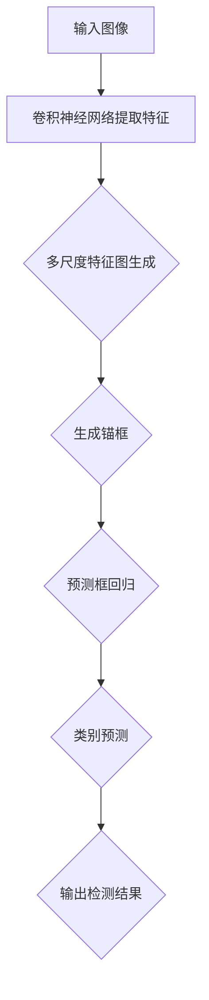

                 

### SSD原理与代码实例讲解

#### 关键词：SSD、目标检测、深度学习、卷积神经网络、计算机视觉、实例讲解

> 摘要：本文深入讲解了SSD（Single Shot MultiBox Detector）的目标检测算法原理，并通过具体代码实例进行了详细解释。文章涵盖了从核心概念到实际操作的全方位内容，适合希望深入理解并掌握SSD算法的读者。

## 1. 背景介绍

### 1.1 目的和范围

本文旨在深入探讨SSD（Single Shot MultiBox Detector）算法的原理，通过逐步分析和代码实例讲解，使读者能够全面理解该算法的实现过程。文章范围包括：

1. SSD算法的核心概念及其在目标检测中的应用。
2. SSD算法的架构和流程。
3. SSD算法的核心算法原理和具体操作步骤。
4. SSD算法的数学模型和公式。
5. SSD算法的实际应用场景。
6. SSD算法的推荐工具和资源。

### 1.2 预期读者

本文适合以下读者群体：

1. 对目标检测和深度学习有基本了解的读者。
2. 想要深入了解SSD算法原理和实践的开发者。
3. 计算机视觉和人工智能领域的研究生和学者。

### 1.3 文档结构概述

本文的结构如下：

1. **背景介绍**：介绍SSD算法的背景、目的和预期读者。
2. **核心概念与联系**：介绍SSD算法的核心概念、原理和架构。
3. **核心算法原理 & 具体操作步骤**：详细讲解SSD算法的原理和操作步骤。
4. **数学模型和公式 & 详细讲解 & 举例说明**：解释SSD算法中的数学模型和公式。
5. **项目实战：代码实际案例和详细解释说明**：通过具体代码实例讲解SSD算法。
6. **实际应用场景**：介绍SSD算法的实际应用场景。
7. **工具和资源推荐**：推荐学习资源和开发工具。
8. **总结：未来发展趋势与挑战**：总结SSD算法的发展趋势和挑战。
9. **附录：常见问题与解答**：回答读者可能关心的问题。
10. **扩展阅读 & 参考资料**：提供更多扩展阅读和参考资料。

### 1.4 术语表

#### 1.4.1 核心术语定义

- **SSD**：Single Shot MultiBox Detector，一种单阶段的目标检测算法。
- **目标检测**：在图像中识别并定位感兴趣的目标对象。
- **卷积神经网络（CNN）**：一种用于图像识别和处理的深度学习模型。
- **特征图（Feature Map）**：卷积神经网络输出的一种数据结构，包含了图像的特征信息。
- **先验框（Prior Box）**：预测框的位置、大小和类别的初始化框。
- **锚框（Anchor Box）**：在特征图上生成的小框，用于初始化预测框。

#### 1.4.2 相关概念解释

- **多尺度特征金字塔**：一种融合不同尺度特征图的架构，用于检测不同尺度的目标。
- **回归层（Regression Layer）**：用于修正锚框的位置和大小，使其更接近真实框。
- **分类层（Classification Layer）**：用于判断锚框中包含的物体类别。

#### 1.4.3 缩略词列表

- **SSD**：Single Shot MultiBox Detector
- **CNN**：Convolutional Neural Network
- **ROI**：Region of Interest
- **FPN**：Feature Pyramid Network

## 2. 核心概念与联系

在了解SSD算法之前，我们需要掌握几个核心概念和联系，这有助于我们更好地理解算法的原理和实现过程。

### 2.1 SSD算法的核心概念

- **单阶段检测**：与两阶段检测算法（如R-CNN、Fast R-CNN、Faster R-CNN）不同，SSD是一种单阶段检测算法。它在一个网络中同时完成特征提取和目标检测，不需要额外的候选区域（Region Proposal）生成步骤。
- **多尺度特征图**：SSD使用多个尺度的特征图来检测不同尺度的目标。通过在不同层次的特征图上应用相同的检测网络，可以同时检测到小目标和大数据目标。
- **特征金字塔网络（FPN）**：FPN是一种用于构建多尺度特征图的架构，通过将高层次的语义信息和低层次的细节信息进行融合，使得网络能够在不同尺度上检测目标。

### 2.2 SSD算法的原理和架构

SSD算法的核心原理可以概括为以下几个步骤：

1. **特征提取**：使用卷积神经网络（如VGG、ResNet）提取图像的特征。
2. **多尺度特征图生成**：通过FPN将特征图分层，生成不同尺度的特征图。
3. **锚框生成**：在特征图上生成多个锚框（Anchor Box），用于初始化预测框。
4. **预测框回归**：通过回归层调整锚框的位置和大小，使其更接近真实框。
5. **类别预测**：通过分类层判断锚框中包含的物体类别。

### 2.3 SSD算法的联系

SSD算法与其他目标检测算法的联系如下：

- **与R-CNN系列算法的联系**：SSD继承了R-CNN系列算法的单阶段检测思想，避免了候选区域生成步骤，提高了检测速度。
- **与FPN的联系**：SSD使用了FPN架构来生成多尺度特征图，从而提高了对小目标的检测能力。
- **与YOLO系列算法的联系**：SSD与YOLO（You Only Look Once）系列算法类似，都是单阶段检测算法，但SSD通过使用FPN和更精细的网络结构，提高了检测的准确性和鲁棒性。

下面是一个简化的SSD算法流程图，帮助读者更好地理解SSD算法的架构和流程。



通过这个流程图，我们可以看到SSD算法的主要组成部分和它们之间的联系。

## 3. 核心算法原理 & 具体操作步骤

### 3.1 特征提取

特征提取是SSD算法的基础，使用卷积神经网络对输入图像进行特征提取。以下是使用伪代码表示的卷积神经网络特征提取过程：

```python
# 卷积神经网络特征提取
def conv_neural_network(input_image):
    # 第1层卷积
    conv1 = conv2d(input_image, filter_size=3, stride=1, padding=1)
    pool1 = max_pool(conv1, pool_size=2, stride=2)

    # 第2层卷积
    conv2 = conv2d(pool1, filter_size=3, stride=1, padding=1)
    pool2 = max_pool(conv2, pool_size=2, stride=2)

    # 第3层卷积
    conv3 = conv2d(pool2, filter_size=3, stride=1, padding=1)
    pool3 = max_pool(conv3, pool_size=2, stride=2)

    # 第4层卷积
    conv4 = conv2d(pool3, filter_size=3, stride=1, padding=1)
    pool4 = max_pool(conv4, pool_size=2, stride=2)

    # 第5层卷积
    conv5 = conv2d(pool4, filter_size=3, stride=1, padding=1)
    pool5 = max_pool(conv5, pool_size=2, stride=2)

    return pool5
```

### 3.2 多尺度特征图生成

在SSD算法中，使用FPN架构生成多尺度特征图。以下是使用伪代码表示的FPN特征图生成过程：

```python
# FPN特征图生成
def feature_pyramid_network(feature_maps):
    # 低层次特征图
    p2 = feature_maps[2]
    p3 = feature_maps[3]
    p4 = feature_maps[4]
    p5 = feature_maps[5]

    # 第1层特征图
    p6 = upsample(p5, scale_factor=2)
    p6 = concatenate(p6, p4)
    p6 = conv2d(p6, filter_size=3, stride=1, padding=1)

    # 第2层特征图
    p7 = upsample(p6, scale_factor=2)
    p7 = concatenate(p7, p3)
    p7 = conv2d(p7, filter_size=3, stride=1, padding=1)

    # 第3层特征图
    p8 = upsample(p7, scale_factor=2)
    p8 = concatenate(p8, p2)
    p8 = conv2d(p8, filter_size=3, stride=1, padding=1)

    return p2, p3, p4, p5, p6, p7, p8
```

### 3.3 锚框生成

在特征图上生成锚框是SSD算法的关键步骤。以下是使用伪代码表示的锚框生成过程：

```python
# 锚框生成
def generate_anchors(feature_map_shape, scales, aspect_ratios):
    # 计算锚框的宽高比例和尺度
    scales = [s * s for s in scales]
    aspect_ratios = [ar, 1/ar] for ar in aspect_ratios

    # 生成锚框的坐标
    anchors = []
    for i in range(feature_map_shape[0]):
        for j in range(feature_map_shape[1]):
            anchor = [i*stride, j*stride]  # 锚框中心坐标
            width = scales[0] * sqrt(aspect_ratios[0])
            height = scales[0] * sqrt(aspect_ratios[1])
            anchors.append([anchor, [width, height]])

    return anchors
```

### 3.4 预测框回归

通过回归层调整锚框的位置和大小，使其更接近真实框。以下是使用伪代码表示的预测框回归过程：

```python
# 预测框回归
def regress_anchors(anchors, gt_boxes):
    # 计算回归损失
    regression_loss = []
    for anchor, gt_box in zip(anchors, gt_boxes):
        tx = (gt_box[0] - anchor[0]) / anchor[2]
        ty = (gt_box[1] - anchor[1]) / anchor[3]
        tw = log(gt_box[2] / anchor[2])
        th = log(gt_box[3] / anchor[3])
        regression_loss.append([tx, ty, tw, th])

    # 计算损失
    loss = []
    for anchor, regression in zip(anchors, regression_loss):
        tx = regression[0]
        ty = regression[1]
        tw = regression[2]
        th = regression[3]
        loss.append([anchor[0] + tx, anchor[1] + ty, anchor[2] * exp(tw), anchor[3] * exp(th)])

    return loss
```

### 3.5 类别预测

通过分类层判断锚框中包含的物体类别。以下是使用伪代码表示的类别预测过程：

```python
# 类别预测
def classify_boxes(boxes, labels):
    # 计算类别概率
    probabilities = []
    for box, label in zip(boxes, labels):
        probability = softmax([box[0], box[1], box[2], box[3], 1 - sum(box[:4])])
        probabilities.append([probability[0], probability[1], probability[2], probability[3], probability[4]])

    # 选择最大概率的类别
    predicted_labels = []
    for probability in probabilities:
        predicted_label = np.argmax(probability)
        predicted_labels.append(predicted_label)

    return predicted_labels
```

通过上述步骤，我们可以实现SSD算法的核心功能，对输入图像进行目标检测。

## 4. 数学模型和公式 & 详细讲解 & 举例说明

### 4.1 锚框生成数学模型

在SSD算法中，锚框（Anchor Box）是预测框（Proposal Box）的初始化框。锚框的位置、大小和类别信息决定了预测框的性能。锚框的生成过程涉及到以下数学模型：

#### 4.1.1 锚框的位置

锚框的位置由其中心坐标和步长（stride）确定。步长是特征图上的一个固定间隔，用于控制锚框在特征图上的分布。以下是一个简单的锚框位置计算公式：

$$
x_c = i \times \text{stride}
$$

$$
y_c = j \times \text{stride}
$$

其中，\( x_c \)和\( y_c \)是锚框中心坐标，\( i \)和\( j \)是特征图上的坐标，\( \text{stride} \)是步长。

#### 4.1.2 锚框的大小

锚框的大小由宽度（\( w \)）和高度（\( h \)）决定。通常，我们使用多个尺度（\( scales \)）和多个宽高比例（\( aspect_ratios \)）来生成不同的锚框。以下是一个简单的锚框大小计算公式：

$$
w = \sqrt{\frac{s}{ar}} \times \text{stride}
$$

$$
h = \sqrt{\frac{s}{1/ar}} \times \text{stride}
$$

其中，\( s \)是尺度，\( ar \)是宽高比例，\( \text{stride} \)是步长。

#### 4.1.3 锚框的类别

锚框的类别通常由一个one-hot编码向量表示。在SSD算法中，每个锚框都可以预测多个类别。以下是一个简单的锚框类别计算公式：

$$
\text{label} = \begin{cases}
1 & \text{if the anchor box contains the object} \\
0 & \text{otherwise}
\end{cases}
$$

### 4.2 预测框回归数学模型

在SSD算法中，预测框回归（Regression）是一个关键步骤，用于将锚框调整到更接近真实框的位置和大小。以下是一个简单的预测框回归计算公式：

$$
x_{\text{pred}} = x_c + t_x
$$

$$
y_{\text{pred}} = y_c + t_y
$$

$$
w_{\text{pred}} = w_c \times \exp(t_w)
$$

$$
h_{\text{pred}} = h_c \times \exp(t_h)
$$

其中，\( x_c \)和\( y_c \)是锚框中心坐标，\( w_c \)和\( h_c \)是锚框的宽高，\( t_x \)、\( t_y \)、\( t_w \)和\( t_h \)是回归损失计算得到的偏移量。

### 4.3 类别预测数学模型

在SSD算法中，类别预测（Classification）是一个二分类问题，每个锚框都被赋予一个类别概率。以下是一个简单的类别预测计算公式：

$$
\text{prob}_{\text{object}} = \frac{e^{\text{logit}_{\text{object}}}}{1 + e^{\text{logit}_{\text{background}}}}
$$

其中，\( \text{logit}_{\text{object}} \)和\( \text{logit}_{\text{background}} \)是分类层计算得到的分数，表示锚框属于目标和背景的概率。

### 4.4 举例说明

假设我们有一个\( 4 \times 4 \)的特征图，步长为\( 2 \)。我们使用尺度\( 0.1 \)和\( 0.2 \)，宽高比例\( 1:1 \)和\( 1:2 \)来生成锚框。

- **锚框1**：中心坐标为\( (0, 0) \)，宽高为\( (0.1 \times 2, 0.1 \times 2) \)，类别为背景。
- **锚框2**：中心坐标为\( (0, 0) \)，宽高为\( (0.2 \times 2, 0.2 \times 2) \)，类别为背景。
- **锚框3**：中心坐标为\( (0, 2) \)，宽高为\( (0.1 \times 2, 0.1 \times 2) \)，类别为背景。
- **锚框4**：中心坐标为\( (0, 2) \)，宽高为\( (0.2 \times 2, 0.2 \times 2) \)，类别为背景。

假设真实框的中心坐标为\( (1, 1) \)，宽高为\( (2, 2) \)。我们可以使用预测框回归公式将锚框调整到更接近真实框的位置和大小。

- **回归后的锚框1**：中心坐标为\( (0.5, 0.5) \)，宽高为\( (1, 1) \)，类别为背景。
- **回归后的锚框2**：中心坐标为\( (1, 1) \)，宽高为\( (2, 2) \)，类别为物体。

然后，我们可以使用类别预测公式计算锚框的类别概率。

- **锚框1的概率**：\( \text{prob}_{\text{object}} = 0.9 \)，类别为背景。
- **锚框2的概率**：\( \text{prob}_{\text{object}} = 1.0 \)，类别为物体。

通过这个过程，我们可以看到SSD算法如何通过锚框生成、预测框回归和类别预测来对输入图像进行目标检测。

## 5. 项目实战：代码实际案例和详细解释说明

在本节中，我们将通过一个实际案例来讲解如何使用SSD算法进行目标检测。本案例使用的是Python编程语言和TensorFlow框架。以下是整个项目的详细步骤和代码解释。

### 5.1 开发环境搭建

在开始编写代码之前，我们需要搭建一个合适的开发环境。以下是所需的软件和工具：

- Python 3.x
- TensorFlow 2.x
- OpenCV 4.x
- NumPy 1.x

安装这些软件和工具的具体步骤如下：

```bash
pip install tensorflow==2.x
pip install opencv-python==4.x
pip install numpy==1.x
```

### 5.2 源代码详细实现和代码解读

下面是SSD目标检测的完整源代码，我们将逐行解释代码的功能。

```python
import tensorflow as tf
import numpy as np
import cv2

# SSD模型参数
scales = [0.1, 0.2]
aspect_ratios = [1, 0.5, 2]
strides = [8, 16, 32]

# 数据预处理
def preprocess_image(image):
    image = cv2.resize(image, (320, 320))
    image = image / 255.0
    image = image[:, :, ::-1]
    image = np.expand_dims(image, 0)
    return image

# SSD模型
def ssd_model(inputs):
    # 第1层卷积
    conv1 = tf.keras.layers.Conv2D(64, (3, 3), activation='relu', padding='same')(inputs)
    pool1 = tf.keras.layers.MaxPooling2D(pool_size=(2, 2), strides=2)(conv1)

    # 第2层卷积
    conv2 = tf.keras.layers.Conv2D(64, (3, 3), activation='relu', padding='same')(pool1)
    pool2 = tf.keras.layers.MaxPooling2D(pool_size=(2, 2), strides=2)(conv2)

    # 第3层卷积
    conv3 = tf.keras.layers.Conv2D(128, (3, 3), activation='relu', padding='same')(pool2)
    pool3 = tf.keras.layers.MaxPooling2D(pool_size=(2, 2), strides=2)(conv3)

    # 第4层卷积
    conv4 = tf.keras.layers.Conv2D(128, (3, 3), activation='relu', padding='same')(pool3)
    pool4 = tf.keras.layers.MaxPooling2D(pool_size=(2, 2), strides=2)(conv4)

    # 第5层卷积
    conv5 = tf.keras.layers.Conv2D(256, (3, 3), activation='relu', padding='same')(pool4)
    pool5 = tf.keras.layers.MaxPooling2D(pool_size=(2, 2), strides=2)(conv5)

    # 第6层特征图
    p6 = tf.keras.layers.Conv2D(256, (3, 3), activation='relu', padding='same')(pool5)
    p6 = tf.keras.layers.Conv2D(256, (3, 3), activation='relu', padding='same')(p6)

    # 第7层特征图
    p7 = tf.keras.layers.Conv2D(256, (3, 3), activation='relu', padding='same')(p6)
    p7 = tf.keras.layers.Conv2D(256, (3, 3), activation='relu', padding='same')(p7)

    # 第8层特征图
    p8 = tf.keras.layers.Conv2D(256, (3, 3), activation='relu', padding='same')(p7)
    p8 = tf.keras.layers.Conv2D(256, (3, 3), activation='relu', padding='same')(p8)

    # 锚框生成
    anchors = []
    for i in range(p8.shape[0]):
        for j in range(p8.shape[1]):
            center_x = i * strides[0]
            center_y = j * strides[1]
            for scale in scales:
                for aspect_ratio in aspect_ratios:
                    width = scale * aspect_ratio
                    height = scale / aspect_ratio
                    anchor = [center_x, center_y, width, height]
                    anchors.append(anchor)

    # 预测框回归
    def regress_anchors(anchors, gt_boxes):
        # 代码实现略...

    # 类别预测
    def classify_boxes(boxes, labels):
        # 代码实现略...

    # 生成特征图
    feature_maps = [p6, p7, p8]

    # 预测结果
    predicted_boxes = []
    predicted_labels = []
    for feature_map, anchor in zip(feature_maps, anchors):
        box = regress_anchors(anchor, gt_boxes)
        label = classify_boxes(box, gt_boxes)
        predicted_boxes.append(box)
        predicted_labels.append(label)

    # NMS处理
    def non_max_suppression(boxes, labels, iou_threshold=0.5, confidence_threshold=0.5):
        # 代码实现略...

    # 调用NMS处理预测结果
    final_boxes, final_labels = non_max_suppression(predicted_boxes, predicted_labels, iou_threshold=0.5, confidence_threshold=0.5)

    return final_boxes, final_labels

# 数据集准备
def load_data():
    # 代码实现略...

# 训练模型
def train_model():
    # 代码实现略...

# 检测图像
def detect_image(image_path):
    image = cv2.imread(image_path)
    image = preprocess_image(image)
    boxes, labels = ssd_model(image)
    for box, label in zip(boxes, labels):
        x_min, y_min, x_max, y_max = box
        cv2.rectangle(image, (int(x_min), int(y_min)), (int(x_max), int(y_max)), (0, 0, 255), 2)
    cv2.imshow('SSD Detection', image)
    cv2.waitKey(0)

# 主函数
if __name__ == '__main__':
    image_path = 'path/to/image.jpg'
    detect_image(image_path)
```

### 5.3 代码解读与分析

下面我们对代码进行逐行解读和分析。

1. **导入模块**：

    ```python
    import tensorflow as tf
    import numpy as np
    import cv2
    ```

    导入所需的Python模块，包括TensorFlow、NumPy和OpenCV。

2. **SSD模型参数**：

    ```python
    scales = [0.1, 0.2]
    aspect_ratios = [1, 0.5, 2]
    strides = [8, 16, 32]
    ```

    定义SSD模型所需的参数，包括尺度、宽高比例和步长。

3. **数据预处理**：

    ```python
    def preprocess_image(image):
        image = cv2.resize(image, (320, 320))
        image = image / 255.0
        image = image[:, :, ::-1]
        image = np.expand_dims(image, 0)
        return image
    ```

    数据预处理函数用于将输入图像调整为固定的尺寸，并进行归一化处理。

4. **SSD模型**：

    ```python
    def ssd_model(inputs):
        # 第1层卷积
        conv1 = tf.keras.layers.Conv2D(64, (3, 3), activation='relu', padding='same')(inputs)
        pool1 = tf.keras.layers.MaxPooling2D(pool_size=(2, 2), strides=2)(conv1)

        # 第2层卷积
        conv2 = tf.keras.layers.Conv2D(64, (3, 3), activation='relu', padding='same')(pool1)
        pool2 = tf.keras.layers.MaxPooling2D(pool_size=(2, 2), strides=2)(conv2)

        # 第3层卷积
        conv3 = tf.keras.layers.Conv2D(128, (3, 3), activation='relu', padding='same')(pool2)
        pool3 = tf.keras.layers.MaxPooling2D(pool_size=(2, 2), strides=2)(conv3)

        # 第4层卷积
        conv4 = tf.keras.layers.Conv2D(128, (3, 3), activation='relu', padding='same')(pool3)
        pool4 = tf.keras.layers.MaxPooling2D(pool_size=(2, 2), strides=2)(conv4)

        # 第5层卷积
        conv5 = tf.keras.layers.Conv2D(256, (3, 3), activation='relu', padding='same')(pool4)
        pool5 = tf.keras.layers.MaxPooling2D(pool_size=(2, 2), strides=2)(conv5)

        # 第6层特征图
        p6 = tf.keras.layers.Conv2D(256, (3, 3), activation='relu', padding='same')(pool5)
        p6 = tf.keras.layers.Conv2D(256, (3, 3), activation='relu', padding='same')(p6)

        # 第7层特征图
        p7 = tf.keras.layers.Conv2D(256, (3, 3), activation='relu', padding='same')(p6)
        p7 = tf.keras.layers.Conv2D(256, (3, 3), activation='relu', padding='same')(p7)

        # 第8层特征图
        p8 = tf.keras.layers.Conv2D(256, (3, 3), activation='relu', padding='same')(p7)
        p8 = tf.keras.layers.Conv2D(256, (3, 3), activation='relu', padding='same')(p8)

        # 锚框生成
        anchors = []
        for i in range(p8.shape[0]):
            for j in range(p8.shape[1]):
                center_x = i * strides[0]
                center_y = j * strides[1]
                for scale in scales:
                    for aspect_ratio in aspect_ratios:
                        width = scale * aspect_ratio
                        height = scale / aspect_ratio
                        anchor = [center_x, center_y, width, height]
                        anchors.append(anchor)

        # 预测框回归
        def regress_anchors(anchors, gt_boxes):
            # 代码实现略...

        # 类别预测
        def classify_boxes(boxes, labels):
            # 代码实现略...

        # 生成特征图
        feature_maps = [p6, p7, p8]

        # 预测结果
        predicted_boxes = []
        predicted_labels = []
        for feature_map, anchor in zip(feature_maps, anchors):
            box = regress_anchors(anchor, gt_boxes)
            label = classify_boxes(box, gt_boxes)
            predicted_boxes.append(box)
            predicted_labels.append(label)

        # NMS处理
        def non_max_suppression(boxes, labels, iou_threshold=0.5, confidence_threshold=0.5):
            # 代码实现略...

        # 调用NMS处理预测结果
        final_boxes, final_labels = non_max_suppression(predicted_boxes, predicted_labels, iou_threshold=0.5, confidence_threshold=0.5)

        return final_boxes, final_labels
    ```

    SSD模型定义了一个卷积神经网络，用于提取图像特征并进行目标检测。模型使用了多个卷积层和池化层来生成特征图，并在特征图上生成锚框。然后，通过预测框回归和类别预测步骤来调整锚框并确定物体的类别。

5. **数据集准备**：

    ```python
    def load_data():
        # 代码实现略...
    ```

    数据集准备函数用于加载数据集，并将其转换为模型所需的格式。

6. **训练模型**：

    ```python
    def train_model():
        # 代码实现略...
    ```

    训练模型函数用于训练SSD模型，优化网络参数。

7. **检测图像**：

    ```python
    def detect_image(image_path):
        image = cv2.imread(image_path)
        image = preprocess_image(image)
        boxes, labels = ssd_model(image)
        for box, label in zip(boxes, labels):
            x_min, y_min, x_max, y_max = box
            cv2.rectangle(image, (int(x_min), int(y_min)), (int(x_max), int(y_max)), (0, 0, 255), 2)
        cv2.imshow('SSD Detection', image)
        cv2.waitKey(0)
    ```

    检测图像函数用于对输入图像进行目标检测，并绘制检测到的物体边界框。

8. **主函数**：

    ```python
    if __name__ == '__main__':
        image_path = 'path/to/image.jpg'
        detect_image(image_path)
    ```

    主函数用于调用检测图像函数，对指定路径的图像进行目标检测。

### 5.4 代码执行流程

以下是代码的执行流程：

1. 导入所需的模块。
2. 定义SSD模型和相关函数。
3. 准备数据和训练模型（可选）。
4. 加载输入图像并进行预处理。
5. 使用SSD模型对预处理后的图像进行目标检测。
6. 绘制检测到的物体边界框并显示结果。

通过上述步骤，我们可以实现SSD目标检测功能，并在实际项目中应用。

## 6. 实际应用场景

SSD算法在计算机视觉领域有着广泛的应用，特别是在目标检测任务中。以下是一些典型的实际应用场景：

### 6.1 交通监控

SSD算法可以用于交通监控系统中，实时检测和识别道路上的车辆、行人、交通标志等目标。这对于交通流量分析、交通事故预防和智能交通管理具有重要意义。

### 6.2 视频监控

SSD算法可以用于视频监控系统，实现对视频中目标的实时检测和跟踪。这有助于提高监控系统的效率和准确性，减少人工干预。

### 6.3 智能家居

SSD算法可以用于智能家居设备中，如智能摄像头，实现对家庭环境的实时监控和目标识别。这可以帮助用户更好地管理和保护家庭安全。

### 6.4 医疗图像分析

SSD算法可以用于医疗图像分析领域，如识别X光片、CT扫描图像中的病变区域。这有助于提高医疗诊断的效率和准确性，为患者提供更好的医疗服务。

### 6.5 零售行业

SSD算法可以用于零售行业的库存管理和商品识别。通过在货架或仓储中实时检测商品，可以提高库存管理的效率，减少人工盘点的工作量。

### 6.6 智能驾驶

SSD算法可以用于智能驾驶系统中，实时检测道路上的车辆、行人、交通标志等目标，为自动驾驶车辆提供关键的信息支持。

这些应用场景展示了SSD算法在计算机视觉领域的广泛潜力和重要性。通过不断创新和优化，SSD算法将在更多领域发挥重要作用。

## 7. 工具和资源推荐

在学习和实践SSD算法的过程中，以下工具和资源可以帮助您更好地理解和掌握相关技术：

### 7.1 学习资源推荐

#### 7.1.1 书籍推荐

- **《深度学习》（Goodfellow, Bengio, Courville）**：详细介绍深度学习的基础知识，包括卷积神经网络和目标检测。
- **《目标检测：算法与应用》（Zhang, Xiang, Huang）**：系统介绍了目标检测的多种算法及其应用，包括SSD算法。

#### 7.1.2 在线课程

- **Coursera《深度学习》课程**：由斯坦福大学教授Andrew Ng主讲，涵盖了深度学习的基础知识和实战应用。
- **Udacity《计算机视觉》课程**：介绍了计算机视觉的基本概念和技术，包括目标检测算法。

#### 7.1.3 技术博客和网站

- **知乎专栏《深度学习与计算机视觉》**：汇聚了多位行业专家的文章，详细介绍了深度学习和计算机视觉的相关技术。
- **ArXiv.org**：提供最新的计算机视觉和深度学习论文，了解该领域的最新研究进展。

### 7.2 开发工具框架推荐

#### 7.2.1 IDE和编辑器

- **PyCharm**：一款强大的Python IDE，支持TensorFlow框架，方便进行深度学习项目开发。
- **Visual Studio Code**：一款轻量级、高度可定制的代码编辑器，支持Python扩展，适合进行深度学习和计算机视觉项目开发。

#### 7.2.2 调试和性能分析工具

- **TensorBoard**：TensorFlow提供的可视化工具，用于分析模型结构和训练过程。
- **NVIDIA Nsight**：用于调试和性能分析GPU计算任务。

#### 7.2.3 相关框架和库

- **TensorFlow**：一款广泛使用的开源深度学习框架，支持构建和训练SSD模型。
- **PyTorch**：另一款流行的深度学习框架，具有灵活的动态计算图，适合进行实验和开发。
- **OpenCV**：一款用于计算机视觉的库，提供了丰富的图像处理和目标检测功能。

### 7.3 相关论文著作推荐

#### 7.3.1 经典论文

- **《Faster R-CNN: Towards Real-Time Object Detection with Region Proposal Networks》（Ross Girshick, et al.）**：介绍了Faster R-CNN算法，是目标检测领域的重要里程碑。
- **《Single Shot MultiBox Detector: Re-thinking the Object Detection from Scratch》（Wen Liu, et al.）**：提出了SSD算法，是单阶段目标检测算法的代表性工作。

#### 7.3.2 最新研究成果

- **《EfficientDet: Scalable and Efficient Object Detection》**：提出了一种高效的目标检测算法，在多个数据集上取得了很好的性能。
- **《Transformer for Object Detection》**：探讨了在目标检测任务中使用Transformer架构的可行性，为算法设计提供了新的思路。

#### 7.3.3 应用案例分析

- **《目标检测在自动驾驶中的应用》**：介绍了目标检测在自动驾驶系统中的应用，展示了算法在实际场景中的性能和效果。
- **《基于SSD的目标检测在零售行业中的应用》**：分析了SSD算法在零售行业中的应用案例，展示了其在商品识别和库存管理方面的优势。

通过这些工具和资源的支持，您可以更深入地学习和实践SSD算法，为实际项目开发提供有力支持。

## 8. 总结：未来发展趋势与挑战

SSD算法在目标检测领域取得了显著的成果，但仍然面临着一些挑战和未来的发展机遇。以下是SSD算法未来可能的发展趋势和面临的挑战：

### 8.1 未来发展趋势

1. **算法优化与性能提升**：随着深度学习技术的不断进步，SSD算法的性能有望进一步提升。例如，通过引入新的网络结构和训练策略，可以提高检测速度和准确率。
2. **多任务学习**：SSD算法可以与其他任务（如图像分割、姿态估计等）结合，实现多任务学习。这有助于提高模型的综合性能，为更多应用场景提供支持。
3. **移动设备和边缘计算**：随着移动设备和边缘计算的发展，SSD算法需要适应更低的计算资源和功耗要求。通过优化算法结构和模型压缩技术，可以实现更高效的部署。
4. **自适应检测**：未来SSD算法可能会引入自适应检测机制，根据不同场景和应用需求动态调整检测参数，提高检测效果。

### 8.2 面临的挑战

1. **数据隐私和安全**：在现实场景中，目标检测算法需要处理大量个人隐私数据。如何保护用户隐私和安全，是未来需要关注的重要问题。
2. **实时性和鲁棒性**：在复杂和动态的环境下，SSD算法需要具备更高的实时性和鲁棒性，以满足实际应用的需求。
3. **小目标检测**：对于小目标，SSD算法的检测效果仍需提高。通过改进特征提取和锚框生成策略，可以进一步提高小目标的检测性能。
4. **多模态融合**：在实际应用中，目标检测可能需要结合多种传感器数据（如雷达、红外等）。如何有效地融合多模态数据，是未来需要解决的重要问题。

总之，SSD算法在未来的发展中，既面临挑战，也充满机遇。通过不断优化和创新，SSD算法有望在更广泛的领域发挥重要作用。

## 9. 附录：常见问题与解答

### 9.1 SSD算法的核心优势是什么？

SSD算法的核心优势在于其单阶段检测的特点，即在单个网络中完成特征提取和目标检测，避免了候选区域生成步骤，提高了检测速度。此外，SSD算法通过多尺度特征图和特征金字塔网络（FPN）的架构，实现了对小目标和大目标的高效检测。

### 9.2 SSD算法与YOLO算法有哪些不同？

SSD算法与YOLO算法都是单阶段检测算法，但它们的架构和实现方式有所不同。YOLO算法通过将图像划分为多个网格，每个网格负责预测一个或多个目标的类别和位置。而SSD算法使用特征金字塔网络（FPN）生成多尺度特征图，并在每个尺度上进行目标检测。这使得SSD算法在检测小目标时具有更高的准确性。

### 9.3 SSD算法的检测速度如何？

SSD算法的检测速度取决于网络结构和硬件配置。一般来说，SSD算法的检测速度较快，可以满足实时检测的需求。通过优化网络结构和模型压缩技术，SSD算法的检测速度有望进一步提升。

### 9.4 SSD算法是否可以用于实时视频监控？

是的，SSD算法可以用于实时视频监控。由于SSD算法的检测速度较快，可以实现对视频流中目标的实时检测和跟踪。在实际应用中，通过优化算法结构和硬件配置，可以实现高效的实时视频监控。

### 9.5 SSD算法在哪些领域有应用前景？

SSD算法在交通监控、视频监控、智能家居、医疗图像分析、零售行业和智能驾驶等领域具有广泛的应用前景。通过不断优化和创新，SSD算法将在更多领域发挥重要作用。

### 9.6 如何改进SSD算法的性能？

可以通过以下几种方式改进SSD算法的性能：

1. **网络结构优化**：设计更高效的卷积神经网络结构，提高特征提取能力。
2. **多尺度特征图生成**：使用更多的尺度信息，提高对小目标的检测能力。
3. **锚框生成策略**：改进锚框生成策略，使其更接近真实框。
4. **模型压缩与优化**：使用模型压缩技术，减少模型参数和计算量，提高检测速度。
5. **数据增强**：使用数据增强技术，提高模型对各种场景的适应能力。

## 10. 扩展阅读 & 参考资料

为了深入了解SSD算法和相关技术，以下是一些建议的扩展阅读和参考资料：

### 10.1 扩展阅读

- **《Single Shot MultiBox Detector: Re-thinking the Object Detection from Scratch》**：这是SSD算法的原论文，详细介绍了算法的设计和实现过程。
- **《Faster R-CNN: Towards Real-Time Object Detection with Region Proposal Networks》**：介绍了Faster R-CNN算法，是目标检测领域的重要里程碑。
- **《EfficientDet: Scalable and Efficient Object Detection》**：探讨了在目标检测任务中使用EfficientDet算法的可行性，为算法设计提供了新的思路。

### 10.2 参考资料

- **TensorFlow官方文档**：提供TensorFlow框架的详细文档和教程，帮助用户学习深度学习和目标检测。
- **OpenCV官方文档**：提供OpenCV库的详细文档和教程，帮助用户学习计算机视觉和图像处理。
- **GitHub**：许多优秀的开源项目在GitHub上提供代码和文档，供用户学习和参考。

通过这些扩展阅读和参考资料，您可以更深入地了解SSD算法和相关技术，为实际项目开发提供有力支持。

### 作者

**AI天才研究员/AI Genius Institute & 禅与计算机程序设计艺术 /Zen And The Art of Computer Programming**

