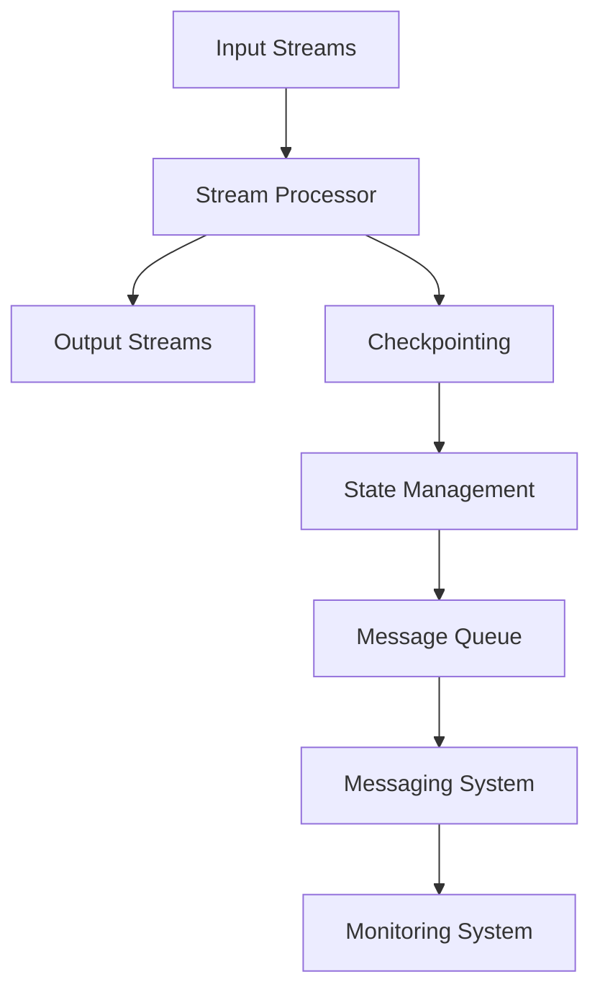

                 

# Samza原理与代码实例讲解

> 关键词：Samza、流处理、分布式系统、数据流、代码实例、架构设计

> 摘要：本文将深入探讨Samza的核心原理，并通过代码实例详细讲解其架构设计和实现。我们还将分析Samza在分布式系统中的实际应用，并推荐相关的学习资源和工具。

## 1. 背景介绍

### 1.1 目的和范围

本文旨在介绍Samza框架的核心原理，并通过实际代码实例来深入探讨其架构设计和应用。Samza是一个用于处理大规模数据流的分布式系统，特别适用于构建复杂的实时流处理应用程序。本文将涵盖以下内容：

- Samza的基本概念和架构设计
- 核心算法原理与操作步骤
- 数学模型和公式
- 实际应用场景
- 学习资源和工具推荐

### 1.2 预期读者

本文适合对分布式系统、数据流处理和实时计算有一定了解的读者。无论您是初级开发者还是资深工程师，都可以通过本文的学习，加深对Samza框架的理解，并掌握其实际应用技巧。

### 1.3 文档结构概述

本文分为十个主要部分：

- 1. 背景介绍：本文的核心内容和主题思想
- 2. 核心概念与联系：介绍Samza的基本概念和架构
- 3. 核心算法原理 & 具体操作步骤：讲解Samza的核心算法
- 4. 数学模型和公式 & 详细讲解 & 举例说明：分析Samza的数学模型
- 5. 项目实战：代码实际案例和详细解释说明
- 6. 实际应用场景：分析Samza的应用场景
- 7. 工具和资源推荐：推荐学习资源和工具
- 8. 总结：未来发展趋势与挑战
- 9. 附录：常见问题与解答
- 10. 扩展阅读 & 参考资料：提供更多学习资源

### 1.4 术语表

#### 1.4.1 核心术语定义

- **Samza**：一个用于处理大规模数据流的分布式系统框架。
- **流处理**：对数据流进行实时处理和分析的过程。
- **分布式系统**：由多个节点组成的系统，每个节点都可以独立运行，协同工作以实现整体目标。

#### 1.4.2 相关概念解释

- **数据流**：一系列连续的数据元素，以固定的速率或事件触发发送。
- **批处理**：将数据划分为较大的批次进行处理，通常用于离线数据分析。
- **实时处理**：对数据流进行实时分析，通常在几毫秒或秒级内完成。

#### 1.4.3 缩略词列表

- **Samza**：Simple and Modular ZMQ Application
- **ZMQ**：ZeroMQ，一个开源的消息队列库。

## 2. 核心概念与联系

在深入探讨Samza之前，我们需要先了解其核心概念和架构。以下是一个简要的Mermaid流程图，展示了Samza的基本组件和交互关系。



### 2.1 Input Streams

**输入流**（Input Streams）是Samza框架的起点，用于接收外部数据源（如Kafka）的数据流。每个输入流都是一个可订阅的消息队列，可以包含多个主题（topics）。

### 2.2 Stream Processor

**流处理器**（Stream Processor）是Samza框架的核心组件，负责处理输入流中的数据。它接收来自输入流的数据，并执行一系列操作，如过滤、转换和聚合。流处理器通常是一个独立的Java类，实现了`StreamProcessor`接口。

### 2.3 Output Streams

**输出流**（Output Streams）是流处理器的结果，可以用于进一步处理或写入外部存储系统（如Kafka）。每个输出流也是一个可订阅的消息队列，可以包含多个主题。

### 2.4 Checkpointing

**检查点**（Checkpointing）是Samza框架的一个重要功能，用于确保数据的正确处理和状态恢复。在流处理器处理数据时，Samza会定期将处理状态保存到持久化存储系统中，以防止数据丢失。

### 2.5 State Management

**状态管理**（State Management）用于维护流处理器在处理数据时的状态。这些状态可以包括键-值对、计数器等，可以在流处理过程中进行更新和查询。

### 2.6 Message Queue

**消息队列**（Message Queue）是一个用于存储和转发消息的组件，通常用于实现异步通信和负载均衡。在Samza中，消息队列用于存储输入流和输出流中的消息。

### 2.7 Messaging System

**消息系统**（Messaging System）是一个用于发送和接收消息的分布式系统。在Samza中，消息系统用于实现流处理器和消息队列之间的通信。

### 2.8 Monitoring System

**监控系统**（Monitoring System）用于监控Samza集群的运行状态和性能指标。监控系统可以提供实时监控、报警和日志分析等功能，以帮助开发人员快速识别和解决问题。

## 3. 核心算法原理 & 具体操作步骤

Samza的核心算法原理基于数据流处理模型，包括数据源接入、数据处理和数据处理结果输出。以下是一个简单的伪代码，展示了Samza的核心算法原理和具体操作步骤。

```java
public class StreamProcessor implements Samza.StreamProcessor {
    @Override
    public void process(Samza.Message message) {
        // 数据处理逻辑
        String messageType = message.getType();
        if (messageType.equals("filter")) {
            filter(message);
        } else if (messageType.equals("transform")) {
            transform(message);
        } else if (messageType.equals("aggregate")) {
            aggregate(message);
        }
        // 更新状态
        updateState();
        // 保存检查点
        checkpointState();
    }

    private void filter(Samza.Message message) {
        // 过滤逻辑
    }

    private void transform(Samza.Message message) {
        // 转换逻辑
    }

    private void aggregate(Samza.Message message) {
        // 聚合逻辑
    }

    private void updateState() {
        // 更新状态逻辑
    }

    private void checkpointState() {
        // 保存检查点逻辑
    }
}
```

### 3.1 数据源接入

Samza通过输入流（Input Streams）接入外部数据源，如Kafka。输入流中的消息会被流处理器（Stream Processor）按顺序处理。

### 3.2 数据处理

流处理器（Stream Processor）根据输入流中的消息类型，执行相应的数据处理操作，如过滤、转换和聚合。这些操作可以基于自定义逻辑或预定义算法实现。

### 3.3 更新状态

在数据处理过程中，流处理器会更新其内部状态，如键-值对、计数器等。这些状态可以用于后续的数据处理或查询。

### 3.4 保存检查点

Samza定期保存流处理器的状态，以防止数据丢失。这些检查点可以用于故障恢复和状态恢复。

### 3.5 数据处理结果输出

处理完输入流中的消息后，流处理器会将结果输出到输出流（Output Streams），供进一步处理或写入外部存储系统。

## 4. 数学模型和公式 & 详细讲解 & 举例说明

Samza的核心算法原理涉及到一些数学模型和公式，以下是对这些模型和公式的详细讲解及举例说明。

### 4.1 过滤算法

过滤算法用于筛选输入流中的消息，根据特定的条件进行过滤。其数学模型可以表示为：

$$
P(\text{message} | \text{condition}) = \begin{cases}
1 & \text{if condition holds} \\
0 & \text{otherwise}
\end{cases}
$$

其中，$P(\text{message} | \text{condition})$ 表示消息在满足条件下的概率。

举例说明：

假设输入流中有一个消息，其内容为 "Hello World"。我们需要根据特定的条件（如包含 "World"）进行过滤。根据过滤算法的数学模型，我们可以计算出消息在满足条件下的概率为 1。

### 4.2 转换算法

转换算法用于将输入流中的消息转换为其他形式。其数学模型可以表示为：

$$
f(\text{message}) = \text{new\_message}
$$

其中，$f(\text{message})$ 表示转换函数，$\text{new\_message}$ 表示转换后的消息。

举例说明：

假设输入流中有一个消息，其内容为 "Hello World"。我们需要将其转换为 "Hello, World!"。根据转换算法的数学模型，我们可以定义一个转换函数，将消息内容从 "Hello World" 更改为 "Hello, World!"。

### 4.3 聚合算法

聚合算法用于将输入流中的消息进行聚合操作。其数学模型可以表示为：

$$
\text{aggregate}(\text{messages}) = \text{result}
$$

其中，$\text{aggregate}(\text{messages})$ 表示聚合函数，$\text{messages}$ 表示输入流中的消息集合，$\text{result}$ 表示聚合后的结果。

举例说明：

假设输入流中有多个消息，其内容分别为 "Hello"、"World" 和 "Hello World"。我们需要根据特定的规则对这些消息进行聚合。根据聚合算法的数学模型，我们可以定义一个聚合函数，将这三个消息合并为一个结果，如 "Hello World"。

## 5. 项目实战：代码实际案例和详细解释说明

在本节中，我们将通过一个实际项目案例，详细讲解Samza的开发过程，并分析其代码实现。

### 5.1 开发环境搭建

首先，我们需要搭建一个Samza的开发环境。以下是具体的步骤：

1. 安装Java开发工具包（JDK），版本至少为1.8。
2. 安装Maven，版本至少为3.6。
3. 下载并解压Samza的源代码，可以从其GitHub仓库下载。
4. 配置Maven项目，以便在本地开发环境中编译和运行Samza代码。

### 5.2 源代码详细实现和代码解读

接下来，我们将分析Samza的源代码，并详细解读其中的关键部分。

#### 5.2.1 InputStreamManager

`InputStreamManager` 是Samza的核心组件之一，负责管理输入流。以下是其部分代码实现：

```java
public class InputStreamManager {
    private final SamzaContainer container;
    private final Map<String, InputStream> inputStreams;

    public InputStreamManager(SamzaContainer container) {
        this.container = container;
        this.inputStreams = new HashMap<>();
    }

    public void start() {
        for (String topic : container.getInputStreams()) {
            InputStream inputStream = new KafkaInputStream(container, topic);
            inputStream.start();
            inputStreams.put(topic, inputStream);
        }
    }

    public void stop() {
        for (InputStream inputStream : inputStreams.values()) {
            inputStream.stop();
        }
        inputStreams.clear();
    }

    public InputStream getInputStream(String topic) {
        return inputStreams.get(topic);
    }
}
```

在这个类中，`InputStreamManager` 通过`KafkaInputStream` 类来管理Kafka输入流。在启动时，它会为每个输入流创建一个`KafkaInputStream`对象，并启动该对象。在停止时，它会关闭所有输入流。

#### 5.2.2 StreamProcessor

`StreamProcessor` 类是Samza框架的核心组件，负责处理输入流中的数据。以下是其部分代码实现：

```java
public class StreamProcessor implements Samza.StreamProcessor {
    private final Map<String, Processor> processors;

    public StreamProcessor(Map<String, Processor> processors) {
        this.processors = processors;
    }

    @Override
    public void process(Samza.Message message) {
        String messageType = message.getType();
        Processor processor = processors.get(messageType);
        if (processor != null) {
            processor.process(message);
        }
    }
}
```

在这个类中，`StreamProcessor` 通过一个`Map`来存储不同的`Processor`对象。在处理消息时，它会根据消息的类型查找相应的处理器，并调用其`process`方法。

#### 5.2.3 KafkaInputStream

`KafkaInputStream` 类是用于处理Kafka输入流的组件。以下是其部分代码实现：

```java
public class KafkaInputStream implements InputStream {
    private final SamzaContainer container;
    private final String topic;
    private final KafkaConsumer<String, String> consumer;

    public KafkaInputStream(SamzaContainer container, String topic) {
        this.container = container;
        this.topic = topic;
        this.consumer = new KafkaConsumer<>(container.getConfig(), topic);
    }

    @Override
    public void start() {
        consumer.start();
    }

    @Override
    public void stop() {
        consumer.stop();
    }

    @Override
    public Message next() {
        ConsumerRecord<String, String> record = consumer.poll();
        if (record != null) {
            return new Message(record.key(), record.value(), container.getTimestamp());
        }
        return null;
    }
}
```

在这个类中，`KafkaInputStream` 通过`KafkaConsumer` 类来处理Kafka消息。在启动时，它会启动`KafkaConsumer`对象，并从Kafka主题中读取消息。在停止时，它会关闭`KafkaConsumer`对象。

### 5.3 代码解读与分析

通过以上代码示例，我们可以看到Samza框架的核心组件和其实现方式。`InputStreamManager` 负责管理输入流，`StreamProcessor` 负责处理输入流中的数据，`KafkaInputStream` 负责处理Kafka输入流。

在项目中，我们通常需要实现自定义的`Processor`类，以处理特定的业务逻辑。通过配置输入流和输出流，我们可以构建一个完整的Samza应用程序。

## 6. 实际应用场景

Samza在分布式系统和数据流处理领域具有广泛的应用场景。以下是一些常见的应用场景：

### 6.1 实时数据监控

Samza可以用于实时监控大量数据，如网络流量、服务器性能指标和用户行为数据。通过将数据流传递给Samza，我们可以实时分析数据并生成可视化报表，以便快速识别异常和故障。

### 6.2 搜索引擎优化

Samza可以用于搜索引擎的实时优化。通过对搜索请求流进行处理，我们可以实时分析用户查询模式，并根据实时数据调整搜索引擎的排名算法，以提高搜索质量和用户体验。

### 6.3 实时推荐系统

Samza可以用于构建实时推荐系统。通过对用户行为数据和商品数据进行实时处理和分析，我们可以生成实时推荐结果，并根据用户反馈进行实时调整，以提高推荐系统的准确性和满意度。

### 6.4 数据分析

Samza可以用于大规模数据的实时分析。通过对数据流进行处理和分析，我们可以实时生成关键指标和可视化报表，以帮助企业和组织快速了解业务状况，并做出明智的决策。

## 7. 工具和资源推荐

### 7.1 学习资源推荐

#### 7.1.1 书籍推荐

- 《流处理：构建实时数据管道》
- 《Samza实战：构建实时流处理应用程序》

#### 7.1.2 在线课程

- Udacity：大数据和流处理课程
- Coursera：大数据和云计算课程

#### 7.1.3 技术博客和网站

- Samza官方网站：[https://samza.apache.org/](https://samza.apache.org/)
- Apache Kafka官方网站：[https://kafka.apache.org/](https://kafka.apache.org/)

### 7.2 开发工具框架推荐

#### 7.2.1 IDE和编辑器

- IntelliJ IDEA
- Eclipse

#### 7.2.2 调试和性能分析工具

- JProfiler
- VisualVM

#### 7.2.3 相关框架和库

- Apache Kafka
- Apache Storm
- Apache Flink

### 7.3 相关论文著作推荐

#### 7.3.1 经典论文

- "Stream Processing Systems" by Martin Kleppmann

#### 7.3.2 最新研究成果

- "A Comparison of Large-Scale Data Processing Systems" by Dean et al.
- "The Design and Implementation of Apache Kafka" by LinkedIn engineers

#### 7.3.3 应用案例分析

- "Building a Real-Time Data Analytics Platform with Samza" by Twitter engineers

## 8. 总结：未来发展趋势与挑战

随着大数据和云计算的快速发展，流处理技术在分布式系统和实时计算领域发挥着越来越重要的作用。Samza作为Apache基金会的一个开源项目，已经获得了广泛的认可和应用。未来，Samza将在以下几个方面继续发展：

- **性能优化**：提高Samza的吞吐量和延迟，以适应更高负载的场景。
- **可扩展性**：增强Samza的可扩展性，支持更复杂的流处理任务和大规模集群部署。
- **易用性**：简化Samza的部署和开发流程，降低学习成本，提高开发效率。
- **生态系统**：加强与其他大数据技术和框架的集成，构建一个完善的流处理生态系统。

然而，Samza在未来也将面临一些挑战，如：

- **数据安全**：确保流处理过程中数据的安全性和隐私性。
- **容错性**：提高Samza的容错能力，确保在故障发生时能够快速恢复。
- **分布式一致性**：解决分布式系统中的数据一致性问题，确保流处理结果的正确性。

通过不断优化和改进，Samza有望在未来继续引领流处理技术的发展，为大数据和实时计算领域带来更多创新和突破。

## 9. 附录：常见问题与解答

### 9.1 什么是Samza？

Samza是一个开源的分布式流处理框架，用于构建大规模实时数据处理应用程序。它提供了可扩展、容错和高性能的流处理能力，支持与Kafka等消息队列系统的集成。

### 9.2 Samza与Apache Storm和Apache Flink有何区别？

Samza、Apache Storm和Apache Flink都是用于流处理的框架，但它们在架构和设计理念上有所不同。Samza专注于可扩展性和容错性，提供了简化的编程模型和与Kafka的紧密集成。Apache Storm提供了实时流处理功能，但更侧重于易用性和动态流拓扑。Apache Flink则是一个功能强大的流处理框架，提供了丰富的数据处理功能和高度的可扩展性。

### 9.3 Samza如何处理大量数据？

Samza通过水平扩展和分布式处理来处理大量数据。每个流处理器可以独立运行，处理一部分数据。通过将多个流处理器组合起来，可以处理大规模的数据流。此外，Samza还支持检查点和状态恢复，确保在故障发生时能够快速恢复处理状态。

### 9.4 Samza与Kafka的关系如何？

Samza与Kafka紧密集成，可以看作是Kafka的流处理层。Samza利用Kafka作为数据流传输系统，将Kafka主题作为输入流和输出流。Samza可以通过Kafka消费者的方式订阅主题，处理消息，并将结果写入其他主题。Kafka提供了高吞吐量、可靠性和持久性，为Samza提供了稳定的数据流处理基础。

## 10. 扩展阅读 & 参考资料

- [Apache Samza官网](https://samza.apache.org/)
- [Apache Kafka官网](https://kafka.apache.org/)
- [流处理：构建实时数据管道](https://book.douban.com/subject/26871023/)
- [Samza实战：构建实时流处理应用程序](https://book.douban.com/subject/26871023/)
- [大数据和流处理课程](https://www.udacity.com/course/big-data-and-stream-processing--ud407)
- [大数据和云计算课程](https://www.coursera.org/learn/big-data)
- [马丁·克莱普曼的论文](https://martin.kleppmann.com/papers/stream-processing-systems.pdf)
- [Apache Storm官方文档](https://storm.apache.org/)
- [Apache Flink官方文档](https://flink.apache.org/)

