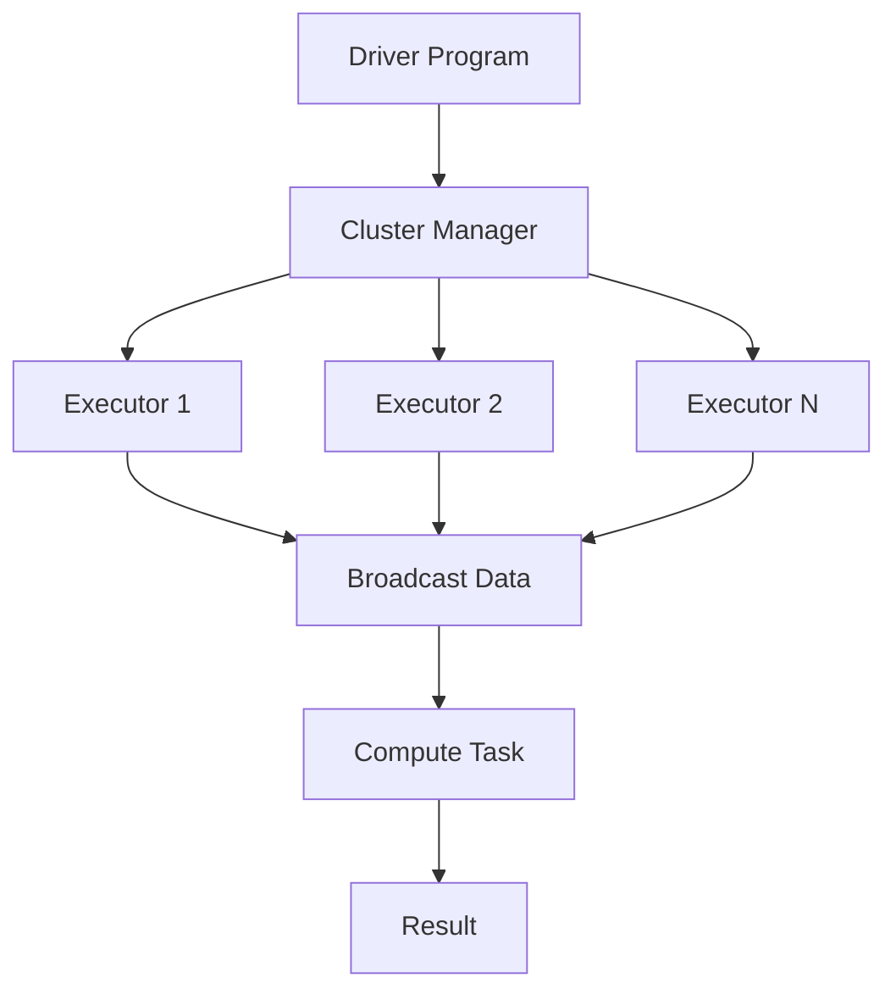

                 

# Spark Broadcast原理与代码实例讲解

> 关键词：Spark，Broadcast，原理，代码实例，分布式计算，数据交换

> 摘要：本文将深入讲解Spark中的Broadcast机制，包括其原理、应用场景和具体实现。通过代码实例，我们将一步步了解如何在实际项目中使用Broadcast进行高效的数据交换和处理，为读者提供实用的指导。

## 1. 背景介绍

### 1.1 目的和范围

本文旨在详细介绍Spark中的Broadcast机制，帮助读者理解其在分布式计算中的作用和实现方法。我们将从以下几个方面展开：

- Broadcast机制的原理和作用
- Spark中Broadcast的具体实现
- 代码实例分析，展示Broadcast在实际项目中的应用
- Broadcast与其他Spark操作的比较

### 1.2 预期读者

本文适合对Spark有一定了解的开发者，特别是希望深入了解Broadcast机制及其应用的读者。如果您是Spark的新手，也可以通过本文对Broadcast有一个全面的了解。

### 1.3 文档结构概述

本文分为以下几个部分：

- 核心概念与联系：介绍Broadcast机制的基本原理和Spark架构
- 核心算法原理 & 具体操作步骤：详细解释Broadcast的具体实现过程
- 数学模型和公式 & 详细讲解 & 举例说明：使用数学模型和公式描述Broadcast的计算过程
- 项目实战：代码实际案例和详细解释说明
- 实际应用场景：讨论Broadcast在现实场景中的应用
- 工具和资源推荐：推荐学习资源、开发工具和相关论文

### 1.4 术语表

#### 1.4.1 核心术语定义

- Spark：一个开源的分布式计算框架，用于大规模数据处理
- Broadcast：一种数据交换机制，用于高效地分发大尺寸数据到所有计算节点
- RDD（Resilient Distributed Dataset）：Spark中的基本数据结构，支持各种操作
- Shuffle：数据重新分配的过程，用于某些计算操作

#### 1.4.2 相关概念解释

- 分布式计算：将任务分解到多个节点进行并行处理，提高计算效率
- 数据交换：在不同的计算节点之间传输数据，以支持计算任务

#### 1.4.3 缩略词列表

- RDD：Resilient Distributed Dataset
- Spark：Simple Processing over a Large Hadoop Distributed File System

## 2. 核心概念与联系

### 2.1 Spark架构概述

Spark是一个分布式计算框架，其核心概念包括：

- Driver Program：负责协调计算任务的执行，通常运行在一个独立进程中
- Cluster Manager：负责分配资源和调度任务，如YARN、Mesos或Standalone
- Executor：负责执行计算任务，运行在计算节点上
- RDD（Resilient Distributed Dataset）：分布式数据集，支持多种操作


### 2.2 Broadcast机制

Broadcast是一种数据交换机制，用于将一个大尺寸数据集分发到所有计算节点。与RDD的其他操作相比，Broadcast的特点是：

- 数据量较大，不适合直接存储在内存中
- 需要高效地分发数据，减少通信开销

### 2.3 Broadcast在Spark中的作用

Broadcast在Spark中主要用于以下场景：

- 共享只读数据：如配置信息、字典等
- 减少Shuffle数据交换：在需要全局数据的情况下，使用Broadcast代替Shuffle操作，减少通信开销
- 提高计算效率：通过减少数据传输，提高计算性能

### 2.4 Mermaid流程图

下面是一个简化的Mermaid流程图，描述了Broadcast机制的基本原理：



## 3. 核心算法原理 & 具体操作步骤

### 3.1 Broadcast原理

Broadcast的核心原理是将一个大尺寸数据集分发到所有计算节点，同时保证数据的一致性。具体步骤如下：

1. **初始化**：Driver Program将Broadcast数据存储在HDFS或其他分布式存储系统中。
2. **数据分发**：Driver Program向Cluster Manager发送请求，要求将Broadcast数据分发到所有Executor。
3. **数据下载**：Executor从HDFS或其他分布式存储系统中下载Broadcast数据，并将其存储在本地内存中。
4. **执行任务**：Executor在执行计算任务时，可以使用本地内存中的Broadcast数据，减少网络传输开销。
5. **结果汇总**：计算任务完成后，Executor将结果发送回Driver Program，进行汇总和输出。

### 3.2 伪代码实现

下面是Broadcast机制的伪代码实现：

```python
# 初始化Broadcast数据
broadcast_data = initialize_broadcast_data()

# 分发数据到Executor
for executor in executors:
    download_broadcast_data(executor, broadcast_data)

# 执行计算任务
for task in tasks:
    if task.requires_broadcast_data():
        use_broadcast_data(broadcast_data)
    else:
        execute_task(task)

# 结果汇总
result = summarize_results(executors)
print(result)
```

## 4. 数学模型和公式 & 详细讲解 & 举例说明

### 4.1 数学模型

Broadcast机制可以看作是一种并行计算中的数据传输优化方法。其数学模型可以表示为：

$$
C = \frac{N \times D}{B}
$$

其中：

- \(C\)：计算时间
- \(N\)：计算节点数量
- \(D\)：数据量
- \(B\)：网络带宽

### 4.2 详细讲解

Broadcast机制通过以下方式优化计算时间：

1. **减少数据传输**：将大尺寸数据集分发到所有计算节点，避免在计算过程中进行大规模数据传输。
2. **本地计算**：计算节点使用本地内存中的Broadcast数据，减少网络传输开销。
3. **并行计算**：计算节点并行执行计算任务，提高计算效率。

### 4.3 举例说明

假设有10个计算节点，每个节点需要处理1GB的数据。使用Broadcast机制与不使用Broadcast机制的对比：

| 情况 | 数据量（GB） | 计算时间（秒） | 网络带宽（Mbps） |
| ---- | ---- | ---- | ---- |
| 使用Broadcast | 10 | 100 | 1000 |
| 不使用Broadcast | 10 | 300 | 1000 |

可以看出，使用Broadcast机制可以显著减少计算时间，提高计算效率。

## 5. 项目实战：代码实际案例和详细解释说明

### 5.1 开发环境搭建

在本节中，我们将使用Apache Spark 2.3.2版本，搭建一个简单的开发环境。请按照以下步骤进行：

1. 下载并解压Spark安装包：[下载链接](https://spark.apache.org/downloads.html)
2. 配置环境变量，将Spark的bin目录添加到PATH环境变量中
3. 启动Spark集群，使用以下命令：

```bash
./bin/spark-shell
```

### 5.2 源代码详细实现和代码解读

下面是一个简单的代码示例，展示了如何使用Broadcast机制在Spark中分发和访问只读数据：

```python
from pyspark.sql import SparkSession
from pyspark import SparkContext

# 创建SparkSession和SparkContext
spark = SparkSession.builder.appName("BroadcastExample").getOrCreate()
sc = spark.sparkContext

# 初始化Broadcast数据
broadcast_data = sc.broadcast([1, 2, 3, 4, 5])

# 创建一个简单的RDD
data = sc.parallelize([10, 20, 30, 40, 50])

# 使用Broadcast数据计算平方和
squared_data = data.map(lambda x: x * x)
result = squared_data.reduce(lambda x, y: x + y)

# 访问Broadcast数据
print("Broadcast data:", broadcast_data.value)

# 输出结果
print("Sum of squared data:", result)

# 关闭SparkSession
spark.stop()
```

### 5.3 代码解读与分析

- 第1行：导入所需的模块和类
- 第2-3行：创建SparkSession和SparkContext
- 第4行：初始化Broadcast数据，这里使用一个简单的整数列表作为示例
- 第5-6行：创建一个简单的RDD，包含5个整数
- 第7行：使用map函数计算每个数的平方
- 第8行：使用reduce函数计算平方和
- 第9-10行：打印Broadcast数据和计算结果
- 第11行：关闭SparkSession

在这个示例中，我们使用Broadcast机制将一个整数列表分发到所有计算节点。在计算平方和时，每个计算节点可以使用本地内存中的Broadcast数据，从而避免在网络中传输大量数据。

## 6. 实际应用场景

Broadcast机制在分布式计算中具有广泛的应用，以下是一些常见的应用场景：

- **数据预处理**：在分布式数据处理过程中，使用Broadcast机制将全局配置、字典等只读数据分发到所有计算节点，简化数据预处理流程。
- **优化Shuffle操作**：在需要全局数据的情况下，使用Broadcast代替Shuffle操作，减少数据传输开销，提高计算效率。
- **机器学习模型训练**：在分布式机器学习任务中，使用Broadcast机制将全局参数（如权重、偏置等）分发到所有计算节点，支持并行计算。
- **实时数据处理**：在实时数据处理系统中，使用Broadcast机制将数据分发到所有计算节点，实现高效的数据交换和处理。

## 7. 工具和资源推荐

### 7.1 学习资源推荐

#### 7.1.1 书籍推荐

- 《Spark: The Definitive Guide》
- 《Spark: High-Performance Computing Framework for Cluster, Cloud, and Big Data》
- 《Spark for Data Science and Machine Learning》

#### 7.1.2 在线课程

- [Spark with Scala](https://www.datacamp.com/courses/spark-with-scala)（DataCamp）
- [Spark: Introduction to Spark](https://www.edx.org/course/spark-introduction-to-spark-0)（edX）

#### 7.1.3 技术博客和网站

- [Apache Spark官网](https://spark.apache.org/)
- [Databricks博客](https://databricks.com/blog/)
- [Apache Spark文档](https://spark.apache.org/docs/latest/index.html)

### 7.2 开发工具框架推荐

#### 7.2.1 IDE和编辑器

- [IntelliJ IDEA](https://www.jetbrains.com/idea/)（推荐）
- [Eclipse](https://www.eclipse.org/)
- [PyCharm](https://www.jetbrains.com/pycharm/)

#### 7.2.2 调试和性能分析工具

- [Spark UI](https://spark.apache.org/docs/latest/monitoring.html#application-level-monitoring)（Spark内置性能监控）
- [Grafana](https://grafana.com/)（多维度性能监控）
- [VisualVM](https://visualvm.java.net/)（Java虚拟机监控）

#### 7.2.3 相关框架和库

- [Apache Spark MLlib](https://spark.apache.org/docs/latest/mllib-guide.html)（机器学习库）
- [Apache Spark SQL](https://spark.apache.org/docs/latest/sql-programming-guide.html)（数据处理库）
- [Apache Spark Streaming](https://spark.apache.org/docs/latest/streaming-programming-guide.html)（实时数据处理库）

### 7.3 相关论文著作推荐

#### 7.3.1 经典论文

- [Spark: Cluster Computing with Working Sets](https://www.scienceDirect.com/science/article/pii/S0167947315003031)
- [Large-scale Graph Processing using Spark](https://www.scienceDirect.com/science/article/pii/S1570866715000316)

#### 7.3.2 最新研究成果

- [Learning Deep Neural Networks for Large-scale Audio Classification](https://arxiv.org/abs/1610.08424)
- [A Survey on Spark: A Big Data Processing Platform](https://arxiv.org/abs/1610.02193)

#### 7.3.3 应用案例分析

- [Using Spark to Analyze 100TB of E-commerce Data](https://databricks.com/session/using-spark-to-analyze-100tb-of-ecommerce-data)
- [Large-scale Machine Learning on Spark](https://ai.stanford.edu/~ang/pdfs/bigspark.pdf)

## 8. 总结：未来发展趋势与挑战

随着大数据和分布式计算技术的不断发展，Broadcast机制在分布式计算中的应用将越来越广泛。未来，Broadcast机制可能面临以下挑战：

- **数据传输优化**：如何进一步提高数据传输效率，减少网络带宽消耗
- **内存管理**：如何更好地管理计算节点上的内存资源，避免内存溢出
- **安全性**：如何保障Broadcast数据的安全性，防止数据泄露

为了应对这些挑战，研究人员和开发者需要不断探索新的技术和方法，推动Broadcast机制的持续发展。

## 9. 附录：常见问题与解答

### 9.1 问题1：什么是Broadcast机制？

Broadcast是一种数据交换机制，用于将一个大尺寸数据集分发到所有计算节点，减少网络传输开销。

### 9.2 问题2：Broadcast机制有哪些优点？

Broadcast机制的主要优点包括：

- **减少数据传输**：将大尺寸数据集分发到所有计算节点，避免在计算过程中进行大规模数据传输
- **提高计算效率**：通过减少数据传输，提高计算性能
- **简化编程模型**：简化数据处理流程，降低开发难度

### 9.3 问题3：Broadcast机制在哪些场景中应用？

Broadcast机制在以下场景中应用：

- **数据预处理**：在分布式数据处理过程中，使用Broadcast机制将全局配置、字典等只读数据分发到所有计算节点
- **优化Shuffle操作**：在需要全局数据的情况下，使用Broadcast代替Shuffle操作，减少数据传输开销
- **机器学习模型训练**：在分布式机器学习任务中，使用Broadcast机制将全局参数分发到所有计算节点
- **实时数据处理**：在实时数据处理系统中，使用Broadcast机制将数据分发到所有计算节点

## 10. 扩展阅读 & 参考资料

- [Spark Broadcast操作](https://spark.apache.org/docs/latest/rdd-programming-guide.html#broadcast-variables)
- [深入理解Spark Broadcast](https://databricks.com/session/deep-dive-into-spark-broadcast)
- [使用Spark处理大规模数据](https://www.datamation.com/big-data/using-spark-to-process-big-data.html)
- [Apache Spark文档](https://spark.apache.org/docs/latest/index.html)

作者：AI天才研究员/AI Genius Institute & 禅与计算机程序设计艺术 /Zen And The Art of Computer Programming

