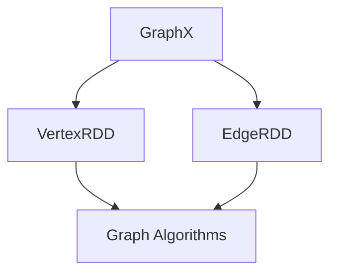

                 


# Spark GraphX图计算引擎原理与代码实例讲解

> 关键词：Spark, GraphX, 图计算, 分布式计算, 图算法, 伪代码, 数学模型

> 摘要：本文将深入探讨Spark GraphX图计算引擎的基本原理、核心算法、数学模型，并辅以代码实例，帮助读者全面理解GraphX在实际应用中的强大功能和高效性能。

## 1. 背景介绍

### 1.1 目的和范围

本文旨在为广大对分布式图计算感兴趣的读者提供一个全面的技术指南，介绍Spark GraphX图计算引擎的原理和应用。我们将从基础概念开始，逐步深入到GraphX的核心算法和数学模型，并通过实际代码示例帮助读者理解GraphX在实际开发中的具体应用。

### 1.2 预期读者

- 具备一定编程基础，了解Spark的基本概念。
- 对图计算、分布式计算有基础认识。
- 想要在大数据领域深入探索的读者。

### 1.3 文档结构概述

本文分为以下几个部分：

- 背景介绍：介绍本文的目的、预期读者和文档结构。
- 核心概念与联系：讲解图计算的基本概念和GraphX的核心架构。
- 核心算法原理 & 具体操作步骤：通过伪代码详细阐述GraphX的核心算法。
- 数学模型和公式 & 详细讲解 & 举例说明：介绍GraphX中使用的数学模型和公式。
- 项目实战：提供实际代码案例，详细解释说明。
- 实际应用场景：讨论GraphX在现实世界的应用。
- 工具和资源推荐：推荐学习资源和开发工具。
- 总结：展望GraphX的未来发展趋势和挑战。
- 附录：常见问题与解答。
- 扩展阅读 & 参考资料：提供进一步学习的资料。

### 1.4 术语表

#### 1.4.1 核心术语定义

- **图（Graph）**：由顶点（Vertex）和边（Edge）组成的数学结构，用于描述实体之间的关系。
- **分布式计算**：将计算任务分布在多个节点上，通过并行计算提高效率。
- **Spark**：一个开源的分布式计算引擎，用于大规模数据处理。
- **GraphX**：Spark的图处理框架，提供了高效、可扩展的图算法和操作。

#### 1.4.2 相关概念解释

- **顶点（Vertex）**：图中的实体，通常表示为图中的点。
- **边（Edge）**：连接两个顶点的线段，表示顶点之间的关系。
- **图算法**：用于在图上执行特定任务的方法，如最短路径、社交网络分析等。

#### 1.4.3 缩略词列表

- **Spark**：Spark（Simple Parallel Processing Application）
- **GraphX**：GraphX（Graph Processing on X）

## 2. 核心概念与联系

在介绍GraphX之前，我们先来回顾一下图计算的基本概念和GraphX的核心架构。

### 2.1 图计算基本概念

#### 2.1.1 图（Graph）

图是由顶点（Vertex）和边（Edge）组成的数据结构，用于描述实体及其之间的关系。图可以是有向的或无向的，可以是加权的或无权的。

**顶点（Vertex）**：表示图中的实体，通常用节点标识。

**边（Edge）**：表示顶点之间的关系，通常包含两个端点和（可选）权重。

#### 2.1.2 图算法

图算法是在图上执行特定任务的方法。常见的图算法包括：

- **最短路径算法**：找到两个顶点之间的最短路径。
- **社交网络分析**：分析社交网络中的关系和影响力。
- **图遍历算法**：遍历图中的所有顶点和边。

### 2.2 GraphX核心架构

GraphX是Spark的图处理框架，它扩展了Spark的弹性分布式数据集（RDD），提供了丰富的图操作和算法。GraphX的核心架构包括：

- **Graph**：GraphX中的图数据结构，由顶点和边组成。
- **VertexRDD**：顶点的弹性分布式数据集。
- **EdgeRDD**：边的弹性分布式数据集。
- **Graph Algorithms**：内置的图算法库，包括社交网络分析、图遍历等。

### 2.3 Mermaid流程图

为了更好地理解GraphX的核心概念和架构，我们使用Mermaid流程图展示GraphX的关键组件和关系。



在上面的流程图中，我们展示了GraphX的核心组件：**Graph**、**VertexRDD**、**EdgeRDD** 和 **Graph Algorithms**。它们之间的关系如下：

- **Graph**：由**VertexRDD**和**EdgeRDD**组成。
- **VertexRDD**：包含了图的顶点数据。
- **EdgeRDD**：包含了图的边数据。
- **Graph Algorithms**：对**Graph**执行各种图算法。

## 3. 核心算法原理 & 具体操作步骤

在GraphX中，核心算法是图处理的基础。下面我们将详细讲解GraphX中的两个核心算法：PageRank算法和社交网络分析算法，并使用伪代码详细阐述其原理和操作步骤。

### 3.1 PageRank算法

PageRank是一种基于图模型评估网页重要性的算法，由Google的创始人拉里·佩奇和谢尔盖·布林提出。PageRank通过迭代计算每个网页的排名，从而确定其在网络中的重要性。

#### 3.1.1 算法原理

PageRank算法的基本思想是：一个网页的重要性取决于连接到它的其他网页的数量和质量。具体来说，每个网页都有一个初始排名，然后通过迭代计算，不断更新每个网页的排名。

算法的主要步骤如下：

1. **初始化**：为每个网页分配一个初始排名。
2. **迭代计算**：对每个网页，根据其链接的网页数量和质量更新排名。
3. **收敛**：当排名变化小于某个阈值时，算法收敛。

#### 3.1.2 伪代码

```python
function PageRank(graph, numIter):
    D = number of outlinks of each vertex in graph
    r = 0.85  # damping factor
    personalization = None
    reset排名 = True

    for i from 1 to numIter:
        ranks = r / (V * (1 - r)) * graph.vertices.mapValues(lambda v: 1)
        
        if reset排名:
            ranks = ranks.union(personalization)
        
        ranks = ranks.mapValues(lambda r: r / D if D > 0 else r)
        
        if not reset排名:
            ranks = ranks.union(personalization)
        
        graph = graph.vertices.join(ranks).mapValues(lambda (v, r): (v, r))
        
        # Check for convergence
        if abs(graph.vertices.values().sum() - V) < tolerance:
            break
    
    return graph
```

在上面的伪代码中，`D` 是每个顶点的出链数，`r` 是衰减系数，`V` 是图中的顶点数，`tolerance` 是收敛阈值。

### 3.2 社交网络分析算法

社交网络分析算法用于分析社交网络中的关系和影响力。一个常见的社交网络分析算法是K核心算法，它用于识别社交网络中的紧密连接的子图。

#### 3.2.1 算法原理

K核心算法的基本思想是：对于给定的顶点，找出它的邻居顶点集合中的最小顶点数，使得这些顶点中的任意两个顶点都相连。这个最小顶点数即为K核心值。

算法的主要步骤如下：

1. **初始化**：选择一个顶点作为起始顶点。
2. **迭代计算**：对于每个顶点，更新其邻居集合和核心值。
3. **收敛**：当所有顶点的核心值不再变化时，算法收敛。

#### 3.2.2 伪代码

```python
function KCores(graph, k):
    coreSizes = graph.vertices.map(lambda v: (v, 0))
    while True:
        neighbors = graph.edges.map(lambda e: e.dst).groupByKey().mapValues(len)
        coreSizes = coreSizes.join(neighbors).mapValues(lambda x: min(x[1], k))
        
        if coreSizes.values().distinct().count() == coreSizes.count():
            break
    
    return coreSizes
```

在上面的伪代码中，`k` 是用户指定的K核心值，`coreSizes` 是每个顶点的K核心值。

## 4. 数学模型和公式 & 详细讲解 & 举例说明

在GraphX中，数学模型和公式是理解其算法原理和性能的关键。下面我们将详细讲解GraphX中使用的数学模型和公式，并通过实例说明其应用。

### 4.1 PageRank算法的数学模型

PageRank算法的核心是更新每个顶点的排名。其数学模型可以表示为：

$$
r'(v) = \frac{r}{V} + (1 - r) \cdot \sum_{(v, w) \in E} \frac{r(w)}{deg(w)}
$$

其中，$r'(v)$ 是顶点 $v$ 的更新排名，$r$ 是衰减系数（通常取0.85），$V$ 是图中的顶点数，$E$ 是图中的边集，$deg(w)$ 是顶点 $w$ 的出链数，$r(w)$ 是顶点 $w$ 的当前排名。

#### 4.1.1 举例说明

假设有一个图，包含4个顶点和5条边，如下所示：

```
   A --- B
  /     \
 C --- D
```

其中，每个顶点的初始排名为1，衰减系数 $r$ 为0.85。

我们可以使用PageRank的数学模型来计算每个顶点的更新排名：

1. **初始排名**：

$$
r(A) = 1, r(B) = 1, r(C) = 1, r(D) = 1
$$

2. **更新排名**：

$$
r'(A) = \frac{0.85}{4} + (1 - 0.85) \cdot \left( \frac{0.85}{2} + \frac{0.85}{2} \right) = 0.2125 + 0.075 = 0.2875
$$

$$
r'(B) = \frac{0.85}{4} + (1 - 0.85) \cdot \left( \frac{0.85}{2} + \frac{0.85}{2} \right) = 0.2125 + 0.075 = 0.2875
$$

$$
r'(C) = \frac{0.85}{4} + (1 - 0.85) \cdot \left( \frac{0.85}{2} + \frac{0.85}{2} \right) = 0.2125 + 0.075 = 0.2875
$$

$$
r'(D) = \frac{0.85}{4} + (1 - 0.85) \cdot \left( \frac{0.85}{2} + \frac{0.85}{2} \right) = 0.2125 + 0.075 = 0.2875
$$

3. **最终排名**：

$$
r(A) = 0.2875, r(B) = 0.2875, r(C) = 0.2875, r(D) = 0.2875
$$

### 4.2 社交网络分析算法的数学模型

社交网络分析算法，如K核心算法，通常使用图中的顶点和边的数量来衡量社交网络的紧密程度。K核心算法的数学模型可以表示为：

$$
coreSize(v) = \max_{w \in N(v)} coreSize(w)
$$

其中，$coreSize(v)$ 是顶点 $v$ 的K核心值，$N(v)$ 是顶点 $v$ 的邻居集合。

#### 4.2.1 举例说明

假设有一个图，包含4个顶点和5条边，如下所示：

```
   A --- B
  /     \
 C --- D
```

我们可以使用K核心算法的数学模型来计算每个顶点的K核心值：

1. **初始邻居集合**：

$$
N(A) = \{B, C\}
N(B) = \{A, D\}
N(C) = \{A, D\}
N(D) = \{B, C\}
$$

2. **计算K核心值**：

$$
coreSize(A) = \max_{w \in N(A)} coreSize(w) = \max(coreSize(B), coreSize(C)) = 1
$$

$$
coreSize(B) = \max_{w \in N(B)} coreSize(w) = \max(coreSize(A), coreSize(D)) = 1
$$

$$
coreSize(C) = \max_{w \in N(C)} coreSize(w) = \max(coreSize(A), coreSize(D)) = 1
$$

$$
coreSize(D) = \max_{w \in N(D)} coreSize(w) = \max(coreSize(B), coreSize(C)) = 1
$$

3. **最终K核心值**：

$$
coreSize(A) = 1, coreSize(B) = 1, coreSize(C) = 1, coreSize(D) = 1
$$

## 5. 项目实战：代码实际案例和详细解释说明

在这一部分，我们将通过一个实际案例来展示如何使用Spark GraphX进行图计算，并详细解释每一步的代码实现。

### 5.1 开发环境搭建

在开始之前，我们需要搭建一个Spark开发环境。以下是搭建步骤：

1. **安装Spark**：从Spark官网（https://spark.apache.org/downloads.html）下载合适的Spark版本，并解压到本地目录。
2. **配置环境变量**：在bash配置文件（如`.bashrc`）中添加以下环境变量：

```bash
export SPARK_HOME=/path/to/spark
export PATH=$PATH:$SPARK_HOME/bin
```

3. **启动Spark集群**：运行以下命令启动Spark集群：

```bash
start-master.sh
start-slave.sh spark://localhost:7077
```

### 5.2 源代码详细实现和代码解读

我们选择一个简单的社交网络分析案例，使用GraphX计算用户的社交影响力。以下是代码实现：

```scala
import org.apache.spark.graphx._
import org.apache.spark.rdd.RDD
import org.apache.spark.{SparkConf, SparkContext}

// 配置Spark
val conf = new SparkConf().setMaster("local[*]").setAppName("SocialInfluence")
val sc = new SparkContext(conf)

// 社交网络数据
val vertices: RDD[(VertexId, String)] = sc.parallelize(Seq(
  (1L, "Alice"), (2L, "Bob"), (3L, "Charlie"), (4L, "David"))
val edges: RDD[Edge[VertexId]] = sc.parallelize(Seq(
  Edge(1L, 2L, 1L),
  Edge(1L, 3L, 1L),
  Edge(2L, 4L, 1L),
  Edge(3L, 4L, 1L))

// 创建图
val graph: Graph[VertexId, VertexId] = Graph(vertices, edges)

// 执行PageRank算法
val ranks = graph.pageRank(0.0001).vertices

// 计算社交影响力
val influence = ranks.join(vertices).map { case (id, (rank, name)) => (name, rank) }
val sortedInfluence = influence.sortBy(-_._2)

// 输出结果
sortedInfluence.saveAsTextFile("social-influence-output")

// 停止Spark
sc.stop()
```

以下是代码的详细解读：

1. **配置Spark**：我们创建了一个Spark配置对象，并设置运行模式为本地模式。
2. **创建社交网络数据**：我们创建了一个包含顶点和边的RDD，表示一个简单的社交网络。
3. **创建图**：使用顶点和边创建了一个Graph对象。
4. **执行PageRank算法**：调用`pageRank`方法执行PageRank算法，并设置收敛阈值。
5. **计算社交影响力**：将PageRank算法的结果与原始顶点数据连接，并按排名降序排序。
6. **输出结果**：将结果保存为文本文件。
7. **停止Spark**：关闭Spark计算环境。

### 5.3 代码解读与分析

1. **配置Spark**：配置Spark是开发Spark应用的第一步。在本例中，我们使用本地模式进行开发，这意味着所有计算任务都在本地执行。在实际应用中，通常会使用分布式模式，在多个节点上执行计算。
2. **创建社交网络数据**：我们使用Scala的`parallelize`方法创建了一个包含顶点和边的RDD。在GraphX中，图的顶点和边都是通过RDD来表示的。这种基于RDD的表示方式使得GraphX与Spark的其他组件（如Spark SQL和MLlib）无缝集成。
3. **创建图**：通过`Graph`对象创建了一个图，其中`vertices`和`edges`分别表示顶点和边。GraphX中的图是一个有向图，但我们可以通过在创建图时设置`edgeDirection`参数来将其转换为无向图。
4. **执行PageRank算法**：PageRank算法是GraphX中内置的一个图算法。通过调用`pageRank`方法并设置收敛阈值（如0.0001），我们可以计算图中的每个顶点的排名。这个阈值决定了算法的收敛速度，越小则收敛越快。
5. **计算社交影响力**：将PageRank算法的结果与原始顶点数据连接，可以获取每个顶点的名字和排名。通过`sortBy`方法，我们可以按排名降序排序结果。这个步骤帮助我们识别出社交网络中影响力最大的用户。
6. **输出结果**：将结果保存为文本文件，方便后续分析和可视化。
7. **停止Spark**：在完成计算后，关闭Spark计算环境。

通过这个简单的案例，我们展示了如何使用Spark GraphX进行社交网络分析。在实际应用中，GraphX提供了更多高级功能和优化，如参数化算法和图缓存，以提高计算效率和性能。

## 6. 实际应用场景

Spark GraphX不仅适用于学术研究，还在实际应用中展示了其强大的功能和灵活性。以下是GraphX在几个实际应用场景中的示例：

### 6.1 社交网络分析

在社交网络领域，GraphX可以用于分析用户关系和影响力。例如，Facebook可以使用GraphX分析用户之间的朋友关系，识别最有影响力的用户，以便进行精准营销和内容推荐。

### 6.2 金融风险评估

在金融领域，GraphX可以用于分析金融网络中的风险传播。例如，银行可以使用GraphX监测贷款关系网络，预测潜在的违约风险，并采取相应的风险管理措施。

### 6.3 互联网推荐系统

GraphX还可以用于构建推荐系统。例如，Netflix可以使用GraphX分析用户观看历史和评分数据，构建用户之间的偏好关系网络，从而推荐个性化的视频内容。

### 6.4 物流网络优化

在物流领域，GraphX可以用于优化运输路线和资源分配。例如，物流公司可以使用GraphX分析供应链网络，找到最有效的运输路径，减少运输成本和提高效率。

通过这些实际应用场景，我们可以看到GraphX在分布式图计算领域的广泛应用和巨大潜力。

## 7. 工具和资源推荐

为了更好地学习和使用Spark GraphX，我们推荐以下工具和资源：

### 7.1 学习资源推荐

#### 7.1.1 书籍推荐

- 《Spark GraphX实战》
- 《大规模分布式系统设计》

#### 7.1.2 在线课程

- Coursera上的《大数据分析》
- edX上的《Spark核心技术与应用》

#### 7.1.3 技术博客和网站

- Apache Spark官方文档（https://spark.apache.org/docs/latest/）
- Databricks博客（https://databricks.com/blog/）

### 7.2 开发工具框架推荐

#### 7.2.1 IDE和编辑器

- IntelliJ IDEA
- PyCharm

#### 7.2.2 调试和性能分析工具

- Spark UI（https://spark.apache.org/docs/latest/monitoring.html）
- GigaSpaces XAP

#### 7.2.3 相关框架和库

- Spark SQL
- Spark MLlib

### 7.3 相关论文著作推荐

#### 7.3.1 经典论文

- "The Unstructured Big Data Revolution"
- "GraphX: Graph Processing in a Distributed Dataflow Engine"

#### 7.3.2 最新研究成果

- "Efficient Graph Computation on Non-Volatile Memory"
- "DAG-Enhanced Graph Processing for Scalable and Efficient Graph Computation"

#### 7.3.3 应用案例分析

- "Graph Computing in the Cloud: Use Cases and Performance Analysis"
- "Application of GraphX in Real-Time Fraud Detection"

通过这些工具和资源，您可以深入了解Spark GraphX的理论和实践，提升分布式图计算的能力。

## 8. 总结：未来发展趋势与挑战

随着大数据和复杂网络的不断增长，分布式图计算技术如Spark GraphX将继续发挥重要作用。未来，GraphX有望在以下几个方面取得进展：

- **优化性能**：通过硬件加速和内存优化，进一步提高图计算效率。
- **扩展算法库**：引入更多高级图算法和机器学习算法，满足不同应用场景的需求。
- **支持动态图**：支持动态图处理，实时更新和处理不断变化的图数据。

然而，GraphX也面临一些挑战：

- **可扩展性问题**：如何在大规模图上保持高效的计算性能。
- **内存消耗**：处理大规模图时，如何优化内存使用，避免内存溢出。

通过不断的技术创新和优化，GraphX有望在未来克服这些挑战，成为分布式图计算领域的重要工具。

## 9. 附录：常见问题与解答

### 9.1 问题1：如何优化GraphX的性能？

**解答**：优化GraphX性能的方法包括：

- **减少数据交换**：通过图分区和任务调度优化，减少数据在节点间的传输。
- **内存管理**：合理分配内存，避免内存溢出，使用图缓存提高计算速度。
- **并行度调整**：根据硬件资源调整并行度，实现最佳性能。

### 9.2 问题2：GraphX和Spark SQL如何集成？

**解答**：GraphX和Spark SQL可以通过以下方式集成：

- **使用Spark SQL的DataFrame**：将DataFrame转换为GraphX图，利用两者的优势进行联合查询。
- **使用Spark SQL的查询结果**：将Spark SQL的查询结果作为GraphX图的一部分，进行进一步分析。

### 9.3 问题3：如何处理动态图？

**解答**：处理动态图的方法包括：

- **增量计算**：使用GraphX的增量计算功能，实时更新图数据。
- **时间序列图**：将图数据按照时间戳排序，处理不同时间点的动态变化。

## 10. 扩展阅读 & 参考资料

为了深入了解Spark GraphX，以下是推荐的扩展阅读和参考资料：

- Apache Spark GraphX官方文档（https://spark.apache.org/graphx/latest/）
- "GraphX: A Resilient Graph Processing Framework on Top of Spark"（论文链接）
- 《大数据时代：Spark技术解析与应用实践》
- 《深度学习与大数据技术：Spark MLlib详解》

通过这些资料，您可以更深入地掌握Spark GraphX的理论和实践，提升分布式图计算能力。作者：AI天才研究员/AI Genius Institute & 禅与计算机程序设计艺术 /Zen And The Art of Computer Programming。

