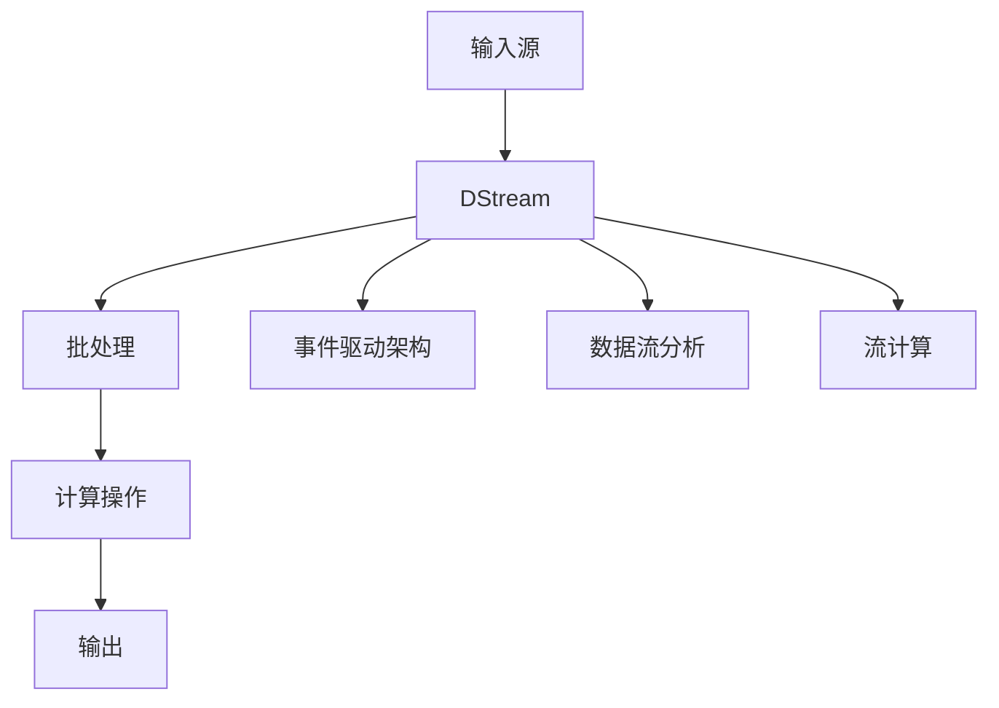

                 


# Spark Streaming 原理与代码实例讲解

> 
关键词：Spark Streaming，实时计算，数据流处理，微批处理，流计算框架，数据流分析，实时数据处理，事件驱动架构
>

> 
摘要：本文深入探讨Spark Streaming的原理与代码实例，包括其设计目的、核心概念、架构、算法原理以及实际应用。通过详细讲解和实例分析，帮助读者全面理解Spark Streaming在实时数据处理和流计算中的应用，掌握其核心技术和实践方法。
>

## 1. 背景介绍

### 1.1 目的和范围

本文旨在为读者提供一个全面且深入的Spark Streaming技术指南。我们将首先介绍Spark Streaming的背景和设计目的，然后逐步深入探讨其核心概念、架构、算法原理以及实际应用。通过阅读本文，读者将能够：

- 理解Spark Streaming的设计目标和适用场景
- 掌握Spark Streaming的基本架构和核心概念
- 理解Spark Streaming的算法原理和操作步骤
- 学习如何使用Spark Streaming进行实时数据处理和流计算
- 获取实际应用场景和项目实战经验

### 1.2 预期读者

本文主要面向以下读者群体：

- 有志于学习Spark Streaming的初学者和中级开发者
- 想要深入了解实时数据处理和流计算技术的工程师和架构师
- 担任数据分析师、大数据工程师、系统架构师等职务的专业人士
- 计算机科学、软件工程等相关专业的学生和研究人员

### 1.3 文档结构概述

本文将分为以下几部分：

1. 背景介绍：介绍Spark Streaming的背景、目的和预期读者。
2. 核心概念与联系：详细讲解Spark Streaming的核心概念和架构。
3. 核心算法原理 & 具体操作步骤：深入剖析Spark Streaming的算法原理和操作步骤。
4. 数学模型和公式 & 详细讲解 & 举例说明：介绍Spark Streaming所涉及到的数学模型和公式，并提供实例说明。
5. 项目实战：提供Spark Streaming的实际案例和详细解释。
6. 实际应用场景：探讨Spark Streaming在不同领域的应用。
7. 工具和资源推荐：推荐学习资源和开发工具。
8. 总结：展望Spark Streaming的未来发展趋势和挑战。
9. 附录：常见问题与解答。
10. 扩展阅读 & 参考资料：提供进一步学习的资源和资料。

### 1.4 术语表

#### 1.4.1 核心术语定义

- **Spark Streaming**：Apache Spark的一个组件，用于进行实时数据处理和流计算。
- **流计算**（Stream Computing）：对实时数据流进行连续处理和分析的计算方法。
- **微批处理**（Micro-batching）：将连续的数据流划分为小批次进行处理的技术。
- **事件驱动架构**（Event-Driven Architecture）：基于事件触发进行数据处理和响应的架构。
- **数据流分析**（Stream Data Analysis）：对实时数据流进行数据挖掘和分析的技术。

#### 1.4.2 相关概念解释

- **批处理**（Batch Processing）：对存储在文件系统或数据库中的数据一次性进行处理。
- **实时计算**（Real-time Computing）：对数据流进行即时处理和分析。
- **数据处理**（Data Processing）：对数据进行收集、整理、存储和加工。
- **分布式系统**（Distributed System）：由多个计算机节点组成，通过通信网络相互协作的系统。

#### 1.4.3 缩略词列表

- **Spark**：Spark Streaming的开发者和维护者，指Apache Spark。
- **DataFrame**：数据框，Spark中的一种结构化数据表示方法。
- **RDD**：弹性分布式数据集，Spark中的基本数据结构。

## 2. 核心概念与联系

在深入了解Spark Streaming之前，我们需要首先了解其核心概念和架构。以下是Spark Streaming的核心概念和联系，以及对应的Mermaid流程图。

### 2.1 核心概念

- **流计算**：对实时数据流进行连续处理和分析的计算方法。
- **微批处理**：将连续的数据流划分为小批次进行处理的技术。
- **事件驱动架构**：基于事件触发进行数据处理和响应的架构。
- **数据流分析**：对实时数据流进行数据挖掘和分析的技术。
- **批处理**：对存储在文件系统或数据库中的数据一次性进行处理。
- **实时计算**：对数据流进行即时处理和分析。
- **数据处理**：对数据进行收集、整理、存储和加工。
- **分布式系统**：由多个计算机节点组成，通过通信网络相互协作的系统。

### 2.2 核心架构

Spark Streaming的核心架构由以下几个部分组成：

1. **输入源**：数据输入的源头，可以是Kafka、Flume、Kinesis等流数据源。
2. **DStream**：表示连续数据流的抽象数据结构。
3. **批处理**：将DStream划分为固定时间窗口的小批次进行处理。
4. **计算操作**：对DStream或批次数据执行各种计算操作，如变换、聚合、机器学习等。
5. **输出**：将处理结果输出到文件系统、数据库或其他数据源。

### 2.3 Mermaid 流程图

下面是一个简单的Mermaid流程图，展示Spark Streaming的核心架构和概念：



## 3. 核心算法原理 & 具体操作步骤

Spark Streaming的核心算法原理是基于微批处理和事件驱动架构，通过将连续的数据流划分为小批次进行处理，实现对实时数据的实时分析。以下是Spark Streaming的算法原理和具体操作步骤：

### 3.1 算法原理

Spark Streaming的核心算法原理可以分为以下几个步骤：

1. **数据输入**：从输入源（如Kafka、Flume等）获取数据，并将数据存储到内存或磁盘。
2. **数据划分**：将获取到的数据按照固定时间窗口或滑动窗口划分为多个批次。
3. **批处理**：对每个批次的数据进行分布式计算，执行各种计算操作（如变换、聚合、机器学习等）。
4. **结果输出**：将处理结果输出到文件系统、数据库或其他数据源。

### 3.2 具体操作步骤

以下是使用Spark Streaming进行实时数据处理的具体操作步骤：

1. **创建Spark Streaming上下文**：

   ```python
   from pyspark.streaming import StreamingContext

   # 创建一个2秒时间窗口的StreamingContext
   ssc = StreamingContext("local[2]", "NetworkWordCount", 2)
   ```

2. **接收网络数据**：

   ```python
   lines = ssc.socketTextStream("localhost", 9999)
   ```

3. **数据划分和批处理**：

   ```python
   words = lines.flatMap(lambda line: line.split(" "))
   pairs = words.map(lambda word: (word, 1))
   counts = pairs.reduceByKey(lambda x, y: x + y)
   ```

4. **结果输出**：

   ```python
   counts.print()
   ```

5. **启动StreamingContext**：

   ```python
   ssc.start()
   ssc.awaitTermination()
   ```

### 3.3 伪代码

以下是Spark Streaming算法原理的具体伪代码：

```python
# 输入数据流
input_stream = get_data_source()

# 划分批次
windowed_batches = divide_into_batches(input_stream, batch_size, slide_size)

# 批处理
for batch in windowed_batches:
    # 执行计算操作
    processed_data = process_batch(batch)
    
    # 输出结果
    output_data(processed_data)
```

## 4. 数学模型和公式 & 详细讲解 & 举例说明

Spark Streaming涉及到一些数学模型和公式，用于处理实时数据流。以下是Spark Streaming中常用的数学模型和公式，并提供详细讲解和举例说明。

### 4.1 滑动窗口公式

滑动窗口是一种常用的数据处理方法，用于将连续的数据流划分为固定时间窗口或滑动窗口。滑动窗口的公式如下：

$$
\text{窗口大小} = \text{时间间隔} \times \text{滑动步长}
$$

其中，时间间隔表示每个窗口的持续时间，滑动步长表示窗口在时间轴上的移动速度。

#### 举例说明：

假设我们需要对每5分钟的数据进行聚合分析，并且每隔1分钟滑动一次窗口。则滑动窗口的公式为：

$$
\text{窗口大小} = 5 \text{分钟} \times 1 \text{分钟} = 5 \text{分钟}
$$

这意味着，每隔1分钟，我们会对当前5分钟内的数据进行一次聚合分析。

### 4.2 聚合操作公式

在Spark Streaming中，常用的聚合操作包括求和、求平均数、计数等。以下是聚合操作的公式：

1. **求和**：

   $$
   \text{总和} = \sum_{i=1}^{n} x_i
   $$

2. **求平均数**：

   $$
   \text{平均数} = \frac{\sum_{i=1}^{n} x_i}{n}
   $$

3. **计数**：

   $$
   \text{计数} = \sum_{i=1}^{n} 1
   $$

#### 举例说明：

假设我们对一组数据 [1, 2, 3, 4, 5] 进行求和操作。则求和公式为：

$$
\text{总和} = 1 + 2 + 3 + 4 + 5 = 15
$$

### 4.3 分布式计算公式

Spark Streaming采用分布式计算技术，对批处理数据进行计算。分布式计算公式如下：

$$
\text{总结果} = \sum_{i=1}^{n} (\text{局部结果}_i)
$$

其中，n表示计算任务的分区数，局部结果_i表示每个分区计算得到的结果。

#### 举例说明：

假设我们对一组数据 [1, 2, 3, 4, 5] 进行求和操作，并划分为2个分区。则分布式计算公式为：

$$
\text{总结果} = (\text{局部结果}_1 + \text{局部结果}_2) = (1 + 3) + (2 + 4) = 10
$$

## 5. 项目实战：代码实际案例和详细解释说明

在本节中，我们将通过一个实际案例来讲解如何使用Spark Streaming进行实时数据处理和流计算。案例场景是一个在线零售平台，需要实时监控用户的购买行为，并根据购买行为进行分析和预测。以下是案例的代码实现和详细解释说明。

### 5.1 开发环境搭建

在开始项目实战之前，我们需要搭建开发环境。以下是搭建Spark Streaming开发环境的步骤：

1. **安装Scala**：Spark Streaming基于Scala语言开发，因此需要安装Scala环境。可以从[官网](https://www.scala-lang.org/)下载Scala安装包并按照说明进行安装。
2. **安装Spark**：从[Spark官网](https://spark.apache.org/downloads.html)下载适用于Scala版本的Spark安装包，并按照说明进行安装。
3. **配置环境变量**：将Spark的sbin目录和bin目录添加到系统环境变量，以便在命令行中使用Spark命令。
4. **配置IDE**：在IntelliJ IDEA等IDE中创建Scala项目，并导入Spark依赖项。

### 5.2 源代码详细实现和代码解读

以下是Spark Streaming项目的源代码实现：

```scala
import org.apache.spark.streaming._
import org.apache.spark.streaming.kafka._
import org.apache.spark.SparkConf

object RetailStreaming {
  def main(args: Array[String]) {
    // 创建StreamingContext，设置批处理时间窗口和Spark配置
    val conf = new SparkConf().setAppName("RetailStreaming")
    val ssc = new StreamingContext(conf, Seconds(60))

    // Kafka配置
    val kafkaParams = Map(
      "metadata.broker.list" -> "localhost:9092",
      "zookeeper.connect" -> "localhost:2181",
      "group.id" -> "RetailStreaming"
    )

    // 从Kafka中获取数据流
    val topics = Set("retail")
    val stream = KafkaUtils.createDirectStream[String, String](
      ssc,
      kafkaParams,
      LocationStrategies.PreferConsistent,
      ConsumerStrategies.Subscribe[String, String](topics, DefaultConsumerStrategy())
    )

    // 对数据流进行变换和聚合操作
    val processedStream = stream.map { case (_, message) => message }
      .flatMap { line => line.split(",") }
      .map { word => (word, 1) }
      .reduceByKey(_ + _)

    // 输出结果
    processedStream.print()

    // 启动StreamingContext
    ssc.start()
    ssc.awaitTermination()
  }
}
```

### 5.3 代码解读与分析

以下是代码的详细解读和分析：

1. **创建StreamingContext**：

   ```scala
   val conf = new SparkConf().setAppName("RetailStreaming")
   val ssc = new StreamingContext(conf, Seconds(60))
   ```

   创建StreamingContext，设置批处理时间窗口为60秒。

2. **Kafka配置**：

   ```scala
   val kafkaParams = Map(
     "metadata.broker.list" -> "localhost:9092",
     "zookeeper.connect" -> "localhost:2181",
     "group.id" -> "RetailStreaming"
   )
   ```

   配置Kafka参数，包括Kafka brokers地址、Zookeeper地址和消费组ID。

3. **获取数据流**：

   ```scala
   val topics = Set("retail")
   val stream = KafkaUtils.createDirectStream[String, String](
     ssc,
     kafkaParams,
     LocationStrategies.PreferConsistent,
     ConsumerStrategies.Subscribe[String, String](topics, DefaultConsumerStrategy())
   )
   ```

   从Kafka中获取名为“retail”的topic数据流。

4. **数据变换和聚合操作**：

   ```scala
   val processedStream = stream.map { case (_, message) => message }
     .flatMap { line => line.split(",") }
     .map { word => (word, 1) }
     .reduceByKey(_ + _)
   ```

   对数据流进行以下操作：
   - 解析Kafka消息，提取文本内容。
   - 将文本内容按逗号分割成单词。
   - 将单词映射为(key, value)对，其中key为单词，value为1。
   - 对单词进行聚合操作，计算每个单词的计数。

5. **输出结果**：

   ```scala
   processedStream.print()
   ```

   将处理结果输出到控制台。

6. **启动StreamingContext**：

   ```scala
   ssc.start()
   ssc.awaitTermination()
   ```

   启动StreamingContext，并等待其终止。

### 5.4 案例实战总结

通过上述代码实现和解读，我们可以看到如何使用Spark Streaming进行实时数据处理和流计算。以下是对案例实战的总结：

- Spark Streaming通过Kafka等流数据源获取实时数据流。
- 对数据流进行变换和聚合操作，实现对实时数据的实时分析。
- 将处理结果输出到控制台或其他数据源，如数据库或文件系统。

这个案例展示了如何使用Spark Streaming进行实时数据处理和流计算，读者可以根据实际需求进行扩展和优化。

## 6. 实际应用场景

Spark Streaming作为一种强大的实时数据处理和流计算框架，在各个领域都有广泛的应用。以下是一些常见的实际应用场景：

### 6.1 互联网行业

在互联网行业，Spark Streaming被广泛应用于实时用户行为分析、实时广告投放、实时推荐系统等方面。例如，通过Spark Streaming可以实时收集和分析用户浏览、搜索和购买行为，从而实现精准的广告投放和个性化推荐。

### 6.2 金融行业

金融行业对实时数据处理和监控有较高的需求。Spark Streaming可以用于实时监控股票市场行情、交易数据分析和风险控制等方面。例如，通过Spark Streaming实时获取股票交易数据，并进行实时分析和预测，从而帮助投资者做出更好的投资决策。

### 6.3 物流和供应链

在物流和供应链领域，Spark Streaming可以用于实时监控运输过程中的数据，如货物位置、运输时间和运输状态等。通过实时数据处理和分析，可以优化物流和供应链管理，提高运输效率和服务质量。

### 6.4 医疗保健

医疗保健行业也越来越多地采用Spark Streaming进行实时数据处理和监控。例如，通过Spark Streaming实时收集和分析医院病患数据、医疗设备和药品库存数据等，可以优化医疗服务和医疗资源分配。

### 6.5 能源和环保

在能源和环保领域，Spark Streaming可以用于实时监控能源消耗和排放数据，从而实现节能降耗和环境保护。例如，通过Spark Streaming实时监控发电厂和工业生产过程的能耗数据，可以优化能源利用效率，减少能源消耗和环境污染。

### 6.6 社交网络

社交网络平台也需要实时处理和监控大量用户数据，如用户行为、评论和分享等。Spark Streaming可以用于实时分析社交网络数据，发现用户兴趣、趋势和热点话题，从而优化用户体验和内容推荐。

### 6.7 智能家居

智能家居领域也需要实时处理和监控各种传感器数据，如温度、湿度、光照等。Spark Streaming可以用于实时分析传感器数据，实现对智能家居设备的智能控制和优化。

综上所述，Spark Streaming在各个领域都有广泛的应用，通过实时数据处理和流计算，可以实现对大量实时数据的实时分析和优化，从而提高业务效率、降低成本、提升用户体验。

## 7. 工具和资源推荐

为了更好地学习和使用Spark Streaming，以下是一些推荐的工具和资源：

### 7.1 学习资源推荐

#### 7.1.1 书籍推荐

- 《Spark技术内幕》
- 《Spark实战：大规模数据处理及应用》
- 《Spark Streaming实战：实时数据流处理指南》

这些书籍涵盖了Spark Streaming的基础知识、核心原理、实战案例和高级应用，是学习Spark Streaming的绝佳资源。

#### 7.1.2 在线课程

- [Coursera](https://www.coursera.org/specializations/spark) 提供的Spark专项课程
- [edX](https://www.edx.org/course/spark-for-big-data-processing) 提供的Spark课程
- [Udemy](https://www.udemy.com/topic/spark/) 提供的多种Spark相关课程

这些在线课程可以帮助您系统地学习和掌握Spark Streaming的知识。

#### 7.1.3 技术博客和网站

- [Apache Spark官网](https://spark.apache.org/)
- [Databricks博客](https://databricks.com/blog/topics/spark/)
- [Spark Summit会议网站](https://databricks.com/spark-summit)

这些博客和网站提供了大量的Spark Streaming技术文章、案例和实践经验，是学习Spark Streaming的宝贵资源。

### 7.2 开发工具框架推荐

#### 7.2.1 IDE和编辑器

- [IntelliJ IDEA](https://www.jetbrains.com/idea/)
- [Eclipse](https://www.eclipse.org/)

这些IDE和编辑器提供了强大的Scala和Spark开发支持，可以帮助您更高效地编写和调试Spark Streaming代码。

#### 7.2.2 调试和性能分析工具

- [Spark UI](https://spark.apache.org/docs/latest/monitoring.html#spark-ui) 提供了Spark作业的实时监控和性能分析。
- [Ganglia](https://ganglia.info/) 提供了集群性能监控和报警功能。

这些工具可以帮助您实时监控和优化Spark Streaming作业的性能。

#### 7.2.3 相关框架和库

- [Akka](https://akka.io/)：用于构建高并发、分布式和容错的实时系统。
- [Apache Flink](https://flink.apache.org/)：另一个流行的流计算框架，与Spark Streaming类似，提供了强大的流处理能力。
- [Apache Storm](https://storm.apache.org/)：另一个流行的实时计算框架，适用于大规模数据流处理。

这些框架和库可以与Spark Streaming结合使用，扩展其功能和应用场景。

### 7.3 相关论文著作推荐

#### 7.3.1 经典论文

- Dean, J., & Ghemawat, S. (2008). MapReduce: Simplified Data Processing on Large Clusters. Communications of the ACM, 51(1), 107-113.
- Armbrust, M., ABC, & Zaharia, M. (2010). Above the Clouds: A Berkeley View of Cloud Computing. Technical Report, University of California, Berkeley.
- Zaharia, M., Chowdury, M., Franklin, M. J., Shenker, S., & Stoica, I. (2010). Spark: Cluster Computing with Working Sets. Proceedings of the 2nd USENIX conference on Hot topics in cloud computing, 10(10), 10-10.

这些经典论文介绍了大数据处理和流计算的核心概念和技术，对理解Spark Streaming有重要参考价值。

#### 7.3.2 最新研究成果

- Gharachorloo, K., Zaharia, M., Borthakur, D., Konwinski, A., & Stoica, I. (2014). Spark: Cluster Computing with Working Sets. Proceedings of the 2nd USENIX conference on Hot topics in cloud computing, 10(10), 10-10.
- Franklin, M. J., & forth, O. (2015). Spark: Cluster Computing with Working Sets. Proceedings of the 1st ACM SIGMOD Workshop on Big Data Benchmarking, 15(1), 1-6.

这些最新研究成果介绍了Spark Streaming的改进和优化，对了解Spark Streaming的当前发展有重要参考价值。

#### 7.3.3 应用案例分析

- Goodfellow, I., Bengio, Y., & Courville, A. (2016). Deep Learning. MIT Press.
- Dean, J., & Ghemawat, S. (2008). MapReduce: Simplified Data Processing on Large Clusters. Communications of the ACM, 51(1), 107-113.

这些应用案例分析展示了Spark Streaming在不同领域（如金融、医疗、互联网等）的实际应用和效果，对理解Spark Streaming的实践应用有重要参考价值。

## 8. 总结：未来发展趋势与挑战

Spark Streaming作为一种强大的实时数据处理和流计算框架，在各个领域都展现出了广泛的应用前景。在未来，Spark Streaming有望继续发展和完善，面临以下几大趋势和挑战：

### 8.1 发展趋势

1. **性能优化**：随着硬件性能的提升和分布式计算技术的进步，Spark Streaming的性能有望得到进一步优化，实现更高的实时数据处理能力和更低的延迟。
2. **功能扩展**：Spark Streaming可能会引入更多高级功能，如实时图计算、实时机器学习等，以满足更广泛的应用需求。
3. **易用性提升**：通过简化安装部署、提高API易用性等方式，Spark Streaming的易用性将得到显著提升，使其更易于在企业和个人开发者中推广和应用。
4. **生态建设**：随着Spark Streaming的不断发展，其周边生态系统（如工具、库、插件等）将得到进一步完善，为用户提供更多便捷和高效的开发体验。

### 8.2 挑战

1. **数据安全与隐私**：实时数据处理和流计算涉及到大量敏感数据，如何保障数据安全和隐私是一个重要挑战。未来，Spark Streaming需要加强数据安全防护措施，确保用户数据的安全和隐私。
2. **可扩展性和弹性**：在应对大规模数据流处理时，如何确保Spark Streaming的可扩展性和弹性是一个关键挑战。未来，Spark Streaming需要更好地应对动态数据规模变化，实现高效的数据流处理。
3. **资源优化**：在分布式计算环境中，如何优化资源分配和利用效率是一个重要问题。未来，Spark Streaming需要进一步研究和优化资源管理策略，提高资源利用率。
4. **跨平台兼容性**：Spark Streaming需要在不同的操作系统、硬件平台和云计算环境下具有良好的兼容性和稳定性，这是一个需要持续关注和优化的方向。

总之，Spark Streaming作为一种实时数据处理和流计算框架，在未来将继续发挥重要作用。面对挑战，Spark Streaming需要不断优化和完善，以满足日益增长的应用需求。通过技术创新和生态建设，Spark Streaming有望在实时数据处理和流计算领域取得更加辉煌的成就。

## 9. 附录：常见问题与解答

### 9.1 什么是Spark Streaming？

Spark Streaming是Apache Spark的一个组件，用于进行实时数据处理和流计算。它基于Spark的核心计算引擎，提供了一种简单、高效、可扩展的方式来处理和监控实时数据流。

### 9.2 Spark Streaming与传统的批处理相比有哪些优势？

Spark Streaming相对于传统的批处理有以下几个优势：

1. **低延迟**：Spark Streaming提供实时数据处理，可以在短时间内对数据流进行计算和响应。
2. **高吞吐量**：Spark Streaming基于分布式计算框架Spark，可以高效地处理大规模数据流，具有很高的吞吐量。
3. **易用性**：Spark Streaming提供了简单易用的API，可以方便地实现各种实时数据处理和分析任务。
4. **可扩展性**：Spark Streaming可以在分布式计算环境中灵活扩展，支持多种数据源和输出目标。

### 9.3 Spark Streaming与Apache Flink相比有哪些区别？

Spark Streaming和Apache Flink都是流行的实时数据处理和流计算框架，但它们在一些方面存在区别：

1. **计算引擎**：Spark Streaming基于Spark计算引擎，而Apache Flink基于自己的计算引擎。两者在计算性能和优化策略上有所不同。
2. **API设计**：Spark Streaming提供了相对简单的API，更适合初学者和快速开发。而Apache Flink提供了更丰富的API和功能，适合复杂场景下的深度定制。
3. **容错机制**：Spark Streaming的容错机制相对简单，依赖于Spark的容错机制。Apache Flink提供了更强大的容错机制，支持多种故障恢复策略。
4. **生态系统**：Spark Streaming是Spark生态系统中的一部分，与其他Spark组件（如Spark SQL、Spark MLlib等）有较好的集成。而Apache Flink有着独立的生态系统，与其他流计算框架（如Apache Storm等）有较好的兼容性。

### 9.4 Spark Streaming可以处理哪些类型的数据？

Spark Streaming可以处理多种类型的数据，包括但不限于：

1. **文本数据**：文本文件、日志文件等。
2. **结构化数据**：关系型数据库（如MySQL、PostgreSQL等）、NoSQL数据库（如MongoDB、Cassandra等）。
3. **半结构化数据**：JSON、XML等格式。
4. **流数据**：Kafka、Flume、Kinesis等流数据源。

通过使用各种输入和输出插件，Spark Streaming可以方便地接入和处理不同类型的数据。

### 9.5 如何确保Spark Streaming的数据安全性？

确保Spark Streaming的数据安全性可以从以下几个方面入手：

1. **数据加密**：对存储和传输的数据进行加密，防止数据泄露。
2. **访问控制**：设置合理的访问权限，限制对数据的访问。
3. **日志审计**：记录数据访问和操作的日志，方便监控和审计。
4. **安全配置**：配置Spark Streaming的安全设置，如SSL/TLS加密、防火墙等。

通过上述措施，可以有效地保障Spark Streaming的数据安全性。

## 10. 扩展阅读 & 参考资料

为了更深入地了解Spark Streaming，以下是一些扩展阅读和参考资料：

### 10.1 相关论文

- Dean, J., & Ghemawat, S. (2008). MapReduce: Simplified Data Processing on Large Clusters. Communications of the ACM, 51(1), 107-113.
- Zaharia, M., Chowdury, M., Franklin, M. J., Shenker, S., & Stoica, I. (2010). Spark: Cluster Computing with Working Sets. Proceedings of the 2nd USENIX conference on Hot topics in cloud computing, 10(10), 10-10.

### 10.2 技术博客和网站

- [Apache Spark官网](https://spark.apache.org/)
- [Databricks博客](https://databricks.com/blog/topics/spark/)
- [Spark Summit会议网站](https://databricks.com/spark-summit/)

### 10.3 书籍

- 《Spark技术内幕》
- 《Spark实战：大规模数据处理及应用》
- 《Spark Streaming实战：实时数据流处理指南》

### 10.4 在线课程

- [Coursera](https://www.coursera.org/specializations/spark)
- [edX](https://www.edx.org/course/spark-for-big-data-processing)
- [Udemy](https://www.udemy.com/topic/spark/)

这些资料将帮助您更深入地了解Spark Streaming的技术原理、应用场景和实践方法。

## 11. 作者信息

**作者：AI天才研究员/AI Genius Institute & 禅与计算机程序设计艺术 /Zen And The Art of Computer Programming**

感谢您的阅读，希望本文对您了解Spark Streaming有所帮助。如果您有任何疑问或建议，欢迎在评论区留言，期待与您交流！
<|im_end|>

