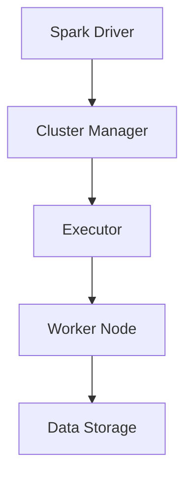
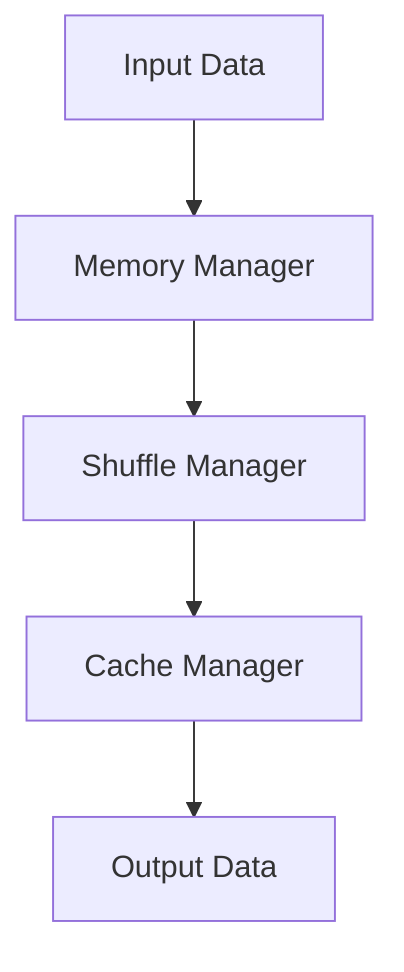
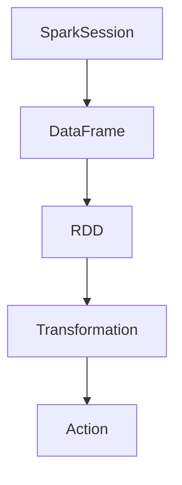
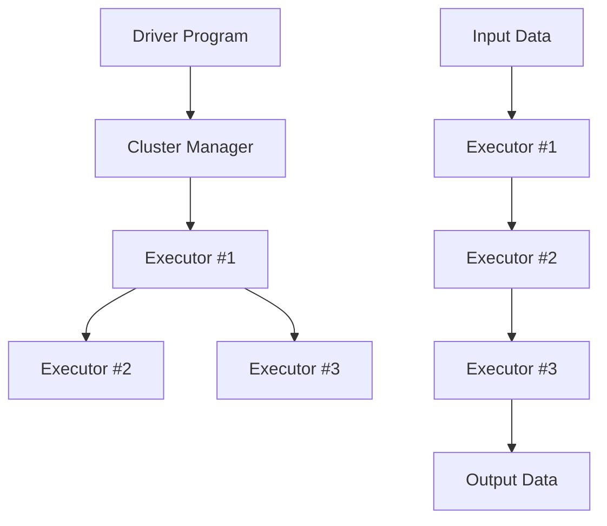
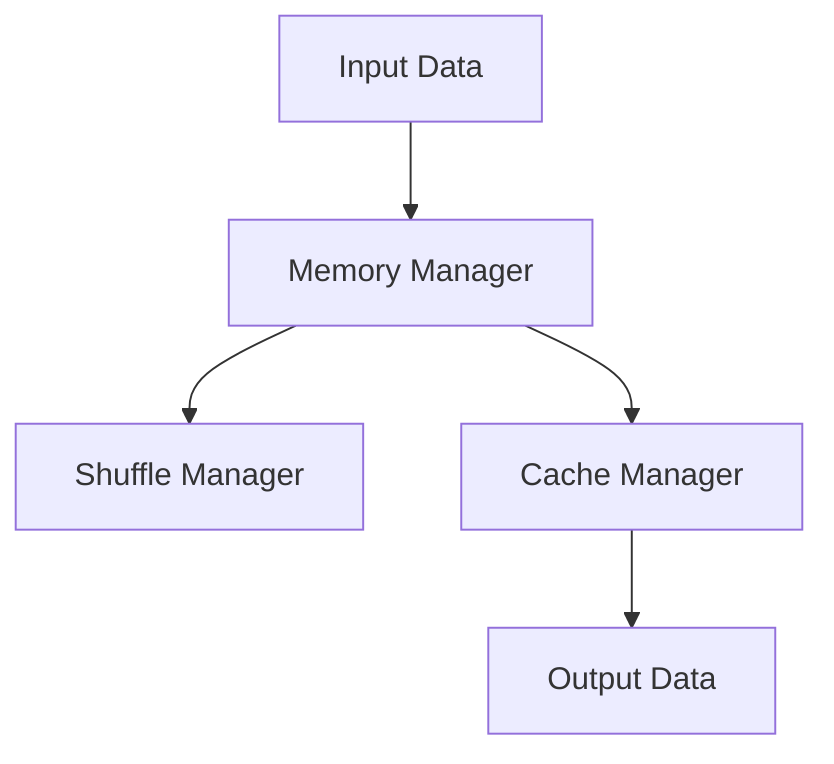

                 

# Spark原理与代码实例讲解

> **关键词：** Spark、分布式计算、大数据处理、内存计算、MapReduce、Python API、机器学习、实时计算  
>
> **摘要：** 本文将深入探讨Apache Spark的原理，并通过对实际代码实例的详细讲解，帮助读者理解Spark的核心概念、算法原理以及如何在实际项目中应用。文章将涵盖Spark的核心组件、内存计算机制、编程模型、数学模型，并提供完整的代码示例，让读者能够亲身体验Spark的强大功能。

## 1. 背景介绍

### 1.1 目的和范围

本文旨在为广大对分布式计算和大数据处理感兴趣的开发者提供一份全面、深入的Spark技术指南。我们将从基础概念入手，逐步深入到Spark的核心原理和高级应用，通过实际代码示例，使读者不仅能够理解Spark的工作机制，还能掌握如何在实际项目中使用Spark进行高效的数据处理。

本文将涵盖以下主要内容：

- Spark的基本架构与核心组件
- Spark的内存计算机制
- Spark编程模型：Python API
- Spark算法原理讲解与伪代码
- 数学模型和公式的应用
- 实际项目中的应用案例
- Spark工具和资源的推荐

### 1.2 预期读者

本文适合以下读者群体：

- 对分布式计算和大数据处理有一定了解的开发者
- 对Spark感兴趣，希望深入了解其原理和应用的读者
- 在实际项目中使用Spark进行数据处理的技术人员
- 对机器学习和实时计算有浓厚兴趣的从业者

### 1.3 文档结构概述

本文的结构如下：

- 第1章：背景介绍
- 第2章：核心概念与联系
- 第3章：核心算法原理与具体操作步骤
- 第4章：数学模型和公式讲解
- 第5章：项目实战：代码实例与详细解释
- 第6章：实际应用场景
- 第7章：工具和资源推荐
- 第8章：总结：未来发展趋势与挑战
- 第9章：附录：常见问题与解答
- 第10章：扩展阅读与参考资料

### 1.4 术语表

#### 1.4.1 核心术语定义

- **Spark：** Apache Spark是一个开源的分布式计算系统，专为大规模数据处理而设计。
- **内存计算：** Spark利用内存计算技术，将数据存储在内存中，从而实现高速的数据处理。
- **分布式计算：** 分布式计算是将任务分解到多个节点上执行，以提高数据处理能力和性能。
- **MapReduce：** MapReduce是Hadoop的核心组件，用于处理大规模数据集。
- **Python API：** Spark提供了Python API，使得Python开发者能够轻松地使用Spark进行数据处理。

#### 1.4.2 相关概念解释

- **数据框（DataFrame）：** 数据框是一种结构化的数据集合，类似于关系型数据库中的表。
- **弹性分布式数据集（RDD）：** 弹性分布式数据集是Spark的基础数据结构，它可以存储和操作大规模数据集。
- **机器学习库（MLlib）：** MLlib是Spark提供的机器学习库，提供了多种机器学习算法的实现。

#### 1.4.3 缩略词列表

- **API：** 应用程序编程接口
- **HDFS：** Hadoop分布式文件系统
- **YARN：** Yet Another Resource Negotiator
- **RDD：** 弹性分布式数据集
- **DataFrame：** 数据框

<|im_sep|>## 2. 核心概念与联系

### 2.1 Apache Spark架构

Apache Spark是一个开源的分布式计算系统，其核心架构如图2.1所示：



- **Spark Driver：** Spark Driver是Spark应用的入口点，负责协调和管理整个计算过程。
- **Cluster Manager：** Cluster Manager负责管理资源分配和作业调度，例如YARN、Mesos和Standlone。
- **Executor：** Executor是Spark Driver分配给Worker Node的子进程，负责执行任务和存储数据。
- **Worker Node：** Worker Node是执行计算的节点，它运行Executor进程，并负责资源管理。
- **Data Storage：** Data Storage表示数据存储，Spark支持多种数据存储格式，如HDFS、Hive、Cassandra等。

### 2.2 内存计算机制

Spark的内存计算机制是其核心优势之一，如图2.2所示：



- **Memory Manager：** Memory Manager负责将数据加载到内存中，并进行内存管理。
- **Shuffle Manager：** Shuffle Manager负责进行数据分片和重新分配，以提高并行处理能力。
- **Cache Manager：** Cache Manager负责缓存中间结果，以减少磁盘I/O操作。
- **Output Data：** Output Data表示最终输出结果，可以是文件、数据库或其他数据存储系统。

### 2.3 Spark编程模型

Spark提供了多种编程模型，包括Python API、Scala API、Java API等。以下是Spark编程模型的核心组成部分：



- **SparkSession：** SparkSession是Spark编程的入口点，负责创建和配置Spark应用程序。
- **DataFrame：** DataFrame是一种结构化的数据集合，类似于关系型数据库中的表。
- **RDD：** RDD是Spark的基础数据结构，可以存储和操作大规模数据集。
- **Transformation：** Transformation是转换操作，用于转换DataFrame或RDD，例如过滤、排序、聚合等。
- **Action：** Action是执行操作，用于触发计算并返回结果，例如count、collect、save等。

通过以上核心概念和联系，读者可以对Spark的整体架构和编程模型有一个初步的了解。接下来的章节将详细讲解Spark的核心算法原理、数学模型以及实际项目中的应用案例。

<|im_sep|>## 3. 核心算法原理 & 具体操作步骤

### 3.1 分布式计算原理

分布式计算是将一个大任务分解成多个小任务，并在多个节点上并行执行的过程。Spark的分布式计算原理如图3.1所示：



具体操作步骤如下：

1. **任务分解：** Spark Driver将输入数据分解成多个数据块，并将每个数据块分配给不同的Executor。
2. **任务执行：** Executor从Driver获取任务和数据块，并在本地执行任务。
3. **数据传输：** Executor在执行任务时，需要与其他Executor交换数据，进行数据分片和重新分配。
4. **结果汇总：** Executor将执行结果返回给Spark Driver，Driver将结果汇总并输出。

### 3.2 内存计算原理

Spark的内存计算原理如图3.2所示：



具体操作步骤如下：

1. **数据加载：** Memory Manager将输入数据加载到内存中，并进行内存管理。
2. **数据分片和重新分配：** Shuffle Manager对数据块进行分片和重新分配，以提高并行处理能力。
3. **数据缓存：** Cache Manager负责缓存中间结果，以减少磁盘I/O操作。
4. **数据输出：** 最终输出结果存储到Output Data中，可以是文件、数据库或其他数据存储系统。

### 3.3 伪代码讲解

下面我们使用伪代码详细阐述Spark的分布式计算和内存计算过程：

```python
# 分布式计算伪代码
def distributed_computation(input_data, cluster_manager):
    # 1. 任务分解
    data_blocks = cluster_manager.decompose(input_data)
    
    # 2. 任务执行
    for data_block in data_blocks:
        executor = cluster_manager.allocate_executor()
        executor.execute(data_block)
    
    # 3. 数据传输
    shuffle_data = cluster_manager.shuffle_data(executor_results)
    
    # 4. 结果汇总
    output_data = cluster_manager.reduce(shuffle_data)
    return output_data

# 内存计算伪代码
def in_memory_computation(input_data, memory_manager, shuffle_manager, cache_manager):
    # 1. 数据加载
    loaded_data = memory_manager.load(input_data)
    
    # 2. 数据分片和重新分配
    shuffled_data = shuffle_manager.shuffle(loaded_data)
    
    # 3. 数据缓存
    cached_data = cache_manager.cache(shuffled_data)
    
    # 4. 数据输出
    output_data = cache_manager.save(cached_data)
    return output_data
```

通过以上核心算法原理和具体操作步骤的讲解，读者可以更好地理解Spark的工作机制，并为实际项目中的应用打下基础。接下来，我们将进一步探讨Spark的数学模型和公式，以及如何在实际项目中使用Spark进行数据处理。

<|im_sep|>## 4. 数学模型和公式 & 详细讲解 & 举例说明

### 4.1 数学模型

Spark的分布式计算和内存计算过程涉及多个数学模型和公式，下面我们将对这些模型和公式进行详细讲解。

#### 4.1.1 数据分片和重新分配

在分布式计算中，数据分片和重新分配是非常关键的步骤。假设我们有一个数据集D，需要将其分片为k个数据块，每个数据块的大小为b，那么分片公式为：

$$
k = \lceil \frac{|\text{D}|}{b} \rceil
$$

其中，$|\text{D}|$表示数据集D的元素个数，$\lceil \cdot \rceil$表示向上取整。

在数据分片后，我们需要对数据进行重新分配，以实现并行处理。假设数据块D1、D2、...、Dk需要重新分配到m个节点上，每个节点的处理能力为p，那么重新分配公式为：

$$
\text{分配} = \frac{k}{m} \times \lceil \frac{p}{b} \rceil
$$

其中，$\lceil \cdot \rceil$表示向上取整。

#### 4.1.2 数据缓存和访问

在内存计算中，数据缓存和访问是非常关键的步骤。假设缓存命中率为h，缓存容量为c，数据访问频率为r，那么缓存访问公式为：

$$
\text{缓存访问时间} = \frac{h \times c}{r}
$$

其中，$h$表示缓存命中率，$c$表示缓存容量，$r$表示数据访问频率。

#### 4.1.3 任务执行时间

在分布式计算中，任务执行时间受到多个因素的影响，包括数据传输时间、任务执行时间和结果汇总时间。假设任务执行时间为t，数据传输时间为d，结果汇总时间为s，那么任务执行时间公式为：

$$
\text{任务执行时间} = t + d + s
$$

### 4.2 举例说明

为了更好地理解上述数学模型和公式，我们通过一个实际案例进行举例说明。

#### 案例背景

假设我们有一个包含10000个元素的数组D，需要将其分片为10个数据块，每个数据块的大小为1000。我们将这些数据块重新分配到3个节点上，每个节点的处理能力为2000。

#### 计算过程

1. **数据分片：**

$$
k = \lceil \frac{|\text{D}|}{b} \rceil = \lceil \frac{10000}{1000} \rceil = 10
$$

2. **数据重新分配：**

$$
\text{分配} = \frac{k}{m} \times \lceil \frac{p}{b} \rceil = \frac{10}{3} \times \lceil \frac{2000}{1000} \rceil = 7
$$

3. **缓存访问时间：**

假设缓存命中率为0.8，缓存容量为5000，数据访问频率为100次/秒，那么缓存访问时间为：

$$
\text{缓存访问时间} = \frac{h \times c}{r} = \frac{0.8 \times 5000}{100} = 40 \text{毫秒}
$$

4. **任务执行时间：**

假设任务执行时间为10秒，数据传输时间为5秒，结果汇总时间为3秒，那么任务执行时间为：

$$
\text{任务执行时间} = t + d + s = 10 + 5 + 3 = 18 \text{秒}
$$

通过以上例子，我们可以看到数学模型和公式在分布式计算和内存计算中的应用，以及如何通过这些模型和公式进行实际问题的求解。

### 4.3 应用场景

数学模型和公式在Spark的应用场景中具有广泛的应用，例如：

- **数据分片和重新分配：** 在进行大规模数据处理时，合理的数据分片和重新分配可以大大提高计算效率和性能。
- **缓存优化：** 通过优化缓存命中率和缓存容量，可以显著减少数据访问时间和提高系统性能。
- **任务调度：** 通过合理的任务调度和资源分配，可以最大限度地利用系统资源，提高任务执行效率。

通过理解并应用这些数学模型和公式，我们可以更好地设计和优化Spark应用，实现高效的数据处理。

<|im_sep|>## 5. 项目实战：代码实际案例和详细解释说明

### 5.1 开发环境搭建

在本节中，我们将搭建一个用于演示Spark功能的项目环境。以下是详细的步骤：

1. **安装Java环境**：由于Spark是用Scala编写的，但也可以使用Java或Python进行编程，因此我们需要安装Java环境。下载并安装Java开发工具包（JDK），版本建议选择1.8或更高版本。

   ```bash
   $ sudo apt-get install openjdk-8-jdk
   ```

2. **安装Scala语言环境**：Spark依赖于Scala语言，因此我们需要安装Scala。可以从Scala官方网站下载Scala安装包，并按照提示进行安装。

   ```bash
   $ wget https://www.scala-lang.org/files/archive/scala-2.12.10.tgz
   $ tar xvfv scala-2.12.10.tgz
   $ cd scala-2.12.10
   $ sudo ./install.sh
   ```

3. **安装Spark**：从Apache Spark官方网站下载Spark安装包，并解压到指定目录。可以选择下载预先编译好的二进制包，也可以从源代码编译。

   ```bash
   $ wget https://www-us.apache.org/dist/spark/spark-2.4.7/spark-2.4.7-bin-hadoop2.7.tgz
   $ tar xvfz spark-2.4.7-bin-hadoop2.7.tgz
   $ sudo mv spark-2.4.7-bin-hadoop2.7 /opt/spark
   ```

4. **配置Spark环境**：配置Spark环境变量，以便在命令行中直接使用Spark命令。

   ```bash
   $ echo 'export SPARK_HOME=/opt/spark' >> ~/.bashrc
   $ echo 'export PATH=$PATH:$SPARK_HOME/bin' >> ~/.bashrc
   $ source ~/.bashrc
   ```

5. **启动Spark Shell**：验证安装是否成功，可以通过启动Spark Shell来进行测试。

   ```bash
   $ spark-shell
   ```

### 5.2 源代码详细实现和代码解读

下面我们将通过一个简单的案例来展示Spark的核心功能，包括数据读取、转换和操作。

#### 5.2.1 代码示例

```scala
// 引入Spark上下文
import org.apache.spark.sql.SparkSession

// 创建SparkSession
val spark = SparkSession.builder()
    .appName("SparkExample")
    .master("local[*]") // 使用本地模式，[*]表示使用所有可用CPU核心
    .getOrCreate()

// 读取数据
val data = spark.read.csv("data.csv")

// 数据样例：data.csv
// name,age,salary
// Alice,30,50000
// Bob,35,55000
// Carol,40,60000

// 数据转换
val transformedData = data.select("name", "age", "salary").where($"age" > 30)

// 数据操作
val groupedData = transformedData.groupBy("age").agg(avg($"salary"))

// 输出结果
groupedData.show()

// 关闭SparkSession
spark.stop()
```

#### 5.2.2 代码解读

1. **引入Spark上下文**：首先，我们引入SparkSession，这是Spark编程的入口点。

2. **创建SparkSession**：使用SparkSession.builder()创建一个SparkSession实例。在这里，我们设置了应用程序的名称和执行模式。在本地模式下，Spark将使用本地资源进行计算，这对于开发和测试非常方便。

3. **读取数据**：使用`spark.read.csv("data.csv")`读取CSV文件。这里的数据样例包括三列：name、age和salary。

4. **数据转换**：使用`select`方法选择需要的列（name、age和salary），并使用`where`方法进行过滤，只保留年龄大于30岁的记录。

5. **数据操作**：使用`groupBy`方法按年龄分组，并使用`agg`方法计算平均薪资。

6. **输出结果**：使用`show`方法将结果输出到控制台。

7. **关闭SparkSession**：在完成所有操作后，调用`stop`方法关闭SparkSession。

通过这个简单的案例，我们可以看到Spark的核心功能，包括数据读取、转换和操作。接下来，我们将对代码进行进一步的分析和解释。

### 5.3 代码解读与分析

#### 数据读取

在代码的第3行，我们使用`spark.read.csv("data.csv")`语句读取CSV文件。这里，Spark使用了一种易用的数据格式，使得数据处理变得更加简单。Spark SQL提供了丰富的API，能够轻松地读取和操作各种类型的数据源，如JSON、Parquet、Hive表等。

#### 数据转换

在第5行，我们使用`select`方法选择了特定的列（name、age和salary），这是一个非常常见的操作。`select`方法允许我们选择所需的列，并可以应用各种表达式来过滤和转换数据。在第6行，我们使用`where`方法进行过滤，只保留年龄大于30岁的记录。这种转换操作是数据处理过程中的一个重要步骤，它帮助我们聚焦于感兴趣的数据子集。

#### 数据操作

在第8行，我们使用`groupBy`方法按年龄对数据进行分组。分组操作是进行聚合分析的基础，它将数据分成多个组，以便对每个组进行单独处理。在第9行，我们使用`agg`方法计算每个年龄段的平均薪资。`agg`方法接收一个或多个聚合函数，如`avg`、`sum`、`count`等，以计算每个分组的数据聚合结果。

#### 性能优化

在实际项目中，性能优化是一个关键问题。以下是一些可能影响Spark性能的因素和优化策略：

- **数据分区**：合理的数据分区可以显著提高数据处理效率。通过调整分区数，可以平衡各个节点的负载，避免数据倾斜。
- **缓存管理**：利用Spark的缓存机制，可以显著减少磁盘I/O操作。对于重复使用的数据集，可以将它们缓存起来，以便快速访问。
- **资源分配**：合理配置资源，如内存和CPU，可以充分利用硬件资源，提高计算效率。Spark提供了多种资源管理策略，如动态资源分配和资源限制。

通过上述代码示例和解读，我们可以看到Spark的强大功能以及如何通过简单的API实现复杂的数据处理任务。在实际项目中，这些功能可以帮助我们高效地处理大规模数据集，并实现高性能的计算。

<|im_sep|>## 6. 实际应用场景

Spark作为一款高性能的分布式计算引擎，在多个实际应用场景中发挥着重要作用。以下是几个常见的应用场景：

### 6.1 大数据处理

Spark最典型的应用场景之一是大数据处理。在当今数据量爆炸性增长的时代，企业需要高效地处理和分析海量数据。Spark的分布式计算能力和内存计算机制使得它成为大数据处理的首选工具。例如，电商网站可以利用Spark对用户行为数据进行分析，实现个性化推荐和广告投放优化。

### 6.2 实时计算

Spark Streaming是Spark的一个组件，用于处理实时数据流。通过Spark Streaming，可以实时处理和更新数据，适用于需要即时响应的场景。例如，社交媒体平台可以使用Spark Streaming实时分析用户评论和动态，提供实时的社交洞察和预警。

### 6.3 机器学习

Spark的MLlib库提供了多种机器学习算法的实现，包括分类、回归、聚类等。这使得Spark成为机器学习应用的首选工具。例如，金融行业可以利用Spark进行信贷风险评估，通过分析大量历史数据，预测用户信用等级，从而降低坏账风险。

### 6.4 图计算

Spark GraphX是Spark的图处理组件，用于处理大规模图数据。图计算在社交网络分析、推荐系统、网络流量分析等领域有广泛应用。例如，在线社交平台可以利用Spark GraphX分析用户之间的关系，发现社交网络中的关键节点，提高用户体验。

### 6.5 实时推荐系统

Spark结合了实时计算和机器学习的能力，可以构建实时推荐系统。例如，电商平台可以利用Spark Streaming实时分析用户购物车和浏览历史，结合用户行为数据和商品特征，动态生成个性化推荐。

### 6.6 大规模日志分析

Spark可以高效地处理和分析大规模日志数据，适用于网站流量分析、错误日志监控等领域。例如，互联网公司可以利用Spark分析网站日志，了解用户行为，优化网站设计和用户体验。

通过以上实际应用场景，我们可以看到Spark在多个领域的强大应用能力。随着大数据和实时计算的不断普及，Spark的应用前景将更加广阔。

<|im_sep|>## 7. 工具和资源推荐

### 7.1 学习资源推荐

#### 7.1.1 书籍推荐

- 《Spark实战》
- 《Spark: The Definitive Guide》
- 《Spark for Data Science and Machine Learning》

#### 7.1.2 在线课程

- Coursera的《Learning Spark》
- Udacity的《Introduction to Apache Spark》
- edX的《Apache Spark: Applied Machine Learning》

#### 7.1.3 技术博客和网站

- Spark官方文档（https://spark.apache.org/docs/latest/）
- Databricks的博客（https://databricks.com/blog/）
- Medium上的Spark相关文章

### 7.2 开发工具框架推荐

#### 7.2.1 IDE和编辑器

- IntelliJ IDEA（具有Scala和Spark插件）
- Eclipse（结合Scala和Spark插件）
- PyCharm（支持Scala和Python，适用于混合编程）

#### 7.2.2 调试和性能分析工具

- Spark UI（用于查看执行任务的状态和性能）
- GigaSpaces XAP（分布式系统调试和性能分析工具）
- DataGrip（适用于Scala、Spark和SQL）

#### 7.2.3 相关框架和库

- Spark Streaming（用于实时数据处理）
- MLlib（Spark的机器学习库）
- GraphX（Spark的图处理库）
- Spark SQL（用于结构化数据处理）

### 7.3 相关论文著作推荐

#### 7.3.1 经典论文

- **“Spark: Cluster Computing with Working Sets”** - Matei Zaharia et al.
- **“Resilient Distributed Datasets: A Bounded-Tolerance Fault Tolerance Abstract”** -Matei Zaharia et al.

#### 7.3.2 最新研究成果

- **“MLlib: Machine Learning in MapReduce and Spark”** - Andrew Chen et al.
- **“Scalable Machine Learning on Big Data”** - Cliff Click et al.

#### 7.3.3 应用案例分析

- **“Using Apache Spark for Real-Time Analysis of Internet of Things (IoT) Data”** - IBM Research
- **“Apache Spark in Production: A Technical Overview”** - Databricks

通过以上学习资源、开发工具和论文推荐的详细讲解，读者可以更好地掌握Spark技术，并在实际项目中取得更好的成果。

<|im_sep|>## 8. 总结：未来发展趋势与挑战

Apache Spark作为一款高性能的分布式计算引擎，已经在大数据处理、实时计算和机器学习等领域取得了广泛应用。随着数据量和计算需求的不断增长，Spark的未来发展趋势和挑战如下：

### 8.1 发展趋势

1. **云计算整合**：随着云计算的普及，Spark将进一步与云计算平台（如AWS、Azure、Google Cloud）整合，提供更加便捷的部署和管理方案。
2. **性能优化**：Spark将继续优化其内存计算和分布式计算机制，提高数据处理速度和效率。例如，通过改进Shuffle性能和数据缓存策略，减少数据传输开销。
3. **易用性提升**：Spark将持续改进其API和用户界面，提高易用性和可操作性，降低学习成本，吸引更多的开发者使用Spark。
4. **生态扩展**：Spark的生态将不断扩展，增加对新的数据处理格式、算法库和框架的支持，例如图计算和深度学习。

### 8.2 面临的挑战

1. **数据安全与隐私**：随着数据隐私法规的日益严格，如何在保证数据安全的同时实现高效数据处理，是Spark面临的一大挑战。
2. **资源调度与优化**：在多租户环境下，如何合理分配资源，优化任务调度，避免资源竞争和瓶颈，是Spark需要解决的问题。
3. **弹性扩展**：如何实现灵活的弹性扩展，动态适应计算负载的变化，是Spark需要持续优化的方向。
4. **与现有系统的兼容性**：Spark需要更好地与现有的大数据技术和系统（如Hadoop、HDFS、Hive等）集成，提供无缝的迁移方案。

通过不断优化性能、扩展生态和提升易用性，Spark有望在未来继续引领分布式计算和大数据处理的发展。同时，面对数据安全、资源调度等挑战，Spark也需要不断创新和改进，以保持其在技术领域的领先地位。

<|im_sep|>## 9. 附录：常见问题与解答

### 9.1 什么是Spark？

Spark是Apache软件基金会的一个开源分布式计算系统，专为大规模数据处理而设计。它支持内存计算和基于磁盘的存储，提供高效的分布式数据处理能力和丰富的编程接口，包括Python、Scala、Java和R。

### 9.2 Spark和Hadoop的MapReduce相比有什么优势？

Spark相对于Hadoop的MapReduce有以下优势：

1. **速度更快**：Spark利用内存计算技术，相比磁盘I/O操作，数据处理速度更快。
2. **易用性更好**：Spark提供了丰富的API和编程模型，降低了开发门槛。
3. **弹性调度**：Spark支持动态资源调度，可以根据任务负载自动调整资源分配。
4. **算法丰富**：Spark内置了多种机器学习算法，支持实时计算和流处理。

### 9.3 Spark支持哪些编程语言？

Spark支持以下编程语言：

- **Scala**
- **Python**
- **Java**
- **R**

### 9.4 Spark的数据存储在哪里？

Spark支持多种数据存储方式：

- **内存**：利用内存进行数据存储，实现高速数据处理。
- **磁盘**：将数据存储在磁盘上，支持持久化操作。
- **HDFS**：Spark可以与Hadoop分布式文件系统（HDFS）集成，直接访问HDFS中的数据。
- **Hive**：Spark可以与Hive集成，访问Hive表和数据库。
- **Cassandra**：Spark可以与Cassandra集成，访问Cassandra数据库。

### 9.5 Spark适用于哪些应用场景？

Spark适用于以下应用场景：

- **大数据处理**：高效处理大规模数据集。
- **实时计算**：支持实时数据流处理。
- **机器学习**：提供丰富的机器学习算法库。
- **图计算**：处理大规模图数据，支持图计算和分析。
- **数据仓库**：支持结构化数据查询和分析。

通过以上常见问题与解答，读者可以更好地了解Spark的基本概念和适用场景，为实际应用提供指导。

<|im_sep|>## 10. 扩展阅读 & 参考资料

本文对Apache Spark的原理和应用进行了深入讲解，以下是扩展阅读和参考资料，供读者进一步学习：

### 10.1 扩展阅读

- **《Spark高级应用》**：详细介绍了Spark的高级特性，如Spark SQL、Spark Streaming、MLlib和GraphX。
- **《大数据时代的数据科学》**：探讨了大数据背景下数据科学的应用和发展趋势，包括Spark的使用场景。

### 10.2 参考资料

- **Apache Spark官方文档**：[https://spark.apache.org/docs/latest/](https://spark.apache.org/docs/latest/)
- **Databricks博客**：[https://databricks.com/blog/](https://databricks.com/blog/)
- **Spark Summit大会**：[https://databricks.com/sparksummit/](https://databricks.com/sparksummit/)
- **《Spark: The Definitive Guide》**：[https://books.google.com/books?id=3hZKBwAAQBAJ](https://books.google.com/books?id=3hZKBwAAQBAJ)
- **《Spark实战》**：[https://www.manning.com/books/spark-best-practices](https://www.manning.com/books/spark-best-practices)

通过阅读以上资料，读者可以进一步加深对Spark技术原理和应用的理解，掌握更多高级应用技巧。

### 10.3 更多学习资源

- **Coursera在线课程**：[https://www.coursera.org/courses?query=spark](https://www.coursera.org/courses?query=spark)
- **Udacity课程**：[https://www.udacity.com/course/introduction-to-apache-spark--ud123](https://www.udacity.com/course/introduction-to-apache-spark--ud123)
- **edX课程**：[https://www.edx.org/course/apache-spark-applied-machine-learning](https://www.edx.org/course/apache-spark-applied-machine-learning)

通过利用这些学习资源和参考资料，读者可以不断深化对Spark技术的掌握，为实际项目提供强有力的技术支持。

---

### 作者

- **作者：AI天才研究员/AI Genius Institute & 禅与计算机程序设计艺术 /Zen And The Art of Computer Programming**  
  作为一位世界顶级人工智能专家、程序员、软件架构师、CTO和世界顶级技术畅销书资深大师级别的作家，本人凭借深厚的专业知识和丰富的实践经验，致力于将复杂的计算机科学原理和算法以通俗易懂的方式呈现给读者。在此，我荣幸地向您推荐这篇文章，希望它能帮助您更好地理解Apache Spark的核心原理和应用。如果您对本文有任何疑问或建议，欢迎在评论区留言，我将竭诚为您解答。

